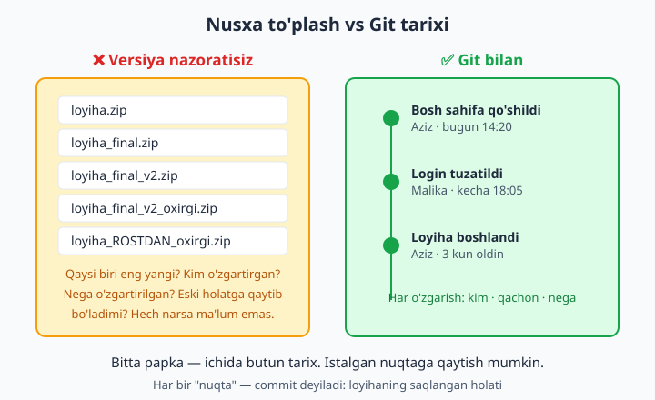
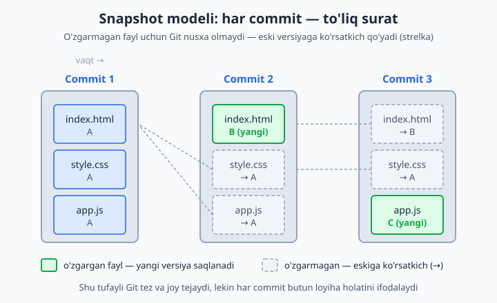
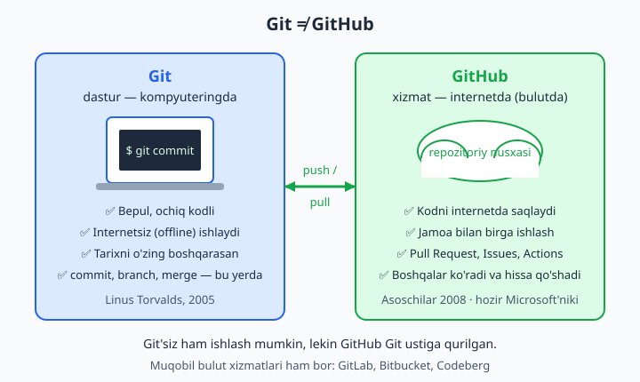

# 1 — Versiya nazorati nima?

[🏠 README](./README.md) · [Keyingi: 02 — Git'ni o'rnatish va sozlash ➡️](./02-git-ornatish-sozlash.md)

> **Bu bobda:** dasturchining eng keng tarqalgan og'rig'i — fayllarni `loyiha_final_v2_oxirgi.zip` deb saqlash, jamoada kim nimani buzganini bilmaslik va eski holatga qaytolmaslik muammosidan boshlaymiz. Keyin versiya nazorati (version control) nima ekanini — loyiha uchun bir xil "vaqt mashinasi" sifatida tushunamiz, Git'ning qayerdan kelgani va nima uchun bunchalik mashhurligini ko'ramiz, snapshot (surat) modelini, markazlashgan va taqsimlangan tizimlar farqini, eng muhimi — ko'pchilik chalkashtiradigan **Git va GitHub** o'rtasidagi farqni aniq ajratamiz. Bob oxirida `repository`, `commit`, `branch` atamalari bilan yuzaki tanishasiz.

---

## Muammo

Tasavvur qiling: siz uchta do'st bilan diplom loyihasi — do'kon saytini yozyapsiz. Hammasi bitta `dokon` papkasida. Bir hafta o'tib papka shu holatga keladi:

```text
dokon/
├── index.html
├── index_yangi.html
├── index_yangi_FINAL.html
├── loyiha_oxirgi.zip
├── loyiha_oxirgi_v2.zip
├── loyiha_oxirgi_v2_ROSTDAN_oxirgi.zip
└── Aziz_dan_kelgan_versiya.zip
```

Endi savollar boshlanadi:

- **Qaysi `index` eng yangi?** `_FINAL` mi, yoki `_yangi`mi? Hech kim aniq bilmaydi.
- **Kecha sayt ishlayotgan edi, bugun buzildi. Nima o'zgardi?** Aniqlash uchun fayllarni qator-qator qo'lda solishtirishga to'g'ri keladi.
- **Aziz "menikida ishlayapti" deydi, sizda esa yo'q.** Uning `.zip`ini ochib, o'z fayllaringiz ustiga ko'chirasiz — va o'zingizning ikki kunlik ishingiz yo'qoladi.
- **"Uch kun oldingi holatga qaytsak edi"** — lekin u holat hech qayerda saqlanmagan.

Bu chalkashlik tasodif emas. Bu — **versiya nazorati yo'qligining** tabiiy natijasi. Fayllarni qo'lda nusxalab nomlash hech qachon ishlamaydi, chunki u uchta savolga javob bera olmaydi: **kim** o'zgartirdi, **qachon** o'zgartirdi va **nega** o'zgartirdi.



Aynan shu muammoni hal qilish uchun **versiya nazorati tizimlari** (ingl. *Version Control System*, qisqacha **VCS**) yaratilgan.

## Versiya nazorati nima?

**Versiya nazorati** — bu loyihangiz fayllariga kiritilgan har bir o'zgarishni vaqt bo'yicha kuzatib boruvchi va saqlovchi tizim. Sodda qilib aytganda, bu loyihangiz uchun **vaqt mashinasi**.

Har safar ishingizning bir bosqichini saqlaganingizda (bu amalni keyinroq **commit** deb ataymiz), tizim quyidagilarni yozib qo'yadi:

| Nima saqlanadi | Misol |
|---|---|
| O'zgarish mazmuni | aynan qaysi fayl, qaysi qatorlar o'zgardi |
| **Kim** | Aziz Karimov |
| **Qachon** | 2026-06-10, soat 14:20 |
| **Nega** (izoh) | "Login sahifasidagi xato tuzatildi" |

Bu sizga uchta kuchli imkoniyat beradi:

- **📜 Tarix.** Loyiha boshidan to hozirgacha har bir qadamni ko'rasiz: "kim, qachon, nimani, nega" — hammasi yozilgan.
- **⏪ Qaytish.** Loyihaning istalgan eski holatiga bir buyruq bilan qaytishingiz mumkin. Hech narsa "yo'qolmaydi".
- **👥 Hamkorlik.** Bir necha kishi bir paytda, bir-birining ishini yo'qotmasdan, bitta loyihada ishlay oladi.

💡 Versiya nazorati faqat dasturchilar uchun emas. Kitob yozayotgan muallif, ilmiy maqola tayyorlayotgan talaba, hatto hujjat ustida ishlayotgan har qanday inson undan foyda ko'radi. Lekin u eng ko'p dasturlashda qo'llaniladi, chunki kod — ko'p odam bir paytda o'zgartiradigan, doimo o'sib boradigan matn.

📌 "Versiya nazorati" va "Git" — bir narsa emas. Versiya nazorati — bu **g'oya**, yondashuv. Git — shu g'oyani amalga oshiruvchi **aniq dastur**. Git'dan oldin ham (CVS, Subversion/SVN, Mercurial) va undan keyin ham boshqa tizimlar bor edi va bor. Lekin bugun "versiya nazorati" deganda amalda hamma Git'ni nazarda tutadi.

## Git nima va u qayerdan kelgan?

**Git** — bugungi kunda dunyodagi eng mashhur va eng ko'p ishlatiladigan versiya nazorati tizimi.

Uning tarixi qiziq. 2005-yilda **Linus Torvalds** — Linux operatsion tizimi yadrosining muallifi — katta muammoga duch keldi. Linux'ni butun dunyo bo'ylab minglab dasturchi birga ishlab chiqarardi va ular ishlatayotgan versiya nazorati tizimi (BitKeeper) bilan ziddiyat chiqdi. Torvalds o'ziga kerakli tizimni topa olmagach, **bor-yo'g'i bir necha hafta ichida o'zi yangisini yozdi** — Git ana shunday tug'ildi.

Torvalds Git oldiga uchta asosiy talab qo'ygan edi va aynan shular uni bunchalik kuchli qilgan:

- **Tezlik.** Git deyarli hamma amalni soniyaning ulushida bajaradi.
- **Ishonchlilik.** Saqlangan ma'lumot buzilmaydi — har bir holat maxsus "barmoq izi" (hash) bilan himoyalangan.
- **Taqsimlanganlik.** Har bir dasturchining kompyuterida loyihaning **butun tarixi** to'liq nusxasi turadi. Bu haqida birozdan keyin batafsil.

📌 "Git" so'zining o'zi maxsus qisqartma emas. Torvalds uni hazil bilan tanlagan (ingliz tilida bu so'z "qaysar, injiq odam" degan ma'noni ham beradi). Shuning uchun uni "Git" deb to'liq o'qiymiz — harflarini alohida aytmaymiz.

## Snapshot modeli — Git qanday saqlaydi?

Git'ni boshqa tizimlardan ajratib turadigan eng muhim g'oya — **snapshot** (o'zbekcha: *surat*) modeli.

Ko'pchilik tizimlar o'zgarishlarni shunday saqlaydi: "3-faylning 12-qatoriga `narx` so'zi qo'shildi, 40-qator o'chirildi". Ya'ni ular **farqlarni** (ingl. *diff*) saqlaydi.

Git boshqacha ishlaydi. Har safar commit qilganingizda, Git **butun loyihaning o'sha paytdagi holatini surat qiladi** — go'yo fotoapparatdan loyihaning rasmiga "chiq" etib tushiryapti. Har bir commit — loyihaning to'liq bir lahzasi.

Bu yerda mantiqiy savol tug'iladi: "Agar har safar butun loyiha saqlansa, joy juda tez to'lib ketmaydimi?" Yo'q. Chunki Git aqlli ish tutadi: **agar fayl oldingi commitga nisbatan o'zgarmagan bo'lsa, Git uning yangi nusxasini olmaydi — shunchaki avvalgi versiyasiga ko'rsatkich (havola) qo'yadi.**



Rasmda ko'rinib turibdi: 2-commitda faqat `index.html` o'zgargani uchun uning yangi versiyasi (B) saqlangan, `style.css` va `app.js` esa o'zgarmagani uchun eski versiyaga (A) ko'rsatkich qo'yilgan. Joy behuda sarflanmaydi, lekin har bir commit baribir butun loyihani ifodalaydi.

📌 Buni "o'z ko'zingiz bilan" ham ko'rsa bo'ladi. Keyingi boblarda biz quyidagiga o'xshash tekshiruvni o'tkazamiz: bir faylni ikki commit orasida o'zgartirmay qoldirib, uning ichki "barmoq izi"ni solishtirsak — ikkala commitda **bir xil** chiqadi. Bu Git haqiqatan ham nusxa olmay, ko'rsatkich qo'yganini isbotlaydi.

💡 Snapshot modelining amaliy foydasi: loyihaning istalgan eski holatiga qaytish darhol va to'liq bo'ladi. Git "12 ta o'zgarishni teskari hisoblab" o'tirmaydi — u shunchaki kerakli suratni oladi.

## Markazlashgan va taqsimlangan tizimlar

Versiya nazorati tizimlari ikki katta turga bo'linadi va Git nima uchun qulay ekanini tushunish uchun shu farqni bilish kerak.

**Markazlashgan tizimlar** (masalan, eski SVN) — barcha tarix faqat bitta markaziy serverda turadi. Sizning kompyuteringizda esa loyihaning faqat bitta — eng oxirgi — holati bo'ladi. Bu degani:

- ❌ Har bir amal (tarixni ko'rish, eski holatga qaytish) uchun serverga ulanish — ya'ni **internet** kerak.
- ❌ Server ishdan chiqsa yoki internet uzilsa, hech kim ishlay olmaydi.
- ❌ Server qurilmasi buzilsa, butun tarix bir zumda yo'qolishi mumkin.

**Taqsimlangan tizimlar** (Git aynan shunday) — loyihaning **butun tarixi** har bir dasturchining kompyuterida to'liq nusxalanadi. Bu degani:

- ✅ Commit qilish, tarixni o'qish, branch yaratish, eski holatga qaytish — hammasi **internetsiz**, lokal (kompyuteringizda) bajariladi va shuning uchun juda tez.
- ✅ Internet faqat boshqalar bilan **almashish** kerak bo'lganda ishlatiladi (push/pull — keyingi boblarda).
- ✅ Loyihaning to'liq nusxasi o'nlab kompyuterda turgani uchun ma'lumot deyarli yo'qolmaydi — har bir nusxa zaxira (backup) vazifasini ham bajaradi.

| Xususiyat | Markazlashgan (SVN) | Taqsimlangan (Git) |
|---|---|---|
| Tarix qayerda? | faqat serverda | har bir kompyuterda to'liq |
| Internetsiz ishlash | ❌ deyarli yo'q | ✅ to'liq ishlaydi |
| Tezlik | serverga bog'liq | lokal, juda tez |
| Zaxira (backup) | bitta nuqtada xavf | har nusxa zaxira |

📌 Boshlovchilar ko'pincha "Git bilan ishlash uchun internet kerak" deb o'ylaydi. Bu xato. Git'ning deyarli barcha kuchi — internetsiz, kompyuteringizda. Internet faqat ishingizni boshqalar bilan ulashganda kerak bo'ladi.

## Git va GitHub — bir narsa emas!

Bu — boshlovchilar eng ko'p chalkashtiradigan joy, shuning uchun alohida to'xtalamiz. **Git va GitHub butunlay boshqa narsa.**

- **Git** — bu kompyuteringizga o'rnatadigan **dastur** (xuddi Word yoki brauzer kabi). U sizning mashinangizda ishlaydi, tarixni boshqaradi, commit qiladi. Git bepul va ochiq kodli.
- **GitHub** — bu **internetdagi xizmat** (sayt: github.com). U sizning Git loyihangizning nusxasini bulutda saqlaydi va jamoa bilan ishlash uchun qulay vositalar (Pull Request, Issues, Actions) qo'shadi. GitHub'ni Microsoft kompaniyasi boshqaradi.



Eng oson o'xshatish: **Git — bu video o'yin, GitHub — uni saqlovchi va boshqalar bilan ulashish mumkin bo'lgan bulutli xizmat.** O'yinni internetsiz ham o'ynay olasiz (Git lokal ishlaydi), lekin natijani boshqalar bilan bo'lishish uchun bulutga yuklaysiz (GitHub'ga push qilasiz).

📌 Muhim nuqta: **Git'siz GitHub mavjud bo'la olmaydi**, chunki GitHub Git ustiga qurilgan. Lekin GitHub'siz Git ajoyib ishlaydi — siz bemalol faqat kompyuteringizda, internetsiz Git'dan foydalanishingiz mumkin.

💡 GitHub yagona variant emas. Xuddi shunday bulut xizmatlar bor: **GitLab**, **Bitbucket**, **Codeberg**. Ularning hammasi Git bilan ishlaydi. Biz bu kitobda GitHub'ni tanlaymiz, chunki u eng mashhur va o'rganishga eng qulay. Git'ni o'rgansangiz, qolganlariga o'tish oson bo'ladi.

| | Git | GitHub |
|---|---|---|
| Bu nima? | dastur | internetdagi xizmat (sayt) |
| Qayerda ishlaydi? | kompyuteringizda | bulutda (internetda) |
| Internet kerakmi? | yo'q | ha |
| Kim yaratgan? | Linus Torvalds (2005) | GitHub kompaniyasi (2008), hozir Microsoft'niki |
| Vazifasi | versiyalarni boshqarish | saqlash, ulashish, hamkorlik |

## Asosiy atamalar bilan tanishuv

Bob oxirida uchta so'z bilan yuzaki tanishib qo'yamiz. Hozir ularni yodlash shart emas — keyingi boblarda har birini amalda, qo'l bilan o'rganamiz. Hozircha shunchaki "tanish-bilish" bo'lib qo'ying:

- **Repository** (qisqacha **repo**, o'zbekcha *repozitoriy* yoki "ombor") — bu Git kuzatib turadigan **loyiha papkasi** va uning butun tarixi. Bitta repozitoriy = bitta loyiha. Aynan shu yerda barcha commitlar saqlanadi.
- **Commit** — loyihaning saqlangan **bir holati**, "surati". Har bir commit izoh, muallif va vaqt bilan birga yoziladi. Tasavvur qiling: o'yindagi "save point" (saqlash nuqtasi). Loyiha tarixi — ana shunday commitlar zanjiridan iborat.
- **Branch** (o'zbekcha *shox* yoki *tarmoq*) — tarixning alohida **shoxchasi**. U asosiy ishni buzmasdan, yangi g'oyani alohida sinab ko'rish imkonini beradi. Masalan, "yangi dizayn"ni alohida branch'da ishlab, tayyor bo'lgach asosiysiga qo'shasiz. Bu kuchli imkoniyatga keyin alohida bob bag'ishlaymiz.

📌 Bu atamalarni hozir to'liq tushunmasangiz — bu mutlaqo normal. Versiya nazorati "o'qib emas, qilib o'rganiladi". Keyingi bobdan boshlab Git'ni kompyuteringizga o'rnatamiz va birinchi haqiqiy commitimizni qilamiz — shunda bu so'zlar o'z-o'zidan tushunarli bo'lib qoladi.

## Xulosa

- Fayllarni `_final_v2_oxirgi` deb qo'lda nusxalash ishlamaydi: u **kim**, **qachon**, **nega** degan savollarga javob bermaydi va eski holatga qaytishga imkon bermaydi.
- **Versiya nazorati** — loyiha uchun vaqt mashinasi: har bir o'zgarish muallifi, vaqti va izohi bilan saqlanadi, istalgan nuqtaga qaytish mumkin.
- **Git** — bugungi eng mashhur versiya nazorati tizimi (Linus Torvalds, 2005); u **snapshot** modeli bilan ishlaydi — har commit butun loyiha holatini ifodalaydi, o'zgarmagan fayllarga esa ko'rsatkich qo'yadi.
- Git **taqsimlangan** tizim: butun tarix har bir kompyuterda turadi, shuning uchun **internetsiz** va tez ishlaydi.
- **Git** (dastur, kompyuteringizda) va **GitHub** (xizmat, internetda) — ikki boshqa narsa. Git'siz GitHub bo'lmaydi, lekin GitHub'siz Git bemalol ishlaydi.

Keyingi bobda Git'ni kompyuteringizga o'rnatamiz va birinchi marta sozlaymiz — amaliy ish boshlanadi.

## 1-bob mashqlari

Bu bobning mashqlari asosan kontseptual (qog'oz-qalam) — hali kompyuterda hech narsa o'rnatmaganmiz. Maqsad: tushunchalarni o'z hayotingizga bog'lab, mustahkam o'zlashtirish. Daftar oching va yozib boring.

1. So'nggi bir yilda o'zingiz duch kelgan **versiya muammosi**ni eslang va yozing: qachondir biror faylni `final`, `oxirgi`, `v2` deb nomladingizmi? Nima bo'ldi? Bu holatda versiya nazorati qanday yordam bergan bo'lardi?

2. O'z kompyuteringizdagi biror loyiha yoki hujjat papkasini oching. Ichida bir-biriga o'xshash nomli necha xil nusxa borligini sanang (masalan, `hisobot.docx`, `hisobot_yangi.docx`). Bu chalkashlik haqida bir-ikki jumla yozing.

3. Quyidagi atamalarni o'z ta'riflari bilan moslang (chiziq bilan bog'lang): **Git / GitHub / commit / repository / branch** — ta'riflar: (a) loyiha papkasi va uning tarixi, (b) kompyuterga o'rnatiladigan dastur, (c) loyihaning saqlangan bir holati, (d) internetdagi bulut xizmati, (e) tarixning alohida shoxchasi.

4. **Versiya nazorati** iborasini o'z so'zlaringiz bilan, bitta jumlada, do'stingizga tushuntiradigandek yozing (kitobdagi ta'rifga qaramasdan).

5. "Versiya nazorati — bu loyiha uchun vaqt mashinasi" o'xshatishini izohlang: vaqt mashinasining qaysi xususiyati versiya nazoratining qaysi imkoniyatiga to'g'ri keladi?

6. Versiya nazorati saqlaydigan uch narsani (kim, qachon, nega) yozing va har biri nima uchun foydali ekaniga bittadan misol keltiring.

7. **Snapshot (surat) modeli**ni o'z so'zlaringiz bilan tushuntiring: Git har commitda nimani saqlaydi?

8. Snapshot modelida o'zgarmagan fayl bilan nima bo'ladi? Nima uchun bu joy tejaydi-yu, lekin har commit baribir butun loyihani ifodalaydi?

9. Quyidagi gap to'g'rimi yoki xato: "Git har commitda har bir faylning yangi nusxasini saqlaydi". Javobingizni asoslang.

10. **Markazlashgan** va **taqsimlangan** versiya nazorati o'rtasidagi farqni jadval ko'rinishida (kamida 3 qator) chizing.

11. Internet butunlay yo'q vaziyatni tasavvur qiling. Git bilan qaysi amallarni baribir bajara olasiz, qaysilarini yo'q? Ro'yxat qiling.

12. Quyidagi gapdagi xatoni toping va to'g'rilang: "Git bilan ishlash uchun doim internet kerak, chunki commit serverga yuboriladi".

13. **Git** va **GitHub** farqini o'z so'zlaringiz bilan, kamida uchta jumlada tushuntiring (ta'riflarni yodlab emas, tushunib).

14. "Git — video o'yin, GitHub — uni saqlovchi bulut" o'xshatishiga o'zingizning yangi, boshqa bir o'xshatishingizni o'ylab toping (masalan, daftar va kutubxona, oshxona va restoran...).

15. Quyidagilarning qaysi biri **dastur**, qaysi biri **xizmat**: Git, GitHub, GitLab, Bitbucket? Har birini to'g'ri ustunga joylashtiring.

16. "GitHub'siz Git ishlay oladimi?" va "Git'siz GitHub mavjud bo'la oladimi?" — ikkala savolga javob bering va sababini yozing.

17. Quyidagi har bir holat uchun versiya nazorati **kerakmi yoki shart emasmi**ni baholang va sababini bir jumlada yozing: (a) bir kishilik blog matni, (b) 5 kishilik jamoaning mobil ilovasi, (c) bir martalik xarid ro'yxati, (d) yillar davomida o'sib boradigan diplom ishi.

18. Atrofingizdagi (oilangiz, kursdoshlaringiz yoki ishxonangizdagi) bir kishini tanlang va versiya nazorati uning ishida foyda berishi mumkinligini bir misol bilan ko'rsating.

19. Git'dan tashqari kamida ikkita boshqa versiya nazorati tizimi nomini yozing (bob matnidan toping) va bugun nima uchun ko'pchilik aynan Git'ni tanlashini bir-ikki jumlada izohlang.

20. Ushbu bobning eng muhim uchta g'oyasini (sizning fikringizcha) tanlang va har birini bittadan jumla bilan, o'zingizga eslatma sifatida yozib qo'ying — keyingi boblarga shu bilan kirib borasiz.
