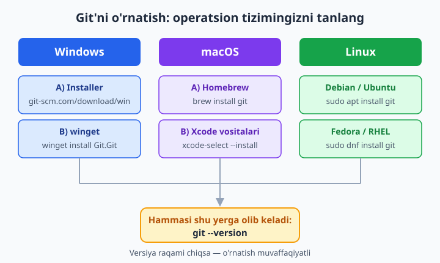
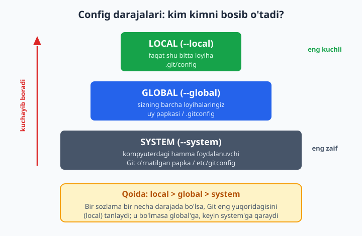
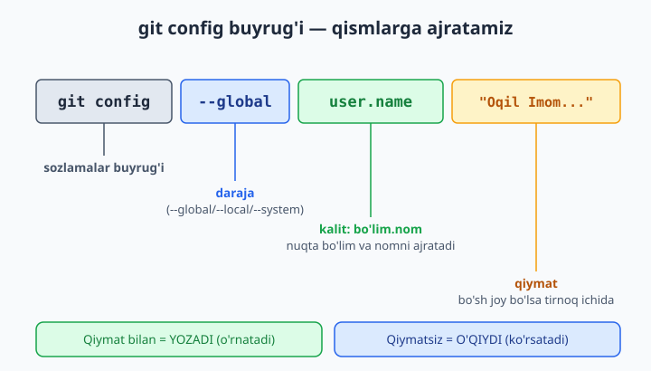

# 2 — Git'ni o'rnatish va sozlash

[⬅️ Oldingi: 01 — Versiya nazorati nima?](./01-versiya-nazorati-nima.md) · [🏠 README](./README.md) · [Keyingi: 03 — Birinchi repozitoriy va uch zona ➡️](./03-birinchi-repozitoriy.md)

> **Bu bobda:** kompyuteringizga Git'ni o'rnatamiz (Windows, macOS, Linux — har biri uchun alohida), terminal degan qora oynadan qo'rqmaslikni va undagi eng kerakli buyruqlarni (`pwd`, `cd`, `ls`/`dir`) o'rganamiz, Git'ga "men kimman" deb tanishtiramiz (`user.name` va `user.email` — har bir commit shu nom bilan imzolanadi), config'ning uch darajasi (system / global / local) qaysi biri qaysisini bosib o'tishini, default branch'ni `main` qilishni, sozlamalarni o'qishni (`git config --list`) va o'zingizga qisqa buyruqlar (alias) yaratishni ko'rib chiqamiz.

---

## Muammo

Tasavvur qiling: 1-bobda versiya nazorati nima ekanini va Git nega kerakligini o'qib chiqdingiz. Endi qo'lingiz qichishyapti — birinchi `git commit`'ni yozib ko'rgingiz keladi. Lekin terminalni ochib `git` deb yozsangiz, javob shunday bo'lishi mumkin:

```text
git: command not found
```

yoki Windows'da:

```text
'git' is not recognized as an internal or external command,
operable program or batch file.
```

Sababi oddiy: Git — bu **dastur**, xuddi brauzer yoki Word kabi. Uni avval o'rnatish kerak. O'rnatib bo'lgandan keyin esa Git'ga o'zingizni tanishtirishingiz shart — chunki har bir saqlagan o'zgarishingizga (commit) "buni kim yozdi?" degan imzo qo'yiladi. Imzosiz Git ishlamaydi.

Bu bob ana shu ikki ishni qiladi: **o'rnatish** va **sozlash**. Bir marta qilinadi, keyin yillar davomida shu sozlama bilan ishlaysiz.

📌 Bu bobda terminalga buyruqlar yozamiz, lekin hali hech qanday "loyiha" yaratmaymiz — u 3-bobda bo'ladi. Hozir maqsad: Git tayyor turishi va sizni tanishi.

---

## 1-qadam: Git'ni o'rnatish

Git uchun yagona rasmiy manba — [git-scm.com](https://git-scm.com). Operatsion tizimingizga qarab quyidagi bo'limlardan birini tanlang. Uchchalasini ham o'qish shart emas — faqat o'zingizniqini.



### Windows

Ikki yo'l bor, ikkalasi ham yaxshi:

**Yo'l A — installer (eng oson):**

1. [git-scm.com/download/win](https://git-scm.com/download/win) ga kiring — yuklab olish o'zi boshlanadi.
2. Yuklangan `.exe` faylni ishga tushiring.
3. O'rnatuvchi ko'p savol beradi — boshlovchi uchun **hamma joyda "Next"** tugmasini bosish kifoya. Standart sozlamalar to'g'ri tanlangan.
4. Oxirida "Install" → "Finish".

**Yo'l B — winget (buyruq orqali, tezroq):**

Windows 10/11'da `winget` degan dastur menejeri o'rnatilgan bo'ladi. PowerShell'ni ochib quyidagini yozing:

```text
winget install --id Git.Git -e
```

💡 Git installer'i bilan birga **Git Bash** degan maxsus terminal ham keladi. Bu — Windows'da Linux uslubidagi buyruqlar (`ls`, `pwd`) ishlaydigan qora oyna. Bu kitobdagi ko'p misollar Git Bash'da ham, oddiy PowerShell'da ham bir xil ishlaydi. Boshlanishiga **Git Bash**'dan foydalanishni tavsiya qilamiz — kitobdagi buyruqlarga aynan mos keladi.

### macOS

Eng oson yo'l — **Homebrew** (macOS uchun mashhur dastur menejeri):

```bash
brew install git
```

Agar Homebrew o'rnatilmagan bo'lsa, [brew.sh](https://brew.sh) dagi bitta buyruqni terminalga qo'ying — u o'zini o'rnatadi, keyin yuqoridagi buyruqni qayta yozing.

Homebrew o'rnatishni xohlamasangiz, Apple'ning developer vositalari bilan ham keladi:

```bash
xcode-select --install
```

📌 macOS'da "eski" Git allaqachon bo'lishi mumkin, lekin u juda eskirgan versiya bo'ladi. `brew install git` har doim eng yangisini beradi — shuni afzal ko'ring.

### Linux

Distributivingizning paket menejeridan foydalaning:

```bash
# Debian, Ubuntu, Mint:
sudo apt update
sudo apt install git

# Fedora, RHEL, CentOS:
sudo dnf install git

# Arch, Manjaro:
sudo pacman -S git
```

`sudo` — buyruqni administrator huquqi bilan bajaradi; parol so'rashi mumkin (yozayotganda ko'rinmaydi — bu normal).

---

## 2-qadam: O'rnatilganini tekshirish

Operatsion tizimdan qat'i nazar, tekshirish bitta buyruq bilan bo'ladi. Terminalni oching va yozing:

```bash
git --version
```

Natija taxminan shunday bo'lishi kerak (raqamlar sizda boshqacharoq bo'lishi mumkin — muhimi, xato emas, versiya chiqsa):

```text
git version 2.53.0
```

✅ Versiya raqami chiqdimi — tabriklaymiz, Git o'rnatildi.

❌ Hali ham `command not found` chiqsa: terminalni **butunlay yopib qaytadan oching** (o'rnatishdan keyin shu kerak bo'ladi), so'ng qayta urinib ko'ring. Yordam bermasa — o'rnatishni qaytadan bajaring.

📌 `--version` oldidagi ikki chiziq (`--`) — bu Git buyruqlarida juda ko'p uchraydi. U "uzun nomli sozlama" degani. Bittagina chiziq (`-v` kabi) — qisqa shakli. Ikkalasini ham bobning oxirida batafsil ko'ramiz.

---

## Terminal asoslari: qo'rqmaslikni o'rganamiz

Git'ning asosiy quvvati — terminalda. Ko'p boshlovchi aynan shu "qora oyna"dan qo'rqadi. Aslida unda atigi bir nechta buyruqni bilsangiz, o'zingizni baliq suvdagidek his qilasiz. Mana eng keraklilari:

| Buyruq | Vazifasi | Eslatma |
|---|---|---|
| `pwd` | Hozir qaysi papkadaman? | "print working directory" |
| `ls` | Shu papkada nima bor? | Windows PowerShell'da `dir` ham ishlaydi |
| `cd papka` | Papka ichiga kirish | "change directory" |
| `cd ..` | Bir papka yuqoriga chiqish | ikki nuqta — "ota papka" |
| `cd` (yolg'iz) | Uy (home) papkasiga qaytish | Windows'da `cd %USERPROFILE%` |
| `mkdir nom` | Yangi papka yaratish | "make directory" |
| `clear` | Ekranni tozalash | Windows'da `cls` |

Keling, ulardan birini sinab ko'ramiz. Terminalga `pwd` yozing:

```bash
pwd
```

```text
/c/Users/Aziz
```

Bu — siz hozir "Aziz" foydalanuvchisining uy papkasida turganingizni bildiradi. Endi shu papkadagi narsalarni ko'ramiz:

```bash
ls
```

```text
Desktop  Documents  Downloads  Music  Pictures
```

📌 Terminal har doim bitta papka "ichida" turadi — unga **joriy papka** (current directory) deyiladi. `git` buyruqlari ham aynan shu joriy papkada ishlaydi. Shuning uchun ish boshlashdan oldin `pwd` bilan "qayerdaman?" deb tekshirish — juda foydali odat.

💡 Terminalda **Tab** tugmasi — sehrli. Papka nomining bir-ikki harfini yozib Tab bossangiz, terminal qolganini o'zi to'ldiradi. `cd Down` deb Tab bosing — `cd Downloads/` bo'lib qoladi. Bu vaqtni va xatolarni kamaytiradi.

---

## 3-qadam: Git'ga o'zingizni tanishtirish (eng muhim sozlama)

Git'ning birinchi va eng muhim qoidasi: **har bir commit kim tomonidan yozilganini biladi**. Loyihada 10 kishi ishlasa, har kim o'z o'zgarishiga imzo qo'yadi. Shuning uchun Git'ga ikkita narsani aytishingiz shart — ismingiz va elektron pochtangiz:

```bash
git config --global user.name "Oqil Imomnazarov"
git config --global user.email "siz@example.com"
```

📌 Ismni **tirnoq ichida** yozing, agar bo'sh joy bo'lsa (ism va familiya orasida) — tirnoqsiz Git ularni ikki alohida narsa deb o'ylaydi. Email'da bo'sh joy yo'q, lekin tirnoq ichida yozish baribir xavfsiz odat.

💡 Email sifatida GitHub'da ro'yxatdan o'tadigan pochtangizni yozing (GitHub'ni 10-bobda ochamiz). Shunda kelajakda commitlaringiz GitHub'dagi profilingizga avtomatik bog'lanadi. Hali GitHub yo'q bo'lsa — hozir oddiy pochtangizni yozing, keyin o'zgartirsa bo'ladi.

Yozganingizni tekshiramiz:

```bash
git config --global user.name
```

```text
Oqil Imomnazarov
```

✅ Ism qaytib chiqdimi — Git endi sizni taniydi. Bu sozlamani bir marta qilasiz, u butun kompyuteringizdagi barcha loyihalar uchun amal qiladi.

❌ Agar bu sozlamani **qilmasdan** commit yozmoqchi bo'lsangiz, Git ogohlantirish beradi:

```text
Author identity unknown
*** Please tell me who you are.
```

Demak, bu sozlama ixtiyoriy emas — Git ishlashi uchun **majburiy**.

---

## Config darajalari: system, global, local

Yuqorida `--global` so'zini ishlatdik. Bu — sozlamaning **darajasi**. Git'da sozlamalar uch darajada saqlanadi va ular bir-birini bosib o'tadigan tartibga ega. Buni tushunish — Git bilan ishonchli ishlashning kalitlaridan biri.



| Daraja | Bayroq | Qayerda saqlanadi | Kimga ta'sir qiladi |
|---|---|---|---|
| **system** | `--system` | Git o'rnatilgan papkada (umumiy) | Shu kompyuterdagi **hamma foydalanuvchi** |
| **global** | `--global` | Uy papkangizda `.gitconfig` | **Sizning** barcha loyihalaringiz |
| **local** | `--local` | Loyiha ichida `.git/config` | **Faqat shu bitta** loyiha |

**Eng muhim qoida — ustuvorlik:**

```text
local  >  global  >  system
(eng kuchli)        (eng zaif)
```

Ya'ni: agar bitta sozlama uch joyda ham boshqacha qiymatga ega bo'lsa, Git **eng quyi** (local) darajadagisini tanlaydi. Local bo'lmasa — global'ga qaraydi. U ham bo'lmasa — system'ga.

**Nima uchun bu foydali?** Aytaylik, ishxonangizda ishchi pochtangiz (`oqil@kompaniya.uz`) bilan commit qilasiz, uyda esa shaxsiy pochtangiz bilan. Global'da shaxsiy pochtangizni qo'yasiz, ish loyihasida esa **local** sozlama bilan ishchi pochtani qo'yasiz:

```bash
# Uy papkangizda — global (sukut bo'yicha):
git config --global user.email "oqil.shaxsiy@gmail.com"

# Ish loyihasi ichida turib — faqat shu loyiha uchun:
git config --local user.email "oqil@kompaniya.uz"
```

Ish loyihasida local global'ni bosib o'tadi — o'sha loyihadagi commitlar ishchi pochta bilan imzolanadi, qolgan hamma joyda esa shaxsiy pochta ishlaydi.

📌 `--local` sozlama faqat loyiha (repozitoriy) ichida turib ishlaydi. Repozitoriydan tashqaridagi (bo'sh) papkada `git config --local ...` yozsangiz, Git aynan shu xatoni beradi: `fatal: --local can only be used inside a git repository` — chunki saqlash uchun `.git` papka kerak (u 3-bobda paydo bo'ladi).

💡 Hech qaysi bayroqni yozmasangiz, Git **local**ni nazarda tutadi (loyiha ichida bo'lsangiz). Boshlovchi uchun maslahat: shaxsiy kompyuteringizdagi umumiy sozlamalar uchun doim `--global` ishlating — chalkashlik kam bo'ladi.

---

## Git config buyrug'ining anatomiyasi

`git config` buyrug'ini tez-tez ishlatamiz, shuning uchun uning qismlarini ajratib tushunaylik:



```bash
git config --global user.name "Oqil Imomnazarov"
#   |        |        |         |
#   |        |        |         +-- qiymat (value): nima yozmoqchimiz
#   |        |        +------------ kalit (key): nimani sozlayapmiz
#   |        +--------------------- daraja: qaysi darajaga (--global/--local/--system)
#   +------------------------------ sozlamalar buyrug'i
```

- **Kalit** ikki qismdan iborat: `bo'lim.nom` (masalan `user.name`, `core.editor`, `init.defaultBranch`). Nuqta — bo'lim bilan nomni ajratadi.
- **Qiymatsiz** yozsangiz (`git config --global user.name`) — Git hozirgi qiymatni **o'qib** chiqaradi.
- **Qiymat bilan** yozsangiz — yangi qiymatni **yozadi** (eskisini almashtiradi).

Sozlamani butunlay **o'chirish** uchun `--unset` ishlatiladi:

```bash
git config --global --unset user.name
```

---

## Foydali standart sozlamalar

Ismni sozlab bo'ldik. Hozir bir marta qilib qo'yiladigan yana bir nechta foydali sozlamani ko'ramiz.

### Default branch nomini `main` qilish

Har bir yangi loyiha bitta asosiy "shox" (branch — kodingizning asosiy yo'nalishi, 7-bobda batafsil) bilan boshlanadi. Eski Git'da bu shox `master` deb nomlanardi, hozir butun dunyo `main`ga o'tdi. GitHub ham yangi loyihalarda `main` ishlatadi. Ikkalasini moslab qo'yamiz:

```bash
git config --global init.defaultBranch main
```

Buni qilmasangiz, eski o'rnatishlarda yangi loyiha `master` bilan ochiladi va keyin GitHub bilan mos kelmay chalkashlik chiqishi mumkin. Bir marta `main` qilib qo'ying — tinch bo'ladi.

📌 Tekshirish: `git config --global init.defaultBranch` → `main` qaytishi kerak.

### Matn muharririni tanlash

Git ba'zan sizdan matn yozishni so'raydi (masalan commit izohi). Standart holatda u eski `vim` muharririni ochadi — boshlovchini qo'rqitadigan dastur (undan chiqish ham alohida ilm). Agar VS Code o'rnatgan bo'lsangiz, Git'ni unga yo'naltiring:

```bash
git config --global core.editor "code --wait"
```

`--wait` — Git VS Code'da yozib bo'lguningizni kutadi degani. VS Code yo'q bo'lsa, hozircha bu sozlamani o'tkazib yuboring — keyin ham qilsa bo'ladi.

💡 Vim ochilib qolsa va undan chiqib ketolmasangiz: `Esc` tugmasini bosing, so'ng `:q!` deb yozib `Enter` bosing. Bu — "o'zgarishsiz chiqib ket" buyrug'i. Bu kichik hiyla ko'plab dasturchini qutqargan.

### Windows: qatorlar tugashi (core.autocrlf)

Bu — faqat Windows foydalanuvchilari uchun nozik tafsilot. Windows va Linux/macOS matn fayllarida "qator tugadi" belgisini boshqacha yozadi (Windows: CRLF, boshqalari: LF). Bu jamoaviy ishda chalkashlik tug'dirishi mumkin. Git buni avtomatik to'g'rilab turishi uchun:

```bash
# Windows uchun:
git config --global core.autocrlf true

# macOS / Linux uchun:
git config --global core.autocrlf input
```

📌 Yaxshi yangilik: Windows'dagi Git installer'i `core.autocrlf true`ni odatda **o'zi** qo'yib beradi. Tekshirib ko'ring — `git config --get core.autocrlf` → `true` chiqsa, hech narsa qilish shart emas.

---

## Sozlamalarni o'qish: git config --list

Hamma sozlamalaringizni bir joyda ko'rish uchun:

```bash
git config --list
```

```text
user.name=Oqil Imomnazarov
user.email=oqil@example.com
init.defaultbranch=main
core.autocrlf=true
core.editor=code --wait
```

Bu ro'yxat uch darajaning **hammasini** birga ko'rsatadi. Qaysi sozlama qaysi fayldan kelganini bilmoqchi bo'lsangiz, `--show-origin` qo'shing:

```bash
git config --list --show-origin
```

```text
file:C:/Program Files/Git/etc/gitconfig   core.autocrlf=true
file:C:/Users/Aziz/.gitconfig             user.name=Oqil Imomnazarov
file:C:/Users/Aziz/.gitconfig             user.email=oqil@example.com
file:.git/config                          user.email=oqil@kompaniya.uz
```

Endi har bir sozlama qaysi darajadan (system / global / local) kelayotgani ko'rinib turibdi — bu sozlamalar bir-birini bosib o'tganda chalkashlikni hal qilishda juda asqotadi.

💡 Bitta sozlamaning amaldagi qiymatini tezda bilish uchun `--get` ishlating: `git config --get user.email`. Bu — ustuvorlik qoidasini hisobga olib, **g'olib** qiymatni qaytaradi.

---

## Alias — o'zingizga qisqa buyruqlar

Kelajakda `git status`, `git log`, `git checkout` kabi buyruqlarni kuniga o'nlab marta yozasiz. Uzun buyruqlarga qisqa nom (alias — taxallus) berib qo'yish mumkin:

```bash
git config --global alias.st status
git config --global alias.co checkout
git config --global alias.br branch
git config --global alias.lg "log --oneline --graph --all"
```

Endi `git status` o'rniga shunchaki `git st` yozasiz:

```bash
git st
```

`git st` — aynan `git status` kabi ishlaydi. `git lg` esa tarixingizni chiroyli shoxchalar bilan ko'rsatadi (log buyrug'ini 5-bobda, branch'larni 7-bobda batafsil o'rganamiz — hozir shunchaki alias mexanikasini tushunsangiz kifoya).

📌 Alias'lar — sof qulaylik uchun. Ular Git'ning ishlashiga ta'sir qilmaydi, faqat sizning yozuvingizni qisqartiradi. Boshqa kompyuterda alias'laringiz bo'lmaydi (chunki ular global config'ingizda), shuning uchun asl buyruqlarni ham bilib turish kerak.

💡 Mashhur alias'lar internetda ko'p, lekin boshlovchiga maslahat: **o'zingiz tez-tez yozadigan** buyruqlarni alias qiling, birovning ro'yxatini ko'r-ko'rona ko'chirmang. Har bir alias — sizning real ehtiyojingizdan kelib chiqsin.

---

## Yordam olish: git help

Birorta buyruqni unutib qo'ysangiz yoki uning barcha imkoniyatlarini bilmoqchi bo'lsangiz, Git'ning o'zida to'liq qo'llanma bor:

```bash
git help config
# yoki qisqaroq:
git config --help
```

Bu brauzerda yoki terminalda shu buyruqning rasmiy hujjatini ochadi. Faqat qisqa eslatma kerak bo'lsa:

```bash
git config -h
```

(kichik `-h`) — buyruqning asosiy variantlarini terminalga qisqa ro'yxat qilib chiqaradi.

💡 "Qaysi buyruq bor edi?" deb esdan chiqarsangiz, shunchaki `git help` yozing — eng ko'p ishlatiladigan buyruqlar ro'yxati chiqadi. Git'ning o'zi — eng yaxshi shpargalkangiz.

---

## Hammasini bir joyda: sozlash tekshirlist

Yangi kompyuterda Git'ni birinchi marta sozlayotganingizda mana shu ketma-ketlikni bajarsangiz, hamma narsa joyida bo'ladi:

```bash
# 1. O'rnatilganini tekshirish:
git --version

# 2. Kim ekaningizni aytish (MAJBURIY):
git config --global user.name "Ism Familiya"
git config --global user.email "siz@example.com"

# 3. Default branch — main:
git config --global init.defaultBranch main

# 4. Matn muharriri (VS Code bo'lsa):
git config --global core.editor "code --wait"

# 5. Tekshirish — hammasi joyidami?
git config --list
```

✅ Shu besh qadam bajarildimi — Git to'liq tayyor. Endi 3-bobda birinchi haqiqiy loyihangizni yaratamiz.

---

## 2-bob mashqlari

> 💡 Bu mashqlarda hech narsani "buzib" qo'yishdan qo'rqmang — config sozlamalarini istalgancha o'zgartirib, qaytarib qo'yish mumkin. Eng yaxshi o'rganish — sinash.

1. Terminalni oching va `git --version` yozing. Natijani o'qing: sizda Git'ning qaysi versiyasi o'rnatilgan?
2. Agar Git o'rnatilmagan bo'lsa, operatsion tizimingizga mos yo'l bilan o'rnating (Windows: installer yoki `winget`; macOS: `brew`; Linux: `apt`/`dnf`). O'rnatib bo'lib, terminalni yopib qayta oching va `git --version` bilan tekshiring.
3. Terminalda `pwd` yozib, hozir qaysi papkada turganingizni aniqlang. So'ng `ls` (yoki Windows'da `dir`) bilan o'sha papkada nima borligini ko'ring.
4. `cd` buyrug'i bilan biror papka ichiga kiring, `pwd` bilan tekshiring, so'ng `cd ..` bilan orqaga qayting.
5. `git config --global user.name` yozib, hozir qanday ism qo'yilganini ko'ring. Bo'sh bo'lsa — hali sozlanmagan degani.
6. O'zingizning ism-familiyangizni `git config --global user.name "..."` bilan sozlang. Tirnoqni unutmang.
7. O'zingizning elektron pochtangizni `git config --global user.email "..."` bilan sozlang. Keyin ikkalasini ham o'qib, to'g'ri yozilganini tasdiqlang.
8. `git config --global init.defaultBranch main` buyrug'ini bajaring. So'ng `git config --global init.defaultBranch` bilan natijani tekshiring — `main` qaytdimi?
9. `git config --list` yozing va chiqqan barcha sozlamalarni o'qib chiqing. Ularning har birini tanidingizmi?
10. `git config --list --show-origin` yozing. Qaysi sozlama qaysi fayldan (system / global / local) kelayotganini aniqlang.
11. `core.autocrlf` qiymatini `git config --get core.autocrlf` bilan tekshiring. Windows'da `true` bo'lishi kerak — agar bo'lmasa, mos qiymatga sozlang.
12. `git config --global user.name "Sinov Nomi"` bilan ismni vaqtincha o'zgartiring, `--list` bilan tekshiring, so'ng asl ismingizni qaytarib qo'ying.
13. `git config --global --unset` bilan biror sinov sozlamasini o'chirib ko'ring (avval `git config --global sinov.kalit "qiymat"` bilan yarating, keyin o'chiring).
14. O'zingizga `st` degan alias yarating: `git config --global alias.st status`. Keyin uning config'da saqlanganini `git config --global --get alias.st` bilan tasdiqlang.
15. Yana ikkita alias yarating: `co` (checkout uchun) va `lg` (`log --oneline --graph` uchun). `git config --list` da ularning paydo bo'lganini ko'ring.
16. `git help config` yoki `git config --help` buyrug'ini ishga tushiring. Ochilgan qo'llanmadan `--unset` haqida qisqa ma'lumot toping.
17. `git config -h` (kichik `-h`) yozing va chiqqan qisqa ro'yxatni `git config --help` bilan solishtiring — farqi nimada?
18. VS Code o'rnatilgan bo'lsa, `git config --global core.editor "code --wait"` bilan muharrirni sozlang va `git config --global core.editor` bilan tekshiring.
19. Uy papkangizdagi `.gitconfig` faylini matn muharririda (yoki `git config --list --show-origin` orqali manzilini topib) oching. Ichidagi yozuvlar siz terminalda kiritgan sozlamalarga mos kelishini ko'ring.
20. Tasavvur qiling: bir ish loyihasida boshqa email bilan commit qilmoqchisiz. Global email'ingiz qanday, va uni qaysi daraja (local) bilan, qaysi buyruq bilan faqat bitta loyiha uchun o'zgartirgan bo'lardingiz? Buyruqni qog'ozga (yoki izoh sifatida) yozib, ustuvorlik qoidasini (`local > global > system`) o'z so'zlaringiz bilan tushuntiring.
