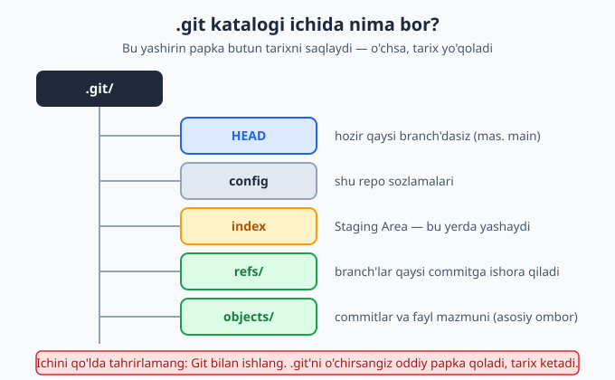
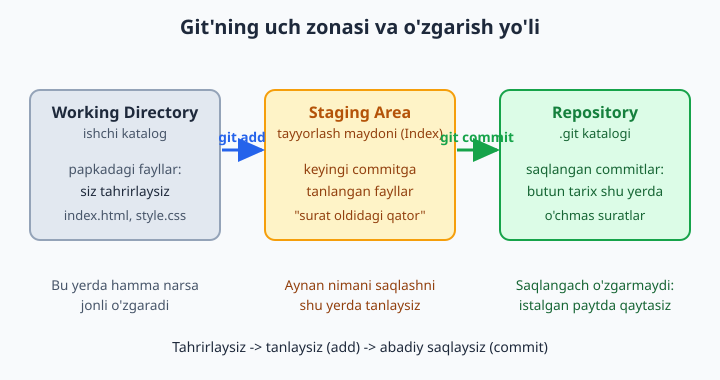
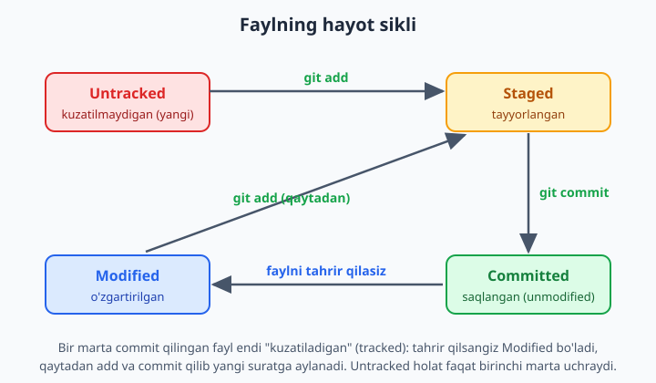

# 3 — Birinchi repozitoriy va uch zona

[⬅️ Oldingi: 02 — Git'ni o'rnatish va sozlash](./02-git-ornatish-sozlash.md) · [🏠 README](./README.md) · [Keyingi: 04 — O'zgarishlarni saqlash: add va commit ➡️](./04-add-commit.md)

> **Bu bobda:** oddiy papkani Git kuzatadigan **repozitoriy**ga (repository — loyiha tarixi saqlanadigan joy) aylantirishni o'rganamiz: `git init` nima qilishini va u yaratgan yashirin `.git` katalogining ichida nima borligini ko'ramiz. Keyin butun kitobning eng muhim modelini — **uch zona**ni (Working Directory, Staging Area, Repository) tushunamiz. Faylning hayot siklini (untracked → staged → committed → modified) qadam-baqadam kuzatamiz va bularning hammasini bizga ko'rsatib turadigan `git status` buyrug'ini o'qishni mashq qilamiz.

---

## Muammo

Tasavvur qiling: kompyuteringizda `mening-saytim` degan papka bor, ichida `index.html` fayli yotibdi. Siz uni tahrirlaysiz, saqlaysiz, yana tahrirlaysiz. Bir hafta o'tib "kechagi ishlaydigan variant qani edi?" deb o'ylab qolasiz — lekin papkada faqat **hozirgi** holat turibdi, kechagisi yo'q. `index-eski.html`, `index-eski2.html`, `index-oxirgi-ishlaydigan.html` kabi nusxalar yasash esa bir necha kundan keyin chalkashlikka aylanadi.

2-bobda Git'ni o'rnatib, ismingiz va emailingizni sozlab oldik. Lekin Git hali bu papkani **bilmaydi** — u oddiy papka, xuddi boshqalari kabi. Git papkangizni kuzatishi, har bir saqlangan holatni eslab qolishi uchun avval papkani **repozitoriy**ga aylantirishimiz kerak. Mana shu bobda aynan shuni qilamiz va Git ichida fayllar qanday "zonalar" orqali harakatlanishini ko'ramiz — bu model kitobning qolgan hamma boblari uchun poydevor bo'ladi.

## Papkani repozitoriyga aylantirish: `git init`

Avval ish uchun bo'sh papka yaratamiz va ichiga kiramiz. Quyidagilar buyruq qatorida (terminal) yoziladi:

```bash
mkdir mening-saytim
cd mening-saytim
```

📌 `mkdir` — "make directory" (papka yarat), `cd` — "change directory" (papkaga kir). Bu Git buyruqlari emas, oddiy terminal buyruqlari. Windows'da Git Bash'da ham xuddi shunday ishlaydi.

Endi sehrli buyruq:

```bash
git init
```

Natija:

```text
Initialized empty Git repository in C:/.../mening-saytim/.git/
```

Tabriklaymiz — papkangiz endi **repozitoriy**! `git init` ("initialize" — boshlang'ich holatga keltirish) papka ichida `.git` degan **yashirin katalog** yaratdi. Mana shu katalogning borligi papkani oddiy papkadan repozitoriyga ajratib turadi: bundan keyin Git shu papkadagi o'zgarishlarni kuzata oladi.

💡 `git init` ni faqat **bir marta** — loyihaning eng boshida bajariladi. Keyin u papkada qayta-qayta yozish shart emas (va zararli ham).

📌 **Branch nomi haqida — muhim aniqlik:** Git **standart bo'yicha hali ham** `master` nomli branch (shox) yaratadi — bu Git'ning ichiga o'rnatilgan qadimiy default va u o'zgargani yo'q. Lekin biz 2-bobda `git config --global init.defaultBranch main` deb sozlab qo'yganmiz, shuning uchun **sizning kompyuteringizda** `git init` `main` yaratadi va quyida `On branch main` ko'rasiz. Agar 2-bobni o'tkazib yuborgan yoki yangi mashinada ishlayotgan bo'lsangiz, `master` chiqishi mumkin — bunda chalkashmang, bir marta `git config --global init.defaultBranch main` yozib qo'ying (mavjudligini `git config --global init.defaultBranch` bilan tekshirasiz: bo'sh chiqsa, hali sozlanmagan). Eski papkadagi `master`'ni `main`'ga o'zgartirish uchun esa `git branch -M main` ishlatiladi.

## `.git` katalogini topish

`.git` "yashirin" deyilishiga sabab — nomi nuqta bilan boshlanadi, shuning uchun oddiy `ls` yoki fayl menejeri uni ko'rsatmaydi. Ko'rish uchun:

```bash
ls -a
```

`-a` ("all" — hammasi) yashirin fayllarni ham ko'rsatadi. Natijada `.git` papkasini ko'rasiz. Uning ichiga ham qarab qo'yaylik:

```bash
ls .git
```

```text
HEAD
config
description
hooks
info
objects
refs
```

Hozircha bu nomlar tushunarsiz — bu normal. Eng muhimlarini bilib qo'yaylik:

| Element | Vazifasi |
|---|---|
| `HEAD` | Hozir qaysi branch'da turganingizni ko'rsatadi (ichida `ref: refs/heads/main` deb yozilgan — 2-bobni o'tkazib yuborgan bo'lsangiz `refs/heads/master`) |
| `config` | Aynan shu repozitoriyning sozlamalari |
| `objects/` | **Asosiy ombor** — commitlar va fayl mazmuni shu yerda saqlanadi |
| `refs/` | Branch'lar qaysi commitga ishora qilishi |
| `index` | Staging Area (keyinroq, birinchi `git add`'dan keyin paydo bo'ladi) |



❌ **`.git` ni o'chirmang va ichini qo'lda tahrirlamang!** Bu katalog — loyihangizning butun xotirasi. Agar uni o'chirsangiz, papka oddiy papkaga aylanadi va saqlangan barcha tarix yo'qoladi (qaytarib bo'lmaydi). Git bilan ishlash uchun har doim `git ...` buyruqlaridan foydalaning, fayllarga to'g'ridan-to'g'ri tegmang.

## Kitobning eng muhim modeli: uch zona

Endi butun Git'ni tushunishning kalitiga keldik. Git'da fayllaringiz uchta "zona"da yashashi mumkin. Bu modelni bir marta yaxshilab tushunsangiz, keyingi hamma narsa osonlashadi.



1. **Working Directory** (ishchi katalog) — bu siz ko'rib, tahrir qiladigan oddiy papka. Hozir `index.html` yozsangiz, u shu yerda paydo bo'ladi. Bu yerda hamma narsa "jonli" — istalgancha o'zgartirasiz.

2. **Staging Area** (tayyorlash maydoni; `index` deb ham ataladi) — bu "surat oldidagi qator". Bu yerga keyingi saqlashga (commit) **aynan qaysi o'zgarishlarni** kiritmoqchi ekaningizni tanlab qo'yasiz. Hamma o'zgarishni emas, faqat tayyorlarini tanlash mumkin.

3. **Repository** (`.git` katalogi) — bu yerda **saqlangan suratlar** (commitlar) abadiy yotadi. Bu zonaga tushgan narsa loyiha tarixiga aylanadi va istalgan paytda unga qaytib borishingiz mumkin.

Bu zonalar orasida fayllar ikkita buyruq orqali harakatlanadi:

- `git add` — faylni **Working Directory'dan Staging Area'ga** ko'chiradi ("buni keyingi suratga qo'sh").
- `git commit` — Staging Area'dagi hamma narsani **Repository'ga** yozadi ("surat ol va abadiy saqla").

💡 Uy quvonchini fotosessiyaga o'xshating: Working Directory — butun xona (hamma narsa harakatda). Staging Area — kadrga kim turishini tanlash (suratga tushadiganlarni saralaysiz). Commit — tugmani bosib, **suratni abadiy saqlash**. Surat olingach o'zgarmaydi — xuddi commit kabi.

## Faylning hayot sikli va `git status`

Endi nazariyani amalda ko'ramiz. Yangi fayl yaratamiz va uning Git ko'zida qanday "holatlar"dan o'tishini kuzatamiz. Bu sayohatda bizga doimiy hamroh — `git status` buyrug'i. U har doim aytib turadi: "fayllaring qaysi zonada, nima qilishing kerak".



### 1-holat: untracked (kuzatilmaydigan)

Papkaga yangi fayl yaratamiz:

```bash
echo "Salom, Git!" > index.html
```

📌 `echo "..." > fayl` — qavs ichidagi matnni faylga yozadi. Albatta, faylni oddiy matn muharririda ham yaratishingiz mumkin — natija bir xil.

Endi holatni so'raymiz:

```bash
git status
```

```text
On branch main

No commits yet

Untracked files:
  (use "git add <file>..." to include in what will be committed)
        index.html

nothing added to commit but untracked files present (use "git add" to track)
```

Git aytyapti: "`index.html` degan **Untracked** (kuzatilmaydigan) fayl bor". Ya'ni fayl Working Directory'da yotibdi, lekin Git uni hali tarixda kuzatmayapti — u yangi, Git uni "ko'rgan", ammo hali e'tiborga olmagan. E'tibor bering, Git'ning o'zi yo'l-yo'riq beryapti: *"use git add ..."* — "kuzatish uchun `git add` ishlating".

💡 `git status`'ni tez-tez yozing — bu uyat emas, balki yaxshi odat. Tajribali dasturchilar ham har bir qadamdan keyin status tekshiradi. Qisqa variantni ko'rish uchun `git status -s` (yoki `--short`) ishlating:

```text
?? index.html
```

`??` — "bu fayl haqida Git hech narsa bilmaydi" degani (untracked).

### 2-holat: staged (tayyorlangan)

Endi faylni Staging Area'ga qo'shamiz:

```bash
git add index.html
git status
```

```text
On branch main

No commits yet

Changes to be committed:
  (use "git rm --cached <file>..." to unstage)
        new file:   index.html
```

Mana o'zgarish! Endi fayl **"Changes to be committed"** ("commit qilinadigan o'zgarishlar") ro'yxatida — ya'ni **staged**. U Working Directory'dan Staging Area'ga ko'chdi. `new file: index.html` — "bu yangi fayl, keyingi commitga tayyor". Qisqa shaklda:

```text
A  index.html
```

`A` ("Added") yashil rangda chap tomonda — fayl tayyorlangan degani.

📌 **Muhim nuqta:** `git add` faylning aynan **hozirgi holatini** Staging'ga oladi. Agar add'dan keyin faylni yana tahrirlasangiz, yangi o'zgarish avtomatik staging'ga tushmaydi — uni qaytadan `git add` qilish kerak. Buni 4-bobda batafsil ko'ramiz.

💡 Windows'da `git add` paytida bunday ogohlantirish chiqishi mumkin: `warning: ... LF will be replaced by CRLF ...`. Bu xato emas — Git fayl satr oxiri belgilarini Windows uslubiga moslashtirayotgani haqida xabar beryapti. Hozircha e'tibor bermasangiz ham bo'ladi.

### 3-holat: committed (saqlangan)

Endi suratni olamiz — Staging'dagini Repository'ga yozamiz:

```bash
git commit -m "Birinchi commit: index.html qoshildi"
git status
```

📌 `-m` ("message" — xabar) commitga qisqacha izoh biriktiradi: "bu suratda nima o'zgardi". Izoh majburiy — uni yozmasangiz, Git matn muharririni ochib so'raydi. Yaxshi izoh kelajakdagi o'zingizga (va jamoadoshlaringizga) yordam beradi.

`git status` natijasi:

```text
On branch main
nothing to commit, working tree clean
```

**"working tree clean"** ("ishchi katalog toza") — bu eng tinch xabar: Working Directory bilan oxirgi commit bir xil, saqlanmagan o'zgarish yo'q. Faylimiz endi **committed** holatda — Repository'ga abadiy yozildi.

Saqlanganini ko'rish uchun tarixga qaraymiz:

```bash
git log --oneline
```

```text
a1b2c3d Birinchi commit: index.html qoshildi
```

Chapdagi `a1b2c3d` — commit'ning noyob identifikatori (**hash**). Bu yerda misol uchun shunday yozildi; sizning kompyuteringizda boshqacha, haqiqiy hash chiqadi — har bir commit uchun u o'ziga xos va takrorlanmas bo'ladi. `git log`'ni keyingi boblarda batafsil o'rganamiz.

### 4-holat: modified (o'zgartirilgan)

Endi faylni biroz tahrirlaymiz — saytimizga sarlavha qo'shamiz:

```bash
echo "<h1>Mening saytim</h1>" >> index.html
git status
```

📌 Diqqat: bu safar `>>` (ikkita belgisi) ishlatdik — u faylni o'chirib qayta yozmaydi, balki **oxiriga qo'shadi**. Bitta `>` esa faylni butunlay o'chirib, yangidan yozadi.

```text
On branch main
Changes not staged for commit:
  (use "git add <file>..." to update what will be committed)
  (use "git restore <file>..." to discard changes in working directory)
        modified:   index.html

no changes added to commit (use "git add" and/or "git commit -a")
```

Endi fayl **modified** (o'zgartirilgan) holatda. Bu untracked'dan farq qiladi: Git faylni allaqachon biladi (avval commit qilingan), shunchaki uning yangi versiyasi oxirgi suratdan farq qilyapti. Qisqa shaklda:

```text
 M index.html
```

Bu yerda `M` ("Modified") **o'ngdan** ikkinchi ustunda turibdi — ya'ni o'zgarish Working Directory'da, hali staging'ga olinmagan. (Agar `git add` qilsangiz, `M` chapga, yashil ustunga ko'chadi.)

📌 Diqqat bilan qarang: `git status` har safar pastda **keyingi qadamni** taklif qildi — *"use git add"*, *"use git restore"*. Bu xabarlarni o'qishni o'rgansangiz, Git sizning yo'lboshchingizga aylanadi. Yangi boshlovchilar ko'pincha xatolardan qo'rqadi; aslida `git status` deyarli har doim nima qilish kerakligini aytib turadi.

### Tsikl yopiladi

Faylni yana saqlamoqchi bo'lsak, xuddi shu yo'lni takrorlaymiz: `git add` (modified → staged) keyin `git commit` (staged → committed). Mana shu — **add va commit** — kundalik ishingizning asosiy ritmi bo'ladi. Keyingi bobda aynan shu ikki buyruqni chuqurroq o'rganamiz.

## Bir nechta fayl: status'ni o'qish mashqi

Real loyihada papkada bir nechta fayl bo'ladi va ular turli holatlarda turishi mumkin. Buni ko'rish uchun ikkita yangi fayl qo'shamiz va faqat bittasini staging'ga olamiz:

```bash
echo "body { color: navy; }" > style.css
echo "console.log('salom');" > app.js
git add style.css
git status -s
```

```text
 M index.html
A  style.css
?? app.js
```

Endi qisqa status'ni "o'qiy olamiz" — har bir belgi nimani anglatishini:

| Belgi | Holat | Ma'nosi |
|---|---|---|
| `??` | untracked | `app.js` — yangi, Git hali bilmaydi |
| `A ` (chapda A) | staged | `style.css` — yangi fayl, commitga tayyor |
| ` M` (o'ngda M) | modified | `index.html` — kuzatiladi, o'zgargan, lekin hali staging'da emas |

💡 Ikki ustunni shunday tushuning: **chap ustun** — Staging Area holati (Repository bilan farqi), **o'ng ustun** — Working Directory holati (Staging bilan farqi). Bitta fayl ikkala ustunda ham belgi olishi mumkin — masalan add qilib, keyin yana tahrirlasangiz `MM` chiqadi. Hozircha buni eslab qolish shart emas; muhimi — `git status` (yoki `-s`) har doim haqiqatni ko'rsatadi.

---

Endi sizda repozitoriy bor, uch zonani tushunasiz va `git status`'ni o'qiy olasiz. Keyingi bobda `add` va `commit`'ni chuqurroq, turli ssenariylarda mashq qilamiz.

## 3-bob mashqlari

Quyidagi mashqlarni tartib bilan, o'z kompyuteringizda bajaring. Har bir qadamdan keyin `git status` yozib, natijani o'qishni unutmang. Yechimlar berilmagan — maqsad o'zingiz qilib o'rganish.

1. `mashq-loyiha` nomli yangi bo'sh papka yarating va terminalda uning ichiga kiring.
2. Papkani repozitoriyga aylantiring va Git bergan xabarni o'qing: u qayerda repozitoriy yaratganini ko'ring.
3. `ls -a` bilan papkadagi yashirin `.git` katalogini toping. U boshqa fayllardan nimasi bilan farq qiladi?
4. `.git` katalogi ichini ro'yxatlang (`ls .git`) va `HEAD`, `config`, `objects`, `refs` elementlarini toping.
5. `git status` yozing. Hali birorta fayl yo'q — Git nima deb javob beradi?
6. O'z so'zingiz bilan (daftarga yoki matn faylga) uch zonaning har birini bittadan jumla bilan tushuntiring: Working Directory, Staging Area, Repository.
7. `README.txt` degan fayl yarating va ichiga bir qator matn yozing. `git status` bilan uning **untracked** ekanini tasdiqlang.
8. `git status -s` (qisqa shakl) yozing va `README.txt` oldida `??` belgisini ko'ring — bu nimani anglatadi?
9. `git add README.txt` bilan faylni Staging Area'ga oling. `git status`'da fayl endi qaysi ro'yxatga o'tdi?
10. `git status -s` yozing: belgi `??`'dan nimaga o'zgardi va u qaysi ustunda turibdi?
11. `git commit -m "..."` bilan birinchi commit'ni yarating (izohni o'zingiz tanlang). Keyin `git status` "working tree clean" deyaptimi?
12. `git log --oneline` bilan commit'ingizni ko'ring. Chapdagi qisqa hash — bu nima?
13. `README.txt`'ni tahrirlang (yangi qator qo'shing) va saqlang. `git status` faylni endi qaysi holatda ko'rsatyapti — untracked'mi yoki modified'mi? Nima uchun farqi bor?
14. 13-mashqdagi o'zgarishni `git add` keyin `git commit` bilan saqlang. Endi tsikl to'liq aylandi — `git log --oneline`'da nechta commit bor?
15. Ikkita yangi fayl yarating: `style.css` va `script.js`. Ulardan **faqat bittasini** `git add` qiling.
16. `git status -s` yozing va uchta holatni bir vaqtda kuzating: bittasi staged, bittasi untracked, agar `README.txt`'ni yana tahrirlagan bo'lsangiz — modified. Har bir belgini izohlang.
17. Qolgan faylni ham `git add` qiling, hammasini bitta commit bilan saqlang. Commit izohida nima o'zgarganini aniq yozing.
18. `git status` har bir holatda pastda qanday maslahat (*"use git ..."*) berganini eslang. Nega bu xabarlarni o'qish foydali?
19. Tajriba (ehtiyot bo'ling): `mashq-loyiha` ichida `.git` ni o'chirib ko'ring, keyin `git status` yozing — Git nima deydi? Bu nimani isbotlaydi? (So'ng papkani butunlay o'chirib tashlashingiz mumkin.)
20. Daftaringizga faylning to'liq hayot siklini chizing: untracked → (qaysi buyruq?) → staged → (qaysi buyruq?) → committed → (nima qilsangiz?) → modified. Har bir strelka ustiga to'g'ri buyruqni yozing.
