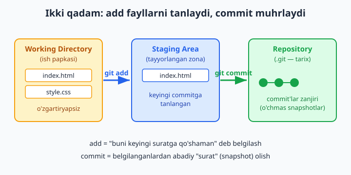
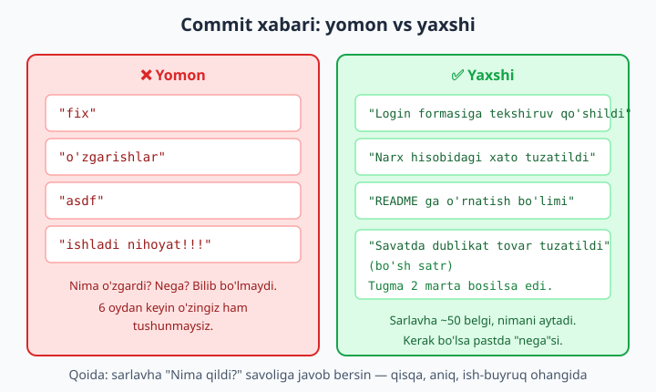
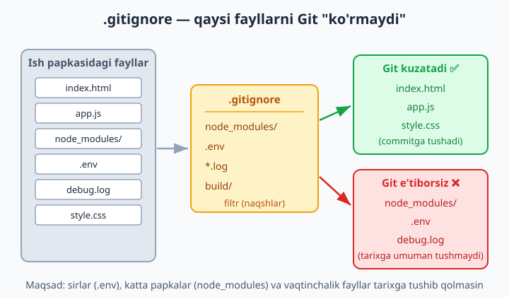

# 4 — O'zgarishlarni saqlash: add va commit

[⬅️ Oldingi: 03 — Birinchi repozitoriy va uch zona](./03-birinchi-repozitoriy.md) · [🏠 README](./README.md) · [Keyingi: 05 — Tarixni o'qish: log, diff, show ➡️](./05-tarix-log-diff.md)

> **Bu bobda:** o'zgarishlarni Git tarixiga qanday muhrlashni — ish papkasidan tarixgacha bo'lgan ikki qadamni o'rganamiz: `git add` fayllarni staging'ga (tayyorlangan zona) qo'yadi, `git commit` esa ulardan abadiy "surat" oladi. Nega aynan ikki bosqich kerakligini, yaxshi commit xabari qanday yozilishini, `.gitignore` orqali keraksiz va maxfiy fayllarni tarixdan chetda qoldirishni, hamda `git rm`, `git mv`, `git diff --staged` buyruqlarini ko'rib chiqamiz va o'z qo'limiz bilan kichik tarix yasaymiz.

---

## Muammo

3-bobda siz birinchi repozitoriyingizni (`git init`) yaratdingiz va uch zona — **Working Directory** (ish papkasi), **Staging Area** (tayyorlangan zona) va **Repository** (tarix saqlanadigan `.git`) — bilan tanishdingiz. `git status` ham ishlatib ko'rdingiz.

Endi tasavvur qiling: siz "Do'kon sayti" degan kichik loyiha ustida ishlayapsiz. Papkada `index.html` faylini yaratdingiz, ichiga bosh sahifa kodini yozdingiz. Bu fayl hozir shunchaki diskda yotibdi — Git uni "ko'radi", lekin tarixiga **hali kiritmagan**. Agar ertaga faylni xato tahrirlab buzib qo'ysangiz, "kechagi holatga qaytaring" deyishning iloji yo'q, chunki Git hali hech qanday "surat" olmagan.

Demak, vazifa: bu o'zgarishni Git tarixiga **muhrlash** — toki keyin istalgan vaqtda shu nuqtaga qaytish, taqqoslash yoki kim nima qilganini ko'rish mumkin bo'lsin. Buning uchun aynan ikkita buyruq kerak: `git add` va `git commit`. Keling, har birini sekin-asta tushunamiz.

📌 Bu bobdagi hamma buyruqlarni o'z papkangizda bemalol takrorlang — Git lokal ishlaydi, internet shart emas, hech narsani buzib qo'yishdan qo'rqmang. Aksincha, qancha ko'p sinasangiz, shuncha tez o'rganasiz.

## Birinchi qadam: `git add` — nimani saqlashni tanlash

Avval kichik bir loyiha papkasi tayyorlaymiz. Terminalda (3-bobdagidek) papka yaratib, ichida `git init` qiling, so'ng bitta fayl hosil qiling. Quyidagi misolda faylga oddiy matn yozyapmiz (siz haqiqiy HTML ham yozishingiz mumkin):

```bash
git init
git status
```

`git status` natijasi taxminan shunday bo'ladi:

```text
On branch main

No commits yet

Untracked files:
  (use "git add <file>..." to include in what will be committed)
        index.html

nothing added to commit but untracked files present (use "git add" to track)
```

`Untracked files` — "kuzatilmayotgan fayllar" degani. Git bu faylni ko'ryapti, lekin uni hali tarixga olmagan. Buni o'zgartirish uchun faylni **staging'ga** qo'yamiz:

```bash
git add index.html
git status
```

Endi natija o'zgaradi:

```text
On branch main

No commits yet

Changes to be committed:
  (use "git rm --cached <file>..." to unstage)
        new file:   index.html
```

`Changes to be committed` — "commitga tayyor o'zgarishlar". Fayl yashil rangda, `new file:` deb belgilangan. Bu — fayl hozir **Staging Area**da turibdi degani: u "keyingi suratga tushadi" deb belgilab qo'yildi, lekin hali surat olinmadi.



### `git add` ning uch ko'rinishi

Amalda faqat bitta fayl emas, bir nechta faylni birdaniga qo'shish kerak bo'ladi. Mana eng ko'p ishlatiladigan uch shakl:

| Buyruq | Nima qiladi |
|---|---|
| `git add index.html` | Faqat bitta aniq faylni staging'ga qo'yadi |
| `git add .` | Joriy papka va uning ichidagi **hamma o'zgargan/yangi** fayllarni qo'yadi |
| `git add -A` | Butun repozitoriy bo'ylab hamma o'zgarishni qo'yadi (o'chirilgan fayllar ham) |

💡 Boshlanishida `git add .` deb yozaversangiz bo'ladi — bu eng tez-tez ishlatiladigani. `-A` (`--all`) deyarli shunga o'xshash, asosiy farqi: o'chirilgan fayllar va boshqa papkadagi o'zgarishlar bilan ishlashda biroz keng qamrovli. Ko'p hollarda ikkalasi bir xil natija beradi.

📌 **Tuzoq:** `git add .` deb yozishdan oldin **doim** `git status` bilan papkada nima borligini ko'ring. Aks holda kerak bo'lmagan fayl (masalan, sir saqlangan `.env` yoki ulkan `node_modules` papkasi) ham tarixga tushib ketishi mumkin. Bundan saqlanishni quyida `.gitignore` bo'limida o'rganamiz.

## Nega ikki bosqich? `add` keyin `commit`

Yangi boshlovchilar ko'pincha so'raydi: "Nega Git fayllarni to'g'ridan-to'g'ri saqlamaydi? Nega avval `add`, keyin `commit` — ikki marta yozish kerak?"

Javob — **tanlov erkinligi**. Tasavvur qiling, siz bir kun ichida 5 ta faylni o'zgartirdingiz: 3 tasi "login sahifasi" bilan bog'liq, 2 tasi esa "savat" bilan. Bularni bitta aralash commitga tiqib qo'yish noto'g'ri bo'lardi — tarix chalkash chiqadi. Staging zonasi sizga shu imkonni beradi: avval faqat login bilan bog'liq 3 faylni `add` qilib, ularni alohida commit qilasiz, keyin qolgan 2 tasini.

Ya'ni `add` — "men aynan **mana bularni** keyingi suratga qo'shaman" degan tanlov. `commit` esa — "tanlanganlardan suratni **endi ol**" degan buyruq. Staging — bu ikki amal orasidagi "kutish zonasi".

📌 Boshida buni murakkab tuyulishi mumkin, lekin bir necha kun ishlatgach, bu ajralish naqadar qulayligini tushunasiz. Hozircha shuni eslab qoling: **add — tanlaydi, commit — muhrlaydi**.

## Ikkinchi qadam: `git commit` — suratni muhrlash

Staging'da fayl bor. Endi undan abadiy "surat" (snapshot) olamiz:

```bash
git commit -m "Bosh sahifa qo'shildi"
```

Bu yerda `-m` — "message" (xabar) degani, qo'shtirnoq ichidagi matn esa commit xabari. Natija:

```text
[main (root-commit) a1b2c3d] Bosh sahifa qo'shildi
 1 file changed, 1 insertion(+)
 create mode 100644 index.html
```

Tabriklaymiz — bu sizning birinchi haqiqiy commitingiz! `a1b2c3d` — commitning **hash**'i (noyob identifikatori). Sizda u boshqacha bo'ladi, chunki har bir commit vaqt, muallif va mazmunga qarab o'ziga xos hash oladi. `root-commit` esa "tarixning eng birinchi commiti" degani.

Endi `git status` toza ko'rsatadi:

```text
On branch main
nothing to commit, working tree clean
```

`working tree clean` — "ish papkasi toza, saqlanmagan o'zgarish yo'q". Hammasi tarixga muhrlandi.

💡 Endi faylni o'zgartirsangiz, sikl qaytadan boshlanadi: o'zgartirish → `git add` → `git commit`. Bu — Git bilan ishlashning yuragi, kuniga o'nlab marta takrorlanadigan ritm.

### Commit xabari nima uchun muhim?

Commit xabari — bu kelajakdagi o'zingizga (va jamoadoshlaringizga) qoldirilgan eslatma. Loyihangiz 100 ta commitga yetganda, "ushbu o'zgarish nima edi?" degan savolga aynan shu xabarlar javob beradi.

Yaxshi commit xabarining qoidalari:

- **Sarlavha qisqa bo'lsin** — taxminan 50 belgigacha. Bu GitHub va boshqa vositalarda to'liq ko'rinadi.
- **Aniq bo'lsin** — "nima o'zgardi"ni aytsin. "fix" emas, "Login formasidagi bo'sh maydon xatosi tuzatildi".
- **Ish-buyruq ohangida** — "qo'shildi", "tuzatildi", "o'zgartirildi" kabi. Go'yo "Bu commit nima qiladi?" degan savolga javob bergandek.
- Murakkabroq o'zgarish bo'lsa, **nega** o'zgartirilganini ham yozish foydali (buni quyida ko'ramiz).



✅ Yaxshi: `"Savatdagi dublikat tovar xatosi tuzatildi"`
❌ Yomon: `"fix"`, `"o'zgarishlar"`, `"asdf"`, `"ishladi nihoyat!!!"`

📌 6 oydan keyin loyihaga qaytganingizda, `"fix"` degan xabar sizga hech narsa demaydi. Yaxshi xabar esa vaqt mashinasidek ishlaydi — har bir commit nima qilganini bir qarashda eslatadi.

### Uzunroq xabar — "nima" va "nega"

Ba'zan bir qator yetmaydi. Murakkab o'zgarishda sarlavhadan keyin bo'sh satr qoldirib, tafsilot yozish mumkin. Buning uchun `-m` ni ikki marta ishlatamiz:

```bash
git commit -m "Savatdagi dublikat tovar tuzatildi" -m "Foydalanuvchi tugmani 2 marta bossa, tovar ikki marta qo'shilardi. Endi tugma birinchi bosishdan keyin vaqtincha o'chiriladi."
```

Birinchi `-m` — sarlavha, ikkinchisi — tana (body). `git log` da ular bo'sh satr bilan ajralib ko'rinadi. Qoida: **sarlavha "nima"ni, tana esa "nega"ni** aytadi.

💡 `-m` ni butunlay tashlab `git commit` desangiz, Git matn muharririni ochadi va xabarni o'sha yerda yozishni so'raydi. Boshlanishida `-m` bilan ishlash osonroq, shuning uchun shu bobda asosan shunga tayanamiz.

## `git commit -am` — qisqa yo'l (ehtiyot bo'lib)

Agar siz **allaqachon kuzatilayotgan** (oldin commit qilingan) faylni o'zgartirgan bo'lsangiz, `add` va `commit`ni bitta buyruqqa qo'shsa bo'ladi:

```bash
git commit -am "Bosh sahifa sarlavhasi yangilandi"
```

`-a` — "hamma kuzatilayotgan o'zgargan fayllarni avtomat staging'ga qo'y" degani. Ya'ni `-am` = `add` (tracked fayllar uchun) + `commit` birga.

📌 **Eng muhim tuzoq:** `-a` faqat **kuzatilayotgan** (oldin `add` qilingan) fayllarga ishlaydi. **Yangi yaratilgan** (untracked) faylni `-am` **qo'shmaydi**! Buni sinab ko'rsangiz, yangi faylingiz commitga tushmay qoladi. Yangi fayl uchun avval **alohida** `git add` qilish shart.

```bash
# Bu ishlaydi (eski.txt oldin commit qilingan, endi o'zgartirdik):
git commit -am "Eski fayl yangilandi"

# Bu YANGI faylni qo'shmaydi — avval add kerak:
git add yangi.txt
git commit -m "Yangi fayl qo'shildi"
```

💡 Boshlanishida `-am` ga shoshilmang. Avval `git add` + `git commit` ni alohida ishlatib, sikl mantiqini puxta o'zlashtiring. `-am` ni keyinroq, ishonch hosil qilgach qo'llang.

## `.gitignore` — Git "ko'rmaydigan" fayllar

Endi muhim mavzu. Har bir loyihada Git tarixiga **tushmasligi kerak** bo'lgan fayllar bo'ladi:

- **Maxfiy ma'lumotlar** — `.env` fayli (parollar, API kalitlari). Buni tarixga qo'shsangiz, ayniqsa GitHub'ga yuborsangiz, sir oshkor bo'ladi.
- **Katta, qayta yaratiladigan papkalar** — `node_modules/` (yuz minglab fayl), `build/`, `dist/`. Ularni saqlash shart emas: bitta buyruq bilan qaytadan yaratiladi.
- **Vaqtinchalik fayllar** — `*.log` jurnal fayllari, tizim fayllari (`Thumbs.db`, `.DS_Store`), muharrir sozlamalari.

Bularni Git e'tibordan chetda qoldirishi uchun papka ildizida `.gitignore` nomli oddiy matn fayli yaratamiz va unga **naqshlar** yozamiz:

```gitignore
# Bog'liqlik papkalari (qaytadan o'rnatiladi)
node_modules/

# Maxfiy sozlamalar
.env

# Hamma jurnal (log) fayllari
*.log

# Qurilish natijalari
build/
dist/
```

Bu faylni saqlagach, sehr ro'y beradi: `git status` da endi `node_modules/`, `.env` va `.log` fayllar **umuman ko'rinmaydi** — Git ularni butunlay "unutgan"dek bo'ladi.



Naqsh yozish qoidalari:

| Naqsh | Ma'nosi |
|---|---|
| `.env` | Aniq shu nomli faylni e'tiborsiz qoldir |
| `*.log` | Har qanday `.log` bilan tugaydigan fayl (`error.log`, `debug.log`...) |
| `node_modules/` | Oxiridagi `/` — bu papka degani; ichidagi hamma narsa bilan |
| `build/` | `build` papkasining butun mazmuni |
| `# matn` | `#` bilan boshlangan satr — izoh, Git uni o'qimaydi |

📌 `.gitignore` faylining o'zi esa, aksincha, **tarixga qo'shilishi** kerak (`git add .gitignore`). Shunda jamoadagi hamma uchun bir xil "e'tiborsiz" qoidalar amal qiladi.

💡 Yangi loyiha boshlashda nimani ignore qilishni o'ylab o'tirmaslik uchun [github.com/github/gitignore](https://github.com/github/gitignore) da tayyor `.gitignore` shablonlari bor (Node, Python, Java va h.k.). GitHub'da repozitoriy ochayotganda ham ro'yxatdan til tanlasangiz, mos `.gitignore` avtomat yaratiladi.

📌 **Muhim ogohlantirish:** `.gitignore` faqat **hali kuzatilmayotgan** fayllarga ta'sir qiladi. Agar fayl allaqachon commit qilingan bo'lsa, keyin uni `.gitignore`ga yozsangiz ham, Git uni kuzatishda davom etadi. Uni kuzatuvdan chiqarish uchun `git rm --cached` kerak — buni keyingi bo'limda ko'ramiz.

## `git diff --staged` — nimani commit qilayotganimni ko'rish

Commit qilishdan oldin "men aslida nimani muhrlayapman?" deb tekshirish — yaxshi odat. Buning uchun:

```bash
git diff --staged
```

Bu buyruq **staging'dagi** o'zgarishlarni satrma-satr ko'rsatadi. Natija taxminan shunday:

```text
diff --git a/matn.txt b/matn.txt
index 0f655a6..8abd883 100644
--- a/matn.txt
+++ b/matn.txt
@@ -1,2 +1,3 @@
 satr bir
 satr ikki
+satr uch
```

`+` bilan boshlangan satr — **qo'shilgan** qator, `-` bilan boshlangani — **o'chirilgan** qator. Bu yerda biz `matn.txt`ga "satr uch" qo'shganmiz.

📌 Farqni bilib oling: `git diff` (yalang'och) — **staging'ga qo'yilmagan** o'zgarishlarni ko'rsatadi; `git diff --staged` esa — allaqachon `add` qilingan, ya'ni keyingi commitga **tushadigan** o'zgarishlarni. Diff'lar haqida 5-bobda batafsil to'xtalamiz; hozircha commitdan oldingi tezkor tekshiruv sifatida eslab qoling.

💡 `--staged` o'rniga `--cached` deb yozsangiz ham aynan bir xil ishlaydi — ikkalasi sinonim.

## `git rm` va `git mv` — faylni o'chirish va nomini o'zgartirish

Loyihada fayllarni shunchaki o'chirib yoki nomini o'zgartirib qo'yish mumkin, lekin Git buni bilishi kerak. Eng toza yo'l — buni Git buyruqlari orqali qilish.

**Faylni o'chirish:**

```bash
git rm eski-fayl.txt
```

Bu faylni ham diskdan, ham staging'dan o'chiradi va "o'chirildi" o'zgarishini commitga tayyorlaydi. Keyin oddiy `git commit` qilasiz.

Agar faylni **diskda qoldirib**, faqat Git kuzatuvidan chiqarmoqchi bo'lsangiz (masalan, adashib commit qilingan `.env` ni):

```bash
git rm --cached .env
```

`--cached` — "indeksdan (staging/tarixdan) chiqar, lekin diskdagi faylni qoldir". Bu — `.gitignore`ga kechikib qo'shilgan fayllarni kuzatuvdan tozalashning to'g'ri yo'li.

📌 Maxfiy fayl (`.env`) avval commit qilingan bo'lsa: avval uni `.gitignore`ga qo'shing, so'ng `git rm --cached .env` qiling va commit qiling. Shundan keyingina u kuzatuvdan chiqadi.

**Fayl nomini o'zgartirish yoki ko'chirish:**

```bash
git mv matn.txt hujjat.txt
```

Bu faylning nomini `matn.txt` dan `hujjat.txt` ga o'zgartiradi va o'zgarishni darrov staging'ga qo'yadi. `git status` da bu `renamed: matn.txt -> hujjat.txt` deb ko'rinadi.

💡 Aslida `git mv` — bu shunchaki qulaylik: u faylni ko'chirib, eskisini `git rm`, yangisini `git add` qilishni bitta qadamga jamlaydi. Xuddi shu natijani qo'lda ham olsa bo'ladi, lekin `git mv` toza va xatosiz.

## Hammasini birlashtirib: kichik mini-tarix

Endi o'rganganlarimizni bitta ketma-ketlikda yig'amiz va bir nechta commitdan iborat kichik tarix yasaymiz. Quyidagini o'z papkangizda takrorlang:

```bash
# 1. Loyihani boshlaymiz
git init

# 2. Birinchi faylni yaratib commit qilamiz
#    (index.html ni o'zingiz yaratib, ichiga biror matn yozing)
git add index.html
git commit -m "Bosh sahifa qo'shildi"

# 3. Ignore qoidalarini sozlaymiz
#    (.gitignore ni yaratib, ichiga: node_modules/ va .env yozing)
git add .gitignore
git commit -m "Gitignore qoidalari qo'shildi"

# 4. Faylni o'zgartirib, qisqa yo'l bilan commit qilamiz
#    (index.html ni tahrirlang)
git commit -am "Bosh sahifa sarlavhasi yangilandi"

# 5. Tarixni ko'ramiz
git log --oneline
```

So'nggi buyruq sizning mini-tarixingizni ko'rsatadi:

```text
c3d4e5f Bosh sahifa sarlavhasi yangilandi
b2c3d4e Gitignore qoidalari qo'shildi
a1b2c3d Bosh sahifa qo'shildi
```

Mana — uchta commit, har biri o'ziga xos hash bilan, eng yangisi yuqorida. Bu sizning loyihangizning "vaqt chizig'i". `git log` haqida — uni qanday o'qish, taqqoslash va kerakli commitni topish — keyingi, 5-bobda to'liq gaplashamiz.

📌 Diqqat qiling: bu yerda yetti xonali hash'lar (`a1b2c3d`) — shartli misol. Sizning kompyuteringizda butunlay boshqa hash'lar chiqadi, va bu mutlaqo normal. Hash mazmunga bog'liq, shuning uchun ikki kishida hech qachon bir xil bo'lmaydi.

✅ Agar `git log --oneline` da o'zingizning uchta commitingizni ko'rsangiz — bobning amaliy qismini muvaffaqiyatli o'zlashtirdingiz. Endi mashqlar bilan mustahkamlaymiz.

## 4-bob mashqlari

> Quyidagi mashqlarni yangi, bo'sh papkada bajaring (har safar `git init` dan boshlang). Hech narsani buzib qo'yishdan qo'rqmang — bu mashq maydoni. Yechimlar berilmagan: maqsad — o'zingiz qilib ko'rish.

1. Yangi papka yarating, `git init` qiling va `git status` natijasini o'qing. "No commits yet" va "nothing to commit" iboralarini toping.
2. `salom.txt` faylini yarating, ichiga bir qator matn yozing. `git status` da uning "Untracked" ekanini ko'ring.
3. `salom.txt` ni `git add` qiling, so'ng yana `git status` qiling. Fayl rangi va holati qanday o'zgardi?
4. `salom.txt` ni `git commit -m "..."` bilan muhrlang. Commit xabariga mazmunli sarlavha yozing.
5. Faylni tahrirlab, yana bir qator qo'shing. `git add` va `git commit` siklini takrorlab, ikkinchi commitingizni yarating.
6. Bir vaqtda `bir.txt`, `ikki.txt`, `uch.txt` — uchta fayl yarating. `git add .` bilan hammasini birdaniga staging'ga qo'ying, keyin bitta commitda muhrlang.
7. To'rtta yangi fayl yarating, lekin ulardan faqat ikkitasini `git add` qiling. `git status` da qaysilari staging'da, qaysilari hali untracked ekanini farqlang.
8. Bitta commitdan oldin `git diff --staged` ishlatib, aniq nimani muhrlayotganingizni ko'ring. `+` belgili qatorlarni toping.
9. `git log --oneline` bilan shu paytgacha yaratgan commitlaringiz ro'yxatini chiqaring. Nechta commit bor?
10. `loyiha.txt` faylini yarating va commit qiling. So'ng uni tahrirlab, bu safar `git commit -am "..."` bilan (add'siz) yangilang. Ishladimi?
11. Yangi `yangi.txt` fayl yarating va darrov `git commit -am "..."` qilib ko'ring. U commitga tushdimi? Nima uchun? `git status` bilan tekshiring.
12. Papka ildizida `.gitignore` fayli yarating va ichiga `*.log` yozing. So'ng `xato.log` faylini yarating. `git status` da u ko'rinadimi?
13. `.gitignore`ga `maxfiy/` qatorini qo'shing. `maxfiy` nomli papka yaratib, ichiga fayl tashlang. Git uni e'tiborsiz qoldirayotganini tasdiqlang.
14. `.gitignore` faylining o'zini `git add` qilib commit qiling. Nega bu faylni tarixga qo'shish kerakligini o'ylab ko'ring.
15. `.env` faylini yarating, ichiga `parol=12345` yozing. Avval uni **commit qilmasdan**, `.gitignore`ga `.env` qo'shing va `git status` da yo'qolganini ko'ring.
16. Yangi mashqda: `.env` ni **avval commit qiling** (xatoga yo'l qo'ying). So'ng `.gitignore`ga qo'shing va `git rm --cached .env` bilan kuzatuvdan chiqaring. Fayl diskda qoldimi?
17. `eskinom.txt` faylini yarating va commit qiling. So'ng `git mv eskinom.txt yangiNom.txt` bilan nomini o'zgartiring. `git status` da "renamed" yozuvini toping va commit qiling.
18. Commit qilingan biror faylni `git rm` bilan o'chiring. `git status` da "deleted" holatini ko'ring va o'chirishni commitda muhrlang.
19. Bitta commit yarating, unda sarlavha va tana bo'lsin: `git commit -m "Sarlavha" -m "Bu yerda nega o'zgartirilganini tushuntiraman"`. Keyin `git log` (oneline'siz) bilan ikkala qismni ko'ring.
20. Yakuniy mashq: bo'sh papkadan boshlab, kamida **5 ta mazmunli commit**dan iborat kichik loyiha tarixini yasang — `.gitignore`, bir nechta fayl, bitta nom o'zgartirish (`git mv`) va bitta o'chirish (`git rm`) bo'lsin. Oxirida `git log --oneline` bilan butun tarixingizga qarang va har bir commit xabari aniq, tushunarli ekaniga ishonch hosil qiling.
