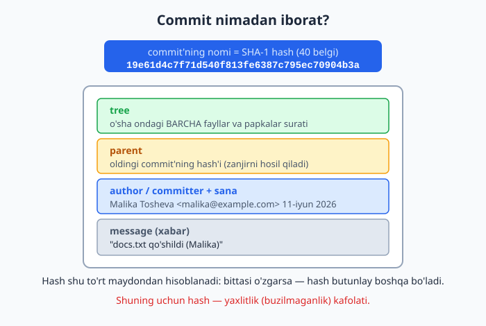
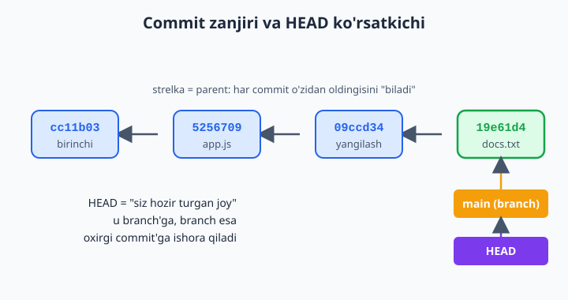
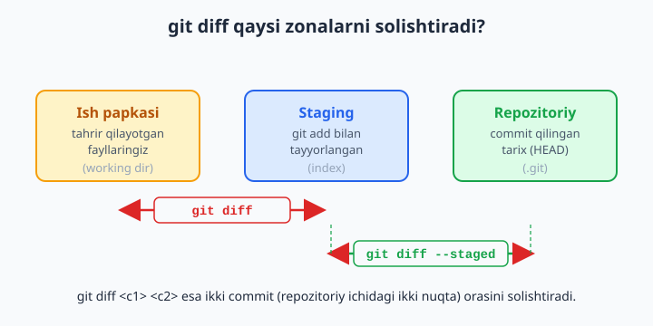

# 5 — Tarixni o'qish: log, diff, show

[⬅️ Oldingi: 04 — O'zgarishlarni saqlash: add va commit](./04-add-commit.md) · [🏠 README](./README.md) · [Keyingi: 06 — Orqaga qaytish: restore, reset, revert ➡️](./06-orqaga-qaytish.md)

> **Bu bobda:** o'zimiz (yoki jamoamiz) yaratgan commit'lar tarixini o'qishni o'rganamiz: `git log` va uning eng foydali variantlari (`--oneline`, `--graph`, `-n`, `--stat`, `--author`, `--since`); bitta commit nimadan tuzilganini (hash, parent, tree, muallif, xabar) tushunamiz; `HEAD` "men hozir qayerdaman" ko'rsatkichi ekanini ko'ramiz; `git show` bilan bitta commit ichiga qaraymiz; `git diff` ning uch turini (ish papkasi vs staging, staging vs repozitoriy, ikki commit orasi) bir-biridan ajratamiz; bitta faylning tarixini olamiz va uzun buyruqlarni qisqartiradigan alias yasaymiz.

---

## Muammo

Tasavvur qiling: siz va do'stingiz bir hafta davomida do'kon saytini yozdingiz. Ertalab loyihani ochasiz va ko'rasizki — kechagi ishlayotgan "Savatga qo'shish" tugmasi endi ishlamayapti. Savol tug'iladi: **kecha kim, nimani o'zgartirdi?** Yoki o'qishga topshirilgan diplom ishingizni o'zgartirib, "bir hafta oldin matn yaxshiroq edi shekilli" deb o'ylab qolasiz — o'sha haftalik o'zgarishlarni qanday ko'rasiz?

Oldingi boblarda biz `git add` va `git commit` bilan o'zgarishlarni **saqlashni** o'rgandik. Har commit — loyihangizning bir lahzadagi "fotosurati". Lekin albomda surat saqlash bir gap, uni **ochib ko'rish** boshqa gap. Aynan shuni qilamiz: tarixni o'qiymiz.

Yaxshi xabar — Git hech narsani unutmaydi. Har bir commit, kim qachon qilgani, nima o'zgargani — hammasi yozib qo'yilgan. Bizga faqat shu daftarning sahifalarini varaqlashni bilish kerak. Asosiy uchta buyruq:

- `git log` — commit'lar ro'yxatini ko'rsatadi (tarix daftari).
- `git show` — bitta commit'ni ochib, ichidagi o'zgarishlarni ko'rsatadi.
- `git diff` — hali commit qilinmagan (yoki ikki nuqta orasidagi) o'zgarishlarni ko'rsatadi.

Bu bobdagi buyruqlar **hech narsani o'zgartirmaydi** — faqat o'qiydi. Demak, ularni xotirjam, hech narsani buzib qo'yishdan qo'rqmasdan sinab ko'rishingiz mumkin.

> 📌 Sinab ko'rish uchun bo'sh papkada kichik repozitoriy oching: `git init`, keyin bir nechta fayl yarating va `git add` + `git commit` bilan 3-4 ta commit qiling. Quyidagi misollarda aynan shunday qilingan: `README.md`, keyin `app.js`, keyin uni yangiladik, keyin `docs.txt` qo'shdik.

---

## git log — tarix daftarini ochish

Eng oddiy ko'rinishi — buyruqning o'zi:

```bash
git log
```

Natija (yangidan eskiga qarab):

```text
commit 19e61d4c7f71d540f813fe6387c795ec70904b3a
Author: Malika Tosheva <malika@example.com>
Date:   Thu Jun 11 12:38:38 2026 +0500

    docs.txt qo'shildi

commit 09ccd3468c93692bbb6f03f04879244a34be33ec
Author: Aziz Karimov <aziz@example.com>
Date:   Thu Jun 11 12:38:16 2026 +0500

    Salomlashuv matni yangilandi

commit 5256709e7fe44654bd0bfac620c66d7f100c4252
Author: Aziz Karimov <aziz@example.com>
Date:   Thu Jun 11 12:38:15 2026 +0500

    app.js qo'shildi
```

Har bir blok — bitta commit. Eng yangi commit eng tepada turadi. Har blokda to'rt narsa bor: uzun **hash** (commit'ning nomi), **Author** (kim qilgan), **Date** (qachon) va xabar (siz `-m` bilan yozgan matn).

> 📌 Agar tarix uzun bo'lsa, `git log` uni sahifalab (pager rejimida) ko'rsatadi: pastga `o'q` yoki bo'shliq tugmasi bilan tushasiz, **chiqish uchun `q` (quit) bosing**. Boshlovchilar ko'pincha "terminal qotib qoldi" deb o'ylaydi — aslida shunchaki `q` bosish kerak.

> 💡 Bu uzun hash'larni qo'lda yodlash shart emas. Pastda ko'rasiz: ko'p joyda hash'ning birinchi 7 belgisi (`19e61d4`) ham yetarli.

## Variantlar — log'ni o'zingizga moslash

`git log` ning kuchi — qo'shimcha "tugmalar" (bayroqlar/flag) bilan. Eng foydalilarini ko'rib chiqamiz.

### --oneline — har commit bitta qatorda

```bash
git log --oneline
```

```text
19e61d4 docs.txt qo'shildi
09ccd34 Salomlashuv matni yangilandi
5256709 app.js qo'shildi
cc11b03 Boshlang'ich commit: README qo'shildi
```

Endi hammasi ixcham: qisqa hash + xabar. Tarixni tez ko'zdan kechirish uchun eng ko'p ishlatiladigan variant.

### --graph --all — shoxlarni chizib ko'rsatish

```bash
git log --oneline --graph --all
```

Hozir bizda bitta to'g'ri chiziq, shuning uchun chap tarafda oddiy `*` chiziladi:

```text
* 19e61d4 docs.txt qo'shildi
* 09ccd34 Salomlashuv matni yangilandi
* 5256709 app.js qo'shildi
* cc11b03 Boshlang'ich commit: README qo'shildi
```

`--graph` commit'lar orasidagi bog'lanishni chiziq bilan chizadi. Hozir foydasi sezilmaydi, lekin 7-bobda branch'lar (shoxlar) paydo bo'lganda, bu chiziq ikkiga ajralib, qaysi shox qayerdan chiqqani ko'rinadi. `--all` esa faqat hozirgi shoxni emas, **barcha** shoxlarni ko'rsatadi.

### -n <son> — faqat oxirgi nechta commit

```bash
git log --oneline -n 2
```

```text
19e61d4 docs.txt qo'shildi
09ccd34 Salomlashuv matni yangilandi
```

`-n 2` "menga faqat oxirgi 2 ta commit'ni ko'rsat" degani. Uzun loyihada juda asqotadi.

### --stat — qaysi fayllar, qancha o'zgargan

```bash
git log --stat -n 1
```

```text
commit 19e61d4c7f71d540f813fe6387c795ec70904b3a
Author: Malika Tosheva <malika@example.com>
Date:   Thu Jun 11 12:38:38 2026 +0500

    docs.txt qo'shildi

 app.js   | 2 +-
 docs.txt | 1 +
 2 files changed, 2 insertions(+), 1 deletion(-)
```

`--stat` har commit ostiga "qaysi fayl o'zgardi va nechta qator qo'shildi/o'chdi" jadvalini qo'shadi. `+` — qo'shilgan qatorlar, `-` — o'chirilganlar.

### --pretty=format — ko'rinishni o'zingiz yasash

```bash
git log --pretty=format:"%h | %an | %s"
```

```text
19e61d4 | Malika Tosheva | docs.txt qo'shildi
09ccd34 | Aziz Karimov | Salomlashuv matni yangilandi
5256709 | Aziz Karimov | app.js qo'shildi
cc11b03 | Aziz Karimov | Boshlang'ich commit: README qo'shildi
```

Bu yerda `%h` — qisqa hash, `%an` — muallif ismi, `%s` — xabar. Boshqalari ham bor (`%ad` — sana, `%ar` — "3 kun oldin" ko'rinishidagi nisbiy sana). Bu juda moslashuvchan, lekin yodlash shart emas — pastdagi alias bo'limida buni bir marta yozib qo'yib, qisqa nom beramiz.

| Variant | Nima qiladi |
|---|---|
| `--oneline` | Har commit bitta qatorda (qisqa hash + xabar) |
| `--graph` | Commit zanjirini chiziq bilan chizadi |
| `--all` | Faqat joriy emas, hamma branch'larni ko'rsatadi |
| `-n <son>` | Faqat oxirgi `<son>` ta commit |
| `--stat` | Har commit qaysi fayllarni qancha o'zgartirganini |
| `--author="..."` | Faqat shu muallifning commit'lari |
| `--since="..."` | Faqat shu sanadan keyingi commit'lar |
| `-- <fayl>` | Faqat shu faylga tegishli commit'lar |

## Commit anatomiyasi — ichida nima bor?

Yuqorida har commit'ning uzun nomini ko'rdik: `19e61d4c7f71...`. Bu nima va nega bunaqa uzun? Keling, commit'ni ochib ko'ramiz.

Bitta commit — ichida to'rt narsa saqlangan kichik "quti":



1. **tree** — o'sha lahzadagi BARCHA fayl va papkalaringizning surati (qaysi fayl, qanday holatda edi).
2. **parent** — oldingi commit'ning hash'i. Aynan shu maydon commit'larni **zanjir** qilib bog'laydi (birinchi commit'da parent yo'q).
3. **author / committer + sana** — kim va qachon qilgani.
4. **message** — siz yozgan xabar.

### SHA-1 hash — nega 40 belgi va nega aynan hash?

Commit'ning "nomi" — `19e61d4c7f71d540f813fe6387c795ec70904b3a` kabi 40 ta belgili kod. Bu tasodifiy raqam emas: Git yuqoridagi to'rt maydonni (tree, parent, muallif, xabar) maxsus matematik funksiyadan (SHA-1) o'tkazib, shu kodni **hisoblaydi**.

Buning ajoyib tomoni: agar commit ichidagi **biror narsa** — bitta harf, sana, hatto bo'sh joy — o'zgarsa, hash **butunlay** boshqacha bo'lib qoladi. Demak, hash — commit'ning "barmoq izi". Agar kimdir tarixni yashirincha o'zgartirmoqchi bo'lsa, hash mos kelmay qoladi va Git buni darrov sezadi.

> 📌 Mana shuning uchun hash — **yaxlitlik (buzilmaganlik) kafolati** deyiladi. Git sizning tarixingizni hech kim sezdirmasdan buza olmasligiga ishonch beradi.

> 💡 40 belgini har safar yozish shart emas. Git uchun commit'ni aniqlash uchun **boshidagi 7 belgi** (`19e61d4`) odatda yetarli, chunki ikki commit'ning birinchi 7 belgisi bir xil bo'lishi deyarli imkonsiz. Agar tasodifan to'qnashuv bo'lsa, Git "ko'proq belgi yozing" deb ogohlantiradi.

## HEAD — "men hozir qayerdaman"

`git log` natijasida ba'zan `(HEAD -> main)` degan yozuvni ko'rasiz. `HEAD` nima?

`HEAD` — bu **siz hozir turgan joyni** ko'rsatadigan maxsus belgi (ko'rsatkich). Oddiy qilib aytganda: "yangi commit qilsam, u qayerga ulanadi?" degan savolning javobi. Odatda `HEAD` branch'ga (masalan `main`), branch esa eng oxirgi commit'ga ishora qiladi.



Zanjir shunday ishlaydi: har commit `parent` orqali o'zidan oldingisiga bog'langan. Eng oxirgi commit'ga `main` branch ko'rsatadi, `main`'ga esa `HEAD` ko'rsatadi. Yangi commit qilsangiz, `main` ham, `HEAD` ham avtomatik bir qadam oldinga — yangi commit'ga siljiydi.

> 📌 `HEAD~1` — "HEAD'dan bitta orqadagi commit" (ya'ni parent), `HEAD~2` — ikkita orqadagi. Bu yozuvlar keyingi boblarda (orqaga qaytish, diff) juda ko'p ishlatiladi. Hozircha shuni eslab qoling: `HEAD` = hozirgi nuqta, `~` = orqaga sanash.

## git show — bitta commit'ni ochish

`git log` commit'lar ro'yxatini beradi. Bitta commit ichida **aniq nima o'zgargan**ini ko'rish uchun `git show` ishlatamiz. Eng oxirgi commit (`HEAD`) bizda `docs.txt qo'shildi` — u shunchaki yangi fayl qo'shgan. Diff'ni o'qishni o'rganish uchun esa "eski qator o'chib, yangisi qo'shilgan" misol qulayroq, shuning uchun bir oldingi commit'ni (`HEAD~1`, ya'ni `Salomlashuv matni yangilandi`) ochamiz:

```bash
git show HEAD~1
```

```text
commit 09ccd3468c93692bbb6f03f04879244a34be33ec
Author: Aziz Karimov <aziz@example.com>
Date:   Thu Jun 11 12:38:16 2026 +0500

    Salomlashuv matni yangilandi

diff --git a/app.js b/app.js
index 6b51909..30fa4e8 100644
--- a/app.js
+++ b/app.js
@@ -1 +1 @@
-console.log('salom');
+console.log('salom dunyo');
```

> 💡 Oddiy `git show HEAD` desangiz, eng oxirgi commit'ingiz (bizda `docs.txt qo'shildi`) ochiladi — buyruq bir xil ishlaydi, faqat o'sha commit ko'rinadi. Bu yerda `HEAD~1` ni atayin tanladik, chunki uning diffi qator o'chib-qo'shilishini yaqqol ko'rsatadi.

Yuqorida commit ma'lumotlari, pastda esa o'zgarishlar. Buni **diff** (farq) deb ataymiz va uni o'qishni bilish kerak:

- `-console.log('salom');` — qizil, oldida `-`: bu qator **o'chirilgan** (eski holat).
- `+console.log('salom dunyo');` — yashil, oldida `+`: bu qator **qo'shilgan** (yangi holat).
- `@@ -1 +1 @@` — o'zgarish faylning qaysi qatori atrofida bo'lgani.

`HEAD` o'rniga istalgan commit hash'ini qo'yishingiz mumkin:

```bash
git show 5256709
git show 5256709 --stat
```

Birinchisi — o'sha commit'dagi to'liq o'zgarishlar, ikkinchisi — faqat qaysi fayllar o'zgargani (qisqa xulosa).

## git diff — uchta turini ajratish

Bu — boshlovchilar eng ko'p chalkashtiradigan joy, shuning uchun sekin boramiz. `git diff` **o'zgarishlarni solishtiradi**, lekin savol shu: *nimani nima bilan* solishtiradi? Javob bayroqqa bog'liq. Uchta zonani eslang (3-bobdan): **ish papkasi** (tahrir qilayotganingiz), **staging** (`git add` qilingani) va **repozitoriy** (commit qilingani).



### 1) git diff — ish papkasi vs staging

```bash
git diff
```

Bu "men o'zgartirdim, lekin hali `git add` qilmadim" o'zgarishlarni ko'rsatadi. Sinab ko'ramiz — `app.js` ni tahrir qilamiz, lekin `add` qilmaymiz:

```text
diff --git a/app.js b/app.js
index 30fa4e8..018afe1 100644
--- a/app.js
+++ b/app.js
@@ -1 +1 @@
-console.log('salom dunyo');
+console.log('salom dunyo!!!');
```

> 📌 Agar hamma o'zgarishlaringizni `git add` qilib bo'lgan bo'lsangiz, oddiy `git diff` **bo'sh** natija beradi — bu xato emas. "Hali tayyorlanmagan o'zgarish yo'q" degani.

### 2) git diff --staged — staging vs repozitoriy

```bash
git diff --staged
```

Endi `git add app.js` qilib, yana `git diff --staged` desangiz — xuddi o'sha o'zgarishni ko'rasiz, lekin endi u "tayyorlangan, commit'ni kutyapti" holatida. Ya'ni bu buyruq "agar hozir `git commit` qilsam, commit'ga nima tushadi?" degan savolga javob beradi.

> 💡 `--staged` o'rniga `--cached` ham yozsa bo'ladi — ikkisi bir xil. Eski qo'llanmalarda `--cached` ko'p uchraydi.

Oddiy tartib shunday bo'ladi:

1. Fayl tahrir qilasiz → `git diff` "men nimani o'zgartirdim?" ni ko'rsatadi.
2. `git add` qilasiz → o'zgarish staging'ga o'tadi.
3. `git diff --staged` "commit'ga nima tushadi?" ni ko'rsatadi.
4. Hammasi joyida bo'lsa → `git commit`.

### 3) git diff <c1> <c2> — ikki commit orasi

```bash
git diff 5256709 19e61d4
```

Bu ikki commit orasida **nima o'zgargani**ni ko'rsatadi — "bir hafta oldingi holat bilan hozirgisini solishtir" degan savolga aynan shu javob beradi. `HEAD` belgilaridan ham foydalansa bo'ladi:

```bash
git diff HEAD~2 HEAD        # 2 commit orqadagi holat bilan hozirgini solishtir
```

> 📌 Tartib muhim: `git diff A B` — "A dan B ga o'tishda nima o'zgardi". Agar teskari yozsangiz (`B A`), `+` va `-` o'rin almashadi. Shubhaga borsangiz: birinchi — eski, ikkinchi — yangi deb eslang.

| Buyruq | Nimani nima bilan solishtiradi |
|---|---|
| `git diff` | Ish papkasi ↔ staging (hali `add` qilinmagan) |
| `git diff --staged` | Staging ↔ repozitoriy (commit'ni kutayotgan) |
| `git diff HEAD` | Ish papkasi ↔ oxirgi commit (add qilingan-qilinmaganidan qat'i nazar) |
| `git diff <c1> <c2>` | Ikki commit orasi |

## Bitta faylning tarixi

Ba'zan butun loyiha emas, **bitta fayl** qiziqtiradi: "shu `app.js` ga kim, qachon, nima qildi?". Buning uchun `--` (ikki tire) dan keyin fayl nomini yozamiz:

```bash
git log --oneline -- app.js
```

```text
09ccd34 Salomlashuv matni yangilandi
5256709 app.js qo'shildi
```

Natijada faqat `app.js` ga tegishli commit'lar chiqadi (boshqa fayllarni o'zgartirgan commit'lar ko'rinmaydi). Diff bilan birga ham ko'rsa bo'ladi:

```bash
git log -p -- app.js
```

`-p` (patch) har commit ostiga o'sha faylning o'zgarishlarini chizadi.

> 📌 Nega `--` kerak? U Git'ga "bundan keyingisi — fayl nomi, branch nomi emas" deb aytadi. Agar loyihangizda `app.js` nomli ham fayl, ham branch bo'lsa, `--` chalkashlikni oldini oladi. Odatga aylantiring: fayl bo'yicha filtrlasangiz, doim `--` qo'ying.

## Kim va qachon — filtrlar

Bobning boshidagi "kecha kim, nimani o'zgartirdi?" savoliga endi javob beramiz.

### --author — kim bo'yicha

```bash
git log --oneline --author="Aziz"
```

```text
09ccd34 Salomlashuv matni yangilandi
5256709 app.js qo'shildi
cc11b03 Boshlang'ich commit: README qo'shildi
```

Faqat ismida (yoki emailida) "Aziz" bor mualliflarning commit'lari. Qism matn ham ishlaydi: `--author="Kar"` → "Karimov" topiladi.

> ⚠️ `--author` qidiruvi **harf registriga sezgir**: `--author="kar"` (kichik k bilan) "Karimov"ni **topa olmaydi** — `"Kar"` deb katta harf bilan yozish kerak. Agar registrga e'tibor bermay qidirmoqchi bo'lsangiz, `-i` bayrog'ini qo'shing: `git log -i --author="kar"` — bu kichik-katta harfni farqlamaydi.

### --since va --until — qachon bo'yicha

```bash
git log --oneline --since="2026-06-11 00:00"
git log --oneline --since="2 days ago"
git log --oneline --since="2026-06-01" --until="2026-06-10"
```

`--since` — "shu sanadan keyingilari", `--until` — "shu sanagacha bo'lganlari". Sanani aniq yozsa ham, `"2 days ago"` (2 kun oldin), `"1 week ago"` (1 hafta oldin) kabi tabiiy iboralar bilan ham yozsa bo'ladi.

Filtrlarni **birlashtirsa** bo'ladi — bu juda kuchli:

```bash
# Aziz oxirgi hafta ichida nimalarni o'zgartirdi:
git log --oneline --author="Aziz" --since="1 week ago"

# Aziz oxirgi hafta ichida aynan app.js ga nima qildi:
git log --oneline --author="Aziz" --since="1 week ago" -- app.js
```

> 💡 "Savatga qo'shish" tugmasi buzilgan misolimizga qaytsak: agar buni qaysi fayl boshqarishini bilsangiz (masalan `savat.js`), `git log -p -- savat.js` o'sha fayldagi har bir o'zgarishni ketma-ket ko'rsatadi — qaysi commit tugmani sindirgani darrov ko'rinadi. 17-bobda buni yanada aniq topadigan `git bisect` va `git blame` bilan tanishasiz.

## Alias — uzun buyruqlarni qisqartirish

`git log --oneline --graph --all --decorate` ni har kuni yozish — charchatadi. Git **alias** (taxallus, qisqa nom) yasashga ruxsat beradi: bir marta sozlaysiz, keyin qisqa yozasiz.

```bash
git config --global alias.lg "log --oneline --graph --all --decorate"
```

Endi shunchaki:

```bash
git lg
```

```text
* 19e61d4 (HEAD -> main) docs.txt qo'shildi
* 09ccd34 Salomlashuv matni yangilandi
* 5256709 app.js qo'shildi
* cc11b03 Boshlang'ich commit: README qo'shildi
```

Bir nechta foydali alias:

```bash
git config --global alias.s "status -s"
git config --global alias.last "log -1 --stat"
git config --global alias.hist "log --pretty=format:'%h %ad | %an | %s' --date=short"
```

Endi `git s` — qisqa status, `git last` — oxirgi commit tafsiloti, `git hist` — chiroyli tarix.

> 📌 `--global` butun kompyuteringizdagi barcha loyihalarga alias o'rnatadi. `--global` siz yozsangiz, alias faqat shu loyihaga tegishli bo'ladi. Boshlovchilar uchun `--global` qulayroq: bir marta sozlab, hamma joyda ishlatasiz.

> 💡 Alias'lar `~/.gitconfig` faylida oddiy matn ko'rinishida saqlanadi. Istasangiz, o'sha faylni ochib, `[alias]` bo'limidagilarni ko'rishingiz mumkin. Buyruq orqali ko'rish uchun: `git config --global --get-regexp alias`.

---

Endi sizda tarixni o'qishning to'liq to'plami bor: `git log` (variantlar bilan) — umumiy ko'rinish, `git show` — bitta commit ichi, `git diff` (uch turi) — o'zgarishlar, fayl filtri va alias — tezlik uchun. Keyingi bobda bu o'qish ko'nikmasini ishga solamiz: tarixni ko'rib, kerakli nuqtaga **orqaga qaytishni** (`restore`, `reset`, `revert`) o'rganamiz.

## 5-bob mashqlari

> 💡 Mashqlar uchun bo'sh papkada sinov repozitoriysi yarating: `git init` qiling, bir nechta fayl (masalan `README.md`, `index.html`, `style.css`) yarating va ularni alohida-alohida commit qiling. Qadama-qadam kamida 5-6 ta commit to'plansin. Loyihangizning haqiqiy `.git` papkasiga tegmang — alohida sinov papkasida ishlang.

1. Sinov repozitoriyingizda `git log` buyrug'ini ishlating va natijani o'qing: nechta commit bor, eng yuqorida qaysi commit turibdi va nega?
2. Pager rejimidan (uzun log) chiqish uchun qaysi tugma kerakligini amalda tekshiring: ko'p commit yarating, `git log` ni oching va `q` bilan chiqing.
3. `git log --oneline` ni ishlating. Oddiy `git log` bilan solishtiring: qaysi ma'lumot yo'qoldi, qaysi biri qoldi?
4. `git log --oneline -n 3` bilan faqat oxirgi 3 ta commit'ni chiqaring. Keyin sonni o'zgartirib, `-n 1` va `-n 5` ni sinab ko'ring.
5. `git log --oneline --graph --all` ni ishlating va chap tarafdagi belgilarga e'tibor bering. Hozir nega chiziq to'g'ri (bitta yo'l)?
6. `git log --stat` bilan har commit qaysi fayllarni nechta qator o'zgartirganini ko'ring. Bitta commit'da nechta fayl o'zgargan?
7. `git log --pretty=format:"%h | %an | %s"` ni ishlating. Keyin formatga `%ad` (sana) qo'shib, qatorga sanani ham chiqaring.
8. Oxirgi commit'ning to'liq hash'ini `git log` dan toping. Endi shu hash'ning faqat birinchi 7 belgisini ishlatib, o'sha commit'ni `git show` bilan oching — ishlaydimi?
9. `git show HEAD` ni ishlating va natijadagi diff'ni o'qing: qaysi qatorlar `+` (qo'shilgan), qaysilari `-` (o'chirilgan) bilan belgilangan?
10. `git show HEAD --stat` va oddiy `git show HEAD` farqini tushuntiring: qaysi biri batafsil, qaysi biri qisqa?
11. `HEAD~1` va `HEAD~2` ni `git show` bilan oching. `git show HEAD~1` qaysi commit'ni ko'rsatadi — sanab tushuntiring.
12. Bitta faylni (masalan `README.md`) tahrir qiling, lekin `git add` QILMANG. `git diff` ni ishlating — natija nimani ko'rsatyapti?
13. Endi o'sha faylni `git add` qiling. `git diff` ni qayta ishlating — natija nega bo'sh chiqdi? Keyin `git diff --staged` ni ishlating — endi nimani ko'rsatyapti?
14. `git diff`, `git diff --staged` va `git diff HEAD` uchtasini bitta tahrirdan keyin ketma-ket ishlating va har biri nimani nima bilan solishtirayotganini o'z so'zlaringiz bilan yozing.
15. Ikkita eski commit'ni tanlang va `git diff <c1> <c2>` bilan ularning orasidagi farqni ko'ring. Keyin commit'larni o'rin almashtirib yozing — `+` va `-` nima bo'ldi?
16. `git diff HEAD~2 HEAD` ni ishlating: oxirgi 2 commit jami nimani o'zgartirgan?
17. `git log --oneline -- <faylnomi>` bilan bitta faylning tarixini chiqaring. Nega boshqa fayllarga tegishli commit'lar ko'rinmadi?
18. `git log --author="..."` bilan o'zingiz qo'ygan muallif ismi bo'yicha filtrlang. Keyin ismning faqat bir qismini (registrini to'g'ri saqlab, masalan ism `Karimov` bo'lsa `--author="Kar"`) yozib sinab ko'ring — qism matn ishlaydimi? So'ng xuddi shu prefiksni kichik harf bilan (`--author="kar"`) yozib ko'ring: natija bo'sh chiqadi, chunki qidiruv harf registriga sezgir. Endi `git log -i --author="kar"` ni sinang — `-i` bayrog'i bilan u yana topiladimi?
19. `git log --since="1 week ago"` va `git log --since="..." --until="..."` bilan sana oralig'i bo'yicha filtrlang. Keyin `--author` bilan birlashtirib, "falonchi oxirgi haftada nima qildi" savoliga javob bering.
20. `git config --global alias.lg "log --oneline --graph --all --decorate"` bilan alias yarating va `git lg` ni sinang. Keyin o'zingizga yana ikkita foydali alias yasang (masalan `git s` → qisqa status, `git last` → oxirgi commit), ularni `git config --global --get-regexp alias` bilan ro'yxatdan tekshiring.
