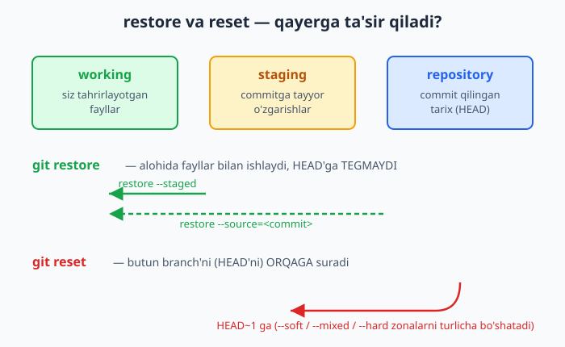
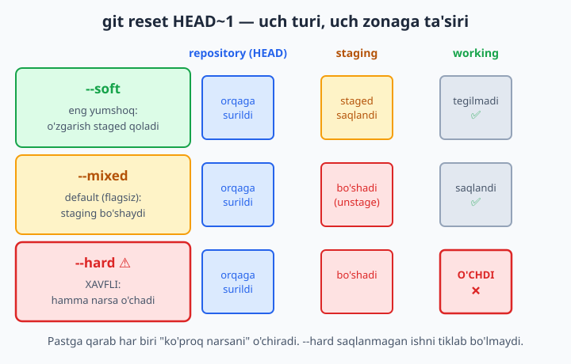
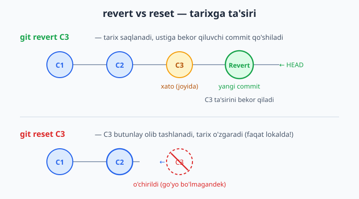

# 6 — Orqaga qaytish: restore, reset, revert

[⬅️ Oldingi: 05 — Tarixni o'qish: log, diff, show](./05-tarix-log-diff.md) · [🏠 README](./README.md) · [Keyingi: 07 — Branch — shoxlar ➡️](./07-branch.md)

> **Bu bobda:** xato qilganda orqaga qaytishni o'rganamiz. Working zonadagi o'zgarishni `git restore` bilan tashlashni, noto'g'ri `add` qilganni `git restore --staged` bilan staging'dan (commitga tayyorlanadigan oraliq zona) chiqarishni, `git reset`ning uch turini (`--soft`, `--mixed`, `--hard`) va ularning uch zonaga ta'sirini, allaqachon ulashilgan tarixni xavfsiz bekor qiluvchi `git revert`ni, oxirgi commitni tuzatuvchi `git commit --amend`ni ko'rib chiqamiz. Eng muhimi — qaysi vosita qachon ishlatiladi va `--hard` kabi xavfli buyruqlardan qanday ehtiyot bo'lish kerakligini tushunamiz.

---

## Muammo

Tasavvur qiling: diplom ishingiz uchun sayt yozyapsiz. Kecha kechqurun `index.html` faylini ochib, sarlavhani "tuzatmoqchi" bo'ldingiz — yarim soat o'ynaganingizdan keyin sayt umuman ishlamay qoldi. Endi esa nima o'zgartirganingizni ham eslay olmaysiz. Yuragingiz orziqib ketdi: "Hammasi buzildi, qaytadan yozaman shekilli...".

Yana bir holat: jamoaviy loyihada ishlayapsiz. `git add .` deb yozdingiz — va shoshilganingizdan, ichida parolingiz turgan `config.txt` faylini ham qo'shib yubordingiz. Hali commit qilmadingiz, lekin fayl staging'da turibdi. Uni u yerdan qanday chiqarib olish kerak?

Uchinchi holat: commit qildingiz, lekin keyin angladingiz — bu commit butunlay xato edi. Yoki commit xabarida xatolik bor: "Qoshildi: feacher" deb yozib yuboribsiz.

Bularning hammasi — kundalik ish. **Git xato qilmaslik uchun emas, xatoni tuzatish uchun yaratilgan.** Bu bobda Git sizga bergan "orqaga qaytish" tugmalarini o'rganamiz. Lekin avval bitta narsani aniq tushunib olaylik: Git'da "orqaga" degani har xil joyni anglatadi. Faylni o'zgartirdingizmi, yoki uni `add` qildingizmi, yoki butunlay commit qildingizmi — har biriga boshqa vosita kerak.

3-bobdagi **uch zona**ni eslang: **working** (siz tahrirlayotgan fayllar), **staging** (commitga tayyorlangan o'zgarishlar) va **repository** (commit qilingan tarix). "Orqaga qaytish" — aslida shu zonalar orasida o'zgarishlarni qaytarish demakdir.

## restore — working zonadagi o'zgarishni tashlash

Eng birinchi holat — faylni buzdingiz, lekin hali `add` qilmadingiz. O'zgarish faqat working zonada turibdi. Uni butunlay tashlab, faylni oxirgi commit'dagi holatiga qaytarmoqchisiz.

Avval har doimgidek `git status` bilan vaziyatni ko'ramiz:

```bash
git status
```

```text
On branch main
Changes not staged for commit:
  (use "git add <file>..." to update what will be committed)
  (use "git restore <file>..." to discard changes in working directory)
        modified:   index.html
```

📌 Git'ning o'zi ko'rsatib turibdi: "discard changes in working directory" uchun `git restore <file>` ishlat. Git ko'p hollarda keyingi qadamni status chiqishida aytib beradi — o'qishni odat qiling.

Endi o'zgarishni tashlaymiz:

```bash
git restore index.html
```

Buyruq hech narsa chop etmaydi (Git'da "jim turish" — "muvaffaqiyat" degani). Faylni qayta ochsangiz — u oxirgi commit'dagi holatiga qaytgan. Kechagi yarim soatlik "tuzatish" yo'qoldi, sayt yana ishlaydi.

⚠️ **Ehtiyot bo'ling:** `git restore` qaytarib bo'lmaydigan amal. Working zonadagi o'zgarish hali hech qayerga saqlanmagani uchun, uni tashlasangiz — butunlay yo'qoladi. Git uni tiklab bera olmaydi. Faqat haqiqatan keraksiz o'zgarishni tashlang.

Barcha o'zgartirilgan fayllarni bir vaqtda tashlash uchun:

```bash
git restore .
```

💡 Bitta faylni emas, faqat uning bir qismini tashlamoqchimisiz? `git restore -p index.html` ("patch" rejimi) — Git har bir o'zgarish bo'lagini alohida so'raydi: tashlaymizmi yoki qoldiramizmi.



## restore --staged — noto'g'ri add qilinganni unstage qilish

Endi ikkinchi holat: `git add` qildingiz, lekin commit qilishdan oldin o'ylab qoldingiz — bu faylni qo'shmaslik kerak edi. Uni staging'dan chiqarib, faqat working zonada qoldirmoqchisiz (o'zgarish yo'qolmasin, faqat "commitga tayyor" belgisi olib tashlansin).

```bash
git add config.txt        # noto'g'ri qo'shdik
git status
```

```text
On branch main
Changes to be committed:
  (use "git restore --staged <file>..." to unstage)
        modified:   config.txt
```

📌 Yana Git'ning o'zi yo'l ko'rsatyapti: "use git restore --staged <file> to unstage". `--staged` flagi `restore`ga aytadi: "working zonaga emas, **staging** zonaga ishla".

```bash
git restore --staged config.txt
```

Endi `git status` qilsangiz — `config.txt` "Changes to be committed" bo'limidan "Changes not staged" bo'limiga ko'chgan. Ya'ni o'zgarish saqlanib qoldi, lekin endi commitga kirmaydi. Bu — **unstage** (staging'dan chiqarish) deyiladi.

📌 Farqni yodda saqlang:
- `git restore <fayl>` — **working** o'zgarishini tashlaydi (o'zgarish yo'qoladi).
- `git restore --staged <fayl>` — faqat **unstage** qiladi (o'zgarish working'da qoladi).

💡 Eski qo'llanmalarda buni `git reset HEAD <fayl>` deb o'rgatishadi — u hozir ham ishlaydi, lekin 2026 yilda zamonaviy va aniqroq usul `git restore --staged`. Git'ning o'zi `add` qilganingizdan keyin aynan shu buyruqni taklif qiladi.

Agar faylni ham unstage qilib, ham working o'zgarishini tashlamoqchi bo'lsangiz, ikkala flagni birga ishlatasiz:

```bash
git restore --staged --worktree config.txt
```

## restore --source — eski versiyani olib kelish

`restore`ning yana bir kuchli imkoniyati: faylni nafaqat oxirgi commit'ga, balki **istalgan eski commit'dagi** holatiga qaytarish. Buning uchun `--source` flagi:

```bash
git restore --source=HEAD~1 index.html
```

Bu yerda `HEAD~1` — "bitta oldingi commit" degani (5-bobdan tanish). Buyruq `index.html` faylining o'sha commit'dagi mazmunini olib kelib, working zonangizga qo'yadi. **Diqqat:** bu commit qilmaydi — faqat working'dagi faylni o'zgartiradi, status'da fayl "modified" bo'lib turadi. Xohlasangiz commit qilasiz, xohlamasangiz yana `git restore index.html` bilan orqaga qaytarasiz.

💡 Bu — "faqat bitta faylni o'tmishdan tortib olish" uchun ideal. Masalan, oltita fayldan faqat bittasi kechagi versiyada yaxshiroq edi — butun loyihani orqaga qaytarmasdan, faqat o'sha faylni tiklaysiz.

## reset — HEAD'ni orqaga surish

`restore` alohida fayllar bilan ishlaydi. `reset` esa boshqacha — u butun **branch'ni** (shox; 7-bobda batafsil) orqaga suradi, ya'ni bir yoki bir nechta commit'ni "olib tashlaydi". Buni tushunish uchun avval **HEAD** nima ekanligini eslaylik: HEAD — "siz hozir qayerda turibsiz" ko'rsatkichi, odatda oxirgi commit'ga ishora qiladi.

`git reset HEAD~1` deganingizda Git'ga aytasiz: "HEAD'ni bitta orqaga sur — go'yo oxirgi commit umuman qilinmagandek". Lekin bu yerda muhim savol tug'iladi: **o'sha commit'dagi o'zgarishlar qayerga ketadi?** Mana shu savolga `reset`ning **uch turi** uch xil javob beradi.

| Tur | repository (HEAD) | staging | working |
|---|---|---|---|
| `--soft` | orqaga suriladi | o'zgarish **staged** qoladi | tegilmaydi |
| `--mixed` (default) | orqaga suriladi | bo'shatiladi | tegilmaydi |
| `--hard` | orqaga suriladi | bo'shatiladi | **o'zgarish o'chadi** |

E'tibor bering: uchchalasi ham HEAD'ni orqaga suradi. Farq — staging va working zonalarga nima bo'lishida. Yuqoridan pastga qarab, har biri "ko'proq narsani o'chiradi".



### reset --soft — commit'ni yechib, o'zgarishni staged qoldirish

`--soft` eng "yumshoq": faqat HEAD'ni orqaga suradi, o'zgarishlaringizni esa staging'da, commitga tayyor holatda qoldiradi.

```bash
git reset --soft HEAD~1
git status
```

```text
On branch main
Changes to be committed:
        modified:   f.txt
```

Go'yo siz commit'ni "yechib oldingiz", lekin ichidagi o'zgarishlar staging'da osilib qoldi. Endi xohlasangiz qaytadan, boshqacha xabar bilan commit qilasiz.

💡 `--soft` qachon kerak? Masalan: ikkita commit'ni bittaga birlashtirmoqchisiz, yoki commit xabari yoqmadi, yoki bir nechta mayda commit'ni qayta tartiblamoqchisiz. O'zgarish yo'qolmaydi — faqat commit "qadog'i" yechiladi.

### reset --mixed — staging'ni ham bo'shatish (default)

`--mixed` — `reset`ning **standart** turi. Agar `git reset HEAD~1` deb hech qanday flag yozmasangiz, aynan shu ishlaydi. U HEAD'ni orqaga suradi **va** staging'ni bo'shatadi, lekin working zonadagi fayllaringizga tegmaydi.

```bash
git reset --mixed HEAD~1     # yoki shunchaki: git reset HEAD~1
git status
```

```text
On branch main
Changes not staged for commit:
        modified:   f.txt
```

Farqni payqadingizmi? `--soft`da o'zgarish "Changes to be committed" (staged) edi, `--mixed`da esa "Changes not staged" — ya'ni working'da, lekin endi `add` qilinmagan. O'zgarish baribir yo'qolmaydi, faqat orqaroqqa surildi.

💡 `--mixed` qachon kerak? Bir nechta commit'ni butunlay qaytadan, boshqacha bo'lib commit qilmoqchi bo'lganda. Hamma o'zgarish working'da to'planadi — siz ularni xohlagancha qayta `add` qilib, yangidan bo'lib-bo'lib commit qilasiz.

### reset --hard — HAMMASINI o'chirish (XAVFLI)

⚠️ **Diqqat — bu eng xavfli buyruq.** `--hard` HEAD'ni orqaga suradi, staging'ni bo'shatadi **va** working zonadagi o'zgarishlaringizni butunlay o'chiradi. Ya'ni siz yozgan, lekin commit qilmagan hamma narsa yo'qoladi.

```bash
git reset --hard HEAD~1
```

```text
HEAD is now at c0659d6 C1
```

Buyruqdan keyin `git status` toza ("nothing to commit"), fayl esa oldingi commit'dagi holatiga to'liq qaytgan. Oxirgi commit ham, undagi o'zgarishlar ham yo'q.

❌ **Hech qachon shoshib `--hard` ishlatmang.** Ayniqsa:
- Commit qilmagan ishingiz bor bo'lsa — u butunlay yo'qoladi.
- Boshqalar bilan ulashgan (push qilingan) commit'ni `--hard` bilan o'chirsangiz — jamoangiz tarixini buzasiz (buni keyingi bo'limda ko'ramiz).

✅ `--hard`dan oldin har doim `git status` qiling. Saqlanmagan ishingiz yo'qligiga ishonch hosil qiling.

### Adashib reset --hard qildimmi? Reflog yordamida tiklang

Yaxshi xabar: agar o'chirgan commit'ingiz **commit qilingan** bo'lsa (working'dagi saqlanmagan o'zgarish emas), uni tiklash mumkin. Git har bir HEAD harakatini maxfiy daftarchada — **reflog**da yozib boradi.

```bash
git reflog
```

```text
e49f93b HEAD@{0}: reset: moving to HEAD~1
855e338 HEAD@{1}: commit: C2 muhim
e49f93b HEAD@{2}: commit (initial): C1
```

Bu yerda `HEAD@{1}` — `reset`dan oldingi holat, ya'ni biz o'chirgan "C2 muhim" commit'i. Uni qaytarish:

```bash
git reset --hard HEAD@{1}
```

```text
HEAD is now at 855e338 C2 muhim
```

Tarix tiklandi! 📌 Lekin bunga ortiqcha tayanmang: reflog vaqt o'tishi bilan tozalanadi (odatda 90 kundan keyin), va u faqat lokal — boshqa kompyuterda yo'q. Reflog'ni 16-bobda chuqurroq o'rganamiz. Hozircha esda tuting: "`--hard`dan keyin vahimaga tushmang, avval `git reflog`ga qarang".

## revert — eskini bekor qiluvchi yangi commit

Endi eng muhim farqqa keldik. `reset` tarixni **o'zgartiradi** — commit'ni butunlay olib tashlaydi, go'yo u hech qachon bo'lmagandek. Bu sizning lokal, hali hech kimga ulashilmagan ishingiz uchun zo'r. Lekin commit'ni allaqachon `push` qilib, jamoangizga ulashib bo'lgan bo'lsangiz-chi?

Mana shu yerda `git revert` ishga tushadi. U eski commit'ni **o'chirmaydi**. Aksincha, uning ta'sirini bekor qiluvchi **yangi commit** yaratadi. Tarix saqlanadi — eski commit ham, uni bekor qilgan yangi commit ham ko'rinib turadi.

Aytaylik, tarix shunday:

```bash
git log --oneline
```

```text
e2da086 C3: xato ozgarish
fc49aaa C2: yaxshi ozgarish
599ef48 C1: boshlash
```

"C3: xato ozgarish" — bekor qilmoqchi bo'lgan commit. Uni revert qilamiz:

```bash
git revert HEAD
```

📌 Bu buyruq matn muharririni ochib, yangi commit uchun xabar so'raydi (Git "Revert ..." deb tayyor xabar taklif qiladi — odatda shuni qoldirib, saqlab chiqaverasiz). Agar muharrir ochilishini istamasangiz, tayyor xabarni avtomatik qabul qilish uchun:

```bash
git revert --no-edit HEAD
```

Natija:

```text
[main b2d6d12] Revert "C3: xato ozgarish"
 1 file changed, 1 deletion(-)
```

Endi tarixga qaraylik:

```text
b2d6d12 Revert "C3: xato ozgarish"
e2da086 C3: xato ozgarish
fc49aaa C2: yaxshi ozgarish
599ef48 C1: boshlash
```

Ko'rdingizmi? "C3" commit'i **joyida turibdi**, lekin uning ustiga "Revert" commit'i qo'shildi. Fayl mazmuni esa "C3" qilinmagandek holatga qaytdi. Hech narsa o'chirilmadi — tarix faqat oldinga o'sdi.



### reset vs revert — qaysi biri qachon?

Bu — bobning eng muhim qoidasi. Ikki holatni farqlang:

✅ **Commit hali faqat sizning kompyuteringizda** (push qilinmagan) → `reset` ishlatsangiz bo'ladi. Tarixni o'zgartirish xavfsiz, chunki uni hali hech kim ko'rmagan.

✅ **Commit allaqachon push qilingan** (jamoa ko'rgan) → `revert` ishlating. Tarixni o'zgartirmang — bekor qiluvchi yangi commit qo'shing.

❌ **Push qilingan commit'ni `reset` bilan o'chirib, keyin majburan push qilish** — bu jamoangiz uchun katta muammo tug'diradi. Boshqalarning tarixida o'sha commit hali bor, sizniki esa endi yo'q — ikkalasi to'qnashadi.

| Holat | Vosita | Nega |
|---|---|---|
| Lokal, push qilinmagan xato commit | `git reset` | Tarix shaxsiy, o'zgartirsa bo'ladi |
| Push qilingan, ulashilgan commit | `git revert` | Tarix umumiy, faqat qo'shimcha kerak |
| Bir necha commit'ni qayta tartiblash (lokal) | `git reset --soft/--mixed` | O'zgarishni saqlab, qaytadan commit |
| Working'dagi saqlanmagan xato | `git restore` | HEAD'ga tegmasdan faylni qaytarish |

💡 Oddiy yodlash qoidasi: **"Push qilgan bo'lsam — revert. Push qilmagan bo'lsam — reset"**.

## commit --amend — oxirgi commitni tuzatish

Oxirgi keng tarqalgan holat: commit qildingiz, lekin darrov xato sezdingiz. Yoki commit xabarida xatolik bor ("feacher" o'rniga "feature" yozmoqchi edingiz), yoki bitta faylni qo'shishni unutdingiz. Yangi commit yaratish o'rniga, oxirgi commit'ni **tuzatish** mumkin — `git commit --amend`.

**Faqat xabarni tuzatish:**

```bash
git commit --amend -m "Qoshildi: feature (toza xabar)"
```

**Unutilgan faylni qo'shish:** avval faylni `add` qiling, keyin amend qiling:

```bash
git add unutilgan-fayl.txt
git commit --amend --no-edit
```

📌 `--no-edit` — "xabarni o'zgartirma, eski xabarni qoldir" degani. Faqat fayl qo'shiladi, xabar tegmaydi.

`--amend`dan keyin `git log` qilsangiz — yangi commit qo'shilmagan, oxirgi commit'ning o'zi yangilangan. Lekin bitta nozik narsa bor:

⚠️ **`--amend` aslida eski commit'ni yangisi bilan ALMASHTIRADI** — commit hash'i o'zgaradi. Demak, bu ham tarixni o'zgartirish. Shuning uchun qoida `reset`nikidek:
- ✅ Push qilinmagan oxirgi commit — `--amend` bemalol.
- ❌ Allaqachon push qilingan commit — `--amend` qilmang (qilsangiz, push paytida to'qnashuv chiqadi).

💡 Eslatma: kod misollarida ko'rsatilgan `a1b2c3d`, `e2da086` kabi hash'lar — shunchaki misol. Sizning kompyuteringizda har bir commit'ning hash'i boshqacha bo'ladi, chunki u commit vaqti, muallifi va mazmuniga qarab hisoblanadi. Buyruqlarda HEAD'ni nishonga olganda `HEAD`, `HEAD~1` kabi nisbiy nomlardan foydalanish — hash'ni qo'lda ko'chirishdan ko'ra ishonchliroq.

## Hammasini bir joyda: qaysi vosita qaysi muammoga?

| Muammo | Yechim |
|---|---|
| Faylni buzdim, hali `add` qilmadim | `git restore <fayl>` |
| Noto'g'ri `add` qildim (commit qilmadim) | `git restore --staged <fayl>` |
| Eski versiyadagi bitta faylni tortib olmoqchiman | `git restore --source=<commit> <fayl>` |
| Oxirgi commit'ni yechib, o'zgarishni saqlamoqchiman | `git reset --soft HEAD~1` |
| Bir necha commit'ni qaytadan bo'lib commit qilmoqchiman | `git reset --mixed HEAD~1` |
| Lokal commit'ni butunlay o'chirmoqchiman (ehtiyot!) | `git reset --hard HEAD~1` |
| `--hard` qildim, tiklamoqchiman | `git reflog` + `git reset --hard HEAD@{n}` |
| Push qilingan commit'ni bekor qilmoqchiman | `git revert <commit>` |
| Oxirgi commit xabari/faylini tuzatmoqchiman | `git commit --amend` |

📌 Eng muhim umumiy qoida: **"Push qilingunimcha tarix mening shaxsiy daftarim — istaganimcha o'chiraman (`reset`, `amend`). Push qildimmi — tarix umumiy, faqat qo'shaman (`revert`)"**.

## 6-bob mashqlari

Quyidagi mashqlarni alohida sinov papkasida bajaring — loyihangizning haqiqiy `.git` katalogiga tegmang. Avval biror joyda yangi papka yarating, unda `git init` qiling va sinov fayllari bilan ishlang. Har bir mashqdan oldin va keyin `git status` hamda `git log --oneline` qilib, holat qanday o'zgarganini kuzating.

1. Yangi sinov papkasi yarating, `git init` qiling, `init.defaultBranch main` ekanini tekshiring va `feature.txt` faylida bitta commit yarating.
2. `feature.txt`ni tahrirlang (hali `add` qilmang), `git status` bilan "Changes not staged" holatini ko'ring, so'ng `git restore feature.txt` bilan o'zgarishni tashlang va fayl oldingi holatga qaytganini tasdiqlang.
3. `feature.txt`ni tahrirlab `git add` qiling, `git status`da "Changes to be committed" holatini ko'ring, so'ng `git restore --staged feature.txt` bilan uni unstage qiling. O'zgarish working'da qolganini tekshiring.
4. Faylni tahrirlang va `git add` qiling. Endi bitta buyruq bilan ham unstage qiling, ham working o'zgarishini tashlang (`git restore --staged --worktree`). Natijada status butunlay toza bo'lishi kerak.
5. Uchta fayl yarating (`a.txt`, `b.txt`, `c.txt`), uchchalasini ham tahrirlang. `git restore .` bilan hammasining o'zgarishini bir vaqtda tashlang.
6. `feature.txt`da uchta ketma-ket commit yarating (har birida bitta yangi qator). `git log --oneline` bilan tarixni ko'ring va hash'larni eslab qoling.
7. `git restore --source=HEAD~2 feature.txt` bilan faylning ikki commit oldingi holatini working zonangizga olib keling. Commit o'zgarmaganini (`git log` o'sha) va faylning o'zgarganini (`git status` "modified") tasdiqlang.
8. Yangi sinov papkasida ikkita commit yarating. `git reset --soft HEAD~1` qiling. `git status`da o'zgarishning "Changes to be committed" (staged) bo'lib qolganini tekshiring.
9. Xuddi shu holatni qaytadan tayyorlang (ikkita commit) va bu safar `git reset --mixed HEAD~1` qiling. Endi o'zgarish "Changes not staged" (working) bo'lib qolganini, ya'ni `--soft`dan farqini ko'ring.
10. `git reset HEAD~1` (flagsiz) qilib, uning aynan `--mixed` bilan bir xil natija berishiga ishonch hosil qiling.
11. Yana ikkita commit tayyorlang. `git reset --hard HEAD~1` qiling va `git status` toza, fayl esa oldingi commit holatiga qaytganini ko'ring. Bu safar o'zgarish butunlay yo'qolganiga e'tibor bering.
12. 11-mashqdan so'ng darrov `git reflog` qiling, o'chirgan commit'ni `HEAD@{1}` da toping va `git reset --hard HEAD@{1}` bilan uni tiklang. Tarix qaytib kelganini tasdiqlang.
13. Working zonangizda commit qilinmagan o'zgarish yarating (faylga yangi qator yozing, `add` qilmang), so'ng `git reset --hard` qiling. Bu o'zgarishni reflog tiklay olmasligini ko'ring — nega ekanini o'ylab toping (chiqarib qo'yilgan, lekin commit qilinmagan ish saqlanmaydi).
14. Uchta commit'li tarix yarating. Oxirgi commit'ni `git revert HEAD` bilan bekor qiling (`--no-edit` ishlatishingiz mumkin). `git log --oneline` bilan eski commit JOYIDA turganini va ustiga "Revert" commit'i qo'shilganini tasdiqlang.
15. 14-mashqdan keyin fayl mazmunini ochib ko'ring: revert qilingan commit kiritgan o'zgarish bekor qilinganini, lekin tarix uzunligi qisqarmaganini tekshiring.
16. O'rtadagi commit'ni revert qiling (oxirgini emas): `git revert HEAD~1`. Natijani kuzating va konflikt chiqsa-chiqmasligini qayd eting.
17. Bitta commit yarating, ataylab xato xabar bilan (masalan "Qoshildi: feacher"). `git commit --amend -m "Qoshildi: feature"` bilan xabarni tuzating. `git log` bilan yangi commit qo'shilmaganini, faqat xabar o'zgarganini tasdiqlang.
18. Bitta commit yarating, keyin bir faylni qo'shishni "unutgan" bo'ling. O'sha faylni `add` qilib, `git commit --amend --no-edit` bilan oxirgi commit'ga qo'shing. `git show --stat HEAD` bilan ikkala fayl ham bitta commit'da ekanini tekshiring.
19. `--amend`dan oldin va keyin `git log --oneline` chiqishidagi commit hash'ini solishtiring: hash o'zgarganini ko'ring va nega bu "tarixni o'zgartirish" hisoblanishini o'z so'zlaringiz bilan izohlang.
20. Yakuniy mashq: bitta papkada quyidagi ssenariyni o'ynang — (a) faylni buzing va `restore` bilan qaytaring; (b) noto'g'ri `add` qilib `restore --staged` bilan unstage qiling; (c) xato commit qilib, u push qilinmagani uchun `reset` bilan o'chiring; (d) "go'yo push qilingan" boshqa commit'ni esa `revert` bilan bekor qiling. Har bosqichda qaysi vositani nega tanlaganingizni bir jumlada yozib boring.
