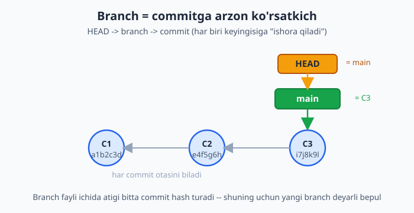
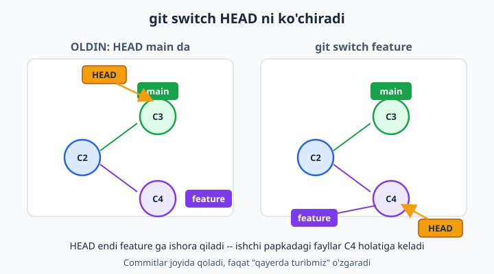
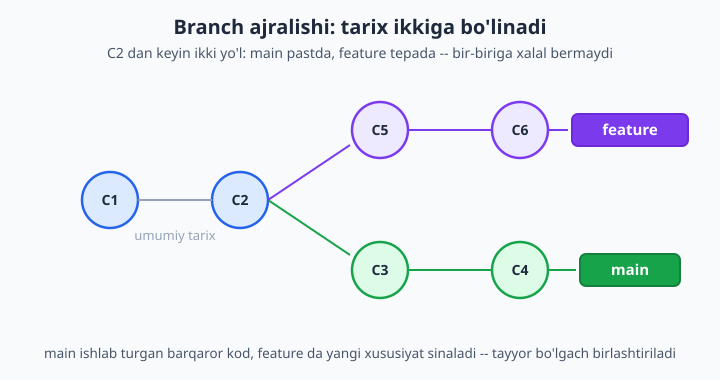

# 7 — Branch — shoxlar

[⬅️ Oldingi: 06 — Orqaga qaytish: restore, reset, revert](./06-orqaga-qaytish.md) · [🏠 README](./README.md) · [Keyingi: 08 — Merge va konfliktlar ➡️](./08-merge-konflikt.md)

> **Bu bobda:** asosiy kodni buzmasdan yangi xususiyat sinash uchun branch (shox) bilan ishlashni o'rganamiz: branch aslida commitga ulangan arzon ko'rsatkich ekanini, `git branch` bilan ro'yxat ko'rishni, `git switch` va `git switch -c` bilan shoxlar orasida sakrashni, HEAD nima ekanini, ikki shox qanday ajralib (divergence) ketishini, `git branch -d/-D/-m` bilan o'chirish va nomlashni, hamda boshlovchilarni qo'rqitadigan "detached HEAD" holatini va undan chiqishni ko'rib chiqamiz.

---

## Muammo

Tasavvur qiling: siz uch kishilik jamoa bilan do'kon saytini yozyapsiz. Sayt ishlayapti — mijozlar mahsulot ko'ryapti, buyurtma beryapti. Endi sizga "saytga qorong'i rejim (dark mode) qo'shing" degan vazifa berildi.

Eski usul bilan ishlasangiz, qo'rquv bor: qorong'i rejimni yozaman deb saytning hozir ishlab turgan kodini buzib qo'ysam-chi? Yarmida tashlab ketsam, sayt umuman ochilmay qolsa-chi? Mijoz aynan shu payt kirsa-chi?

Aynan shu muammoni Git **branch** (shox) hal qiladi. Branch — asosiy ishingizdan **alohida, xavfsiz makon**. Siz `main` shoxidagi ishlaydigan koddan bir nusxa "shox" ochasiz, qorong'i rejimni o'sha yerda bemalol yozasiz, sinab ko'rasiz, buzasiz, tuzatasiz — `main` esa daxlsiz, toza, ishlab turaveradi. Tayyor bo'lganda ikkalasini birlashtirasiz (buni keyingi bobda ko'ramiz).

```bash
git switch -c dark-mode      # "dark-mode" nomli yangi shox ochib, unga o'tdim
# ... bemalol ishlaysiz, commit qilasiz ...
git switch main              # main ga qaytsam — hammasi joyida, hech narsa o'zgarmagan
```

Bu bobda ana shu mexanizmni — uning aslida qanchalik sodda va arzon ekanini — tushunib olamiz.

---

## Branch aslida nima? (Eng muhim g'oya)

Ko'pchilik boshlovchilar branchni "loyihaning to'liq nusxasi" deb tasavvur qiladi — go'yo papka ko'paytirilgandek. **Bu noto'g'ri** va aynan shu noto'g'ri tasavvur Gitni qiyin ko'rsatadi.

Haqiqat juda sodda: **branch — bu bitta commitga ishora qiluvchi ko'rsatkich (nomli yorliq), xolos.**

5-bobda commit haqida o'rgangandik: har bir commit — tarixdagi suratlardan biri, va uning o'ziga xos uzun nomi (hash) bor, masalan `a1b2c3d...`. Branch esa shunchaki bir varaqcha qog'oz: ustiga branch nomi (`main`), ichiga esa bitta commit hashi yozilgan. Tamom.

> **Hash (hash)** — har commitga Git bergan o'ziga xos uzun belgi-raqamli "barmoq izi". Branch fayli ichida atigi shu hashning o'zi turadi.

Buni o'z ko'zingiz bilan ko'rishingiz mumkin. Har repozitoriyda `.git/refs/heads/` papkasi bor, undagi har fayl — bitta branch:

```bash
cat .git/refs/heads/main
```

```text
c4e98b3fa8107549cf7843cc45b215897b4e5a27
```

Ko'rdingizmi? `main` shoxi — bor-yo'g'i 40 ta belgidan iborat bitta satr. Ana shuning uchun yangi branch ochish **deyarli bepul va lahzalik** — Git butun loyihani nusxalamaydi, u atigi yangi kichkina fayl yaratib, ichiga 40 ta belgi yozadi.



📌 Aynan shu sabab Gitda branch ochish boshqa eski versiya nazorat tizimlaridan farqli ravishda shu qadar tez va og'riqsiz. Tajribali dasturchilar kuniga bir nechta branch ochib yopadi — bu odatiy hol, dabdaba emas.

## HEAD — "men hozir qayerdaman?"

Branch — commitga ishora. Xo'sh, Git o'zi qaysi branchda turganini qayerdan biladi? Buni **HEAD** deb ataladigan maxsus ko'rsatkich hal qiladi.

**HEAD** — "siz hozir qaysi branchdasiz" degan savolning javobi. U odatda biror branchga ishora qiladi, branch esa commitga. Yani zanjir bunday:

```text
HEAD  ->  main  ->  c4e98b3 (commit)
```

Buni ham ko'rsangiz bo'ladi:

```bash
cat .git/HEAD
```

```text
ref: refs/heads/main
```

`ref: refs/heads/main` degani — "HEAD hozir `main` branchga ishora qilyapti". Demak, siz `main`dasiz. Hozirgi branch nomini sodda buyruq bilan ham bilsa bo'ladi:

```bash
git branch --show-current
```

```text
main
```

💡 Nega bu muhim? Chunki yangi commit qilsangiz, Git aynan HEAD ko'rsatib turgan branchni yangi commitga **suradi**. Yani `main`da turib commit qilsangiz, `main` oldinga siljiydi; `dark-mode`da turib commit qilsangiz, `dark-mode` siljiydi, `main` esa joyida qoladi. Mana shu — branchlarning butun siri.

## Branchlarni ko'rish: git branch

Eng oddiy buyruqdan boshlaymiz — `git branch` argumentsiz ishlatilsa, mavjud shoxlar ro'yxatini beradi:

```bash
git branch
```

```text
* main
```

Yulduzcha (`*`) — siz **hozir turgan** branchni bildiradi. Hozir bizda bitta `main` bor (yangi repozitoriyda Git default shox sifatida `main` yaratadi).

Ko'proq ma'lumot kerak bo'lsa, `-v` (verbose — batafsil) qo'shing — har branchning oxirgi commiti ham ko'rinadi:

```bash
git branch -v
```

```text
* main  c4e98b3 main: footer qoshildi
```

| Belgi | Ma'nosi |
|---|---|
| `*` | hozir turgan (joriy) branch |
| `main` | branch nomi |
| `c4e98b3` | shu branch ishora qilayotgan commitning qisqa hashi |
| `main: footer qoshildi` | o'sha commitning xabari |

📌 `git branch` ro'yxat ko'rsatsa-da, hech narsa yaratmaydi yoki o'zgartirmaydi — bemalol ishlatavering, xavfsiz buyruq.

## Yangi branch yaratish: git branch <nom>

Yangi shox ochish uchun nom beramiz:

```bash
git branch dark-mode
```

Bu buyruq `dark-mode` nomli yangi shox yaratadi — **lekin sizni unga o'tkazmaydi**. Ya'ni HEAD hali ham `main`da. Tekshiramiz:

```bash
git branch
```

```text
  dark-mode
* main
```

`dark-mode` paydo bo'ldi, ammo yulduzcha hamon `main`da. Yangi shox aynan **hozir turgan commitdan** ochiladi — ya'ni `dark-mode` ham, `main` ham ayni paytda bir xil commitga ishora qiladi. Ular hali farq qilmaydi; farq siz qaysidir birida commit qilganingizda boshlanadi.

❌ Tez-tez uchraydigan xato: `git branch dark-mode` deb yozib, keyin shu yerda commit qila boshlash. Lekin siz hali `main`dasiz! Commit `dark-mode`ga emas, `main`ga tushadi. Shuning uchun shox ochish va unga o'tishni odatda bitta buyruqda bajaramiz — keyingi bo'limga qarang.

## Shoxga o'tish: git switch

Bir shoxdan ikkinchisiga o'tish uchun `git switch` ishlatamiz:

```bash
git switch dark-mode
```

```text
Switched to branch 'dark-mode'
```

Endi HEAD `dark-mode`ga ishora qiladi. `git branch` qilsangiz, yulduzcha ko'chgan bo'ladi:

```text
* dark-mode
  main
```

`git switch` qachon ishlasa, Git uchta ishni qiladi: (1) HEAD ni yangi branchga ko'chiradi, (2) ishchi papkangizdagi fayllarni o'sha branch ishora qilgan commit holatiga keltiradi, (3) `git status` ham endi yangi branchni ko'rsatadi. Yani fayllaringiz "vaqt mashinasi"da o'sha shoxning holatiga sakraydi.



📌 **`git switch` va `git checkout` farqi.** Eski qo'llanmalarda `git checkout dark-mode` ko'rasiz — u ham ishlaydi va bir xil natija beradi. Lekin `git checkout` o'ta ko'p vazifani bajaradigan (branchga o'tish ham, fayl tiklash ham) chalkash buyruq edi. Shuning uchun zamonaviy Git (2019 yildan beri) uni ikkiga bo'ldi: branchlar uchun `git switch`, fayllarni tiklash uchun `git restore` (6-bobda ko'rgan edingiz). Yangi o'rganayotgan bo'lsangiz, `git switch`ni ishlating — u aniqroq va xavfsizroq.

## Yaratib darrov o'tish: git switch -c

Aksariyat hollarda biz yangi shox ochib, darrov unga o'tmoqchi bo'lamiz. Ikki buyruqni (`git branch` + `git switch`) bittaga qisqartiramiz — `-c` (create — yaratish) bayrog'i bilan:

```bash
git switch -c login-sahifa
```

```text
Switched to a new branch 'login-sahifa'
```

Bu aynan quyidagi ikki buyruqqa teng:

```bash
git branch login-sahifa
git switch login-sahifa
```

💡 Amalda dasturchilar deyarli doim `git switch -c <nom>` ishlatadi. Buni yodda tuting — bu kundalik eng tez-tez yoziladigan buyruqlardan biri. (Eski uslubdagi muqobili — `git checkout -b <nom>` — u ham hamon ishlaydi.)

📌 Branch nomi bo'shliqsiz yozilsin. Bir necha so'z kerak bo'lsa, chiziqcha bilan ajrating: `login-sahifa`, `bug-123-narx`, `feature/savatcha`. Slash (`/`) bilan nom guruhlash ham keng tarqalgan: `feature/dark-mode`, `fix/login-xato`.

## Ikki shoxda parallel ishlash va ajralish (divergence)

Endi branchning butun kuchini ko'ramiz. Quyidagi ssenariyni tasavvur qiling: bosh sahifa tayyor (`main`), siz login sahifasini alohida shoxda yozyapsiz.

```bash
# main da boshlang'ich holat
git switch main
git switch -c login-sahifa            # login uchun yangi shox
echo "<form>login</form>" >> index.html
git commit -am "login: forma qoshildi"   # bu commit login-sahifa ga tushadi
```

Ayni paytda boshqa hamkasbingiz `main`da footer qo'shdi:

```bash
git switch main                       # main ga qaytdik
echo "<footer>2026</footer>" >> index.html
git commit -am "main: footer qoshildi"   # bu commit main ga tushadi
```

Endi nima bo'ldi? `main`da `login-sahifa`da yo'q commit bor, `login-sahifa`da esa `main`da yo'q commit bor. Tarix **ikkiga ajraldi** — buni inglizcha **divergence** (ajralish) deb ataladi. Buni ko'rish uchun ajoyib buyruq bor:

```bash
git log --graph --all --oneline
```

```text
* c4e98b3 main: footer qoshildi
| * 2b48b68 login: forma qoshildi
|/
* f35bbcc birinchi commit: bosh sahifa
```

Chap tomondagi chiziqlar (`|`, `/`) tarixning qanday shoxlanganini chizib beradi: pastda umumiy ona-commit, undan yuqorida ikki alohida yo'l. Ikkala shox bir-biriga **mutlaqo xalal bermaydi**.



📌 Diqqat qiling: `git switch main` qilganingizda `index.html`dagi login formasi **yo'qoladi** (chunki u faqat `login-sahifa`da bor), `git switch login-sahifa` qilsangiz esa qaytadan **paydo bo'ladi**. Bu xato emas — har shox o'z fayllar holatini saqlaydi. Boshlovchilar buni ko'rib "fayllarim o'chib ketdi!" deb cho'chiydi, aslida ular xavfsiz, faqat boshqa shoxda turibdi.

💡 Ikki shoxni keyinchalik birlashtirish (`login-sahifa`dagi ishni `main`ga olib kelish) — bu keyingi bobning mavzusi: **merge**. Hozircha shuni biling: ajralish — bu normal va kerakli holat; merge esa ikki yo'lni qayta bitta qilib qo'shadi.

## Ishlash tartibi: main va feature konvensiyasi

Branchlarni qanday tashkil qilish bo'yicha jamoalar o'rtasida keng tarqalgan kelishuv (konvensiya) bor:

- **`main`** — har doim **barqaror, ishlaydigan** kod turadi. To'g'ridan-to'g'ri `main`da yozib o'tirilmaydi.
- **feature branch** (xususiyat shoxi) — har bir yangi vazifa uchun alohida, qisqa umrli shox: `feature/savatcha`, `fix/login-xato`, `dark-mode`. Vazifa tayyor bo'lgach, u `main`ga birlashtiriladi va o'chiriladi.

```text
main          o----o----o------------o   (doimo ishlaydi)
                    \              /
feature/savatcha     o----o----o      (savatcha bu yerda yoziladi, keyin main ga qo'shiladi)
```

Bu yondashuvning foydasi: `main` hech qachon "yarim ishlangan" holatda turmaydi. Istalgan vaqtda saytni `main`dan yoyish (deploy) bexavotir — chunki u har doim toza.

📌 Branchga ma'noli nom bering. `test`, `yangi`, `aaa` kabi nomlar bir oydan keyin sizga hech narsa demaydi. `fix/narx-hisoblash` esa o'zini o'zi tushuntiradi.

## Branchni o'chirish: git branch -d va -D

Vazifa tugadi, shoxni `main`ga birlashtirdingiz — endi keraksiz shoxni tozalash kerak. Buning uchun `-d` (delete — o'chirish):

```bash
git branch -d login-sahifa
```

```text
Deleted branch login-sahifa (was 2b48b68).
```

📌 `-d` — **xavfsiz** o'chirish. Agar shoxda `main`ga hali birlashtirilmagan commitlar bo'lsa, Git o'chirishni **rad etadi** va ogohlantiradi:

```text
error: the branch 'login-sahifa' is not fully merged
hint: If you are sure you want to delete it, run 'git branch -D login-sahifa'
```

Bu — sizning do'stingiz! U "to'xta, bu shoxdagi ishing hali hech qayerga saqlanmagan, o'chirsang yo'qoladi" deyapti. Agar rostan ham bu ishni tashlab yubormoqchi bo'lsangiz, katta `-D` bilan **majburiy** o'chirasiz:

```bash
git branch -D login-sahifa
```

```text
Deleted branch login-sahifa (was 2b48b68).
```

❌ `-D` ehtiyotkorlik talab qiladi: birlashtirilmagan commitlardagi ishingizni yo'qotishingiz mumkin. Faqat o'sha ishni rostan ham keraksiz deb bilganingizdagina ishlating. (Adashib o'chirib qo'ysangiz ham, 16-bobdagi `reflog` ko'pincha qutqaradi — lekin unga tayanmaslik yaxshi.)

💡 Hozir turgan branchni o'chira olmaysiz — avval boshqasiga o'ting. "O'tirgan shoxingizni kesa olmaysiz" degan maqolni eslang.

## Branchni qayta nomlash: git branch -m

Shox nomini xato yozdingizmi yoki fikr o'zgardimi? `-m` (move/rename — ko'chirish/qayta nomlash) yordamga keladi:

```bash
git branch -m login-sahifa kirish-sahifa
```

Bu `login-sahifa`ni `kirish-sahifa`ga aylantiradi. Agar **hozir turgan** shoxni nomlamoqchi bo'lsangiz, eski nomni tashlab ketsangiz ham bo'ladi:

```bash
git branch -m yangi-nom        # joriy shoxni "yangi-nom" ga aylantiradi
```

📌 Eski loyihalarda asosiy shox `master` deb nomlangan bo'lishi mumkin. Uni zamonaviy `main`ga nomlash uchun aynan shu buyruq ishlatiladi:

```bash
git branch -m master main
```

## Detached HEAD — "ajralgan HEAD" tuzog'i

Endi boshlovchilarni eng ko'p qo'rqitadigan, lekin aslida zararsiz holat haqida. Odatda HEAD branchga ishora qiladi (`HEAD -> main -> commit`). Lekin ba'zan HEAD to'g'ridan-to'g'ri **commitga** ishora qilib qoladi — branchni o'rtada qoldirib. Buni **detached HEAD** ("ajralgan HEAD") deyiladi.

Bu qachon yuz beradi? Ko'pincha eski commitni ko'rmoqchi bo'lib, uning hashiga to'g'ridan-to'g'ri o'tganingizda:

```bash
git switch --detach a1b2c3d      # eski commitni "tomosha qilish" uchun unga o'tdik
```

```text
HEAD is now at a1b2c3d birinchi commit: bosh sahifa
```

Endi `git status` qilsangiz, ogohlantirish ko'rasiz:

```bash
git status
```

```text
HEAD detached at a1b2c3d
nothing to commit, working tree clean
```

`.git/HEAD` fayliga qarasangiz, endi u branchga emas, **to'g'ridan-to'g'ri commit hashiga** ishora qilyapti:

```bash
cat .git/HEAD
```

```text
a1b2c3d4d6428ead9dd8278d8e5e402ac5aa7001
```

Odatdagi `ref: refs/heads/main` o'rniga yalang'och hash turibdi — mana shu "ajralganlik".

📌 **Nega bu xavfli?** Detached HEAD holatida commit qila olasiz, lekin bu commitlar **hech qaysi branchga ulanmaydi**. Boshqa branchga o'tib ketsangiz, ularga qaytib kelishning oson yo'li bo'lmaydi — vaqt o'tib Git ularni "egasiz" deb yig'ishtirib tashlashi ham mumkin. Ya'ni ishingiz yo'qolib ketishi xavfi bor.

💡 **Detached HEAD — bu xato emas, balki holat.** Undan chiqish juda oson — shunchaki biror branchga oddiy `git switch` qiling:

```bash
git switch main
```

```text
Previous HEAD position was a1b2c3d birinchi commit: bosh sahifa
Switched to branch 'main'
```

`.git/HEAD` yana `ref: refs/heads/main` bo'ladi — HEAD qayta branchga "ulandi", hammasi joyida.

✅ Agar detached HEAD holatida turib biror foydali narsa yozib qo'ygan bo'lsangiz va uni saqlamoqchi bo'lsangiz, boshqa branchga o'tishdan **oldin** o'sha yerda yangi branch oching, ish saqlanib qoladi:

```bash
git switch -c saqlangan-ish       # joriy (detached) holatdan yangi branch ochib, unga ulanamiz
```

Endi ishingiz `saqlangan-ish` shoxiga bog'landi va yo'qolmaydi.

## Nega branch shu qadar tez?

Bobni boshlagan g'oyaga qaytamiz. Boshqa eski tizimlarda "shox ochish" butun loyiha fayllarini nusxalashni anglatardi — bu sekin va og'ir edi, shuning uchun dasturchilar branchdan qochardi.

Gitda branch — atigi 40 belgilik bitta fayl (commit hashi). Yangi branch ochish — shu faylni yaratish, xolos. Ishchi papkadagi haqiqiy fayllaringiz hech qayerga nusxalanmaydi. Ana shuning uchun:

- yangi branch lahzada ochiladi;
- 100 ta branch ochsangiz ham disk deyarli band bo'lmaydi;
- branchlar orasida o'tish (`switch`) ham tez.

📌 Mana shu arzonlik tufayli Gitda "kuniga ko'p branch ochib-yopish" — odatiy ish uslubi. Har yangi vazifa = yangi branch. Buni qo'rqmasdan qiling.

## Asosiy buyruqlar — qisqa jadval

| Buyruq | Vazifasi |
|---|---|
| `git branch` | branchlar ro'yxatini ko'rsatadi (`*` — joriy) |
| `git branch -v` | ro'yxat + har birining oxirgi commiti |
| `git branch <nom>` | yangi shox yaratadi (lekin o'tkazmaydi) |
| `git switch <nom>` | mavjud shoxga o'tadi |
| `git switch -c <nom>` | shox yaratib, darrov unga o'tadi |
| `git switch -` | oldingi turgan shoxga qaytadi |
| `git branch -d <nom>` | shoxni o'chiradi (xavfsiz: birlashmagan bo'lsa rad etadi) |
| `git branch -D <nom>` | shoxni majburiy o'chiradi |
| `git branch -m <eski> <yangi>` | shoxni qayta nomlaydi |
| `git branch --show-current` | joriy shox nomini chiqaradi |
| `git switch --detach <hash>` | commitga to'g'ridan-to'g'ri o'tadi (detached HEAD) |

---

## 7-bob mashqlari

Quyidagi mashqlarni alohida sinov papkasida bajaring (loyiha papkangizda emas). Avval bo'sh papka ochib, ichida `git init -b main` qiling, bitta-ikkita fayl yaratib commit qiling — keyin mashqlarga o'ting. Mashqlar bosqichma-bosqich qiyinlashadi.

1. Yangi `sinov-git` papkasi yarating, ichida `git init -b main` ishlating va bitta `index.html` fayli bilan birinchi commitni qiling. So'ng `git branch` bilan hozir qaysi shoxda turganingizni ko'ring.
2. `git branch ishlanma` buyrug'i bilan yangi shox yarating. `git branch` ro'yxatida yulduzcha (`*`) qaysi shoxda turganini kuzating — siz hali `ishlanma`da emassiz, buni tushuntirib bering.
3. `git switch ishlanma` bilan yangi shoxga o'ting va `git branch` orqali yulduzcha ko'chganini tekshiring.
4. `main`ga qayting, so'ng `git switch -c dark-mode` bitta buyruq bilan yangi shox ochib darrov unga o'ting. 2-3-mashqlardagi ikki bosqichni bitta buyruq qanday almashtirganini taqqoslang.
5. `dark-mode` shoxida `index.html`ga biror satr qo'shing va commit qiling. So'ng `main`ga o'ting va `index.html`ni oching — qo'shgan satringiz qayerga "g'oyib bo'lganini" tushuntiring.
6. `git branch --show-current` buyrug'ini har bir shoxda turib ishlatib, natijani kuzating.
7. `.git/HEAD` faylining ichini ko'ring (`cat .git/HEAD`). Turli shoxlarga o'tib, bu fayl ichidagi yozuv qanday o'zgarishini kuzating.
8. `.git/refs/heads/` papkasidagi fayllarni ro'yxatlang. Har bir fayl nomi nimaga teng ekanini va ichida nima turganini aniqlang.
9. `main`da yangi commit qiling, `dark-mode`da ham boshqa commit qiling. So'ng `git branch -v` bilan ikki shoxning oxirgi commitlari farqli ekanini ko'ring.
10. `git log --graph --all --oneline` ishlatib, tarix ikkiga ajralganini (divergence) chizilgan ko'rinishda kuzating. Chap tomondagi chiziqlar nimani anglatishini izohlang.
11. `git switch -` (chiziqcha bilan) buyrug'ini ishlatib ko'ring — u sizni qayerga olib borishini aniqlang.
12. `feature/savatcha` nomli shox oching (slash bilan). `git branch` ro'yxatida u qanday ko'rinishini kuzating.
13. `dark-mode`ni `main`ga hali birlashtirmasdan turib `git branch -d dark-mode` qilib ko'ring. Git nima deb javob berishini va nega rad etishini o'qib chiqing.
14. Endi `git branch -D dark-mode` bilan o'sha shoxni majburiy o'chiring. `-d` va `-D` orasidagi farqni o'z so'zlaringiz bilan yozib qo'ying.
15. Hozir turgan shoxni `git branch -d` bilan o'chirib ko'ring. Git nima deydi va nega? Xulosa chiqaring.
16. Biror shoxni `git branch -m eski-nom yangi-nom` bilan qayta nomlang va `git branch` ro'yxatida o'zgarishni tasdiqlang.
17. `git log --oneline` bilan eski bir commitning qisqa hashini oling, so'ng `git switch --detach <hash>` bilan o'sha commitga o'ting. `git status` va `git branch` nima deyishini diqqat bilan o'qing.
18. Detached HEAD holatida turib `cat .git/HEAD` qiling. Odatdagi `ref: refs/heads/...` o'rniga nima turganini va bu nimani anglatishini izohlang.
19. Detached HEAD holatidan `git switch main` bilan chiqing. Chiqishdan oldin va keyin `.git/HEAD` ichidagi farqni taqqoslang.
20. Yana detached HEAD ga o'ting, o'sha yerda `index.html`ga o'zgarish kiritib commit qiling, keyin boshqa shoxga o'tishdan **oldin** `git switch -c saqlangan-ish` bilan ishingizni yangi shoxga saqlang. Nega bu qadam zarurligini tushuntiring.
