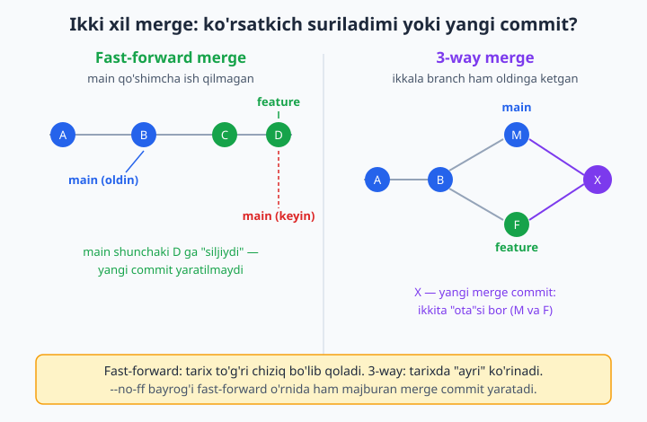
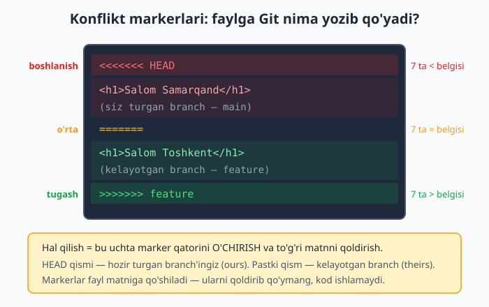
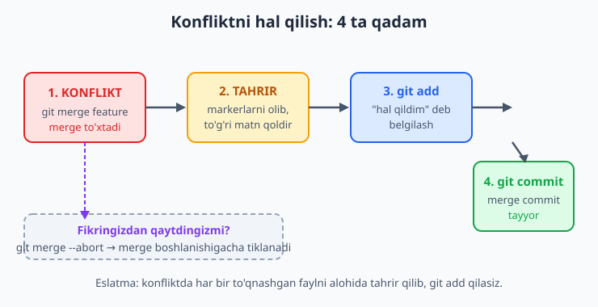

# 8 — Merge va konfliktlar

[⬅️ Oldingi: 07 — Branch — shoxlar](./07-branch.md) · [🏠 README](./README.md) · [Keyingi: 09 — Rebase va interaktiv rebase ➡️](./09-rebase.md)

> **Bu bobda:** 7-bobda ish uchun alohida shox (branch) ochishni o'rgandik; endi tayyor bo'lgan ishni asosiy shoxga **qaytadan qo'shishni** — merge (birlashtirish) qilishni ko'ramiz. Git buni ikki yo'l bilan bajaradi: fast-forward (ko'rsatkichni shunchaki oldinga surish) va 3-way merge (yangi merge commit yaratish). `--no-ff` bayrog'ini, eng qo'rqinchli ko'ringan, aslida oddiy bo'lgan KONFLIKT (ikki branch bir joyni o'zgartirgani uchun Git o'zi qaror qila olmaydigan holat) hodisasini, konflikt markerlarini o'qishni, ularni qo'lda hal qilishni va istalgan paytda `git merge --abort` bilan ortga qaytishni qadama-qadam o'rganamiz.

---

## Muammo

Tasavvur qiling: siz uch kishilik jamoa bilan do'kon saytini yozyapsiz. Siz `login-sahifa` degan branch'da ishladingiz — bir necha kun, bir necha commit. Login tugmasi tayyor, sinab ko'rildi, hammasi joyida. Endi bu ishni hamma ko'radigan, sayt "rasman" yashaydigan asosiy branch — `main`'ga qo'shish kerak.

Savol: branch'dagi commitlarni `main`'ga qanday "ko'chiramiz"? Fayllarni qo'lda nusxalab tashlaymizmi? Yo'q — bu Git'da bitta buyruq bilan hal bo'ladi:

```bash
git switch main
git merge login-sahifa
```

O'qilishi: "main'ga o't, keyin login-sahifa branch'idagi ishni shu yerga BIRLASHTIR". Birinchi qatorni unutmaslik muhim: **siz qabul qiluvchi branch'da turishingiz kerak**. "Kimga qo'shyapman?" — o'sha branch'da turing; "nimani qo'shyapman?" — uning nomini `merge` dan keyin yozing.

📌 Yodda tuting: `git merge feature` **feature'ni** sizning hozirgi branch'ingizga olib keladi, teskari emas. Adashib `feature`'da turib `git merge main` yozsangiz, main'ni feature'ga qo'shib qo'yasiz — bu butunlay boshqa narsa.

Endi Git ichida nima sodir bo'lishini ko'ramiz. Bu jarayonning ikkita ko'rinishi bor va qaysi biri ishlashi `main` sizdan keyin oldinga ketganmi-yo'qmi shunga bog'liq.

## Fast-forward merge — eng oddiy holat

Eng sodda vaziyat: siz `feature` branch'da ishlaganingizda `main`'ga **hech kim tegmagan**. Ya'ni `main` o'sha joyida turibdi, `feature` esa undan oldinga ketgan. Bunday holatda Git hech qanday yangi commit yaratmaydi — u shunchaki `main` ko'rsatkichini `feature` turgan joyga **suradi**. Buni "fast-forward" (oldinga tez surish) deyiladi.

Buni o'z ko'zingiz bilan ko'rasiz. Sinov uchun bo'sh papka ochib (loyihangizga emas!), quyidagilarni yozing:

```bash
git init -b main
echo "loyiha" > README.md
git add README.md
git commit -m "boshlang'ich commit"

git switch -c feature        # yangi branch ochib, unga o'tamiz
echo "yangi funksiya" > feature.txt
git add feature.txt
git commit -m "feature qoshildi"

git switch main              # main'ga qaytamiz — u joyidan jilmagan
git merge feature
```

Natija:

```text
Updating 022b7d6..d331019
Fast-forward
 feature.txt | 1 +
 1 file changed, 1 insertion(+)
 create mode 100644 feature.txt
```

`Fast-forward` so'zi — kalit belgi. Tarixga qarasak, hammasi bitta to'g'ri chiziq bo'lib qoladi:

```bash
git log --oneline --graph
```

```text
* d331019 feature qoshildi
* 022b7d6 boshlang'ich commit
```

💡 Fast-forward "toza" tarix qoldiradi: hech qanday qo'shimcha merge commit yo'q, go'yo siz bu ishni boshidan to'g'ri `main`'da qilgandek ko'rinadi.

## 3-way merge — ikkala branch ham oldinga ketgan

Endi haqiqiy jamoaviy vaziyat. Siz `feature`'da ishlayotganingizda, hamkasbingiz `main`'ga **boshqa** o'zgarish qo'shdi (masalan, README'ni tahrirladi). Endi ikkala branch ham umumiy ajdoddan keyin har biri o'z yo'lidan ketgan. Git endi ko'rsatkichni shunchaki sura olmaydi — chunki `main`'da `feature`'da yo'q ish bor. Shuning uchun u **yangi merge commit** yaratadi: bu commit ikkita "ota"ga ega — bittasi `main`, ikkinchisi `feature`. Bunday birlashtirishni "3-way merge" deyiladi (uch nuqta: umumiy ajdod + ikkala branch uchi).

```bash
git init -b main
echo "loyiha" > README.md
git add .
git commit -m "boshlang'ich"

git switch -c feature
echo "feature ishi" > feature.txt
git add .
git commit -m "feature ishi"

git switch main
echo "main ham oldinga ketdi" > main.txt   # main alohida o'zgardi
git add .
git commit -m "main ishi"

git merge feature
```

Bu safar natija boshqacha:

```text
Merge made by the 'ort' strategy.
 feature.txt | 1 +
 1 file changed, 1 insertion(+)
 create mode 100644 feature.txt
```

`Merge made by the 'ort' strategy` — demak yangi merge commit yaratildi (`ort` — Git'ning zamonaviy birlashtirish algoritmi nomi, esda saqlash shart emas). Tarixga qaraylik:

```bash
git log --oneline --graph
```

```text
*   2793077 Merge branch 'feature'
|\
| * 2e8ac45 feature ishi
* | 5e1806e main ishi
|/
* e7aea53 boshlang'ich
```

Mana shu "ayri" (`|\` va `|/`) — ikki shox ajralib, keyin qayta qo'shilganini ko'rsatadi. Eng yuqoridagi `Merge branch 'feature'` — o'sha yangi merge commit.



📌 Ikkalasi orasidagi farqni tanlamaysiz — Git buni vaziyatga qarab **o'zi** hal qiladi. `main` jilmagan bo'lsa fast-forward, jilgan bo'lsa 3-way merge. Sizdan faqat `git merge feature` talab qilinadi.

## `--no-ff` — har doim merge commit

Ba'zan fast-forward mumkin bo'lsa ham, siz baribir alohida merge commit xohlaysiz. Nega? Chunki merge commit tarixda "mana shu yerda feature branch qo'shildi" degan aniq belgi qoldiradi — keyinchalik "bu ish qaysi branch'dan kelgan?" degan savolga javob beradi. Buning uchun `--no-ff` (no fast-forward) bayrog'i bor:

```bash
git merge --no-ff feature
```

Fast-forward mumkin bo'lsa ham, Git majburan yangi merge commit yaratadi:

```text
Merge made by the 'ort' strategy.
 b.txt | 1 +
 1 file changed, 1 insertion(+)
 create mode 100644 b.txt
```

```text
*   ca3b11e Merge branch 'feature'
|\
| * c023333 feature ishi
|/
* 1894cbc boshlang'ich
```

💡 Ko'p jamoalar GitHub'da Pull Request'larni aynan `--no-ff` uslubida birlashtiradi — shunda har bir tugatilgan vazifa tarixda alohida "tugun" bo'lib ko'rinadi. Buni 13-bobda Pull Request'larda qaytadan ko'ramiz.

## KONFLIKT — Git o'zi hal qila olmaydigan holat

Mana bobning eng muhim qismi. Yangi boshlovchilar konfliktdan ko'p qo'rqadi, lekin haqiqatda u — oddiy va kutilgan hodisa.

Konflikt **bitta sababdan** kelib chiqadi: ikkala branch faylning **aynan bir xil qatorini** boshqa-boshqacha o'zgartirgan. Git aqlli, lekin u sizning o'rningizga qaror qabul qila olmaydi: "Samarqand to'g'rimi yoki Toshkent?" — buni faqat siz bilasiz. Shuning uchun u to'xtaydi va sizdan "qaysi birini qoldiray?" deb so'raydi.

📌 Muhim: agar branch'lar **turli** qatorlarni yoki **turli** fayllarni o'zgartirgan bo'lsa, konflikt **bo'lmaydi** — Git ikkalasini ham bemalol qo'shib yuboradi. Konflikt faqat "ustma-ust" tushgan o'zgarishlarda chiqadi.

Buni ataylab yaratib ko'ramiz (eng yaxshi o'rganish usuli). Sinov papkasida:

```bash
git init -b main
printf 'Salom dunyo\n' > index.html
git add .
git commit -m "boshlang'ich"

git switch -c feature
printf 'Salom Toshkent\n' > index.html    # feature shu qatorni o'zgartiradi
git add .
git commit -m "feature: sarlavha ozgartirildi"

git switch main
printf 'Salom Samarqand\n' > index.html    # main XUDDI SHU qatorni boshqacha o'zgartiradi
git add .
git commit -m "main: sarlavha ozgartirildi"

git merge feature
```

Git to'xtaydi:

```text
Auto-merging index.html
CONFLICT (content): Merge conflict in index.html
Automatic merge failed; fix conflicts and then commit the result.
```

`CONFLICT (content)` — to'qnashuv yuz berdi. Bu xato xabari **emas** — bu "yordamim kerak" degan ma'noda. Endi `git status` aniq nima qilish kerakligini aytadi:

```bash
git status
```

```text
On branch main
You have unmerged paths.
  (fix conflicts and run "git commit")
  (use "git merge --abort" to abort the merge)

Unmerged paths:
  (use "git add <file>..." to mark resolution)
	both modified:   index.html

no changes added to commit (use "git add" and/or "git commit -a")
```

E'tibor bering — Git hamma narsani aytib turibdi: `both modified: index.html` ("ikkalasi ham o'zgartirgan"), va pastdagi qavslarda keyingi qadam ham yozilgan. Status — sizning eng yaqin yordamchingiz, konfliktda uni tez-tez o'qing.

## Konflikt markerlarining anatomiyasi

Endi `index.html` faylini oching. Git uning ichiga maxsus **markerlar** (belgilar) qo'shib qo'ygan:

```text
<<<<<<< HEAD
Salom Samarqand
=======
Salom Toshkent
>>>>>>> feature
```

Buni o'qish oson, faqat uchta qism bor:

| Qism | Nimani anglatadi |
|---|---|
| `<<<<<<< HEAD` | Boshlanish belgisi (7 ta `<`). Bundan keyingi qism — siz **turgan** branch (HEAD = hozirgi, ya'ni main). Inglizcha "ours" deyiladi. |
| `=======` | O'rta ajratuvchi (7 ta `=`). Yuqori va pastki versiyalarni bo'lib turadi. |
| `>>>>>>> feature` | Tugash belgisi (7 ta `>`). Undan oldingi qism — **kelayotgan** branch (feature). Inglizcha "theirs" deyiladi. |



📌 Yodda saqlang: yuqoridagi (`HEAD`) — **siz qaysi branch'da turib merge qilgan** bo'lsangiz, o'sha. Pastdagi — siz **olib kelayotgan** branch. Adashmaslik uchun har doim marker yonidagi nomga qarang.

💡 Konflikt bir faylda bir nechta joyda ham chiqishi mumkin — har bir to'qnashgan joy o'z marker to'plamiga ega bo'ladi. Hammasini bittalab hal qilish kerak.

## Konfliktni qo'lda hal qilish

Hal qilish — bu uchta marker qatorini **o'chirib**, faylda **to'g'ri matnni qoldirish**. Uch yo'l bor: faqat yuqorigisini qoldirasiz, faqat pastkisini qoldirasiz, yoki ikkalasini birlashtirib o'zingizcha yangi matn yozasiz.

Bizning misolda "ikkalasini birlashtiramiz" deylik. Faylni shunday tahrirlaymiz — markerlarni butunlay olib tashlab:

```text
Salom Toshkent va Samarqand
```

Hech qanday `<<<<<<<`, `=======`, `>>>>>>>` qolmasligi kerak! Endi Git'ga "men buni hal qildim" deb aytamiz — `git add` orqali:

```bash
git add index.html
git status
```

```text
M  index.html
```

Status'da endi "unmerged" yo'q — fayl hal qilingan deb belgilandi. Oxirgi qadam — merge'ni `commit` bilan yakunlash:

```bash
git commit --no-edit
```

```text
[main dab1e70] Merge branch 'feature'
```

`--no-edit` — Git tayyorlab qo'ygan standart merge xabarini ("Merge branch 'feature'") o'zgartirmasdan qabul qiladi. Tarixga qarasak — toza merge commit hosil bo'ldi:

```text
*   dab1e70 Merge branch 'feature'
|\
| * 94c0a3b feature: sarlavha ozgartirildi
* | 72a3cc9 main: sarlavha ozgartirildi
|/
* 358b34c boshlang'ich
```

Mana butun jarayon bitta rasmda: **konflikt → tahrir → add → commit**.



✅ To'g'ri tartib: faylni tahrirlash → `git add <fayl>` → `git commit`.
❌ Xato: markerlarni qoldirib `git add` qilish, yoki tahrir qilmasdan to'g'ridan-to'g'ri commit'ga urinish.

## Qoldiq markerlarni topish

Eng ko'p uchraydigan xato — markerlarning birortasini o'chirishni unutib qoldirish (masalan, `=======` qatorini). Kod buzilib qoladi. Git buni topishga yordam beradi:

```bash
git diff --check
```

Agar qoldiq marker bo'lsa, u aniq qator raqamini ko'rsatadi:

```text
index.html:1: leftover conflict marker
index.html:3: leftover conflict marker
index.html:5: leftover conflict marker
```

💡 Konfliktni hal qilgandan keyin `git commit` qilishdan **oldin** `git diff --check` ni odat qiling — bu qoldiq markerlarni ushlaydi. Hech narsa chiqmasa, hammasi toza.

📌 Qaysi fayllar to'qnashganini eslatma sifatida ko'rmoqchi bo'lsangiz: `git status` yetarli ("both modified" deb yozilganlari konfliktda). Ko'p faylli katta konfliktda esa `git diff --name-only --diff-filter=U` faqat to'qnashgan fayllar ro'yxatini beradi.

## `git merge --abort` — hammasini bekor qilish

Eng tinchlantiruvchi buyruq. Merge boshlandi, konflikt chiqdi, lekin siz "yo'q, hozir buni qilishni xohlamayman" deb fikringizdan qaytdingiz. Yoki konflikt juda chalkash, boshqatdan boshlamoqchisiz. Bitta buyruq hammasini merge boshlanishidan **oldingi** holatga qaytaradi:

```bash
git merge --abort
```

Bundan keyin:

```bash
git status        # "nothing to commit, working tree clean" — go'yo merge bo'lmagandek
```

Fayl ham markerlarsiz, o'zining merge'gacha bo'lgan holatiga qaytadi. Hech narsa yo'qolmaydi.

💡 Mana shuning uchun konfliktdan qo'rqish kerak emas: agar adashsangiz yoki dovdirab qolsangiz, `git merge --abort` har doim sizni xavfsiz boshlang'ich nuqtaga qaytaradi. Konfliktni hal qilish — qaytarib bo'lmaydigan xavfli amal emas, balki istalgan paytda bekor qilsa bo'ladigan tinch jarayon.

## Konfliktdan qo'rqmaslik — qisqacha xulosa

- Konflikt — **xato emas**, kutilgan, oddiy hodisa. Ikki kishi bir joyni o'zgartirsa, albatta chiqadi.
- Git hech qachon sizning o'rningizga noto'g'ri qaror qabul qilmaydi — shuning uchun to'xtaydi va so'raydi.
- Hal qilish doim bir xil: **faylni tahrirla → `git add` → `git commit`**.
- Yo'lni yo'qotsangiz: **`git merge --abort`** — boshlang'ich holatga qaytasiz.
- `git status` va `git diff --check` — konfliktdagi eng yaqin do'stlaringiz.

📌 Bu bobni amaliyotsiz o'qib o'tib ketmang. Pastdagi mashqlar — ayniqsa ataylab konflikt yaratish — qo'rquvni yo'qotishning eng tez yo'li. Bir-ikki marta o'z qo'lingiz bilan konflikt yaratib hal qilsangiz, u sizga oddiy ish bo'lib qoladi.

## 8-bob mashqlari

Quyidagi mashqlarning HAMMASINI sinov papkasida bajaring — loyihangizning haqiqiy `.git` katalogiga tegmang. Har bir mashq uchun yangi bo'sh papka ochib, `git init -b main` bilan boshlasangiz ham bo'ladi.

1. Yangi sinov papkasi ochib, unda `git init -b main` qiling, bitta fayl yarating va commit qiling. So'ng `git switch -c feature` bilan branch ochib, unda yangi fayl qo'shing va commit qiling. `main`'ga qaytib `git merge feature` qiling — natijada `Fast-forward` so'zini ko'rganingizni tasdiqlang.
2. 1-mashqdagi merge'dan keyin `git log --oneline --graph` ishlatib, tarix bitta to'g'ri chiziq bo'lib qolganini (hech qanday ayri yo'qligini) o'z ko'zingiz bilan ko'ring.
3. Yangi papka oching. `main`'da bir fayl commit qiling. `feature` branch ochib, unda bitta fayl qo'shing. `main`'ga qaytib **boshqa** fayl qo'shing va commit qiling (endi ikkala branch ham oldinga ketdi). `git merge feature` qiling — bu safar `Merge made by the 'ort' strategy` xabarini ko'rganingizni tasdiqlang.
4. 3-mashqdan keyin `git log --oneline --graph` ishlatib, tarixdagi "ayri" (`|\` va `|/`) belgilarni toping. Eng yuqoridagi commit xabari nima ekanini yozib qo'ying.
5. Fast-forward mumkin bo'lgan vaziyat yarating (1-mashqdagidek), lekin merge'ni `git merge --no-ff feature` bilan qiling. `git log --oneline --graph` da merge commit paydo bo'lganini, ya'ni `--no-ff` ko'rsatkichni surmasdan yangi commit yaratganini tasdiqlang.
6. Ataylab konflikt yarating: `main`'da `index.html` faylida bitta qatorli matn commit qiling. `feature` branch'da o'sha qatorni o'zgartiring va commit qiling. `main`'ga qaytib o'sha **aynan bir xil qatorni** boshqacha o'zgartiring va commit qiling. `git merge feature` qiling — `CONFLICT (content)` xabarini ko'rganingizni tasdiqlang.
7. 6-mashqdagi konflikt holatida `git status` ishlatib, `both modified` deb belgilangan faylni toping. Status pastida ko'rsatilgan ikkita maslahatni (commit qilish va abort qilish) o'qib chiqing.
8. 6-mashqdagi konfliktli faylni matn muharririda oching. Uchta marker qatorini (`<<<<<<<`, `=======`, `>>>>>>>`) toping. `HEAD` ostidagi matn qaysi branch'dan, pastki qism qaysi branch'dan kelganini yozib qo'ying.
9. 6-mashqdagi konfliktni hal qiling: faqat `HEAD` (yuqori) versiyasini qoldirib, markerlar va pastki versiyani o'chiring. `git add` va `git commit` qiling. Tarixda merge commit hosil bo'lganini tekshiring.
10. Yangi konflikt yarating (6-mashqdagidek) va bu safar faqat `feature` (pastki) versiyasini qoldirib hal qiling. Natijada faylda qaysi matn qolganini tasdiqlang.
11. Yana konflikt yarating va bu safar **ikkala** versiyani birlashtirib, o'zingizcha yangi matn yozib hal qiling (masalan ikkala so'zni ham o'z ichiga olgan jumla). Markerlarni to'liq o'chiring va merge'ni yakunlang.
12. Konflikt holatida turib `git merge --abort` ishlatib ko'ring. So'ng `git status` bilan working tree toza bo'lganini va faylda markerlar qolmaganini tasdiqlang.
13. Konfliktni hal qiling, lekin **ataylab** `=======` qatorini o'chirmay qoldiring. `git diff --check` ishlatib, Git qoldiq markerni qaysi qatorda topganini ko'ring.
14. 13-mashqdagi qoldiq markerni o'chiring, qaytadan `git diff --check` ishlatib endi hech narsa chiqmasligini (toza) tasdiqlang, so'ng commit qiling.
15. Bitta faylda **ikkita alohida** joyda konflikt yarating: faylga bir nechta qator yozing, ikkala branch'da ham ikkita turli qatorni o'zgartiring. Merge qiling va faylda ikkita alohida marker to'plami paydo bo'lganini ko'ring — ikkalasini ham hal qiling.
16. Ikkita **turli** faylni o'zgartiruvchi ikkita branch yarating (`feature` `a.txt`ni, `main` `b.txt`ni o'zgartirsin). `git merge feature` qiling va konflikt **chiqmasligini** — Git ikkalasini ham bemalol qo'shganini tasdiqlang. Nega konflikt bo'lmaganini bir jumlada yozing.
17. Konflikt holatida `git diff --name-only --diff-filter=U` ishlatib, faqat to'qnashgan fayllar ro'yxatini oling. Bir nechta faylda konflikt bo'lsa, hammasi ro'yxatda chiqishini tekshiring.
18. Konfliktni hal qilib bo'lib, `git add` qilgandan **keyin**, lekin `git commit` qilishdan **oldin** `git status` ishlatib, faylning endi "unmerged" emas, balki "staged" holatda turganini tasdiqlang.
19. `git merge --abort` va konfliktni hal qilish orasidagi farqni amalda ko'rsating: bir xil konfliktni ikki marta yarating — birinchisini `--abort` bilan bekor qiling, ikkinchisini to'liq hal qiling. Har ikki holatdan keyin `git log --oneline` da nima farq borligini yozib qo'ying.
20. Bir do'kon sayti ssenariysini taqlid qiling: `main`'da `narx.txt` faylida "narx: 100" deb yozing. `chegirma` branch'da "narx: 80" qiling, `main`'da esa boshqa hamkasb "narx: 90" qildi deb tasavvur qilib shunday o'zgartiring. Merge qiling, konfliktni "narx: 80" foydasiga hal qiling va merge commit xabariga `git commit -m "chegirma narxi qabul qilindi"` deb o'z izohingizni yozing.
