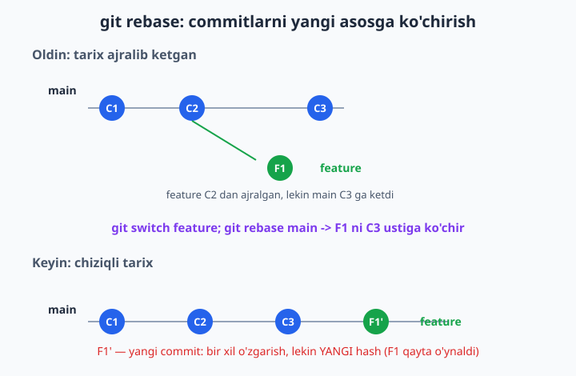
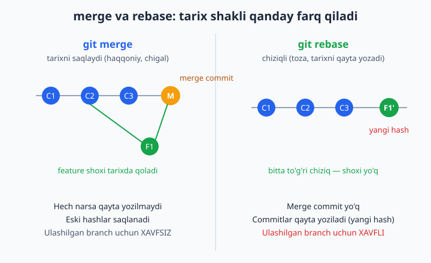
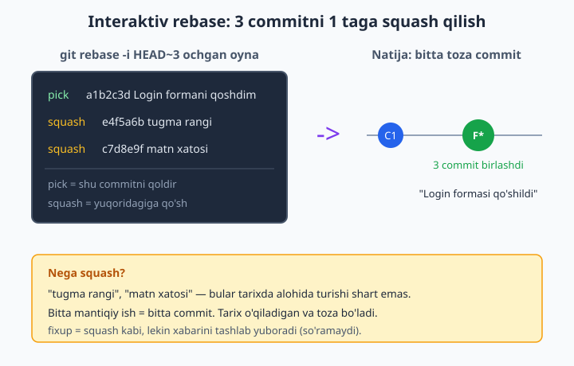

# 9 — Rebase va interaktiv rebase

[⬅️ Oldingi: 08 — Merge va konfliktlar](./08-merge-konflikt.md) · [🏠 README](./README.md) · [Keyingi: 10 — GitHub bilan tanishuv ➡️](./10-github-tanishuv.md)

> **Bu bobda:** chigal, ko'p shoxli tarixni toza chiziqli tarixga aylantiradigan `git rebase` buyrug'ini o'rganamiz: rebase commitlarni qanday "ko'chirib qayta o'ynashini", merge bilan farqini (merge tarixni saqlaydi, rebase qayta yozadi), eng muhim OLTIN QOIDA — ulashilgan commitni rebase qilmaslikni, `git rebase -i` (interaktiv rebase) bilan commitlarni birlashtirish (squash), nomlash (reword), tashlash (drop) va tartiblashni, rebase paytidagi konfliktni `--continue` va `--abort` bilan boshqarishni, hamda `git pull --rebase` orqali jamoada toza tarix saqlashni ko'rib chiqamiz.

---

## Muammo

Tasavvur qiling: siz uch kishilik jamoada do'kon saytini yozayapsiz. Siz `feature/login` shoxida (branch — alohida ish maydoni) login sahifasini qilayapsiz. Bir kun ishlaysiz, lekin shu orada hamkasblaringiz `main` shoxiga 5 ta yangi commit qo'shib qo'yishadi. Endi sizning ishingiz birlashtirilishi kerak.

Har safar `git merge main` qilganingizda tarixda yangi "merge commit" paydo bo'ladi. Bir hafta o'tib `git log` ga qaraysiz — u 20 ta merge commit va o'zaro kesishgan shoxlardan iborat chigal to'rga aylanib qolgan. "Falon o'zgarish qaysi commitda kelgan?" degan savolga javob topish dahshatga aylanadi.

Siz xohlagan narsa — **toza, to'g'ri chiziqli tarix**: avval main commitlari, keyin sizning commitlaringiz, ketma-ket. Aynan shuni `git rebase` beradi. U sizning shoxingizdagi commitlarni olib, ularni `main`ning eng yangi nuqtasi ustiga "ko'chiradi" — go'yo siz ishni bugun, eng so'nggi koddan boshlagandek.

Avval muammoni ko'rsataylik. `main`da ikki commit bor edi, siz `feature` ochib bitta commit qildingiz, shu orada `main`ga yana commit qo'shildi:

```bash
git switch feature
git log --oneline --all --graph
```

```text
* e851ffa F1: login sahifa
| * f54829e C3: footer
|/
* d077103 C2: bosh sahifa
* cfcc219 C1: boshlangich
```

Ko'ryapsizmi — tarix ikkiga ajralib ketgan: `feature` (F1) `C2`dan o'sgan, lekin `main` undan keyin `C3`ga ketgan. Ikkala chiziq bir nuqtadan tarvaqaylab chiqqan. Mana shu "tarvaqaylashni" rebase to'g'rilaydi.

## git rebase nima qiladi?

`git rebase <asos>` — joriy shoxingizdagi commitlarni vaqtincha "yechib oladi", shoxning boshlanish nuqtasini `<asos>`ning oxiriga ko'chiradi va commitlarni bittalab **qaytadan o'ynaydi** (replay — har birini yangidan qo'llaydi).

Nomning o'zi ham shuni aytadi: *re-base* = "asosini qayta belgilash". Shoxingizning eski asosi `C2` edi; rebasedan keyin asosi `C3` bo'ladi.

```bash
git switch feature
git rebase main
```

```text
Rebasing (1/1)
Successfully rebased and updated refs/heads/feature.
```

Endi tarixga qarang:

```bash
git log --oneline --all --graph
```

```text
* a8bdd73 F1: login sahifa
* f54829e C3: footer
* d077103 C2: bosh sahifa
* cfcc219 C1: boshlangich
```

Tarvaqay yo'qoldi — hammasi bitta to'g'ri chiziq! `F1` endi `C3`ning ustida turibdi. E'tibor bering: F1 commitining hashi o'zgardi (oldin `e851ffa`, hozir `a8bdd73`). Bu juda muhim — birozdan keyin sababini tushuntiramiz.



📌 Rebase commitni "ko'chirmaydi" — aslida har bir eski commit asosida **yangi** commit yaratadi. O'zgarishlar (kod farqi) bir xil, lekin endi ular boshqa "ota-commit" ustida turibdi, demak hash ham boshqacha bo'ladi. Eski commitlar darrov o'chmaydi — ular hali bir muddat reflogda yashaydi (16-bobda bu sizni qutqaradi), lekin shoxingiz endi yangi commitlarga ishora qiladi.

💡 `git rebase main` desangiz, "joriy shoxni `main` ustiga rebase qil" deganisiz. Boshqa shoxda turib `git rebase feature` desangiz — teskari bo'ladi. Doim oddiy savol bering: "qaysi shox harakatlanyapti?" Javob — **siz turgan shox** (HEAD). Asos esa qo'zg'almaydi.

## Merge va rebase — qaysi birini tanlash?

Ikkalasi ham bir ishni bajaradi: bir shoxning ishini boshqasiga olib keladi. Farq — **tarix qanday ko'rinishda qoladi**.

| | `git merge` | `git rebase` |
|---|---|---|
| Tarix shakli | shoxli, tarvaqay | to'g'ri chiziqli |
| Merge commit | yaratadi | yaratmaydi |
| Commit hashlari | o'zgarmaydi | qayta yoziladi (yangi) |
| Aslida nima bo'lgani | aniq saqlanadi | "tekislanadi" |
| Ulashilgan shox uchun | xavfsiz | xavfli |
| O'qilishi | ba'zan chigal | toza, oson |

**Merge** — voqealar qanday yuz bergan bo'lsa, shundayligicha saqlaydi: "bu yerda ikki ish parallel ketdi va bu nuqtada birlashdi". Bu haqqoniy, lekin ko'p bo'lsa chigal.

**Rebase** — go'yo hammasi ketma-ket bir chiziqda bo'lgandek qilib ko'rsatadi. Bu toza va o'qish oson, lekin tarixni "qayta yozadi" — aslida bo'lmagan voqeani bo'lgandek qiladi.



Amaliy maslahat:

- ✅ O'zingizning **lokal**, hali hech kimga ko'rsatmagan shoxingizni `main` bilan yangilamoqchi bo'lsangiz — **rebase** (toza tarix uchun).
- ✅ Tugatilgan feature'ni `main`ga qo'shayotganda, "bu yerda alohida feature bo'lgan" degan iz qolsin desangiz — **merge** (ko'pincha `--no-ff` bilan).
- ❌ Boshqalar ham ishlatadigan, push qilingan shoxni **hech qachon rebase qilmang** (pastdagi oltin qoida).

## OLTIN QOIDA: ulashilgan commitni rebase qilma

Bu — rebasedagi eng muhim qoida. Uni buzsangiz, jamoangizning tarixini buzasiz.

**Qoida:** boshqalar bilan ulashgan (ya'ni `push` qilib, GitHubga yuborib bo'lgan) commitlarni **hech qachon** rebase qilmang.

Nega? Rebase commitlarni qayta yozadi — eski hashlar o'rniga yangilari paydo bo'ladi. Agar siz allaqachon push qilgan commitlarni rebase qilib, keyin majburlab qaytadan push qilsangiz, hamkasblaringizning kompyuterida hali eski (asl) hashlar turibdi. Endi sizning tarixingiz bilan ularning tarixi mos kelmaydi — har kim push/pull qilganda chalkashlik, takror commitlar va "men yo'qotgan ishim qani?" degan vahima boshlanadi.

📌 Oddiy mezon: **commit faqat sizning kompyuteringizdami?** — rebase qilsa bo'ladi. **Commit GitHubda ham bormi, boshqalar ko'rgan bo'lishi mumkinmi?** — rebase qilmang, merge ishlating.

💡 Yagona xavfsiz istisno — bu **faqat o'zingiz ishlaydigan** shaxsiy feature shoxi. Uni push qilgan bo'lsangiz ham, undan boshqa hech kim foydalanmasa, rebase qilib keyin `--force-with-lease` bilan push qilsa bo'ladi (12- va 16-boblarda batafsil). `--force-with-lease` oddiy `--force`dan xavfsizroq: u "men oxirgi marta ko'rgandan beri remote o'zgarmagan bo'lsagina majburla" deydi, ya'ni kimdir orada commit qo'shgan bo'lsa, sizni to'xtatadi va begona ishni o'chirib yuborishdan saqlaydi.

```bash
# Faqat o'zingiznikida, ehtiyot bilan:
git push --force-with-lease
```

❌ Hech qachon `main` yoki `develop` kabi umumiy shoxlarni rebase qilmang.

## Interaktiv rebase: git rebase -i

Endi rebaseni boshqa, ko'proq ishlatiladigan tomoniga o'tamiz. `git rebase -i` (`-i` = interactive, interaktiv) — bu o'zingizning **so'nggi commitlaringizni tahrirlash** vositasi: birlashtirish, qayta nomlash, tartibini o'zgartirish, butunlay o'chirish.

Muammo tanish: ishlayapsiz, "Login formani qoshdim", keyin "tugma rangini tuzatdim", keyin "matn xatosi" deb uch marta commit qildingiz. Bular alohida turishi shart emas — hammasi bitta ishning bo'laklari. Tarixda ular bitta toza commit bo'lib turgani chiroyliroq.

`HEAD~3` — "shu yerdan oxirgi 3 commit" degani. Ana shu uchtasini tahrir qilmoqchimiz:

```bash
git rebase -i HEAD~3
```

Git matn muharririni ochadi va shunday ko'rsatadi (eng eski commit yuqorida):

```text
pick a1b2c3d Login formani qoshdim
pick e4f5a6b tugma rangini tuzatdim
pick c7d8e9f matn xatosi

# Rebase ... HEAD~3 onto ...
# Buyruqlar:
# p, pick   = commitni shundayligicha qoldir
# r, reword = commitni qoldir, lekin xabarini o'zgartir
# e, edit   = commitni qoldir, lekin to'xtab tahrirlashga ruxsat ber
# s, squash = oldingi (yuqoridagi) commitga qo'shib yubor
# f, fixup  = squash kabi, lekin bu commit xabarini tashla
# d, drop   = commitni butunlay o'chir
```

Bu yerda har qatordagi `pick` so'zini o'zingiz xohlagan buyruqqa almashtirasiz, keyin saqlab muharrirni yopasiz.

📌 Birinchi qatorni odatda `squash`/`fixup` qilib bo'lmaydi — chunki squash "yuqoridagi commitga qo'shadi", eng yuqoridagidan yuqorida esa hech narsa yo'q. Shuning uchun birinchisi doim `pick` (yoki `reword`) bo'ladi.

## squash: bir nechta commitni birlashtirish

Uchta commitni bittaga birlashtirish uchun, birinchisini `pick`, qolganlarini `squash` qilamiz:

```text
pick   a1b2c3d Login formani qoshdim
squash e4f5a6b tugma rangini tuzatdim
squash c7d8e9f matn xatosi
```

Saqlab yopgach, Git ikkinchi marta muharrir ochadi — endi birlashgan commit uchun yagona xabar so'raydi. U yerda hammasini o'chirib, bitta toza xabar yozasiz, masalan: `Login formasi qoshildi`. Saqlab yopasiz va natijani ko'rasiz:

```bash
git log --oneline
```

```text
59a7704 Login formasi qoshildi
7516293 Boshlangich
```

Uch commit bitta toza commitga aylandi.



💡 `fixup` — bu `squash`ning tezroq varianti. U ham commitni yuqoridagiga qo'shadi, lekin uning xabarini umuman so'ramaydi — shunchaki tashlab yuboradi. "tugma rangini tuzatdim" degan xabar tarixda kerak emas-ku — demak `fixup` ideal:

```text
pick  a1b2c3d Login formani qoshdim
fixup e4f5a6b tugma rangini tuzatdim
fixup c7d8e9f matn xatosi
```

Bunda Git ikkinchi marta xabar ham so'ramaydi — to'g'ridan-to'g'ri "Login formani qoshdim" xabari bilan bitta commit qoladi.

## reword, drop va tartiblash

Interaktiv rebase faqat squash uchun emas. Yana nima qila olasiz:

**reword** — kodga tegmasdan, faqat commit **xabarini** tuzatish. "fix" degan tushunarsiz xabarni mazmunli xabarga aylantirish uchun:

```text
reword a1b2c3d fix
pick   e4f5a6b Login validatsiyasi
```

Saqlagach, Git `a1b2c3d` uchun muharrir ochadi va siz yangi xabar yozasiz.

**drop** — commitni butunlay **o'chirish**. Tasodifan qo'shib yuborgan, kerakmas commitni olib tashlash uchun (qatorni o'chirib tashlasangiz ham, `drop` yozsangiz ham bir xil):

```text
pick a1b2c3d Login sahifa
drop e4f5a6b Tasodifan qo'shilgan test fayli
pick c7d8e9f Footer
```

**Tartibni o'zgartirish** — qatorlarning o'rnini almashtirib, commitlar tartibini o'zgartira olasiz. Git ularni yangi tartibda qayta o'ynaydi.

📌 Diqqat: drop yoki tartiblash konfliktga olib kelishi mumkin — agar o'chirgan commitingizdan keyingi commit o'sha o'zgarishga tayanib turgan bo'lsa. Konflikt chiqsa, pastdagi `--continue`/`--abort` jarayoni yordam beradi.

⚠️ Eslatma: `git rebase -i` ham tarixni qayta yozadi. Demak oltin qoida bu yerda ham amal qiladi — faqat hali push qilmagan, lokal commitlaringizni interaktiv rebase qiling.

## Rebase paytidagi konflikt

Rebase commitlarni bittalab qayta o'ynaydi. Agar bir commit asosdagi o'zgarish bilan **bir xil qatorga tegsa**, Git o'zi hal qila olmaydi — konflikt e'lon qiladi va to'xtaydi (konflikt — ikki tomon bir joyni har xil o'zgartirgani, Git qaysi birini olishni bilmaydi).

Misol: `feature` shoxida `config.txt` faylidagi sarlavhani o'zgartirdingiz, ayni o'sha qatorni `main`da hamkasbingiz boshqacha o'zgartirgan. Rebase qilganda:

```bash
git switch feature
git rebase main
```

```text
Auto-merging config.txt
CONFLICT (content): Merge conflict in config.txt
error: could not apply 9c0d384... F1: sarlavha ozgartirildi
hint: Resolve all conflicts manually, mark them as resolved with
hint: "git add/rm <conflicted_files>", then run "git rebase --continue".
hint: You can instead skip this commit: run "git rebase --skip".
hint: To abort and get back to the state before "git rebase", run "git rebase --abort".
```

Git uch yo'l taklif qiladi: konfliktni hal qilib **davom etish**, bu commitni **o'tkazib yuborish** (skip), yoki butun rebaseni **bekor qilish** (abort). Holatni `git status` ko'rsatadi:

```bash
git status --short
```

```text
UU config.txt
```

`UU` — "ikkala tomon ham o'zgartirgan" (Unmerged). Faylni ochsangiz, ichida 8-bobdan tanish konflikt belgilari turibdi:

```text
<<<<<<< HEAD
sarlavha: Korporativ Loyiha
=======
sarlavha: Mening Loyiham
>>>>>>> 9c0d384 (F1: sarlavha ozgartirildi)
```

📌 Diqqat: rebaseda `HEAD` — bu **asos** (main) tomoni, pastdagi esa **sizning** o'ynayotgan commitingiz. Bu mergega nisbatan teskari tuyulishi mumkin (chunki rebaseda Git sizning commitingizni asos ustiga qo'llayapti). Belgilarga emas, qaysi matn to'g'ri ekanligiga qarab tanlang.

### Hal qilish va davom etish: --continue

Faylni qo'lda to'g'rilang — konflikt belgilarini (`<<<<<<<`, `=======`, `>>>>>>>`) olib tashlab, yakuniy to'g'ri matnni qoldiring. Keyin faylni "hal qilindi" deb belgilang va davom eting:

```bash
# config.txt ni qo'lda tahrirlab, to'g'ri holatga keltirdingiz
git add config.txt
git rebase --continue
```

```text
Successfully rebased and updated refs/heads/feature.
```

Git navbatdagi commitni o'ynashda davom etadi. Agar yana konflikt chiqsa — yana hal qilasiz va yana `--continue`. Hamma commit o'ynalib bo'lguncha shu davom etadi.

💡 `git add` qilishni unutmang! `--continue` faqat hal qilingan fayllar staging zonasiga (staging — commitga tayyorlangan fayllar joyi) qo'shilgandan keyin ishlaydi. Aks holda Git "hali hal qilinmagan fayllar bor" deb to'xtatib turadi.

### Bekor qilish: --abort

Agar konfliktlar juda ko'p bo'lib chiqsa yoki "buni umuman noto'g'ri boshladim" desangiz — hech narsa yo'qotmasdan ortga qaytishingiz mumkin:

```bash
git rebase --abort
```

Bu **sehrli to'xtatish tugmasi**: rebase boshlanishidan oldingi holatga to'liq qaytaradi — shoxingiz xuddi rebasega qo'l urmagandek bo'ladi. Konfliktlar, yarim o'ynalgan commitlar — hammasi yo'qoladi, asl holat tiklanadi.

📌 `--abort` — rebaseda eng tinchlantiruvchi buyruq. Yangi boshlovchi sifatida rebasedan qo'rqmang: agar nimadir chalkashib ketsa, `git rebase --abort` deysiz va hammasi o'z joyiga qaytadi. Hech narsa buzilmaydi.

## git pull --rebase

10-11-boblarda GitHubga chuqurroq kiramiz, lekin rebasening eng kundalik foydasini hozir ko'rsatamiz. Oddiy `git pull` aslida ikki ishni qiladi: remotedan (uzoq serverdagi nusxadan) yangiliklarni `fetch` qiladi, keyin ularni sizning ishingizga `merge` qiladi. Ana shu merge har safar kichik merge commit yaratadi — natijada loyiha tarixi "Merge branch main..." degan keraksiz commitlar bilan to'lib ketadi.

`git pull --rebase` esa merge o'rniga **rebase** qiladi: sizning lokal commitlaringizni serverdan kelgan yangi commitlar ustiga ko'chiradi. Natija — toza chiziqli tarix, keraksiz merge commitlarsiz.

Misol: ikki dasturchi bir loyihada ishlamoqda. Siz lokal commit qildingiz, lekin shu orada hamkasbingiz serverga o'z commitini yuborgan:

```bash
git pull --rebase origin main
```

```text
From .../remote
   b48e9d8..2d3d45a  main       -> origin/main
Rebasing (1/1)
Successfully rebased and updated refs/heads/main.
```

Natija — chiziqli tarix:

```text
* 439ac37 Mening lokal ishim
* 2d3d45a C2 (boshqa odam)
* b48e9d8 C1
```

Sizning commitingiz hamkasbingizning commitidan **keyinga** qo'yildi, hech qanday merge commit yo'q.

💡 Buni har safar yozib o'tirmaslik uchun, `pull`ning standart xatti-harakatini butun kompyuteringiz uchun rebasega o'zgartirib qo'yishingiz mumkin:

```bash
git config --global pull.rebase true
```

Shundan keyin oddiy `git pull` ham avtomatik rebase rejimida ishlaydi.

📌 `pull --rebase` paytida ham konflikt chiqishi mumkin — jarayon yuqoridagidek: hal qiling, `git add`, keyin `git rebase --continue`. Yoki `git rebase --abort` bilan bekor qiling.

## Qisqa xulosa

- `git rebase <asos>` — joriy shox commitlarini `<asos>` ustiga ko'chirib qayta o'ynaydi; tarix chiziqli bo'ladi, commitlar yangi hash oladi.
- **Merge** tarixni saqlaydi (haqqoniy, ba'zan chigal); **rebase** chiziqli toza tarix beradi, lekin qayta yozadi.
- **OLTIN QOIDA:** push qilingan, ulashilgan commitni rebase qilmang.
- `git rebase -i HEAD~N` — so'nggi N commitni tahrirlash: `pick`/`reword`/`edit`/`squash`/`fixup`/`drop`.
- Konfliktda: hal qil -> `git add` -> `git rebase --continue`. Yoki `git rebase --abort` bilan to'liq ortga qayt.
- `git pull --rebase` — toza tarix uchun pull; `git config --global pull.rebase true` bilan doimiy yoqiladi.

## 9-bob mashqlari

> 📌 Bu mashqlarni **faqat** sinov uchun yaratgan vaqtinchalik papkada bajaring. O'qishingiz yoki ishingizdagi haqiqiy, GitHubga push qilingan loyihada rebase mashq qilmang — oltin qoidani eslang.

1. Yangi papka oching, `git init -b main` qiling. `main`da ketma-ket 2 ta commit yarating (mas. `readme.txt` va `index.html`). `git log --oneline` bilan tarixni ko'ring.
2. `git switch -c feature` bilan yangi shox oching va unda bitta commit qiling. Keyin `main`ga qaytib (`git switch main`) yana bitta commit qiling. Endi tarix ajraldi — `git log --oneline --all --graph` bilan tarvaqayni o'z ko'zingiz bilan ko'ring.
3. `feature` shoxiga o'ting va `git rebase main` qiling. `git log --oneline --all --graph` bilan tarixning chiziqli bo'lib qolganini tasdiqlang.
4. 3-mashqdagidan oldin va keyin `feature` commitining hashini solishtiring (`git log --oneline` ni rebasedan oldin va keyin yozib oling). Hash o'zgardimi? Nega o'zgarganini o'zingizcha izohlab ko'ring.
5. Yangi vaqtinchalik papkada xuddi 2-mashqdagi ajralgan holatni qayta yarating, lekin bu safar `git rebase` o'rniga `git merge main` qiling. Hosil bo'lgan tarixni `--graph` bilan ko'ring va 3-mashqdagi rebase natijasi bilan ko'z bilan solishtiring: qaysi biri tozaroq?
6. 5-mashqning tarixida "merge commit" bormi? `git log --oneline` da uni toping. Endi merge va rebase orasidagi farqni o'z so'zlaringiz bilan bitta jumlada yozing.
7. Yangi papkada `main`da 4 ta commit qiling: birinchisi "Boshlangich", keyingi uchtasi bitta ishning bo'laklari (mas. "Login formani qoshdim", "tugma rangini tuzatdim", "matn xatosi"). `git log --oneline` bilan to'rttasini ko'ring.
8. 7-mashqdagi oxirgi 3 commitni `git rebase -i HEAD~3` orqali bittaga **squash** qiling: birinchisini `pick`, qolgan ikkitasini `squash`. Birlashgan commitga toza xabar bering. Natijani `git log --oneline` bilan tekshiring.
9. 7-mashqni yangi papkada qaytaring, lekin bu safar `squash` o'rniga `fixup` ishlating. `squash` ikkinchi marta xabar so'radimi, `fixup` so'radimi? Farqni yozib qo'ying.
10. Yangi papkada bir nechta commit qiling, ulardan birining xabarini ataylab tushunarsiz qoldiring (mas. "fix"). `git rebase -i` orqali o'sha commitni `reword` qilib, xabarini mazmunli qilib o'zgartiring.
11. Bir nechta commit yarating, ulardan biri ataylab keraksiz bo'lsin (mas. "test fayli"). `git rebase -i` ichida o'sha qatorni `drop` qilib, commitni tarixdan butunlay o'chiring. `git log` bilan u yo'qolganini tasdiqlang.
12. Uchta commiting bo'lsin. `git rebase -i HEAD~3` ichida ikki commitning **tartibini almashtiring** (qatorlarning o'rnini o'zgartiring). Saqlab chiqing va tarix yangi tartibda bo'lganini `git log` bilan tekshiring.
13. Ataylab konflikt yarating: `feature` shoxida bitta fayldagi qatorni o'zgartiring, `main`da xuddi o'sha qatorni boshqacha o'zgartiring. `feature`ga o'tib `git rebase main` qiling — konflikt chiqishi kerak. Chiqqan xabarni diqqat bilan o'qing.
14. 13-mashqdagi konflikt holatida `git status` ishlating. Qaysi fayl `UU` (unmerged) deb belgilangan? Faylni oching va ichidagi `<<<<<<<`, `=======`, `>>>>>>>` belgilarini toping.
15. 13-mashqdagi konfliktni qo'lda hal qiling (belgilarni olib tashlab, to'g'ri matnni qoldiring), keyin `git add <fayl>` va `git rebase --continue` bilan rebaseni yakunlang. `git log` bilan natijani ko'ring.
16. Yana bir konfliktli rebase boshlang (13-mashqdagidek). Bu safar hal qilish o'rniga `git rebase --abort` ishlating. Shoxingiz rebasedan oldingi holatga qaytdimi? `git log` bilan tekshiring.
17. Rebasedagi konfliktda `HEAD` qaysi tomonni anglatadi — asosnimi yoki sizning commitingiznimi? 13-15-mashqlarda ko'rganingizdan kelib chiqib, izohlang. (Ishora: rebaseda bu mergega nisbatan teskari.)
18. Ikkita alohida papka yarating: bittasini bare remote qilib (`git init --bare`), ikkinchisini undan `git clone` qiling. Klonda commit qilib `push` qiling, keyin remotega yana bir commit kelganini taqlid qiling (boshqa klondan). Endi birinchi klonda lokal commit qilib, `git pull --rebase` ishlating. Tarix chiziqli bo'lib qoldimi?
19. `git config --global pull.rebase true` ni o'rnating. Endi 18-mashqdagi holatni yana qaytarib, oddiy `git pull` (`--rebase`siz) ishlating — u avtomatik rebase rejimida ishladimi? Tekshirib bo'lgach, sozlamani `git config --global --unset pull.rebase` bilan qaytaring (xohlasangiz).
20. Yakuniy mashq: bitta vaqtinchalik papkada to'liq ssenariyni o'ynang — `main` va `feature` ajralgan holat yarating, `feature`da 3 ta mayda commit qiling, ularni `git rebase -i` bilan bittaga squash qiling, keyin `git rebase main` bilan asosga ko'chiring (kerak bo'lsa konfliktni hal qiling). Yakuniy tarix bitta toza chiziq bo'lib chiqsin. `git log --oneline --graph` bilan g'ururlanib ko'ring.
