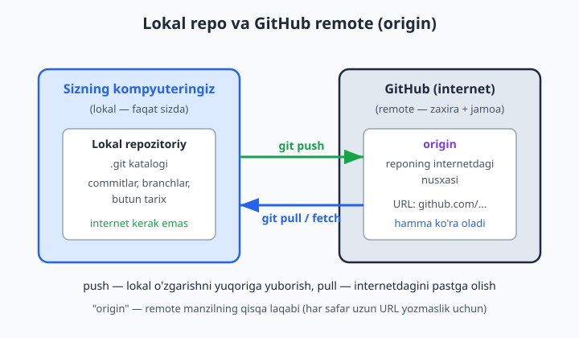
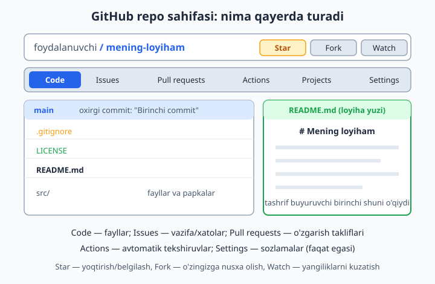
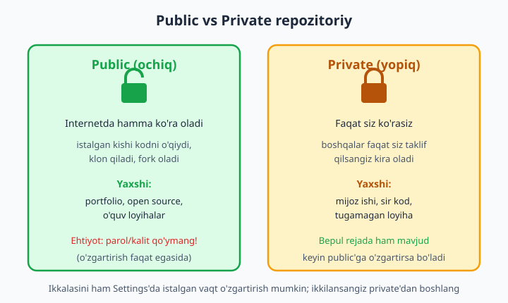

# 10 — GitHub bilan tanishuv

[⬅️ Oldingi: 09 — Rebase va interaktiv rebase](./09-rebase.md) · [🏠 README](./README.md) · [Keyingi: 11 — Remote: clone, push, fetch, pull ➡️](./11-remote-push-pull.md)

> **Bu bobda:** lokal repo nega yetarli emasligini, GitHub aslida nimaligini (Git repozitoriylarni internetda saqlash + hamkorlik + avtomatlashtirish + sahifalar), bepul akkaunt ochish va profilni to'ldirishni, birinchi repozitoriy yaratishni (public/private, README/gitignore/license bilan boshlash), "remote" tushunchasini va `origin` laqabini, GitHub repo sahifasining anatomiyasini (Code, Issues, Pull requests, Actions, Settings tablari), README.md nega "loyiha yuzi" ekanligini, Star/Fork/Watch tugmalarini, hamda GitHub'ni GitLab va Bitbucket bilan qisqa solishtirishni ko'rib chiqamiz. Hali hech narsani push qilmaymiz — push, clone, pull keyingi bobda. Bu bob — GitHub bilan tanishuv va birinchi bo'sh repozitoriyni tayyorlash.

---

## Muammo

Tasavvur qiling: oylab ustida ishlagan diplom loyihangiz noutbukingizda turibdi. Git ham o'rnatgansiz, har kuni `commit` qilyapsiz — tarix chiroyli. Bir kuni noutbuk suvga tushadi yoki o'g'irlanadi. Hamma narsa — kod ham, butun Git tarixi ham — birga ketadi. Chunki Git tarixi (`.git` katalogi) o'sha bitta diskda yashardi.

Yoki boshqa holat: uch kishi bo'lib do'kon sayti yozyapsiz. Sherigingiz "menga loyihaning oxirgi holatini yubor" deydi. Nima qilasiz — papkani arxivlab Telegram orqali yuborasizmi? Ertaga u o'zgartirgan, siz ham o'zgartirgan — endi qaysi versiya to'g'ri? Kim nimani buzdi? Lokal Git bularning hech biriga javob bermaydi, chunki sizning Git'ingiz **faqat sizning kompyuteringizda** yashaydi.

Uchinchi holat: ish beruvchiga "men dasturlay olaman" deyapsiz. U "ko'rsating-chi, nima yozgansiz?" deydi. Kodingiz noutbukda — uni qanday ko'rsatasiz?

Bu uch muammoning yechimi bitta: **kodni internetdagi ishonchli joyga qo'yish**. Aynan shu joy — GitHub.

📌 Diqqat: Git va GitHub — ikki **boshqa** narsa. **Git** — kompyuteringizdagi dastur (versiya nazorati tizimi), uni 2-bobda o'rnatdik. **GitHub** — internetdagi sayt (servis), u Git repozitoriylarni saqlaydi va ustiga hamkorlik vositalarini qo'shadi. Git GitHub'siz ham mukammal ishlaydi (1–9 boblarda buni ko'rdik). GitHub esa Git'siz mavjud emas — u Git'ning ustiga qurilgan.

## GitHub nima va u nimani beradi

GitHub — bu, eng sodda qilib aytganda, **internetdagi Git repozitoriylar uyi**. Lekin u shunchaki "fayl saqlovchi bulut" emas (Google Drive yoki Dropbox kabi emas). U Git'ni *tushunadi*: commitlaringizni, branchlaringizni, tarixingizni biladi va ular ustida ishlash uchun maxsus vositalar beradi.

GitHub asosan to'rt narsani beradi:

| Imkoniyat | Bu nimani hal qiladi |
|---|---|
| **Repozitoriy hosting** | Kodingiz va butun Git tarixi internetda, ishonchli serverda turadi — zaxira (backup) muammosi hal |
| **Hamkorlik** | Bir nechta odam bitta loyihada xavfsiz ishlaydi: Pull Request, code review, Issues |
| **Avtomatlashtirish (CI/CD)** | Har push'da testlar avtomatik ishlaydi, loyiha avtomatik joylanadi — GitHub Actions (20-bob) |
| **Sahifalar va portfolio** | Loyihangiz internet uchun "yuz" oladi: README, GitHub Pages bilan tekin sayt (22-bob) |

💡 GitHub 2008-yilda paydo bo'lgan, 2018-yildan Microsoft kompaniyasiga tegishli. Bugun dunyodagi eng katta dastur loyihalari shu yerda yashaydi: Linux yadrosi, VS Code, Python — barchasi GitHub'da ochiq turadi. Shuning uchun ish beruvchilar ko'pincha "GitHub profilingizni yuboring" deb so'rashadi: u sizning amaliy "portfoliongiz".

📌 Bepulmi? Ha. GitHub'ning bepul rejasi (free plan) yakka dasturchi va kichik jamoa uchun deyarli hamma narsani beradi: cheksiz public va private repozitoriy, hamkorlar, Actions uchun oylik bepul daqiqalar. Pulli rejalar faqat yirik tashkilotlarning maxsus ehtiyojlari uchun.

## Akkaunt ochish va profil

Boshlash uchun bepul akkaunt kerak. Brauzerda **github.com** ga kiring va **Sign up** tugmasini bosing. Sizdan so'raydi:

- **Email** — ishlaydigan pochta (tasdiqlash xati keladi).
- **Parol** — kuchli parol tanlang (GitHub talab qiladi).
- **Username** — bu eng muhim qaror. Bu sizning butun GitHub'dagi nomingiz: profilingiz manzili `github.com/username` bo'ladi, har repongiz URL'i `github.com/username/repo-nomi` ko'rinishida bo'ladi.

📌 Username'ni o'ylab tanlang. Uni keyin o'zgartirish mumkin, lekin tavsiya etilmaydi — eski havolalar buziladi. Yaxshi username: qisqa, professional, ismingizga yaqin (masalan `oqil-imom`, `aliyev-dev`). Yomon username: `xXdark_killerXx`, `qwerty123`. Buni ish beruvchi ko'radi — vizitka deb qarang.

Ro'yxatdan o'tgach, GitHub **ikki bosqichli autentifikatsiya (2FA — two-factor authentication)** yoqishni so'raydi. Bu — parolingiz o'g'irlansa ham akkaunt himoyalanib qolishi uchun ikkinchi qatlam (telefondagi kod yoki ilova). 2026-yilda GitHub ko'p hollarda buni **majburiy** qiladi.

✅ 2FA'ni darrov yoqing va zaxira kodlarini (recovery codes) xavfsiz joyga saqlang. ❌ Bu kodlarni yo'qotsangiz va telefoningiz yo'qolsa — akkauntga kira olmay qolishingiz mumkin.

**Profilni to'ldirish.** O'ng yuqori burchakdagi rasmchaga bosib **Settings → Public profile** ga o'ting. To'ldirish foydali maydonlar:

- **Profil rasmi (avatar)** — haqiqiy rasm yoki tushunarli logotip.
- **Name** — to'liq ismingiz (username'dan farqli, bu chiroyli ko'rsatiladi).
- **Bio** — bir-ikki jumla: kimsiz, nima bilan shug'ullanasiz.
- **Location, Website** — shahar va shaxsiy sayt/portfolio (ixtiyoriy).

💡 Profil to'liq bo'lsa, sizga jiddiyroq qaraladi. Bo'sh avatar va bo'sh bio — "yangi, hali hech narsa qilmagan" degan taassurot beradi.

## Birinchi repozitoriy yaratish

Endi internetda bo'sh repozitoriy yaratamiz. Repozitoriy (qisqacha **repo**) — bitta loyihaning uyi: uning fayllari, tarixi va sozlamalari.

O'ng yuqori burchakdagi **+** belgisiga bosing → **New repository**. Ochilgan formada:

- **Repository name** — loyiha nomi, masalan `mening-loyiham`. Kichik harf, so'zlar orasiga chiziqcha (`-`) — odatiy uslub.
- **Description** — bir qatorli tavsif (ixtiyoriy, lekin foydali).
- **Public / Private** — kim ko'rishini tanlaysiz (pastda batafsil).
- **Add a README file** — belgilang. README — loyihangizning birinchi sahifasi.
- **Add .gitignore** — ro'yxatdan loyiha turini tanlang (Node, Python...). GitHub mos `.gitignore` faylini avtomatik qo'yadi.
- **Choose a license** — loyiha litsenziyasi (boshqalar kodingizdan qanday foydalana olishi). Ikkilansangiz, hozircha tashlab keting yoki MIT tanlang.

**Create repository** ni bosing — tayyor. Sahifa ochiladi va siz uchta fayl (README.md, .gitignore, LICENSE) bilan tayyor repozitoriyni ko'rasiz.

📌 Nega README/gitignore/license bilan boshlash qulay? Chunki shu uchta "kvadratchani" belgilasangiz, GitHub repozitoriyni **bo'sh emas**, balki tayyor commitlar bilan yaratadi. Bo'sh repo (hech qaysi kvadrat belgilanmagan) ham bo'ladi — uni odatda mavjud lokal loyihani yuqoriga ko'chirayotganda tanlaysiz (buni 11-bobda ko'ramiz).

💡 Yana bir yo'l — buni terminaldan, `gh` (GitHub CLI) vositasi orqali ham qilish mumkin (`gh repo create`). Lekin boshlovchiga sayt orqali qilish ko'rgazmaliroq; CLI'ga keyinroq o'tasiz.

## Remote tushunchasi va origin

Mana eng muhim tushuncha. Sizda endi **ikkita** repo bor (yoki tez orada bo'ladi):

1. **Lokal repo** — kompyuteringizdagi `.git` katalogi (1–9 boblarda ishlaganimiz).
2. **Remote repo** — GitHub'dagi nusxa, internetda.

**Remote** (masofaviy) — bu lokal reponingizning **internetdagi nusxasi manzili**. Git uchun remote — shunchaki bir URL. Lekin bu URL'ni har safar to'liq yozish noqulay bo'lgani uchun, Git unga qisqa **laqab** beradi. An'anaviy laqab — **origin** ("manba", "asl joy").



Ya'ni: `origin` = "GitHub'dagi mening repom"ning qisqa nomi. Push qilsangiz, Git "qayerga?" deb so'ramaydi — `origin` ni biladi.

Lokal reponi remote bilan bog'lash buyrug'i shunday ko'rinadi (haqiqiy ulashni 11-bobda qilamiz, hozir faqat tanishtirish uchun):

```bash
# Lokal repoga GitHub'dagi manzilni "origin" laqabi bilan biriktirish:
git remote add origin https://github.com/foydalanuvchi/mening-loyiham.git
```

Tekshirish — qaysi remote'lar biriktirilgan:

```bash
git remote -v
```

Natija (vaqtinchalik papkada haqiqatan ishlatib tekshirdik):

```text
origin  https://github.com/foydalanuvchi/mening-loyiham.git (fetch)
origin  https://github.com/foydalanuvchi/mening-loyiham.git (push)
```

E'tibor bering: bitta `origin` ikki qatorda chiqdi — biri `fetch` (internetdan olish) uchun, biri `push` (internetga yuborish) uchun. Odatda ikkalasi bir xil URL.

📌 `origin` — majburiy nom emas, shunchaki **kelishuv** (convention). Istasangiz `github`, `manba` deb ham nomlashingiz mumkin. Lekin dunyoning hammasi `origin` deydi, shuning uchun shuni ishlating. Mavjud manzilni ko'rish uchun `git remote get-url origin`, o'zgartirish uchun `git remote set-url origin <yangi-url>`, nomini almashtirish uchun `git remote rename origin <yangi-nom>`.

💡 Bitta repoda bir nechta remote bo'lishi mumkin. Masalan, open source loyihalarda: `origin` — sizning fork'ingiz, `upstream` — asl loyiha. Buni 21-bobda ko'ramiz. Hozircha bitta `origin` yetarli.

## GitHub repo sahifasining anatomiyasi

Repozitoriy sahifasini ochsangiz, dastlab ko'p tugma va yorliq ko'zni qamashtiradi. Aslida hammasi mantiqiy. Asosiy elementlarni ko'rib chiqamiz.



**Yuqori qatorda** repo nomi (`foydalanuvchi / mening-loyiham`) va o'ng tomonda uchta tugma: **Watch**, **Fork**, **Star** (bularga pastda qaytamiz).

**Ostidagi tablar** — repozitoriyning asosiy bo'limlari:

| Tab | Nima uchun |
|---|---|
| **Code** | Asosiy bo'lim: fayllar, papkalar, branchlar va README. Sahifa ochilganda shu ko'rinadi. |
| **Issues** | Vazifalar, xato-kamchilik (bug) xabarlari, takliflar — loyihaning "ish daftari" (19-bob) |
| **Pull requests** | O'zgartirish takliflari: kimdir kod o'zgartirgan va uni loyihaga qo'shishni so'rayapti (13-bob) |
| **Actions** | Avtomatik jarayonlar: testlar, build, joylash (deploy) — CI/CD (20-bob) |
| **Projects** | Vazifalarni doska (board) ko'rinishida boshqarish, kanban (19-bob) |
| **Settings** | Repozitoriy sozlamalari: nom, public/private, hamkorlar. **Faqat egasiga** ko'rinadi |

📌 Hamma tab har doim ham band bo'lavermaydi. Yangi repoda Issues bo'sh, Pull requests bo'sh, Actions hech narsa qilmaydi — bu normal. Loyiha o'sgani sayin ular to'la boshlaydi.

**Code bo'limining ichida** yana muhim narsalar bor:

- **Branch tanlagich** — qaysi shox (branch) ko'rsatilayotganini ko'rsatadi, odatda `main`.
- **Oxirgi commit** — qaysi o'zgarish, qachon, kim tomonidan.
- **Fayllar ro'yxati** — har fayl yonida uning oxirgi commit izohi.
- **README ko'rinishi** — fayllar ostida README.md avtomatik chiroyli (formatlangan) holda chiqadi.
- **Yashil "Code" tugmasi** — reponi kompyuterga ko'chirib olish (clone) manzilini beradi. Buni 11-bobda ishlatamiz.

## README.md — loyihaning yuzi

`README.md` — repozitoriyning eng muhim hujjati. Nega? Chunki kimdir repongizni ochganda, GitHub fayllar ro'yxati **ostida** README.md mazmunini avtomatik, chiroyli formatlangan holda ko'rsatadi. Ya'ni README — odam birinchi o'qiydigan narsa, loyihaning **yuzi**.

README `.md` kengaytmasiga ega — bu **Markdown**, sodda matn formatlash tili (bu kitob ham Markdown'da yozilgan). Bir nechta belgilar bilan sarlavha, ro'yxat, kod blokini chiroyli ko'rsatasiz:

```markdown
# Mening loyiham

Bu loyiha do'kon uchun oddiy savatcha (cart) ilovasi.

## O'rnatish

```
npm install
npm start
```

## Imkoniyatlar

- Mahsulot qo'shish
- Savatchani ko'rish
- Buyurtma berish
```

Yaxshi README odatda shularni o'z ichiga oladi: loyiha nima qiladi, qanday o'rnatiladi/ishga tushiriladi, qisqa misol, va (agar kerak bo'lsa) litsenziya. Boshlanishiga shu yetarli — loyiha o'sgani sayin README ham boyiydi.

💡 README'ni har qachon GitHub saytida ham tahrirlash mumkin: faylni oching, qalam (pencil) belgisiga bosing, yozing, pastda **Commit changes** bilan saqlang. GitHub buni siz uchun avtomatik commit qiladi — terminalsiz ham! Bu — saytda turib commit qilishning eng oddiy yo'li.

📌 Esda tuting: README'ni saytdan o'zgartirsangiz, GitHub'dagi (remote) versiya yangilanadi, lekin **kompyuteringizdagi (lokal) nusxa eskiligicha qoladi**. Ularni bir xil qilish uchun `git pull` kerak bo'ladi — 11-bobda.

## Star, Fork va Watch

Repo sahifasining o'ng yuqorisidagi uchta tugma ko'pincha chalkashtiriladi. Farqi quyidagicha:

| Tugma | Ma'nosi | O'xshatish |
|---|---|---|
| **Star** ⭐ | Loyihani yoqtirish/belgilab qo'yish. Loyihaga ta'sir qilmaydi, lekin uning mashhurligini ko'rsatadi va sizning "saqlanganlar" ro'yxatingizga qo'shadi | Ijtimoiy tarmoqdagi "like" + "saqlash" |
| **Fork** 🍴 | Loyihaning to'liq nusxasini **o'z akkauntingizga** olish. Endi unda bemalol o'zgartirish qilasiz, asl loyihaga tegmaysiz | Hujjatdan "Save as" qilib o'zingizga ko'chirib olish |
| **Watch** 👁️ | Loyiha yangiliklarini kuzatish: yangi Issue, Pull Request bo'lsa sizga xabar keladi | Kanalga "obuna bo'lish" |

💡 **Star** — boshqa loyihalarni qadrlash va keyin topish uchun qulay usul. Yoqqan loyihaga star bering — keyin profilingizdagi "Stars" ro'yxatidan topasiz. **Fork** — open source'ga hissa qo'shishning birinchi qadami (21-bob): asl loyihani fork qilasiz, o'zingiznikida tuzatasiz, keyin Pull Request bilan taklif qilasiz.

📌 Fork bilan clone'ni adashtirmang. **Fork** — GitHub'da, internetda nusxa olish (bir GitHub akkauntdan ikkinchisiga). **Clone** — GitHub'dan kompyuteringizga ko'chirib olish. Ko'pincha ikkalasi ketma-ket bo'ladi: avval fork, keyin o'sha fork'ni clone. Clone'ni 11-bobda batafsil ko'ramiz.

## Public va private repozitoriy

Repozitoriy yaratayotganda eng muhim qaror — **kim ko'rishi mumkin?** Ikki variant bor.



**Public (ochiq)** — internetdagi **istalgan** odam reponi ko'radi, o'qiydi, klon qiladi, fork oladi. Lekin **o'zgartirish** faqat sizda (yoki siz ruxsat bergan hamkorlarda) qoladi — ko'rish boshqa, o'zgartirish boshqa. Public yaxshi: portfolio loyihalar, open source, o'quv mashqlar uchun.

**Private (yopiq)** — reponi **faqat siz** va siz aniq taklif qilgan odamlar ko'radi. Boshqa hamma uchun u umuman mavjud emasdek. Private yaxshi: mijoz uchun maxfiy ish, sir saqlanadigan kod, hali tugamagan, ko'rsatishga uyaladigan loyiha uchun.

| Xususiyat | Public | Private |
|---|---|---|
| Kim ko'radi | Hamma (butun internet) | Faqat siz + taklif qilganlaringiz |
| Bepul rejada | Ha | Ha (cheksiz) |
| Portfolio uchun | Juda yaxshi | Ko'rinmaydi |
| Maxfiy kod uchun | Yaramaydi | To'g'ri tanlov |
| Keyin o'zgartirish | Settings'da private'ga o'tkazsa bo'ladi | Settings'da public'ga o'tkazsa bo'ladi |

💡 Ikkilansangiz, **private'dan boshlang**. Loyiha tayyor va maqtansa arziydigan bo'lganda, Settings → uni public'ga o'zgartirasiz. Aksincha emas: bir marta public bo'lgan kodni boshqalar allaqachon ko'rib, nusxa olgan bo'lishi mumkin.

❌ Eng katta xato: parol, API kalit, maxfiy token, mijoz ma'lumotini kodga yozib, uni public repoga qo'yish. Internetdagi botlar bunday sirlarni soniyalarda topadi. ✅ Sirlar hech qachon kodga yozilmaydi — ular `.gitignore` orqali chiqarib tashlanadigan alohida faylda (masalan `.env`) saqlanadi. Buni 23-bobda (Xavfsizlik) batafsil ko'ramiz.

## GitHub, GitLab va Bitbucket

GitHub yagona emas. Xuddi shunday ish qiladigan boshqa servislar ham bor — ular ham Git'ning ustiga qurilgan, "Git hosting" deb ataladi:

| Servis | Qisqacha |
|---|---|
| **GitHub** | Eng mashhuri, eng katta jamoa. Open source va portfolio uchun de-fakto standart. Microsoft'ga tegishli |
| **GitLab** | GitHub'ga juda o'xshash; kuchli CI/CD va o'z serveringizga o'rnatish (self-hosting) imkoni bilan ajralib turadi. Korxonalar yoqtiradi |
| **Bitbucket** | Atlassian'niki; Jira, Trello kabi vositalari bilan chambarchas bog'liq, shu ekotizimdagi jamoalarda ko'p uchraydi |

📌 Muhimi: **Git buyruqlari uchalasida ham bir xil**. `add`, `commit`, `push`, `pull`, `clone` — hammasi aynan o'zi ishlaydi, chunki bu Git'ning buyruqlari, servisning emas. Faqat saytning ko'rinishi, ba'zi tugma nomlari va qo'shimcha vositalar farq qiladi. Bittasini o'rgansangiz, boshqasiga o'tish bir kunlik ish.

💡 Bu kitobda GitHub'ni tanlaymiz, chunki u eng keng tarqalgan: o'quv materiallari, namunalar, ish e'lonlari ko'pincha aynan GitHub'ga ishora qiladi. GitHub'ni puxta o'rgansangiz, GitLab yoki Bitbucket'da o'zingizni begona his qilmaysiz.

## 10-bob mashqlari

Bu bobning mashqlari ko'pincha brauzerda, GitHub saytida bajariladi (terminalsiz). Maqsad — GitHub'ning interfeysi bilan amalda tanishish.

1. github.com ga kiring va bepul akkaunt oching (yoki bor bo'lsa, kiring). Email'ni tasdiqlang.
2. Akkauntingizda ikki bosqichli autentifikatsiya (2FA) yoqing va zaxira kodlarini xavfsiz joyga saqlang.
3. Profilingizni to'ldiring: avatar (rasm), to'liq ism (Name) va qisqa bio qo'shing.
4. Settings → Public profile'da location (shahar) va website (bor bo'lsa) maydonlarini to'ldiring.
5. `salom-github` nomli yangi **public** repozitoriy yarating. Yaratishda "Add a README file" kvadratini belgilang.
6. Yangi yaratgan repongizning to'liq URL manzilini yozib oling (ko'rinishi: `github.com/sizning-username/salom-github`).
7. Repo sahifasida quyidagi tablarni topib, har birini bir marta bosing: Code, Issues, Pull requests, Actions, Settings.
8. Code bo'limida branch nomini (odatda `main`) va oxirgi commit izohini toping.
9. README.md faylini saytda oching, qalam (pencil) belgisiga bosib tahrirlang: loyiha tavsifini bitta jumla bilan qo'shing va "Commit changes" bilan saqlang.
10. README'ga `# Salom, GitHub!` sarlavhasini va `## Men haqimda` bo'limini Markdown bilan qo'shing, saqlang va natija qanday ko'rsatilishini kuzating.
11. Ikkinchi repozitoriy yarating, bu safar **private** qilib. Yaratishda README, .gitignore (Node yoki Python) va litsenziya (MIT) tanlang.
12. Ikki repongizni solishtiring: public reposida bor-yo'q ekanini va private reposida Settings'dagi "Danger Zone" bo'limini ko'rib chiqing (hali hech narsani bosmang).
13. Private repoyingizni Settings orqali public'ga o'zgartiring, keyin yana private'ga qaytaring. O'zgarish qayerda ekanini eslab qoling.
14. Boshqa bir mashhur loyihani toping (masalan `github.com/torvalds/linux` yoki `github.com/microsoft/vscode`) va unga **Star** bering. Keyin uni profilingizdagi "Stars" ro'yxatidan toping.
15. O'sha loyihaning README'sini o'qing va uning Issues va Pull requests tablarida nechta yozuv borligini ko'ring.
16. Kichikroq bir open source loyihani **Fork** qiling. Endi o'z akkauntingizda uning nusxasi paydo bo'lganini tekshiring (URL'da username'ingiz turishi kerak).
17. Fork bilan asl loyiha qanday bog'langanini repo sahifasida ko'ring (odatda "forked from ..." yozuvi bo'ladi).
18. Bironta loyihaga **Watch** belgisini qo'ying va sozlamalarda qanday xabarlar (notifications) kelishini tanlang.
19. O'z `salom-github` repongizning Description (tavsif) maydonini to'ldiring (Settings yoki Code sahifasidagi tishli/qalam belgisidan).
20. GitHub'da o'zingiz qiziqqan bir mavzu (masalan "uzbek", "javascript", "to-do") bo'yicha qidiruv (Search) qiling, topilgan loyihalardan bittasiga star bering va uning public/private holatini aniqlang (private bo'lsa, qidiruvda chiqmaydi — buni o'ylab ko'ring).
