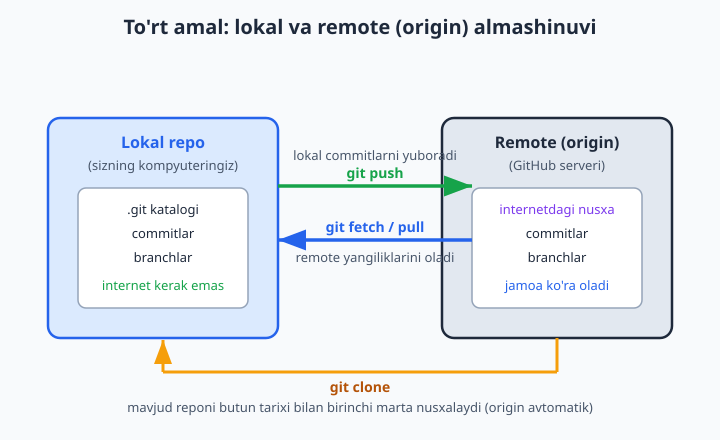
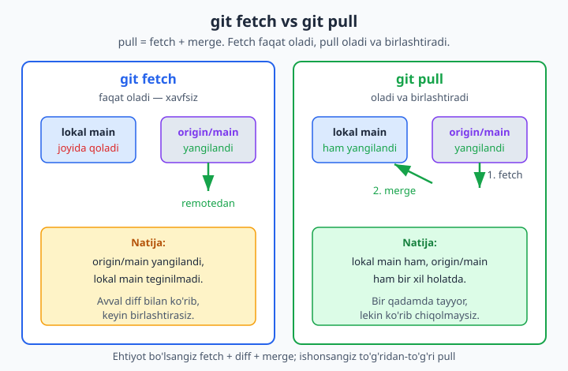
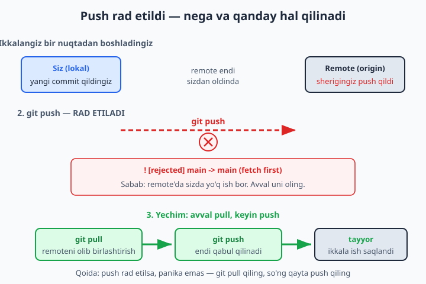
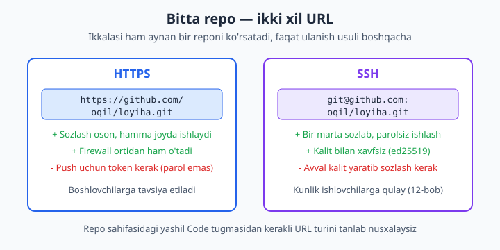

# 11 — Remote: clone, push, fetch, pull

[⬅️ Oldingi: 10 — GitHub bilan tanishuv](./10-github-tanishuv.md) · [🏠 README](./README.md) · [Keyingi: 12 — Autentifikatsiya: SSH va token ➡️](./12-autentifikatsiya-ssh.md)

> **Bu bobda:** lokal kompyuteringizdagi Git'ni GitHub'dagi repozitoriy bilan bog'lab, ish almashishni o'rganamiz. `git clone` mavjud reponi butun tarixi bilan nusxalashni, `git remote add origin` bilan lokal reponi remotega ulashni, `git push` o'zgarishlarni yuqoriga yuborishni, `git fetch` remote yangiliklarini xavfsiz olishni (birlashtirmasdan), `git pull` esa olib-birlashtirishni (fetch + merge) ko'rib chiqamiz. Eng muhim ikki tushuncha: **fetch va pull farqi**, hamda **push rad etilganda** (remote sizdan oldinda bo'lsa) nima qilish kerakligi. Yo'l-yo'lakay `origin/main` degan "remote-tracking branch" nimaligini, HTTPS va SSH url farqini va `git remote -v` bilan bog'lanishni tekshirishni o'rganamiz.

---

## Muammo

10-bobda GitHub'da bo'sh repozitoriy yaratdik, lekin kodimiz hali noutbukda turibdi — internetda hech narsa yo'q. Endi ikki olamni bog'lash kerak: lokaldagi commitlarni GitHub'ga **yuborish** va GitHub'dagi o'zgarishlarni **olib kelish**.

Tasavvur qiling: uch kishi bo'lib do'kon sayti yozyapsiz. Sherigingiz bosh sahifani, siz savatchani, uchinchi do'st to'lov qismini yozyapsiz. Har biringizning noutbukingizda alohida Git tarixi bor. Qanday qilib uchchalangizning ishingizni bitta joyda birlashtirasiz? Va eng muhimi: sherigingiz yangi xususiyat qo'shganda, uni qanday olib, o'z ishingizga qo'shasiz — papkalarni Telegram'da yuborib emas, balki Git'ning o'zi orqali?

Yoki oddiyroq holat: ustozingiz GitHub'da tayyor loyiha berdi, "buni yuklab oling va davom ettiring" dedi. Qanday qilib o'sha reponi butun tarixi bilan kompyuteringizga tushirasiz?

Bu muammolarning hammasi bitta tushuncha atrofida aylanadi — **remote**. Remote — bu reponing internetdagi (yoki boshqa serverdagi) nusxasi. Lokal Git va remote o'rtasida atigi to'rt amal ishlaydi: **clone** (birinchi marta nusxalash), **push** (yuborish), **fetch** (olish) va **pull** (olib-birlashtirish). Shu to'rt buyruqni o'zlashtirsangiz, butun jamoaviy Git ishini boshqarasiz.



---

## "Remote" nima va `origin` nimadan iborat

**Remote** (uzoqdagi) — bu reponing internetdagi manzili. Aslida bu shunchaki bir URL'ga berilgan **qisqa nom**. Har safar `https://github.com/oqil/loyiha.git` deb yozish o'rniga, Git'ga "buni `origin` deb atayman" deysiz, keyin doim qisqa nomdan foydalanasiz.

📌 **origin** — bu sehrli kalit so'z emas, oddiy nom. Git uni "asosiy remote" sifatida shartli ravishda shunday ataydi (`clone` qilganda avtomatik shu nom beriladi). Xohlasangiz `manba`, `github` yoki boshqa nom qo'yishingiz mumkin, lekin butun dunyo `origin` ishlatadi — odatga rioya qiling.

Mavjud remotelarni ko'rish uchun:

```bash
git remote -v
```

Natija (agar bog'langan bo'lsa):

```text
origin  https://github.com/oqil/loyiha.git (fetch)
origin  https://github.com/oqil/loyiha.git (push)
```

📌 Nega ikki qator? Git fetch (olish) va push (yuborish) uchun alohida URL ishlatishga imkon beradi (kamdan-kam holatda kerak bo'ladi). Odatda ikkalasi bir xil — bu normal.

## 1-yo'l: `git clone` — mavjud reponi nusxalash

Eng oson boshlash — GitHub'da allaqachon mavjud reponi to'liq nusxalash. Bu `git clone` bilan bir buyruqda bo'ladi:

```bash
git clone https://github.com/oqil/loyiha.git
```

Bu bitta buyruq juda ko'p ish qiladi:

1. `loyiha` nomli yangi papka yaratadi (URL'dagi nomdan).
2. Reponing **butun tarixini** (hamma commit, branch) ichiga ko'chiradi.
3. `origin` remoteni **avtomatik** sozlaydi — siz `git remote add` yozishingiz shart emas.
4. Asosiy branch'ni (odatda `main`) ochib qo'yadi, fayllar papkangizda paydo bo'ladi.

💡 Clone — bu oddiy "yuklab olish" emas. Google Drive'dan fayl yuklasangiz, faqat fayllarni olasiz. Clone esa **butun Git tarixini** olib keladi: siz oflayn ham `git log`, `git diff`, hatto yangi commit qila olasiz — chunki `.git` katalogi to'liq nusxalangan.

Clone qilingach, ichiga kirib remoteni tekshiring:

```bash
cd loyiha
git remote -v
git log --oneline
```

📌 Boshqa nom bilan klon qilmoqchimisiz? URL oxiriga papka nomini qo'shing: `git clone https://github.com/oqil/loyiha.git mening-papkam`. Endi repo `loyiha` emas, `mening-papkam` papkasiga tushadi.

## 2-yo'l: `git remote add` — mavjud lokal reponi ulash

Ko'pincha vaziyat teskari bo'ladi: 3-bobdan beri lokalda ishlab, commitlar qilib kelyapsiz, endi shuni GitHub'ga chiqarmoqchisiz. Bu holda clone ishlamaydi (lokal repo allaqachon bor) — uni mavjud bo'sh GitHub repoga **ulash** kerak.

10-bobda GitHub'da bo'sh repo yaratdingiz va u sizga URL berdi. Lokal papkangizda turib:

```bash
git remote add origin https://github.com/oqil/loyiha.git
git remote -v
```

`git remote add origin <url>` — "bu URL'ni `origin` deb atayman" degani. Endi Git lokal reponi qaysi remote bilan ishlashni biladi, lekin hali hech narsa yuborilmadi — buni keyingi qadam, push qiladi.

📌 Noto'g'ri URL qo'shib qo'ydingizmi? O'zgartirish uchun: `git remote set-url origin <yangi-url>`. Butunlay olib tashlash uchun: `git remote remove origin`.

## `git push` — o'zgarishlarni yuqoriga yuborish

Endi lokal commitlarni remotega yuboramiz. Birinchi push'da `-u` (yoki to'liq `--set-upstream`) bayrog'ini qo'shamiz:

```bash
git push -u origin main
```

O'qilishi: "`main` branch'imni `origin` remotega yubor va shu ikkisini **bog'lab** qo'y". Natija:

```text
To https://github.com/oqil/loyiha.git
 * [new branch]      main -> main
branch 'main' set up to track 'origin/main'.
```

`-u` ning sehri shundaki, u lokal `main` bilan remote `origin/main` o'rtasida doimiy **bog'lanish** (tracking) o'rnatadi. Buni `git branch -vv` bilan ko'rasiz:

```text
* main 1f86220 [origin/main] Birinchi commit
```

Kvadrat qavsdagi `[origin/main]` — aynan shu bog'lanish. Bir marta o'rnatilgach, keyingi safarlar uchun argumentlarni yozmaysiz — shunchaki:

```bash
git push
```

Git "bu branch `origin/main` ni kuzatadi" deb bilib, qayerga yuborishni o'zi tushunadi.

💡 `-u` ni faqat **birinchi** push'da yozasiz. Undan keyin har doim qisqa `git push` yetadi. Agar `-u` ni umuman unutsangiz, Git eslatadi: "branch'ingiz hech qaysi remoteni kuzatmaydi" — o'shanda `git push -u origin main` yozasiz.

📌 **Eski maslahatga ishonmang:** "parol bilan push qilasiz" degan eski qo'llanmalar 2026-yilda ishlamaydi. GitHub 2021-yildayoq oddiy parol bilan push'ni o'chirgan. HTTPS uchun **token** (Personal Access Token), SSH uchun **kalit** kerak — buni keyingi, 12-bobda batafsil sozlaymiz. Hozircha tushuning: birinchi push'da Git sizdan autentifikatsiya so'raydi.

## `origin/main` — remote-tracking branch nima

Push haqida gaplashganda `origin/main` degan g'alati nom paydo bo'ldi. Bu nima?

`origin/main` — bu **remote-tracking branch**: lokal Git'ingizning "remote oxirgi marta qanday holatda edi" degan **eslab qolgan nusxasi**. Bu sizning lokal `main`ingiz emas, va bu to'g'ridan-to'g'ri internetdagi `main` ham emas — bu ikkisi orasidagi "fotosurat".

Tasavvur qiling, uchta nuqta bor:

| Nom | Bu nima |
|---|---|
| `main` | Sizning lokal branch'ingiz — siz commit qilib ishlaydigan joy |
| `origin/main` | Lokal Git eslab qolgan: "remote eng oxiri men ko'rganimda shunday edi" |
| Haqiqiy remote `main` | GitHub serverida hozir nima turibdi (faqat internet orqali ko'rinadi) |

📌 `origin/main` faqat siz remote bilan gaplashganingizda (fetch, pull yoki push) yangilanadi. Boshqa odam GitHub'ga push qilsa, sizning `origin/main`ingiz **avtomatik** o'zgarmaydi — siz `git fetch` qilmaguningizcha eski qiymatda turaveradi. Aynan shu narsa fetch va pull'ni tushunish uchun kalit.

## `git fetch` — xavfsiz olib kelish

Sherigingiz GitHub'ga yangi commit qo'shdi. Siz uni ko'rmoqchisiz, lekin hali o'z ishingizga **aralashtirmasdan**. Buning uchun:

```bash
git fetch
```

`git fetch` faqat bitta ish qiladi: remote'dagi yangi commitlarni yuklab oladi va `origin/main` ni yangilaydi. Sizning lokal `main`ingizga **tegmaydi**, fayllaringiz **o'zgarmaydi**. Shuning uchun fetch — eng xavfsiz remote buyrug'i: u hech narsani buzolmaydi.

```text
From https://github.com/oqil/loyiha.git
   1f86220..52f3fbf  main       -> origin/main
```

Fetch'dan keyin holatni ko'ring:

```bash
git status
```

```text
## main...origin/main [behind 1]
```

`[behind 1]` — "lokal main remote'dan 1 commit orqada qoldi" degani. Endi nima keldi, ko'rib chiqishingiz mumkin:

```bash
git log --oneline origin/main     # remote'da nima bor
git diff main origin/main         # aniq qanday o'zgarishlar
```

Hammasi ma'qul bo'lsa, birlashtirasiz (`git merge origin/main` yoki keyingi bo'limdagi `git pull`). Ma'qul bo'lmasa — hech narsa qilmaysiz, lokal ishingiz buzilmagan.

💡 Maslahat: shoshilmang. Tajribali dasturchilar ko'pincha avval `fetch` qilib, `diff` bilan ko'rib, keyin birlashtirishadi. Bu "avval o'qib, keyin imzolash" qoidasi — ayniqsa katta jamoada.

## `git pull` — olib kelish va birlashtirish

`git pull` — bu aslida ikki buyruqning birikmasi:

```bash
git pull   =   git fetch   +   git merge origin/main
```

Ya'ni pull avval fetch qiladi (remote'ni oladi, `origin/main` ni yangilaydi), keyin darrov uni lokal `main`ingizga **birlashtiradi**. Bir buyruqda hammasi tayyor:

```bash
git pull
```

```text
Updating 1f86220..52f3fbf
Fast-forward
 README.md | 1 +
 1 file changed, 1 insertion(+)
```

`Fast-forward` — eng yaxshi holat: siz hech narsa o'zgartirmagan, shunchaki orqada qolgan edingiz, Git lokal `main`ni oldinga "surib qo'ydi", yangi merge commit yaratmadi.



### Fetch va pull — qaysi birini tanlash?

| | `git fetch` | `git pull` |
|---|---|---|
| Remote'ni oladimi? | Ha | Ha |
| Lokal `main`ni o'zgartiradimi? | **Yo'q** | Ha (birlashtiradi) |
| Xavfsizlik | Eng xavfsiz | Birlashganini avval ko'rolmaysiz |
| Qachon | Avval ko'rib chiqmoqchi bo'lsangiz | Ishonsangiz, tez ishlash uchun |

📌 Boshlovchi sifatida: yakka ishlaganda bemalol `git pull` ishlatavering. Jamoada, ayniqsa katta o'zgarishlar kutilganda, avval `git fetch` + `git diff` qilish odatini orttiring.

### `git pull --rebase` — chiroyliroq tarix

`git pull` birlashtirishda ba'zan ortiqcha "merge commit" yaratadi (8-bobdan eslang). Tarixni chiziqli, toza saqlash uchun ko'pchilik `--rebase` bilan tortadi:

```bash
git pull --rebase
```

Bu "remote o'zgarishlarni olib, mening lokal commitlarimni ularning **ustiga qayta qo'y**" degani (9-bobdagi rebase mantiqi). Natija — to'g'ri chiziqli tarix, ortiqcha merge commitsiz.

💡 Buni har safar yozmaslik uchun bir marta sozlab qo'ying:

```bash
git config --global pull.rebase true
```

Endi oddiy `git pull` ham rebase rejimida ishlaydi.

## Eng muhim tuzoq: push rad etildi

Bu — jamoada eng ko'p uchraydigan vaziyat, shuning uchun alohida o'rganamiz. Quyidagi xabarni ko'rsangiz, qo'rqmang:

```text
 ! [rejected]        main -> main (fetch first)
error: failed to push some refs to 'https://github.com/oqil/loyiha.git'
hint: Updates were rejected because the remote contains work that you do not
hint: have locally.
```

**Nima bo'ldi?** Siz commit qilib, push qilmoqchi bo'lganingizda, kimdir (sherigingiz) sizdan oldin GitHub'ga push qilib qo'ygan. Endi remote'da sizda **yo'q** commit bor. Git "men sizning ishingizni yuborib, sherigingizning ishini o'chirib yuborishni xohlamayman" deydi — shuning uchun push'ni **rad etadi**. Bu — Git sizni himoya qilyapti, xato emas.

📌 `(fetch first)` — Git'ning maslahati: "avval olib kel". Xabar o'zi yechimni aytib turibdi.

**Yechim — uch qadam:**

```bash
git pull          # 1) remote'dagi sherigingiz ishini olib, o'zimnikiga birlashtiraman
                  #    (yoki: git pull --rebase)
git push          # 2) endi ikkalasi birga, push qabul qilinadi
```

Agar siz va sherigingiz **turli fayllarni** o'zgartirgan bo'lsangiz, `git pull` jimgina birlashtiradi va `git push` muvaffaqiyatli ketadi. Agar **bir xil faylning bir xil joyini** o'zgartirgan bo'lsangiz — konflikt chiqadi (8-bobdagidek hal qilasiz: markerlarni tuzatib, `git add`, keyin davom etasiz), so'ng push qilasiz.



❌ **Hech qachon bunday qilmang:** rad etilgan push'ni `git push --force` bilan "majburlash". Bu sherigingizning commitlarini GitHub'dan **o'chirib tashlaydi** — ularning ishi yo'qoladi. Force push'ni faqat o'zingizning shaxsiy branch'ingizda, nima qilayotganingizni aniq bilganda ishlatasiz.

💡 Agar haqiqatan force kerak bo'lsa (masalan, o'z branch'ingizda rebase qilgandan keyin), xavfsizroq variantni ishlating: `git push --force-with-lease`. Bu "agar mening oxirgi ko'rganimdan beri remote o'zgarmagan bo'lsagina majburla" degani — birovning yangi ishini bilmasdan o'chirib yuborishdan saqlaydi.

## HTTPS vs SSH url

Repoga ulanishda ikki xil URL ko'rinishini uchratasiz. GitHub'da yashil **Code** tugmasini bossangiz, ikkala variant ham ko'rinadi:

| Tur | Ko'rinishi | Autentifikatsiya |
|---|---|---|
| **HTTPS** | `https://github.com/oqil/loyiha.git` | Token (Personal Access Token) |
| **SSH** | `git@github.com:oqil/loyiha.git` | SSH kalit (ed25519) |

Ikkalasi ham **aynan bitta reponi** ko'rsatadi — farq faqat ulanish va autentifikatsiya usulida.



- **HTTPS** — boshlash oson, deyarli hamma tarmoqda (firewall ortidan ham) ishlaydi. Push'da token so'raydi (bir marta saqlab qo'ysa bo'ladi). Boshlovchiga tavsiya.
- **SSH** — bir marta kalit sozlab qo'ysangiz, keyin parolsiz, tez ishlaysiz. Har kuni Git bilan ishlovchilarga qulay.

📌 Bu bobda HTTPS bilan ishlash yetarli. SSH kalitini yaratish va sozlashni keyingi, 12-bobda batafsil ko'rsatamiz. Hozircha bilib qo'ying: URL `https://` bilan boshlansa — HTTPS, `git@` bilan boshlansa — SSH.

## Kunlik ish oqimi — hammasi birga

Jamoada ishlaganda kunlik tartibingiz odatda shunday ko'rinadi:

```bash
# Ish boshlashdan oldin — eng so'nggi holatni oling:
git pull

# ... kod yozasiz, fayllarni o'zgartirasiz ...

git add .
git commit -m "Savatcha sahifasi qo'shildi"

# Ishni jamoaga yuborasiz:
git push
```

Agar `git push` rad etilsa — yuqoridagi qoida: `git pull` qiling, kerak bo'lsa konfliktni hal qiling, keyin yana `git push`. Mana shu — kunlik Git aylanasi.

💡 Oltin qoida: **ishni boshlashdan oldin har doim `git pull` qiling**. Bu sizni eng dolzarb koddan boshlashga majburlaydi va push rad etilishi ehtimolini keskin kamaytiradi.

---

## 11-bob mashqlari

> Quyidagi mashqlarni bajarish uchun GitHub akkauntingiz va lokalda Git o'rnatilgan bo'lishi kerak (10- va 2-boblar). Ko'p mashqlarda ikkita papka kerak bo'ladi — birini "siz", ikkinchisini "sherigingiz" deb tasavvur qiling: shunda push/pull/konflikt ssenariylarini yolg'iz o'zingiz sinab ko'rasiz.

1. GitHub'da mavjud biror public reponi (masalan, ustozingiz bergan yoki o'zingizning 10-bobda yaratganingizni) `git clone` bilan kompyuteringizga nusxalang. Papka avtomatik yaratilganini tekshiring.
2. Klonlangan papkaga kirib, `git remote -v` buyrug'ini ishlating. `origin` avtomatik sozlanganini va fetch/push URL'larini ko'ring.
3. Klonlangan repoda `git log --oneline` ni ishlating. Butun tarix (faqat fayllar emas) nusxalanganiga ishonch hosil qiling.
4. Bir reponi ataylab boshqa papka nomi bilan klon qiling: `git clone <url> mening-nusxam`. Papka nomi o'zgarganini tekshiring.
5. Lokalda yangi bo'sh papka yarating, `git init` qiling, bitta fayl qo'shib commit qiling. Bu hali remote'ga ulanmagan reponing holati.
6. 5-mashqdagi repoga `git remote add origin <url>` bilan GitHub'dagi bo'sh reponingizni ulang, so'ng `git remote -v` bilan tekshiring.
7. 6-mashqdagi reponi `git push -u origin main` bilan birinchi marta GitHub'ga yuboring. GitHub sahifasini brauzerda yangilab, fayl paydo bo'lganini ko'ring.
8. `git branch -vv` ni ishlating va lokal `main` yonidagi `[origin/main]` bog'lanishni toping. Bu nimani anglatishini izohlang.
9. Lokalda yana bitta o'zgarish qiling va commit qiling, so'ng bu safar faqat `git push` (argumentsiz) yozing. `-u` ortiq kerak emasligiga ishonch hosil qiling.
10. GitHub'ning veb-saytida (brauzerda) `README.md` ni tahrirlab, "Commit changes" bosing. Bu — remote'da sizning lokalingizda yo'q yangi commit yaratish demak.
11. 10-mashqdan keyin lokalda `git fetch` qiling. Diqqat: fayllaringiz o'zgardimi? Yo'q. `git status` da `[behind 1]` chiqqanini ko'ring.
12. Fetch'dan keyin `git log --oneline origin/main` va `git log --oneline main` ni solishtiring. Ikkalasi nega farq qiladi?
13. `git diff main origin/main` bilan remote'da aniq nima o'zgarganini ko'ring (hali birlashtirmasdan).
14. Endi `git pull` qiling va lokal `main` remote bilan tenglashganini tekshiring. Natijada `Fast-forward` chiqdimi?
15. `git config --global pull.rebase true` ni sozlang. Endi `git pull` rebase rejimida ishlashini tushuntiring.
16. Push konflikti ssenariysini qo'lda yarating: bitta reponi ikki papkaga klon qiling (A va B). A'da fayl o'zgartirib push qiling.
17. 16-mashqning davomi: B papkasida (pull qilmasdan) boshqa o'zgarish qilib commit qiling, so'ng `git push` urinib ko'ring. `! [rejected] ... (fetch first)` xabarini ko'ring.
18. 17-mashqning yechimini bajaring: B papkasida `git pull` qiling, keyin yana `git push`. Bu safar muvaffaqiyatli ketganini tasdiqlang.
19. Endi A va B papkalarida **bir xil faylning bir xil qatorini** o'zgartirib push konflikti yarating. Pull paytida chiqgan konfliktni 8-bobdagidek hal qilib, push qiling.
20. GitHub repo sahifasidagi yashil "Code" tugmasini bosing. HTTPS va SSH URL variantlarini toping va ularning farqini (`https://` va `git@` bilan boshlanishi) o'z so'zingiz bilan izohlang.
