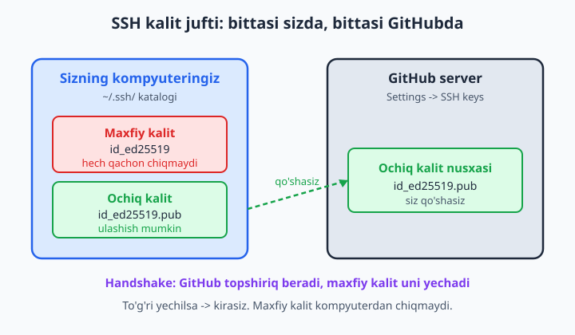
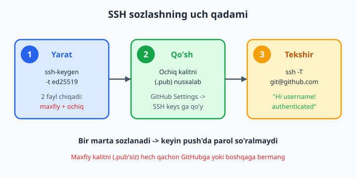
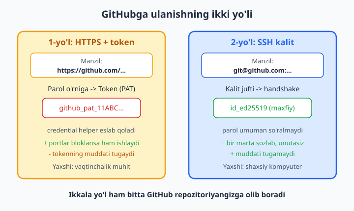

# 12 — Autentifikatsiya: SSH va token

[⬅️ Oldingi: 11 — Remote: clone, push, fetch, pull](./11-remote-push-pull.md) · [🏠 README](./README.md) · [Keyingi: 13 — Pull Request va code review ➡️](./13-pull-request.md)

> **Bu bobda:** GitHub sizdan kimligingizni qanday so'rashini va nega oddiy parol endi ishlamasligini tushunamiz. Ikki zamonaviy yo'lni o'rganamiz: HTTPS + Personal Access Token (PAT — shaxsiy kirish tokeni) va SSH kalit. ssh-keygen bilan kalit juftini yasaymiz, ochiq kalitni GitHubga qo'yamiz, `ssh -T` bilan tekshiramiz, PAT yaratamiz va xavfsiz saqlaymiz, credential helper (parolni eslab qoluvchi yordamchi) nimaligini ko'ramiz, `git remote set-url` bilan HTTPS va SSH orasida almashamiz. Yo'l-yo'lakay 2FA va eng muhimi — sirni hech qachon commit qilmaslik haqida gaplashamiz.

---

## Muammo

Tasavvur qiling: diplom loyihangizni GitHubga birinchi marta yubormoqchisiz. 11-bobdagidek hammasini tayyorladingiz:

```bash
git push -u origin main
```

Va terminalda quyidagi chiqadi:

```text
Username for 'https://github.com': oqil
Password for 'https://oqil@github.com':
```

Parolingizni yozasiz (ekranda hech narsa ko'rinmaydi — bu normal), Enter bosasiz va... xato:

```text
remote: Support for password authentication was removed on August 13, 2021.
remote: Please use a personal access token instead.
fatal: Authentication failed for 'https://github.com/oqil/loyiha.git/'
```

Ko'pchilik aynan shu yerda taqalib qoladi. "Parolim to'g'ri-ku, nega ishlamayapti?" Sababi oddiy: **GitHub 2021-yildan beri akkaunt parolini push uchun qabul qilmaydi.** Parol o'g'irlansa, butun akkauntingiz ketadi — shuning uchun GitHub xavfsizroq usulga o'tdi.

Ikki to'g'ri yo'l bor, ikkalasi ham shu bobda:

1. **HTTPS + Personal Access Token (PAT)** — parol o'rniga maxsus, cheklangan huquqli "kalit-so'z" ishlatasiz.
2. **SSH kalit** — kompyuteringizda maxfiy kalit, GitHubda ochiq kalit; parol umuman yozilmaydi.

📌 Avval nimani tanlashni hal qilaylik: yangi boshlovchi va bitta kompyuterda ishlaydigan bo'lsangiz — **SSH** eng qulay (bir marta sozlaysiz, keyin parolni butunlay unutasiz). Boshqalar kompyuteridan yoki vaqtinchalik muhitda ishlasangiz — **token** qulayroq. Quyida ikkalasini ham o'rgatamiz.

## Nega umuman autentifikatsiya kerak?

GitHub — internetda ochiq turgan server. Agar push qilish uchun hech qanday tekshiruv bo'lmasa, dunyoning istalgan odami sizning repozitoriyangizga kod yuborib, tarixini buzib tashlardi. Shuning uchun GitHub har bir push'da bitta savol beradi: **"Sen rostdan ham shu akkaunt egasimisan?"**

- **O'qish** (clone, fetch, pull) — agar repozitoriy **public** (ochiq) bo'lsa, autentifikatsiyasiz ham ishlaydi. Hamma o'qiy oladi.
- **Yozish** (push) va **private** (yopiq) repozitoriyni o'qish — har doim kimligingizni isbotlashni talab qiladi.

💡 Demak token yoki SSH kalit — bu sizning "raqamli pasportingiz". Uni ishonchli saqlash kerak, xuddi uy kalitidek.

## SSH kalit qanday ishlaydi

SSH (Secure Shell — xavfsiz aloqa kanali) **kalit jufti** tushunchasiga asoslanadi. Bitta buyruq ikkita fayl yaratadi:

- **Maxfiy kalit** (private key, masalan `id_ed25519`) — faqat sizning kompyuteringizda qoladi. **Hech kimga bermaysiz, hech qayerga yuklamaysiz.** Bu uy kalitining o'zi.
- **Ochiq kalit** (public key, `id_ed25519.pub`) — buni GitHubga qo'yasiz. Bu — eshikdagi qulf: hamma ko'rsa ham zarari yo'q, faqat sizning maxfiy kalitingiz uni ochadi.

Push qilganingizda GitHub va kompyuteringiz "qo'l berib ko'rishadi" (handshake): GitHub ochiq kalit bilan bir topshiriq beradi, kompyuteringiz uni faqat maxfiy kalit bilan yechadi. To'g'ri yechsa — kirasiz. Maxfiy kalit kompyuterdan **hech qachon chiqmaydi**, shu sabab bu usul juda xavfsiz.



📌 Nega `ed25519`? Bu — zamonaviy, qisqa va kuchli kalit turi (eski `rsa` ham bor, lekin uzun va sekinroq). 2026-yilda yangi kalit yaratayotgan bo'lsangiz, doim `ed25519` ni tanlang.

## 1-yo'l: SSH kalit yaratish

Avval kompyuteringizda kalit allaqachon bormi — tekshiramiz:

```bash
ls -al ~/.ssh
```

Agar ro'yxatda `id_ed25519` va `id_ed25519.pub` ko'rinsa, kalitingiz allaqachon bor — `ssh-keygen` qadamini o'tkazib yuborsangiz ham bo'ladi. `~` belgisi — bu uy katalogingiz (Windowsda `C:\Users\<ism>`, masalan `C:\Users\oqil`).

Yangi kalit yaratamiz:

```bash
ssh-keygen -t ed25519 -C "sizning@email.com"
```

Buyruqni o'qish: `-t ed25519` — kalit turi, `-C "..."` — izoh (odatda emailingiz, kalitni keyin tanib olish uchun). Buyruq uchta savol beradi:

```text
Generating public/private ed25519 key pair.
Enter file in which to save the key (/c/Users/oqil/.ssh/id_ed25519):
Enter passphrase (empty for no passphrase):
Enter same passphrase again:
```

1. **Faylga yo'l** — shunchaki Enter bosing (standart joy to'g'ri).
2. **Passphrase** (parol-ibora) — kalitning ustiga qo'shimcha parol. Boshlovchi uchun bo'sh qoldirib (faqat Enter) o'tsa ham bo'ladi; ishonchliroq bo'lishni istasangiz, qisqa ibora kiriting.

Natijada quyidagiga o'xshash chiqadi (bu rost ishlaydigan kalit, har safar boshqacha bo'ladi):

```text
Your identification has been saved in /c/Users/oqil/.ssh/id_ed25519
Your public key has been saved in /c/Users/oqil/.ssh/id_ed25519.pub
The key fingerprint is:
SHA256:YRZ2El9oX0CUTRn6K6MowLRnGXiD/8GmGqSDQKTlOnc sizning@email.com
```

Endi ikkita fayl tayyor: `id_ed25519` (maxfiy — tegmang) va `id_ed25519.pub` (ochiq — GitHubga qo'yamiz).

📌 ❌ `id_ed25519` (`.pub`siz) faylni hech qachon hech kimga yubormang, ekran ulashganda ko'rsatmang, chatga tashlamang. ✅ Faqat `.pub` bilan tugaydigan ochiq kalitni ulashasiz.

## Ochiq kalitni nusxalash

GitHubga qo'yish uchun **ochiq** kalit matnini ko'chirib olish kerak. Uni ekranga chiqaramiz:

```bash
cat ~/.ssh/id_ed25519.pub
```

Bitta uzun qator chiqadi:

```text
ssh-ed25519 AAAAC3NzaC1lZDI1NTE5AAAAINISaGUCyJi5AHGcM4sksBktkf5nv25DOq1UAjJl2DY1 sizning@email.com
```

`ssh-ed25519` dan boshlab emailingizgacha — **hammasini** belgilang va nusxalang (Ctrl+C). Boshida yoki oxirida bo'sh joy qolmasin.

💡 Windowsda buni to'g'ridan-to'g'ri clipboardga ko'chirish mumkin:

```bash
clip < ~/.ssh/id_ed25519.pub
```

Endi nusxa olingan, GitHubga o'tamiz.

## Ochiq kalitni GitHubga qo'shish

1. GitHubga kiring, o'ng yuqoridagi avataringizni bosing -> **Settings**.
2. Chap menyuda **SSH and GPG keys** ni tanlang.
3. **New SSH key** tugmasini bosing.
4. **Title** — kalitni tanib olish uchun nom, masalan `Uy noutbugi`.
5. **Key type** — `Authentication Key` (standart).
6. **Key** maydoniga yuqorida nusxalagan matnni qo'ying (Ctrl+V).
7. **Add SSH key** ni bosing (GitHub paroli yoki 2FA so'rashi mumkin).



## Aloqani tekshirish: ssh -T

Hammasi to'g'ri bog'langanini bitta buyruq aytib beradi:

```bash
ssh -T git@github.com
```

Birinchi marta ishlatsangiz, ogohlantirish chiqadi (GitHub serverini birinchi marta ko'rayapti):

```text
The authenticity of host 'github.com (140.82.x.x)' can't be established.
ED25519 key fingerprint is SHA256:+DiY3wvvV6TuJJhbpZisF/zLDA0zPMSvHdkr4UvCOqU.
Are you sure you want to continue connecting (yes/no/[fingerprint])?
```

`yes` deb yozib Enter bosing. So'ng muvaffaqiyat xabari:

```text
Hi oqil! You've successfully authenticated, but GitHub does not provide shell access.
```

✅ "Hi `<sizning_username>`! You've successfully authenticated" — **aynan shu jumla** SSH ishlayotganini bildiradi. "GitHub does not provide shell access" qismi xato emas — bu shunchaki "GitHub serverida terminal ochib o'tira olmaysiz" degani, bizga kerak ham emas.

📌 Agar `git@github.com: Permission denied (publickey)` chiqsa — GitHub kalitingizni tanimadi. Tez-tez uchraydigan sabablar: ochiq kalit GitHubga qo'shilmagan, noto'g'ri matn (bo'sh joy yoki yarmi) qo'yilgan, yoki maxfiy kalit `~/.ssh` da emas. Ochiq kalitni qayta nusxalab, GitHubdagi yozuvni tekshiring.

## SSH remote'dan foydalanish

Endi push'da hech qanday parol so'ralmaydi. Yangi loyihani SSH manzili bilan clone qilasiz:

```bash
git clone git@github.com:oqil/loyiha.git
```

E'tibor bering: SSH manzili `git@github.com:` bilan boshlanadi (HTTPSdagi `https://github.com/` emas). GitHub repozitoriy sahifasida **Code** tugmasini bosib, **SSH** yorlig'ini tanlasangiz, aynan shu manzilni ko'rasiz.

Allaqachon HTTPS bilan clone qilgan loyihangiz bo'lsa, uni SSHga o'tkazasiz (bu haqda quyida batafsil). Endi `git push` shunchaki ishlaydi:

```bash
git push
```

```text
Enumerating objects: 5, done.
...
To github.com:oqil/loyiha.git
   a1b2c3d..e4f5g6h  main -> main
```

Parol yo'q, token yo'q — bir marta sozlab, butunlay unutdingiz.

## 2-yo'l: Personal Access Token (PAT)

SSH sozlay olmaydigan holatlar bor (masalan ish kompyuteri SSH portini bloklagan, yoki vaqtincha boshqa mashinada ishlayapsiz). Bunda **HTTPS + token** ishlatasiz. Token — bu akkaunt parolingiz emas, balki **maxsus, cheklangan huquqli, muddati bor "vaqtinchalik parol"**.

GitHubda ikki xil token bor:

| Tur | Tavsif | Tavsiya |
|---|---|---|
| **Fine-grained token** | Aniq repozitoriy va aniq huquqlar tanlanadi | ✅ Yangi loyihalar uchun |
| **Classic token** | Keng, scope (huquq doirasi) bo'yicha | Eski oqimlar, ba'zi vositalar talab qilsa |

**Fine-grained token yaratish (tavsiya etiladi):**

1. **Settings** -> chap menyuda eng pastdagi **Developer settings**.
2. **Personal access tokens** -> **Fine-grained tokens** -> **Generate new token**.
3. **Token name** — masalan `noutbuk-push`.
4. **Expiration** — amal qilish muddati, masalan 90 kun (muddatsiz tokendan saqlaning).
5. **Repository access** — `Only select repositories` tanlab, kerakli loyihani belgilang.
6. **Permissions** -> **Repository permissions** -> **Contents** ni `Read and write` qiling (push uchun shu yetarli).
7. **Generate token** ni bosing.

📌 Token bir martagina to'liq ko'rsatiladi: `github_pat_11ABCDEF...`. **Shu zahoti nusxalab oling** va xavfsiz joyga (parol menejeriga) saqlang. Sahifani yopgach, tokenni boshqa hech qachon ko'ra olmaysiz — faqat yangisini yaratishingiz mumkin.

**Tokenni ishlatish:** push qilganda Username/Password so'ralganda:

```text
Username for 'https://github.com': oqil
Password for 'https://oqil@github.com':
```

Username — GitHub username'ingiz, **Password o'rniga esa tokenni** qo'ying (akkaunt parolini emas!). Token uzun bo'lgani uchun har push'da qayta yozish noqulay — buni credential helper hal qiladi.



## Credential helper — tokenni eslab qolish

Har safar uzun tokenni qo'lda yozmaslik uchun Git **credential helper** (kirish ma'lumotlarini saqlovchi yordamchi) ishlatadi. U birinchi marta kiritilgan tokenni eslab qoladi va keyingi push'larda o'zi qo'yadi.

Qaysi helper yoqilganini ko'rish:

```bash
git config --global credential.helper
```

Windowsda Git odatda **Git Credential Manager** bilan birga o'rnatiladi va natija quyidagicha chiqadi:

```text
manager
```

✅ `manager` chiqsa — hammasi tayyor. Windowsda birinchi push'da kichik oyna ochiladi, brauzer orqali GitHubga bir marta kirasiz, keyin token Windows Credential Manager'da xavfsiz saqlanadi va qaytib so'ralmaydi.

Agar hech narsa chiqmasa (helper yo'q), uni yoqing:

```bash
# Windows (eng yaxshi tanlov):
git config --global credential.helper manager

# macOS:
git config --global credential.helper osxkeychain
```

📌 ❌ `git config --global credential.helper store` ni ishlatmang: bu tokenni **oddiy matn** ko'rinishida `~/.git-credentials` fayliga, shifrsiz saqlaydi. Kompyuteringizdan boshqa biror dastur uni o'qiy oladi. ✅ Windowsda `manager`, macOS'da `osxkeychain` — bularning hammasi tokenni tizimning shifrlangan saqlash joyiga qo'yadi.

## HTTPS va SSH orasida almashish

Loyihangiz qaysi manzil bilan ulanganini ko'rasiz:

```bash
git remote -v
```

```text
origin  https://github.com/oqil/loyiha.git (fetch)
origin  https://github.com/oqil/loyiha.git (push)
```

Bu HTTPS bilan ulangan. SSHga o'tkazish uchun manzilni almashtiramiz:

```bash
git remote set-url origin git@github.com:oqil/loyiha.git
```

Tekshiramiz — endi SSH:

```bash
git remote -v
```

```text
origin  git@github.com:oqil/loyiha.git (fetch)
origin  git@github.com:oqil/loyiha.git (push)
```

Orqaga, SSHdan HTTPSga qaytish ham xuddi shunday:

```bash
git remote set-url origin https://github.com/oqil/loyiha.git
```

💡 Ikki manzil shaklini yodda saqlang — `set-url` da to'g'ri ko'chirish uchun:

| Tur | Manzil shakli |
|---|---|
| HTTPS | `https://github.com/<egasi>/<repo>.git` |
| SSH | `git@github.com:<egasi>/<repo>.git` |

Asosiy farq: HTTPSda `https://...` va `/`, SSHda `git@...:` va `:`. Repozitoriyning o'zi va tarixi o'zgarmaydi — faqat unga **qanday ulanish** o'zgaradi.

## Ikki bosqichli himoya (2FA)

GitHub 2023-yildan beri ko'p akkauntlar uchun **2FA** (two-factor authentication — ikki bosqichli tasdiqlash) ni majburiy qildi. Bu — paroldan tashqari, telefoningizdagi ilovadan keladigan bir martalik kod.

2FA yoqilgan bo'lsa:

- **Sayt**ga (github.com) kirishda parol + telefon kodi so'raladi.
- **Push** uchun esa baribir token yoki SSH kalit kerak — 2FA buni almashtirmaydi, balki **kuchaytiradi**.

📌 2FA yoqishni keyinga qoldirmang: **Settings -> Password and authentication -> Two-factor authentication**. Telefoningizga authenticator ilova (masalan, telefon ichidagi tasdiqlovchi) o'rnatasiz va GitHub bergan QR kodni skanerlaysiz. Tiklash kodlarini (recovery codes) ham saqlab qo'ying — telefonni yo'qotsangiz, akkauntga qaytishning yagona yo'li shu.

## Eng muhim qoida: sirni hech qachon commit qilmang

Bu — butun bob ichidagi eng jiddiy ogohlantirish. Token, parol, SSH maxfiy kaliti, API kaliti, ma'lumotlar bazasi paroli — bularning **birortasi ham** repozitoriyga tushmasligi kerak.

❌ Nima uchun xavfli: agar tokenni kodga yozib commit qilsangiz va push qilsangiz, u **butun git tarixiga** muhrlanadi. Keyin faylni o'chirib, yangi commit qilsangiz ham — token eski commit ichida qoladi va public repozitoriyda hammaga ochiq bo'ladi. Botlar GitHubni doim skanerlab, ochiq qolgan tokenlarni soniyalar ichida topadi va suiiste'mol qiladi.

✅ To'g'ri yo'l — sirlarni alohida faylga chiqarib, uni `.gitignore` orqali kuzatuvdan chiqarish:

```gitignore
# Sirlar va sozlamalar — hech qachon push qilinmaydi
.env
*.key
*.pem
secrets.json
```

`.env` faylida sirlaringiz turadi, lekin `.gitignore` tufayli u hech qachon commit'ga tushmaydi (`.gitignore` haqida 4-bobda batafsil bor).

📌 Agar adashib token yoki parolni push qilib yuborsangiz: 1) o'sha tokenni **darhol GitHubdan bekor qiling** (Settings -> token sahifasidan **Revoke**), 2) yangisini yarating. Faylni o'chirishning o'zi yetarli emas — token tarixda qolgani uchun uni amalsiz qilish shart. Tarixning o'zini tozalash (16-bob mavzusi) — bu ikkinchi qadam, lekin token allaqachon "ochilgan" deb hisoblang.

💡 Boblararo bog'liqlik: SSH/token bilan endi push qila olasiz (11-bob). Keyingi 13-bobda jamoa bo'lib ishlash — Pull Request va code review — boshlanadi, u yerda bu autentifikatsiya kundalik ishingizning poydevori bo'ladi.

## 12-bob mashqlari

> Mashqlar haqiqiy GitHub akkauntingizda bajariladi. Eski parolingizni hech qaerda kiritmang — faqat token va SSH kalit ishlatiladi.

1. Terminalda `ls -al ~/.ssh` buyrug'ini ishlatib, kompyuteringizda allaqachon SSH kalit (`id_ed25519` yoki `id_rsa`) bor-yo'qligini aniqlang.
2. `ssh-keygen -t ed25519 -C "<emailingiz>"` bilan yangi SSH kalit jufti yarating; passphrase'ni bo'sh qoldiring.
3. Yangi yaratilgan ikki faylni (`id_ed25519` va `id_ed25519.pub`) `ls ~/.ssh` bilan ko'ring va qaysi biri maxfiy, qaysi biri ochiq ekanini ayting.
4. `cat ~/.ssh/id_ed25519.pub` bilan ochiq kalit matnini ekranga chiqaring va u `ssh-ed25519` so'zidan boshlanganini tekshiring.
5. Ochiq kalitni `clip < ~/.ssh/id_ed25519.pub` (Windows) yordamida clipboardga nusxalang.
6. GitHubda **Settings -> SSH and GPG keys -> New SSH key** orqali ochiq kalitni `Uy kompyuteri` nomi bilan qo'shing.
7. `ssh -T git@github.com` ishlatib, "Hi `<username>`! You've successfully authenticated" xabarini oling; birinchi savolga `yes` javob bering.
8. Atayin xato qilib ko'ring: GitHubdan SSH kalitni vaqtincha o'chiring, `ssh -T git@github.com` ni qayta ishlating va `Permission denied (publickey)` xabarini kuzating, so'ng kalitni qaytadan qo'shing.
9. GitHubda yangi bo'sh repozitoriy (`ssh-sinov`) oching va uni `git clone git@github.com:<username>/ssh-sinov.git` bilan SSH manzili orqali clone qiling.
10. Shu loyihaga bitta fayl qo'shib commit qiling va `git push` ni parol so'ralmasdan ishlashini tasdiqlang.
11. **Settings -> Developer settings -> Personal access tokens -> Fine-grained tokens** orqali yangi token yarating; muddatini 30 kun qo'ying.
12. Tokenga faqat bitta repozitoriyga **Contents: Read and write** huquqini bering va yaratilgan token matnini xavfsiz joyga saqlang.
13. Yangi papkada loyihani HTTPS orqali clone qiling: `git clone https://github.com/<username>/ssh-sinov.git`.
14. Shu HTTPS nusxasiga o'zgarish kiritib push qiling; parol so'ralganda akkaunt paroli o'rniga tokenni qo'ying.
15. `git config --global credential.helper` ishlatib, kompyuteringizda qaysi credential helper yoqilganini aniqlang.
16. `git remote -v` bilan loyihangiz HTTPS yoki SSH bilan ulanganini ko'ring.
17. `git remote set-url origin git@github.com:<username>/ssh-sinov.git` bilan HTTPS loyihani SSHga o'tkazing va `git remote -v` bilan o'zgarishni tasdiqlang.
18. Endi `git remote set-url origin https://github.com/<username>/ssh-sinov.git` bilan orqaga HTTPSga qaytaring.
19. Loyihaga `.gitignore` fayli qo'shib, ichiga `.env` va `*.key` qatorlarini yozing, so'ng `git status` bilan `.env` faylining kuzatuvga tushmasligini tekshiring (sinov uchun bo'sh `.env` yarating).
20. GitHub **Settings -> Password and authentication** bo'limiga kirib, akkauntingizda 2FA holatini tekshiring; yoqilmagan bo'lsa, authenticator ilova bilan 2FA ni yoqing va tiklash kodlarini saqlang.
