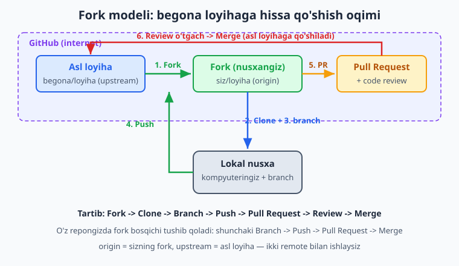
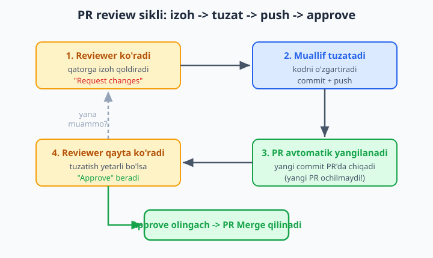
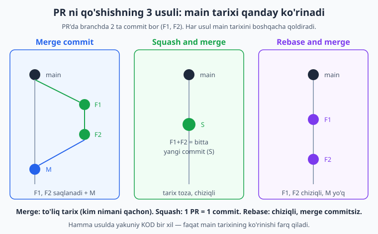

# 13 — Pull Request va code review

[⬅️ Oldingi: 12 — Autentifikatsiya: SSH va token](./12-autentifikatsiya-ssh.md) · [🏠 README](./README.md) · [Keyingi: 14 — Hamkorlik oqimlari: Git Flow, GitHub Flow ➡️](./14-hamkorlik-oqimlari.md)

> **Bu bobda:** jamoada nega to'g'ridan-to'g'ri `main`'ga push qilish xavfli ekanligini va uning yechimi — Pull Request (PR — "branchimni asosiyga qo'shing" so'rovi + muhokama) nimaligini o'rganamiz. O'z repongizda PR oqimini (branch -> push -> PR -> merge) va begona loyihaga hissa qo'shish uchun fork modelini (fork -> clone -> branch -> push -> PR) ko'ramiz. PR'ni qanday yaratish, yaxshi tavsif yozish, reviewer tayinlash; code review jarayoni (qatorga izoh, Request changes / Approve); PR'ni push bilan yangilash; uch xil merge usuli (Merge commit / Squash and merge / Rebase and merge) farqi; Draft PR; branch protection bilan tanishuv va fork'ni `upstream` bilan sinxron tutish — hammasi tekshirilgan buyruqlar bilan.

---

## Muammo

Tasavvur qiling: uch kishi bo'lib do'kon sayti yozyapsiz (8-bobdagi misol davom etyapti). Hamma `main`'ga ishlaydi. Bir kuni sherigingiz tushlik vaqtida tez bir o'zgartirish kiritdi va to'g'ridan-to'g'ri `main`'ga push qildi. Kechqurun ma'lum bo'ldiki, uning kodi sayni butunlay sindirib qo'ygan — login ishlamay qoldi. Endi sayt **hamma uchun** buzuq, chunki buzuq kod allaqachon asosiy branchda turibdi. Hech kim uni oldindan ko'rmagan, hech kim "to'xta, bu yerda xato bor" deya olmagan.

Muammoning ildizi shu: `main` — bu "rasmiy", ishlaydigan kod. Unga hech kim **yolg'iz**, **muhokamasiz**, **boshqalar ko'rmasdan** o'zgartirish kiritmasligi kerak. Lekin 7-8-boblardagi branch va merge'ning o'zi bu muammoni to'liq yechmaydi: agar har kim o'z branch'ini `main`'ga **o'zi** merge qilaversa, baribir hech kim ko'rmasdan qo'shilib ketaveradi.

Kerak bo'lgan narsa — o'zgartirishni `main`'ga qo'shishdan **oldin** boshqalarga ko'rsatish, muhokama qilish, "ha, qo'shsa bo'ladi" degan tasdiqni olish. Aynan shu uchun **Pull Request** kashf qilingan.

📌 Pull Request — bu Git buyrug'i emas. `git pull-request` degan buyruq yo'q. PR — bu GitHub (va GitLab, Bitbucket) ustiga qo'shilgan **hamkorlik vositasi**. U Git branch va merge mexanizmining ustida ishlaydi, lekin uning o'zi saytda (internetda) yashaydi.

## Pull Request nima

**Pull Request (PR)** — so'zma-so'z "tortib olish so'rovi", lekin amalda ma'nosi: **"mening branchimdagi o'zgarishlarni asosiy branchga qo'shing"** degan rasmiy so'rov. U ikki narsani birlashtiradi:

1. **Texnik tomon** — "falon branch'ni `main`'ga merge qiling". GitHub ikki branch o'rtasidagi farqni (diff) avtomatik ko'rsatadi.
2. **Ijtimoiy tomon** — muhokama joyi: tavsif, izohlar, savol-javob, tasdiq yoki rad.

Ya'ni PR — bu shunchaki "merge qil" tugmasi emas. Bu **muhokama oynasi**: o'zgartirish qo'shilmasdan oldin jamoa uni ko'radi, savol beradi, kamchilik topsa aytadi, va faqat hammasi joyida bo'lganda merge bosiladi.

| `main`'ga to'g'ridan push | Pull Request orqali |
|---|---|
| Hech kim ko'rmaydi | Jamoa kodni ko'radi va muhokama qiladi |
| Xato darrov "jonli" kodga tushadi | Xato merge'gacha topiladi |
| Tarixda "kim, nega" yo'qoladi | PR muhokamasi abadiy saqlanadi |
| Orqaga qaytarish qiyin | Merge'dan oldin to'xtatish oson |

💡 PR faqat katta jamoalar uchun emas. Yakka ishlasangiz ham PR foydali: o'zingiz uchun o'zgarishni bir joyga to'plab ko'rasiz, tarix toza bo'ladi, va keyinroq "men bu funksiyani nega bunday qildim?" degan savolga PR tavsifi javob beradi.

## Ikki ssenariy: o'z repo va begona repo

PR oqimi ikki holatda biroz farq qiladi.

**1-ssenariy: o'z repongizda (yoki sizga yozish huquqi berilgan jamoa repongizda).** Bu yerda fork kerak emas — siz repoga to'g'ridan branch push qila olasiz. Oqim qisqa:

```text
branch ochish -> push -> PR yaratish -> review -> merge
```

**2-ssenariy: begona, sizniki bo'lmagan loyihaga hissa qo'shish (open source).** Bu yerda muammo bor: begona repoga push qilish huquqingiz yo'q. Yechim — **fork**: avval loyihaning nusxasini o'z akkauntingizga olasiz (10-bobda fork'ni ko'rgandik), keyin shu nusxaga ishlaysiz:

```text
fork -> clone -> branch -> push (o'z fork'ingizga) -> PR (asl loyihaga) -> review -> merge
```



📌 Farqning mohiyati bitta: **push qayerga ketadi, PR qayerga boradi?** O'z repongizda ikkalasi ham bitta repo. Fork modelida esa push sizning fork'ingizga ketadi, PR esa fork'dan asl loyihaga yuboriladi. Asl loyiha egasi sizning fork'ingizdagi branch'ni o'zinikiga qo'shishni so'raganini ko'radi.

## O'z repongizda PR yaratish

Eng oddiy holatdan boshlaylik. Sizda GitHub'da repo bor (11-bobda push qilgansiz). Yangi funksiya uchun PR oqimini ko'ramiz.

**1-qadam: branch oching va ishlang.** Hech qachon to'g'ridan `main`'da ishlamang — har funksiya o'z branch'ida (7-bob):

```bash
# main'dan yangi branch ochamiz va unga o'tamiz:
git switch -c login-tugma

# ... kodni o'zgartiramiz, fayllar yaratamiz ...
git add login.js
git commit -m "login tugmasi qoshildi"
```

**2-qadam: branch'ni GitHub'ga push qiling.** Birinchi push'da `-u` (yoki `--set-upstream`) bayrog'i bilan — bu branch'ni remote'dagi branch bilan "bog'laydi", keyingi push/pull'larda nom yozish shart bo'lmaydi:

```bash
git push -u origin login-tugma
```

Natija (vaqtinchalik papkada haqiqatan tekshirildi):

```text
 * [new branch]      login-tugma -> login-tugma
branch 'login-tugma' set up to track 'origin/login-tugma'.
```

💡 E'tibor bering: push'dan keyin GitHub ko'pincha terminalda to'g'ridan-to'g'ri PR yaratish uchun havola chiqaradi (`Create a pull request for 'login-tugma' on GitHub by visiting: https://github.com/...`). Uni bosib darrov PR sahifasiga o'tasiz.

**3-qadam: GitHub saytida PR yarating.** Repo sahifasiga kiring. Yangi branch push qilingach, GitHub yuqorida sariq chiziqda **"Compare & pull request"** tugmasini ko'rsatadi — uni bosing. Yoki **Pull requests** tabiga o'tib **New pull request** bosasiz.

Ochilgan sahifada ikki muhim narsa bor:

- **base** (asos) — qayerga qo'shiladi, odatda `main`.
- **compare** (solishtiriladigan) — qaysi branch qo'shiladi, bizda `login-tugma`.

Ya'ni o'qilishi: "`login-tugma` ni `main` ga qo'shing". GitHub pastda ikki branch farqini (qaysi fayllar o'zgargan, qaysi qatorlar qo'shilgan/o'chgan) avtomatik ko'rsatadi.

**4-qadam: tavsif yozing va PR'ni yarating.** Ikki maydon bor:

- **Title** (sarlavha) — qisqa, aniq: "Login tugmasi qo'shildi". Commit izohi kabi.
- **Description** (tavsif) — bu yerda **nima** va **nega** qilganingizni tushuntirasiz.

**Create pull request** ni bosasiz — PR tayyor. Endi u jamoaga ko'rinadi va muhokama qilinadi.

📌 Yaxshi PR tavsifi reviewer'ning ishini yengillashtiradi va sizning vaqtingizni tejaydi. Namuna struktura:

```markdown
## Nima qilindi
Login sahifasiga "Kirish" tugmasi va uning bosilish hodisasi qo'shildi.

## Nega
Foydalanuvchilar formani to'ldirgach kiraolmasdi (issue #14).

## Qanday sinab ko'rish kerak
1. /login sahifasini oching
2. Email va parol kiriting
3. "Kirish" bosing -> bosh sahifaga o'tishi kerak
```

💡 Agar PR biror Issue'ni (19-bob) hal qilsa, tavsifda `Closes #14` deb yozing. PR merge bo'lganda GitHub o'sha issue'ni avtomatik yopadi — qulay bog'lash.

## Begona loyihaga fork bilan hissa qo'shish

Endi murakkabroq holat: GitHub'da yoqqan open source loyihaga tuzatish qo'shmoqchisiz. Loyiha sizniki emas — push huquqingiz yo'q. To'liq oqim quyidagicha.

**1-qadam: fork qiling.** Loyiha sahifasida o'ng yuqoridagi **Fork** tugmasini bosing. GitHub loyihaning to'liq nusxasini sizning akkauntingizga ko'chiradi: `github.com/sizning-username/loyiha`. Bu — sizning **fork**ingiz, unda to'liq huquqingiz bor.

**2-qadam: o'z fork'ingizni clone qiling.** Asl loyihani emas, aynan **o'z fork'ingizni** kompyuteringizga ko'chiring (11-bobdagi clone):

```bash
git clone git@github.com:sizning-username/loyiha.git
cd loyiha
```

**3-qadam: asl loyihani `upstream` qilib qo'shing.** Sizda hozir bitta remote bor — `origin`, u sizning fork'ingizga ishora qiladi. Lekin asl loyiha yangilanib turadi, undan yangiliklarni olishingiz kerak. Shuning uchun asl loyihani ikkinchi remote — odatdagi nom `upstream` ("yuqori oqim", "asl manba") bilan qo'shamiz:

```bash
# origin allaqachon bor (sizning fork). upstream — asl loyiha:
git remote add upstream git@github.com:asl-egasi/loyiha.git

# Tekshiramiz:
git remote -v
```

Natija (haqiqatan tekshirildi):

```text
origin    git@github.com:sizning-username/loyiha.git (fetch)
origin    git@github.com:sizning-username/loyiha.git (push)
upstream  git@github.com:asl-egasi/loyiha.git (fetch)
upstream  git@github.com:asl-egasi/loyiha.git (push)
```

Endi ikki remote bor: `origin` = sizning fork (push shu yerga), `upstream` = asl loyiha (yangiliklarni shu yerdan olasiz).

**4-qadam: branch oching, ishlang, fork'ingizga push qiling:**

```bash
git switch -c xatoni-tuzatish
# ... tuzatishni qilamiz, add, commit ...
git push -u origin xatoni-tuzatish
```

📌 Push **`origin`**'ga (sizning fork'ingizga) ketadi — asl loyihaga emas, chunki u yerga huquqingiz yo'q. Bu normal.

**5-qadam: asl loyihaga PR yuboring.** GitHub'da o'z fork'ingiz sahifasiga kiring. **Compare & pull request** bosganingizda GitHub aqlli ish qiladi: PR'ning **base**'ini asl loyiha (`asl-egasi/loyiha`'ning `main`'i), **compare**'ini sizning branch'ingiz qilib qo'yadi. Ya'ni: "mening fork'imdagi `xatoni-tuzatish` ni asl loyihaning `main`'iga qo'shing". Tavsif yozib, **Create pull request** bosasiz. Endi asl loyiha egasi sizning taklifingizni ko'radi.

💡 O'z fork'ingizdagi `main`'ga hech qachon ishlamang — uni asl loyiha bilan bir xil (toza) saqlang. Har tuzatish alohida branch'da. Buning sababini "upstream bilan sinxron" bo'limida ko'ramiz.

## Code review: izoh, Request changes, Approve

PR ochildi. Endi eng muhim qism — **code review** (kod ko'rigi). Bu — boshqa dasturchi (reviewer) sizning kodingizni o'qib, fikr bildirishi. Maqsad: xatolarni topish, kodni yaxshilash, bilim almashish.

Reviewer PR sahifasidagi **Files changed** (o'zgargan fayllar) tabiga o'tadi. U yerda har qaysi qatorga sichqonchani olib borib, **+** belgisini bosib, **aynan o'sha qatorga** izoh qoldira oladi:

> "Bu yerda `null` kelishi mumkin — tekshiruv qo'shsangizmi?"

Reviewer izohlarini yozib bo'lgach, **Review changes** tugmasini bosib, uchta xulosadan birini tanlaydi:

| Xulosa | Ma'nosi |
|---|---|
| **Comment** | Shunchaki fikr/savol, ha-yo'q demaydi |
| **Approve** ✅ | "Bu kod yaxshi, merge qilsa bo'ladi" — tasdiq |
| **Request changes** ❌ | "Avval shu kamchiliklarni tuzating, keyin qaytaman" |

📌 **Request changes** — bu jazo emas, bu hamkorlik. Reviewer kodingizni e'tibor bilan o'qib, yaxshilashga yordam berayapti. Yaxshi dasturchilar review izohlarini **sovg'a** deb qabul qiladi: kimdir sizning kodingizdagi xatoni siz uchun, bepul topib berdi.

💡 Reviewer sifatida o'zingiz ko'rsangiz: izoh aniq va do'stona bo'lsin. "Bu xato" emas, "bu yerda shunday qilsak yaxshiroq bo'larmidi, chunki..." Kod ustida gaplashing, odam ustida emas.

## PR'ni yangilash: push qilsangiz yangilanadi

Eng muhim, ko'pchilik boshlovchini chalg'itadigan nuqta: **Request changes** keldi — endi nima qilaman? Yangi PR ochamanmi? **Yo'q!**

PR — bu **branch**ga bog'langan. Siz o'sha branch'ni tuzatib, yana push qilsangiz, PR **avtomatik yangilanadi**. Yangi commit'laringiz PR ichida darrov paydo bo'ladi. Hech qanday yangi PR ochish, "qayta yuborish" kerak emas.

```bash
# Hali o'sha branch'damiz (login-tugma yoki xatoni-tuzatish):
# ... reviewer aytgan kamchilikni tuzatamiz ...
git add login.js
git commit -m "review izohi: null tekshiruvi qoshildi"
git push           # -u oldin qilingani uchun branch nomi shart emas
```

Push tugashi bilan PR sahifasiga qaytsangiz, yangi commit u yerda turibdi. Reviewer xabar oladi, qayta ko'radi va — agar tuzatish yetarli bo'lsa — **Approve** beradi.



Bu sikl — izoh -> tuzat -> push -> qayta ko'rik -> approve — PR ning yuragi. Ba'zan u bir marta, ba'zan bir necha marta aylanadi. Bu normal: yaxshi kod ko'pincha bir necha takomildan o'tadi.

📌 Vaqtinchalik papkada tekshirdik: bitta branch'ga ketma-ket commit qilib push qilganda, remote'dagi o'sha branch yangilanadi — yangi branch yaratilmaydi. PR aynan shuni ko'rsatadi. `git rev-list --count main..login-tugma` branch'dagi commitlar sonini ko'rsatadi: har push'dan keyin u o'sib boradi.

## Uch xil merge usuli

Review tugadi, Approve olindi. Endi PR'ni merge qilamiz — yashil **Merge pull request** tugmasini bosamiz. Lekin GitHub bu tugmaning yonida pastga o'q beradi: **uch xil merge usuli** bor. Ular yakuniy kodni bir xil qoldiradi, lekin `main` **tarixini** boshqacha ko'rsatadi.



Aytaylik, branch'da 2 ta commit bor (F1, F2). Mana har usul nima qiladi:

**1. Merge commit** (`Create a merge commit`). Branch'ning hamma commiti (F1, F2) `main`'ga ko'chadi va ustiga bitta qo'shimcha **merge commit** (M) qo'shiladi. Tarix "tarmoqlangan" ko'rinadi. Tekshirilgan natija:

```text
*   Merge pull request: feature
|\
| * feature commit 2
| * feature commit 1
* | main: boshqa ish
|/
* main: boshlangich
```

To'liq tarix saqlanadi — kim, nima, qachon qilgani ko'rinadi. Kamchilik: ko'p kichik commit bo'lsa, tarix "shovqinli" bo'ladi.

**2. Squash and merge** (`Squash and merge`). Branch'ning **hamma commiti bitta yangi commitga** (S) siqiladi va `main`'ga chiziqli qo'shiladi. Tekshirilgan natija:

```text
* feature (squash): hammasi bitta commitda
* main: boshqa ish
* main: boshlangich
```

`main` tarixi juda toza: har PR = bitta commit. Kamchilik: branch ichidagi mayda qadamlar yo'qoladi (lekin PR'ning o'zida ular saqlanib qoladi).

**3. Rebase and merge** (`Rebase and merge`). Branch commitlari (F1, F2) `main`'ning ustiga **chiziqli ko'chiriladi**, merge commit yaratilmaydi. Tekshirilgan natija:

```text
* feature commit 2
* feature commit 1
* main: boshqa ish
* main: boshlangich
```

Tarix chiziqli va har commit alohida saqlanadi — merge commitsiz. Kamchilik: commit hash'lari o'zgaradi (9-bobdagi rebase mantiqi), shuning uchun "tarixni o'zgartirish" qoidalariga e'tibor kerak.

| Usul | main tarixi | Qachon |
|---|---|---|
| **Merge commit** | Tarmoqlangan, hamma commit + M | Tarixning to'liqligi muhim bo'lsa |
| **Squash and merge** | Chiziqli, 1 PR = 1 commit | Eng toza tarix; ko'p jamoa shuni tanlaydi |
| **Rebase and merge** | Chiziqli, har commit alohida | Toza tarix + commitlarni alohida saqlash |

💡 Boshlovchi uchun maslahat: **Squash and merge** ko'pchilik holatda eng qulay. Tarix toza bo'ladi, har PR bitta tushunarli commit qoldiradi, va branch ichidagi "tuzatdim, yana tuzatdim, xato edi" kabi mayda commitlar `main`'ni iflos qilmaydi. Jamoangizda qaysi usul tanlangani odatda kelishib qo'yiladi.

📌 Merge qilingach, GitHub **Delete branch** tugmasini ko'rsatadi — uni bosib branch'ni o'chiring. Ishi tugagan branch keraksiz. Lokal nusxasini ham tozalash uchun: `git switch main`, `git pull`, keyin `git branch -d login-tugma`.

## Draft PR — "hali tayyor emas"

Ba'zan PR'ni ish tugamasdan **oldin** ochmoqchisiz: jamoaga "men shu ustida ishlayapman" deb ko'rsatish, yoki erta fikr olish uchun. Lekin uni hali merge qilib bo'lmaydi. Aynan shu uchun **Draft pull request** (qoralama PR) bor.

PR yaratayotganda **Create pull request** tugmasi yonidagi o'qni bosib **Create draft pull request** ni tanlaysiz. Draft PR:

- "Work in progress" (ishlanyapti) deb belgilanadi.
- **Merge tugmasi bloklangan** — tasodifan merge qilib bo'lmaydi.
- Reviewer'lar ko'rishi mumkin, lekin "hali tugamagan" ekani aniq.

Ish tugagach, **Ready for review** tugmasini bosib draft'ni oddiy PR'ga aylantirasiz — endi review va merge ochiladi.

💡 Draft PR — katta funksiyalarda juda foydali. Bir hafta ishlaydigan narsa ustida ishlayotganda, draft PR ochib qo'yasiz: jamoa nima qilayotganingizni ko'radi, yo'lda fikr beradi, oxirida hamma narsa tayyor bo'lganda review'ga chiqarasiz. "Katta surpriz PR" — bir kunda 50 fayllik kod — review qilish juda qiyin; draft bilan jarayonni ochiq tutasiz.

## Branch protection — main'ni qulflash

Endi boshidagi muammoga qaytaylik: jamoadosh tushlik vaqtida to'g'ridan `main`'ga push qilib, hammasini sindirdi. PR oqimini o'rgandik, lekin uni **majburiy** qilmasak, baribir kimdir to'g'ridan push qilishi mumkin. Bu yerda **branch protection** (branch himoyasi) yordam beradi.

Repo egasi **Settings -> Branches** bo'limida `main` uchun himoya qoidalari qo'ya oladi. Eng foydalilari:

- **Require a pull request before merging** — `main`'ga faqat PR orqali o'zgartirish kiritish mumkin; to'g'ridan push taqiqlanadi.
- **Require approvals** — merge'dan oldin kamida N ta Approve kerak (masalan 1 yoki 2).
- **Require status checks to pass** — testlar (GitHub Actions, 20-bob) o'tmaguncha merge bloklangan.

📌 Branch protection — jamoaning "xavfsizlik to'ri". U bilan, hatto repo egasining o'zi ham xato bilan to'g'ridan push qila olmaydi: hamma o'zgarish ko'rikdan o'tib, tasdiqlanib, keyin merge bo'ladi. Boshidagi "tushlik vaqtidagi falokat" shunday oldini olinadi.

💡 Bu bobda branch protection bilan faqat yuzaki tanishdik — uni qo'yish va sozlash repo egasining ishi. Sizga boshlovchi sifatida muhimi: jamoa reposida ko'pincha `main`'ga to'g'ridan push **ishlamaydi** ("protected branch" xatosi chiqadi), va bu — xato emas, balki to'g'ri sozlangan loyiha belgisi. Yo'li bitta: branch ochib, PR yuborish.

## Fork'ni upstream bilan sinxron tutish

Oxirgi muhim ko'nikma — fork modelida ishlayotganda. Siz loyihani fork qildingiz, lekin asl loyiha **yangilanib turadi**: boshqalar PR yuboradi, ular merge bo'ladi, asl loyiha oldinga ketadi. Sizning fork'ingiz esa joyida qotib qoladi — eskirib boradi.

Yangi tuzatish boshlashdan oldin, fork'ingizni asl loyiha bilan **sinxronlash** kerak, aks holda eski koddan branch ochasiz va konflikt ehtimoli oshadi. Buni `upstream` orqali qilamiz (uni yuqorida qo'shgandik):

```bash
# Asl loyihaning so'nggi holatini olamiz (lekin hali birlashtirmaymiz):
git fetch upstream

# main'ga o'tib, asl loyihaning main'ini ustiga birlashtiramiz:
git switch main
git merge upstream/main
```

Tekshirilgan natija: `git log --oneline` da endi asl loyihaning yangi commitlari paydo bo'ladi — fork'ingiz "quvib yetadi". Keyin yangi branch ochsangiz, u eng so'nggi koddan boshlanadi.

📌 Mana shuning uchun fork'dagi `main`'ga hech qachon o'z ishingizni qo'ymaslik kerak: `main`'ni asl loyiha bilan bir xil, "toza oyna" holatida saqlasangiz, har safar `git merge upstream/main` muammosiz ishlaydi. O'zgartirishlaringiz esa har doim alohida branch'larda turadi.

💡 Sinxronlashning saytdagi qisqa yo'li ham bor: o'z fork'ingiz sahifasida GitHub **"Sync fork"** tugmasini ko'rsatadi — uni bossangiz, GitHub fork'ingizning `main`'ini asl loyiha bilan teng qiladi. Keyin lokal'da `git pull` qilasiz. Boshlovchiga shu osonroq; terminal usulini esa fork qanday ishlashini tushunish uchun bilib qo'ying.

## Xulosa

PR — jamoada xavfsiz ishlashning asosi. To'g'ridan `main`'ga push o'rniga: branch ochasiz, push qilasiz, PR ochib muhokama qilasiz, review'dan o'tasiz va merge qilasiz. Begona loyihaga hissa qo'shganda old qo'shimcha bosqich — fork va `upstream` qo'shiladi, qolgani bir xil. Uch merge usulidan boshlovchi uchun **Squash and merge** ko'pincha eng qulay. Keyingi bobda (14) bu PR oqimi jamoa darajasida qanday qoidaga aylanishini — Git Flow va GitHub Flow ni ko'ramiz.

## 13-bob mashqlari

Ko'pchilik mashq GitHub saytida bajariladi. Test uchun bittadan ortiq akkaunt kerak bo'lsa, do'st yoki sherigingiz bilan birgalikda ishlang yoki ikkinchi (test) akkaunt oching.

1. O'z GitHub repongizda `main`'dan `mashq-pr` nomli branch oching, bitta fayl o'zgartiring, commit qiling va `git push -u origin mashq-pr` bilan push qiling.
2. Push'dan keyin terminalda chiqqan PR yaratish havolasini toping (yoki saytda "Compare & pull request" tugmasini), birinchi PR'ingizni oching.
3. PR'ga sarlavha va to'liq tavsif yozing: "Nima qilindi", "Nega", "Qanday sinab ko'rish kerak" bo'limlari bilan.
4. PR'ning "Files changed" tabiga o'ting va qaysi qatorlar qo'shilgan (yashil) va o'chgan (qizil) ekanini ko'ring.
5. PR'ni Squash and merge usuli bilan merge qiling, keyin GitHub taklif qilgan "Delete branch" tugmasi bilan branch'ni o'chiring.
6. Lokal'da `git switch main`, `git pull` qilib, merge bo'lgan o'zgarishni kompyuteringizga oling, keyin `git branch -d mashq-pr` bilan lokal branch'ni ham o'chiring.
7. Yangi PR oching, lekin bu safar uni **Draft pull request** sifatida yarating. Uning "merge" tugmasi bloklanganini ko'ring.
8. Draft PR'ga yana bitta commit push qiling va u PR ichida avtomatik paydo bo'lganini tasdiqlang (yangi PR ochilmaganini ko'ring).
9. Draft PR'ni "Ready for review" tugmasi bilan oddiy PR'ga aylantiring va merge qiling (har qaysi usulni sinab ko'ring).
10. Bitta PR'ni Merge commit, ikkinchisini Squash, uchinchisini Rebase usuli bilan merge qiling. Har birdan keyin repo'ning "Commits" tarixini ochib, uchala usul tarixni qanday boshqacha ko'rsatishini solishtiring.
11. GitHub'da yoqqan kichik open source loyihani toping va uni **Fork** qiling. Fork sizning akkauntingizda paydo bo'lganini (URL'da username'ingizni) tasdiqlang.
12. O'z fork'ingizni kompyuteringizga `git clone` qiling va `git remote -v` bilan `origin`ning sizning fork'ga ishora qilayotganini ko'ring.
13. Asl loyihani `git remote add upstream <asl-url>` bilan ikkinchi remote sifatida qo'shing va `git remote -v` da endi ikki remote (origin va upstream) borligini tasdiqlang.
14. Fork'ingizda `kichik-tuzatish` branch oching (masalan README'ga bitta qator yoki imloviy xato tuzating), commit qilib `git push -u origin kichik-tuzatish` bilan o'z fork'ingizga push qiling.
15. Fork sahifasidan asl loyihaga (uning egasiga) Pull Request yuboring. PR'ning "base"i asl loyiha, "compare"i sizning branch'ingiz ekanini tekshiring.
16. Test/ikkinchi akkaunt yordamida (yoki sherigingizdan so'rab) o'zingizning PR'ingizga reviewer sifatida bitta qatorga izoh qoldiring va "Request changes" bering.
17. Request changes kelgan branch'da kamchilikni tuzating, yana commit qilib push qiling va PR avtomatik yangilanganini, reviewer'ga xabar borganini kuzating.
18. Reviewer "Approve" bergach, PR'ni merge qiling. Endi review siklini boshdan oxirigacha (izoh -> tuzat -> push -> approve -> merge) bir marta to'liq aylantirib chiqing.
19. Bir necha kun ishlangan fork'ingizni asl loyiha bilan sinxronlang: `git fetch upstream`, `git switch main`, `git merge upstream/main`. Yoki saytdagi "Sync fork" tugmasini ishlatib, keyin lokal'da `git pull` qiling.
20. (Repo egasi bo'lsangiz) Settings -> Branches'da `main` uchun "Require a pull request before merging" qoidasini yoqing, keyin to'g'ridan `main`'ga push qilib ko'ring va "protected branch" xatosini olganingizni tasdiqlang. So'ng o'zgartirishni branch + PR orqali qo'shing.
