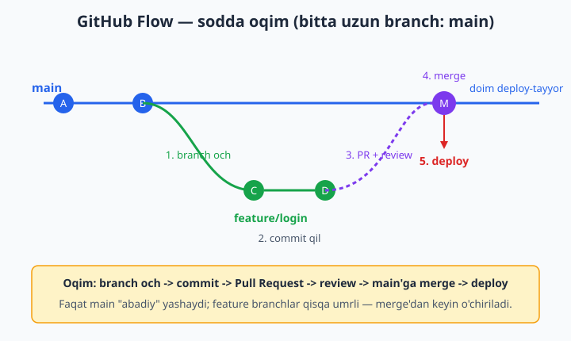
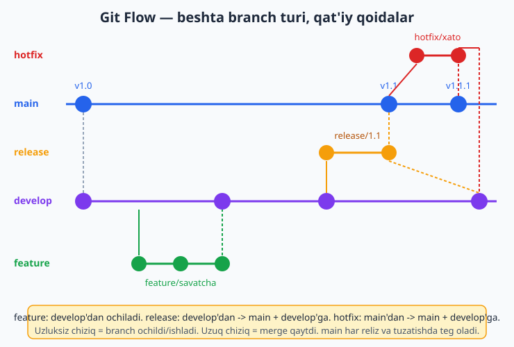
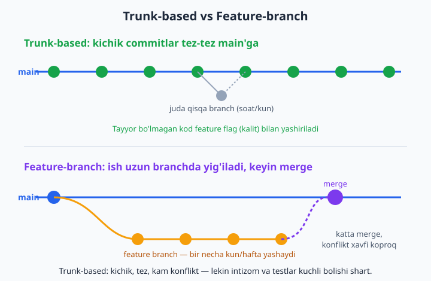

# 14 — Hamkorlik oqimlari: Git Flow, GitHub Flow

[⬅️ Oldingi: 13 — Pull Request va code review](./13-pull-request.md) · [🏠 README](./README.md) · [Keyingi: 15 — Stash, tag va cherry-pick ➡️](./15-stash-tag-cherry-pick.md)

> **Bu bobda:** branch va PR'ni alohida-alohida o'rgandik; endi ularni jamoa uchun bitta kelishilgan tartibga — oqimga (workflow, ya'ni "ishni qaysi branch'da, qachon va qanday qilamiz" degan kelishuv) bog'laymiz. Eng mashhur uchta oqimni ko'rib chiqamiz: GitHub Flow (sodda — faqat main va feature branchlar), Git Flow (murakkab — main/develop/feature/release/hotfix) va trunk-based (kichik commitlar to'g'ridan main'ga). Qaysi birini qachon tanlashni, branch'larni qanday nomlashni (`feature/login`, `fix/123`), Conventional Commits qoidasini (`feat:`, `fix:`), main'ni himoyalashni (protected branch) va hotfix ssenariysini o'rganamiz.

---

## Muammo

Tasavvur qiling: siz to'rt kishilik jamoa bilan onlayn do'kon sayti yozyapsiz. Birinchi hafta hammasi yaxshi ketdi. Ikkinchi hafta esa muammolar boshlandi:

- Aziz to'g'ridan `main`'ga ishlay boshladi va saytni buzib qo'ydi — endi mijozlar uchun ochiq sayt ishlamayapti.
- Malika `login` degan branch ochdi, lekin Jasur ham xuddi shu nom bilan branch ochdi — chalkashlik.
- Dilshod commit xabarlariga "tuzatdim", "yana", "ishladi" deb yozadi — bir oydan keyin hech kim nima o'zgarganini tushunmaydi.
- Saytda jiddiy xato chiqdi va uni TEZDA tuzatish kerak, lekin yarim tayyor yangi funksiyalar `main`'da turibdi — relizni to'xtatib bo'lmaydi.

Bularning hammasi bitta sababdan: jamoada **kelishuv yo'q**. Kim qaysi branch'da ishlaydi? `main` qachon "tayyor"? Yangi ish qachon main'ga qo'shiladi? Bu savollarga oldindan javob beradigan qoidalar to'plami — **oqim (workflow)** deyiladi. Git sizni biror oqimga majbur qilmaydi: u faqat asbob beradi (branch, merge, PR), oqimni esa jamoa o'zi tanlaydi.

Bu bobda eng ko'p ishlatiladigan uchta oqimni ko'ramiz va siz o'z loyihangiz uchun mosini tanlay olasiz.

## Oqim nima va nega kerak

Oqim — bu jamoa kelishib oladigan bir nechta oddiy qoida:

1. Yangi ishni qayerda boshlaymiz? (qaysi branch'dan yangi branch ochamiz)
2. Branch'ni qanday nomlaymiz?
3. Ish tugagach uni qayerga va qanday qo'shamiz? (merge, PR, review)
4. `main` qachon "deploy-tayyor" hisoblanadi?

📌 Eng muhim tushuncha: ko'pchilik oqimlarda `main` (asosiy branch) — bu **muqaddas** joy. U doim ishlaydigan, sinovdan o'tgan kodni saqlaydi. Hech kim to'g'ridan `main`'ga "xom" kod yozmaydi — har bir o'zgarish avval alohida branch'da pishitiladi, ko'rib chiqiladi, keyingina main'ga qo'shiladi. Shu bitta qoidaning o'zi yuqoridagi muammolarning yarmini hal qiladi.

Endi uchta tayyor oqimni ko'rib chiqamiz — eng soddasidan boshlaymiz.

## GitHub Flow — sodda va eng ko'p ishlatiladigan

Bu eng oddiy oqim. Faqat bitta uzoq yashaydigan branch bor: `main`. Qoidasi shunchaki:

> **`main` doim deploy-tayyor.** Har qanday ish — yangi funksiya yoki xato tuzatish — alohida qisqa branch'da bajariladi, Pull Request orqali ko'rib chiqiladi, keyin `main`'ga merge qilinadi va darrov deploy qilinadi.



Bosqichma-bosqich ko'ramiz. Buni sinab ko'rish uchun **loyihangizga emas**, bo'sh sinov papkasi ochib quyidagini yozing:

```bash
git init -b main
echo "# Dokon sayti" > README.md
git add README.md
git commit -m "chore: loyiha boshlandi"

# 1) Yangi ish uchun branch ochamiz
git switch -c feature/login

# 2) Ishlaymiz va commit qilamiz
echo "login forma" > login.html
git add login.html
git commit -m "feat: login formasi qoshildi"

# 3) main'ga qaytib, ishni qo'shamiz (haqiqatda PR orqali bo'ladi)
git switch main
git merge --no-ff feature/login -m "Merge pull request: feature/login"
```

Tarixga qarasak, branch ajralib chiqib, keyin qaytib qo'shilgani ko'rinadi:

```bash
git log --oneline --graph
```

```text
*   d1a850f Merge pull request: feature/login
|\
| * 6e1c260 feat: login formasi qoshildi
|/
* f6a0896 chore: loyiha boshlandi
```

Ish tugagach branch'ni o'chiramiz — u kerak emas:

```bash
git branch -d feature/login
```

📌 Haqiqiy hayotda 3-bosqichni o'zingiz `merge` bilan qilmaysiz. Buning o'rniga branch'ni GitHub'ga push qilasiz (11-bob), u yerda **Pull Request** ochasiz (13-bob), hamkasbingiz code review qiladi, keyin GitHub'dagi yashil "Merge" tugmasi bosiladi. Ya'ni `git merge` — bu mahalliy o'rgangan mexanika; jamoada esa uning o'rnida PR turadi.

💡 GitHub Flow nega shunchalik mashhur? Chunki tushunish oson, branch turlari kam, va u zamonaviy "tez-tez deploy qilish" uslubiga (har kuni bir necha marta relizga chiqarish) juda mos keladi. Startaplar, kichik-o'rta jamoalar va aksariyat ochiq kodli loyihalar aynan shuni ishlatadi.

**GitHub Flow qachon yaxshi:**

| Holat | Mos keladimi |
|---|---|
| Kichik-o'rta jamoa | ✅ ha |
| Veb-sayt / SaaS (tez-tez deploy) | ✅ ha |
| Bitta "joriy" versiya yetarli | ✅ ha |
| Bir vaqtda bir necha eski versiyani qo'llab-quvvatlash kerak | ❌ yetarli emas |

## Git Flow — murakkab, lekin qat'iy reliz uchun

GitHub Flow oddiy, lekin ba'zi loyihalarda yetarli emas. Masalan, siz mobil ilova yozasiz: do'konga (App Store) chiqargan har bir versiya oylab foydalanuvchilarda turadi, yangi versiyani esa sinchiklab tayyorlab, sinovdan o'tkazib chiqarasiz. Bunday "rejali reliz" uchun **Git Flow** to'g'ri keladi. Bu yerda beshta branch turi bor:

| Branch | Umri | Vazifasi |
|---|---|---|
| `main` | abadiy | Faqat chiqarilgan, barqaror versiyalar. Har commit — reliz, teg bilan belgilanadi. |
| `develop` | abadiy | Kunlik ish yig'iladigan joy. Keyingi reliz shu yerda pishadi. |
| `feature/*` | qisqa | Bitta yangi funksiya. `develop`'dan ochiladi, `develop`'ga qaytadi. |
| `release/*` | qisqa | Relizga tayyorlash (versiya raqami, oxirgi tuzatishlar). |
| `hotfix/*` | qisqa | Chiqarilgan versiyadagi shoshilinch xato. `main`'dan ochiladi. |



Diagrammada chalkash ko'rinishi mumkin, lekin qoidalar aniq:

- **feature** — `develop`'dan ochiladi, tugagach `develop`'ga qaytadi. (`main`'ga TEGMAYDI.)
- **release** — `develop`'dan ochiladi; tayyor bo'lgach **ham** `main`'ga (reliz), **ham** `develop`'ga qaytadi.
- **hotfix** — `main`'dan ochiladi (chunki muammo chiqarilgan versiyada); tuzatilgach **ham** `main`'ga, **ham** `develop`'ga qaytadi.

Sinov papkasida feature qismini ko'rib chiqamiz:

```bash
git init -b main
echo "v1.0" > app.txt
git add app.txt
git commit -m "chore: birinchi reliz tayyor"
git tag v1.0.0

# develop branch'ini ochamiz — kunlik ish shu yerda
git switch -c develop

# yangi funksiya develop'dan ochiladi
git switch -c feature/savatcha
echo "savatcha" > cart.txt
git add cart.txt
git commit -m "feat: savatcha qoshildi"

# develop'ga qaytaramiz
git switch develop
git merge --no-ff feature/savatcha -m "Merge feature/savatcha"
git branch -d feature/savatcha
```

📌 `--no-ff` (no fast-forward) bayrog'i nima uchun? 8-bobda ko'rgan edik: usiz Git ba'zan branch tarixini "tekislab", bitta to'g'ri chiziqqa aylantirib yuboradi. Git Flow'da esa har bir feature'ning alohida "shox" bo'lib ko'rinishi muhim — shuning uchun har doim `--no-ff` ishlatiladi: bu majburan merge commit yaratadi va tarixda "bu yerda feature qo'shildi" izi qoladi.

💡 Git Flow kuchli, lekin "og'ir". Branch turlari ko'p, qoidalarni yodda tutish kerak, yangi a'zoga tushuntirish qiyin. Bugun ko'pchilik jamoalar undan voz kechib, GitHub Flow yoki trunk-based'ga o'tgan. Git Flow'ni asosan **versiyalangan, rejali relizli** mahsulotlarda (mobil ilovalar, kutubxonalar, qurilma dasturlari) ko'rasiz.

## Trunk-based — eng tez oqim

Uchinchi yondashuv GitHub Flow'dan ham radikalroq. "Trunk" — daraxtning tanasi, ya'ni `main`. G'oyasi: branchlar deyarli bo'lmasin yoki juda qisqa (bir necha soat, ko'pi bilan bir kun) yashasin. Har bir dasturchi kichik-kichik o'zgarishlarni tez-tez `main`'ga qo'shadi.



```bash
git init -b main

# kichik, mustaqil commitlar ketma-ket main'ga tushadi
echo "satr 1" > app.txt
git add app.txt && git commit -m "feat: asosiy tugma"

echo "satr 2" >> app.txt
git add app.txt && git commit -m "fix: tugma rangi"

echo "satr 3" >> app.txt
git add app.txt && git commit -m "docs: README yangilandi"

git log --oneline
```

```text
ef7f7f9 docs: README yangilandi
e045735 fix: tugma rangi
db57388 feat: asosiy tugma
```

Bu yerda darrov savol tug'iladi: agar yangi funksiya hali tayyor bo'lmasa-yu, kodi allaqachon `main`'da bo'lsa — foydalanuvchilar yarim ishni ko'rmaydimi? Yechim — **feature flag** (funksiya kaliti): yangi kod yoziladi, lekin maxsus "kalit" bilan o'chirilgan turadi. Funksiya to'liq tayyor bo'lgach, kalit yoqiladi.

📌 Trunk-based juda tez, lekin **intizom talab qiladi**: avtomatik testlar kuchli bo'lishi shart (chunki har commit darrov main'ga tushadi), va har bir o'zgarish kichik bo'lishi kerak. Yetuk jamoalar va katta texnologik kompaniyalar (Google kabi) shuni ishlatadi. Yangi jamoaga esa GitHub Flow xavfsizroq boshlanish nuqtasi.

## Qaysi oqimni tanlash kerak

Bitta "to'g'ri" javob yo'q — jamoa hajmi va reliz uslubiga qarab tanlanadi:

| Vaziyat | Tavsiya |
|---|---|
| Yangi/kichik jamoa, veb-sayt yoki SaaS | **GitHub Flow** |
| Bir vaqtda bir necha versiyani qo'llab-quvvatlash, rejali reliz (mobil, kutubxona) | **Git Flow** |
| Yetuk jamoa, kuchli avtomatik testlar, juda tez deploy | **Trunk-based** |
| Yolg'iz ishlayapsiz, o'rganyapsiz | **GitHub Flow** (sodda variant) |

💡 Maslahat: shubha bo'lsa — **GitHub Flow**'dan boshlang. U eng sodda, eng keng tarqalgan va keyin kerak bo'lsa murakkabroq oqimga o'tish oson. Murakkab Git Flow'ni "ehtimol kerak bo'lar" deb oldindan tanlash — ko'pincha keraksiz murakkablik keltiradi.

## Branch'larni nomlash

Oqim tanladingiz — endi branch nomlari ham tartibli bo'lishi kerak. Yaxshi nom branch maqsadini bir qarashda aytib beradi. Keng tarqalgan qolip: `tur/qisqacha-tavsif`.

| Prefiks | Maqsadi | Misol |
|---|---|---|
| `feature/` | Yangi funksiya | `feature/login`, `feature/savatcha` |
| `fix/` | Xato tuzatish | `fix/tolov-xatosi`, `fix/123` |
| `hotfix/` | Shoshilinch tuzatish | `hotfix/sayt-ochilmaydi` |
| `chore/` | Texnik ish (sozlash, yangilash) | `chore/paketlarni-yangilash` |
| `docs/` | Hujjat | `docs/readme` |

✅ Yaxshi nomlar: `feature/parol-tiklash`, `fix/289-rasm-yuklanmaydi`, `chore/eslint-sozlash`

❌ Yomon nomlar: `yangi`, `test`, `aziz-branch`, `ishim`, `tuzatish2`

📌 Nomda bo'sh joy yoki o'zbekcha apostrof ishlatmang — faqat lotin harflari, raqam, `-` va `/`. `fix/to'lov` emas, `fix/tolov` deb yozing. Bo'sh joy esa terminalde muammo keltiradi.

💡 Agar nomni xato yozsangiz, o'zgartirish oson — hozirgi branch'dasiz deylik:

```bash
git branch -m feature/login-sahifa
```

Bu hozirgi branch nomini `feature/login-sahifa`ga o'zgartiradi (`-m` — move/rename).

## Conventional Commits — commit xabari standarti

Branch nomlari kabi commit xabarlari ham tartibli bo'lsa, jamoa ishi osonlashadi. **Conventional Commits** — keng qabul qilingan oddiy qolip:

```text
tur: qisqacha tavsif
```

`tur` — o'zgarishning turi. Asosiy turlar:

| Tur | Ma'nosi | Misol |
|---|---|---|
| `feat` | yangi funksiya | `feat: parolni tiklash qoshildi` |
| `fix` | xato tuzatish | `fix: savatcha summasi notogri hisoblanardi` |
| `docs` | faqat hujjat | `docs: ornatish bolimi yangilandi` |
| `style` | format (kod ishlashiga ta'sir qilmaydi) | `style: bo'sh joylar tartibga keltirildi` |
| `refactor` | kodni qayta yozish (xulq o'zgarmaydi) | `refactor: login funksiyasi soddalashtirildi` |
| `test` | testlar | `test: login uchun testlar qoshildi` |
| `chore` | texnik ish | `chore: paketlar yangilandi` |

✅ Yaxshi: `feat: foydalanuvchi rasmini yuklash qoshildi`

❌ Yomon: `yangilik`, `tuzatdim`, `ishladi nihoyat`, `asdf`

💡 Nega bu foydali? Birinchidan, tarixni o'qish oson bo'ladi — `git log --oneline`ga qarab nima o'zgarganini darrov tushunasiz. Ikkinchidan, maxsus vositalar bu xabarlarni o'qib **avtomatik changelog** (o'zgarishlar ro'yxati) va versiya raqamini yaratib bera oladi: `feat:` — yangi funksiya (versiya o'sadi), `fix:` — tuzatish.

📌 Katta o'zgarish (eski kodni buzadigan) bo'lsa, turdan keyin `!` qo'yiladi: `feat!: eski login API olib tashlandi`. Bu "diqqat, bu o'zgarish eski kodni ishdan chiqarishi mumkin" degan signal.

```bash
git commit -m "feat: savatchaga mahsulot qoshish tugmasi"
git commit -m "fix: telefon raqami tekshiruvi tuzatildi"
git commit -m "docs: README'ga ornatish yoriqnomasi"
```

## main'ni himoyalash: protected branch va majburiy PR

Yuqoridagi muammoda Aziz to'g'ridan `main`'ga yozib saytni buzgan edi. Buning oldini GitHub'da **protected branch** (himoyalangan branch) sozlamasi oladi. GitHub repozitoriysida `Settings -> Branches -> Add branch protection rule` orqali `main` uchun qoidalar qo'yasiz:

- ✅ **Require a pull request before merging** — to'g'ridan push qilib bo'lmaydi, faqat PR orqali.
- ✅ **Require approvals** — kamida 1 (yoki ko'proq) odam review qilib tasdiqlamaguncha merge qilinmaydi.
- ✅ **Require status checks to pass** — avtomatik testlar (CI, 20-bobda) yashil bo'lmaguncha merge bloklanadi.

📌 Bu sozlamalardan keyin hatto repozitoriy egasi ham `main`'ga to'g'ridan push qila olmaydi — hammaga bir xil qoida. Bu xato emas, balki maqsad: `main`'ni inson xatosidan himoyalash. Bu zamonaviy jamoalarda deyarli majburiy amaliyot.

💡 Yodda tuting: 2026-yilda GitHub'ga parol bilan push qilib bo'lmaydi. Avtentifikatsiya faqat SSH kalit yoki shaxsiy token orqali (12-bobda batafsil ko'rgansiz). Protected branch esa undan yuqori qatlam — kim push qila olishini emas, push qilingan narsa main'ga qanday yo'l bilan tushishini boshqaradi.

## Hotfix ssenariysi — to'liq yo'l

Endi muammodagi eng og'riqli holatni hal qilamiz: chiqarilgan saytda jiddiy xato bor, TEZDA tuzatish kerak, lekin `main` (yoki Git Flow'da `develop`)da yarim tayyor ishlar turibdi. Yangi funksiyalarni kutib turolmaymiz.

**GitHub Flow'da (sodda):** `main` doim deploy-tayyor, shuning uchun hotfix oddiy feature'dan farq qilmaydi — faqat tezroq:

```bash
git switch main
git switch -c hotfix/tolov-xato
# xatoni tuzatamiz
git add .
git commit -m "fix: tolov tugmasi bosilmaydigan xato tuzatildi"
# push -> PR -> tezkor review -> merge -> deploy
```

**Git Flow'da:** hotfix `main`'dan ochiladi (chunki muammo aynan chiqarilgan versiyada) va tuzatilgach **ikki joyga** qaytadi — `main`'ga (foydalanuvchilar tuzatishni olishi uchun) **va** `develop`'ga (kelajakdagi relizda xato qaytib chiqmasligi uchun):

```bash
# 1) main'dan hotfix ochamiz
git switch main
git switch -c hotfix/tolov-xato

# 2) tuzatamiz
echo "tuzatildi" >> app.txt
git add app.txt
git commit -m "fix: tolov xatosi tuzatildi"

# 3) main'ga qaytaramiz va yangi versiya tegini qo'yamiz
git switch main
git merge --no-ff hotfix/tolov-xato -m "Merge hotfix/tolov-xato"
git tag v1.1.1

# 4) develop'ga ham qaytaramiz — xato u yerda qaytib chiqmasin
git switch develop
git merge --no-ff hotfix/tolov-xato -m "Merge hotfix develop'ga"

# 5) branch'ni o'chiramiz
git branch -d hotfix/tolov-xato
```

📌 4-qadam (develop'ga ham merge) eng ko'p unutiladigan joy. Agar uni o'tkazib yuborsangiz, keyingi katta relizda eski xato **qaytib chiqadi** — chunki develop tuzatishni ko'rmagan. Bu Git Flow'ning klassik tuzog'i.

💡 Asosiy g'oya barcha oqimlarda bir xil: hotfix — eng yuqori versiyaga (foydalanuvchilarga) tezkor tuzatish, lekin tuzatish kelgusi ishga ham yetib borishi shart. "Faqat shu yerda tuzatdim" deb qoldirib ketmang.

## Bularning hammasini birga qo'yamiz

Endi muammodagi har bir og'riqning yechimi bor:

| Muammo | Yechim |
|---|---|
| Aziz main'ni buzdi | Protected `main` + majburiy PR — to'g'ridan push mumkin emas |
| Branch nomlari chalkash | `feature/`, `fix/` prefiksli aniq nomlash qoidasi |
| Tushunarsiz commit xabarlari | Conventional Commits (`feat:`, `fix:`, `docs:`) |
| Hotfix relizni to'xtatadi | Alohida `hotfix/` branch — yarim ishlarga tegmasdan tuzatib deploy |
| Kim qaysi branch'da? | Tanlangan oqim (GitHub Flow / Git Flow / trunk-based) |

Eng muhimi — bu qoidalarni jamoa **birga** kelishib olishi va `README` yoki `CONTRIBUTING.md` faylida yozib qo'yishi. Shunda yangi a'zo ham birinchi kuni "bu yerda qanday ishlanadi?"ga javob topadi.

## 14-bob mashqlari

> Bu mashqlarni sinov papkasida bajaring — loyihangizning haqiqiy `.git`iga tegmang. Yechimlar berilmagan: har birini o'zingiz qilib ko'ring.

1. GitHub Flow, Git Flow va trunk-based oqimlarini uchta ustunli jadval qilib yozing: har birida nechta uzoq yashaydigan branch bor, `main`'ga ish qanday qo'shiladi, qaysi loyihaga mos.
2. Bo'sh sinov papkasida `git init -b main` qilib, `feature/salom-sahifa` branch ochib, bitta fayl qo'shib commit qiling, so'ng GitHub Flow uslubida `--no-ff` bilan main'ga merge qiling va `git log --oneline --graph`da shox ko'rinishini tekshiring.
3. Quyidagi yomon branch nomlarini to'g'ri prefiksli nomga aylantiring: `yangi-ish`, `test2`, `azizning-branchi`, `tuzatish`, `LOGIN sahifa`.
4. Quyidagi o'zgarishlar uchun mos Conventional Commit xabari yozing: (a) saytga "biz haqimizda" sahifasi qo'shildi, (b) narx noto'g'ri hisoblanayotgan xato tuzatildi, (c) README'ga o'rnatish bo'limi qo'shildi, (d) eski paketlar yangilandi.
5. Bitta commit'ni `git commit -m "tuzatdim"` deb yozing, keyin (hali push qilmagan bo'lsangiz) commit xabarini Conventional Commits qoidasiga moslab qayta yozing.
6. Sinov papkasida `develop` branch yarating va undan `feature/savatcha` ochib, ish qilib, `develop`'ga `--no-ff` bilan qaytaring. Bu Git Flow'ning feature qismi.
7. Branch nomini ataylab xato yozing (`feature/loign`), keyin `git branch -m` bilan to'g'rilang.
8. Tasavvur qiling: 3 kishilik jamoa veb-sayt yozyapti va kuniga bir necha marta deploy qiladi. Qaysi oqimni tanlaysiz va nega — 3-4 jumlada asoslang.
9. Tasavvur qiling: mobil ilova yozyapsiz, har versiya App Store'da oylab turadi va bir vaqtda eski versiyani ham tuzatib turish kerak. Qaysi oqim mos va nega?
10. Git Flow'da beshta branch turining har biri (main, develop, feature, release, hotfix) qayerdan ochilishi va qayerga qaytishini bir jadvalda yozing.
11. Sinov papkasida to'liq hotfix ssenariysini bajaring: `main`'dan `hotfix/xato` oching, tuzatish commit qiling, `main`'ga merge qiling va `git tag v1.0.1` bilan teg qo'ying.
12. Yuqoridagi hotfix'ni Git Flow uslubida `develop`'ga **ham** merge qiling. Keyin `git log --oneline --graph --all`da tuzatish ikkala branch'da ham borligini tasdiqlang.
13. Trunk-based uslubni simulyatsiya qiling: bitta faylga uchta kichik o'zgarish qilib, har birini alohida Conventional Commit bilan to'g'ridan `main`'ga yozing.
14. "Feature flag" tushunchasini o'z so'zlaringiz bilan 2-3 jumlada tushuntiring va u trunk-based oqimida nega kerakligini ayting.
15. Repozitoriy `README` yoki `CONTRIBUTING.md` uchun "Bizning oqimimiz" bo'limining qoralamasini yozing: tanlangan oqim, branch nomlash qoidasi va commit xabari qoidasini sanab bering (matn fayli, kod ishga tushirilmaydi).
16. GitHub'da (yoki yodingizda) `main` branch'ini himoyalash uchun yoqiladigan uchta sozlamani sanang va har biri qanday muammodan himoya qilishini bir jumlada yozing.
17. Ikki dasturchi bitta `feature/login` nomini ishlatib qoldi. Bunday to'qnashuvning oldini olish uchun jamoaga qanday nomlash qoidasini taklif qilasiz? Misol bilan yozing.
18. `feat:`, `fix:`, `docs:`, `chore:`, `refactor:` turlaridan qaysi biri versiya raqamini oshirishi kerakligini va nega shundayligini izohlang.
19. Quyidagi tarixni `git log --oneline`da ko'rdingiz deylik: `tuzatish`, `yana`, `ishladi`, `final2`. Bu tarix qaysi muammolarni keltirib chiqaradi va Conventional Commits buni qanday hal qiladi — yozib chiqing.
20. O'zingizning haqiqiy (yoki o'ylab topilgan) loyihangiz uchun to'liq oqim tanlang va asoslang: qaysi oqim, qanday branch nomlari, commit qoidasi va `main` himoyasi bo'ladimi — qisqacha "jamoa qo'llanmasi" sifatida yozing.
