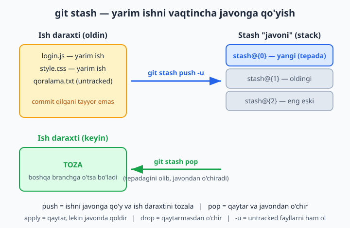
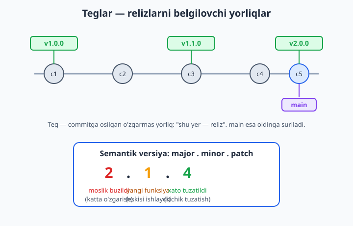
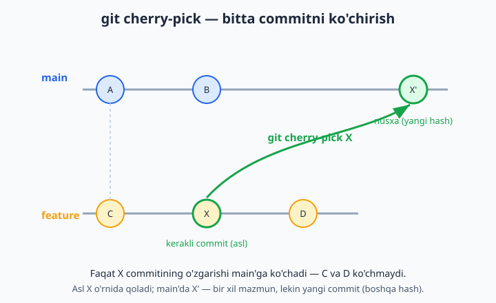

# 15 — Stash, tag va cherry-pick

[⬅️ Oldingi: 14 — Hamkorlik oqimlari: Git Flow, GitHub Flow](./14-hamkorlik-oqimlari.md) · [🏠 README](./README.md) · [Keyingi: 16 — Tarixni tozalash va reflog ➡️](./16-tarixni-tozalash-reflog.md)

> **Bu bobda:** kundalik ishda eng ko'p asqotadigan uchta "qutqaruvchi" buyruqni o'rganamiz. Birinchisi — `git stash`: yarim qolgan ishni commit qilmasdan, vaqtincha "javonga" qo'yib turish (shoshilinch boshqa branchga o'tish kerak bo'lganda). Ikkinchisi — `git tag`: reliz (chiqarilgan versiya) chiqqan commitni `v1.0.0` kabi yorliq bilan belgilash, lightweight va annotated (izohli) teg farqi, semantik versiyalash (major.minor.patch) va GitHub Releases. Uchinchisi — `git cherry-pick`: butun branchni emas, bittagina kerakli commitni boshqa branchga ko'chirish (xato joyga commit qilib qo'yganda yoki shoshilinch tuzatishni tezda yetkazganda). Har birini sinab ko'rilgan buyruqlar va konflikt holatlari bilan ko'rib chiqamiz.

---

## Muammo

Tasavvur qiling: siz do'kon sayti ustida ishlayotgan jamoada `savat-sahifa` degan branch'da ishlayapsiz. Savat sahifasi yarmiga keldi — ikkita fayl o'zgargan, lekin hali ishlamaydi, commit qilsa uyat bo'ladi. Shu payt boshliq qo'ng'iroq qiladi: "saytda narxlar noto'g'ri ko'rsatilyapti, mijozlar shikoyat qilyapti, hoziroq tuzat!".

Vaziyat tig'iz:

- Yarim ishingizni **commit qila olmaysiz** — hali tugamagan, buzuq holatda.
- Lekin boshqa branchga o'tish uchun ish daraxtingiz (working directory) **toza** bo'lishi kerak — aks holda Git o'zgarishlaringizni yangi branchga sudrab boradi yoki o'tkazmaydi.
- Tuzatishni qilgach, GitHub'da uni `v2.3.1` deb belgilash va e'lon qilish kerak.
- Tuzatishni ehtimol bir nechta branchga (`main`'ga ham, `relizga-tayyor` branch'ga ham) yetkazish kerak — lekin butun branchni emas, faqat o'sha bitta tuzatishni.

Bu uchta ehtiyoj — aynan `stash`, `tag` va `cherry-pick` hal qiladigan uchta klassik muammo. Birma-bir ko'ramiz.

## git stash — yarim ishni vaqtincha "javonga" qo'yish

`git stash` (stash — "yashirib qo'yish, zaxiraga olish") ish daraxtidagi barcha o'zgarishlarni oladi, ularni alohida bir joyga (xuddi javonga qo'ygandek) saqlaydi va ish daraxtingizni oxirgi commit holatiga qaytaradi — ya'ni **tozalaydi**. O'zgarishlar yo'qolmaydi, ular "javon"da turadi; xohlagan paytda qaytarib olasiz.



Sinab ko'ramiz. Bu buyruqlarni **loyihangizga emas**, alohida bo'sh papkada bajaring (har doimgidek):

```bash
git init -b main
echo "asl" > narx.js
git add narx.js
git commit -m "boshlang'ich commit"
```

Endi ishni "yarim" qilamiz — faylni o'zgartiramiz va yangi (untracked — Git hali bilmaydigan) fayl qo'shamiz:

```bash
echo "yarim ish" >> narx.js
echo "qoralama" > yangi.txt
git status --short
```

```text
 M narx.js
?? yangi.txt
```

`M` — o'zgargan (modified), `??` — Git bilmaydigan (untracked) fayl. Mana shu holatda boshqa branchga o'tib bo'lmaydi. Ishni javonga qo'yamiz:

```bash
git stash push -u -m "savat yarim ish"
```

```text
Saved working directory and index state On main: savat yarim ish
```

📌 `-m "..."` — stashga **izoh** beradi. Bir nechta stash bo'lganda qaysi biri nima ekanini izohsiz eslab bo'lmaydi — izohni doim yozish odat tusiga kirsin. `push` so'zini tushirib `git stash` deb ham yozsa bo'ladi (eski qisqa shakl), lekin `-m` izoh berish uchun `push` kerak.

Endi ish daraxti holatini ko'ring:

```bash
git status --short
```

Natija — **bo'sh**. Ish daraxti toza, xuddi hech narsa qilmagandek. Endi xotirjam boshqa branchga o'tib, shoshilinch tuzatishni qila olasiz.

### -u nima uchun kerak? (untracked fayllar tuzog'i)

📌 Oddiy `git stash` faqat Git **biladigan** (tracked) fayllarni javonga oladi. Yuqoridagi `yangi.txt` — untracked, demak oddiy stash uni **qoldirib ketadi** — u ish daraxtida osilib qoladi va daraxt toza bo'lmaydi. `-u` (yoki to'liq `--include-untracked`) — untracked fayllarni ham javonga oladi. Shuning uchun "hammasini tozalab tashla" desangiz, deyarli doim `-u` bilan ishlating.

💡 `.gitignore`'da yashiringan fayllarni ham olish uchun `-a` (`--all`) bor, lekin u kamdan-kam kerak va ehtiyot bo'lib ishlatiladi — odatda `-u` yetarli.

### Stashni qaytarib olish: pop va apply

Tuzatishni tugatib, savat ishingizga qaytdingiz. Endi javondagi ishni tiklaymiz:

```bash
git stash pop
```

```text
On branch main
Changes not staged for commit:
	modified:   narx.js
Untracked files:
	yangi.txt
Dropped refs/stash@{0} (a1b2c3d4e5f6...)
```

`narx.js` o'zgargani ham, `yangi.txt` ham qaytib keldi. `pop` ikki ishni qiladi: o'zgarishlarni **qaytaradi** va javondan o'sha stashni **o'chiradi** (oxirida "Dropped..." — o'chirildi).

📌 `pop` va `apply` farqi:

| Buyruq | O'zgarishni qaytaradimi? | Javondan o'chiradimi? |
|---|---|---|
| `git stash pop` | ✅ ha | ✅ ha (javon tozalanadi) |
| `git stash apply` | ✅ ha | ❌ yo'q (javonda qoladi) |

💡 `apply` qachon kerak? Bitta stashni bir nechta branchga qo'llamoqchi bo'lsangiz: `apply` bilan tiklang, javonda saqlanadi, keyin boshqa branchda yana `apply` qilasiz. Ishingiz bitgach `git stash drop` bilan qo'lda o'chirasiz.

### Bir nechta stash bilan ishlash

Stash — bu "stack" (uyum): yangi qo'ygan tepada (`stash@{0}`), oldingilari pastga suriladi (`stash@{1}`, `stash@{2}` ...). Royxatni ko'rish:

```bash
git stash list
```

```text
stash@{0}: On main: savat yarim ish
stash@{1}: On savat-sahifa: rang tajribasi
```

Aniq bir stashni tanlab ishlash uchun nomini yozasiz:

```bash
git stash apply stash@{1}      # 1-raqamlini qaytar (javonda qoldirib)
git stash pop stash@{1}        # 1-raqamlini qaytar va o'chir
git stash drop stash@{1}       # qaytarmasdan shunchaki o'chir
git stash show -p stash@{0}    # ichida nima o'zgarganini ko'rish (diff)
```

📌 `git stash clear` — **butun javonni** birdan tozalaydi (hamma stash o'chadi, qaytarib bo'lmaydi). Ehtiyot bo'ling: bu buyruqni adashib ishlatib, kerakli ishni yo'qotish oson. Aniq bittasini o'chirish kerak bo'lsa, `clear` emas, `drop` ishlating.

💡 Stash branchga bog'lanmagan — `main`'da stash qilib, `savat-sahifa`'da `pop` qilsangiz ham ishlaydi. Lekin o'zgargan fayllar boshqa branchda boshqacha bo'lsa, konflikt chiqishi mumkin (konfliktni hal qilishni 8-bobda ko'rgan edik — bu yerda ham xuddi shunday markerlar bilan ishlanadi).

## git tag — relizni belgilash

Tuzatish tayyor, sayt yana ishlayapti. Endi bu holatni "rasman e'lon qilingan versiya" deb belgilash kerak — ertaga "qaysi commit o'sha tuzatilgan versiya edi?" degan savol tug'ilmasin. **Teg (tag)** — muayyan commitga osilgan o'zgarmas yorliq. Branch'dan farqi: branch yangi commit qo'shilganda oldinga **suriladi**, teg esa bir marta osilsa, **o'sha joyda abadiy qoladi**.



### Lightweight vs annotated teg

Tegning ikki turi bor:

**1. Lightweight (yengil) teg** — shunchaki commitga osilgan nom, qo'shimcha ma'lumotsiz:

```bash
git tag v0.9.0
```

**2. Annotated (izohli) teg** — `-a` (annotated) va `-m` (xabar) bilan. Bu to'laqonli obyekt: kim qo'ygani, qachon va izoh bilan saqlanadi:

```bash
git tag -a v1.0.0 -m "Birinchi barqaror reliz"
```

Farqni o'z ko'zingiz bilan ko'rasiz:

```bash
git cat-file -t v0.9.0     # natija: commit
git cat-file -t v1.0.0     # natija: tag
```

Lightweight teg shunchaki commitga ishora qiladi (`commit`), annotated teg esa alohida `tag` obyekti bo'lib, ichida izoh va sana saqlanadi.

📌 **Qoida:** relizlar uchun doim **annotated** (`-a -m`) ishlating. Sababi: kim, qachon, nima uchun bu versiyani chiqarganini teg ichida saqlaydi — bu reliz tarixi uchun muhim. Lightweight teg — vaqtinchalik, shaxsiy belgilar uchun (masalan "shu yerga keyin qaytaman").

Annotated teg ma'lumotini ko'rish:

```bash
git show v1.0.0
```

```text
tag v1.0.0
Tagger: Oqil Imomnazarov <...>
Date:   ...

Birinchi barqaror reliz

commit a1b2c3d...
    ...
```

### Avvalgi commitga teg qo'yish

Teg qo'yishni unutib, ustiga yana commit qilib qo'ygan bo'lsangiz ham mayli — teg orqaga qarab ham qo'yiladi. Commit hashini yoki nisbiy ishorani (`HEAD~2` — ikki orqadagi commit) yozasiz:

```bash
git tag -a v0.5.0 a1b2c3d -m "alfa versiya"
git tag -a v0.5.0 HEAD~2 -m "alfa versiya"
```

Teglar royxatini izohlari bilan ko'rish:

```bash
git tag -n1
```

```text
v0.5.0          alfa versiya
v0.9.0          v0.9.0
v1.0.0          Birinchi barqaror reliz
```

### Semantik versiyalash (semver)

Versiya raqamlarini boshi berk ko'chada o'ylab topmaslik uchun butun dunyo **semantic versioning** (semver) qoidasiga amal qiladi: `vMAJOR.MINOR.PATCH`, masalan `v2.1.4`.

| Qism | Qachon oshadi | Misol |
|---|---|---|
| **MAJOR** | eski kod bilan **moslik buzilsa** (katta o'zgarish) | `1.x.x` → `2.0.0` |
| **MINOR** | yangi funksiya qo'shilsa, lekin eskisi **ishlayversa** | `2.1.x` → `2.2.0` |
| **PATCH** | faqat xato tuzatilsa | `2.2.3` → `2.2.4` |

💡 Qoida: yuqoriroq qism oshganda, undan past qismlar **nolga qaytadi**. `1.4.2`'da katta o'zgarish bo'lsa → `2.0.0` (minor ham, patch ham nolga tushadi). Bizning hikoyamizdagi shoshilinch narx tuzatishi — bu PATCH: `v2.3.0` → `v2.3.1`.

### Teglarni GitHub'ga jo'natish (push)

📌 **Eng ko'p uchraydigan tuzoq:** oddiy `git push` teglarni **jo'natmaydi**! Teglar maxsus jo'natiladi. Bitta tegni nomi bilan:

```bash
git push origin v2.3.1
```

Yoki barcha lokal teglarni birdan:

```bash
git push origin --tags
```

💡 `--tags` qulay, lekin u **hamma** lokal tegingizni jo'natadi — shaxsiy/vaqtinchalik lightweight teglaringiz ham ketib qoladi. Faqat reliz teglarini jo'natayotganingizga ishonch hosil qilish uchun ko'pincha har bir relizni nomi bilan alohida push qilish toza yo'l.

Teg jo'natilgach, GitHub avtomatik ravishda **Releases** bo'limida uni ko'rsatadi. GitHub'da reliz sahifasiga o'tib, "Draft a new release" → tegni tanlab (yoki yangi yaratib), reliz izohi (release notes — nima o'zgargani) va kerak bo'lsa yuklab olinadigan fayllar (masalan tayyor `.zip`, `.exe`) qo'shasiz. Foydalanuvchilar aynan shu sahifadan versiyalarni ko'radi va yuklab oladi.

📌 Tegni xato qo'ygan bo'lsangiz: lokalda `git tag -d v2.3.1` bilan o'chiriladi. GitHub'dan ham o'chirish uchun: `git push origin --delete v2.3.1`. Lekin boshqalar allaqachon yuklab olgan tegni o'zgartirmang — yangi versiya chiqaring (masalan `v2.3.2`).

## git cherry-pick — bitta commitni ko'chirish

Oxirgi muammo: tuzatishingiz `savat-sahifa` branch'ida turibdi (shoshilinch tuzatishni o'sha yerda qilib yuborgan bo'lsangiz), lekin u `main`'ga ham kerak — hozir, butun yarim savat ishini kutmasdan. Yoki teskari: adashib `main`'ga commit qilib, keyin "voy, bu boshqa branchga tegishli edi" deb tushundingiz.

`git cherry-pick` (so'zma-so'z "gilosni terib olish") aynan shu uchun: butun branchni merge qilmasdan, **bittagina kerakli commitni** joriy branchga ko'chiradi.



Sinab ko'ramiz. Bo'sh papkada:

```bash
git init -b main
echo "1" > a.txt && git add a.txt && git commit -m "1-commit"
echo "2" > b.txt && git add b.txt && git commit -m "2-commit"

git switch -c hotfix              # yangi branch ochib, unga o'tamiz
echo "tuzatildi" > fix.txt
git add fix.txt
git commit -m "muhim tuzatish"
```

Endi `hotfix`'dagi tuzatishni `main`'ga ko'chiramiz. Avval ko'chiriladigan commit hashini eslab qolamiz, keyin `main`'ga o'tamiz:

```bash
git log --oneline -1          # tuzatish commiti hashi, masalan a1b2c3d
git switch main
git cherry-pick a1b2c3d
```

```text
[main e4f5g6h] muhim tuzatish
 1 file changed, 1 insertion(+)
 create mode 100644 fix.txt
```

Endi `main`'da `fix.txt` paydo bo'ldi — `hotfix`'dagi boshqa o'zgarishlarsiz, faqat o'sha bitta commit ko'chdi.

📌 **Muhim nuqta:** cherry-pick commitni **ko'chirmaydi, nusxalaydi**. Asl commit `hotfix`'da o'z joyida qoladi; `main`'da esa **yangi hash bilan yangi commit** paydo bo'ladi (mazmun bir xil, lekin bu boshqa commit). Shuning uchun rasmda asl `X` va nusxa `X'` deb belgilangan.

💡 Bir nechta commitni ketma-ket ko'chirish ham mumkin:

```bash
git cherry-pick a1b2c3d e4f5g6h           # ikkita aniq commit
git cherry-pick a1b2c3d^..e4f5g6h         # oraliq (diapazon)
```

### Cherry-pick konflikti

Agar ko'chirilayotgan commit o'zgartirgan joyni joriy branch ham o'zgartirgan bo'lsa — **konflikt** chiqadi (xuddi merge'dagidek). Buni ko'rib chiqaylik:

```bash
git init -b main
echo "narx 0" > narx.txt && git add narx.txt && git commit -m "boshlang'ich"

git switch -c branch-a
echo "narx 100" > narx.txt && git add narx.txt && git commit -m "narx 100"

git switch main
echo "narx 200" > narx.txt && git add narx.txt && git commit -m "narx 200"
```

Ikki branch ham `narx.txt`ning **o'sha satrini** boshqacha o'zgartirdi. Endi `branch-a`'dagi commitni `main`'ga olib o'tishga urinamiz:

```bash
git cherry-pick branch-a
```

```text
Auto-merging narx.txt
CONFLICT (content): Merge conflict in narx.txt
error: could not apply b7051db... narx 100
hint: ... "git add", then run "git cherry-pick --continue".
hint: ... skip this commit with "git cherry-pick --skip".
hint: ... abort with "git cherry-pick --abort".
```

`narx.txt`ni ochsangiz, 8-bobdan tanish konflikt markerlarini ko'rasiz:

```text
<<<<<<< HEAD
narx 200
=======
narx 100
>>>>>>> b7051db (narx 100)
```

Hal qilish — xuddi merge konfliktidagidek: faylni qo'lda kerakli holatga tahrirlab (markerlarni olib tashlab), `add` qilib, keyin **`--continue`** bilan davom ettirasiz:

```bash
# narx.txt ni tahrirlab, kerakli variantni qoldiring, markerlarni o'chiring
git add narx.txt
git cherry-pick --continue
```

Cherry-pick'da uchta chiqish yo'li bor:

| Buyruq | Nima qiladi |
|---|---|
| `git cherry-pick --continue` | konfliktni hal qilgach davom etadi |
| `git cherry-pick --abort` | hammasini bekor qilib, boshlang'ich holatga qaytaradi |
| `git cherry-pick --skip` | shu commitni tashlab, keyingisiga o'tadi (bir nechta pick'da) |

📌 Konflikt chiqsa vahima qilmang — `git status` doim qaysi faylda konflikt borligini va keyingi qadamni aytib turadi. Chalkashib ketsangiz, `--abort` hech narsani buzmasdan boshlang'ich holatga qaytaradi.

💡 **Cherry-pick'ni qachon ishlatmaslik kerak?** Agar butun branchni olib o'tmoqchi bo'lsangiz — bu merge yoki rebase ishi, cherry-pick emas. Cherry-pick — aynan **bir-ikki tanlangan** commit uchun. Ko'p commitni cherry-pick qilsangiz, asl va nusxa orasida chalkashlik (ikki xil hashda bir xil o'zgarish) kelib chiqadi.

## 15-bob mashqlari

> Quyidagi mashqlarni **alohida sinov papkasida** bajaring (loyihangizga emas). Har biri uchun avval kichik repozitoriy yarating va sinab ko'ring.

1. Bo'sh papkada repo yarating, bitta fayl commit qiling. Faylni o'zgartiring va `git stash` bilan javonga qo'ying. `git status` toza bo'lganini tasdiqlang, keyin `git stash pop` bilan qaytaring.
2. Bitta tracked faylni o'zgartiring va yangi (untracked) fayl qo'shing. Oddiy `git stash` qilib ko'ring — `git status`'da untracked fayl qolib ketganiga e'tibor bering.
3. 2-mashqdagi holatni qaytadan yarating, lekin endi `git stash -u` bilan stash qiling. Bu safar ish daraxti to'liq tozalanganini tasdiqlang.
4. Stash qilgan ishni `git stash pop` o'rniga `git stash apply` bilan qaytaring. `git stash list`'da stash hali javonda turganini ko'ring, so'ng uni `git stash drop` bilan o'chiring.
5. Ketma-ket uchta turli o'zgarishni uchta alohida stashga qo'ying. `git stash list` bilan uchalasini ko'ring va izohlari (`-m`) qaysi qaysiligini farqlang.
6. 5-mashqdagi stashlardan `stash@{1}` ni `git stash show -p stash@{1}` bilan ko'ring (ichida nima o'zgargani), keyin aynan o'sha stashni nomi bilan `pop` qiling.
7. `main`'da yarim ishni stash qiling, yangi branch (`git switch -c sinov`) oching va o'sha branchda `git stash pop` qiling. Stash branchga bog'lanmaganini, ishingiz yangi branchga tushganini ko'ring.
8. Repoda 2-3 commit yarating. Oxirgi commitga **lightweight** teg qo'ying (`git tag v0.1.0`). `git cat-file -t v0.1.0` natijasi `commit` ekanini tasdiqlang.
9. Xuddi shu commitga **annotated** teg qo'ying (`git tag -a v1.0.0 -m "..."`). `git cat-file -t v1.0.0` natijasi `tag` ekanini va `git show v1.0.0`'da izoh ko'rinishini tekshiring.
10. `git tag -n1` bilan barcha teglarni izohlari bilan birga royxat qilib chiqing.
11. Teg qo'yishni unutgan eski commitga (`HEAD~2`) keyinchalik annotated teg qo'ying. `git log --oneline` bilan teg to'g'ri commitga osilganini tasdiqlang.
12. Versiyalarni semver bo'yicha belgilang: bitta xato tuzatib `v1.0.1` (patch), keyin yangi funksiya qo'shib `v1.1.0` (minor), keyin katta o'zgarish kiritib `v2.0.0` (major) teglarini ketma-ket qo'ying.
13. Lokalda xato qo'yilgan tegni `git tag -d <nom>` bilan o'chiring va to'g'ri nom bilan qayta qo'ying.
14. GitHub'da test repo yarating, uni clone qiling. Bir nechta commit va teg qo'ying. `git push origin --tags` bilan teglarni jo'nating va GitHub'ning Releases bo'limida paydo bo'lganini ko'ring.
15. 14-mashqdagi teglardan birini GitHub'da to'liq **Release**'ga aylantiring: "Draft a new release", tegni tanlang, reliz izohi (release notes) yozing va e'lon qiling.
16. Ikki branch (`main` va `hotfix`) yarating. `hotfix`'da bitta tuzatish commit qiling. `main`'ga o'tib, o'sha commitni `git cherry-pick` bilan ko'chiring. `main`'da fayl paydo bo'lganini tasdiqlang.
17. Cherry-pick qilgan commitning hashini asl `hotfix`'dagi hash bilan solishtiring — ular **boshqacha** ekaniga e'tibor bering (nusxa, ko'chirma emas).
18. Bitta branchda ikkita commit qiling. `main`'ga o'tib, **ikkalasini** birdan cherry-pick qiling (`git cherry-pick <h1> <h2>`).
19. Ataylab konflikt yarating: ikki branchda `narx.txt`ning bir satrini har xil o'zgartiring. Bir branchdagi commitni ikkinchisiga cherry-pick qilib, konflikt markerlarini ko'ring, faylni hal qiling, `git add` + `git cherry-pick --continue` bilan yakunlang.
20. 19-mashqdagi konfliktni qaytadan yarating, lekin bu safar hal qilish o'rniga `git cherry-pick --abort` bilan bekor qiling. Repo boshlang'ich holatiga, hech bir o'zgarishsiz qaytganini tasdiqlang.
