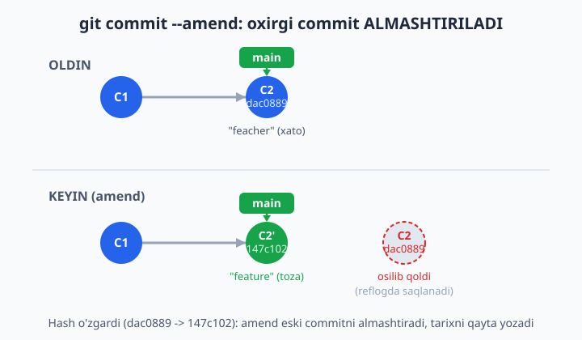
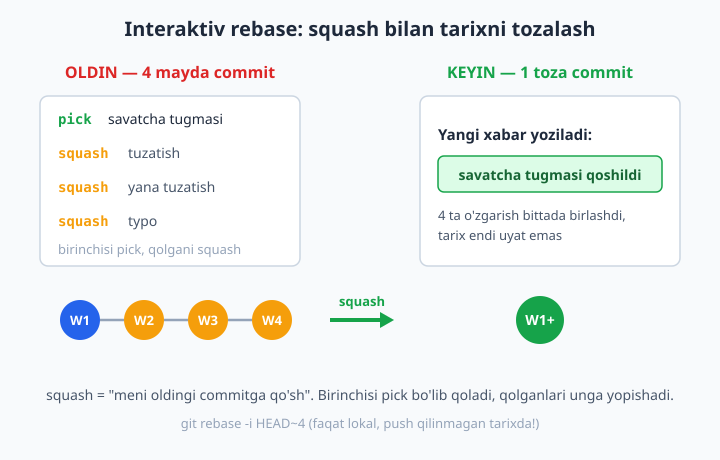
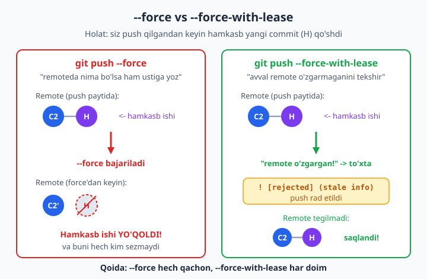
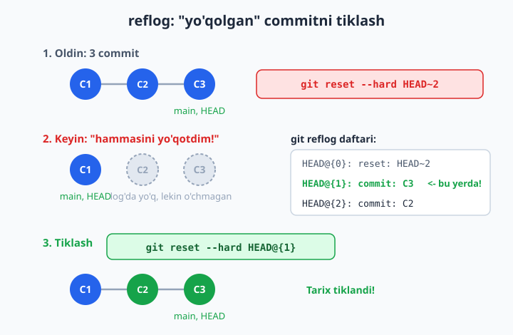

# 16 — Tarixni tozalash va reflog

[⬅️ Oldingi: 15 — Stash, tag va cherry-pick](./15-stash-tag-cherry-pick.md) · [🏠 README](./README.md) · [Keyingi: 17 — Xatoni qidirish: bisect, blame, grep ➡️](./17-bisect-blame.md)

> **Bu bobda:** ikki bir-biriga qarama-qarshidek tuyulgan, aslida bir tanganing ikki tomoni bo'lgan ko'nikmani o'rganamiz: tarixni **chiroyli** qilishni va "hammasini yo'qotdim!" holatidan **qutqarishni**. Oxirgi commit'ni `git commit --amend` bilan chuqur tuzatamiz; interaktiv rebase orqali tarixni qayta yozamiz — bir nechta mayda commit'ni bittaga birlashtirish (squash), xabarni o'zgartirish (reword), tartibni almashtirish (reorder) va keraksiz commit'ni o'chirish (drop); push qilingan tarixni qayta yozishning xavfini va nega `git push --force-with-lease` (`--force`'dan ko'ra xavfsiz "ijaraga olib" majburlash) ishlatish kerakligini ko'ramiz; `git reflog` (HEAD harakatlari jurnali) bilan o'chgan commit va branch'ni — hatto `reset --hard`dan keyin ham — tiklaymiz; `git fsck` bilan "osilib qolgan" commit'larni qidiramiz; va tarixdan sirni (parol, token) o'chirish g'oyasi bilan tanishamiz. Eng muhimi — **tarixni tozalashning oltin qoidasi**ni yodda mahkam o'rnatamiz.

---

## Muammo

Tasavvur qiling: jamoa bilan kichik veb-do'kon ustida ishlayapsiz. O'zingizning `feature/savatcha` branch'ingizda bir kun davomida ishladingiz va commit tarixingiz mana shunday ko'rinishga keldi:

```text
a1b2c3d savatcha tugmasi
b2c3d4e tuzatish
c3d4e5f yana tuzatish
d4e5f6a typo
e5f6a7b ishladi nihoyat!!!
f6a7b8c debug print qoshdim
```

Ish ishlaydi, lekin bu tarix — uyat. "yana tuzatish", "typo", "ishladi nihoyat!!!" — bularni hech kim ko'rmasligi kerak. Ertaga buni Pull Request qilib jamoaga yuborasiz va katta dasturchi (senior) shu olti qatorni ko'rib bosh chayqaydi. Aslida bu olti commit bitta mantiqiy ishni anglatadi: "savatcha tugmasi qo'shildi". Uni **bitta toza commit**ga aylantirish kerak.

Ikkinchi muammo — buning teskarisi. Tarixni "tozalayman" deb `git reset --hard` yozdingiz-u, kechagi muhim ishingiz ko'z oldingizda yo'qoldi. Terminal jim. `git log` bo'm-bo'sh. Yuragingiz orziqib ketdi: "Bir kunlik ishim ketdi!". 

Yaxshi xabar: Git deyarli hech narsani darrov o'chirmaydi. U sizning **har bir harakatingizni** maxfiy daftarchada yozib boradi — bu **reflog**. Bu bob ikki narsani o'rgatadi: tarixni qanday qilib professional darajada **toza** qilish, va xato qilganda uni qanday qilib **orqaga qaytarish**. Ikkalasi ham bitta tushunchaga tayanadi: Git'da commit'lar darrov yo'qolmaydi.

📌 6-bobda biz `reset`, `revert` va `amend` bilan yuzaki tanishgan edik. Bu bobda ularning chuqur, kundalik amaliyotini va eng kuchli qutqaruvchi vosita — reflog'ni o'rganamiz. 6-bobni eslamasangiz, bir ko'z yugurtirib oling.

## commit --amend — oxirgi commit'ni almashtirish (chuqur)

`git commit --amend` — eng ko'p ishlatiladigan "tozalash" vositasi. U oxirgi commit'ni **yangisi bilan almashtiradi**. Uchta asosiy holatda kerak bo'ladi.

**1-holat: xabarni tuzatish.** Commit qildingiz, lekin xabarda xato bor:

```bash
git commit -m "C2: feacher qoshildi"     # "feature" deb yozmoqchi edingiz
git commit --amend -m "C2: feature qoshildi"
```

Natijada `git log` da yangi commit qo'shilmaydi — oxirgi commit'ning o'zi yangilanadi:

```text
[main dac0889] C2: feature qoshildi
 1 file changed, 1 insertion(+)
```

**2-holat: unutilgan faylni qo'shish.** Commit qildingiz, lekin bitta faylni `add` qilishni unutdingiz:

```bash
git add config.txt                # unutilgan faylni qo'shamiz
git commit --amend --no-edit      # oxirgi commitga singdiramiz, xabar tegmaydi
```

📌 `--no-edit` — "matn muharririni ochma, eski xabarni qoldir" degani. Bu juda qulay: faqat fayl qo'shiladi.

Natijani tekshiramiz:

```bash
git show --stat HEAD
```

```text
[main 147c102] C2: feature qoshildi
 app.txt    | 1 +
 config.txt | 1 +
 2 files changed, 2 insertions(+)
```

Ikkala fayl ham bitta commit'da! Yangi "config qoshildi" commit'i yaratilmadi.

**3-holat: sodir bo'lgan o'zgarishni qo'shish.** Kod yozib, `add` qildingiz, keyin "buni alohida commit qilmay, oldingisiga qo'shay" dedingiz:

```bash
git add .
git commit --amend --no-edit
```

⚠️ **Eng muhim ogohlantirish:** `--amend` oxirgi commit'ni **almashtiradi** — ya'ni yangi hash yaratadi. Sinab ko'ramiz:

```bash
git log --oneline -1     # amenddan OLDIN
# dac0889 C2: feature qoshildi
# ... amend qilamiz ...
git log --oneline -1     # amenddan KEYIN
# 147c102 C2: feature qoshildi
```

Xabar bir xil, lekin hash o'zgardi: `dac0889` → `147c102`. **Demak, amend ham tarixni qayta yozishdir.** Bu nima uchun muhimligini hozir tushunamiz.



📌 **Oltin qoida (birinchi marta):** `--amend` ni faqat **push qilinmagan** oxirgi commit'da ishlating. Agar commit allaqachon `push` qilingan bo'lsa — amend qilmang, chunki hash o'zgaradi va remote (masofadagi server) bilan to'qnashuv chiqadi. Bu qoidaning to'liq shaklini bob oxirida ko'ramiz.

💡 Misollardagi `dac0889`, `147c102` kabi hash'lar — shunchaki namuna. Sizning kompyuteringizda har bir commit'ning hash'i boshqacha bo'ladi, chunki u commit vaqti, muallifi va mazmuniga qarab hisoblanadi. Shu sababli buyruqlarda hash'ni qo'lda ko'chirgandan ko'ra `HEAD`, `HEAD~1` kabi nisbiy nomlardan foydalanish ishonchliroq.

## Interaktiv rebase — tarixni qayta yozish ustaxonasi

`--amend` faqat **oxirgi** commit bilan ishlaydi. Bobning boshidagi olti commit'li chalkash tarix-chi? Bir nechta commit'ni birdaniga tahrirlash uchun **interaktiv rebase** kerak — Git'ning eng kuchli vositasi.

9-bobda oddiy rebase'ni ko'rgan edingiz: u commit'larni boshqa asosga "ko'chirar" edi. Interaktiv rebase esa undan ham kuchliroq — u sizga commit'lar ro'yxatini muharrirda ochib beradi va siz har bir commit bilan nima qilishni belgilaysiz.

```bash
git rebase -i HEAD~4
```

Bu yerda `HEAD~4` — "oxirgi 4 commit'ni tahrirlayman" degani. Git matn muharririni ochadi va shunday ro'yxat ko'rsatadi:

```text
pick a1b2c3d savatcha tugmasi
pick b2c3d4e tuzatish
pick c3d4e5f yana tuzatish
pick d4e5f6a typo

# Rebase ... onto ...
# Commands:
# p, pick <commit>   = commitni o'z holicha ishlatish
# r, reword <commit> = commitni ishlatish, lekin xabarni o'zgartirish
# s, squash <commit> = commitni oldingisiga BIRLASHTIRISH (xabarlar qo'shiladi)
# f, fixup <commit>  = squash kabi, lekin bu commit xabarini TASHLAB yuboradi
# d, drop <commit>   = commitni o'chirish
# ... (qatorlarni o'rin almashtirsangiz — commitlar tartibi o'zgaradi)
```

📌 Diqqat: commit'lar bu yerda **eskidan yangiga** (tepadan pastga) tartiblangan — bu `git log`ning teskarisi. Yuqoridagi commit eng eski.

Endi har bir qatordagi `pick` so'zini xohlagan amalga almashtirasiz. Muharrirni saqlab yopganingizda, Git ko'rsatmalaringizni yuqoridan pastga bajaradi. Quyida har bir amalni alohida ko'ramiz.

📌 9-bobdan eslatma: agar rebase yarmida konflikt chiqsa, uni hal qilib `git rebase --continue` qilasiz; butun amaldan voz kechmoqchi bo'lsangiz, istalgan paytda `git rebase --abort` — hammasi rebase boshlanishidan oldingi holatga qaytadi. Bu — sizning "xavfsizlik tugmangiz".

### squash — mayda commit'larni bittaga birlashtirish

Bobning boshidagi muammoga qaytaylik. Olti mayda commit'ni bittaga birlashtirmoqchimiz. To'rtta commit bilan misol qilaylik:

```text
WIP 1
WIP 2
WIP 3
WIP 4
```

`git rebase -i HEAD~4` ochilganda, **birinchisini `pick` qoldirib, qolganlarini `squash`** qilamiz:

```text
pick   f0fba64 WIP 1
squash b660e2a WIP 2
squash 24b6c04 WIP 3
squash 9cc1bc8 WIP 4
```

📌 Mantiq: `squash` "**meni oldingi qatorga qo'sh**" degani. Shuning uchun eng yuqoridagi (eng eski) commit `pick` bo'lib qoladi — qolganlari unga yopishadi. Birinchi qatorni squash qilib bo'lmaydi, chunki uning "oldingisi" yo'q.

Saqlab yopgach, Git yangi, birlashgan commit uchun **xabarni so'raydi** — to'rtala eski xabarni ko'rsatib, sizga yangi, toza xabar yozish imkonini beradi. Masalan: `savatcha tugmasi qoshildi`. Natija:

```bash
git log --oneline
```

```text
ea653df savatcha tugmasi qoshildi
f0fba64 WIP 1 oldingi commit
```

To'rtta mayda commit o'rniga — bitta toza commit. Tarix endi uyat emas.



💡 **`fixup` vs `squash`:** `squash` har bir commit xabarini saqlab, sizga ularni tahrirlash imkonini beradi. `fixup` esa xuddi shunday birlashtiradi, lekin qo'shilayotgan commit'ning xabarini **butunlay tashlab yuboradi** — agar qo'shimcha commit'lar "tuzatish", "typo" kabi keraksiz xabarlarga ega bo'lsa, `fixup` qulayroq.

### reword — commit xabarini o'zgartirish

Faqat bitta commit'ning xabarini tuzatmoqchimisiz, lekin u oxirgi emas (shuning uchun `--amend` ishlamaydi)? `reword` ishlating:

```text
pick   297ae4f A funksiya
reword 0b2ba9d B funksiya       # bu commit xabarini o'zgartiramiz
pick   ea653df C funksiya
```

Saqlab yopgach, Git faqat `reword` belgilangan commit uchun muharrirni ochib, yangi xabar so'raydi. Qolgan commit'larga tegmaydi.

### reorder — commit'lar tartibini almashtirish

Muharrirdagi qatorlarning **o'rnini almashtiring** — Git commit'larni shu yangi tartibda qayta quradi:

```text
pick 9cd89fc C3 good      # bularni
pick 297ae4f C1 good      # o'rin almashtirdik
```

⚠️ Diqqat: agar commit'lar bir-biriga bog'liq bo'lsa (masalan, biri ikkinchisi yaratgan faylni o'zgartirsa), tartibni almashtirish **konflikt** keltirib chiqarishi mumkin. Bunday holda Git to'xtaydi, siz hal qilib `git rebase --continue` qilasiz. Mustaqil commit'larda (turli fayllar) konflikt bo'lmaydi.

### drop — commit'ni butunlay o'chirish

Tarixda keraksiz commit bormi (masalan, "debug print qoshdim")? Uning oldidagi `pick`ni `drop`ga almashtiring (yoki qatorni butunlay o'chiring):

```text
pick a.txt-commit  C1 good
drop debug-commit  C2 BAD debug print
pick c.txt-commit  C3 good
```

Saqlangach, "C2 BAD" commit'i va u kiritgan o'zgarishlar tarixdan butunlay yo'qoladi:

```text
9cd89fc C3 good
297ae4f C1 good
8ec3f90 C0 baza
```

📌 Mustaqil fayllarda `drop` toza ishlaydi. Lekin agar o'chirilayotgan commit keyingi commit'lar tayangan o'zgarishni kiritgan bo'lsa, konflikt chiqadi — bu mantiqan to'g'ri: "poydevorni olib tashlasangiz, ustidagi qavat qoqiladi".

### Avtomatik usul: fixup va autosquash

Professional dasturchilar tez-tez ishlatadigan chiroyli qolip: kod yozib turib, "voy, bundan oldingi A commit'ida xato bor edi" deb sezsangiz, o'sha tuzatishni **darrov A commit'iga belgilab** qo'yishingiz mumkin:

```bash
git add .
git commit --fixup HEAD~1       # "bu tuzatish HEAD~1 commitiga tegishli"
```

Bu maxsus commit yaratadi, uning xabari maqsadli commit subjektining oldiga `fixup! ` qo'shilgan ko'rinishi bo'ladi — agar `HEAD~1` ning subjekti "A funksiya" bo'lsa, yangi commit xabari aynan `fixup! A funksiya` bo'ladi (Git maqsad subjektini **so'zma-so'z** ko'chiradi). Keyinroq, bitta buyruq bilan Git hamma `fixup!` commit'larni o'z joylariga avtomatik singdiradi:

```bash
git rebase -i --autosquash HEAD~3
```

`--autosquash` flagi tufayli Git muharrirni allaqachon **to'g'ri tartiblangan** holda ochadi — `fixup!` commit o'zi tegishli commit ostiga avtomatik joylashadi. Siz faqat saqlab yopasiz, qolganini Git qiladi. Natijada `fixup!` commit'i A commit'iga singib ketadi.

💡 Bu qolip — `git config --global rebase.autosquash true` bilan doimiy yoqib qo'yilsa, har safar `--autosquash` yozish shart bo'lmaydi.

## XAVF: push qilingan tarixni qayta yozish

Hozirgacha hamma narsa **lokal** (faqat sizning kompyuteringizda) edi. Endi eng nozik mavzuga keldik. Yuqoridagi amallarning hammasi — amend, squash, drop, reorder — **commit hash'larini o'zgartiradi**. Lokal branch'da bu xavfsiz. Lekin agar siz o'sha commit'larni allaqachon `push` qilgan bo'lsangiz-chi?

Muammo shunday: siz tarixni qayta yozdingiz, endi sizdagi commit'lar va remotedagi commit'lar **boshqa hash'larga ega**. Oddiy `git push` buni rad etadi:

```bash
git push origin main
```

```text
 ! [rejected]        main -> main (non-fast-forward)
hint: Updates were rejected because the tip of your current branch is behind
```

Git sizni ehtiyot qilyapti: "Sizning tarixingiz remotenikidan farq qiladi, oddiy push bilan ustiga yozib bo'lmaydi". Bu yerda ikki yo'l bor.

### Nega oddiy --force XAVFLI

Birinchi (yomon) yo'l — majburlash:

```bash
git push --force origin main      # ❌ XAVFLI
```

`--force` Git'ga aytadi: "Menga remoteda nima borligi qiziq emas, **mening tarixim bilan ustiga yoz**". Muammo shundaki, ehtimol siz push qilgandan keyin **hamkasbingiz** o'sha branch'ga yangi commit qo'shgandir. `--force` esa uning ishini **so'ramasdan o'chirib tashlaydi**. Hamkasbingizning bir kunlik ishi yo'qoladi, va buni hech kim sezmaydi.

### --force-with-lease — xavfsiz majburlash

To'g'ri yo'l — `--force-with-lease` ("ijaraga olib majburlash"):

```bash
git push --force-with-lease origin main      # ✅ xavfsiz
```

Bu buyruq aqlliroq. U remote'ga majburan yozishdan **oldin** tekshiradi: "Men oxirgi marta ko'rgan holatdan beri remote o'zgarmaganmi?". 

- Agar remote o'zgarmagan bo'lsa (hamkasb hech narsa qo'shmagan) — push o'tadi:
  ```text
  + bae3ef1...25ece20 main -> main (forced update)
  ```
- Agar remote o'zgargan bo'lsa (hamkasb commit qo'shgan) — push **rad etiladi**:
  ```text
   ! [rejected]        main -> main (stale info)
  ```

"stale info" (eskirgan ma'lumot) — Git sizga aytyapti: "To'xtang! Remoteda siz bilmagan yangi narsa bor. Avval `git fetch` qiling, hamkasbingiz nima qo'shganini ko'ring, keyin qaror qabul qiling". Mana shu **bir lahzalik to'xtatish** hamkasbingizning ishini saqlab qoladi.



💡 **Yodlash qoidasi:** **"`--force` hech qachon, `--force-with-lease` har doim"**. Ko'p jamoalar `--force`ni butunlay taqiqlaydi. Hatto siz `git config --global alias.pushf "push --force-with-lease"` deb qisqartma yasab, `--force`ni unutib yuborishingiz mumkin.

📌 Eng yaxshisi — **push qilingan branch tarixini umuman qayta yozmaslik**. Tarixni faqat hali hech kim ko'rmagan, lokal yoki shaxsiy branch'da tozalang. Buni quyida "oltin qoida" sifatida rasmiylashtiramiz.

## Oltin qoida: qachon tarixni qayta yozish mumkin?

Bu — bobning eng muhim jumlasi. Yodlab oling:

> **Tarixni faqat o'zingizdan boshqa hech kim ko'rmagan commit'larda qayta yozing.**

Amalda bu shunday bo'linadi:

| Holat | Tarixni qayta yozish (amend/rebase/squash) | Nega |
|---|---|---|
| Lokal, hali push qilinmagan | ✅ Bemalol | Tarix faqat sizniki, hech kimga xalal bermaydi |
| O'zingizning shaxsiy feature branch'ingiz (boshqa hech kim ishlamaydi) | ✅ Mumkin (force-with-lease bilan) | Faqat siz tayanasiz |
| Umumiy branch (`main`, `develop`) — boshqalar tayanadi | ❌ Hech qachon | Hamma tarixingizni buzasiz |
| Boshqalar bilan birga ishlayotgan feature branch | ❌ Avval kelishing | Boshqalarning ishi to'qnashadi |

❌ **Eng katta xato:** `main` yoki jamoa tayanadigan branch tarixini qayta yozib, `--force` qilish. Hamma jamoaning lokal nusxasi remotedan farq qila boshlaydi va keyingi `pull` da dahshatli chalkashlik chiqadi.

✅ **To'g'ri amaliyot:** ishingizni shaxsiy branch'da toza-pokiza qiling (squash, reword), keyin uni Pull Request orqali `main`ga **merge** qiling. Merge'dan keyin `main` tarixiga hech qachon tegmang.

## reflog — "hammasini yo'qotdim!" dan qutqaruvchi

Endi bobning ikkinchi yarmiga — **qutqaruvga** o'tamiz. Yuqoridagi amallar (`reset --hard`, `rebase`, `--force`) xato qilingan bo'lsa-chi? Yaxshi xabar: Git **HEAD'ning har bir harakatini** maxfiy jurnalda yozadi. Bu — **reflog** ("reference log").

Reflog `git log`dan tubdan farq qiladi:
- `git log` — **commit tarixi**ni ko'rsatadi (loyihaning rasmiy o'tmishi).
- `git reflog` — **siz nima qilganingiz**ni ko'rsatadi (har bir commit, checkout, reset, rebase, merge). Bu sizning shaxsiy "qadamlar jurnalingiz".

Eng muhimi: `reset --hard` bilan commit'ni "o'chirsangiz" ham, u reflog'da qoladi. Demak, tiklash mumkin.

### Ssenariy: reset --hard'dan keyin tiklash

Aytaylik, tarixingiz shunday:

```text
74a18c6 C3
a7d8c54 C2: muhim ish
f80abcb C1
```

Va siz xato bilan ikkita commit'ni o'chirib yubordingiz:

```bash
git reset --hard HEAD~2
```

```text
HEAD is now at f80abcb C1
```

`git log` endi faqat C1'ni ko'rsatadi — C2 va C3 "yo'qoldi". Vahimaga tushmang. Reflog'ga qarang:

```bash
git reflog
```

```text
f80abcb HEAD@{0}: reset: moving to HEAD~2
74a18c6 HEAD@{1}: commit: C3
a7d8c54 HEAD@{2}: commit: C2: muhim ish
f80abcb HEAD@{3}: commit (initial): C1
```

Ko'ryapsizmi? `HEAD@{1}` — bu reset'dan **oldingi** holat, ya'ni biz o'chirgan C3 commit'i hali shu yerda turibdi! Uni tiklaymiz:

```bash
git reset --hard HEAD@{1}
```

```text
HEAD is now at 74a18c6 C3
```

```bash
git log --oneline
```

```text
74a18c6 C3
a7d8c54 C2: muhim ish
f80abcb C1
```

Tarix to'liq tiklandi! C2 va C3 qaytib keldi.



📌 `HEAD@{n}` — "n harakat oldingi HEAD" degani. `HEAD@{0}` — hozirgi holat, `HEAD@{1}` — bitta oldingi, va hokazo. Reflog ro'yxatidan kerakli holatni topib, uning `HEAD@{n}` belgisini yoki hash'ini ishlatasiz.

### Tushib qolgan rebase'ni tiklash

Reflog faqat `reset` uchun emas. Interaktiv rebase'da chalkashib ketdingizmi? `git reflog` da rebase'dan oldingi holatni topib, o'sha yerga qaytasiz:

```bash
git reflog
# ... rebase boshlanishidan oldingi qatorni toping, masalan HEAD@{5} ...
git reset --hard HEAD@{5}
```

💡 Buning uchun maxsus, qulayroq belgi ham bor: `git reset --hard ORIG_HEAD`. Git har bir "xavfli" amaldan (rebase, merge, reset) oldin HEAD'ning eski qiymatini `ORIG_HEAD`ga saqlab qo'yadi. Demak, rebase yoki merge yoqmadimi — `git reset --hard ORIG_HEAD` ko'pincha bir buyruq bilan ortga qaytaradi.

## O'chgan branch'ni tiklash

Reflog HEAD harakatlarini saqlaydi — demak, **o'chirgan branch**ni ham tiklash mumkin (chunki branch ustida ishlaganingiz HEAD reflogiga tushgan).

Aytaylik, ishingizni tugatdingiz deb o'ylab, branch'ni o'chirdingiz:

```bash
git switch main
git branch -D yangi-feature
```

```text
Deleted branch yangi-feature (was c6bc46a).
```

📌 E'tibor bering — Git o'chirilgan branch'ning oxirgi hash'ini (`c6bc46a`) aytib qoldi. Agar o'sha qatorni ko'rgan bo'lsangiz, tiklash juda oson. Agar ko'rmagan bo'lsangiz, reflog'dan topasiz:

```bash
git reflog
```

```text
5c1e4c0 HEAD@{0}: checkout: moving from yangi-feature to main
c6bc46a HEAD@{1}: commit: Feature ishi
5c1e4c0 HEAD@{2}: checkout: moving from main to yangi-feature
```

`HEAD@{1}` — branch'dagi oxirgi commit (`c6bc46a`). Branch'ni shu commit'dan qayta yaratamiz:

```bash
git switch -c yangi-feature c6bc46a
```

```text
Switched to a new branch 'yangi-feature'
```

```bash
git log --oneline -1
```

```text
c6bc46a Feature ishi
```

Branch tiklandi, butun ishi joyida.

## git fsck — osilib qolgan commit'larni qidirish

Reflog vaqt o'tishi bilan tozalanadi (sukut bo'yicha 90 kun). Agar reflog yozuvi ham yo'qolgan bo'lsa-chi? Yana bir qutqaruvchi bor — `git fsck` ("file system check"). U repozitoriydagi **hech bir branch yoki HEAD ko'rsatmagan**, ammo hali o'chmagan commit'larni — "**dangling**" (osilib qolgan) commit'larni — topadi:

```bash
git fsck --no-reflogs
```

```text
dangling commit c6bc46afbe44d519bfbbc1fa8ac4add5cce73ebc
```

Topilgan hash'ni `git show <hash>` bilan ko'rib, kerakli commit ekaniga ishonch hosil qilasiz, so'ng undan branch yaratib tiklaysiz:

```bash
git show c6bc46a            # bu o'sha commitmi, tekshiramiz
git switch -c tiklangan c6bc46a
```

📌 `git fsck` — "oxirgi chora". Avval doim `git reflog` ni sinab ko'ring (u qulayroq). `fsck` reflog ham yordam bermaganda, masalan reflog tozalanib ketganda asqotadi.

⚠️ Eslatma: Git osilib qolgan commit'larni abadiy saqlamaydi. Vaqti-vaqti bilan ishlovchi "**axlat yig'uvchi**" — `git gc` (garbage collector) — eskirgan, hech kimga keraksiz commit'larni butunlay o'chiradi. Shuning uchun tiklashni cho'zmang: xatoni sezganingizda darrov harakat qiling.

## Sirni tarixdan o'chirish (parol, token)

Eng og'riqli holat: kodingizga parol, API token yoki maxfiy kalitni yozib qo'yib, uni commit qilib, `push` qildingiz. Endi sir GitHub'da, va butun tarixda turibdi. Faylni o'chirib yangi commit qilish **yetarli emas** — sir eski commit'lar ichida qoladi, har kim `git log` orqali topadi.

Bu yerda achchiq haqiqat: **sirni tarixdan to'liq o'chirish — har bir commit'ni qayta yozishni talab qiladi**. Bu — eng og'ir "tarixni qayta yozish" turi va u butun tarixdagi hash'larni o'zgartiradi.

Buning uchun ikkita maxsus vosita bor (ikkalasi ham Git bilan birga kelmaydi, alohida o'rnatiladi):

- **git-filter-repo** — rasmiy tavsiya etilgan zamonaviy vosita. Python bilan o'rnatiladi (`pip install git-filter-repo`). Misol g'oyasi (buyruqni o'zingiz sinab ko'rmasangiz ham, mantiqini tushuning):
  ```bash
  git filter-repo --replace-text sirlar.txt
  ```
  bu yerda `sirlar.txt` — almashtirilishi kerak bo'lgan matnlar (parollar) ro'yxati.

- **BFG Repo-Cleaner** — Java asosidagi soddalashtirilgan vosita (`.jar` fayl). Katta repozitoriylarda tezroq:
  ```bash
  java -jar bfg.jar --replace-text sirlar.txt
  ```

❌ Eski qo'llanmalardagi `git filter-branch` ni ishlatmang — Git'ning o'zi uni ishga tushirganda ogohlantirish beradi ("a glut of gotchas" — "tuzoqlarga to'la") va `git-filter-repo`ni tavsiya qiladi.

📌 **Eng muhim haqiqat:** sir bir marta push qilingan bo'lsa, u allaqachon "tarqalgan" deb hisoblang. Tarixni tozalashdan **oldin yoki keyin** — o'sha parol yoki token'ni **darrov bekor qiling va yangisini yarating** (masalan, GitHub token'ni o'chirib qayta generatsiya qiling). Tarix tozalansa ham, kimdir uni allaqachon ko'chirib olgan bo'lishi mumkin. 

✅ **Eng yaxshi yechim — sirni umuman commit qilmaslik:** parol va token'larni `.env` faylida saqlang va uni `.gitignore`ga qo'shing (4-bobdan eslang). Oldini olish — davolashdan oson. Bu mavzuni 23-bobda (Xavfsizlik) chuqurroq ko'ramiz.

## Hammasini bir joyda

| Vazifa | Buyruq |
|---|---|
| Oxirgi commit xabarini tuzatish | `git commit --amend -m "..."` |
| Oxirgi commitga unutilgan fayl qo'shish | `git add f && git commit --amend --no-edit` |
| Bir nechta commit'ni bittaga birlashtirish | `git rebase -i HEAD~N` + `squash`/`fixup` |
| Commit xabarini o'zgartirish (oxirgi emas) | `git rebase -i HEAD~N` + `reword` |
| Keraksiz commit'ni o'chirish | `git rebase -i HEAD~N` + `drop` |
| Commit'larni qayta tartiblash | `git rebase -i HEAD~N` + qatorlar o'rnini almashtirish |
| Tuzatishni avtomatik joylashtirish | `git commit --fixup <commit>` + `git rebase -i --autosquash` |
| Qayta yozilgan tarixni xavfsiz push qilish | `git push --force-with-lease` |
| Yo'qolgan commit'ni tiklash | `git reflog` + `git reset --hard HEAD@{n}` |
| Rebase/merge'ni ortga qaytarish | `git reset --hard ORIG_HEAD` |
| O'chgan branch'ni tiklash | `git reflog` + `git switch -c <nom> <hash>` |
| Osilib qolgan commit'larni qidirish | `git fsck --no-reflogs` |
| Tarixdan sir o'chirish | `git filter-repo` yoki BFG (+ token'ni bekor qilish) |

📌 Butun bobning yuragi ikki jumlada: **(1)** Tarixni faqat hech kim ko'rmagan, lokal commit'larda qayta yozing — push qilingani umumiy mulk. **(2)** Xato qilsangiz vahimaga tushmang — Git deyarli hech narsani darrov o'chirmaydi, `git reflog` ko'p hollarda ishingizni qaytarib beradi.

## 16-bob mashqlari

Quyidagi mashqlarni **alohida sinov papkasida** bajaring — loyihangizning haqiqiy `.git` katalogiga tegmang. Avval biror joyda yangi papka yarating, unda `git init` qiling va sinov fayllari bilan ishlang. Har bir mashqdan oldin va keyin `git log --oneline` hamda `git reflog` qilib, holat qanday o'zgarganini kuzating. 15-, 16- va 17-mashqlar uchun bo'sh (bare) "remote" yaratish kerak bo'ladi: `git init --bare ../remote.git`.

1. Yangi sinov papkasi yarating, `git init` qiling, `default branch` `main` ekanini tekshiring va `app.txt` faylida bitta commit yarating (xabarni ataylab xato yozing, masalan "feacher qoshildi").
2. 1-mashqdagi commit xabarini `git commit --amend -m "..."` bilan tuzating. `git log --oneline` da yangi commit qo'shilmaganini, faqat xabar o'zgarganini tasdiqlang.
3. `--amend`dan oldin va keyin commit hash'ini solishtiring: hash o'zgarganini ko'ring va nega bu "tarixni almashtirish" hisoblanishini o'z so'zlaringiz bilan izohlang.
4. Bitta commit yarating, keyin yangi `config.txt` faylini yaratib, uni `git add` qiling va `git commit --amend --no-edit` bilan oxirgi commitga singdiring. `git show --stat HEAD` bilan ikkala fayl ham bitta commit'da ekanini tekshiring.
5. Avval bitta **poydevor** commit yarating ("C0 baza", masalan `baza.txt`), so'ng uning ustiga to'rtta ketma-ket commit qo'shing ("WIP 1" dan "WIP 4" gacha) — jami besh commit bo'ladi. **Poydevor commit shart**, chunki `HEAD~4` poydevor commit'ni rebase'ning **tayanchi** (uning oxirgi to'rt commit'ini tahrirlaymiz) sifatida ishlatadi; poydevorsiz, ya'ni aniq to'rt commit ustida `HEAD~4` qilsangiz, `fatal: invalid upstream 'HEAD~4'` xatosi chiqadi (ildiz commit'ining ota-onasi yo'q). `git rebase -i HEAD~4` ni oching, ro'yxatni (to'rt WIP commit ko'rinadi, poydevor esa tayanch sifatida tepada `# Rebase ... onto ...` qatorida qoladi) o'qib chiqing va `pick`, `squash`, `reword`, `drop` izohlarini tushunib, hech narsa o'zgartirmasdan saqlab yoping (tarix o'zgarmasligi kerak). 💡 Eslatma: agar poydevorsiz, aynan to'rt commit'ni ham birlashtirmoqchi bo'lsangiz, `HEAD~4` o'rniga `git rebase -i --root` ishlating — u eng birinchi commit'dan boshlab ochadi.
6. 5-mashqdagi tuzilmani (poydevor "C0 baza" + to'rt "WIP" commit) qaytadan tayyorlang. Bu safar `git rebase -i HEAD~4` da birinchi WIP'ni `pick`, qolgan uchtasini `squash` qilib, hammasini bitta toza commit'ga ("savatcha tugmasi qoshildi") birlashtiring. (Poydevor commit shu yerda ham zarur — usiz `HEAD~4` xato beradi.)
7. Xuddi shu squash'ni `squash` o'rniga `fixup` bilan qiling va farqni payqang: `fixup`da qo'shilayotgan commit xabarlari ko'rsatilmaydi.
8. Uchta commit yarating (A, B, C — har biri alohida faylda). `rebase -i` orqali o'rtadagi B commit'ining xabarini `reword` bilan o'zgartiring. A va C tegilmaganini tasdiqlang.
9. Uchta mustaqil commit (turli fayllar) yarating va `rebase -i` da ularning ikkitasining qatorlar o'rnini almashtirib, tartibni o'zgartiring. `git log` da yangi tartibni ko'ring.
10. Avval poydevor commit ("C0 baza") yarating, so'ng uning ustiga to'rtta commit qo'shing (har biri alohida faylda), ulardan biri "debug print qoshdim" bo'lsin. `git rebase -i HEAD~4` da o'shani `drop` qiling va u kiritgan fayl tarixdan yo'qolganini tekshiring. (Poydevorsiz, aniq to'rt commit ustida `HEAD~4` `fatal: invalid upstream` beradi; xohlasangiz `--root` ham ishlatsa bo'ladi.)
11. Avval poydevor commit ("C0 baza") yarating, so'ng bir-biriga bog'liq ikki commit qo'shing (birinchisi `data.txt` faylini yaratsin, ikkinchisi o'sha faylni o'zgartirsin). `git rebase -i HEAD~2` da birinchisini (`data.txt` yaratgan commit'ni) `drop` qilib ko'ring va konflikt (modify/delete) chiqishini kuzating; so'ng `git rebase --abort` bilan ortga qayting. (Poydevor commit shart — usiz, aniq ikki commit ustida `HEAD~2` `fatal: invalid upstream 'HEAD~2'` beradi va konfliktni umuman ko'rmaysiz.)
12. Ikki commit (A funksiya, B funksiya) yarating. A'da kichik xato bor deb faraz qilib, tuzatishni yozing va `git commit --fixup` bilan A ga belgilang. So'ng `git rebase -i --autosquash` bilan avtomatik singdiring.
13. Uchta commit'li tarix yarating. `git reset --hard HEAD~2` bilan ikkita commit'ni "o'chiring". `git log` ularning yo'qolganini, `git reflog` esa hali turganini ko'rsatishini tasdiqlang.
14. 13-mashqdan so'ng `git reflog` da o'chgan commit'ni `HEAD@{1}` da toping va `git reset --hard HEAD@{1}` bilan butun tarixni tiklang.
15. Bo'sh "remote" yarating (`git init --bare ../remote.git`), unga branch'ingizni `push -u` qiling. So'ng oxirgi commit'ni `--amend` qilib o'zgartiring va oddiy `git push` ni sinab ko'ring — u "rejected" bo'lishini kuzating.
16. 15-mashqdan so'ng `git push --force-with-lease` bilan o'zgartirilgan tarixni majburan push qiling va bu safar muvaffaqiyatli o'tishini ko'ring.
17. Remote'ni boshqa papkaga `git clone` qiling, klon ichida yangi commit qo'shib push qiling (go'yo "hamkasb" ish qildi). So'ng asosiy papkangizda tarixni qayta yozib `--force-with-lease` qiling — u "stale info" bilan rad etilishini va shu tariqa hamkasb ishini saqlab qolishini kuzating.
18. Yangi branch yarating (`git switch -c sinov-branch`), unda bitta commit qiling, `main`ga qayting va `git branch -D sinov-branch` bilan o'chiring. `git reflog` orqali o'chgan branch'ning hash'ini topib, `git switch -c sinov-branch <hash>` bilan tiklang.
19. 18-mashqdan keyin `git fsck --no-reflogs` ni ishga tushiring va "dangling commit" qatorida o'sha branch'ning oxirgi commit'i ko'rinishini kuzating. `git show <hash>` bilan u haqiqatan o'sha commit ekanini tasdiqlang.
20. Sirni o'chirish ssenariysini "qog'ozda" mashq qiling: bir faylga soxta parol (masalan `PAROL=12345`) yozib commit qiling, keyin uni o'chirib yangi commit qiling. `git log -p` bilan parol eski commit'da hali turganini ko'ring. So'ng bu sirni butunlay o'chirish uchun qanday qadamlar kerakligini (`git filter-repo` yoki BFG g'oyasi + token'ni bekor qilish) yozma ravishda rejalashtiring — haqiqiy vositani o'rnatish shart emas.
