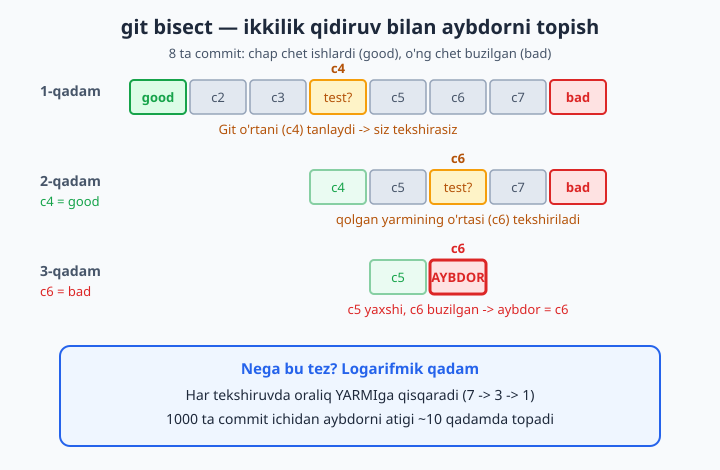
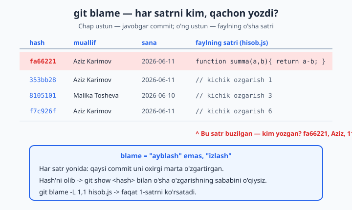
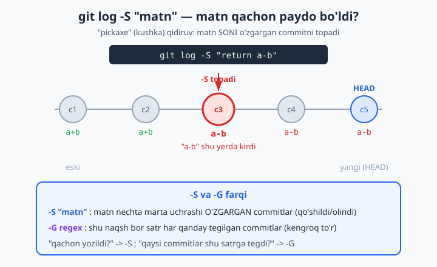

# 17 — Xatoni qidirish: bisect, blame, grep

[⬅️ Oldingi: 16 — Tarixni tozalash va reflog](./16-tarixni-tozalash-reflog.md) · [🏠 README](./README.md) · [Keyingi: 18 — Submodule, Git LFS va monorepo ➡️](./18-submodule-lfs.md)

> **Bu bobda:** "ilgari ishlardi, endi buzilgan — qaysi commit buzdi?" degan azoblovchi savolga aniq javob topishni o'rganamiz. `git bisect` ikkilik qidiruv (binary search — oraliqni har safar yarmiga bo'lish) bilan yuzlab commit ichidan aybdorni atigi bir necha qadamda topadi; `bisect run` esa buni avtomatlashtiradi. `git blame` faylning har bir satrini kim, qachon, qaysi commit'da yozganini ko'rsatadi. `git log -S` va `-G` ("pickaxe" — qidiruv kushkasi) qaysi commit muayyan matnni qo'shgan yoki olib tashlaganini topadi, `git log --grep` esa commit xabarlari ichida qidiradi. Oxirida bularni birlashtirib, aybdorni topib, **nega** unday bo'lganini tushunamiz.

---

## Muammo

Tasavvur qiling: do'kon saytini bir oydan beri jamoa bo'lib yozyapsiz. Yuzlab commit to'plandi. Mijoz qo'ng'iroq qiladi: "narxlar noto'g'ri hisoblanyapti!". Siz kodga qaraysiz — bir qarashda hammasi joyida ko'rinadi. Eng yomoni: bilasizki, **ikki hafta oldin** bu yaxshi ishlardi. Demak, o'sha vaqtdan beri qilingan **yuzlab commit'dan bittasi** buni sindirgan. Qaysi biri?

Birinchi xayolga keladigan yo'l — commit'larni birma-bir orqaga qaytarib (yoki har birini `git show` bilan ochib) tekshirish. 200 ta commit bo'lsa, bu — 200 ta tekshiruv. Bir kuningiz ketadi.

Git'da bundan ancha aqlli yo'l bor. Bu bobda uchta quroldan foydalanamiz:

- **`git bisect`** — "qaysi commit sindirdi?" ni ikkilik qidiruv bilan topadi. 200 ta commit ichidan ~8 ta tekshiruvda aybdorni qo'lga oladi.
- **`git blame`** — "shu satrni kim yozgan?" ni aytib beradi (har satr yonida commit + muallif + sana).
- **`git log -S` / `-G` / `--grep`** — "qaysi commit shu matnni qo'shdi/o'chirdi?" yoki "qaysi commit xabarida shu so'z bor?" ni topadi.

Bu buyruqlarning hammasi **faqat o'qiydi** — kodingizni o'zgartirmaydi. Demak, ularni qo'rqmasdan sinashingiz mumkin. (Bitta istisno — `bisect` ish papkangizni vaqtincha eski commit'larga ko'chiradi, lekin oxirida `bisect reset` hammasini joyiga qaytaradi.)

> 📌 Sinab ko'rish uchun bo'sh papkada kichik repozitoriy oching va bilib turib bug yarating: bir nechta commit qiling, o'rtaroqda bitta funksiyani sindiring (masalan `return a+b` ni `return a-b` ga aylantiring), keyin yana bir nechta commit qo'shing. Quyidagi misollar aynan shunday repozitoriyda sinab ko'rilgan. Loyihangizning haqiqiy `.git` papkasiga tegmang.

---

## git bisect — aybdor commitni ikkilik qidiruv bilan topish

`git bisect` g'oyasi juda sodda, lekin g'oyat kuchli. Siz Git'ga ikki narsani aytasiz:

1. **bad** (yomon) commit — hozir buzilgan joy. Odatda bu `HEAD` (eng oxirgi holatingiz).
2. **good** (yaxshi) commit — ishlaganini **aniq** bilgan eski commit (masalan, ikki hafta oldingisi).

Aybdor — shu ikkisining **orasida** turibdi: good'da hali yaxshi edi, bad'da esa allaqachon buzilgan. Git oraliqning **o'rtasidagi** commit'ga sizni "tashlaydi", siz tekshirib "yaxshi" yoki "yomon" deysiz, va Git oraliqni **yarmiga** qisqartiradi. Shunday qilib, qadam-baqadam aybdor commit qoladi.



### Bosqichma-bosqich

```bash
git bisect start          # qidiruvni boshlash
git bisect bad            # hozirgi holat (HEAD) buzilgan
git bisect good a1b2c3d   # bu eski commit yaxshi ishlardi
```

Uchinchi qatorda `a1b2c3d` o'rniga ishlaganini bilgan haqiqiy commit hash'ini yozasiz (`git log --oneline` bilan toping). Endi Git oraliqning o'rtasidagi commit'ga o'tadi va shunday deydi:

```text
Bisecting: 4 revisions left to test after this (roughly 2 steps)
[0de7f61146dfcd60cb18b35c1f02e9a8a9531664] ozgarish 4
```

E'tibor bering: Git "roughly 2 steps" deyapti — ya'ni yana taxminan 2 ta tekshiruvda tugaydi. Hozir ish papkangiz aynan o'sha o'rtadagi commit holatiga ko'chirilgan. **Endi sizning vazifangiz** — dasturni ishlatib ko'rish: bug bormi yoki yo'qmi? Javobga qarab bittasini yozasiz:

```bash
git bisect good     # bu commit'da hammasi yaxshi edi
# yoki
git bisect bad      # bu commit'da bug allaqachon bor
```

Har javobdan keyin Git oraliqni yarmiga qisqartirib, navbatdagi o'rtadagi commit'ga o'tkazadi. Buni oraliq bittagacha qisqargunigacha takrorlaysiz. Oxirida Git aybdorni e'lon qiladi:

```text
fa66221da39186a0fad035d5406faf0e8d669bc0 is the first bad commit
commit fa66221da39186a0fad035d5406faf0e8d669bc0
Author: Aziz Karimov <aziz@example.com>
Date:   Thu Jun 11 12:46:47 2026 +0500

    refaktoring (aslida bug shu yerda)

 hisob.js | 2 +-
 1 file changed, 1 insertion(+), 1 deletion(-)
```

`... is the first bad commit` — mana shu **birinchi buzilgan commit**, ya'ni aybdor. Endi siz aniq bilasiz: muammo qaysi commit'da, qaysi faylda va qaysi qatorda paydo bo'lgan.

### Eng muhim qadam — qidiruvni yakunlash

Qidiruv tugagach (yoki istalgan paytda to'xtatmoqchi bo'lsangiz), **albatta** quyidagini yozing:

```bash
git bisect reset
```

```text
Previous HEAD position was fa66221 refaktoring (aslida bug shu yerda)
Switched to branch 'main'
```

Bu sizni qidiruvdan oldingi joyingizga (odatda `main` branch'ning eng oxirgi holatiga) qaytaradi. `bisect` davomida ish papkangiz eski commit'larga ko'chib turardi — `reset` hammasini joyiga tiklaydi.

> 📌 Agar `bisect reset` ni unutsangiz, ish papkangiz allaqachon eski commit'da "osilib" qoladi (detached HEAD holati — 7-bobda ko'rgan edik). Yangi commit qilsangiz, u hech qaysi branch'ga ulanmaydi. Shuning uchun qoida: **bisect'ni doim `reset` bilan tugat**.

> 💡 Nega ikkilik qidiruv shunchalik tez? Har tekshiruvda oraliq ikkiga bo'linadi: 1000 commit bo'lsa, ketma-ketlik 1000 -&gt; 500 -&gt; 250 -&gt; ... -&gt; 1 ko'rinishida boradi. Bu atigi ~10 qadam! Birma-bir tekshirsangiz — 1000 qadam. Mana shu farq `bisect` ni qudratli qiladi.

## git bisect run — qidiruvni avtomatlashtirish

Yuqorida har qadamda **siz qo'lda** "good" yoki "bad" deb baho berdingiz. Agar bug'ni avtomatik aniqlaydigan **test** (tekshiruv skripti) bo'lsa, bu ishni butunlay Git'ga topshirib qo'ysa bo'ladi.

G'oya: bizga shunday skript kerakki, u **chiqish kodi** (exit code) bilan javob bersin:

- chiqish kodi `0` → commit **yaxshi** (good),
- chiqish kodi `0` dan farqli (masalan `1`) → commit **yomon** (bad).

Oddiy misol — `test.sh` skripti narxlar funksiyasi to'g'ri ekanini tekshiradi (bu yerda soddalik uchun matnni qidiramiz):

```bash
#!/bin/sh
if grep -q "return a+b" hisob.js; then
  exit 0    # to'g'ri kod bor -> yaxshi
else
  exit 1    # to'g'ri kod yo'q -> buzilgan
fi
```

Endi skriptni ishga tushirish huquqini beramiz va bisect'ga uni topshiramiz:

```bash
chmod +x test.sh
git bisect start
git bisect bad HEAD
git bisect good a1b2c3d
git bisect run ./test.sh
```

Git har bir tekshiruvni o'zi bajaradi — skriptni ishlatadi, chiqish kodiga qarab "good/bad" deb belgilaydi va keyingi commit'ga o'tadi. Siz hech narsa bosmaysiz:

```text
running './test.sh'
Bisecting: 2 revisions left to test after this (roughly 1 step)
running './test.sh'
Bisecting: 0 revisions left to test after this (roughly 0 steps)
running './test.sh'
fa66221da39186a0fad035d5406faf0e8d669bc0 is the first bad commit
bisect found first bad commit
```

Tugagach, odatdagidek `git bisect reset` qiling.

> 💡 `bisect run` real loyihalarda haqiqiy test buyrug'i bilan ishlaydi: `git bisect run npm test`, `git bisect run pytest test_narx.py`, `git bisect run make check`. Test "o'tdi" bo'lsa exit 0, "yiqildi" bo'lsa exit 0'dan farqli — aynan bisect kutadigan til.

> 📌 Ba'zi commit'larni tekshirib bo'lmaydi (masalan, o'sha commit'da loyiha umuman kompilatsiya bo'lmaydi). Bunday holatda `git bisect skip` deysiz — Git o'sha commit'ni chetlab o'tib, qo'shni boshqasini tanlaydi. Avtomatik rejimda skriptingiz **125** chiqish kodini qaytarsa, Git buni "skip" deb tushunadi.

> 📌 Qidiruv jurnalini ko'rish uchun `git bisect log`, uni keyinchalik qayta o'ynatish uchun `git bisect replay <fayl>` bor — ammo bular kamroq kerak bo'ladi.

## git blame — har satrni kim yozdi?

`bisect` "qaysi commit?" ga javob beradi. `git blame` esa boshqacha savolga: "shu **faylning aynan shu satri**ni kim, qachon, qaysi commit'da yozgan?".

```bash
git blame hisob.js
```

```text
fa66221d (Aziz Karimov 2026-06-11 12:46:47 +0500 1) function summa(a,b){ return a-b; }
353bb289 (Aziz Karimov 2026-06-11 12:46:47 +0500 2) // kichik ozgarish 1
dba9023f (Malika Tosheva 2026-06-10 09:15:02 +0500 3) // kichik ozgarish 2
8105101e (Aziz Karimov 2026-06-11 12:46:47 +0500 4) // kichik ozgarish 3
```

Har satr yonida to'rt narsa: **qisqa hash** (o'sha satrni oxirgi marta o'zgartirgan commit), **muallif**, **sana** va satr **raqami**. O'ngda esa — faylning haqiqiy mazmuni.



Endi narx hisobi buzilgan misolga qaytsak: aybdor satrning yonida `fa66221d` turibdi — demak o'sha satrni shu commit o'zgartirgan. Bu yerda muhim nuqta:

> 📌 "blame" inglizcha "ayblash" degani, lekin maqsad — **kimnidir ayblash emas, balki o'zgarishning sababini topish**. Hash'ni olib `git show fa66221` qilsangiz, o'sha commit'ning to'liq o'zgarishini va xabarini ko'rasiz — ehtimol u atayin qilingan va sababi bor.

### -L bilan faqat kerakli satrlar

Katta faylda hamma satrni ko'rish shart emas. `-L` bilan satr oralig'ini cheklaysiz:

```bash
git blame -L 1,1 hisob.js        # faqat 1-satr
git blame -L 10,20 hisob.js      # 10-dan 20-satrgacha
```

```text
fa66221d (Aziz Karimov 2026-06-11 12:46:47 +0500 1) function summa(a,b){ return a-b; }
```

Sanani ixchamroq ko'rsatish uchun `--date=short`:

```bash
git blame -L 1,1 --date=short hisob.js
```

```text
fa66221d (Aziz Karimov 2026-06-11 1) function summa(a,b){ return a-b; }
```

### Satrning oldingi holatini ko'rish

Aybdor satrni topdingiz, lekin **avval qanday edi**ni bilmoqchimisiz? Commit hash'idan keyin `^` qo'ying — bu "o'sha commit'dan **bitta oldingi** holat" degani:

```bash
git blame fa66221^ -L 1,1 hisob.js
```

```text
^6cbd7bd (Aziz Karimov 2026-06-11 1) function summa(a,b){ return a+b; }
```

Mana — aybdor commit'gacha satr `return a+b` (to'g'ri) edi, `fa66221` esa uni `return a-b` (xato) ga aylantirgan. Endi muammo to'liq oydinlashdi.

> 💡 `git blame -w` bo'sh joy (probel, tab) o'zgarishlarini e'tiborsiz qoldiradi — kod faqat formatlangani uchun "aybdor" ko'rinib qolgan satrlarni haqiqiy muallifiga bog'lab beradi. Katta refaktoringdan keyin juda asqotadi.

> 💡 GitHub'da blame yanada qulay: faylni oching, "Blame" tugmasini bosing — har satr yonida muallif avatari va commit'i ko'rinadi, ustiga bosib o'sha commit'ga o'tasiz.

## git log -S va -G — matn qachon kirdi (pickaxe)

Ba'zan savol satrga emas, **matnning o'ziga** qaratilgan: "`API_KEY` so'zi qaysi commit'da qo'shildi?" yoki "`return a-b` xato kodi tarixga qaysi commit bilan kirdi?". Buning uchun `git log -S` bor — uni "pickaxe" (kushka, qazuvchi asbob) deb atashadi, chunki u tarix qatlamlarini "qazib" izlagan matnni topadi.

```bash
git log --oneline -S "return a-b" -- hisob.js
```

```text
fa66221 refaktoring (aslida bug shu yerda)
```

`-S "matn"` shunday ishlaydi: faylda izlangan matn **necha marta uchrashi o'zgargan** har bir commit'ni topadi — ya'ni matn **qo'shilgan** yoki **o'chirilgan** lahzalarni. Bu juda aniq: yuzlab commit ichidan faqat o'shalari chiqadi.



### -G — kengroq to'r (regex)

`-G` ham o'xshash, lekin u **naqsh (regex)** bor har qanday qatorga tegilgan commit'larni topadi — matn soni o'zgarmagan bo'lsa ham. Farqni yaqqol ko'rsatadigan misol — `summa` so'zini ikki usul bilan qidiramiz:

```bash
git log --oneline -S "summa" -- hisob.js
```

```text
6cbd7bd Boshlangich: summa funksiyasi
```

```bash
git log --oneline -G "summa" -- hisob.js
```

```text
fa66221 refaktoring (aslida bug shu yerda)
6cbd7bd Boshlangich: summa funksiyasi
```

Farqqa qarang: `-S` faqat bitta commit'ni topdi — chunki "summa" so'zi **birinchi marta** o'sha commit'da qo'shilgan, undan keyin uning **soni** o'zgarmagan. `-G` esa ikkita topdi — chunki `fa66221` commit'da "summa" so'zi bor satr (`return a+b` -&gt; `return a-b`) **o'zgargan**, garchi "summa" so'zining o'zi joyida qolgan bo'lsa ham.

| Buyruq | Nimani topadi |
|---|---|
| `git log -S "matn"` | Matn **soni o'zgargan** commit'lar (qo'shildi yoki o'chirildi) |
| `git log -G "regex"` | Naqsh bor satrga **tegilgan** har qanday commit (kengroq) |

Qoida: "shu matn **qachon yozildi/o'chirildi**?" — `-S`. "Shu matn bor satrlarga **qaysi commit'lar tegdi**?" — `-G`.

> 📌 `-S` da `--pickaxe-regex` qo'shsangiz, `-S` ham regexni tushunadi (odatda `-S` aniq matn izlaydi). Lekin oddiy holatda: aniq so'z uchun `-S`, naqsh uchun `-G` deb eslang.

## git log --grep — commit xabarlarida qidirish

`-S` va `-G` fayl **mazmunini** qidiradi. `--grep` esa commit **xabarlari** ichidan qidiradi: "tarkibida 'refaktoring' so'zi bor commit'lar qani?".

```bash
git log --oneline --grep "refaktoring"
```

```text
fa66221 refaktoring (aslida bug shu yerda)
```

Bu juda foydali, agar jamoangiz xabarlarni puxta yozsa: "bug", "fix", "narx", "login" kabi so'zlar bo'yicha tegishli commit'larni darrov topasiz.

> 💡 Bir nechta `--grep` ni birlashtirsangiz (`--grep="bug" --grep="fix"`), Git ulardan **birortasi** bor commit'larni topadi (YOKI mantiq). Hammasi bo'lishini xohlasangiz `--all-match` qo'shing. Katta-kichik harf farqini e'tiborsiz qoldirish uchun `-i` (`--regexp-ignore-case`).

> 📌 `--grep` (xabarda qidiradi) va `--author` (5-bobda ko'rgan, muallifda qidiradi) ni chalkashtirmang. Ikkalasini birlashtirsa ham bo'ladi: `git log --grep="narx" --author="Malika"`.

## git log -- fayl va git grep — qo'shimcha izquvarlar

5-bobda ko'rgan **fayl tarixi** ham izlashda asosiy quroldir. Bitta faylga tegishli barcha commit'lar:

```bash
git log --oneline -- hisob.js
```

```text
f590954 ozgarish 9
fa66221 refaktoring (aslida bug shu yerda)
6cbd7bd Boshlangich: summa funksiyasi
```

Diff bilan birga ko'rish uchun `-p` qo'shing — har commit o'sha faylda nimani o'zgartirgani ketma-ket chiqadi:

```bash
git log -p -- hisob.js
```

Va nihoyat, `git grep` — bu `git log` emas, balki **hozirgi holatdagi** kod ichidan matn izlaydi (oddiy matn qidiruvi, lekin Git boshqaradigan fayllar bo'ylab tez ishlaydi):

```bash
git grep "summa"
git grep -n "return"      # satr raqami bilan
```

```text
hisob.js:1:function summa(a,b){ return a-b; }
```

> 💡 `git grep` ishlash papkasidagi **barcha** kuzatilayotgan fayllar ichini bir zumda qidiradi — `.git` papkasiga yoki `.gitignore` dagi fayllarga vaqt sarflamaydi. "Bu funksiya qayerda chaqirilgan?" degan savolga eng tez javob.

## Hammasini birlashtirish — aybdorni topib, tushunish

Endi to'liq izquvarlik zanjirini ko'ramiz. Maqsad — faqat "qaysi commit?" emas, "**nega** unday qilingan?" ni tushunish:

1. **`git bisect`** bilan buzilgan commit'ni topasiz: `fa66221`.
2. **`git show fa66221`** bilan o'sha commit'ni ochasiz — aniq qaysi satr, qanday o'zgargan va xabarda qanday sabab yozilganini o'qiysiz.
3. Agar muayyan satr ayblansa, **`git blame -L`** bilan o'sha satr javobgarini, **`fa66221^`** bilan undan oldingi (to'g'ri) holatini ko'rasiz.
4. Matnning tarixini kuzatmoqchi bo'lsangiz, **`git log -S "matn"`** bilan u qachon kirganini topasiz.

Ko'pincha aybdor commit "bilib turib" qilingan o'zgarish bo'lib chiqadi — masalan, kimdir boshqa muammoni hal qilmoqchi bo'lib, beixtiyor yangisini yaratgan. `git show` ning xabari va diff'i shuni oydinlashtiradi. Shundan keyin tuzatishni o'zingiz yozasiz (yoki 6-bobdagi `revert` bilan o'sha commit'ni bekor qilasiz).

> 📌 Eng muhim odat: **bug topilgach, uni tuzatadigan test yozing**. Keyingi safar bug qaytsa, `git bisect run <test>` uni avtomatik topadi. Izlash va testlash birga ishlaydi.

---

Endi sizda buzilishni qidirishning to'liq to'plami bor: `git bisect` (va `bisect run`) — "qaysi commit sindirdi?", `git blame` — "shu satrni kim yozdi?", `git log -S`/`-G` — "shu matn qachon kirdi?", `git log --grep` — "xabarda shu so'z bor commit'lar", `git log -- fayl` va `git grep` — fayl tarixi va joriy kod qidiruvi. Keyingi bobda katta loyihalarni boshqarish vositalarini — submodule, Git LFS va monorepo'ni o'rganamiz.

## 17-bob mashqlari

> 💡 Mashqlar uchun bo'sh papkada sinov repozitoriysi yarating: `git init` qiling, bir funksiyali fayl (masalan `hisob.js` ichida `return a+b`) bilan boshlang, bir nechta commit qiling, **o'rtaroqda** funksiyani bilib turib sindiring (`a+b` -&gt; `a-b`), keyin yana bir nechta commit qo'shing. Kamida 8-10 ta commit to'plansin. Loyihangizning haqiqiy `.git` papkasiga tegmang — alohida sinov papkasida ishlang.

1. Sinov repozitoriyingizda `git log --oneline` bilan barcha commit'larni ko'ring va o'zingiz bilib turib sindirgan commit qaysi ekanini eslab qoling — keyin bisect topa oladimi, tekshirasiz.
2. `git bisect start` bilan qidiruvni boshlang. Keyin `git bisect bad` (HEAD buzilgan) va eng birinchi commit'ni `git bisect good <hash>` deb belgilang. Git sizni qaysi commit'ga olib bordi va "roughly N steps" nechani ko'rsatdi?
3. Bisect sizni tashlagan commit'da kodga qarang (`hisob.js` ichini oching): bug bormi? Javobga qarab `git bisect good` yoki `git bisect bad` yozing va keyingi qadamga o'ting.
4. Bisect'ni oxirigacha davom ettiring (har qadamda kodni tekshirib). Git oxirida qaysi commit'ni "is the first bad commit" deb e'lon qildi? U sizning bilib turib sindirgan commit'ingizmi?
5. Qidiruv tugagach `git bisect reset` qiling va `git log --oneline -n 1` bilan tekshiring: siz yana `main` ning oxiriga qaytdingizmi?
6. `git bisect reset` ni ataylab unutib ko'ring (qilmang!), o'rniga `git status` ni o'qing: Git "detached HEAD" haqida nima deyapti? Keyin baribir `git bisect reset` qiling.
7. Endi avtomatlashtiring: bug'ni aniqlaydigan `test.sh` skripti yozing (`grep -q "return a+b" hisob.js` bo'lsa exit 0, aks holda exit 1). `chmod +x test.sh` qiling.
8. `git bisect start`, `git bisect bad HEAD`, `git bisect good <eski-hash>` dan keyin `git bisect run ./test.sh` ni ishlating. Git aybdorni o'zi topdimi? Necha marta "running './test.sh'" yozildi?
9. `git bisect run` topgan commit, 4-mashqda qo'lda topgan commit bilan bir xilmi? Tugagach `git bisect reset` qiling.
10. `git bisect log` ni ishlating: Git sizning "good/bad" javoblaringizni qanday yozib borgan?
11. `git blame hisob.js` ni ishlating. Buzilgan funksiya turgan satr yonida qaysi commit hash'i, muallif va sana ko'rsatilgan?
12. `git blame -L 1,1 hisob.js` bilan faqat 1-satrni chiqaring. Keyin `--date=short` qo'shib, sana qanday qisqarganini ko'ring.
13. 11-mashqda topgan aybdor commit hash'idan keyin `^` qo'yib (`git blame <hash>^ -L 1,1 hisob.js`), o'sha satr **buzilishdan oldin** qanday bo'lganini ko'ring. Endi to'g'ri kod ko'rinyaptimi?
14. `git blame` topgan hash'ni olib, `git show <hash>` bilan o'sha commit'ni to'liq oching: diff'da qaysi qator `-` (eski), qaysi biri `+` (yangi) bilan belgilangan?
15. `git log --oneline -S "return a-b" -- hisob.js` ni ishlating. Necha commit chiqdi va u bug kirgan commitmi? Bu nega aniq topdi?
16. `git log --oneline -S "summa" -- hisob.js` va `git log --oneline -G "summa" -- hisob.js` ni ketma-ket ishlating. Natijalar farq qildimi? `-S` nega kamroq commit topdi?
17. `git log --oneline --grep "<biror-soz>"` bilan commit **xabarlari** ichidan qidiring (masalan, sindirgan commit xabariga qo'ygan so'z bo'yicha). Topdimi?
18. `git log --oneline -- hisob.js` bilan faqat shu faylning tarixini chiqaring, keyin `git log -p -- hisob.js` bilan har commit'ning shu fayldagi o'zgarishini ketma-ket ko'ring.
19. `git grep "summa"` va `git grep -n "return"` ni ishlating: bu buyruq `git log` dan nimasi bilan farq qiladi (qaysi holatni qidiradi — tarixni yoki hozirni)?
20. To'liq zanjirni bajaring: (a) `git bisect run` bilan aybdorni toping, (b) `git show <aybdor>` bilan sababini o'qing, (c) `git blame <aybdor>^ -L ...` bilan oldingi to'g'ri holatni ko'ring, (d) muammoni qanday tuzatishni o'z so'zlaringiz bilan yozing (kodni tuzatish yoki `git revert` qilish).
