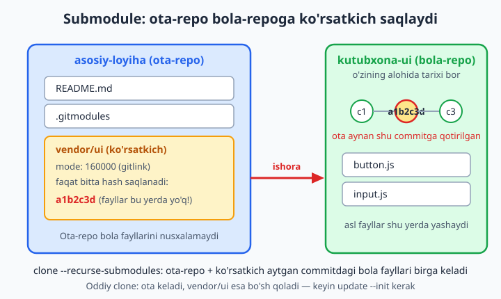
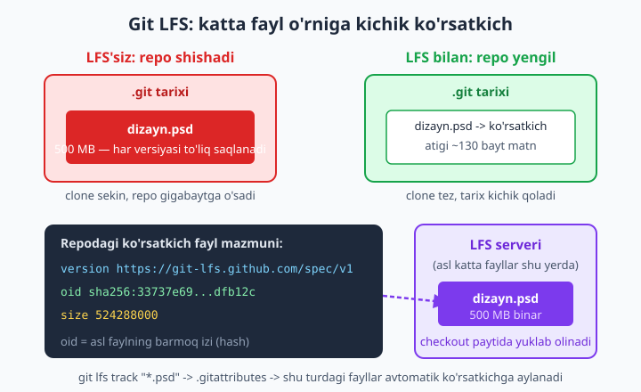
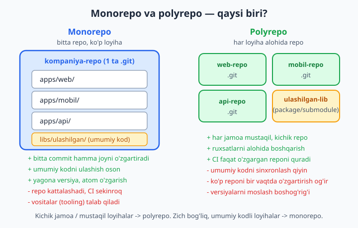

# 18 — Submodule, Git LFS va monorepo

[⬅️ Oldingi: 17 — Xatoni qidirish: bisect, blame, grep](./17-bisect-blame.md) · [🏠 README](./README.md) · [Keyingi: 19 — GitHub vositalari: Issues, Projects ➡️](./19-github-issues-projects.md)

> **Bu bobda:** loyiha o'sgani sayin uchraydigan uchta haqiqiy muammoni hal qilamiz. Birinchisi — loyiha ichida boshqa Git repoga bog'liqlik: submodule (boshqa reponi o'z loyihangizga "ko'rsatkich" sifatida ulash), `.gitmodules` fayli, `git submodule add`, `--recurse-submodules` bilan clone, submodule'ni yangilash va uning chigalliklari. Ikkinchisi — katta binar fayllar (video, dizayn, dataset) reponi shishirib yuborishi: Git LFS (Large File Storage) nima, u qanday qilib katta faylni kichik ko'rsatkichga aylantiradi, `git lfs install/track` va `.gitattributes`. Uchinchisi — bitta repoda ko'p loyiha: monorepo va polyrepo nima, qaysi biri qachon to'g'ri keladi, hamda `git subtree` (submodule'ga muqobil). Yo'l-yo'lakay repo hajmini qanday boshqarishni ham ko'ramiz. Hamma buyruq alohida sinov papkasida haqiqatan ishlatib tekshirilgan.

---

## Muammo

Tasavvur qiling: jamoa bilan **do'kon sayti** yozyapsiz. Sayt uchun chiroyli tugmalar, formalar, modal oynalar kerak — buni "UI kutubxona" deb ataylik. Aynan shu UI kutubxonani sizning boshqa loyihangizda — masalan **admin paneli**da — ham ishlatmoqchisiz. Nusxa-ko'chir qilsangiz, kutubxonaga tuzatish kiritganda uni **ikki joyda** qo'lda yangilashga to'g'ri keladi. Bir kun unutasiz — ikki loyihada UI bir-biridan farq qila boshlaydi. Kerak bo'lgani: UI kutubxonasi **bitta joyda** (o'z reposida) yashasin, qolgan loyihalar esa undan **aniq versiyani** olib tursin.

Ikkinchi og'riq: shu saytga reklama roliklari, yuqori sifatli rasmlar, Photoshop fayllari (`.psd`) qo'shyapsiz. Bitta `.psd` — 500 MB. Siz uni har kuni o'zgartirib `commit` qilyapsiz. Bir oydan keyin `.git` papkangiz **20 GB**ga shishadi, `git clone` esa yarim soat davom etadi — chunki Git har bir versiyani to'liq saqlaydi. Kod 5 MB, lekin repo gigabaytlar.

Uchinchi og'riq: kompaniyangizda web-sayt, mobil ilova va backend API bor. Ularning hammasi bitta umumiy koddan (validatsiya qoidalari, modellar) foydalanadi. Uch alohida repomi yoki bitta katta repomi? Bu — **monorepo va polyrepo** munozarasi.

Uchala muammoning ham yechimlari shu bobda. Boshlaymiz.

---

## 1-qism. Submodule — repo ichida repo

**Submodule** (kichik modul) — bu sizning repongiz ichiga **boshqa bir Git reposini** ulash usuli. Eng muhim g'oya: ota-repo bola-reponing **fayllarini nusxalamaydi**. U faqat bitta narsani saqlaydi — bola-reponing **aniq qaysi commit**ida turishini ko'rsatadigan **ko'rsatkich** (pointer). Bu ko'rsatkichni Git tilida **gitlink** deyiladi.



Diqqat qiling: ota-repo ichida ikki yangi narsa paydo bo'ladi — `.gitmodules` fayli (bola-repo qayerdan kelishini eslab qoladi) va `vendor/ui` "papkasi" (aslida papka emas, gitlink — faqat bitta commit hashini saqlaydigan maxsus yozuv).

### Submodule qo'shish: `git submodule add`

Aytaylik, asosiy loyihangizga `kutubxona-ui` deb nomlangan boshqa reponi `vendor/ui` papkasi ostida ulamoqchisiz:

```bash
# Asosiy loyiha papkasi ichida turib:
git submodule add https://github.com/foydalanuvchi/kutubxona-ui vendor/ui
```

Bu buyruq nima qiladi:

1. `kutubxona-ui` reposini `vendor/ui` papkasiga **clone** qiladi.
2. Loyiha ildizida `.gitmodules` faylini yaratadi (yoki yangilaydi).
3. `vendor/ui` ni gitlink sifatida `git add` qiladi.

Endi `git status` ga qaraymiz:

```text
On branch main
Changes to be committed:
  new file:   .gitmodules
  new file:   vendor/ui
```

📌 `vendor/ui` "fayl" sifatida ko'rinyapti — bu g'alati tuyulishi mumkin, lekin shunday: gitlink Git uchun oddiy fayl ham, papka ham emas, **uchinchi tur** — submodule yozuvi.

`.gitmodules` faylining ichi shunday bo'ladi:

```text
[submodule "vendor/ui"]
	path = vendor/ui
	url = https://github.com/foydalanuvchi/kutubxona-ui
```

Endi commit qilamiz va ota-repoda nima saqlanganini ko'ramiz:

```bash
git commit -m "vendor/ui submodule qo'shildi"
git ls-tree HEAD vendor/ui
```

Natija:

```text
160000 commit a1b2c3d4e5f6...	vendor/ui
```

📌 Mana eng muhim joy. `160000` — bu maxsus "fayl rejimi" (mode), u faqat gitlink uchun ishlatiladi (oddiy fayl `100644`, papka `040000` bo'ladi). `commit a1b2c3d...` esa — bola-reponing **aynan shu commit**iga qotirilganini bildiradi. Ota-repo bola fayllarini emas, atigi shu **bitta hashni** saqlaydi.

### Submodule holatini ko'rish

```bash
git submodule status
```

```text
 a1b2c3d4e5f6... vendor/ui (heads/main)
```

Bu — submodule hozir qaysi commitda turganini ko'rsatadi.

💡 `.gitmodules` faylini hech qachon qo'lda tahrirlamang — buyruqlar uni avtomatik boshqaradi. Faqat o'qish uchun ochishingiz mumkin.

### `--recurse-submodules` bilan clone qilish

Mana eng ko'p sirpanadigan joy. Boshqa odam (yoki kelajakdagi siz) loyihani oddiy `git clone` bilan oladi:

```bash
git clone https://github.com/foydalanuvchi/asosiy-loyiha
```

Natijada `vendor/ui` papkasi **bo'sh** chiqadi! Chunki oddiy clone ota-reponi oladi, lekin submodule'lar ichini avtomatik to'ldirmaydi. Ikki yechim bor:

**Yechim 1 — clone paytida birga olish (eng qulay):**

```bash
git clone --recurse-submodules https://github.com/foydalanuvchi/asosiy-loyiha
```

`--recurse-submodules` bayrog'i ota bilan birga hamma submodule'larni ham gitlink ko'rsatgan commitda to'ldiradi.

**Yechim 2 — allaqachon clone qilib bo'lgan bo'lsangiz:**

```bash
git submodule update --init --recursive
```

- `--init` — `.gitmodules` dagi submodule'larni ishga tushiradi (registratsiya qiladi);
- `--recursive` — submodule ichidagi submodule'lar bo'lsa, ularni ham (chuqurlikka) oladi.

📌 Eng tez-tez uchraydigan "submodule bo'sh" muammosi aynan shu: oddiy clone qilingan, keyin esa `update --init` unutilgan. Agar `vendor/ui` papkasi bo'sh bo'lsa — birinchi navbatda shu buyruqni eslang.


### Submodule'ni yangilash

Vaqt o'tib, `kutubxona-ui` repoda yangi versiyalar chiqadi. Sizning ota-repongiz hamon **eski** commitga qotirilgan — bu ataylab shunday: versiya **o'z-o'zidan o'zgarib ketmasligi** uchun. Yangi versiyaga o'tish uchun siz buni **ataylab** qilishingiz kerak:

```bash
# vendor/ui ni o'z masofaviy (remote) shoxidagi eng so'nggi commitga olib chiqish:
git submodule update --remote vendor/ui
```

Endi `git status` ga qarang — ota-repo submodule o'zgarganini ko'radi:

```text
Changes not staged for commit:
  modified:   vendor/ui
```

Bu o'zgarishni `git diff` ham ko'rsatadi va u juda o'qiluvchan:

```text
-Subproject commit a1b2c3d4e5f6...
+Subproject commit 9f8e7d6c5b4a...
```

"Subproject commit" — gitlink eski commitdan yangisiga ko'chganini bildiradi. Buni saqlash uchun ota-repoda commit qilasiz:

```bash
git add vendor/ui
git commit -m "vendor/ui yangi versiyaga yangilandi"
```

💡 Mana submodule'ning asosiy foydasi: jamoangizdagi har bir kishi **aniq bir xil** UI versiyasini oladi. Kimdir submodule'ni yangilab, ota-repoda commit qilmaguncha — boshqalar uchun versiya o'zgarmaydi. "Mende ishlaydi, sende ishlamaydi" muammosi kamayadi.

### Har bir submodule'da buyruq bajarish

Ko'p submodule bo'lsa, hammasida bitta buyruqni ishlatish kerak bo'ladi:

```bash
# Har submodule'da oxirgi commitni ko'rsatish:
git submodule foreach 'git log --oneline -1'
```

```text
Entering 'vendor/ui'
a1b2c3d ui: birinchi commit
```

### Submodule'ni o'chirish

Submodule kerak bo'lmay qolsa, zamonaviy Git'da bitta buyruq yetadi:

```bash
git rm vendor/ui
git commit -m "vendor/ui submodule olib tashlandi"
```

`git rm` `.gitmodules` ichidagi yozuvni ham, gitlink'ni ham bir vaqtda olib tashlaydi.

📌 Submodule chigalliklari (oldindan ogohlantiramiz):

- **Detached HEAD.** Submodule papkasiga kirsangiz, ko'pincha HEAD biror shoxga emas, to'g'ridan-to'g'ri commitga ulangan ("detached HEAD") holatda bo'ladi (7-bobni eslang). Submodule ichida o'zgarish qilmoqchi bo'lsangiz, avval `git switch main` qilib shoxga o'ting.
- **Ikki bosqichli commit.** Submodule ichida o'zgartirib commit qildingizmi — ota-repoda **yana bir** commit (gitlink yangilanishi) kerak bo'ladi. Buni unutish — eng keng tarqalgan xato.
- **Push tartibi.** Avval submodule (bola-repo) push qilinishi, **keyin** ota-repo push qilinishi kerak. Aks holda boshqalar ota-repodagi gitlink ko'rsatgan, lekin hali yuklanmagan commitni topa olmaydi. `git push --recurse-submodules=on-demand` buni avtomatlashtira oladi.

---

## 2-qism. Git LFS — katta fayllarni jilovlash

Endi ikkinchi muammoga o'tamiz: katta binar fayllar reponi shishiradi. Avval **nega** shunday bo'lishini tushunaylik.

Git matnli fayllarni juda yaxshi siqadi va versiyalaydi: ikki commit orasidagi farqni (diff) saqlash arzon. Lekin binar fayl (video, `.psd`, `.zip`, mashina o'rganish dataseti) uchun "farq" tushunchasi yo'q — har o'zgarishda Git **butun faylni qayta saqlaydi**. 500 MB fayl 10 marta o'zgarsa, repo tarixida 5 GB joy egallaydi. Bu fayl `.git` tarixiga **butun umrga** o'rnashib qoladi — uni hozir o'chirsangiz ham, tarixdan ketmaydi.

**Git LFS** (Large File Storage — katta fayllar saqlovi) aynan shu muammoni hal qiladi. G'oyasi sodda: katta faylni Git tarixiga emas, **alohida serverga** saqlaydi, repoda esa uning o'rniga kichik **matnli ko'rsatkich** qoldiradi.



### LFS'ni sozlash: `install` va `track`

LFS — Git'ga qo'shimcha vosita, uni alohida o'rnatish kerak (ko'p tizimlarda allaqachon mavjud; tekshirish uchun `git lfs version`). Keyin har bir kompyuterda **bir marta** ishga tushiriladi:

```bash
git lfs install
```

```text
Updated Git hooks.
Git LFS initialized.
```

Bu buyruq Git'ga "filter" o'rnatadi — endi Git ma'lum fayllarni avtomatik ko'rsatkichga aylantiradigan bo'ladi. Endi **qaysi** fayllar LFS orqali ketishini aytamiz:

```bash
git lfs track "*.psd"
git lfs track "*.mp4"
git lfs track "*.zip"
```

Bu buyruqlar loyiha ildizida `.gitattributes` faylini yaratadi/to'ldiradi:

```gitignore
*.psd filter=lfs diff=lfs merge=lfs -text
*.mp4 filter=lfs diff=lfs merge=lfs -text
*.zip filter=lfs diff=lfs merge=lfs -text
```

📌 `.gitattributes` faylini **albatta commit qiling** va repoga qo'shing. Aks holda jamoangizdagi boshqalar uchun LFS ishlamaydi — ular katta fayllarni oddiy holda, to'g'ridan-to'g'ri tarixga qo'shib yuboradi. Bu fayl `.gitignore` kabi — loyihaning bir qismi.

### Endi katta fayl qo'shamiz

```bash
git add .gitattributes
git add dizayn.psd
git commit -m "dizayn fayli qo'shildi"
```

Tashqaridan oddiy `add` va `commit`ga o'xshaydi. Lekin sahna ortida sehr sodir bo'ldi. Repoda **aslida nima saqlanganini** ko'raylik:

```bash
git show HEAD:dizayn.psd
```

```text
version https://git-lfs.github.com/spec/v1
oid sha256:33737e694841e7b280ba42e477f0c45a0bda7b97022cb1f7c36d38c490dfb12c
size 524288000
```

500 MB fayl o'rniga — atigi uch qatorlik matn! Bu **ko'rsatkich**:

- `oid sha256:...` — asl faylning "barmoq izi" (hash). Bu orqali LFS serveridan kerakli faylni topadi.
- `size` — asl faylning baytlardagi hajmi.

Asl 500 MB binar esa LFS serverida turadi va siz `git clone` yoki `git checkout` qilganda **avtomatik** yuklab olinadi (kerakli versiyada).

### LFS holatini tekshirish

Qaysi fayllar LFS orqali kuzatilayotganini ko'rish:

```bash
git lfs ls-files
```

```text
33737e6948 * dizayn.psd
```

Hozir qaysi shablonlar (pattern) kuzatilayotganini ko'rish:

```bash
git lfs track
```

```text
Listing tracked patterns
    *.psd (.gitattributes)
    *.mp4 (.gitattributes)
```

### Allaqachon shishib ketgan repo: `git lfs migrate`

Eng yomon holat — siz LFS haqida **kech** bildingiz, katta fayllar allaqachon tarixga o'rnashib bo'lgan. `git lfs track` faqat **kelajakdagi** commitlarga ta'sir qiladi, tarixni o'zgartirmaydi. Tarixni qayta yozish kerak bo'ladi.

Avval qaysi fayl turlari ko'p joy egallayotganini ko'rib chiqing:

```bash
git lfs migrate info
```

```text
*.psd	500 MB	1/1 file	100%
*.js	4 B  	1/1 file	100%
```

Keyin tarixni qayta yozib, mavjud `.psd` fayllarini LFS'ga ko'chirish:

```bash
git lfs migrate import --include="*.psd"
```

📌 **Ogohlantirish:** `migrate import` — tarixni qayta yozadi (16-bobdagi `filter-repo` kabi), ya'ni hamma commit hashlari o'zgaradi. Buni faqat hammani ogohlantirib, jamoa kelishuvi bilan qiling. Boshqalar keyin `git pull` o'rniga reponi qayta clone qilishlari kerak bo'lishi mumkin.

💡 LFS ham bepul emas: GitHub'da LFS uchun saqlash hajmi va trafik (bandwidth) bo'yicha cheklov bor (bepul rejada oyiga ma'lum GB). Katta video arxivlar uchun ba'zan maxsus xizmatlar yoki o'z LFS serveringiz arzonroq tushadi.

---

## 3-qism. Monorepo va polyrepo — bitta repomi, ko'pmi?

Uchinchi muammo: kompaniyada bir nechta loyiha bor. Ularni **bitta** repoda saqlaymizmi yoki **har birini alohida** repoda?

- **Polyrepo** ("ko'p repo") — har loyiha o'z reposida. Web-sayt, mobil ilova, API — uchta alohida `.git`.
- **Monorepo** ("yagona repo") — hamma loyiha bitta katta repoda, papkalarga bo'lingan holda.



Monorepo papka tuzilishi odatda shunday ko'rinadi:

```text
kompaniya-repo/
├── apps/
│   ├── web/         (sayt)
│   ├── mobil/       (ilova)
│   └── api/         (backend)
└── libs/
    └── ulashilgan/  (uch loyiha ham foydalanadigan umumiy kod)
```

### Solishtirish jadvali

| Mezon | Monorepo | Polyrepo |
|---|---|---|
| **Umumiy kodni ulashish** | Oson — bitta papka, hammaga ko'rinadi | Qiyin — submodule yoki paket (package) kerak |
| **Atom o'zgarish** | Bitta commit hamma loyihani bir vaqtda o'zgartiradi | Bir necha repoda alohida commit/PR kerak |
| **Yagona versiya** | Hamma kod doim bir xil versiyada | Har repo o'z versiyasida, sinxronlash boshog'rig'i |
| **Repo hajmi va tezligi** | Kattalashadi, CI sekinroq, maxsus tooling kerak | Har repo kichik va tez |
| **Ruxsatlar** | Hammaga butun repo ko'rinadi | Har repoga alohida ruxsat berish oson |
| **Jamoa mustaqilligi** | Jamolalar bir-biriga to'sqinlik qilishi mumkin | Har jamoa o'z reposida mustaqil ishlaydi |

### Qachon qaysi biri?

📌 Universal "to'g'ri javob" yo'q — vaziyatga bog'liq. Lekin amaliy qoidalar bor:

✅ **Monorepo** quyidagi holatlarda yaxshi:
- Loyihalar **zich bog'liq** va ko'p umumiy kod ulashadi;
- Bitta o'zgarishni bir vaqtda bir necha loyihaga qo'llash kerak (masalan, API o'zgarsa, web va mobil ham birga yangilanishi shart);
- Jamoa bir butun bo'lib ishlaydi, umumiy standartlar muhim.

✅ **Polyrepo** quyidagi holatlarda yaxshi:
- Loyihalar **mustaqil**, kam bog'liq;
- Har loyihaning alohida jamoasi, alohida reliz jadvali bor;
- Ruxsatlarni qattiq ajratish kerak (masalan, tashqi pudratchiga faqat bitta repo ochasiz).

💡 Kichik jamoa va mustaqil loyihalar uchun odatda **polyrepo** soddaroq — chunki monorepo katta repoda CI'ni tezlashtirish uchun maxsus vositalarni (Nx, Turborepo, Bazel kabi) talab qiladi. Monorepo'ning kuchi katta, zich bog'liq tizimlarda ochiladi (Google, Meta kabi kompaniyalar shu yo'lni tanlagan).

### `git subtree` — submodule'ga muqobil (qisqacha)

Boshqa reponi o'z loyihangizga ulashning yana bir usuli — **subtree**. Submodule'dan farqi: subtree bola-reponing **fayllarini bevosita** sizning repongizga ko'chiradi (gitlink emas, haqiqiy fayllar).

```bash
# kutubxona-ui ni libs/ui ostiga, tarixini siqib (squash) qo'shish:
git subtree add --prefix=libs/ui https://github.com/foydalanuvchi/kutubxona-ui main --squash
```

Endi `libs/ui/button.js` — repongizdagi **haqiqiy fayl**, gitlink emas. Keyin yangilash:

```bash
git subtree pull --prefix=libs/ui https://github.com/foydalanuvchi/kutubxona-ui main --squash
```

| Jihat | Submodule | Subtree |
|---|---|---|
| Repoda nima saqlanadi | Faqat ko'rsatkich (gitlink) | Haqiqiy fayllar |
| Clone qiluvchi uchun | `--recurse-submodules` kerak | Hech narsa kerak emas, fayllar shu yerda |
| Repo hajmi | Kichik (faqat hash) | Kattaroq (fayllar nusxasi) |
| O'rganish qiyinligi | Chigalroq (detached HEAD, ikki commit) | Soddaroq ishlatish, lekin buyruqlari uzun |

💡 Maslahat: agar jamoangiz Git'da hali tajribasiz bo'lsa, submodule chigalliklaridan ko'ra subtree (yoki oddiy paket menejeri orqali bog'liqlik) ko'pincha tinchroq yo'l. Submodule kuchli, lekin uni noto'g'ri ishlatish oson.

---

## Repo hajmini boshqarish

Repongiz nega katta ekanini bilish uchun:

```bash
git count-objects -vH
```

```text
count: 8
size: 681 bytes
size-pack: 0 bytes
```

`size-pack` — siqilgan tarixning umumiy hajmi. Agar u shubhali katta bo'lsa, kimdir katta binar faylni LFS'siz commit qilgan bo'lishi mumkin — buni `git lfs migrate info` bilan tekshiring.

📌 Repo shishishining oldini olishning eng arzon yo'li — **profilaktika**:
- Katta binar fayllarni LFS bilan kuzating (`*.psd`, `*.mp4`, `*.zip`);
- Yaratiladigan (build) papkalarni `.gitignore` ga qo'shing (`node_modules/`, `dist/`, `*.log`) — bularni hech qachon commit qilmang;
- Tasodifan kirib qolgan katta faylni darhol (keyingi commit qilishdan oldin) olib tashlash, tarixga o'rnashishidan ko'ra ming marta oson.

---

## 18-bob mashqlari

Quyidagi mashqlarni **alohida sinov papkasida** bajaring (asosiy ish loyihangizga tegmang). Har bir mashq uchun yangi yoki oldingisidan davom etadigan vaqtinchalik papka oching. Yechimlar yozilmagan — har birini o'zingiz qilib ko'ring.

1. Ikki bo'sh papka yarating: `asosiy-loyiha` va `kutubxona-ui`. Ikkalasida ham `git init` qiling, har biriga bittadan fayl qo'shib commit qiling.
2. `asosiy-loyiha` ichida turib, `kutubxona-ui` ni `vendor/ui` papkasiga submodule sifatida qo'shing (`git submodule add` — local yo'l orqali). `git status` natijasini kuzating.
3. Hosil bo'lgan `.gitmodules` faylini oching va ichidagi `path` hamda `url` qatorlarini tushuntiring.
4. Submodule'ni commit qiling. So'ng `git ls-tree HEAD vendor/ui` ni ishlatib, gitlink rejimi (`160000`) va saqlangan commit hashini toping.
5. `git submodule status` ni ishlating va submodule hozir qaysi commitda turganini aniqlang.
6. `asosiy-loyiha` ni boshqa papkaga **oddiy** `git clone` bilan klon qiling. `vendor/ui` papkasi bo'sh ekanini tasdiqlang.
7. Klon ichida `git submodule update --init --recursive` ni ishlatib, `vendor/ui` ni to'ldiring va fayllar paydo bo'lganini tekshiring.
8. Yangi joyga `asosiy-loyiha` ni `git clone --recurse-submodules` bilan klon qiling. Endi submodule darhol to'lganiga ishonch hosil qiling.
9. `kutubxona-ui` reposiga (asl bola-repo) yangi fayl qo'shib commit qiling. So'ng `asosiy-loyiha` da `git submodule update --remote vendor/ui` ni ishlatib, gitlink yangi commitga ko'chganini `git diff` orqali kuzating ("Subproject commit" qatorini toping).
10. 9-mashqdagi o'zgarishni `asosiy-loyiha` da commit qiling. Bu nega ota-repoda **alohida** commit talab qilishini tushuntiring.
11. Submodule papkasiga (`vendor/ui`) kiring va `git status` ni ishlating. HEAD "detached" holatda ekanini ko'ring, so'ng `git switch main` bilan shoxga o'ting.
12. `git submodule foreach 'git log --oneline -1'` ni ishlatib, har submodule'ning oxirgi commitini chiqaring.
13. `git rm vendor/ui` bilan submodule'ni o'chiring va `.gitmodules` hamda gitlink birga olib tashlanganini tekshiring.
14. Yangi papkada `git lfs install` ni ishlating. Natijada nima o'zgarganini (Git hooks) o'qing.
15. `git lfs track "*.psd"` va `git lfs track "*.mp4"` ni ishlatib, hosil bo'lgan `.gitattributes` faylini ko'ring. Har bir qatordagi `filter=lfs` nimani anglatishini izohlang.
16. Bitta katta soxta binar fayl yarating (masalan, ~500 KB tasodifiy ma'lumot bilan `dizayn.psd`). Uni `.gitattributes` bilan birga `add` va `commit` qiling.
17. `git show HEAD:dizayn.psd` ni ishlating va repoda asl fayl emas, **ko'rsatkich** (`version`, `oid`, `size`) saqlanganini tasdiqlang.
18. `git lfs ls-files` va `git lfs track` buyruqlari natijasini solishtiring: biri kuzatilayotgan **fayllarni**, ikkinchisi kuzatilayotgan **shablonlarni** ko'rsatadi — farqini ayting.
19. Yangi papkada `git subtree add --prefix=libs/ui <yo'l> main --squash` bilan boshqa reponi subtree sifatida qo'shing. So'ng `git ls-files` orqali fayllar (gitlink emas) bevosita repoda ekanini tekshiring.
20. O'z loyihalaringizdan birini tasavvur qiling (yoki real loyiha oling) va u uchun monorepo yoki polyrepo qaysi biri to'g'ri kelishini yozma asoslang: umumiy kod bormi, jamoa nechta, reliz jadvallari qanday — har bir mezon bo'yicha bir jumladan dalil keltiring.
