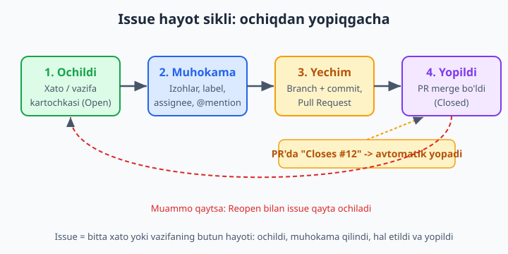
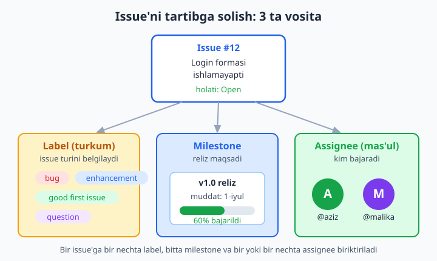
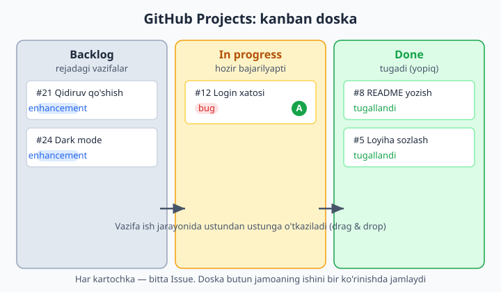

# 19 — GitHub vositalari: Issues, Projects

[⬅️ Oldingi: 18 — Submodule, Git LFS va monorepo](./18-submodule-lfs.md) · [🏠 README](./README.md) · [Keyingi: 20 — GitHub Actions — CI/CD ➡️](./20-github-actions.md)

> **Bu bobda:** kodni saqlash va birlashtirishdan tashqari, jamoa ishini *boshqarishni* o'rganamiz. Issues nima ekanini (har bir xato, vazifa yoki g'oya uchun alohida kartochka), uning hayot siklini (ochildi -> muhokama -> yechim -> yopildi), izoh va @mention'ni, label (turkum), milestone (reliz maqsadi) va assignee (mas'ul) bilan tartibga solishni, commit yoki Pull Request orqali issue'ni avtomatik yopishni (`Closes #12`), task list (vazifalar ro'yxati) va cross-reference (`#raqam` bilan o'zaro havola) qilishni, GitHub Projects kanban doskasini (Backlog / In progress / Done ustunlari va avtomatlashtirish), `.github/` papkasidagi issue va PR shablonlarini (template), Discussions'ni hamda issue'dan to'g'ridan-to'g'ri branch yaratishni ko'rib chiqamiz. Buyruqlarni `gh` (GitHub CLI) bilan terminaldan ham, sayt orqali ham qilamiz.

---

## Muammo

Uch kishi bo'lib do'kon sayti yozyapsiz. Birinchi hafta yaxshi ketdi, lekin ikkinchi haftada chalkashlik boshlandi. Aziz "men savatchani qilyapman" deydi, ammo Malika ham aynan o'sha faylga tegib qo'ygan. Mijoz "login ishlamayapti" deb yozadi — kim tuzatadi? Kimdir Telegram'da "kategoriya filtri ham kerak" deb g'oya tashlaydi, lekin ertasiga hamma uni unutadi. Bir oydan keyin kimdir "biz nimalarni qildik, nimalar qoldi?" deb so'rasa — hech kim aniq javob bera olmaydi.

Muammo bitta: **ish bor, lekin ishni kuzatadigan joy yo'q**. Vazifalar Telegram'da, boshda, qog'ozda tarqoq yotibdi. Kod GitHub'da chiroyli turibdi-yu, *kod ustidagi ish* hech qayerda yozilmagan.

GitHub buning yechimini beradi va u kodning yonida — aynan reponing ichida turadi. Ikki asosiy vosita bor:

- **Issues** — har bir xato, vazifa yoki g'oya uchun alohida "kartochka". Kim, nimani, qachon — hammasi bir joyda.
- **Projects** — o'sha kartochkalarni doska (kanban) ko'rinishida boshqarish: nimasi rejada, nimasi bajarilyapti, nimasi tugadi.

📌 Diqqat: Issues va Projects — Git'ning emas, **GitHub'ning** imkoniyatlari. Ya'ni bular `git` buyruqlari emas; ular GitHub saytida (yoki `gh` CLI orqali) yashaydi. Shuning uchun bu bobning ko'p qismi brauzerda yoki `gh` bilan bajariladi.

## Issue nima

**Issue** (o'qilishi "ishyu", "masala/muammo" degani) — bu reponing ichida yashaydigan **bitta xabar kartochkasi**. U uchta narsadan birini bildirishi mumkin:

| Issue turi | Misol |
|---|---|
| **Xato (bug)** | "Login formasiga bosilganda sahifa qotib qoladi" |
| **Vazifa (task)** | "Savatcha sahifasini yasash kerak" |
| **G'oya (idea / enhancement)** | "Mahsulotlarni narx bo'yicha saralash qo'shsak" |

Har bir issue avtomatik **raqam** oladi: `#1`, `#2`, `#3`... Bu raqam butun reponing ichida noyob va o'zgarmaydi. Keyinchalik commit'da, izohda yoki boshqa issue'da `#12` deb yozsangiz, GitHub uni avtomatik o'sha issue'ga bog'lab, bosiladigan havolaga aylantiradi.

Issue'ning ichida nimalar bo'ladi:

- **Sarlavha (title)** — qisqa, aniq: "Login formasi ishlamayapti".
- **Tavsif (body)** — batafsil: nima bo'lyapti, qanday takrorlanadi, nima kutilgan edi. Markdown bilan yoziladi (ro'yxat, kod bloki, rasm qo'yish mumkin).
- **Izohlar (comments)** — muhokama: jamoa shu yerda gaplashadi.
- **Holat (state)** — `Open` (ochiq) yoki `Closed` (yopiq).

💡 Issue — bu "ish daftari"ning bir sahifasi. Telegram'dagi xabar yo'qoladi, esdan chiqadi; issue esa repoda turaveradi, qidiriladi, raqami bor, kim nima deganini ko'rsatadi. Shuning uchun jiddiy loyihalarda "Telegram'da aytdim" emas, "issue ochdim" deyiladi.

## Issue'ning hayot sikli

Har bir issue tug'iladi, yashaydi va o'ladi (yopiladi). Bu yo'lni tushunish — bobning asosi.



1. **Ochildi (Open).** Kimdir muammoni yoki vazifani yozadi. Issue raqam oladi, holati `Open` bo'ladi.
2. **Muhokama.** Jamoa izoh yozadi, savol beradi, label va assignee qo'yadi. Bu yerda "nima qilish kerakligi" aniqlanadi.
3. **Yechim.** Mas'ul odam branch ochib (07-bob), o'zgarish qiladi, commit qiladi va Pull Request yuboradi (13-bob).
4. **Yopildi (Closed).** PR loyihaga qo'shilgach (merge), issue yopiladi. Ko'pincha bu avtomatik bo'ladi (pastda ko'ramiz).

📌 Yopilgan issue **o'chmaydi** — u tarixda qoladi. Kerak bo'lsa, **Reopen** tugmasi bilan qayta ochish mumkin: masalan, xato tuzatildi deb o'ylagandingiz, lekin u yana paydo bo'ldi.

✅ Yaxshi issue: bitta muammo = bitta issue. ❌ Yomon issue: "savatcha, login va dizaynni tuzatish kerak" — uchta alohida ish bitta kartochkaga tiqilgan; bunisini kuzatib bo'lmaydi, yopib ham bo'lmaydi (uchtadan biri tugasa, holati nima?).

## Issue ochish: sayt va `gh` orqali

**Sayt orqali.** Repo sahifasida **Issues** tabiga o'ting -> **New issue** tugmasini bosing. Sarlavha va tavsifni yozing -> **Submit new issue**. Tamom — issue raqam oladi va ochiladi.

**Terminal orqali (`gh` CLI).** 10-bobda eslatib o'tgan `gh` vositasi (GitHub CLI) brauzersiz ham issue ochishga imkon beradi. Avval bir marta tizimga kirib olasiz:

```bash
# Bir martalik: GitHub akkauntiga kirish (brauzer ochiladi)
gh auth login
```

Keyin issue ochish — loyiha papkasi ichida turib:

```bash
# Sarlavha va tavsif bilan to'g'ridan-to'g'ri issue ochish:
gh issue create --title "Login formasi ishlamayapti" \
                --body "Login tugmasi bosilganda sahifa qotib qoladi."
```

Natija (issue yaratildi va uning havolasi qaytdi):

```text
https://github.com/foydalanuvchi/dokon-sayti/issues/12
```

Issue'larni ko'rish va birini ochish ham terminaldan mumkin:

```bash
# Ochiq issue'lar ro'yxati:
gh issue list

# Bitta issue'ni o'qish:
gh issue view 12
```

📌 `gh` — `git`ning bir qismi emas, alohida dastur (GitHub CLI). U `gh.io` dan o'rnatiladi. Issues va Projects Git'da yo'q, GitHub'da bo'lgani uchun, ularni terminaldan boshqarish aynan `gh` bilan qilinadi — `git` buyruqlari bu yerda ishlamaydi.

💡 Boshlovchi uchun sayt ko'rgazmaliroq, `gh` esa tezroq. Ikkalasi bir xil natija beradi: issue baribir reponing GitHub'dagi Issues bo'limida paydo bo'ladi.

## Label, Milestone, Assignee — tartibga solish

Bitta-ikkita issue'ni boshqarish oson. Lekin 50 ta issue bo'lsa-chi? Qaysi biri xato, qaysi biri g'oya? Qaysi biri shoshilinch? Kim qaysiniga javobgar? Buning uchun uchta vosita bor.



### Label — rangli yorliq (turkum)

**Label** (yorliq) — issue'ga yopishtiriladigan rangli teg. U issue *turini* yoki holatini bir qarashda ko'rsatadi. GitHub har repoda bir nechta tayyor label beradi:

| Label | Ma'nosi |
|---|---|
| `bug` (qizil) | Buzilgan narsa, tuzatish kerak |
| `enhancement` (ko'k) | Yangi imkoniyat / yaxshilash g'oyasi |
| `documentation` | Hujjatlarga oid |
| `good first issue` (yashil) | Oson; yangi hissa qo'shuvchilar uchun mos |
| `help wanted` | Yordam kerak, kimdir oladimi |
| `question` | Savol, muhokama |

Bir issue'ga bir nechta label qo'ysa bo'ladi. O'zingizning label'laringizni ham yaratasiz: `frontend`, `backend`, `shoshilinch`, `priority: high` va hokazo.

```bash
# Label bilan issue ochish:
gh issue create --title "Sahifa mobil telefonda buziladi" \
                --body "Ekran kichik bo'lganda menyu chiqib ketadi." \
                --label bug --label frontend
```

💡 `good first issue` label'i alohida muhim: open source loyihalarda yangi kelganlar aynan shu yorliqli issue'lardan boshlaydi. Agar loyihangizga boshqalar hissa qo'shishini istasangiz, oson vazifalarga shu label'ni qo'ying (21-bob bilan bog'liq).

### Milestone — reliz maqsadi

**Milestone** (bosqich / nishon) — bir guruh issue'ni umumiy maqsad ostida to'plash. Odatda bu **reliz** (versiya) yoki muddat bo'ladi: "v1.0 reliz", "Iyul oxirigacha", "Beta versiya". Har issue'ni bitta milestone'ga biriktirasiz va GitHub avtomatik **progress bar** ko'rsatadi: shu maqsaddagi issue'larning necha foizi yopilgan.

```bash
# Issue'ni "v1.0 reliz" milestone'ga biriktirib ochish:
gh issue create --title "To'lov sahifasi" \
                --body "Karta orqali to'lovni qo'shish." \
                --milestone "v1.0 reliz"
```

📌 Milestone — "qachongacha va nima qilamiz" degan savolga javob. 10 ta issue bir milestone'da bo'lsa va 7 tasi yopilgan bo'lsa, GitHub "70%" deb ko'rsatadi — relizgacha qancha qolganini ko'rasiz.

### Assignee — mas'ul shaxs

**Assignee** (tayinlangan shaxs) — issue'ni *kim* bajarishini belgilaydi. Issue'ga odam biriktirilsa, "bu menga" degani bo'ladi — boshqalar uni olmaydi, chalkashlik bo'lmaydi.

```bash
# Issue'ni o'zingizga tayinlash ("@me" — "men"):
gh issue create --title "Profil sahifasi" --body "Foydalanuvchi profili." \
                --assignee "@me"
```

✅ Ishni boshlashdan oldin o'zingizni assignee qiling — jamoa "bu band" deb biladi. ❌ Hech kim tayinlanmagan issue'lar ko'pincha "hammaniki = hech kimniki" bo'lib, oylab tegilmay yotadi.

## @mention va Markdown

Issue va izohlar — bu suhbat joyi. Ikki narsa uni kuchaytiradi.

**@mention.** Izohda `@username` deb yozsangiz, o'sha odamga **xabar (notification)** boradi va uning e'tibori jalb qilinadi:

```text
@aziz bu xatoni sen ko'rib chiqasanmi? Menimcha login.js da.
```

Aziz darrov bildirishnoma oladi — "Telegram'da aytdim, ko'rmabsan" muammosi yo'qoladi.

**Markdown.** Issue tavsifi va izohlar — to'liq Markdown qo'llab-quvvatlaydi (10-bobda README'da ko'rganimizdek):

```markdown
## Xatoni qanday takrorlash

1. Bosh sahifaga kiring
2. **Login** tugmasini bosing
3. Sahifa qotib qoladi

Konsolda quyidagi xato chiqadi:

`Uncaught TypeError: cannot read 'value'`

Bog'liq fayl: `src/login.js`
```

Bu chiroyli formatlangan holda ko'rsatiladi: sarlavha, raqamli ro'yxat, qalin matn, kod bloki. Xatoni tushunish ancha osonlashadi.

💡 Yaxshi bug-issue'da uch narsa bo'ladi: **(1)** qanday takrorlash kerak (qadamlar), **(2)** nima kutilgan edi, **(3)** aslida nima bo'ldi. Shu uchta narsani bersangiz, xatoni tuzatuvchi vaqtni tejaydi.

## Task list — vazifalar ro'yxati

Markdown'ning maxsus imkoniyati — **task list** (vazifalar ro'yxati). `- [ ]` (bo'sh quti) va `- [x]` (belgilangan) yozsangiz, GitHub uni **bosiladigan katakcha**ga aylantiradi:

```markdown
Savatcha sahifasi uchun qilinadigan ishlar:

- [x] Mahsulot qo'shish tugmasi
- [x] Savatchani ko'rsatish
- [ ] Mahsulotni o'chirish
- [ ] Umumiy narxni hisoblash
```

GitHub buni "4 dan 2 tasi bajarildi" deb ko'rsatadi va kataklarni sichqoncha bilan belgilash mumkin. Bu — bitta katta issue ichidagi kichik qadamlarni kuzatishning eng oson yo'li.

📌 Task list ichida boshqa issue raqamini ham yozsa bo'ladi: `- [ ] #15 To'lov moduli`. Unda GitHub `#15` issue yopilganda katakni avtomatik belgilaydi — bir issue ikkinchisining qismi ekanini ko'rsatadi.

## Issue'ni commit yoki PR bilan yopish: `Closes #12`

Mana eng qulay narsa. Issue'ni qo'lda yopish shart emas — commit yoki Pull Request matnida maxsus so'z yozsangiz, GitHub uni **avtomatik** yopadi. Sehrli so'zlar:

`Closes`, `Fixes`, `Resolves` (uchalasi bir xil ishlaydi) + `#` + issue raqami.

Masalan, #12 issue'ni hal qiluvchi commit:

```bash
git commit -m "fix: login formasidagi xatoni tuzatdim

Closes #12"
```

Bu commit `main`ga yetib borgach (push yoki PR merge orqali), GitHub `#12` issue'ni avtomatik `Closed` qiladi va issue'ga "shu commit yopdi" degan havola qo'shadi. Qo'lda hech narsa bosish kerak emas.

📌 Muhim nozik nuqta: `Closes #12` issue'ni faqat commit **asosiy branch'ga** (odatda `main`) yetib borgandagina yopadi. Boshqa branch'da commit qilganingizda hali yopilmaydi — Pull Request merge bo'lganda yopiladi. Shuning uchun ko'pincha bu so'zlarni **PR tavsifiga** yozish qulayroq:

```text
Bu PR login formasidagi xatoni tuzatadi.

Closes #12
```

PR merge bo'lishi bilan #12 o'z-o'zidan yopiladi.

💡 Bir PR bir nechta issue'ni yopishi mumkin: `Closes #12, Closes #15`. Har biriga alohida so'z yozing — `Closes #12, #15` to'liq ishlamaydi.

📌 Issue'ni terminaldan qo'lda yopish/qayta ochish ham bor:

```bash
gh issue close 12         # yopish
gh issue reopen 12        # qayta ochish
```

## Cross-reference: `#raqam` bilan o'zaro havola

GitHub'da `#` belgisidan keyin raqam yozsangiz (`#12`), u **avtomatik havolaga** aylanadi — issue yoki PR'ga. Buni izohda, commit xabarida, boshqa issue'da — istalgan joyda ishlatasiz:

- Issue izohida "Bu `#8` bilan bog'liq" deb yozsangiz, ikki issue o'zaro bog'lanadi.
- `#8` issue'da esa "#12 da eslatildi" degan yozuv avtomatik paydo bo'ladi (ikki tomonlama!).

Bu **cross-reference** (o'zaro havola) deyiladi. U loyihaning ichida "o'rgimchak to'ri" hosil qiladi: qaysi issue qaysi biri bilan bog'liqligini, qaysi PR qaysi issue'ni hal qilganini bir qarashda ko'rasiz.

📌 `#` raqam — issue/PR uchun. `@username` — odam uchun. Ikkalasi xuddi ijtimoiy tarmoqdagidek ishlaydi: biri narsaga, biri odamga havola.

## GitHub Projects — kanban doska

Issues — bu alohida kartochkalar. Lekin 30 ta issue ro'yxat bo'lib turganda, "qaysisi bajarilyapti, qaysisi tugadi?" degan umumiy manzarani ko'rish qiyin. Aynan shu yerda **Projects** yordam beradi.

**GitHub Projects** — issue'larni **doska** (board) ko'rinishida joylashtiruvchi vosita. Eng common ko'rinishi — **kanban** doska: bir nechta ustun, ularning orasida ko'chadigan kartochkalar.



Odatiy uchta ustun:

| Ustun | Ma'nosi |
|---|---|
| **Backlog** (yoki Todo) | Rejadagi, hali boshlanmagan vazifalar |
| **In progress** | Hozir kimdir ustida ishlayotgan vazifalar |
| **Done** | Tugagan (yopilgan) vazifalar |

Ish jarayonida kartochkani sichqoncha bilan bir ustundan ikkinchisiga **sudrab o'tkazasiz** (drag & drop): vazifani boshladingiz — `Backlog`dan `In progress`ga; tugatdingiz — `Done`ga. Butun jamoa bir qarashda kim nima qilayotganini ko'radi.

**Project yaratish.** Repo yoki profil sahifasida **Projects** tabiga o'ting -> **New project** -> shablon tanlang (masalan "Board"). Keyin issue'laringizni doskaga qo'shasiz: `+ Add item` orqali yoki to'g'ridan-to'g'ri issue raqamini yozib.

💡 Project — Board (doska) ko'rinishidan tashqari **Table** (jadval) va **Roadmap** (vaqt o'qida reja) ko'rinishlarini ham beradi. Bir xil issue'larni turli ko'rinishda ko'rsatadi — qaysi biri qulay bo'lsa, shuni tanlaysiz.

### Avtomatlashtirish

Projects'ning kuchli tomoni — **avtomatlashtirish** (built-in workflows). Doska sozlamalarida qoidalar yoqsangiz, kartochkalar o'zi ko'chadi:

- Issue **yopilganda** -> avtomatik `Done` ustuniga o'tadi.
- Issue **ochilganda** -> avtomatik `Backlog`ga tushadi.
- PR ochilganda bog'langan issue -> `In progress`ga.

📌 Bu qoidalar yoqilgach, siz ko'pincha kartochkalarni qo'lda surishni ham unutasiz — `Closes #12` bilan issue yopilsa, kartochka o'zi `Done`ga uchib boradi. Issues, PR va Projects bir-biriga ulanib, jonli tizimga aylanadi.

## Issue'dan branch yaratish

07-bobda har vazifa uchun alohida branch ochishni o'rgandik. GitHub buni issue bilan bog'lashga yordam beradi: **issue'dan to'g'ridan-to'g'ri branch yaratish** mumkin.

**Sayt orqali.** Issue sahifasining o'ng panelida **Development** bo'limi bor -> **Create a branch** -> branch nomi taklif qilinadi (masalan `12-login-formasi-ishlamayapti`) -> yaratasiz. Endi bu branch o'sha issue bilan rasman bog'langan.

**Terminal orqali (`gh`).** Bitta buyruq branch yaratadi va uni issue'ga ulaydi:

```bash
# 12-issue uchun bog'langan branch yaratish va unga o'tish:
gh issue develop 12 --checkout
```

Bu issue'ga "bu branch shu issue ustida ishlamoqda" degan belgi qo'yadi va sizni o'sha branch'ga o'tkazadi.

💡 Issue raqamini branch nomiga qo'yish — keng tarqalgan kelishuv: `12-login-xatosi`, `feature/45-tolov`. Shunda branch nomidan qaysi issue ustida ishlayotganingiz darrov ko'rinadi. Keyin commit'da `Closes #12` yozasiz — doira yopiladi: issue -> branch -> commit -> PR -> issue yopildi.

## Issue va PR template — shablonlar

Har safar issue ochganda "nimani yozay?" deb o'ylamaslik uchun **template** (shablon) tayyorlab qo'yiladi. Shablon — issue ochilganda tavsif maydoniga avtomatik tushadigan tayyor matn (savollar, bo'limlar). Bu reponing ichida maxsus `.github` papkasida yashaydi.

Issue shablonlari `.github/ISSUE_TEMPLATE/` papkasiga `.md` fayl sifatida qo'yiladi. Masalan, xato xabari uchun:

```markdown
---
name: Xato xabari
about: Loyihada uchragan xatoni xabar qilish
title: "[BUG] "
labels: bug
---

## Xato tavsifi


## Qanday takrorlash mumkin
1.
2.

## Kutilgan natija


## Haqiqiy natija
```

Yuqoridagi `---` orasidagi qism — **front matter** (sozlama): shablon nomi, qo'shiladigan label va sarlavha boshlanishi. Pastdagi qism esa foydalanuvchi to'ldiradigan tayyor "blank". Endi kimdir issue ochmoqchi bo'lsa, GitHub avval shablon tanlashni so'raydi va tavsifga shu matnni qo'yib beradi.

📌 Pull Request uchun ham shablon bor: `.github/PULL_REQUEST_TEMPLATE.md` (papka emas, bitta fayl). U har PR ochilganda tavsifga tushadi — masalan "Bu PR nima qiladi", "Qanday tekshirildim", "Closes #" qatorlari.

💡 Shablonlar bir marta yoziladi, lekin har safar ishlaydi. Ular jamoaga "to'liq, foydali issue/PR qanday bo'ladi" degan andozani beradi — natijada "test qildimmi?", "qaysi issue bilan bog'liq?" degan savollar takrorlanmaydi.

## Discussions — savol-javob va g'oyalar

Issue — aniq *bajariladigan ish* uchun (xato, vazifa). Lekin ba'zi narsalar ish emas: ochiq savol, g'oya almashish, "qanday qilsak yaxshi bo'ladi?" suhbati, e'lonlar. Bularni issue qilib ochsangiz, ular yopilmay osilib qoladi (chunki yopadigan "ish" yo'q).

Buning uchun **Discussions** (muhokamalar) bor — forumga o'xshash bo'lim. U Settings'da yoqiladi (har repoda default yoqilmagan). Discussions'da:

- **Q&A** — savol berasiz, kimdir javobini "to'g'ri javob" deb belgilaydi.
- **Ideas** — g'oyalar; jamoa ovoz beradi (👍).
- **Announcements** — e'lonlar (faqat egalari yoza oladi).

| | Issues | Discussions |
|---|---|---|
| Maqsadi | Bajariladigan **ish** (xato/vazifa) | **Suhbat**: savol, g'oya, e'lon |
| Yopiladimi | Ha (ish tugaydi) | Yo'q (suhbat davom etadi) |
| Misol | "Login xatosini tuzatish" | "Qaysi ramka tanlasak yaxshi?" |

💡 Oddiy qoida: "buni hal qilish kerak"mi — **Issue**. "Bu haqida gaplashaylik"mi — **Discussion**. G'oya muhokamada yetilgach, undan aniq Issue tug'iladi.

## Hammasi birga: bitta vazifaning yo'li

Endi ko'rgan narsalarimizni bitta real oqimga to'playmiz. Mijoz "login ishlamayapti" dedi deylik:

1. **Issue ochasiz** — `#12 Login formasi ishlamayapti`, `bug` label, `v1.0 reliz` milestone, o'zingizni assignee qilasiz.
2. **Doskaga tushadi** — Projects avtomatlashtirish issue'ni `Backlog`ga qo'yadi.
3. **Branch yaratasiz** — `gh issue develop 12 --checkout`; kartochka `In progress`ga o'tadi.
4. **Tuzatasiz va commit qilasiz** — `git commit -m "fix: login xatosi"`.
5. **PR ochasiz** — tavsifiga `Closes #12` yozasiz (13-bob).
6. **PR merge bo'ladi** — `#12` issue avtomatik yopiladi, kartochka `Done`ga uchadi.

Boshidan oxirigacha hech narsa yo'qolmaydi, hamma narsa o'zaro bog'langan va kuzatiladi. Aynan shu — bir kishilik "men kod yozaman"dan jamoaviy "biz loyiha boshqaramiz"ga o'tish.

## 19-bob mashqlari

Bu bob mashqlari asosan GitHub saytida (yoki `gh` CLI bilan) bajariladi. Avval o'zingizning sinov repoyingizni (masalan 10-bobdagi `salom-github`) yoki yangi `dokon-sayti` nomli reponi tayyorlab oling. Mashqlar oson'dan murakkabga qarab boradi.

1. Repoyingizning **Issues** tabini oching va `New issue` orqali birinchi issue'ni yarating: sarlavha "Bosh sahifa dizayni", tavsifda bir-ikki jumla yozing.
2. Endi xato uchun ikkinchi issue oching: "Login tugmasi ishlamayapti". Tavsifda 1-2-3 qadam bilan xatoni qanday takrorlashni Markdown ro'yxati bilan yozing.
3. Birinchi issue'ni **Close** tugmasi bilan yoping, keyin **Reopen** bilan qayta oching. Holatlar (Open/Closed) qanday o'zgarishini kuzating.
4. Issuega izoh (comment) qoldiring va izoh ichida `**qalin**` matn hamda `kod` (backtick ichida) ishlating — natija qanday ko'rinishini ko'ring.
5. Repoda mavjud label'larni ko'ring (Issues -> Labels). Bitta issue'ga `bug` label'ini qo'shing.
6. O'zingizning yangi label'ingizni yarating: nomi `frontend`, rangini tanlang. Uni bironta issue'ga biriktiring.
7. `v1.0 reliz` nomli **Milestone** yarating (Issues -> Milestones -> New milestone) va unga muddat (sana) qo'ying.
8. Ikkita issue'ni o'sha milestone'ga biriktiring va milestone sahifasidagi progress bar (foiz) qanday ko'rsatilishini ko'ring.
9. Bitta issue'ni o'zingizga **assignee** qiling (Assignees -> o'zingizni tanlang). Endi issue ro'yxatida avataringiz ko'rinishini tekshiring.
10. Issue tavsifiga **task list** qo'shing: kamida 4 ta `- [ ]` band yozing. So'ng saytda 2 tasini sichqoncha bilan belgilang va "2/4" hisoblagichni ko'ring.
11. Bitta izohda `@username` orqali o'zingizni (yoki sherigingizni) **mention** qiling va bildirishnoma kelishini kuzating.
12. Ikki issue'ni cross-reference qiling: bittasining izohida ikkinchisiga `#raqam` bilan havola yozing. So'ng ikkinchi issue'da avtomatik bog'lanish yozuvi paydo bo'lganini tekshiring.
13. Issue sahifasidagi **Development -> Create a branch** orqali issue'dan branch yarating (yoki `gh issue develop <raqam> --checkout`).
14. O'sha branch'da kichik o'zgarish qiling, commit xabariga `Closes #<raqam>` yozing, push qiling va PR oching. PR merge bo'lgach, issue avtomatik yopilganini tekshiring.
15. `gh` CLI o'rnatilgan bo'lsa: `gh issue list` bilan ochiq issue'lar ro'yxatini, `gh issue view <raqam>` bilan bitta issue'ni terminalda ko'ring.
16. `gh issue create --title "..." --body "..." --label bug` buyrug'i bilan terminaldan label qo'shilgan issue oching.
17. Repo (yoki profil) **Projects** tabidan yangi **Board** ko'rinishidagi project yarating. Unga `Backlog`, `In progress`, `Done` ustunlari borligini tekshiring.
18. Mavjud issue'laringizni doskaga qo'shing (`+ Add item`) va kamida bittasini sichqoncha bilan `Backlog`dan `In progress`ga sudrab o'tkazing.
19. Project sozlamalarida avtomatlashtirishni yoqing: "issue yopilganda -> Done"; so'ng bitta issue'ni yoping va kartochka o'zi `Done`ga o'tganini kuzating.
20. Reponing ichida `.github/ISSUE_TEMPLATE/bug_report.md` fayli yarating (yuqoridagi shablon namunasi asosida), push qiling, so'ng `New issue` bosganingizda shablon taklif qilinishini va tavsif avtomatik to'ldirilishini tekshiring.
