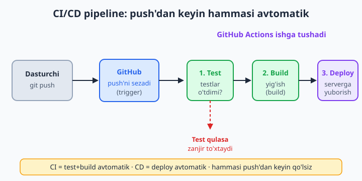
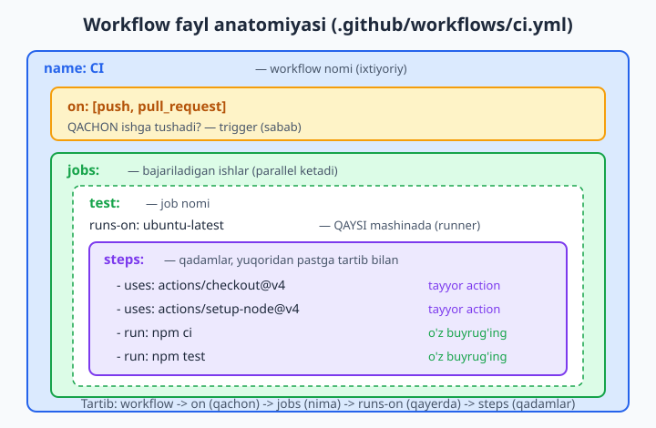
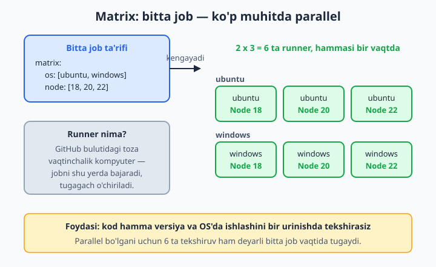

# 20 — GitHub Actions — CI/CD

[⬅️ Oldingi: 19 — GitHub vositalari: Issues, Projects](./19-github-issues-projects.md) · [🏠 README](./README.md) · [Keyingi: 21 — Open source'ga hissa qo'shish ➡️](./21-open-source.md)

> **Bu bobda:** har push'dan keyin qo'lda test va deploy qilish zerikarli va xatoga moyilligidan boshlab, CI/CD (uzluksiz integratsiya va yetkazib berish) nimaligini tushunamiz; GitHub Actions qanday ishlashini — `.github/workflows` ichidagi yaml faylni, uning anatomiyasini (`on`, `jobs`, `steps`, `uses`, `run`, `runs-on`) ko'rib chiqamiz; Node va Python testlarini avtomatlashtirib, matrix bilan ko'p versiyada tekshirib, secret (maxfiy qiymat) ishlatib, status badge qo'yib, deploy va cache sozlab, oxirida loglarni o'qishni o'rganamiz.

---

## Muammo

Diplom loyihangiz — kichik veb-ilova. Har safar kod yozganingizdan keyin shu marosimni qaytarasiz: terminalda `npm test` yozasiz, testlar o'tdimi tekshirasiz, keyin `npm run build` qilasiz, so'ng fayllarni serverga ko'chirasiz. Beshta-oltita buyruq. Charchaganingizda esa testni umuman o'tkazmay, to'g'ridan-to'g'ri serverga yuborasiz — va ertasiga sayt buzilganini ko'rasiz, chunki bitta kichik xato bor edi.

Endi tasavvur qiling: bu loyihada siz yolg'iz emassiz, jamoada uch kishi. Har biringiz push qilganda kimdir testni o'tkazishi kerak. Lekin kim? Qachon? Ko'pincha hech kim. Natijada `main` branch'da buzuq kod yotadi.

Bu muammoning yechimi bor: kompyuter sizning o'rningizga buni har safar, charchamasdan, esidan chiqarmay bajaradi. Har push'da avtomatik test, avtomatik build, kerak bo'lsa avtomatik deploy. Mana shu — **CI/CD**, va GitHub'da uni **GitHub Actions** amalga oshiradi. Bu bobning maqsadi: bitta yaml fayl yozib, "qo'lda qilinadigan marosimni" robotga topshirib qo'yish.

---

## CI/CD nima?

Ikkita qisqartmani ochib olaylik — ular qo'rqinchli ko'rinadi-yu, aslida sodda.

**CI — Continuous Integration (uzluksiz integratsiya).** Har safar kod o'zgartirib `push` qilganingizda, robot avtomatik ravishda kodingizni oladi, testlarni ishga tushiradi va "yig'ib" (build qilib) ko'radi. Maqsad: xatoni siz emas, mashina, darrov topib bersin. "Integratsiya" — har kimning kodi `main`'ga qo'shilganda hammasi birga ishlayaptimi yo'qmi, shuni tekshirish.

**CD — Continuous Delivery / Deployment (uzluksiz yetkazib berish).** Testlar o'tgach, tayyor mahsulotni avtomatik serverga (yoki GitHub Pages'ga, yoki do'konga) yuborish. Ya'ni "deploy"ni ham qo'ldan olib, robotga beramiz.

Birgalikda **CI/CD** — kod yozishdan to foydalanuvchiga yetib borishigacha bo'lgan yo'lni avtomatlashtirilgan **konveyer** (pipeline) deb ataladi. Push qilasiz — qolganini mashina qiladi.



📌 Asosiy qoida: **bitta bosqich qulasa, keyingilari ishlamaydi.** Test o'tmasa, build ham, deploy ham bo'lmaydi. Demak buzuq kod hech qachon serverga yetib bormaydi — bu CI/CD'ning eng katta foydasi.

💡 "Continuous" (uzluksiz) so'zi sizni cho'chitmasin: bu shunchaki "har push'da, avtomatik, qo'lsiz" degani. Sehr yo'q — oddiy bir konfiguratsiya fayli yozasiz, GitHub esa uni o'qib ishga soladi.

## GitHub Actions: workflow fayli qayerda turadi?

GitHub Actions — GitHub'ning ichida pulsiz (cheklangan limit bilan) ishlaydigan avtomatlashtirish tizimi. Siz unga "nimani qachon qilish kerakligini" bitta **yaml** faylda aytib qo'yasiz. Bu fayl maxsus joyda turishi shart:

```text
loyiha-papkasi/
├── .github/
│   └── workflows/
│       └── ci.yml        <- workflow fayli aynan shu yerda
├── src/
└── package.json
```

📌 Papka nomi aniq: `.github/workflows` (boshida nuqta bor, oxirida "s" bor). Fayl kengaytmasi `.yml` yoki `.yaml` bo'lsin. GitHub aynan shu papkaga qaraydi — boshqa joyga qo'ysangiz ishlamaydi. Bitta papkada nechta workflow fayli bo'lsa, hammasi mustaqil ishlaydi.

Bu papka oddiy fayllardan iborat, demak ularni ham xuddi kod kabi commit qilasiz:

```bash
git switch -c ci-qoshish
git add .github/workflows/ci.yml
git commit -m "ci: birinchi workflow qo'shildi"
git push -u origin ci-qoshish
```

📌 **YAML haqida bir og'iz.** YAML — bo'shliqlar (probel) bilan ichma-ich tartibni bildiradigan format. Bu yerda **tab emas, probel** ishlatiladi va har bosqich aniq miqdorda surilishi kerak. Bitta probel kam yoki ortiq bo'lsa, GitHub faylni tushunmaydi. Shuning uchun yaml yozayotganda surilishlarga juda diqqat qiling.

## Workflow anatomiyasi: on, jobs, steps

Mana eng oddiy, lekin to'liq ishlaydigan workflow. Avval ko'ring, keyin har qatorini ochib beramiz:

```yaml
name: CI

on: [push, pull_request]

jobs:
  test:
    runs-on: ubuntu-latest
    steps:
      - uses: actions/checkout@v4
      - run: echo "Salom, Actions!"
```

Endi qatorma-qator:

| Kalit so'z | Ma'nosi | Sodda savol |
|---|---|---|
| `name` | Workflow nomi | Bu nima deb atalsin? |
| `on` | Trigger — sabab | QACHON ishga tushsin? |
| `jobs` | Bajariladigan ishlar | NIMA qilinsin? |
| `runs-on` | Runner — mashina | QAYSI kompyuterda? |
| `steps` | Qadamlar | Qaysi tartibda nima? |
| `uses` | Tayyor action | Birovning tayyor bloki |
| `run` | Buyruq | O'zimning terminal buyrug'im |



Endi har bir tushunchani alohida ochamiz.

### on — trigger (qachon ishga tushadi)

`on` — workflow'ni nima "uyg'otishini" bildiradi. Eng ko'p ishlatiladigan triggerlar:

```yaml
# Variant 1: har push va har pull request'da
on: [push, pull_request]

# Variant 2: faqat main'ga push bo'lganda (aniqroq)
on:
  push:
    branches: [ main ]
  pull_request:

# Variant 3: jadval bo'yicha (cron) — har kuni 06:00 UTC da
on:
  schedule:
    - cron: "0 6 * * *"
```

📌 `pull_request` triggeri juda muhim: kimdir PR ochganda, uning kodi `main`'ga **qo'shilmasdan oldin** testdan o'tadi. Buzuq PR'ni darrov ko'rasiz va merge qilmaysiz. Bu — jamoa ishidagi himoya devori.

💡 `schedule` (jadval) — masalan har kechasi ma'lumotlar bazasidan zaxira nusxa olish yoki har hafta hisobot yig'ish uchun. Cron yozuvi `daqiqa soat kun oy hafta-kuni` tartibida; `"0 6 * * *"` — "har kuni soat 06:00 da". Vaqt UTC bo'yicha (Toshkent vaqtidan 5 soat orqada).

### jobs va runs-on — ishlar va mashina

`jobs` ichida bir yoki bir nechta **ish** (job) bo'ladi. Har job alohida **runner**'da ishlaydi.

📌 **Runner** — bu GitHub bulutidagi toza, vaqtinchalik kompyuter. Job boshlanganda GitHub yangi, bo'm-bo'sh mashina ochadi, sizning kodingizni unga tushiradi, ishni bajaradi, tugagach mashinani o'chirib tashlaydi. Har gal toza mashina — shuning uchun "menda ishlayapti-ku" muammosi yo'qoladi.

```yaml
jobs:
  test:                      # job nomi (ixtiyoriy tanlaysiz)
    runs-on: ubuntu-latest   # Linux mashina (eng arzon va tez)
    steps:
      - run: echo "test job"

  lint:                      # ikkinchi job — birinchisiga parallel ishlaydi
    runs-on: ubuntu-latest
    steps:
      - run: echo "lint job"
```

`runs-on` uchun uchta asosiy variant: `ubuntu-latest` (Linux — eng tez-arzon, ko'pincha shuni tanlang), `windows-latest`, `macos-latest`.

💡 Bir nechta job **parallel** (bir vaqtda) ishlaydi. Agar biri ikkinchisidan keyin ishlashi kerak bo'lsa, `needs` bilan bog'laysiz: `needs: test` — "men test tugagach ishga tushaman".

### steps — qadamlar (uses va run)

`steps` — bitta job ichida yuqoridan pastga, tartib bilan bajariladigan qadamlar. Ikki turi bor:

- `uses:` — **tayyor action** ishlatish. Boshqalar yozib qo'ygan blokni chaqirasiz. Masalan `actions/checkout@v4` — kodingizni runnerga yuklab oladi.
- `run:` — **o'z buyrug'ingiz**. Xuddi terminalga yozgandek shell buyrug'i: `npm test`, `pytest`, `make build`.

```yaml
steps:
  - uses: actions/checkout@v4      # 1. kodni runnerga ko'chirib ol
  - uses: actions/setup-node@v4    # 2. Node o'rnat
    with:
      node-version: 20             # qaysi versiya
  - run: npm ci                    # 3. paketlarni o'rnat
  - run: npm test                  # 4. testlarni ishga tushir
```

📌 **`actions/checkout@v4` deyarli har doim birinchi qadam.** Sababi: runner toza, bo'sh mashina — unda sizning kodingiz hali yo'q. Checkout uni GitHub'dan yuklab oladi. Buni unutsangiz, keyingi `npm test` "fayl topilmadi" deb xato beradi. `@v4` — action'ning versiyasi (4-versiya).

💡 `with:` — action'ga "sozlama" beradi. `setup-node`'ga "menga 20-versiya Node kerak" deb aytmoqdamiz. Har action o'zining `with` parametrlarini hujjatida ko'rsatadi.

## To'liq misol: Node loyihasi testini avtomatlashtirish

Endi hamma tushunchani bitta haqiqiy, ishlaydigan faylga yig'amiz. Bu fayl har push va har PR'da Node testini ishga tushiradi:

```yaml
name: CI

on:
  push:
    branches: [ main ]
  pull_request:

jobs:
  test:
    runs-on: ubuntu-latest
    steps:
      - uses: actions/checkout@v4
      - uses: actions/setup-node@v4
        with:
          node-version: 20
      - run: npm ci
      - run: npm test
```

Buni `.github/workflows/ci.yml` ga saqlang, commit qiling va push qiling. GitHub repozitoriyingizdagi **Actions** tabiga o'ting — workflow ishga tushganini, har qadamning yashil belgisini (yoki qizil xatoni) ko'rasiz.

📌 `npm ci` va `npm install` farqi: `npm ci` — `package-lock.json` ga **aniq** mos paketlarni o'rnatadi va tezroq. CI uchun aynan `npm ci` tavsiya etiladi, chunki "menda boshqa versiya o'rnatilib qoldi" muammosini oldini oladi.

### Python loyihasi uchun ham xuddi shunday

Faqat `setup-node` o'rniga `setup-python`, paket buyruqlari esa Python'niki:

```yaml
name: Python tests

on:
  push:
    branches: [ main ]
  pull_request:

jobs:
  test:
    runs-on: ubuntu-latest
    steps:
      - uses: actions/checkout@v4
      - uses: actions/setup-python@v5
        with:
          python-version: "3.12"
      - run: pip install -r requirements.txt
      - run: pytest
```

💡 Naqsh hamma tilda bir xil: **checkout -> tilni o'rnat -> paketlarni o'rnat -> testni ishga tushir.** Faqat o'rtadagi buyruqlar o'zgaradi. Shuni tushunsangiz, istalgan til uchun workflow yoza olasiz.

## Matrix: bitta job, ko'p versiyada parallel

Kodingiz Node 18'da ishlaydi. Lekin 20'da-chi? 22'da-chi? Windows'da-chi? Har birini alohida tekshirish zerikarli. **Matrix** strategiyasi bitta job ta'rifidan har kombinatsiya uchun alohida runner ochadi:

```yaml
name: Tests

on: [push]

jobs:
  test:
    runs-on: ${{ matrix.os }}
    strategy:
      matrix:
        os: [ubuntu-latest, windows-latest]
        node: [18, 20, 22]
    steps:
      - uses: actions/checkout@v4
      - uses: actions/setup-node@v4
        with:
          node-version: ${{ matrix.node }}
      - run: npm ci
      - run: npm test
```

Bu yerda `2 ta OS x 3 ta Node = 6 ta` alohida ishga tushirish bo'ladi, hammasi **parallel**. Ya'ni kod hamma muhitda ishlashini bir urinishda bilib olasiz.



📌 **Bu yerda `${{ ... }}` sintaksisi paydo bo'ldi.** Ikkilamchi jingalak qavs ichidagi narsa — GitHub Actions **ifodasi** (expression). `${{ matrix.node }}` — "matrix'dagi joriy node qiymatini shu yerga qo'y" degani. GitHub har kombinatsiya uchun bu qavslarni mos qiymatga almashtiradi: birida `18`, boshqasida `20` va hokazo. Bu oddiy YAML emas — bu GitHub o'qiydigan maxsus "o'rnini to'ldir" belgisi.

💡 Bitta kombinatsiyani chiqarib tashlamoqchimisiz (masalan Windows + Node 18 kerakmas)? `exclude` ishlatasiz. Yoki aksincha, faqat bittasini qo'shmoqchimisiz — `include`. Bular kerak bo'lganda hujjatdan qaraysiz; hozircha asosiy matrixni tushunish yetarli.

## Secrets: maxfiy qiymatlarni xavfsiz saqlash

Deploy qilish uchun ko'pincha parol, API kalit yoki server manzili kerak bo'ladi. Buni **hech qachon** yaml faylga ochiq yozmang — fayl GitHub'da hammaga ko'rinadi!

❌ Xato — kalit kodda ochiq turibdi:
```yaml
- run: ./deploy.sh
  env:
    API_KEY: "sk_live_12345_haqiqiy_kalit"   # HAMMA KO'RADI!
```

✅ To'g'ri — kalitni GitHub'ning maxfiy xazinasida saqlaymiz:

GitHub repozitoriyingizda: **Settings -> Secrets and variables -> Actions -> New repository secret**. Nom bering (masalan `API_KEY`), qiymatni joylang, saqlang. Endi workflow'da unga shunday murojaat qilasiz:

```yaml
jobs:
  deploy:
    runs-on: ubuntu-latest
    steps:
      - uses: actions/checkout@v4
      - name: Serverga yuborish
        run: ./deploy.sh
        env:
          API_KEY: ${{ secrets.API_KEY }}
          SERVER_HOST: ${{ secrets.SERVER_HOST }}
```

📌 `${{ secrets.API_KEY }}` — GitHub bu yerga maxfiy qiymatni faqat ish vaqtida, yashirin holda qo'yadi. Loglarda ham u `***` deb yulduzcha bilan berkitiladi, hech kim ko'rmaydi. Maxfiy qiymatlarga doim shu sintaksis orqali murojaat qilinadi.

💡 `name:` — qadamga o'zbekcha (yoki istalgan) tushunarli nom berish uchun. Actions logida shu nom ko'rinadi, "Serverga yuborish" deb. Buyruq uzun bo'lsa, nom berib qo'yish logni o'qishni osonlashtiradi.

## Marketplace: tayyor action'lar

`uses:` bilan chaqirilgan har bir narsa — kimdir yozib, **GitHub Marketplace**'ga qo'ygan tayyor blok. G'ildirakni qaytadan kashf etmaysiz. Eng ko'p ishlatiladiganlar:

| Action | Vazifasi |
|---|---|
| `actions/checkout@v4` | Kodni runnerga yuklab oladi |
| `actions/setup-node@v4` | Node o'rnatadi |
| `actions/setup-python@v5` | Python o'rnatadi |
| `actions/cache@v4` | Fayllarni keshlaydi (tezlashtiradi) |
| `actions/upload-artifact@v4` | Build natijasini saqlaydi |

📌 Versiyaga e'tibor bering: `@v4` — action'ning katta versiyasini qotiradi. Versiyani yozmasangiz, action o'zgarib ketganda workflow'ingiz kutilmaganda buziladi. Doim `@v4` kabi versiya qo'ying.

## Cache: ishni tezlashtirish

Har push'da `npm ci` paketlarni noldan yuklab oladi — bu sekin. **Cache** (kesh) — bir marta yuklangan paketlarni saqlab, keyingi safar qayta ishlatish:

```yaml
jobs:
  build:
    runs-on: ubuntu-latest
    steps:
      - uses: actions/checkout@v4
      - uses: actions/setup-node@v4
        with:
          node-version: 20
          cache: npm        # paketlarni keshlash — yana yuklab o'tirmaydi
      - run: npm ci
      - run: npm run build
```

💡 `setup-node`'ning o'zida `cache: npm` parametri bor — eng oson yo'l. Birinchi ishga tushirish odatdagidek sekin, lekin keyingilari sezilarli tez bo'ladi, chunki paketlar tayyor turadi.

## Status badge: README'ga "qurilish holati" nishoni

Ochiq loyihalarda README'ning yuqorisida yashil "passing" yoki qizil "failing" nishonini ko'rgansiz. Bu — **status badge**, workflow'ingizning oxirgi holatini ko'rsatadi.

Olish oson: GitHub'da **Actions -> workflow'ni tanlang -> o'ng yuqoridagi uch nuqta (...) -> Create status badge -> Copy**. Sizga shunday markdown beradi:

```text

```

Buni README'ga qo'ysangiz, har kim loyihangiz "sog'lom"ligini bir qarashda ko'radi.

📌 `foydalanuvchi/loyiha` o'rniga o'z GitHub nomingiz va repozitoriy nomingiz, `ci.yml` o'rniga workflow faylingiz nomi turadi. Badge avtomatik yangilanadi — har ishga tushirishdan keyin rang o'zgaradi.

## Deploy misoli: GitHub Pages'ga avtomatik chiqarish

Eng ko'p uchraydigan CD holati — statik saytni (portfolio, hujjat, blog) har push'da avtomatik yangilash. GitHub buning uchun tayyor action'lar beradi:

```yaml
name: Deploy to Pages

on:
  push:
    branches: [ main ]

permissions:
  contents: read
  pages: write
  id-token: write

jobs:
  deploy:
    runs-on: ubuntu-latest
    steps:
      - uses: actions/checkout@v4
      - run: npm ci
      - run: npm run build           # natija dist/ papkaga tushadi
      - uses: actions/upload-pages-artifact@v3
        with:
          path: ./dist
      - uses: actions/deploy-pages@v4
```

📌 `permissions` bloki — bu workflow'ga "Pages'ga yozishga ruxsat" beradi. Deploy action'lari xavfsizlik uchun aniq ruxsat talab qiladi. GitHub Pages'ni Settings -> Pages'da "GitHub Actions" rejimiga o'tkazib qo'yish ham kerak. (GitHub Pages haqida to'liqroq 22-bobda.)

💡 Mantiq baribir o'sha: `on: push -> jobs -> steps`. Faqat oxirgi qadamlar "natijani qayerga yuborish"ni hal qiladi. Boshqa serverlarga deploy ham xuddi shu naqsh: build qiling, keyin yuborish action'ini yoki `run:` bilan o'z skriptingizni chaqiring (yuqoridagi secrets misolidagidek).

## Logni o'qish: nima bo'lganini ko'rish

Workflow ishga tushgach, **Actions** tabida har ishni ochib, ichidagi har qadamning logini ko'rasiz. O'qish tartibi:

1. **Actions** tabiga o'ting — workflow ishga tushishlari ro'yxati ko'rinadi.
2. Yashil ✅ — hammasi o'tdi. Qizil ❌ — biror joyda xato.
3. Qizilni bosing, keyin **qaysi job** qulaganini, undan keyin **qaysi qadam** qizilligini oching.
4. Qadamni bossangiz, terminal chiqishi ochiladi. Pastga qarab xato matnini topasiz — odatda "Error:" yoki "FAILED" so'zi bilan.

📌 **Qizil qadam — birinchi qulagan qadamni qidiring.** Undan keyingilar ishlamagani uchun ular "skipped" (o'tkazib yuborilgan) bo'ladi. Sabab har doim birinchi qizil qadamda.

💡 Logni o'qiyotganda eng pastdan emas, **birinchi qizil qatordan** boshlang. Pastdagi "Process completed with exit code 1" — natija, sabab emas. Haqiqiy xato yuqoriroqda, masalan "test failed" yoki "module not found".

📌 Maxfiy qiymatlar logda `***` bilan berkitiladi — bu xavfsizlik. Demak `echo $API_KEY` qilsangiz ham, logda kalit ko'rinmaydi, yulduzcha chiqadi.

## Hammasini birga ko'rib chiqamiz

CI/CD'ning butun g'oyasi shu: bitta yaml fayl yozasiz, GitHub uni `.github/workflows`'da topadi, `on` aytgan paytda ishga tushadi, har `job` toza runnerda `steps`'ni tartib bilan bajaradi, biror qadam qulasa to'xtaydi. Test o'tsa — ishonchingiz oshadi; o'tmasa — buzuq kod `main`'ga yetib bormaydi. Bir marta sozlaysiz, keyin yillab sizning o'rningizga ishlaydi.

✅ Yaxshi amaliyot: har loyihada hech bo'lmasa bitta CI workflow bo'lsin (test + lint). Bu — professional loyihaning eng asosiy belgisi.

❌ Qochish kerak: maxfiy kalitlarni yaml'ga ochiq yozish; `checkout`ni unutish; versiyasiz (`@v4`siz) action ishlatish; tabni probel o'rniga ishlatish.

## 20-bob mashqlari

💡 Mashqlar uchun GitHub'da kichik test repozitoriy oching (masalan `actions-mashq`). Hech qachon haqiqiy parol yoki kalitni mashq uchun ishlatmang — soxta (test) qiymatlar bilan ishlang.

1. Yangi repozitoriy oching va unga `.github/workflows/salom.yml` fayl qo'shing: `on: push` bo'lsin, bitta job, ichida bitta `run: echo "Salom Actions"` qadami. Push qiling va Actions tabida ishga tushganini ko'ring.
2. Birinchi mashqdagi workflow'ga `actions/checkout@v4` qadamini qo'shing va keyingi `run:` qadamda `ls -la` bilan kod fayllari runnerga tushganini tasdiqlang.
3. `on:` ni `[push, pull_request]` ga o'zgartiring. Yangi branch ochib, kichik o'zgarish kiriting, PR oching va workflow PR'da ham ishga tushishini kuzating.
4. `on:` ni faqat `main` branch'iga push'ga cheklang (`branches: [ main ]`). Boshqa branchga push qilib, workflow ishga tushmaganini tekshiring.
5. Node loyihasi yarating (`npm init -y`), bitta oddiy test yozing va matndagi to'liq Node CI workflow'ini qo'shib, testni avtomatik ishga tushiring.
6. 5-mashqdagi workflow'da ataylab testni "yiqitadigan" o'zgarish kiriting (testni buzing). Actions'da qizil ❌ chiqishini va keyingi qadamlar ishlamasligini ko'ring.
7. Logni o'qish: 6-mashqdagi qizil ishni oching, birinchi qulagan qadamni toping va xato matnini aniqlang. Keyin testni tuzatib, yashilga qaytaring.
8. Workflow'ga ikkinchi job qo'shing (masalan `lint`), uni birinchisiga parallel ishlatib, Actions'da ikkala job yonma-yon ketganini kuzating.
9. Ikkinchi job'ni `needs:` bilan birinchisiga bog'lang, shunda u faqat test o'tgandan keyin ishga tushsin. Tartib o'zgarganini tasdiqlang.
10. Matrix qo'shing: bitta job'ni `node: [18, 20, 22]` bo'yicha uch versiyada ishlatib, uchta parallel ishga tushishni ko'ring.
11. Matrix'ni ikki o'lchovli qiling: `os: [ubuntu-latest, windows-latest]` va `node: [20, 22]`. Necha kombinatsiya hosil bo'lishini avval o'zingiz hisoblang, keyin Actions'da tasdiqlang.
12. `setup-node`'ga `cache: npm` qo'shing. Birinchi va ikkinchi ishga tushirish vaqtini taqqoslab, keshning ta'sirini ko'ring.
13. Repozitoriy Settings'da `MENING_KALITIM` nomli soxta secret yarating (qiymati ixtiyoriy test matni). Workflow'da uni `env:` orqali bir qadamga bering.
14. 13-mashqdagi qadamda `echo` bilan secret'ni chop etishga urinib ko'ring va logda u `***` bilan berkitilishini tasdiqlang.
15. Workflow uchun status badge yarating (Actions -> ... -> Create status badge) va uni README'ga qo'shib, GitHub'da yashil/qizil holat ko'rinishini kuzating.
16. Badge ataylab qizil bo'lishi uchun testni buzing, push qiling va README'dagi badge rangi o'zgarganini ko'ring; keyin tuzatib yashilga qaytaring.
17. Python loyihasi yarating (`requirements.txt` + bitta `pytest` testi) va matndagi Python CI workflow'ini qo'shib, testni avtomatlashtirish.
18. `schedule` trigger qo'shing: workflow har kuni belgilangan vaqtda ishlasin (`cron`). Cron yozuvini o'zingiz tuzing va qaysi vaqtni anglatishini izohda yozing.
19. Qadamlarga `name:` bilan o'zbekcha tushunarli nomlar bering va Actions logida bu nomlar qanday ko'rinishini kuzating.
20. Yakuniy mashq: bitta workflow'da ikki job qiling — `test` (matrix bilan ko'p versiyada) va undan keyin `needs:` bilan ishlaydigan `build` job. README'da status badge bo'lsin. Bu — kichik, ammo to'liq CI konveyeri.
