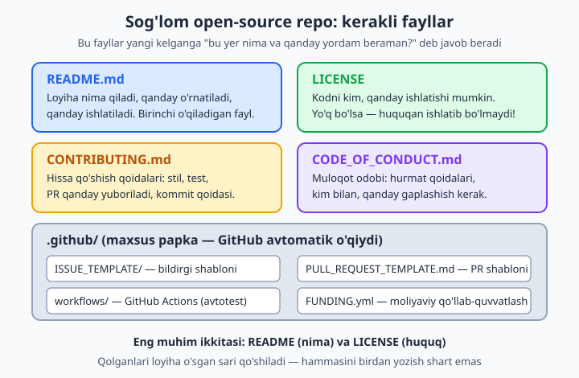
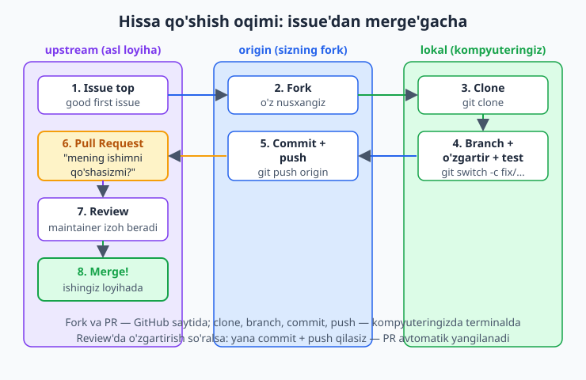
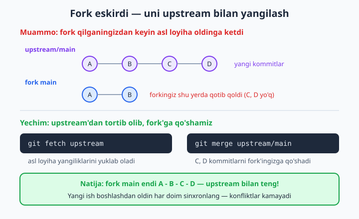

# 21 — Open source'ga hissa qo'shish

[⬅️ Oldingi: 20 — GitHub Actions — CI/CD](./20-github-actions.md) · [🏠 README](./README.md) · [Keyingi: 22 — GitHub Pages va portfolio ➡️](./22-github-pages-portfolio.md)

> **Bu bobda:** ochiq (open source) loyihalar dunyosiga kiramiz: nega odamlar kodini bepul ulashadi, sog'lom repozitoriyni qaysi fayllar tashkil qiladi (README, LICENSE, CONTRIBUTING.md, CODE_OF_CONDUCT, .github shablonlari), litsenziyalar farqi (MIT/Apache/GPL — nega bittasi yetmaydi), birinchi hissangizni qo'shishning to'liq oqimi (good first issue topish -> fork -> branch -> o'zgartirish -> test -> Pull Request -> review -> merge), fork'ni asl loyiha (upstream) bilan sinxron tutish, maintainer (loyiha egasi) bilan muomala odobi, birinchi PR qo'rquvini yengish, semantik versiyalash (semver) va CHANGELOG, va nihoyat o'z loyihangizni dunyoga e'lon qilishni o'rganamiz.

---

## Muammo

Tasavvur qiling: siz diplom ishi yoki do'kon sayti ustida ishlayapsiz va bir kutubxonadan (boshqalar yozgan tayyor kod) foydalanyapsiz. Bir kuni unda kichik xato topasiz — masalan, hujjatda bitta buyruq noto'g'ri yozilgan, yoki sana o'zbek tilida g'alat ko'rsatilyapti. Yuragingizdan o'tadi: "kim bunday qoldirdi ekan?".

Lekin keyin sekin tushunasiz: bu kodni yozgan odam — sizdek oddiy dasturchi. U xatoni ataylab qoldirmagan, shunchaki ko'rmagan. Va eng muhimi — kod **ochiq**, ya'ni siz uni o'qib, tuzatib, tuzatishingizni asl loyihaga **qaytarib yuborishingiz** mumkin. Bir necha kundan keyin sizning ismingiz minglab dasturchi ishlatadigan loyihaning hissa qo'shganlar ro'yxatida turadi.

Open source (ochiq manba) — kodi hammaga ochiq, bepul o'qish/ishlatish/o'zgartirish mumkin bo'lgan dasturlar dunyosi. Git va GitHub aslan shu dunyo uchun yaratilgan. Ushbu bobda ikki yo'nalishni o'rganamiz:

- **Iste'molchidan ishtirokchiga** — boshqalarning loyihasiga hissa qo'shish (kichik tuzatishdan boshlab).
- **Egaga** — o'z loyihangizni ochiq qilib, boshqalar hissa qo'sha oladigan holatga keltirish.

Avval "yaxshi loyiha qanday ko'rinadi?" degan savoldan boshlaymiz, chunki hissa qo'shish ham, o'z loyihangizni ochish ham shuni bilishdan boshlanadi.

## Sog'lom repozitoriy: kerakli fayllar

GitHub'da minglab loyiha bor, lekin yaxshilari bir-biriga o'xshaydi. Ularda yangi kelgan odam adashmasligi uchun bir nechta "yo'l ko'rsatkich" fayl turadi. Keling, ularni ko'rib chiqamiz.



### README.md — birinchi taassurot

README — repo ochilganda eng tepada ko'rinadigan fayl. U javob beradigan savollar:

- **Bu nima?** Loyiha bir-ikki jumlada nima qiladi.
- **Qanday o'rnatiladi?** Aniq qadamlar (terminal buyruqlari bilan).
- **Qanday ishlatiladi?** Eng oddiy misol.
- **Qanday hissa qo'shaman?** (CONTRIBUTING'ga havola).

📌 README — loyihaning yuzi. Ko'p odam loyihani aynan README sifati bo'yicha tanlaydi: tushunarsiz README'li loyihani odamlar chetlab o'tadi, garchi kodi zo'r bo'lsa ham.

### LICENSE — eng ko'p e'tibordan chetda qoladigan, lekin eng muhim fayl

Bu yerda ko'pchilik adashadi. Kod GitHub'da ochiq turibdi — demak bepul ishlatsa bo'ladi, deb o'ylaysiz. **Yo'q.** Litsenziya fayli bo'lmasa, kod sukut bo'yicha mualliflik huquqi bilan himoyalangan: huquqan uni nusxalash, o'zgartirish yoki ishlatish mumkin emas.

💡 Demak, agar siz loyihangizni boshqalar ishlatishini xohlasangiz — LICENSE fayli **shart**. Yo'q bo'lsa, "ochiq" bo'lmaydi, faqat "ko'rinadigan" bo'ladi.

Uchta eng mashhur litsenziyani solishtiramiz:

| Litsenziya | Mohiyati | Asosiy shart | Qachon tanlash |
|---|---|---|---|
| **MIT** | Eng erkin, eng oddiy | Faqat mualliflik nomini saqlang | Ko'pchilik loyiha — sodda va keng tarqalgan |
| **Apache 2.0** | MIT'ga o'xshash + patent himoyasi | Nom saqlash + o'zgarishlarni belgilash | Kompaniyalar, patent xavfi bor loyihalar |
| **GPL v3** | "Copyleft" — erkinlikni majburlaydi | Sizning kodingizni ishlatgan kod ham **ochiq** bo'lishi shart | Loyiha yopiq kodga aylanib ketmasligini istasangiz |

📌 Asosiy farq GPL'da: MIT/Apache bilan kimdir sizning kodingizni olib, yopiq (pullik, manbasi yashirin) dasturga qo'shib sotishi mumkin. GPL bunga yo'l qo'ymaydi — GPL kodni ishlatgan har qanday dastur ham GPL bo'lishi, ya'ni ochiq qolishi shart.

💡 Litsenziyani qo'lda yozish shart emas. GitHub'da repo yaratayotganda "Add a license" ro'yxatidan tanlaysiz, yoki keyinroq: repo sahifasida **Add file -> Create new file**, fayl nomiga `LICENSE` yozsangiz, GitHub o'ng tomonda "Choose a license template" tugmasini chiqaradi.

### CONTRIBUTING.md — "qanday yordam beraman?"

Bu fayl hissa qo'shmoqchi bo'lganlar uchun qoidalar to'plami:

- Qaysi stilda kod yoziladi (masalan, "2 probel chekinish").
- Kommit xabari qanday yoziladi.
- PR yuborishdan oldin nima qilish kerak (testlar o'tsin, lint tekshiruvi toza bo'lsin).
- Issue qanday ochiladi.

📌 GitHub aqlli: agar `CONTRIBUTING.md` fayli bo'lsa, kimdir Issue yoki PR ochganda GitHub avtomatik unga havola ko'rsatadi — "hissa qo'shish qoidalarini o'qing".

### CODE_OF_CONDUCT.md — muloqot odobi

Loyiha — bu odamlar. Bu fayl "qanday muloqot qilamiz" qoidalarini belgilaydi: hurmat, toqat, haqorat va kamsitishga yo'l yo'qligi. Ko'p loyiha tayyor shablon — **Contributor Covenant** — dan foydalanadi. Mayda loyiha uchun shart emas, lekin jamoa o'sgan sari foydali.

### .github/ — maxsus papka

`.github` nomli papkani GitHub avtomatik tanib oladi va undagi fayllarni interfeysga ulaydi:

- `.github/ISSUE_TEMPLATE/` — kimdir Issue ochganda tayyor shablon chiqadi ("xatoni qanday takrorlash mumkin?" degan savollar bilan).
- `.github/PULL_REQUEST_TEMPLATE.md` — PR ochilganda tavsif maydoni shu shablon bilan to'ladi.
- `.github/workflows/` — GitHub Actions (20-bobda ko'rgan avtotestlar).
- `.github/FUNDING.yml` — loyihani moliyaviy qo'llab-quvvatlash havolalari (repo'da "Sponsor" tugmasi chiqadi).

💡 Hammasini birdan yozish shart emas. Yangi loyiha uchun **README + LICENSE** yetadi. Qolganlari loyiha o'sgan, odamlar qiziqa boshlagan sari qo'shiladi.

## Birinchi hissa: to'liq oqim

Endi eng qiziq qismi — boshqaning loyihasiga real hissa qo'shamiz. Bu oqim har doim bir xil: birovning loyihasiga to'g'ridan-to'g'ri yoza olmaysiz (yozish huquqi yo'q), shuning uchun avval o'zingizga **nusxa** (fork) olasiz, unda ishlaysiz, keyin ishingizni asl loyihaga **taklif** qilasiz (Pull Request).



### 1-qadam: ishlash uchun issue topish

Birovning loyihasiga "salom, men keldim" deb darrov kod yozib yubormaysiz. Avval **issue** (bildirgi — tuzatilishi kerak bo'lgan xato yoki yangi g'oya) topasiz. Eng yaxshi boshlanish nuqtasi — `good first issue` yorlig'i: maintainer ataylab "bu vazifa yangi kelganlar uchun oson" deb belgilab qo'ygan issue'lar.

📌 Ularni qayerdan topaman? GitHub qidiruvida loyiha Issues bo'limiga kiring va `Labels` ro'yxatidan `good first issue` ni tanlang. Yoki to'g'ridan-to'g'ri shu manzilga kiring: `github.com/<egasi>/<loyiha>/labels/good%20first%20issue`. Butun GitHub bo'ylab qidirish uchun esa: `goodfirstissues.com` yoki GitHub qidiruvida `label:"good first issue" state:open language:python` kabi so'rov.

💡 Issue'ni topdingizmi — uni **band qiling**: izohga "Men shu ustida ishlamoqchiman, mumkinmi?" deb yozing. Bu ikki kishi bir vaqtda bir ishni qilib qo'yishining oldini oladi va maintainer'ga sizni e'tiborga olish imkonini beradi.

### 2-qadam: fork qilish

Fork — asl loyihaning sizning GitHub akkauntingizdagi to'liq nusxasi. Asl loyiha sahifasining o'ng yuqorisida **Fork** tugmasi bor — bosasiz, va bir necha soniyada `github.com/<sizning-ismingiz>/<loyiha>` paydo bo'ladi. Endi bu nusxa **butunlay sizniki** — istagancha o'zgartirasiz, asl loyihaga ta'sir qilmaydi.

Atamalarni aniq ajratamiz, chunki butun bob shularga tayanadi:

| Atama | Ma'nosi |
|---|---|
| **upstream** | asl loyiha (siz hissa qo'shmoqchi bo'lgan original) |
| **origin** (fork) | upstream'ning sizning akkauntingizdagi nusxasi |
| **lokal** | fork'ning kompyuteringizga clone qilingan nusxasi |

### 3-qadam: fork'ni kompyuteringizga clone qilish

Endi fork'ni (asl loyihani emas!) kompyuteringizga olib kelamiz:

```bash
git clone git@github.com:SIZNING-ISMINGIZ/loyiha.git
cd loyiha
```

Clone qilingach, fork avtomatik `origin` deb nomlanadi. Tekshiramiz:

```bash
git remote -v
```

```text
origin  git@github.com:SIZNING-ISMINGIZ/loyiha.git (fetch)
origin  git@github.com:SIZNING-ISMINGIZ/loyiha.git (push)
```

Endi muhim qadam — **upstream'ni ham qo'shamiz**. Bu keyinroq fork eskirganda asl loyihadan yangiliklarni tortib olish uchun kerak bo'ladi:

```bash
git remote add upstream git@github.com:ASL-EGASI/loyiha.git
git remote -v
```

```text
origin    git@github.com:SIZNING-ISMINGIZ/loyiha.git (fetch)
origin    git@github.com:SIZNING-ISMINGIZ/loyiha.git (push)
upstream  git@github.com:ASL-EGASI/loyiha.git (fetch)
upstream  git@github.com:ASL-EGASI/loyiha.git (push)
```

📌 Endi sizda ikki remote bor: `origin` (sizning fork — bu yerga **push** qilasiz) va `upstream` (asl loyiha — bu yerdan **fetch** qilasiz, lekin push qila olmaysiz, chunki huquqingiz yo'q).

### 4-qadam: alohida branch ochib, o'zgartirish kiritish

To'g'ridan-to'g'ri `main`'da ishlamaysiz. Har bir hissa uchun alohida, ma'noli nomli branch ochasiz (7-bobda o'rgangandek):

```bash
git switch -c fix/sana-formati
```

Endi kodni tuzatasiz, va kommit qilasiz (kommit xabarini loyiha qoidasiga moslab — ko'p loyiha `fix:`, `docs:`, `feat:` prefiksli "Conventional Commits" stilini ishlatadi):

```bash
git add .
git commit -m "fix: sana o'zbekcha formatda ko'rsatilsin"
```

### 5-qadam: test qilish

📌 **Push qilishdan oldin testlarni ishga tushiring.** Sinmagan kod bilan PR yuborish — maintainer vaqtini behuda sarflashning eng tez yo'li. CONTRIBUTING.md'da odatda qanday test ishga tushirilishi yozilgan, masalan:

```bash
npm test          # JavaScript loyihalarida
# yoki
pytest            # Python loyihalarida
```

✅ Hammasi yashil — davom etamiz.
❌ Bittasi qizil — avval shuni tuzating, keyin push qiling.

### 6-qadam: fork'ga push qilish

O'zgarishni asl loyihaga emas (huquqingiz yo'q), o'z fork'ingizga (`origin`) yuborasiz:

```bash
git push -u origin fix/sana-formati
```

📌 `-u` (yoki `--set-upstream`) — bu branch'ni keyingi safar oddiy `git push` bilan yuborish uchun bog'lab qo'yadi. Birinchi push'da bir marta yozasiz, keyin shart emas.

### 7-qadam: Pull Request ochish

Push'dan keyin GitHub'dagi fork sahifangizga kirsangiz, sariq chiziqda "Compare & pull request" tugmasi chiqadi. Bosasiz — yoki asl loyiha sahifasidan **Pull requests -> New pull request** ni tanlaysiz.

PR — bu so'rov: "men o'z fork'imda shu o'zgarishni qildim, uni asl loyihaga qabul qilasizmi?". 13-bobda PR ni batafsil ko'rgan edingiz; bu yerda asosiy farq — PR **fork'ingizdan upstream'ga** ketadi (oddiy ichki PR'da esa bitta repo ichida bo'ladi).

PR tavsifida quyidagilarni yozing:

- **Nima** o'zgartirdingiz va **nega**.
- Qaysi issue'ni hal qiladi: `Closes #42` deb yozsangiz, PR merge bo'lganda u issue avtomatik yopiladi.
- Agar UI o'zgargan bo'lsa — oldin/keyin skrinshot.

### 8-qadam: review va merge

Maintainer PR'ingizni o'qiydi. Ehtimol darrov qabul qiladi, ehtimol o'zgartirish so'raydi. O'zgartirish so'ralsa — **PR'ni qaytadan ochish shart emas**: shunchaki o'sha branch'da yana tuzatasiz, kommit qilasiz va push qilasiz:

```bash
git add .
git commit -m "review izohi: o'zgaruvchi nomi tushunarliroq qilindi"
git push
```

PR avtomatik yangilanadi — yangi kommitlar unga qo'shilib ko'rinadi. Hammasi joyida bo'lsa, maintainer **Merge** bosadi va sizning ishingiz endi asl loyihaning bir qismi. Tabriklaymiz — siz open source ishtirokchisisiz!

## Fork'ni upstream bilan sinxron tutish

Mana eng ko'p e'tibordan chetda qoladigan, lekin muammoga aylanadigan narsa. Siz fork qilganingizdan keyin asl loyiha (upstream) to'xtab turmaydi — boshqalar unga yangi kommitlar qo'shaveradi. Bir necha hafta o'tib, sizning fork'ingiz **eskiradi**: asl loyihada bor yangiliklar sizda yo'q.



Eski fork bilan yangi ish boshlasangiz, PR'ingiz allaqachon o'zgargan kodga to'g'ri kelmay, konfliktlar chiqaradi. Shuning uchun **yangi ish boshlashdan oldin har doim fork'ni yangilang**:

```bash
git switch main
git fetch upstream
git merge upstream/main
```

O'qilishi: `main`'ga o'ting, upstream'dan yangiliklarni yuklab oling (`fetch`), so'ng ularni o'z `main`'ingizga qo'shing (`merge`). Agar siz `main`'da hech narsa o'zgartirmagan bo'lsangiz (to'g'ri amaliyot — har doim alohida branch'da ishlash), bu **fast-forward** bo'ladi, ya'ni konfliktsiz, silliq qo'shiladi:

```text
Updating 4db505f..cb0ce10
Fast-forward
 README.md | 1 +
 1 file changed, 1 insertion(+)
```

So'ng yangilangan `main`'ni o'z fork'ingizga (`origin`) ham push qilib qo'ying:

```bash
git push origin main
```

💡 GitHub'da fork sahifangizda **Sync fork** tugmasi ham bor — sichqoncha bilan bir bosishda `main`'ni upstream bilan tenglashtiradi. Lekin terminal usulini bilish muhim: u har qanday holatda ishlaydi va nima sodir bo'layotganini ko'rsatadi.

📌 Yangi feature branch'ni doim **yangilangan main'dan** oching:

```bash
git switch main
git fetch upstream && git merge upstream/main
git switch -c feat/yangi-imkoniyat
```

Shunda branch'ingiz eng so'nggi kodga tayanadi va review paytida "eskirgan, qaytadan rebase qiling" degan iltimosga kamroq duch kelasiz.

## Maintainer bilan muomala odobi

Open source — texnika emas, ko'proq odamlar bilan ishlash. Yaxshi ishtirokchi bo'lishning yozilmagan qoidalari:

- ✅ **Kichik PR yuboring.** 10 ta faylni birdan o'zgartirgan ulkan PR'ni hech kim ko'rib chiqishni xohlamaydi. Bitta PR — bitta aniq narsa.
- ✅ **Mavzuga sodiq qoling.** Xatoni tuzatayotgan bo'lsangiz, ayni paytda kod stilini ham "yo'l-yo'lakay" o'zgartirib yubormang — bu review'ni qiyinlashtiradi. Har bir g'oya — alohida PR.
- ✅ **Izoh va test bilan keling.** "Nega bu o'zgarish kerak"ni tushuntiring va imkon bo'lsa yangi test qo'shing.
- ✅ **Sabr qiling.** Maintainerlar ko'pincha bu ishni bepul, bo'sh vaqtida qiladi. Bir kunda javob bo'lmasligi — e'tiborsizlik emas.
- ❌ **Talabchan bo'lmang.** "Nega hali merge qilmadingiz?" deb bosim o'tkazmang. Hurmatli "yangilik bormi?" yetarli.
- ❌ **Rad etilishni shaxsiy qabul qilmang.** PR rad etilishi — sizga emas, qarorga tegishli. Maintainer'ning loyihasi, oxirgi qaror — uniki.

### Birinchi PR qo'rquvini yengish

Ko'pchilik birinchi PR'ini yuborishdan qo'rqadi: "kodim yomon chiqsa-chi?", "kulishmaydimi?". Bu tabiiy. Lekin haqiqat shu:

💡 **Eng yaxshi birinchi hissa — kod ham emas.** Hujjatdagi xatoni tuzatish, tarjima qilish, README'dagi noto'g'ri havolani to'g'rilash — bularning hammasi to'liq qiymatli hissa, va xavfi deyarli yo'q. Maintainerlar bunday PR'larni juda yaxshi ko'radi.

📌 Boshlash uchun maslahat: o'zingiz allaqachon ishlatadigan loyihani tanlang. Uni bilasiz, kerakligini tushunasiz, va xatoni topsangiz — uni tuzatish sizga ham foyda. Mukammallikni kutmang: kichik, foydali, toza PR — eng zo'r boshlanish.

## Semver va CHANGELOG — o'z loyihangizni boshqarish

Endi teskari tomonni ko'ramiz: o'z loyihangizni ochiq qildingiz, odamlar ishlata boshladi. Ular bir savol beradi: "yangi versiyada nima o'zgardi va eski kodim ishlashda davom etadimi?". Javob ikki vositada.

### Semantik versiyalash (semver)

Versiya raqami — bu uchta son: **MAJOR.MINOR.PATCH**, masalan `2.4.1`. Har bir son ma'lum narsani bildiradi (15-bobda teglar bilan ko'rgan edingiz):

| Qism | Misol o'zgarish | Qachon oshadi |
|---|---|---|
| **PATCH** | `2.4.1 -> 2.4.2` | Xato tuzatildi, eski kod ishlayveradi |
| **MINOR** | `2.4.1 -> 2.5.0` | Yangi imkoniyat qo'shildi, eski kod baribir ishlaydi |
| **MAJOR** | `2.4.1 -> 3.0.0` | Buzuvchi o'zgarish — eski kod endi ishlamasligi mumkin! |

📌 Asosiy g'oya: foydalanuvchi versiya raqamiga qarab, yangilash xavfsizmi yoki yo'qligini bilib oladi. `2.4.1`'dan `2.4.9`'ga yangilash — tinch; `3.0.0`'ga o'tish — ehtiyot bo'lish kerak, kod buzilishi mumkin.

### CHANGELOG.md

Bu fayl — har versiyada nima o'zgarganini odam o'qiydigan til bilan yozadigan ro'yxat. Keng tarqalgan "Keep a Changelog" formati:

```text
# CHANGELOG

## [2.5.0] - 2026-06-11
### Qo'shildi
- O'zbekcha sana formati uchun qo'llab-quvvatlash

### Tuzatildi
- Bo'sh ro'yxatda dastur qulashi tuzatildi

## [2.4.1] - 2026-05-20
### Tuzatildi
- Hujjatdagi noto'g'ri buyruq misoli
```

💡 CHANGELOG — kommit tarixiga qo'shimcha emas, balki uning **odam uchun saralangan xulosasi**. `git log` — dasturchilar uchun; CHANGELOG — foydalanuvchilar uchun. Yangi versiya chiqarganda (`git tag v2.5.0`) avval CHANGELOG'ni yangilash odat tusiga kiradi.

## O'z loyihangizni e'lon qilish

Loyihangiz tayyor, README va LICENSE bor, kod GitHub'da. Endi uni dunyoga ko'rsatish vaqti:

- **GitHub Topics qo'shing.** Repo sahifasida tavsif yonidagi tishli belgini bosib, mavzu yorliqlari qo'shing (`uzbek`, `cli`, `python`...) — odamlar shular orqali loyihangizni topadi.
- **Yaxshi README yozing.** Skrinshot yoki kichik GIF — minglab so'zdan zo'r. Loyiha nimaga kerakligini bir qarashda ko'rsating.
- **Birinchi reliz chiqaring.** GitHub'da **Releases -> Draft a new release**, `v1.0.0` teg bilan. Bu loyihaga "tayyor mahsulot" qiyofasini beradi.
- **`good first issue` yorlig'i bilan issue'lar oching.** Boshqalarning hissa qo'shishini istasangiz, ularga ish tayyorlab bering.
- **Jamoatda ulashing.** Telegram kanallari, forumlar, ijtimoiy tarmoqlar — loyihangizni odamlar ko'rmasa, ishlatmaydi. Ulashishdan uyalmang.

📌 Eng muhim qadam — **boshlash**. Mukammal loyiha kutib o'tirmang. Kichik, foydali, hujjatlangan loyiha — katta, lekin tushunarsizidan ko'ra ming marta qimmatli. Birovga yordam bergan har qanday kod — open source.

## 21-bob mashqlari

> 💡 Bu mashqlarning ko'pini real GitHub akkauntingizda bajarasiz. Sinov uchun maxsus o'zingiz yaratgan kichik test repo'da ishlang yoki haqiqiy `good first issue`ni tanlang. Birorta loyihaga zarar yetkazishdan qo'rqmang — fork sizniki, asl loyiha PR siz orqali o'zgaradi.

1. GitHub'da yangi bo'sh repo yarating va unga qisqa, lekin to'liq `README.md` yozing: loyiha nima qiladi, qanday o'rnatiladi, qanday ishlatiladi (uch bo'lim).
2. O'sha repo'ga `LICENSE` fayli qo'shing — GitHub interfeysidan MIT litsenziyasini tanlab.
3. Bir paragrafda o'z so'zingiz bilan tushuntiring: MIT va GPL litsenziyalarining asosiy farqi nimada va qaysi birini qachon tanlash kerak.
4. O'z repo'ngizga sodda `CONTRIBUTING.md` yozing: kommit xabari qoidasi, branch nomlash uslubi va PR yuborishdan oldin nima tekshirish kerakligi.
5. GitHub qidiruvidan `label:"good first issue" state:open` so'rovi bilan o'zingiz qiziqadigan tilda (masalan Python) ochiq issue'lar ro'yxatini toping va ulardan uchtasini saqlab qo'ying.
6. Tanlagan loyihalardan birining `CONTRIBUTING.md` faylini topib o'qing va undan uchta muhim qoidani yozib oling.
7. O'zingiz yoqtirgan kichik open source loyihani GitHub'da **Fork** qiling.
8. Fork'ni kompyuteringizga `git clone` bilan oling va `git remote -v` bilan `origin` to'g'ri ko'rsatilganini tekshiring.
9. Fork'ingizga `upstream` remote'ini qo'shing (asl loyiha manzili bilan) va `git remote -v` da ikkala remote ko'rinishiga ishonch hosil qiling.
10. `git switch -c fix/<nom>` bilan yangi branch oching va README yoki hujjatda kichik bir tuzatish (masalan, terish xatosi) kiriting.
11. O'zgarishni kommit qiling, kommit xabarini Conventional Commits stilida yozing (`docs:` yoki `fix:` prefiksi bilan).
12. Branch'ni `git push -u origin <branch-nomi>` bilan o'z fork'ingizga yuboring.
13. GitHub'da fork'ingizdan asl loyihaga (upstream'ga) Pull Request oching; tavsifda nimani va nega o'zgartirganingizni yozing.
14. PR tavsifiga tegishli issue raqamini `Closes #N` ko'rinishida qo'shib, bu nima qilishini tushuntiring.
15. Fork'ingiz `main` branch'ini upstream bilan sinxronlang: `git fetch upstream` va `git merge upstream/main` ketma-ketligini bajaring; natijada fast-forward bo'lganini kuzating.
16. Sinxronlangan `main`'ni `git push origin main` bilan o'z fork'ingizga ham yuklang.
17. Yangilangan `main`'dan yangi feature branch oching va nima uchun har doim yangilangan main'dan boshlash yaxshiroq ekanini bir-ikki jumlada izohlang.
18. O'z test loyihangiz uchun "Keep a Changelog" formatida `CHANGELOG.md` yozing: kamida ikkita versiya bo'limi (Qo'shildi/Tuzatildi sarlavhalari bilan).
19. Quyidagi uchta o'zgarish uchun semver bo'yicha qaysi raqam oshishini aniqlang: (a) faqat xato tuzatildi, (b) yangi imkoniyat qo'shildi eski kod ishlayveradi, (c) eski kod ishlamay qoladigan o'zgarish.
20. O'z loyihangizni e'lon qilishga tayyorlang: repo'ga kamida uchta Topic qo'shing, `v1.0.0` teg bilan birinchi Release yarating va kamida bitta `good first issue` yorlig'li issue oching.
