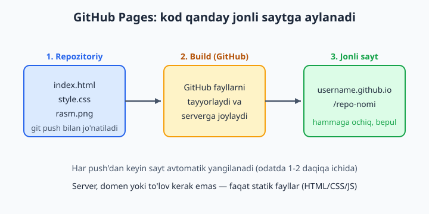
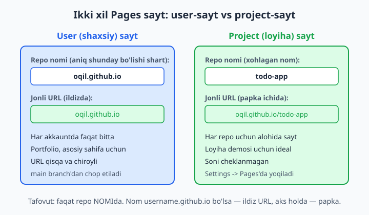
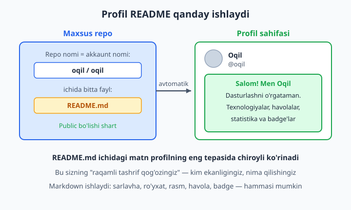

# 22 — GitHub Pages va portfolio

[⬅️ Oldingi: 21 — Open source'ga hissa qo'shish](./21-open-source.md) · [🏠 README](./README.md) · [Keyingi: 23 — Xavfsizlik va eng yaxshi amaliyotlar ➡️](./23-xavfsizlik-amaliyot.md)

> **Bu bobda:** yozgan kodingizni dunyoga ko'rsatishni o'rganamiz. GitHub Pages — repozitoriydan to'g'ridan-to'g'ri bepul jonli sayt (statik hosting, ya'ni HTML/CSS/JS fayllarni internetda joylash). Pages'ning ikki turini (shaxsiy `username.github.io` sayti va loyiha sayti), saytni yoqishni, URL tuzilishini, custom domen (o'z domeningiz, masalan `oqil.uz`) ulashni, Jekyll va GitHub Actions orqali deploy qilishni ko'rib chiqamiz. Keyin eng muhim narsa — **profil README** (profilingizda ko'rinadigan tashrif qog'ozi), badge'lar (rangli yorliqlar) va pin qilingan (qadalgan) repolar bilan ishonarli portfolio yasashni o'rganamiz.

---

## Muammo

Tasavvur qiling: siz uch oy davomida o'rgandingiz. Bir nechta loyiha yozdingiz — kalkulyator, ob-havo sayti, kichik o'yin. Hammasi kompyuteringizda, papkalarda turibdi. Endi ish izlayapsiz yoki birovga ko'rsatmoqchisiz.

Muammo shundaki, kodni `.zip` qilib jo'natsangiz — hech kim ochib ko'rmaydi. "Mana, kompyuterimda ishlaydi" deyish ham yetarli emas. Odamlar **jonli havolani** xohlaydi: bossangiz, brauzerda ochiladigan, ishlaydigan sayt. HR menejeri ham, kelajakdagi hamkasbingiz ham aynan shuni so'raydi: "Demo havola bormi?".

Odatda jonli sayt uchun server ijaraga olish, domen sotib olish, sozlash kerak — pul va vaqt. Lekin agar saytingiz **statik** bo'lsa (faqat HTML, CSS, JavaScript — server tomonida ma'lumotlar bazasi yo'q), GitHub buni **mutlaqo bepul** qiladi. Repongizdagi fayllarni internetga chiqaradi va sizga jonli URL beradi. Bu — **GitHub Pages**.

Bu bobda kodni jonli saytga aylantirishni, keyin esa o'zingizni ishonarli ko'rsatadigan portfolio qurishni o'rganamiz. Oxirida sizda real havola bo'ladi: bossangiz ochiladi.



## GitHub Pages nima va u nimani uddalaydi

GitHub Pages — bu repozitoriydagi statik fayllarni olib, ularni internetga jonli sayt sifatida chop etadigan bepul xizmat. "Statik" so'zi muhim:

- ✅ **Ishlaydi:** HTML, CSS, JavaScript (frontend), rasmlar, oddiy sahifalar, SPA (React/Vue build natijasi), bloglar, hujjatlar, portfoliolar.
- ❌ **Ishlamaydi:** server tomonida ishlovchi kod — PHP, Python/Django, Node.js backend, ma'lumotlar bazasiga to'g'ridan-to'g'ri so'rovlar. Bularga server kerak, Pages esa faqat tayyor fayllarni ko'rsatadi.

📌 Agar saytingiz brauzerda ochib, faqat HTML faylini ikki marta bossangiz ishlayotgan bo'lsa — demak u statik va Pages uchun mos. Agar "serverni ishga tushir" kerak bo'lsa — Pages yetmaydi (u holda backend hosting kerak).

💡 GitHub Pages soft cheklovlari: sayt hajmi taxminan 1 GB gacha, oylik trafik taxminan 100 GB. O'quv loyihalari va portfolio uchun bu juda katta zaxira — siz bu chegaralarga deyarli hech qachon yetmaysiz.

## Ikki tur: user-sayt va project-sayt

GitHub Pages ikki xil bo'ladi va farqi faqat **repo nomida**. Bu farqni boshidan tushunib olish keyingi chalkashliklarning oldini oladi.



**1. User (shaxsiy) sayt** — repo nomi aniq `username.github.io` bo'lishi shart, bu yerda `username` — sizning GitHub akkaunt nomingiz. Masalan akkauntingiz `oqil` bo'lsa, repo nomi `oqil.github.io`. Bunday sayt ildiz URL'da ochiladi:

```text
https://oqil.github.io
```

Har akkauntda faqat bitta shunday sayt bo'ladi. Bu odatda asosiy portfolio yoki shaxsiy sahifa uchun ishlatiladi — URL eng qisqa va chiroyli.

**2. Project (loyiha) sayti** — xohlagan nomli oddiy repodan chiqariladi. URL ichida repo nomi papka bo'lib turadi:

```text
https://oqil.github.io/todo-app
```

Bunaqasini istalgancha yasash mumkin — har loyihangiz uchun alohida demo. Aynan shu tur ko'pincha kerak bo'ladi: har bir loyihaning o'z jonli ko'rinishi.

📌 Tuzoq: project-saytda URL ichida `/todo-app` papka bor. Shuning uchun HTML'da rasm yoki CSS'ni `/rasm.png` deb (bosh `/` bilan) bog'lasangiz — u `oqil.github.io/rasm.png` ni izlaydi va topa olmaydi. Yechim — **nisbiy yo'l** ishlatish: `rasm.png` yoki `./rasm.png`, bosh `/` siz. User-saytda esa ikkalasi ham ishlayveradi.

## Eng tez yo'l: statik saytni joylash

Keling, real qilib ko'ramiz. Maqsad — kichik HTML saytni jonli qilish.

**1-qadam — saytni tayyorlash.** Yangi papka yarating va ichiga `index.html` qo'ying. `index.html` nomi muhim: Pages aynan shu faylni saytning bosh sahifasi deb oladi.

```bash
mkdir mening-saytim
cd mening-saytim
git init
```

Ichiga oddiy `index.html` yozing:

```html
<!DOCTYPE html>
<html lang="uz">
<head>
  <meta charset="utf-8">
  <title>Mening portfoliom</title>
</head>
<body>
  <h1>Salom! Men Oqil</h1>
  <p>Bu mening birinchi jonli saytim.</p>
</body>
</html>
```

**2-qadam — commit va GitHub'ga push.** (10–12-boblardagi bilim asqotadi.)

```bash
git add index.html
git commit -m "Birinchi sayt"
```

GitHub'da yangi repo oching (masalan `portfolio`), keyin uni remote qilib push qiling:

```bash
git remote add origin git@github.com:oqil/portfolio.git
git push -u origin main
```

📌 Push parol bilan ishlamaydi (12-bob): SSH kalit yoki Personal Access Token kerak. Bu bobgacha yetgan bo'lsangiz, ehtimol allaqachon sozlangan.

**3-qadam — Pages'ni yoqish (GitHub UI'da).** Bu qism brauzerda, bir marta bosib qilinadi:

1. Repo sahifasida yuqoridagi **Settings** ga kiring.
2. Chap menyudan **Pages** ni tanlang.
3. **Source** (manba) ostida **Deploy from a branch** ni tanlang.
4. **Branch** ro'yxatidan `main` ni, papka sifatida `/ (root)` ni tanlang va **Save** bosing.

```text
Settings -> Pages -> Source: Deploy from a branch
  Branch: main   Folder: / (root)   -> Save
```

Bir-ikki daqiqadan keyin xuddi shu Pages sahifasida yashil havola paydo bo'ladi:

```text
Your site is live at https://oqil.github.io/portfolio/
```

✅ Tabriklaymiz — endi sizda jonli, hammaga ochiq sayt bor. Havolani do'stingizga jo'nating, telefonda oching.

💡 Loyiha juda katta bo'lsa va siz HTML'ni `docs/` papkasida saqlasangiz, 4-qadamda papka sifatida `/ (root)` o'rniga `/docs` ni tanlang. Pages aynan o'sha papkadagi `index.html` dan boshlaydi.

## Saytni yangilash — push qiling, tamom

Eng yoqimli joyi shu: sayt yoqilgandan keyin uni qo'lda qayta joylash kerak emas. Faqat odatdagidek o'zgartiring, commit qiling, push qiling — Pages o'zi yangilanadi.

```bash
# index.html'ni tahrirladingiz...
git add index.html
git commit -m "Bosh sahifa matnini yangiladim"
git push
```

Bir daqiqa kuting va brauzerda saytni yangilang (ba'zan eski versiya keshda qoladi — `Ctrl+Shift+R` bilan majburiy yangilang). O'zgarish jonli saytda ko'rinadi.

📌 Agar o'zgarish ko'rinmasa, repo sahifasidagi **Actions** bo'limiga kiring: u yerda "pages build and deployment" jarayoni ko'rinadi. Yashil belgi — joylandi, qizil — xato bor (logni o'qib sababini topasiz). Ko'pincha sabab — sekin kesh; biroz kutib qayta yangilang.

## Custom domen: o'z manzilingiz

`oqil.github.io/portfolio` yaxshi, lekin professional ko'rinish uchun o'z domeningiz bo'lsa zo'r: `oqil.uz` yoki `portfolio.oqil.uz`. Domenni domen sotuvchidan sotib olganingizdan keyin uni Pages'ga ulash mumkin.

Ikki tomonda ish bor:

**1. GitHub tomonida.** Repo `Settings -> Pages -> Custom domain` maydoniga domeningizni yozing (masalan `www.oqil.uz`) va **Save** bosing. GitHub repongizga `CNAME` nomli fayl qo'shadi — ichida shu domen turadi:

```text
www.oqil.uz
```

Bu faylni qo'lda ham qo'shsangiz bo'ladi (push qilsangiz, GitHub uni o'qiydi):

```bash
echo "www.oqil.uz" > CNAME
git add CNAME
git commit -m "Custom domen: CNAME qoshildi"
git push
```

📌 Repo ildizida faqat **bitta** `CNAME` fayli bo'ladi va ichida faqat domen turadi (`https://` yoki yo'l yo'q — toza domen). Agar uni o'chirib tashlasangiz, sayt yana `username.github.io` manziliga qaytadi.

**2. Domen tomonida (DNS sozlash).** Domen sotuvchingiz panelida DNS yozuvlarini sozlaysiz, toki domeningiz GitHub serverlariga ishora qilsin. Subdomen (`www.oqil.uz`) uchun `CNAME` yozuvi qo'shasiz, u `oqil.github.io` ga qaratiladi. Asosiy domen (`oqil.uz`) uchun esa GitHub'ning `A` yozuv IP'lari ishlatiladi. Aniq qiymatlarni GitHub'ning Pages hujjatlari beradi — har doim joriy ro'yxatga qarang, IP'lar vaqt bilan o'zgarishi mumkin.

💡 DNS o'zgarishi darrov ishlamaydi — bir necha daqiqadan bir necha soatgacha "tarqaladi". Sabr qiling. Sozlangach, GitHub `Settings -> Pages` da yana bir narsani so'raydi: **Enforce HTTPS** belgisini yoqing — shunda saytingiz xavfsiz `https://` orqali ochiladi (bepul sertifikat avtomatik beriladi).

## Jekyll — qisqacha

Pages'ning yashirin imkoniyati: u **Jekyll** degan statik sayt generatorini ichida qo'llaydi. Jekyll — Markdown fayllarni (`.md`) avtomatik HTML sahifaga aylantiradigan vosita. Ya'ni blog yoki hujjat saytini HTML yozmasdan, oddiy Markdown bilan ham yasash mumkin.

Eng oddiy holatda siz hech narsa qilmaysiz — agar repongizda tema sozlamasi bo'lsa, Pages Markdown'ni o'zi chiroyli sahifaga aylantiradi. Tema tanlash uchun `Settings -> Pages -> Theme chooser` dan birini tanlasangiz, repongizga kichik `_config.yml` fayli qo'shiladi:

```yaml
theme: jekyll-theme-minimal
title: Mening blogim
description: O'rganganlarimni yozib boraman
```

📌 Ko'pincha boshlovchiga Jekyll kerak emas — oddiy `index.html` yetadi. Lekin matn ko'p blog yoki hujjat sayti yozmoqchi bo'lsangiz, Jekyll juda vaqt tejaydi. Hozircha "bunday narsa bor" deb bilib qo'ying, kerak bo'lganda chuqurlashasiz.

💡 Bitta tuzoq: agar repongizda ostki chiziq bilan boshlanadigan papkalar bo'lsa (masalan `_data`), Jekyll ularni "maxsus" deb biladi. Agar siz Jekyll ishlatmasangiz va GitHub fayllaringizni "ortiqcha qayta ishlashini" istamasangiz, repo ildiziga bo'sh `.nojekyll` fayli qo'ying — shunda Pages fayllaringizni borligicha, hech qayta ishlamasdan chop etadi.

## GitHub Actions bilan deploy — moslashuvchan yo'l

Yuqoridagi "Deploy from a branch" usuli oddiy HTML uchun ajoyib. Lekin loyihangiz **build** bosqichidan o'tishi kerak bo'lsa (masalan React loyihasi — `npm run build` qilib tayyor fayllar hosil bo'ladi), GitHub Actions yo'li kerak bo'ladi.

20-bobda Actions'ni o'rgandik: bu repongizda avtomatik ishlaydigan jarayonlar. Pages uchun ham aynan shunday: har push'da kodni build qilib, natijani saytga joylaydigan workflow yoziladi. `Settings -> Pages -> Source` da **GitHub Actions** ni tanlasangiz, GitHub tayyor namuna ham taklif qiladi.

Statik sayt (build kerak emas) uchun rasmiy Actions workflow shunday ko'rinadi:

```yaml
name: Deploy Pages
on:
  push:
    branches: [main]

permissions:
  contents: read
  pages: write
  id-token: write

jobs:
  deploy:
    runs-on: ubuntu-latest
    environment:
      name: github-pages
      url: ${{ steps.deployment.outputs.page_url }}
    steps:
      - uses: actions/checkout@v4
      - uses: actions/upload-pages-artifact@v3
        with:
          path: '.'          # joylanadigan papka (build bo'lsa, masalan 'dist')
      - id: deployment
        uses: actions/deploy-pages@v4
```

Bu faylni repongizda `.github/workflows/deploy.yml` ga qo'yib push qilsangiz, har push'da Actions ishga tushadi va saytni joylaydi. React loyihasida `path: '.'` o'rniga `path: 'dist'` (yoki `build`) yozasiz va undan oldin `npm ci && npm run build` qadamlarini qo'shasiz.

📌 Ikki usulni aralashtirmang: yo "Deploy from a branch", yo "GitHub Actions" — Source'da bittasini tanlaysiz. Boshlovchi uchun maslahat: oddiy HTML — branch usuli; React/Vue kabi build kerak loyiha — Actions usuli.

## Profil README — sizning tashrif qog'ozingiz

Endi portfolio qismi. Birinchi va eng ta'sirli qadam — **profil README**. Bu GitHub'dagi kichik sirli imkoniyat: agar siz nomi aynan akkaunt nomingiz bilan bir xil bo'lgan repo ochsangiz va ichiga `README.md` qo'ysangiz, o'sha matn profilingiz sahifasining eng tepasida chiroyli ko'rinadi.



**Yasash tartibi:**

1. Yangi repo oching va nomini aniq akkaunt nomingiz qilib qo'ying. Akkauntingiz `oqil` bo'lsa, repo nomi ham `oqil`.
2. Repo **Public** (ochiq) bo'lsin — aks holda profilda ko'rinmaydi.
3. Yaratishda **Add a README file** belgisini yoqing — shunda GitHub o'zi `README.md` qo'shadi.

📌 GitHub bu reponi ochayotganingizda ko'pincha "You found a secret!" ("Siz sirni topdingiz!") deb maxsus xabar ko'rsatadi — bu siz to'g'ri yo'ldagi belgisi.

`README.md` Markdown bilan yoziladi. Oddiy namuna:

```markdown
## Salom! Men Oqil 👋

Dasturlashni o'rganyapman va o'rganganimni boshqalarga o'rgataman.

- 🔭 Hozir: Git va GitHub bo'yicha o'zbekcha qo'llanma yozyapman
- 🌱 O'rganayotganim: JavaScript, SQL
- 📫 Bog'lanish: imomnazarovoqil@gmail.com
- 🔗 Sayt: https://ioqil.uz
```

Bu faylni o'zgartirib push qilsangiz (yoki to'g'ridan GitHub'da tahrirlasangiz), profilingiz darrov yangilanadi.

💡 README'ni lokal yozib push qilish bilan to'g'ridan GitHub UI'da tahrirlash — ikkalasi ham ishlaydi. Lokal yo'l (mashq sifatida):

```bash
git clone git@github.com:oqil/oqil.git
cd oqil
# README.md'ni tahrirlang...
git add README.md
git commit -m "Profil README yangilandi"
git push
```

## Badge va statistika — README'ni jonlantirish

Yaxshi profil README'da **badge** (rangli kichik yorliq) bo'ladi — masalan "build passing", texnologiya nomlari, yoki yulduzlar soni. Badge — bu oddiy rasm; uni Markdown'ning rasm sintaksisi bilan qo'yasiz:

```markdown


```

Bu havolalar `shields.io` xizmatidan keladi — siz rang, matn va belgini URL ichida yozasiz, u rasm qaytaradi. Hech narsa o'rnatish shart emas.

GitHub Actions ishlatadigan repoda eng foydali badge — **status badge**: u workflow o'tdimi yoki yo'qmi, jonli ko'rsatadi. Uni repo `Actions` sahifasidan nusxalab olasiz, ko'rinishi shunaqa:

```markdown

```

📌 Badge'lar bilan ortiqcha berilib ketmang. 3–5 ta mazmunli badge (aloqa, asosiy texnologiyalar, CI holati) toza va ishonarli ko'rinadi; 20 ta rangli yorliq esa chalg'itadi va havaskor taassurot qoldiradi.

💡 Profil statistikasi (commitlar grafigi, eng ko'p ishlatgan tillaringiz) uchun jamoatchilik yasagan tayyor xizmatlar bor — ularning README'ga qo'yiladigan rasm havolasini beradi. Foydali, lekin majburiy emas: aniq loyiha demosi har qanday grafikdan ko'ra ishonarliroq.

## Portfolio strategiyasi: pin, toza README, jonli demo

Endi hammasini birlashtiramiz. Yaxshi GitHub portfolio — bu repolar to'plami emas, balki **diqqat bilan tanlangan vitrina**. Uchta narsaga e'tibor bering.

**1. Eng yaxshi repolarni pin qiling (qadang).** Profilingizda eng yuqoriga 6 tagacha reponi mahkamlash mumkin. Profil sahifasida **Customize your pins** (yoki repo ostidagi menyuda **Pin**) orqali eng kuchli loyihalaringizni tanlang. Tashrif buyuruvchi avval shularni ko'radi — demak shu yerga eng sara ishlaringiz chiqsin.

📌 Pin qilish — reponi o'chirmaydi yoki ko'chirmaydi, faqat profil tepasiga olib chiqadi. Istalgan vaqt o'zgartirishingiz mumkin.

**2. Har loyihaning toza README'si bo'lsin.** Loyiha repongizning README'si quyidagilarga javob bersin:

- Bu loyiha **nima qiladi**? (bir-ikki jumla)
- **Qanday ishga tushirish** kerak? (qadamlar)
- **Jonli demo** havolasi (Pages URL!)
- Ekran rasmi (skrinshot) bo'lsa — yana yaxshi

```markdown
# Ob-havo sayti

Shaharni yozasiz — joriy ob-havoni ko'rsatadi. Vanilla JS bilan yozilgan.

## Jonli demo
https://oqil.github.io/ob-havo

## Ishga tushirish
1. Reponi clone qiling
2. index.html'ni brauzerda oching
```

✅ Eng muhim qator — **jonli demo havolasi**. Aynan shu bobda yasagan Pages saytingiz shu yerga qo'yiladi. Demosi bor loyiha — demosi yo'q o'ntasidan kuchliroq.

**3. URL tuzilishini o'ylab tuting.** Esda tuting (yuqoridagi rasm): shaxsiy sayt `oqil.github.io` (asosiy portfolio bo'lsin), har loyiha esa `oqil.github.io/loyiha-nomi`. Repo nomlari toza va ma'noli bo'lsa, URL'lar ham toza chiqadi: `oqil.github.io/ob-havo` — `oqil.github.io/test123` dan yaxshiroq.

💡 Yakuniy maslahat: GitHub profilingiz — bu sizning jonli rezyumengiz. Toza README, pin qilingan 6 ta sara loyiha, har birida ishlaydigan demo havola — bu CV'dagi quruq ro'yxatdan ancha ishonarli. Ish beruvchi "ko'rsata olasizmi?" deganda, siz bitta havola jo'natasiz — va u ishlaydi.

## 22-bob mashqlari

> Bu mashqlarda GitHub akkauntingiz bo'lishi kerak (10–12-boblardagidek SSH yoki token sozlangan). Real loyihalaringiz bilan ishlang — oxirida sizda haqiqiy jonli portfolio qoladi.

1. Yangi `portfolio` nomli public repo oching, ichiga oddiy `index.html` qo'ying (sarlavha + bir abzas) va GitHub'ga push qiling.
2. Shu repoda `Settings -> Pages` ga kirib, "Deploy from a branch" usulida `main` / `root` ni tanlab Pages'ni yoqing. Jonli URL paydo bo'lishini kuting va havolani brauzerda oching.
3. `index.html` ga `style.css` bog'lang (oddiy fon rangi va shrift), commit-push qiling va saytning yangilanganini brauzerda tekshiring.
4. Saytga ikkinchi sahifa (`about.html`) qo'shing va bosh sahifadan unga havola yarating; ikkala sahifa jonli ishlashini tekshiring.
5. Saytdagi rasmni `` (bosh `/` bilan) qilib qo'ying va u project-saytda **ishlamasligini** ko'ring, keyin nisbiy yo'lga (`rasm.png`) o'zgartirib tuzating.
6. HTML fayllaringizni repo ildizidan `docs/` papkasiga ko'chiring, Pages sozlamasida manbani `/docs` ga o'zgartiring va sayt yana ishlashini tasdiqlang.
7. Nomi aniq akkaunt nomingiz bilan bir xil bo'lgan public repo oching (masalan `oqil/oqil`) va "You found a secret!" xabarini ko'ring.
8. Shu repoga `README.md` qo'shib, o'zingiz haqingizda 4–5 qatorlik tanishtiruv yozing va profil sahifangiz tepasida ko'rinishini tekshiring.
9. Profil README'ga ro'yxat (`-`), sarlavha (`##`) va kamida bitta havola (sayt/Telegram) qo'shib, Markdown'ning chiroyli renderini ko'ring.
10. `shields.io` dan o'zingiz uchun ikkita badge yasang (masalan "Telegram" va "Sayt") va ularni profil README'ga qo'shing.
11. Eng yaxshi loyihangizning repo README'siga "Jonli demo" bo'limi qo'shib, unga shu loyiha uchun yoqilgan Pages havolasini joylang.
12. Profilingizda **Customize your pins** orqali eng kuchli 3–4 ta repongizni pin qiling va profil tepasida ko'rinishini tasdiqlang.
13. Bitta loyiha README'siga ekran rasmi (skrinshot) qo'shing: rasmni repoga yuklang va `` bilan ko'rsating.
14. Repo ildiziga `CNAME` faylini qo'lda yarating (ichida `www.misol.uz` kabi xayoliy domen), commit-push qiling va `Settings -> Pages` da custom domen maydoni avtomatik to'lganini kuzating; keyin `CNAME` ni o'chirib, sayt yana `github.io` manziliga qaytishini ko'ring.
15. `Settings -> Pages` da custom domen uchun kerak bo'ladigan DNS yozuvlarini (CNAME va A yozuvlar) GitHub hujjatlaridan topib, ularni qaysi domen sotuvchi panelida qo'shilishini yozma reja qilib tuting (real domen shart emas — faqat reja).
16. `Settings -> Pages` da **Enforce HTTPS** belgisi qayerda turishini toping va u nima uchun kerakligini bir jumlada o'zingiz uchun yozib qo'ying.
17. Repo ildiziga bo'sh `.nojekyll` fayli qo'shib commit-push qiling va Pages sayti avvalgidek ishlashini tasdiqlang (Jekyll qayta ishlovini o'chirish mashqi).
18. `Settings -> Pages -> Source` ni "GitHub Actions" ga o'zgartiring, GitHub taklif qilgan statik sayt namunasini ishga tushiring va `Actions` bo'limida deploy jarayonini kuzating.
19. Repongizda GitHub Actions ishlatilsa, uning status badge'ini `Actions` sahifasidan nusxalab profil yoki loyiha README'siga qo'ying va u "passing"/"failing" holatini jonli ko'rsatishini tekshiring.
20. Yakuniy mashq: 6 tagacha eng sara repongizni pin qiling, har birining README'sida ishlaydigan jonli demo havolasi borligiga ishonch hosil qiling va profilingiz havolasini bittagina xabarda do'stingizga jo'natib, "demo havolani ko'rsata olasizmi?" degan savolga bir bosishda javob bera olishingizni tasdiqlang.
