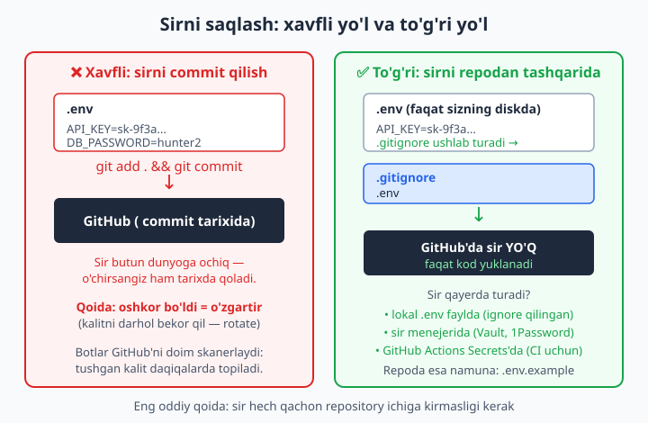
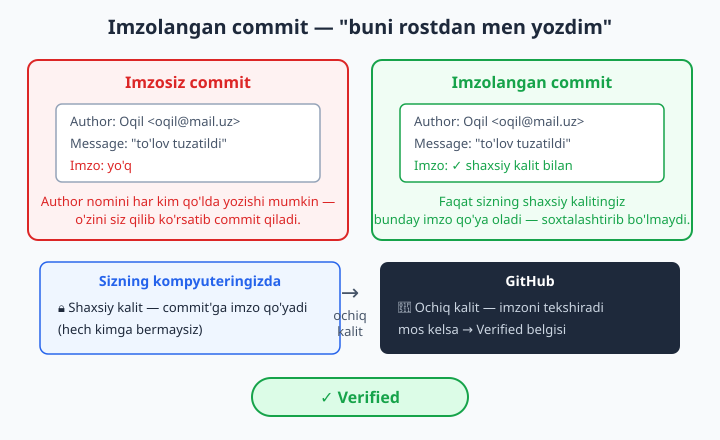
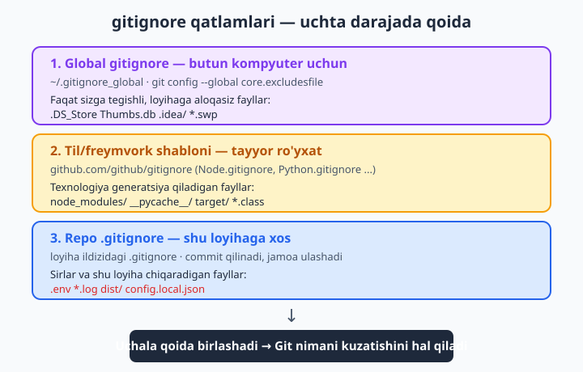

# 23 — Xavfsizlik va eng yaxshi amaliyotlar

[⬅️ Oldingi: 22 — GitHub Pages va portfolio](./22-github-pages-portfolio.md) · [🏠 README](./README.md) · [Keyingi: 24 — Yakuniy loyiha va shpargalka ➡️](./24-yakuniy-loyiha.md)

> **Bu bobda:** Git va GitHub'ni endi yaxshi bilamiz — endi ularni xavfsiz ishlatishni o'rganamiz. Eng katta xatolarni ko'rib chiqamiz va oldini olamiz: sirni (parol, API kalit, `.env`) hech qachon commit qilmaslik va agar tushib qolsa nima qilish (`.gitignore`, kalitni bekor qilish — rotate, tarixdan o'chirish), imzolangan commit va yashil **Verified** belgisi (SSH yoki GPG signing), 2FA, `main` branch'ini himoyalash (branch protection, majburiy review, status check), GitHub'ning bepul xavfsizlik vositalari (Dependabot, secret scanning, CodeQL), minimal ruxsat tamoyili (token scope, deploy key), force-push xavfi va xavfsiz `--force-with-lease`, `.gitignore` strategiyalari (global gitignore, til shablonlari) va nega Git'ning o'zi tabiiy zaxira (backup) ekanini.

---

## Muammo

Bir talaba diplom ishi uchun ob-havo ko'rsatadigan sayt yozdi. Ishlashi uchun unga pullik API kerak edi — u kalitni to'g'ridan kodga yozdi:

```javascript
const API_KEY = "sk-live-8f3a9c2e1b7d4f6a"; // ob-havo xizmati kaliti
```

Loyihasi bilan faxrlanib, uni GitHub'ga ochiq (public) qo'ydi. Ertasi kuni xizmatdan xat keldi: "Kalitingiz orqali 40 000 so'rov yuborildi, hisobingiz to'ldi". Boshqa birovning boti uning kalitini topib olgan va o'z maqsadida ishlatgan edi.

Talaba kalitni kodidan o'chirdi, yangi commit qildi va "tuzatdim" deb o'yladi. Lekin kalit **tarixda** qoldi: GitHub'da har bir eski commit'ni ochib ko'rish mumkin. Va eng muhimi: kalit bir marta ko'rinib bo'lgani uchun, uni o'chirish endi ahamiyatsiz — uni allaqachon nusxalab olishgan.

Bu bob ana shunday xatolarning oldini olish haqida. Git va GitHub juda kuchli, lekin shu kuch tufayli xatolar ham qimmatga tushadi: bir sirni oshkor qilsangiz, pul yoki ma'lumotni yo'qotishingiz mumkin; tarixni noto'g'ri o'zgartirsangiz, jamoadoshlaringizning ishini buzasiz. Yaxshi xabar: bu xatolarning deyarli hammasini bir nechta oddiy odat bilan oldini olish mumkin. Shularni o'rganamiz.

## 1-qoida: sirni hech qachon commit qilmang

**Sir (secret)** — bu kim biror narsaga kirish huquqini beradigan har qanday maxfiy qator: parol, API kalit (xizmatga ulanish uchun maxfiy kod), token, baza ulanish satri (connection string), shaxsiy kalit fayllari. Asosiy qoida bitta:

📌 **Sir hech qachon repository ichiga kirmasligi kerak.** Faqat ochiq (public) repoda emas — yopiq (private) repoda ham. Private repoga jamoadoshlar, sobiq xodimlar, kelajakda kim qo'shilishi noma'lum bo'lgan odamlar kira oladi; repo bir kun ochiq bo'lib qolishi mumkin; nusxalar boshqa kompyuterlarda yotadi. Sir kodda emas, kod **yonida** turishi kerak.

Sirni qayerda saqlaymiz? Sir kompyuteringizdagi alohida faylda turadi (odatda `.env`), Git esa bu faylni **ko'rmaydi** — chunki biz uni `.gitignore`ga yozamiz:

```bash
# .env fayli — diskingizda bor, lekin Git uni kuzatmaydi
API_KEY=sk-live-8f3a9c2e1b7d4f6a
DB_PASSWORD=hunter2
```

```gitignore
# .gitignore fayli — bu repoda commit qilinadi
.env
.env.local
*.key
*.pem
```

Kod esa sirni faylga emas, atrof-muhit o'zgaruvchisidan (environment variable) o'qiydi:

```javascript
const API_KEY = process.env.API_KEY; // kod sirning o'zini bilmaydi
```



💡 **`.env.example` qoldiring.** Jamoadoshingiz loyihani klon qilganda qaysi o'zgaruvchilar kerakligini bilishi uchun, qiymatsiz namuna fayl commit qiling:

```bash
# .env.example — bu commit qilinadi (sir yo'q, faqat nomlar)
API_KEY=
DB_PASSWORD=
```

**Tekshirib ko'rish.** `.gitignore`ni qo'shgach, sir haqiqatan ham e'tiborsiz qoldirilayotganini tasdiqlang:

```bash
git status            # .env ro'yxatda KO'RINMASLIGI kerak
git check-ignore -v .env
```

Ikkinchi buyruq qaysi qator faylni ushlab turganini ko'rsatadi:

```text
.gitignore:1:.env	.env
```

✅ `.env` `git status`da chiqmasa — yaxshi, Git uni kuzatmayapti.
❌ Agar `.env` `git status`da "Untracked files" emas, balki oddiy o'zgarish bo'lib chiqsa, demak uni allaqachon kuzatib qo'ygansiz — keyingi bo'limda buni tuzatamiz.

## Sir tushib qolsa nima qilish kerak

Aytaylik, kech qoldingiz: sir allaqachon commit qilingan, balki GitHub'ga push ham qilingan. Birinchi va eng muhim qadam:

📌 **Oshkor bo'ldi = o'zgartir.** Sir bir marta ko'ringan bo'lsa, uni "o'chirish" yetarli emas — uni **bekor qilish (rotate)** kerak. Ya'ni xizmat panelida (masalan API beradigan saytda) eski kalitni o'chirib, **yangi** kalit yarating. Eski kalit shu lahzadan ishlamay qoladi, kim nusxalab olgan bo'lsa ham foydasiz. Bu birinchi qadam, chunki kalit GitHub'ga tushgan zahoti botlar uni topib oladi — ba'zan daqiqalar ichida.

Faqat kalitni almashtirgandan **keyin** tarixni tozalaymiz. Eng oddiy holat — sir hozir kuzatilayapti, lekin uni endigina qo'shgansiz va hali push qilmadingiz. Unda faylni kuzatuvdan chiqarish kifoya:

```bash
# Faylni Git kuzatuvidan chiqar, lekin diskda qoldir:
git rm --cached .env
echo ".env" >> .gitignore
git add .gitignore
git commit -m "fix: .env kuzatuvdan chiqarildi"
```

📌 `git rm --cached` — fayl **diskingizda qoladi** (sizga kerak-ku), lekin Git endi uni kuzatmaydi. Oddiy `git rm` esa faylni diskdan ham o'chiradi — bu yerda bizga kerakmas.

Lekin diqqat: bu yangi commit yaratadi, eski commit'lar esa sirni hali ham saqlaydi. Sirni **butun tarixdan** olib tashlash uchun tarixni qayta yozish kerak. Buning eng oson vositasi — `git filter-repo` (tashqi vosita, alohida o'rnatiladi):

```bash
# Butun tarixdan .env faylini butunlay o'chirish:
git filter-repo --path .env --invert-paths
```

📌 Tarixni qayta yozish — jiddiy amal: u barcha commit hash'larini o'zgartiradi. Agar repo'da boshqalar ishlayotgan bo'lsa, ularni ogohlantiring (shu bobning quyidagi "Force-push xavfi va `--force-with-lease`" bo'limidagi xavfsiz force-push qoidalariga qarang). Lekin yana takrorlaymiz: tarixni tozalash **ikkinchi darajali** ish. Birinchi va asosiy himoya — kalitni bekor qilish. Tarix tozalandi-yu, kalit eski qolsa, foydasi yo'q.

### Sirni qanday qidirish kerak

Eski commitlarda sir bormi-yo'qmi qanday bilamiz? 17-bobdagi "pickaxe" qidiruvi (`-S`) shu yerda asqotadi — u qaysi commit biror qator matnni **qo'shgan yoki o'chirganini** topadi:

```bash
# Tarixda "hunter2" so'zi qachon paydo bo'lganini topish:
git log --oneline -S 'hunter2'

# Aniq fayl tarixida sir izlash:
git log -p -- config.env | grep -i password
```

Natija (har safar hash boshqacha bo'ladi):

```text
f4e5d6c sir olib tashlandi (config tozalandi)
a1b2c3d config qoshildi (xato: sir ichida)
```

📌 Diqqat: `-S` o'sha qatorni **qo'shgan** commitni ham, **o'chirgan** commitni ham ko'rsatadi — shuning uchun ro'yxatda kamida ikkita commit chiqishi mumkin. Bu yaxshi: sir tarixda qachon paydo bo'lib, qachon yo'qolganini ikkalasini ham ko'rasiz.

💡 Bu qo'lda qidiruv. GitHub esa buni **avtomatik** qiladi — quyida "secret scanning" haqida o'qiysiz: GitHub mashhur xizmatlarning kalit shakllarini taniydi va sir tushsa o'zi ogohlantiradi.

## Imzolangan commit va Verified belgisi

`git config user.name` va `user.email`ni eslang (2-bob): bu qiymatlarni har kim **qo'lda yozishi mumkin**. Ya'ni men o'z kompyuterimda `user.name`ni "Linus Torvalds" deb qo'yib, uning emaili bilan commit qilsam — tarixda go'yo Linus yozgandek ko'rinadi. Hech qanday parol so'ralmaydi. Author maydoni — shunchaki yorliq, isbot emas.

Imzolangan commit (signed commit) shu muammoni hal qiladi. Siz commit'ni **shaxsiy kalitingiz** bilan muhrlaysiz — bu muhrni boshqa hech kim qo'ya olmaydi. GitHub esa sizning **ochiq kalitingiz** bilan muhrni tekshiradi va mos kelsa, commit yoniga yashil **Verified** belgisini qo'yadi.



2026 holatida eng oson yo'l — **SSH kalit bilan imzolash**. Agar 12-bobda SSH kalit yaratgan bo'lsangiz (ed25519), yangi kalit yaratish shart emas — xuddi o'shani ishlatasiz:

```bash
# Git'ga: imzo formati SSH, kalit — push uchun ishlatadiganim:
git config --global gpg.format ssh
git config --global user.signingkey ~/.ssh/id_ed25519.pub

# Har bir commit'ni avtomatik imzola:
git config --global commit.gpgsign true
```

Endi har commit imzolanadi. Tekshirish:

```bash
git commit -m "feat: imzolangan birinchi commit"
git log --show-signature -1
```

Buning ishlashi uchun bitta qadam GitHub tomonida: **Settings → SSH and GPG keys → New SSH key** bo'limida o'sha ochiq kalitni "Signing Key" turi bilan qo'shing (push uchun ishlatadigan "Authentication Key"dan alohida yozuv). Shundan keyin GitHub sizning imzolangan commitlaringizga **Verified** belgisini beradi.

📌 GPG ham mumkin, lekin u eskiroq va sozlash murakkabroq (alohida kalit, parol, `gpg` dasturi). Yangi boshlayotgan bo'lsangiz, SSH imzolash ancha oson — chunki kalit allaqachon bor.

💡 **`--global` nega muhim?** Yuqorida `--global` ishlatdik — demak sozlama butun kompyuteringizdagi barcha repolarga tegishli. Bir marta sozlab, har joyda imzolangan commit qilasiz.

📌 Lokalda imzoni o'zingiz ham tekshirishingiz mumkin: `git verify-commit <hash>`. Bu, ayniqsa, boshqa odamning commit'i rostdan o'shaniki ekanini bilmoqchi bo'lsangiz foydali.

## Hisobingizni himoyalash: 2FA

Hammasidan oldin — **GitHub hisobingizning o'zi** himoyalangan bo'lishi kerak. Agar kimdir parolingizni bilib olsa, hamma repolaringizga, sirlaringizga, hatto o'zgartirish huquqiga ega bo'ladi.

📌 **2FA (two-factor authentication — ikki bosqichli tasdiqlash)** ni yoqing. 2FA bilan kirish uchun parol yetarli emas: telefondagi ilova ko'rsatadigan vaqtinchalik kod ham kerak. Parolingizni o'g'irlagan odam telefoningizsiz kira olmaydi. 2026 holatida GitHub uni hissa qo'shuvchilar uchun majburiy qildi — yoqmagan bo'lsangiz, yoqing: **Settings → Password and authentication → Two-factor authentication**.

💡 Eng yaxshi 2FA usuli — passkey yoki autentifikator ilovasi (Google Authenticator, Authy). SMS ham bor, lekin u zaifroq — imkon bo'lsa ilovani tanlang. Va **zaxira kodlarini** (recovery codes) xavfsiz joyga saqlang: telefonni yo'qotsangiz, faqat shular hisobni qaytarib beradi.

📌 Eslatma (12-bobdan): parol bilan `git push` 2026 holatida **umuman ishlamaydi**. Push uchun SSH kalit yoki personal access token (PAT) ishlatiladi. 2FA esa veb-saytga kirishni himoya qiladi — bu ikki alohida narsa, ikkalasi ham kerak.

## main branch'ini himoyalash (branch protection)

14-bobda muammoni ko'rgan edik: kimdir to'g'ridan `main`'ga ishlab, saytni buzib qo'ydi. **Branch protection (branch himoyasi)** — GitHub'ning shu muammoni hal qiladigan vositasi. U `main`ga to'g'ridan, tekshiruvsiz o'zgarish kirishiga yo'l qo'ymaydi.

GitHub'da: **Settings → Branches → Add branch ruleset** (yoki eski interfeysda "Add rule"). Eng foydali sozlamalar:

| Sozlama | Nima qiladi | Qaysi muammodan saqlaydi |
|---|---|---|
| Require a pull request before merging | `main`'ga faqat PR orqali qo'shiladi | Hech kim to'g'ridan `main`'ni o'zgartira olmaydi |
| Require approvals (masalan 1) | PR'ni kamida bitta odam tasdiqlashi shart | Tekshirilmagan kod merge bo'lmaydi |
| Require status checks to pass | CI (testlar) yashil bo'lmasa, merge yo'q | Buzuq kod `main`'ga tushmaydi |
| Require signed commits | Faqat imzolangan (Verified) commitlar | Soxta author'li commit kirmaydi |
| Block force pushes | Force-push taqiqlanadi | Tarix qayta yozilib, ish yo'qolmaydi |

📌 Branch protection — bu jamoa intizomini **avtomatlashtirish**. Odam "esidan chiqarib" to'g'ridan main'ga push qila olmaydi: qoidaning o'zi yo'l qo'ymaydi. Hatto bitta o'zingiz ishlayotgan loyihada ham foydali — beparvolik qilib o'z ishingizni buzib qo'yishdan saqlaydi.

💡 Yangi boshlovchi uchun minimal to'plam: "Require a pull request before merging" + "Require approvals: 1". Bu ikkitasi katta loyihalardagi xatolarning aksariyat qismini to'sadi.

## GitHub'ning bepul xavfsizlik vositalari

GitHub repoyangizni avtomatik kuzatib turadigan bir nechta bepul vosita beradi. Ularni **Settings → Security** bo'limida yoqasiz:

**Dependabot** — loyihangiz tashqi paketlarga (kutubxonalarga) bog'liq bo'ladi. Ulardan birida xavfsizlik teshigi topilsa, Dependabot sizga ogohlantirish yuboradi va ko'pincha tuzatib beradigan PR'ni o'zi ochadi. Siz faqat tasdiqlaysiz.

**Secret scanning** — GitHub commitlaringizni va push'laringizni mashhur xizmatlarning kalit shakllariga qarab skanerlaydi. Sir tushib qolsa, ogohlantiradi; "push protection" yoqilgan bo'lsa, sirli commit'ni push qilishning oldini ham oladi. Ochiq repolar uchun bu bepul va avtomatik yoqilgan.

**CodeQL (code scanning)** — kodingizdagi xavfsizlik xatolarini (masalan SQL injection ehtimoli) avtomatik qidiradigan vosita. **Settings → Security → Code scanning** orqali yoqiladi — GitHub Actions'da ishlaydi (20-bob).

📌 Bularning hammasi sizga qarshi emas, sizga **yordam berish** uchun. Yoqib qo'ying — keyin foniy ishlaydi va kerak bo'lganda ogohlantiradi. Tekin xavfsizlik bo'yicha yordamchidan voz kechmang.

## Minimal ruxsat tamoyili

Xavfsizlikdagi oltin qoida: **har bir kalit, token yoki ruxsatga faqat kerakli vazifaga yetadigancha huquq bering — ortig'ini emas.** Buni "minimal ruxsat" (least privilege) tamoyili deyiladi. Mantiq oddiy: agar token o'g'irlansa, zarari uning huquqi qadar bo'ladi. Huquq qancha kam — zarar shuncha kam.

Amalda nima qilamiz:

- **Token scope (token huquqi doirasi).** Personal access token yaratganda (12-bob), unga faqat kerakli huquqni bering. "Fine-grained" token tanlang, faqat zarur reponi belgilang, faqat kerakli ruxsatni (masalan "Contents: read") yoqing. Hammasini belgilab "admin" token yasamang.
- **Token muddati (expiration).** Tokenga muddat qo'ying (masalan 90 kun). Cheksiz token — yo'qolsa, abadiy xavf.
- **Deploy key.** Bitta repoga avtomatik kirish kerak bo'lsa (masalan server kod tortib olishi uchun), shaxsiy SSH kalitingizni ishlatmang. Faqat **o'sha bitta repoga** tegishli alohida "deploy key" yarating, imkon bo'lsa "read-only". Bu kalit o'g'irlansa, faqat bitta repo xavf ostida bo'ladi, butun hisobingiz emas.
- **CI sirlari.** GitHub Actions'da (20-bob) sirni **Settings → Secrets and variables → Actions** ga yozing, kodga emas. Workflow ularni `${{ secrets.NAME }}` orqali oladi va GitHub ularni loglarda ham yashiradi.

💡 Repodan chiqib ketgan jamoadoshning ruxsatini, ishlatilmayotgan tokenni, eski deploy key'ni vaqti-vaqti bilan ko'rib chiqing va o'chiring. "Bo'lsa-bo'laversin" deb qoldirilgan ruxsat — kelajakdagi teshik.

## Force-push xavfi va --force-with-lease

`git push --force` — qudratli, lekin xavfli buyruq. U remote'dagi tarixni sizning lokal tarixingiz bilan **majburan almashtiradi**. Muammo: agar siz oxirgi marta pull qilganingizdan keyin jamoadoshingiz `main`'ga yangi commit push qilgan bo'lsa, oddiy `--force` uning ishini **butunlay o'chirib tashlaydi**. U yo'qoladi, ogohlantirishsiz.

Yechim — `--force-with-lease`:

```bash
# Xavfli — boshqaning ishini so'rovsiz o'chiradi:
git push --force

# Xavfsiz — remote kutganimdek bo'lsagina push qiladi:
git push --force-with-lease
```

📌 `--force-with-lease` ("ijara bilan majburlash") qanday ishlaydi? U push qilishdan oldin tekshiradi: "remote hali ham men oxirgi ko'rgan holatdami?". Agar shu vaqt ichida kimdir yangi commit qo'shgan bo'lsa (ya'ni remote o'zgargan bo'lsa), push **rad etiladi** — sizni to'xtatadi va avval `git fetch` qilib, o'zgarishni ko'rishga majbur qiladi. Hech kimning ishi yo'qolmaydi.

```text
! [rejected] main -> main (stale info)
error: failed to push some refs
```

✅ Rebase yoki tarix tozalashdan keyin push kerak bo'lsa — doim `--force-with-lease` ishlating, `--force` emas.
❌ `--force` ni faqat haqiqatan yolg'iz ishlayotgan, boshqa hech kim tegmaydigan branchda va aniq nima qilayotganingizni bilganda ishlating.

📌 Eng yaxshisi: `main` kabi umumiy branch'larda force-push'ni branch protection bilan **butunlay bloklang** (yuqoridagi jadval). Unda hech kim — siz ham — xato bilan tarixni buza olmaydi.

## .gitignore strategiyalari

`.gitignore`ni 4-bobda ko'rgan edik. Endi uni xavfsizlik nuqtai nazaridan uch qatlamga ajratamiz — har qaysi qatlam o'z vazifasini bajaradi:



**1. Global gitignore — butun kompyuter uchun.** Faqat sizga tegishli, loyihaga aloqasi yo'q fayllar bor: muharriringiz yaratadigan papkalar (`.idea/`, `.vscode/`), operatsion tizim fayllari (`.DS_Store`, `Thumbs.db`). Bularni har bir loyiha `.gitignore`siga yozish o'rniga, bir marta global qilamiz:

```bash
# Global ignore faylini yarat va Git'ga uni ko'rsat:
git config --global core.excludesfile ~/.gitignore_global
```

So'ng `~/.gitignore_global` fayliga yozing:

```gitignore
.DS_Store
Thumbs.db
.idea/
.vscode/
*.swp
```

💡 Nega global? Chunki `.idea/` faqat siz IntelliJ ishlatganingiz uchun chiqadi — jamoadoshingiz boshqa muharrir ishlatsa, bu unga aloqasiz. Shaxsiy narsani jamoa `.gitignore`siga aralashtirmang.

**2. Til/freymvork shabloni — tayyor ro'yxat.** Har bir texnologiyaning o'zi generatsiya qiladigan papkalari bor: Node uchun `node_modules/`, Python uchun `__pycache__/`, Java uchun `target/`. Bularni qo'lda yozish shart emas — GitHub'da tayyor shablonlar bor (`github.com/github/gitignore`). Yangi repo ochganda GitHub "Add .gitignore" tugmasi orqali tilni tanlasangiz, shu shablonni o'zi qo'yadi.

**3. Repo `.gitignore` — shu loyihaga xos.** Bu fayl loyiha ildizida turadi, commit qilinadi va butun jamoa ulashadi. Bu yerda eng muhim narsa — **sirlar** va shu loyiha chiqaradigan fayllar:

```gitignore
# Sirlar — eng muhimi
.env
.env.local
*.key
*.pem

# Loyiha chiqaradigan fayllar
dist/
build/
*.log

# Lokal sozlamalar
config.local.json
```

📌 Tartib muhim emas — bu uch qatlam **birga ishlaydi**. Git fayl uchun uchala qoidani tekshiradi: agar birortasi uni ushlasa, fayl kuzatilmaydi. Qaysi qatlam ushlaganini bilish uchun `git check-ignore -v <fayl>` ishlatish mumkin.

## Git'ning o'zi — tabiiy zaxira (backup)

Oxirgi, lekin muhim fikr. 1-bobda Git **taqsimlangan (distributed)** ekanini aytgandik — endi buning xavfsizlik tomonini ko'ramiz.

📌 Git'da har bir klon — **butun tarixning to'liq nusxasi**. Siz repoyangizni 4 ta jamoadosh klon qilgan bo'lsa, dunyoda kamida 5 ta to'liq nusxa bor: sizning kompyuteringiz, ularning 4 tasi va GitHub. GitHub serveri yonib ketsa ham, har bir klondan butun loyihani tiklash mumkin. Bu — markazlashgan tizimlarda yo'q ulkan ustunlik.

Lekin shunga ortiqcha ishonib qolmang:

💡 GitHub — qulay markaziy nuqta, lekin u yagona "haqiqat manbasi" bo'lsa, hisobingiz bloklanganda yoki o'chirib qo'yilganda muammo bo'ladi. Muhim loyihalar uchun: vaqti-vaqti bilan boshqa joyga ham push qiling (masalan ikkinchi remote — GitLab yoki shaxsiy server), yoki muhim repolarni boshqa diskka klon qilib qo'ying. "Bitta nusxa — nol nusxa" degan eski qoida bu yerda ham amal qiladi.

✅ Git push qilganingiz — bu allaqachon zaxira. Tez-tez push qiling: lokal kompyuteringiz buzilsa, ishingiz remote'da omon qoladi.

## Qisqacha xavfsizlik shpargalkasi

| Xavf | Himoya | Buyruq / joy |
|---|---|---|
| Sir commit qilinib qoldi | `.gitignore`, sirni kodning tashqarisida saqlash | `.env` + `.gitignore` |
| Sir tushib ketdi | Avval kalitni bekor qil (rotate), keyin tarixdan o'chir | `git rm --cached`, `git filter-repo` |
| Soxta author | Imzolangan commit | `commit.gpgsign true` + Verified |
| Hisob o'g'irlanishi | 2FA | GitHub Settings → 2FA |
| `main`'ga to'g'ridan o'zgarish | Branch protection | Settings → Branches |
| Eskirgan paket teshigi | Dependabot | Settings → Security |
| Ortiqcha huquqli token | Minimal scope, muddat, deploy key | PAT sozlamalari |
| Force-push ish o'chirdi | `--force-with-lease` + force-push blok | `git push --force-with-lease` |
| Ma'lumot yo'qolishi | Tez-tez push, qo'shimcha nusxa | `git push` |

📌 Hammasini bir kunda qilish shart emas. Bugun eng muhim ikkitasini yoqing: `.env`ni `.gitignore`ga qo'shing va hisobingizga 2FA yoqing. Qolganini loyiha o'sgani sayin qo'shib borasiz. Xavfsizlik — bir martalik ish emas, odat.

## 23-bob mashqlari

1. Sinov papkasida yangi repo yarating (`git init`), ichiga `.env` fayli yarating va unga `API_KEY=test123` yozing. Keyin `.gitignore` yarating, `.env`ni ichiga qo'shing. `git status`da `.env` ko'rinmayotganini tasdiqlang.

2. Yuqoridagi repoda `git check-ignore -v .env` ishlatib, qaysi qator faylni ushlab turganini aniqlang. Natijani o'z so'zlaringiz bilan izohlang.

3. Sinov repoda `.env.example` fayli yarating (qiymatsiz, faqat o'zgaruvchi nomlari bilan) va uni commit qiling. Nega bu fayl commit qilinadi, `.env` esa yo'q — yozib tushuntiring.

4. Tuzoq ssenariysi: sinov repoda avval `.env`ni `.gitignore`siz commit qilib qo'ying (kuzatilib qolsin). Keyin `git rm --cached .env` bilan kuzatuvdan chiqaring, `.env`ni `.gitignore`ga qo'shing va commit qiling. `git ls-files`da `.env` endi yo'qligini, lekin diskda turganini tasdiqlang.

5. Sinov repo tarixida sirni qidiring: bir necha commit qilib, ulardan birida `SECRET=abc123` qatori bo'lsin. `git log --oneline -S 'abc123'` bilan qaysi commit uni qo'shganini toping.

6. `.env`da sir tushib qolgan deylik. "Oshkor bo'ldi = o'zgartir" qoidasini amalda nima qilish kerakligini ketma-ketlik sifatida (1, 2, 3...) yozib chiqing: birinchi qadam nima, oxirgisi nima?

7. SSH imzolashni sozlang: `git config --global gpg.format ssh`, `git config --global user.signingkey ~/.ssh/id_ed25519.pub` va `git config --global commit.gpgsign true` buyruqlarini bajaring. `git config --get commit.gpgsign` bilan yoqilganini tasdiqlang.

8. Sinov repoda imzolangan commit qiling va `git log --show-signature -1` bilan imzo ma'lumotini ko'ring. (Agar SSH kalitingiz bo'lmasa, avval 12-bobdagidek `ssh-keygen -t ed25519` bilan yarating.)

9. Imzosiz commit'ning xavfini amalda ko'rsating: sinov repoda `git config user.name "Boshqa Odam"` va `git config user.email birovniki@example.com` qo'yib commit qiling, keyin `git log`da author maydonini ko'ring. Bu nima uchun imzo kerakligini ko'rsatadi — bir abzasda yozing.

10. GitHub hisobingizga 2FA yoqing (yoki yoqilgan bo'lsa, sozlamani toping). Qaysi 2FA usuli (passkey, autentifikator ilovasi, SMS) eng xavfsiz va nega — yozib tushuntiring. Zaxira kodlarini qayerga saqlash kerak?

11. GitHub'da sinov repo oching va `main` branch'iga branch protection qo'ying: kamida "Require a pull request before merging" sozlamasini yoqing. Keyin to'g'ridan `main`'ga push qilishga urinib, GitHub nima deyishini ko'ring.

12. Branch protection jadvalidagi beshta sozlamadan (PR talab, approval, status check, signed commits, block force push) har biri qaysi aniq muammodan saqlashini bir jumladan yozib chiqing.

13. GitHub repoyangizda Dependabot'ni yoqing (Settings → Security). Dependabot ogohlantirish topsa nima qilishini va u qanday yordam berishini 2-3 jumlada tushuntiring.

14. Minimal ruxsat tamoyilini o'z so'zlaringiz bilan tushuntiring. Keyin: nega serverga repo tortib olish uchun shaxsiy SSH kalitingizdan ko'ra "deploy key" ishlatish xavfsizroq — misol bilan yozing.

15. Fine-grained personal access token yarating (yoki yaratish oynasini oching): faqat bitta repoga, faqat "Contents: read" huquqi bilan va 30 kunlik muddat qo'ying. Nega "hamma narsaga ruxsat" beruvchi token yaratmaslik kerakligini izohlang.

16. `git push --force` va `git push --force-with-lease` farqini bitta jumlada ayting. Keyin ssenariy yozing: qaysi vaziyatda `--force` jamoadoshingizning ishini yo'qotadi, `--force-with-lease` esa saqlab qoladi?

17. Sinov uchun ikki klon ssenariysini simulyatsiya qiling: bitta reponi ikki marta klon qiling, birinchisida commit qilib push qiling, ikkinchisidan (eski holatda) `--force-with-lease` bilan push qilishga urinib ko'ring va Git uni rad etishini kuzating.

18. Global gitignore sozlang: `git config --global core.excludesfile ~/.gitignore_global` qiling va `~/.gitignore_global` fayliga `.DS_Store`, `.idea/`, `.vscode/` yozing. Nega bu fayllar global ignore'ga to'g'ri keladi, loyiha `.gitignore`siga emas — tushuntiring.

19. `.gitignore`ning uch qatlamini (global, til shabloni, repo) bir jadvalda yozing: har qatlamga ikkitadan misol fayl va u qaysi maqsadga xizmat qilishini ko'rsating.

20. "Git tabiiy zaxira" tushunchasini sinab ko'ring: sinov repoyangizni boshqa papkaga klon qiling, birinchi papkani o'chiring va klondan loyiha to'liq tiklanganini tasdiqlang. Keyin: GitHub'gagina ishonib qolmaslik uchun qo'shimcha qanday zaxira choralarini ko'rish mumkin — uchta usul sanang.
