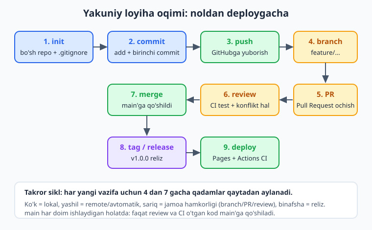
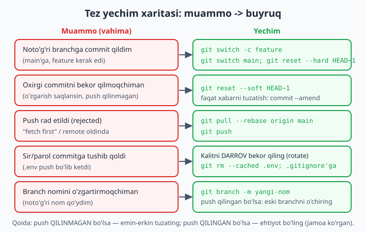
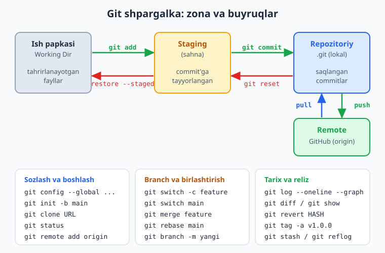

# 24 — Yakuniy loyiha va shpargalka

[⬅️ Oldingi: 23 — Xavfsizlik va eng yaxshi amaliyotlar](./23-xavfsizlik-amaliyot.md) · [🏠 README](./README.md)

> **Bu bobda:** kitob davomida o'rgangan hamma narsani bitta haqiqiy loyihada birlashtirib, jamoa ishini boshidan oxirigacha simulyatsiya qilamiz — bo'sh papkadan `git init` qilish, `.gitignore` qo'yish, birinchi commitlar, GitHubga push, feature branch ochish, Pull Request, review, konflikt hal qilish, merge, tag/release va GitHub Pages'ga deploy. So'ng eng ko'p uchraydigan vahimali vaziyatlarni ("noto'g'ri branchga commit qildim", "oxirgi commitni bekor", "push rad etildi", "sir tushib qoldi", "branch nomini o'zgartirish") tinch hal qilamiz, to'liq buyruq shpargalkasini bitta jadvalda yig'amiz va keyingi o'rganish yo'lini belgilaymiz.

---

## Muammo

Yigirma uch bob ichida juda ko'p narsa o'rgandingiz: commit, branch, merge, rebase, push, pull, PR, Actions. Lekin bilim parcha-parcha bo'lib qolishi mumkin — har bob o'z mavzusini alohida ko'rsatdi. Endi savol: bularning hammasi **birga** qanday ishlaydi? Haqiqiy loyihada, boshidan oxirigacha?

Tasavvur qiling: siz va ikki kursdoshingiz diplom uchun kichik veb-sayt qilyapsiz. Hech kim ortiqcha gap bilan vaqt yo'qotmaydi: "men shu qismni qilaman", "men buni". Lekin bir hafta o'tib papka chalkashib ketadi — kim nimani o'zgartirgani noma'lum, kodlar ustma-ust yozilib qolgan, kimningdir parol fayli GitHubga ketib qolgan. Bu — Git'siz holat. Sizda esa boshqacha bo'ladi.

Bu bobda biz aynan o'sha jamoa ishini **noldan** quramiz. Bitta bo'sh papkadan boshlab, professional jamoa qanday ishlasa — xuddi shunday. Har bosqichni o'z qo'lingiz bilan bajarib, o'rganganlaringizni bitta zanjirga tizib chiqasiz. Oxirida sizda ishlaydigan repozitoriy, public sayt va o'zingizning shaxsiy ish uslubingiz bo'ladi.



Yo'l aniq: yuqoridagi diagrammadagi to'qqiz bosqichni birma-bir bosib o'tamiz.

---

## 1-bosqich: bo'sh repodan loyihani boshlash

Yangi papka ochib, uni Git repozitoriysiga aylantiramiz. **Repository (repozitoriy)** — Git tarixini saqlaydigan loyiha papkasi.

```bash
git init -b main portfolio
cd portfolio
git status
```

`git init -b main` — yangi repo yaratadi va asosiy branch nomini darrov `main` qilib qo'yadi (zamonaviy standart; eski `master` o'rniga). `git status` esa hozircha bo'm-bo'sh ekanini ko'rsatadi:

```text
On branch main

No commits yet

nothing to commit (create/copy files and use "git add" to track)
```

📌 `git init`ni **faqat bir marta**, loyihaning boshida bajarasiz. Agar adashib papka ichidagi papkada yana `init` qilsangiz, ichma-ich ikki repo paydo bo'lib chalkashlik chiqadi. Avval `git status` bilan tekshiring: "fatal: not a git repository" chiqsa — hali repo emas, init kerak.

💡 Bu bobda buyruqlarni o'z kompyuteringizda haqiqatan terib ko'ring. O'qib o'tib ketish — bilim bermaydi; faqat barmoq xotirasi (buyruqlarni terib o'rganish) bilan Git "qo'lingizga o'rnashadi".

## 2-bosqich: .gitignore va birinchi commit

Har loyihada Git'ga **kuzatmaslik kerak** bo'lgan fayllar bor: maxfiy sozlamalar (`.env`), yuklab olingan kutubxonalar (`node_modules/`), build natijalari (`dist/`), loglar. Bularni `.gitignore` faylida sanab beramiz — Git ularni "ko'rmaydi".

```gitignore
# Maxfiy sozlamalar - HECH QACHON commit qilinmasin
.env
.env.local

# Yuklab olingan paketlar (npm o'zi tiklaydi)
node_modules/

# Build natijalari
dist/
build/

# Loglar va vaqtinchalik fayllar
*.log
.DS_Store
```

Endi loyihaning birinchi haqiqiy fayllarini qo'shamiz va birinchi commitni qilamiz. **Commit** — bu loyihaning ma'lum bir paytdagi "suratga olingan" holati.

```bash
git add .
git commit -m "feat: loyiha boshlandi"
git log --oneline
```

```text
a1b2c3d feat: loyiha boshlandi
```

📌 `git add .` — joriy papkadagi hamma **kuzatilishi mumkin** fayllarni stagingga qo'yadi (**staging** — commitga tayyorlash zonasi). `.gitignore`'dagi fayllar bunga kirmaydi — shuning uchun `.env` xavfsiz qoladi. Birinchi `git add .`dan keyin `git status` bilan tekshiring: `.env` ro'yxatda **bo'lmasligi** kerak.

💡 Commit xabarlarida bir tartib tuting. Ko'p jamoalar "conventional commits" usulini ishlatadi: `feat:` (yangi imkoniyat), `fix:` (xato tuzatish), `docs:` (hujjat), `refactor:` (kodni tartiblash). Bu kelajakda tarixni o'qishni ancha osonlashtiradi.

## 3-bosqich: GitHubga ulanish va push

Lokal repo tayyor. Endi uni GitHubga joylaymiz — bu ham zaxira nusxa, ham jamoa bilan ulashish joyi. GitHub'da yangi, **bo'sh** repozitoriy oching (README, .gitignore, litsenziyasiz — chunki ular bizda allaqachon bor), so'ng:

```bash
git remote add origin git@github.com:foydalanuvchi/portfolio.git
git push -u origin main
```

`git remote add origin ...` — lokal repoga "origin" degan nom bilan masofadagi manzilni biriktiradi (**remote** — masofadagi repo manzili). `git push -u origin main` — `main` branchni birinchi marta yuboradi; `-u` esa "bundan keyin shu branch shu joyga ketsin" deb bog'lab qo'yadi, keyin shunchaki `git push` yetadi.

📌 URL'ning ikki turi bor: `git@github.com:...` (SSH) va `https://github.com/...` (HTTPS). Parol bilan HTTPS push **2026 yilda ishlamaydi** — GitHub uni o'chirgan. Shuning uchun SSH kalit (12-bob) yoki Personal Access Token ishlating. SSH bir marta sozlanadi-yu, keyin hech qachon parol so'ramaydi — shuning uchun jamoaviy ishda qulayroq.

💡 Agar push paytida `Permission denied (publickey)` chiqsa — SSH kalitingiz GitHubga qo'shilmagan. 12-bobga qaytib, `ssh -T git@github.com` bilan ulanishni tekshiring.

## 4-bosqich: feature branch — alohida ish maydoni

Bundan keyin **hech qachon to'g'ridan-to'g'ri `main`'da ishlamaymiz**. Har yangi vazifa uchun alohida **branch** (shox) ochamiz. Bu jamoa ishining oltin qoidasi: `main` doim ishlaydigan, "toza" holatda qoladi.

```bash
git switch -c feature/login
```

`git switch -c feature/login` — `feature/login` nomli yangi branch yaratadi va darrov unga o'tadi (`-c` — create). Endi nima qilsangiz, faqat shu branchda bo'ladi, `main`'ga tegmaydi.

```bash
# login.html ustida ishlaymiz...
git add login.html
git commit -m "feat: login sahifasi qo'shildi"
git push -u origin feature/login
```

📌 Branch nomlariga ma'no bering: `feature/login`, `fix/header-rang`, `docs/readme`. `test`, `yangi`, `asd` kabi nomlar bir hafta o'tib hech narsa anglatmaydi. `feature/` , `fix/` kabi old qo'shimcha (prefiks) branchlarni guruhlaydi va ro'yxatda chiroyli ko'rinadi.

💡 Eski darsliklarda `git checkout -b` ko'rasiz — u ham ishlaydi, lekin `git switch -c` 2026'da afzal: `checkout` juda ko'p ishni bitta o'ziga yuklab, chalkash edi; `switch` faqat branch almashtirish uchun, `restore` faqat fayl tiklash uchun — har biri bitta aniq vazifa.

## 5-bosqich: Pull Request ochish

Branchni push qilganingizdan keyin GitHub odatda sahifa yuqorisida "Compare & pull request" tugmasini ko'rsatadi. **Pull Request (PR)** — "men feature/login'dagi o'zgarishlarni main'ga qo'shishni taklif qilaman" degan rasmiy so'rov. Jamoa uni ko'rib chiqadi, izoh yozadi, keyin qabul qiladi.

PR ochishda:

- **Sarlavha** aniq bo'lsin: "Login sahifasi qo'shildi", "asd" emas.
- **Tavsif**da nima qilganingiz va nega kerakligini yozing.
- Tegishli **Issue**ga bog'lang: tavsifga `Closes #12` yozsangiz, PR merge bo'lganda 12-raqamli issue avtomatik yopiladi.

📌 PR ochilishi bilan, agar repoda CI sozlangan bo'lsa (20-bob), GitHub Actions avtomatik ishga tushadi va testlaringizni o'tkazadi. Yashil ✅ — kod sog'lom, merge qilsa bo'ladi. Qizil ❌ — avval tuzatish kerak. Bu — buzuq kod main'ga yetib bormasligining birinchi himoyasi.

💡 PR'ni kichik tuting. 1000 qatorlik bitta ulkan PR'ni hech kim diqqat bilan o'qiy olmaydi. 50-200 qatorlik kichik PR — tez ko'rib chiqiladi, kam xato qoldiradi.

## 6-bosqich: review va konflikt hal qilish

Hamkasbingiz PR'ni ochib, kodni o'qiydi, ayrim qatorlarga izoh qoldiradi: "bu nomni o'zgartirsang yaxshi bo'ladi", "bu yerda xato bor". Siz tuzatib, yana commit qilasiz — PR avtomatik yangilanadi. Bu **code review**.

Ko'pincha review davomida bitta muammo chiqadi: siz branch ustida ishlayotganda, `main` boshqalar tomonidan oldinga ketgan va o'sha **bir xil faylni** ikkalangiz ham o'zgartirib qo'ygan. Bu — **konflikt**. Branchingizni yangi `main` bilan birlashtirmoqchi bo'lganingizda Git aytadi:

```text
Auto-merging styles.css
CONFLICT (content): Merge conflict in styles.css
Automatic merge failed; fix conflicts and then commit the result.
```

Konfliktli faylni ochsangiz, Git ikkala versiyani markerlar bilan ko'rsatadi:

```text
<<<<<<< HEAD
.tugma { background: blue; }
=======
.tugma { background: green; }
>>>>>>> feature/login
```

Hal qilish — bu qo'lda qaror qabul qilish: qaysi versiya to'g'ri yoki ikkalasini birlashtirib, **markerlarni** (`<<<<<<<`, `=======`, `>>>>>>>`) **o'chirib**, kerakli kodni qoldirasiz. So'ng:

```bash
git add styles.css
git commit
```

📌 Konflikt — xato emas, oddiy holat. Git sizning o'rningizga "qaysi rang to'g'ri" deb qaror qila olmaydi — bu sizning ishingiz. Markerlardan **bittasini ham** qoldirib ketmang: `<<<<<<<` kabi belgi kodda qolsa, sayt buziladi.

💡 Konfliktni kamaytirishning eng yaxshi yo'li — branchingizni tez-tez `main` bilan yangilab turish: `git switch main`, `git pull`, `git switch feature/login`, `git merge main`. Branch qancha eski bo'lsa, konflikt shuncha ko'p bo'ladi.

## 7-bosqich: merge — main'ga qo'shish

Review tugadi, CI yashil, konflikt hal qilindi. Endi PR'ni **merge** qilamiz. GitHub'da odatda buni "Merge pull request" tugmasi bilan bajarasiz. Lokal holatda esa shunday ko'rinadi:

```bash
git switch main
git pull
git merge --no-ff feature/login
git push
```

`git merge --no-ff feature/login` — branchni `main`'ga qo'shadi. `--no-ff` ("no fast-forward") — har doim alohida birlashtirish commiti yaratadi, shunda tarixda "shu yerda feature/login qo'shildi" deb aniq ko'rinib qoladi. Bu jamoa tarixini o'qishni osonlashtiradi.

Merge tugagach branchni o'chirsa bo'ladi — ishi tugadi:

```bash
git branch -d feature/login
git push origin --delete feature/login
```

📌 `git branch -d` (kichik `d`) — faqat allaqachon merge qilingan branchni o'chiradi; merge qilinmagan bo'lsa, Git ogohlantirib to'xtatadi — ishingizni saqlab qoladi. Faqat aniq kerakmas bo'lsagina `-D` (katta) ishlating.

💡 GitHub'da PR merge bo'lgach "Delete branch" tugmasi chiqadi — bir bosishda remote branch o'chadi. Tugagan feature branchlarni o'chirib turing, aks holda repo o'nlab eski branch bilan to'lib ketadi.

## 8-bosqich: tag va release

Loyihaning birinchi to'liq versiyasi tayyor bo'ldi. Buni **tag** bilan belgilaymiz — tarixning shu nuqtasiga "v1.0.0" deb nom qo'yamiz, keyin uni osongina topamiz.

```bash
git switch main
git tag -a v1.0.0 -m "Birinchi reliz: login va asosiy sahifa"
git push origin v1.0.0
```

`git tag -a v1.0.0 -m "..."` — izohli (annotated) tag yaratadi. `-a` — tagga kim, qachon va nima uchun qo'yganini ham saqlaydi. `git push origin v1.0.0` — tagni GitHubga yuboradi (oddiy `git push` taglarni yubormaydi, alohida yuborish kerak).

📌 Versiya raqamlash uchun **semantik versiyalash** (SemVer) standartiga amal qiling: `MAJOR.MINOR.PATCH` — `v1.0.0`. PATCH (`v1.0.1`) — kichik tuzatish; MINOR (`v1.1.0`) — yangi imkoniyat; MAJOR (`v2.0.0`) — eski bilan mos kelmaydigan katta o'zgarish.

💡 GitHub'da tag asosida **Release** yaratish mumkin (Releases -> Draft a new release): tagni tanlaysiz, izoh yozasiz, kerak bo'lsa fayl (masalan tayyor `.zip`) biriktirasiz. Foydalanuvchilar shu yerdan tayyor versiyani yuklab oladi.

## 9-bosqich: deploy — GitHub Pages va Actions CI

Oxirgi bosqich — saytni dunyoga ko'rsatish. Statik sayt (HTML/CSS/JS yoki build natijasi) uchun eng oson yo'l — **GitHub Pages**. Va buni har push'da avtomatik qiladigan qilib qo'yamiz. `.github/workflows/deploy.yml` faylini yaratamiz:

```yaml
name: Deploy

on:
  push:
    branches: [ main ]

permissions:
  contents: read
  pages: write
  id-token: write

jobs:
  deploy:
    runs-on: ubuntu-latest
    steps:
      - uses: actions/checkout@v4
      - uses: actions/upload-pages-artifact@v3
        with:
          path: .
      - uses: actions/deploy-pages@v4
```

Repozitoriy **Settings -> Pages** bo'limida manbani "GitHub Actions" qilib qo'ying. Endi har `main`'ga push qilganingizda sayt avtomatik yangilanadi va `https://foydalanuvchi.github.io/portfolio` manzilida ochiladi.

📌 Bu — to'liq **CI/CD** zanjiri: PR'da test (CI), main'ga merge bo'lgach avtomatik deploy (CD). Endi siz hech narsani qo'lda yuklamaysiz — push qildingiz, qolganini robot qiladi. (Pages va Actions haqida to'liqroq 20- va 22-boblarda.)

💡 Birinchi deploy biroz vaqt oladi (1-2 daqiqa). Actions tabida jarayonni kuzating: yashil ✅ chiqsa, biroz kutib saytni oching. Qizil ❌ bo'lsa, logni ochib birinchi xato qatorni qidiring.

Mana — bo'sh papkadan to jonli saytgacha. Hamma o'rgangan narsangiz bitta zanjirda ishladi. Endi yo'lda uchraydigan tipik "vahima" holatlariga o'tamiz.

---

## Tez-tez uchraydigan vaziyatlar va yechim

Har bir dasturchi bu holatlarga tushadi. Ular qo'rqinchli ko'rinadi-yu, yechimi bir-ikki buyruq. Asosiysi — **vahima qilmaslik**: Git tarixni eslab qoladi, deyarli hamma narsani ortga qaytarish mumkin.



### "Noto'g'ri branchga commit qildim"

`main`'da turib, charchaganingizdan, yangi ishni shu yerga commit qilib qo'ydingiz. Aslida feature branchda bo'lishi kerak edi. Hali push qilmagan bo'lsangiz, yechim oson:

```bash
# 1. Commit'ni saqlab qoladigan yangi branch yarat
git switch -c feature/togri-joy
# 2. main'ga qaytib, oxirgi commitni undan olib tashla
git switch main
git reset --hard HEAD~1
```

`git switch -c feature/togri-joy` — hozirgi holatni (commit bilan birga) yangi branchga "ko'chiradi". Keyin `main`'ga qaytib, `git reset --hard HEAD~1` bilan main'dan o'sha commitni olib tashlaymiz. Commit yo'qolmadi — u yangi branchda turibdi.

📌 `git reset --hard` — kuchli buyruq, **push qilinmagan** lokal commitlar uchungina xavfsiz. Agar commit allaqachon push bo'lgan va jamoa uni ko'rgan bo'lsa, `reset --hard`dan foydalanmang — buning o'rniga `git revert` ishlating (pastda).

### "Oxirgi commitni bekor qilmoqchiman"

Ikki holat bor. **O'zgarishlarni saqlab**, faqat commitni ochib tashlamoqchimisiz (masalan unutgan faylni qo'shish uchun):

```bash
git reset --soft HEAD~1
```

`--soft` — commitni "yechadi", lekin barcha o'zgarishlar staging'da turaveradi. Tuzatib, qaytadan commit qilasiz.

Faqat commit **xabarini** tuzatmoqchimisiz?

```bash
git commit --amend -m "feat: to'g'ri yozilgan xabar"
```

📌 `--amend` ham, `reset` ham tarixni **qayta yozadi**. Shuning uchun ularni faqat **push qilinmagan** commitlarga ishlating. Push qilingan commitni amend qilsangiz, keyingi push rad etiladi va `--force` kerak bo'ladi — jamoa ishida bu xavfli.

### "Push rad etildi (rejected)"

Push qilmoqchi bo'ldingiz, lekin Git rad etdi:

```text
 ! [rejected]        main -> main (fetch first)
hint: Updates were rejected because the remote contains work that you do
hint: not have locally.
```

Bu xato emas — himoya. Ma'nosi: siz push qilmoqchi bo'lgan paytda kimdir allaqachon remote'ga yangi commit yuborgan, sizda esa u yo'q. Avval o'sha o'zgarishlarni o'zingizga tortib oling, keyin push qiling:

```bash
git pull --rebase origin main
git push
```

`git pull --rebase` — remote'dagi yangi commitlarni oladi va sizning commitlaringizni ularning **ustiga** qo'yadi, tarix tekis qoladi. Konflikt chiqsa, yuqoridagi konflikt qoidalari bilan hal qilasiz.

📌 **`git push --force` deb DARROV urinmang!** Bu hamkasbingizning yangi ishini o'chirib yuborishi mumkin. Tarixni atayin qayta yozish kerak bo'lgan kam holatlarda ham `--force` emas, `git push --force-with-lease` ishlating — u "kimdir mendan keyin push qilgan bo'lsa, to'xta" deb qo'shimcha tekshiradi va xavfsizroq.

### "Sir/parol commitga tushib qoldi"

Eng yoqimsiz holat: `.env` yoki ichida API kalit bor faylni adashib commit qilib, push ham qilib yubordingiz. Tartib bilan ish ko'ring:

```bash
# 1. Faylni Git kuzatuvidan chiqar (diskda qoladi)
git rm --cached .env
# 2. .gitignore'ga qo'sh, keyin commit qil
git commit -m "chore: .env kuzatuvdan chiqarildi"
git push
```

📌 **Eng muhim qadam — kodda emas!** Push qilingan sir endi GitHub tarixida qoldi va uni ko'rgan bo'lishlari mumkin. Shuning uchun birinchi navbatda o'sha **kalitni/parolni darhol bekor qiling** (rotate): provayder panelida eskisini o'chirib, yangisini yarating. Faylni o'chirish — ikkilamchi; chiqib ketgan sirni "qaytarib bo'lmaydi", faqat foydasiz qilish mumkin. (Xavfsizlik bo'yicha to'liqroq — 23-bob.)

💡 Tarixdan butunlay tozalash kerak bo'lsa, `git filter-repo` yoki BFG kabi maxsus vositalar bor (16-bob), lekin baribir kalitni bekor qilish — asosiy himoya.

### "Branch nomini o'zgartirmoqchiman"

Branchga noto'g'ri nom qo'ygansiz. Hali push qilmagan bo'lsangiz, bittagina buyruq:

```bash
git branch -m yangi-nom
```

Agar branch allaqachon push qilingan bo'lsa, eski nomni remote'dan ham o'chirib, yangisini yuborish kerak:

```bash
git branch -m yangi-nom
git push origin -u yangi-nom
git push origin --delete eski-nom
```

📌 Joriy branchni o'zgartirsangiz, `git branch -m yangi-nom` yetadi (eski nomni yozish shart emas). Boshqa branchni o'zgartirayotgan bo'lsangiz: `git branch -m eski-nom yangi-nom`.

📌 Umumiy qoida bu holatlarning hammasiga taalluqli: **push qilinmagan** ish — bemalol tuzatiladi, faqat sizda; **push qilingan** ish — ehtiyot bo'ling, chunki uni jamoa allaqachon ko'rgan.

## To'liq buyruq shpargalkasi

Mana kunda kerak bo'ladigan buyruqlar, vazifaga qarab guruhlangan. Buni xatcho'p qilib qo'ying — yodlash shart emas, ishlatib turib esda qoladi.



**Sozlash va boshlash**

| Vazifa | Buyruq |
|---|---|
| Ism va email sozlash | `git config --global user.name "Ism"` |
| Yangi repo yaratish | `git init -b main` |
| Mavjud reponi nusxalash | `git clone <url>` |
| Holatni ko'rish | `git status` |
| Remote ulash | `git remote add origin <url>` |

**Kundalik ish (zona harakatlari)**

| Vazifa | Buyruq |
|---|---|
| Fayllarni stagingga qo'shish | `git add <fayl>` yoki `git add .` |
| Commit qilish | `git commit -m "xabar"` |
| Stagingdan chiqarish (commitsiz) | `git restore --staged <fayl>` |
| Ish papkasidagi o'zgarishni bekor | `git restore <fayl>` |
| O'zgarishlarni ko'rish | `git diff` |

**Branch va birlashtirish**

| Vazifa | Buyruq |
|---|---|
| Yangi branch + o'tish | `git switch -c <nom>` |
| Branchga o'tish | `git switch <nom>` |
| Branchlar ro'yxati | `git branch` |
| Branchni main'ga qo'shish | `git merge <nom>` |
| Branch nomini o'zgartirish | `git branch -m <yangi>` |
| Merge qilingan branchni o'chirish | `git branch -d <nom>` |

**Remote bilan ishlash**

| Vazifa | Buyruq |
|---|---|
| Birinchi push (bog'lab) | `git push -u origin <branch>` |
| Keyingi pushlar | `git push` |
| O'zgarishlarni olish | `git pull` |
| Faqat yangilikni olib, birlashtirmaslik | `git fetch` |
| Push rad etilsa | `git pull --rebase` keyin `git push` |

**Orqaga qaytish va tuzatish**

| Vazifa | Buyruq |
|---|---|
| Oxirgi commitni ochish (saqlab) | `git reset --soft HEAD~1` |
| Oxirgi commit xabarini tuzatish | `git commit --amend` |
| Commitni xavfsiz bekor qilish (push'dan keyin) | `git revert <hash>` |
| Branchni eski holatga (push'siz) | `git reset --hard <hash>` |

**Tarix, reliz va qutqaruv**

| Vazifa | Buyruq |
|---|---|
| Qisqa tarix grafigi | `git log --oneline --graph --all` |
| Bitta commitni ko'rish | `git show <hash>` |
| Ishni vaqtincha yashirish | `git stash` keyin `git stash pop` |
| Versiya tegi qo'yish | `git tag -a v1.0.0 -m "izoh"` |
| Yo'qolgan commitni topish | `git reflog` |

💡 `git reflog` — sizning xavfsizlik to'riingiz. Hatto `reset --hard` qilib commitni "yo'qotgandek" bo'lsangiz ham, reflog so'nggi harakatlarni eslab qoladi va commit hash'ini topib, qaytarib olishingizga yordam beradi (16-bob).

## Keyingi yo'l: bu yerdan qayoqqa?

Kitobni tugatdingiz — endi Git'ni ishonch bilan ishlata olasiz. Lekin bu yo'lning oxiri emas, balki professional darajaga ko'tariluvchi to'rt yo'nalish bor:

**1. CI/CD'ni chuqurroq.** 20-bobda Actions asoslari berildi. Keyingi qadam: ko'p bosqichli pipeline (test -> build -> deploy), Docker konteynerlarini avtomatik yig'ish, deploy strategiyalari (blue-green, canary), va sirlarni xavfsiz boshqarish (environment secrets, OIDC). Bu — DevOps sohasiga kiruvchi eshik.

**2. GitOps.** Git'ni "haqiqat manbai" qilib, butun infratuzilmani (serverlar, sozlamalar) Git orqali boshqarish. Repoda nima yozsangiz — server o'shanga avtomatik moslashadi. ArgoCD, Flux kabi vositalar shu g'oyada ishlaydi.

**3. Git ichki mexanikasi (plumbing).** Git aslida sehr emas — u oddiy obyektlar (blob, tree, commit, tag) ustiga qurilgan. `git cat-file`, `git hash-object`, `.git` katalogi ichini o'rganib, Git "ostida nima borligini" tushunsangiz, eng murakkab holatlarni ham qo'rqmay hal qilasiz. Bu — Git'ni "yoddan" emas, "tushunib" bilish.

**4. Yirik loyiha asboblari.** Monorepo (bitta repoda ko'p loyiha) boshqaruvi: Nx, Turborepo, Bazel. Katta fayllar uchun Git LFS (18-bob). Ko'p jamoali repolarda CODEOWNERS, branch himoyasi va avtomatik review sozlamalari.

✅ Eng yaxshi maslahat: **ochiq kodli (open source) loyihaga hissa qo'shing** (21-bob). Haqiqiy loyihada bitta kichik tuzatish bilan PR ochish — bu kitobdagi hamma narsani amalda mustahkamlaydi va portfolioingizga real tajriba qo'shadi.

❌ Qochish kerak: hammasini bir kunda o'rganishga urinish. Git'ni kundalik ishda, kichik-kichik qadamlar bilan o'zlashtiring — har loyihada bitta yangi imkoniyatni sinab ko'ring. Bir yilda u sizning ikkinchi tilingizga aylanadi.

Yo'lingiz ochiq bo'lsin. Endi — kod yozish va uni ishonch bilan boshqarish navbati sizda.

## 24-bob mashqlari

💡 Bu mashqlar — butun kitobning yakuni. Ularni bajarib, o'zingizning haqiqiy portfolio repongizni quring. Iloji boricha har qadamni terminalda o'z qo'lingiz bilan bajaring; mashqlar tartib bilan qiyinlashadi va bir-biriga bog'lanadi.

1. Bo'sh papka oching, uni `git init -b main` bilan repoga aylantiring va `git status` chiqishini o'qib, "No commits yet" xabarini toping.
2. Loyihaga mos `.gitignore` yarating: kamida `.env`, `node_modules/`, `dist/` va `*.log` bo'lsin. Soxta `.env` fayl yaratib, `git status`'da u ko'rinmasligini tasdiqlang.
3. Birinchi haqiqiy faylni (masalan `index.html`) qo'shing, `git add` va `git commit -m "feat: ..."` bilan birinchi commitni qiling, `git log --oneline` bilan tekshiring.
4. GitHub'da bo'sh repozitoriy oching, `git remote add origin ...` bilan ulang va `git push -u origin main` bilan birinchi push'ni amalga oshiring.
5. `git switch -c feature/...` bilan yangi feature branch oching, unda kichik o'zgarish qiling, commit va push qiling.
6. GitHub'da 5-mashqdagi branch uchun Pull Request oching: sarlavha va tavsifni mazmunli yozing.
7. Ataylab `main`'dagi bir faylni va o'sha branchdagi aynan **shu** faylni boshqacha o'zgartiring. Branchni main bilan birlashtirib, konflikt hosil qiling va uni markerlarni o'chirib hal qiling.
8. Review simulyatsiyasi: PR'da o'zingizga izoh sifatida bitta "tuzatish kerak" nuqtani belgilang, keyin tuzatib qayta commit qiling va PR avtomatik yangilanganini ko'ring.
9. PR'ni merge qiling (`--no-ff` bilan yoki GitHub tugmasi orqali), keyin tugagan feature branchni lokal va remote'dan o'chiring.
10. `git tag -a v1.0.0 -m "..."` bilan birinchi reliz tegini qo'ying, `git push origin v1.0.0` bilan yuboring va GitHub'da Release yarating.
11. **Tez vaziyat:** `main`'da turib bitta commit qiling, keyin uni "noto'g'ri branchga tushdi" deb hisoblab, yangi branchga ko'chiring va main'dan `reset --hard HEAD~1` bilan olib tashlang. Commit yangi branchda saqlanib qolganini tasdiqlang.
12. **Tez vaziyat:** bitta commit qiling, so'ng `git reset --soft HEAD~1` bilan uni ochib, o'zgarishlar staging'da turganini tekshiring; keyin qaytadan commit qiling.
13. **Tez vaziyat:** commit qiling va `git commit --amend` bilan faqat uning xabarini tuzating; `git log`'da yangi xabar ko'rinishini tasdiqlang.
14. **Tez vaziyat:** ikkita lokal nusxa (yoki GitHub UI orqali) yordamida remote'ni oldinga suring, so'ng eski nusxadan push qilib `rejected` xatosini chiqaring; `git pull --rebase` va `git push` bilan hal qiling.
15. **Tez vaziyat:** adashib `.env`'ni commit qilib qo'ying, so'ng `git rm --cached .env` va `.gitignore`'ga qo'shish bilan tuzating. Izohda: agar bu haqiqiy kalit bo'lganida yana qanday qadam shart edi?
16. **Tez vaziyat:** noto'g'ri nomli branch oching va `git branch -m yangi-nom` bilan nomini o'zgartiring; push qilingan bo'lsa, eski nomni remote'dan ham o'chiring.
17. Repoga `.github/workflows/ci.yml` qo'shing: har push va PR'da oddiy test (yoki `echo`) ishlasin. PR ochib, Actions tabida yashil belgini kuzating.
18. Repoga GitHub Pages deploy workflow'ini qo'shing, Settings -> Pages'da manbani "GitHub Actions" qiling va saytingiz `github.io` manzilida ochilishini tasdiqlang.
19. O'zingizning to'liq portfolio repongizni yakunlang: mazmunli README, `.gitignore`, kamida ikkita feature branch tarixi, bitta merge, bitta tag/release va ishlaydigan Pages sayti bo'lsin.
20. Shpargalkani o'zlashtirish: bu bobdagi buyruq jadvallaridan o'zingizga eng kerakli 15 ta buyruqni tanlab, har birini kichik test repoda kamida bir marta ishlatib chiqing — keyin ularni xotirangizdan, jadvalga qaramay yozib ko'ring.
