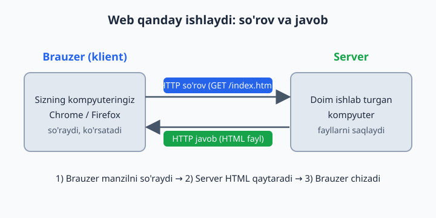
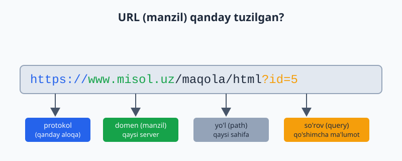
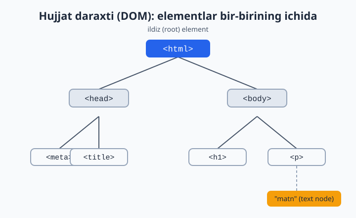
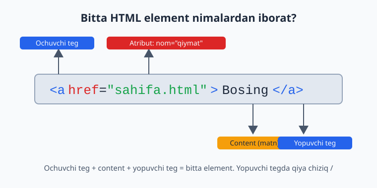

# 01 — Web va HTML asoslari

[🏠 README](./README.md) · [Keyingi: 02 — Matn elementlari ➡️](./02-matn-elementlari.md)

> **Bu bobda:** internet va web qanday ishlashini (klient-server, brauzer, HTTP so'rov-javob, DNS, URL), HTML nimaligini va nima uchun kerakligini, brauzer sahifani qanday chizishini o'rganamiz, birinchi HTML faylimizni yaratib brauzerda ochamiz, hujjat strukturasini (doctype, html, head, body), element/teg/atribut anatomiyasini, bo'sh joy va izohlarni ko'rib chiqamiz, oxirida DevTools bilan tanishamiz.

---

## 1.1 Internet va web — bu nima va ular qanday farq qiladi?

Ko'pchilik "internet" va "web" so'zlarini bir xil ma'noda ishlatadi, lekin ular bir xil emas.

- **Internet** — bu butun dunyo bo'ylab millionlab kompyuterlarni bir-biriga ulab turgan ulkan tarmoq (kabellar, optik tolalar, Wi-Fi, sun'iy yo'ldoshlar). Bu — "yo'llar" tizimi.
- **Web (World Wide Web)** — bu internet ustida ishlaydigan xizmatlardan **bittasi**: o'zaro bog'langan sahifalar tizimi. Bu — yo'llardan yuradigan "mashinalar"dan biri.

📌 Internet ustida web'dan tashqari boshqa narsalar ham ishlaydi: elektron pochta (email), video qo'ng'iroqlar, o'yinlar va hokazo. Biz bu kitobda **web** bilan, ya'ni brauzerda ochiladigan sahifalar bilan ishlaymiz.

**Nega bu farqni bilish kerak?** Chunki HTML aynan web sahifalarini yaratish uchun mo'ljallangan. Siz internetning o'zini emas, balki uning ustida ishlaydigan sahifalarni quryapsiz.

---

## 1.2 Klient va server — kim kimga nima qiladi?

Web'ning eng asosiy g'oyasi — bu **klient-server** modeli. Buni restoran orqali tasavvur qiling:

- **Klient** — mijoz (siz). Restoranda menyudan taom so'raysiz.
- **Server** — ofitsiant va oshxona. So'rovingizni tushunadi, taomni tayyorlab keltiradi.

Web'da:

- **Klient** — bu sizning **brauzeringiz** (Chrome, Firefox, Safari, Edge). U biror sahifani "so'raydi".
- **Server** — bu doim yoqilgan, internetga ulangan kuchli kompyuter. Unda sahifaning fayllari saqlanadi. U so'rovni qabul qilib, kerakli faylni "qaytaradi".

```
Klient (brauzer)  --- so'rov --->  Server
Klient (brauzer)  <--- javob ----  Server
```

💡 Siz hozir o'rganayotgan HTML fayllar oxir-oqibat aynan shunday serverda yotadi va dunyoning istalgan joyidagi odam brauzeri orqali ularni so'rab oladi.

---

## 1.3 HTTP so'rov-javob — suhbat qanday kechadi

Brauzer va server bir-biri bilan **HTTP** (HyperText Transfer Protocol — gipermatn uzatish protokoli) deb ataladigan "til" orqali gaplashadi. Protokol — bu ikki tomon kelishib olgan qoidalar to'plami, xuddi ikki kishi bir xil tilda gaplashganidek.

Jarayon oddiy:

1. Siz brauzerga `www.misol.uz` deb yozasiz.
2. Brauzer serverga **HTTP so'rov** (request) yuboradi: "Iltimos, bosh sahifani ber" (`GET /index.html`).
3. Server so'rovni qabul qiladi, kerakli HTML faylni topadi.
4. Server **HTTP javob** (response) qaytaradi: ichida HTML matni bo'lgan xabar.
5. Brauzer bu HTML'ni oladi va ekranga chiroyli sahifa qilib chizadi.



📌 `GET` — bu eng ko'p ishlatiladigan so'rov turi: "menga shu narsani **ber**" degani. Boshqa turlari ham bor (`POST` — ma'lumot **yuborish**), lekin hozircha `GET` yetarli.

💡 Har bir javob bilan birga server **holat kodi** (status code) ham yuboradi. Mashhurlari: `200` — "hammasi joyida", `404` — "bunday sahifa topilmadi". `404` xatosini hammamiz ko'rganmiz.

---

## 1.4 DNS — manzilni qanday topadi?

Bir muammo bor: kompyuterlar bir-birini nom bilan emas, **raqamli IP-manzil** orqali topadi (masalan, `93.184.216.34`). Lekin biz `www.misol.uz` kabi nomlarni eslab qolamiz, raqamlarni emas.

Bu yerda **DNS** (Domain Name System — domen nomlari tizimi) yordamga keladi. DNS — bu internetning "telefon kitobchasi":

- Siz: "`www.misol.uz` ning IP-manzili nechchi?"
- DNS: "`93.184.216.34`."

Shundan keyingina brauzer aynan o'sha IP-manzildagi serverga so'rov yuboradi.

💡 Buni telefon kontaktlariga o'xshating: siz "Ona" deb qo'ng'iroq qilasiz, telefon esa orqada haqiqiy raqamni topib ulaydi. Siz raqamni eslab qolishingiz shart emas.

---

## 1.5 URL — sahifaning to'liq manzili

**URL** (Uniform Resource Locator) — bu web'dagi har bir resursning (sahifa, rasm, fayl) noyob manzili. Uni qismlarga ajratib ko'raylik:



`https://www.misol.uz/maqola/html?id=5`

| Qism | Misol | Ma'nosi |
|------|-------|---------|
| **Protokol** | `https://` | Qanday aloqa qilinadi (`https` — xavfsiz, shifrlangan) |
| **Domen** | `www.misol.uz` | Qaysi serverga murojaat qilinmoqda |
| **Yo'l (path)** | `/maqola/html` | Server ichidagi qaysi sahifa/fayl |
| **So'rov (query)** | `?id=5` | Qo'shimcha ma'lumot (ixtiyoriy) |

⚠️ Bugungi kunda doim **`https`** (oxiridagi `s` — secure, xavfsiz) ishlatiladi. Oddiy `http` shifrlanmagan va xavfli hisoblanadi.

📌 `protokol` va `domen` majburiy; `yo'l` va `so'rov` ixtiyoriy. `www.misol.uz` ning o'zi ham yaroqli URL.

---

## 1.6 HTML nima va nima uchun kerak?

**HTML** (HyperText Markup Language — gipermatnli belgilash tili) — bu web sahifaning **strukturasini va mazmunini** tavsiflaydigan til.

E'tibor bering: HTML — bu **dasturlash tili emas**, balki **belgilash (markup) tili**. Ya'ni u "agar bunday bo'lsa, unday qil" kabi mantiqni emas, balki "bu sarlavha", "bu paragraf", "bu rasm" kabi **mazmunni belgilaydi**.

Bir hujjatni tasavvur qiling: siz qog'ozda qaysi qatorni sarlavha, qaysisini oddiy matn, qaysisini ro'yxat qilishni belgilaysiz. HTML aynan shu ishni qiladi — brauzerga "bu element nima ekanligini" aytadi.

**Nega aynan HTML kerak?**

- Brauzer faqat "matn" ko'rsa, qaysi qism sarlavha, qaysi qism paragraf ekanligini bilmaydi.
- HTML teglari orqali biz brauzerga **ma'no** (semantika) beramiz.
- Bu ma'no nafaqat ko'rinish uchun, balki qidiruv tizimlari (Google) va ekran o'qigichlar (ko'zi ojizlar uchun) uchun ham muhim.

💡 Web sahifa odatda uchta texnologiyadan iborat:
- **HTML** — struktura va mazmun (skelet).
- **CSS** — ko'rinish, ranglar, joylashuv (kiyim).
- **JavaScript** — harakat va interaktivlik (mushaklar).

Biz bu kitobda HTML va CSS bilan shug'ullanamiz. Ushbu bobda — HTML.

---

## 1.7 Brauzer HTML'ni qanday o'qiydi (rendering)

Brauzer serverdan HTML matnini olganda, uni shunchaki ko'rsatib qo'ymaydi — avval **qayta ishlaydi**. Bu jarayon **rendering** (chizish) deb ataladi. Qisqacha bosqichlari:

1. **O'qish (parsing):** brauzer HTML matnini yuqoridan pastga o'qib chiqadi.
2. **DOM qurish:** har bir tegni "tugun" (node) qilib, **daraxt** ko'rinishidagi tuzilma quradi. Bu daraxt **DOM** (Document Object Model) deb ataladi.
3. **Stil qo'shish:** CSS qoidalarini topib, har bir elementga rang, o'lcham va joylashuvni biriktiradi.
4. **Joylashtirish (layout):** har bir element ekranning qayeriga, qanday o'lchamda joylashishini hisoblaydi.
5. **Chizish (paint):** nihoyat piksellarni ekranga chizadi.

📌 Eng muhim tushuncha — **DOM daraxti**. Brauzer HTML'ni siz yozgan matn ko'rinishida emas, balki bir-birining ichiga joylashgan tugunlar daraxti ko'rinishida tushunadi. Buni 1.10-bo'limda ko'ramiz.

💡 Brauzer HTML'ni "kechirimli" o'qiydi: agar biror teg unutilgan bo'lsa, u taxmin qilib to'ldirishga harakat qiladi. Bu qulay, lekin xatolarni yashirib qo'yadi — shuning uchun HTML'ni to'g'ri yozish odat qiling.

---

## 1.8 Birinchi HTML faylingizni yaratamiz

Endi nazariyadan amaliyotga o'tamiz. HTML fayl yaratish uchun sizga faqat oddiy **matn muharriri** kerak (masalan, VS Code, Notepad). Hech qanday maxsus dastur sotib olish shart emas.

**1-qadam.** Kompyuteringizda yangi papka oching, masalan `birinchi-sayt`.

**2-qadam.** Ichida `index.html` nomli fayl yarating.

⚠️ Fayl nomi oxiri albatta **`.html`** bo'lsin. Agar Notepad ishlatsangiz, fayl `index.html.txt` bo'lib qolmasligiga e'tibor bering ("Save as type" da "All Files" tanlang).

📌 Nega `index.html`? Chunki serverlar an'anaviy ravishda papkadagi `index.html` ni "bosh sahifa" deb qabul qiladi. Bu — kelishilgan nom.

**3-qadam.** Faylga quyidagini yozing:

```html
<!DOCTYPE html>
<html lang="uz">
  <head>
    <meta charset="UTF-8">
    <title>Birinchi sahifam</title>
  </head>
  <body>
    <h1>Salom, dunyo!</h1>
    <p>Bu mening birinchi HTML sahifam.</p>
  </body>
</html>
```

**4-qadam.** Faylni saqlang va ustiga ikki marta bosing (yoki brauzerga sudrab tashlang). Brauzer ochiladi.

**Natija:** brauzerda katta qalin sarlavha "Salom, dunyo!" va uning ostida "Bu mening birinchi HTML sahifam." matni ko'rinadi. Tabriklaymiz — siz birinchi web sahifangizni yaratdingiz!

💡 Brauzer manzil satrida `file:///C:/.../index.html` kabi yo'l ko'rinadi. Bu — fayl serverdan emas, to'g'ridan-to'g'ri kompyuteringizdan ochilayotganini bildiradi. O'rganish uchun bu mutlaqo yetarli.

---

## 1.9 Hujjat strukturasi: doctype, html, head, body

Yuqoridagi kodning har bir qatori muhim. Endi uni qismlarga ajratib tushunamiz.

```html
<!DOCTYPE html>
<html lang="uz">
  <head>
    <meta charset="UTF-8">
    <title>Birinchi sahifam</title>
  </head>
  <body>
    <h1>Salom, dunyo!</h1>
  </body>
</html>
```

### `<!DOCTYPE html>`

Bu — hujjatning birinchi qatori. U brauzerga "men zamonaviy HTML (HTML5) ishlataman" deb aytadi. Bu teg emas, balki **e'lon** (declaration).

⚠️ Agar `<!DOCTYPE html>` ni unutsangiz, brauzer "quirks mode" (g'alati rejim) ga o'tib, sahifani noto'g'ri ko'rsatishi mumkin. Doim birinchi qatorga yozing.

### `<html>`

Bu — butun hujjatning **ildiz (root)** elementi. Boshqa hamma narsa shuning ichida joylashadi. `lang="uz"` atributi sahifaning tili o'zbekcha ekanligini bildiradi — bu qidiruv tizimlari va ekran o'qigichlari uchun foydali.

### `<head>` — boshqaruv qismi

`<head>` ichidagi narsalar **ekranda ko'rinmaydi**. Bu — sahifa haqidagi "meta ma'lumot" (sahifa haqidagi ma'lumot):

- `<meta charset="UTF-8">` — sahifa kodlash usuli. Bu o'zbekcha harflar (`o'`, `g'`, `sh`) va boshqa belgilar to'g'ri ko'rinishini ta'minlaydi.
- `<title>` — brauzer **tab (varaqcha)** sarlavhasida ko'rinadigan nom.

⚠️ `<meta charset="UTF-8">` ni unutsangiz, o'zbekcha matn brauzerda tushunarsiz belgilarga aylanib ketishi mumkin. Doim yozing.

### `<body>` — ko'rinadigan qism

`<body>` ichidagi hamma narsa **ekranda ko'rinadi**: sarlavhalar, paragraflar, rasmlar, tugmalar — sahifaning butun mazmuni shu yerda.

📌 Sodda qoida: **`head` — ko'rinmaydi, `body` — ko'rinadi.**

---

## 1.10 Hujjat daraxti (DOM tree)

1.7-bo'limda aytganimizdek, brauzer HTML'ni **daraxt** ko'rinishida tushunadi. Yuqoridagi kodimiz daraxt sifatida shunday ko'rinadi:



E'tibor bering:

- `<html>` — eng yuqorida, **ildiz (root)**. Hammasi shuning ichida.
- `<html>` ning ichida ikkita "bola" (child): `<head>` va `<body>`.
- `<head>` ning ichida `<meta>` va `<title>`.
- `<body>` ning ichida `<h1>` va `<p>`.
- `<p>` ning ichida esa oddiy **matn** ("text node").

Bu munosabatlarni oilaviy atamalar bilan aytamiz:

- `<head>` va `<body>` — bir-biriga **opa-singil (siblings)**, chunki bir ota ostida.
- `<html>` ularning **otasi (parent)**.
- `<meta>` — `<head>` ning **bolasi (child)**.

💡 Nega bu muhim? Chunki keyinroq CSS bilan stil berganda va JavaScript bilan ishlaganda biz aynan shu daraxt bo'ylab harakatlanamiz ("bu elementning otasini top", "bolalarini o'zgartir"). Daraxtni tushunish — keyingi hamma narsaning poydevori.

---

## 1.11 Element, teg, atribut — anatomiya

HTML butunlay **elementlardan** quriladi. Bitta elementning tuzilishini batafsil ko'raylik:



```html
<a href="sahifa.html">Bosing</a>
```

Bu yerda:

- **`<a>`** — bu **ochuvchi teg** (opening tag). Burchakli qavslar `< >` ichida element nomi.
- **`href="sahifa.html"`** — bu **atribut** (attribute). Element haqida qo'shimcha ma'lumot. U `nom="qiymat"` ko'rinishida:
  - `href` — atribut **nomi**,
  - `"sahifa.html"` — atribut **qiymati** (qo'shtirnoq ichida).
- **`Bosing`** — bu **content** (mazmun), ya'ni ochuvchi va yopuvchi teg orasidagi matn.
- **`</a>`** — bu **yopuvchi teg** (closing tag). Ochuvchi tegdan farqi — element nomidan oldin **qiya chiziq `/`** bor.

Demak: **ochuvchi teg + content + yopuvchi teg = bitta element.**

### Void (yopilmaydigan) elementlar

Ba'zi elementlarda content bo'lmaydi, shuning uchun **yopuvchi tegi ham yo'q**. Ularni **void element** deyiladi. Misollar:

```html
<br>
<hr>

<meta charset="UTF-8">
```

- `<br>` — qator tashlash (line break).
- `<hr>` — gorizontal ajratuvchi chiziq.
- `` — rasm (faqat atributlar bor, ichida matn yo'q).

📌 Void elementlar uchun `</br>` kabi yopuvchi teg **yozilmaydi** — bu xato bo'ladi.

### Bir nechta atribut

Bitta elementda bir nechta atribut bo'lishi mumkin, ular bo'sh joy bilan ajratiladi:

```html

```

💡 `alt` atributi rasm yuklanmaganda yoki ekran o'qigich uchun rasmni so'z bilan tasvirlaydi. Doim yozish tavsiya etiladi.

⚠️ Atribut qiymatini doim **qo'shtirnoq** ichiga oling: `href="..."`. Texnik jihatdan ba'zan qo'shtirnoqsiz ham ishlaydi, lekin bu xatolarga olib keladi — odat qilmang.

---

## 1.12 Ichma-ich joylashtirish (nesting)

Elementlar bir-birining ichiga joylashtiriladi (nesting). Buni **to'g'ri tartibda** yopish juda muhim.

```html
<p>Bu <strong>juda muhim</strong> gap.</p>
```

Bu yerda `<strong>` elementi `<p>` ning ichida joylashgan. Qoida: **eng oxiri ochilgan teg birinchi yopiladi** — xuddi qutilarni bir-birining ichiga joylaganday.

⚠️ Noto'g'ri (teglar kesishib ketgan):

```html
<p>Bu <strong>juda muhim</p></strong>
```

To'g'ri (ichkari teg avval yopiladi):

```html
<p>Bu <strong>juda muhim</strong></p>
```

💡 Kodni o'qishni osonlashtirish uchun ichki elementlarni **chekinish (indentation)** bilan, ya'ni bir oz ichkariroqdan yozing. Brauzer bu bo'sh joylarni e'tiborsiz qoldiradi, lekin sizga kod tushunarli bo'ladi.

---

## 1.13 Bo'sh joy (whitespace)

HTML'da **bo'sh joy** (whitespace — probel, tab, qator tashlash) maxsus tarzda ishlanadi: ketma-ket kelgan bir nechta bo'sh joy brauzer tomonidan **bitta** probelga aylantiriladi.

```html
<p>Salom        dunyo</p>
```

**Natija:** brauzerda "Salom dunyo" — faqat bitta probel bilan ko'rinadi, garchi kodda ko'p probel bo'lsa ham.

Xuddi shunday, qator tashlash ham e'tiborsiz qoldiriladi:

```html
<p>Birinchi qator
ikkinchi qator</p>
```

**Natija:** "Birinchi qator ikkinchi qator" — bitta qatorda ko'rinadi.

💡 Bu aslida foydali: siz kodni xohlagancha chekinish va qator bilan chiroyli yozasiz, brauzer esa ortiqcha bo'sh joyni o'zi tozalaydi. Agar haqiqiy qator tashlash kerak bo'lsa, `<br>` ishlating; agar bir nechta probel kerak bo'lsa, keyinroq CSS yordamida hal qilinadi.

---

## 1.14 Izohlar (comments)

Ba'zan kodga **izoh** (comment) yozish kerak bo'ladi — o'zingizga yoki boshqa dasturchiga eslatma qoldirish uchun. Izohlar brauzerda **ko'rinmaydi** va sahifaga ta'sir qilmaydi.

HTML izohi quyidagicha yoziladi:

```html
<!-- Bu izoh. Brauzerda ko'rinmaydi. -->
<p>Bu esa ko'rinadi.</p>

<!-- Pastdagi blok bosh sahifaning yuqori qismi -->
<h1>Xush kelibsiz</h1>
```

Izoh `<!--` bilan boshlanib, `-->` bilan tugaydi. Orasidagi hamma narsa e'tiborsiz qoldiriladi.

**Izohlar nima uchun kerak?**

- Kodning biror qismini **vaqtincha o'chirib** turish (sinash uchun).
- Murakkab joyni **tushuntirib** qo'yish.
- Katta faylda bo'limlarni **belgilab** qo'yish.

⚠️ Izoh ichiga maxfiy ma'lumot (parol, kalit) yozmang! Izohlar sahifaning manba kodida hamma uchun ko'rinadi — istalgan odam "View Source" orqali o'qishi mumkin.

📌 Izohni ichma-ich (`<!-- ichida <!-- boshqa izoh --> -->`) yozib bo'lmaydi — bu xato beradi.

---

## 1.15 Brauzer DevTools bilan tanishish

Har bir zamonaviy brauzerda **DevTools** (Developer Tools — dasturchi vositalari) bor. Bu — web sahifani ichidan ko'rish va tekshirish uchun kuchli asbob. Dasturchining "rentgen ko'zi" deyish mumkin.

**Ochish:**

- Sahifada **sichqoncha o'ng tugmasi** → **Inspect** (yoki "Tekshirish").
- Yoki klaviaturada **F12**.
- Yoki **Ctrl + Shift + I** (Windows) / **Cmd + Option + I** (Mac).

Ochilgan panelda bir nechta bo'lim bor. Boshlovchi uchun eng muhimi — **Elements** (Elementlar) paneli.

**Elements paneli nima ko'rsatadi?**

- Sahifaning **jonli DOM daraxtini** — ya'ni brauzer hozir tushunib turgan HTML strukturasini.
- Istalgan elementga bossangiz, u sahifada **yoritib (highlight)** ko'rsatiladi.
- Element ustiga ikki marta bosib, HTML'ni **vaqtincha o'zgartirib** ko'rishingiz mumkin (faylga ta'sir qilmaydi, faqat ko'rinishda).

💡 **Birinchi mashqingiz:** istalgan saytni oching (masalan, sevimli yangiliklar sayti), F12 bosing, Elements panelida `<h1>` yoki `<p>` elementini topib, ustiga bosing — sahifada qaysi qism yonishini ko'ring. Bu HTML strukturasini "his qilish"ning eng yaxshi yo'li.

📌 DevTools'dagi o'zgarishlar **vaqtinchalik**: sahifani yangilasangiz (F5), hamma narsa asl holiga qaytadi. Shuning uchun bemalol tajriba qiling — hech narsa buzilmaydi.

⚠️ DevTools'da ba'zan "Console" (konsol) bo'limida qizil xato xabarlari ko'rinadi. Hozircha ulardan qo'rqmang — keyingi boblarda nimaligini tushunamiz.

---

## Mashqlar

Quyidagi mashqlarni ketma-ket bajaring. Har birida avval o'zingiz urinib ko'ring, keyin yechimni oching.

### Mashq 1 — Birinchi sahifa

`salom.html` nomli fayl yarating. Unda brauzer tabida "Mening saytim" deb ko'rinsin, sahifada esa katta sarlavha "Assalomu alaykum!" va ostida bitta paragraf bo'lsin. Faylni brauzerda oching.

<details markdown="1"><summary>Yechim</summary>

```html
<!DOCTYPE html>
<html lang="uz">
  <head>
    <meta charset="UTF-8">
    <title>Mening saytim</title>
  </head>
  <body>
    <h1>Assalomu alaykum!</h1>
    <p>Bu mening yangi sahifam.</p>
  </body>
</html>
```

</details>

### Mashq 2 — Qismlarni nomlash

Quyidagi qatorda har bir bo'lakni nomlang: ochuvchi teg, atribut nomi, atribut qiymati, content, yopuvchi teg.

```html
<a href="https://misol.uz">Saytga o'tish</a>
```

<details markdown="1"><summary>Yechim</summary>

- Ochuvchi teg: `<a ...>`
- Atribut nomi: `href`
- Atribut qiymati: `"https://misol.uz"`
- Content: `Saytga o'tish`
- Yopuvchi teg: `</a>`

</details>

### Mashq 3 — Xatoni toping

Quyidagi kodda kamida ikkita xato bor. Ularni toping va tuzating.

```html
<html>
  <body>
    <h1>Salom<h1>
    <p>Matn</strong>
  </body>
</html>
```

<details markdown="1"><summary>Yechim</summary>

Xatolar:
1. `<!DOCTYPE html>`, `<head>` va `<meta charset>` yo'q.
2. `<h1>` ochilgan, lekin yopuvchisi `</h1>` o'rniga yana `<h1>` yozilgan.
3. `<p>` ochilgan, lekin yopuvchisi `</strong>` — mos kelmaydi.

To'g'ri variant:

```html
<!DOCTYPE html>
<html lang="uz">
  <head>
    <meta charset="UTF-8">
    <title>Tuzatilgan</title>
  </head>
  <body>
    <h1>Salom</h1>
    <p>Matn</p>
  </body>
</html>
```

</details>

### Mashq 4 — Void elementni ayting

Quyidagilardan qaysilari void (yopuvchi tegi yo'q) element? `<p>`, `<br>`, ``, `<h1>`, `<hr>`, `<a>`, `<meta>`.

<details markdown="1"><summary>Yechim</summary>

Void elementlar: **`<br>`**, **``**, **`<hr>`**, **`<meta>`** — bularda content va yopuvchi teg yo'q.

`<p>`, `<h1>`, `<a>` esa oddiy elementlar — ularda content bo'ladi va yopuvchi teg kerak.

</details>

### Mashq 5 — Izoh qo'shish

3-mashqdagi to'g'ri kodga izoh qo'shing: `<body>` ichida "Sahifaning asosiy mazmuni" deb yozilgan izoh bo'lsin. Brauzerda u ko'rinmasligini tekshiring.

<details markdown="1"><summary>Yechim</summary>

```html
  <body>
    <!-- Sahifaning asosiy mazmuni -->
    <h1>Salom</h1>
    <p>Matn</p>
  </body>
```

Izoh `<!--` va `-->` orasida — brauzerda ko'rinmaydi.

</details>

### Mashq 6 — Bo'sh joyni sinash

Quyidagi kod brauzerda qanday ko'rinadi? Nima uchun?

```html
<p>Bir    ikki        uch</p>
```

<details markdown="1"><summary>Yechim</summary>

Brauzerda **"Bir ikki uch"** — har bir so'z orasida faqat bitta probel bilan ko'rinadi.

Sababi: HTML ketma-ket kelgan bir nechta bo'sh joyni avtomatik ravishda bitta probelga "qisqartiradi" (whitespace collapsing).

</details>

### Mashq 7 — URL qismlari

`https://blog.misol.uz/maqolalar/html?bob=1` URL'ini qismlarga ajrating: protokol, domen, yo'l, so'rov.

<details markdown="1"><summary>Yechim</summary>

- Protokol: `https://`
- Domen: `blog.misol.uz`
- Yo'l (path): `/maqolalar/html`
- So'rov (query): `?bob=1`

</details>

### Mashq 8 — DevTools bilan tekshirish

Sevimli saytingizni oching, **F12** bosing va **Elements** panelida sahifaning sarlavha (`<h1>` yoki `<h2>`) elementini toping. Uning ichidagi matnni DevTools'da o'zgartirib ko'ring. Sahifani yangilang (F5) — nima bo'ladi?

<details markdown="1"><summary>Yechim</summary>

Elements panelida elementni topib, matn ustiga ikki marta bosib o'zgartirsangiz, sahifada darhol yangi matn ko'rinadi.

Lekin **F5** bosib sahifani yangilaganingizda hamma narsa asl holiga qaytadi — chunki DevTools faqat brauzerdagi vaqtinchalik nusxani o'zgartiradi, serverdagi haqiqiy faylga tegmaydi.

</details>

---

[🏠 README](./README.md) · [Keyingi: 02 — Matn elementlari ➡️](./02-matn-elementlari.md)
