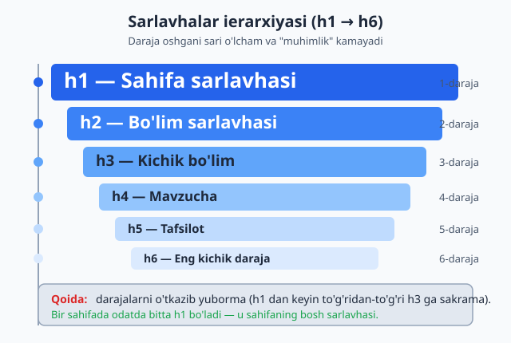
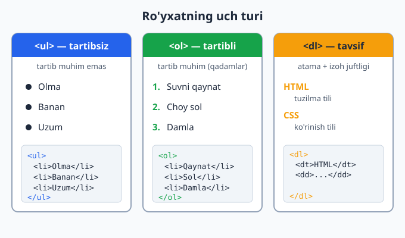
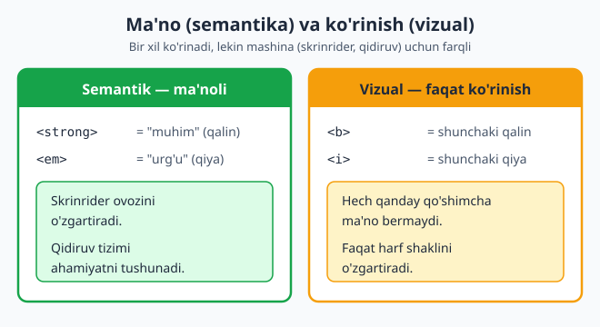

# 02 — Matn elementlari

[⬅️ Oldingi: 01 — Web va HTML asoslari](./01-web-html-asoslari.md) · [🏠 README](./README.md) · [Keyingi: 03 — Havolalar va media ➡️](./03-havolalar-media.md)

> **Bu bobda:** sarlavhalar, paragraflar, ro'yxatlar va matnni belgilash elementlari yordamida matnga tuzilma va ma'no berishni o'rganamiz.

---

## 2.1 Nega matn elementlari kerak?

Tasavvur qiling, do'stingizga uzun xat yozyapsiz. Agar xatning hammasini bitta uzun, uzluksiz qatorda yozsangiz — sarlavhasiz, abzatslarsiz, ro'yxatlarsiz — uni o'qish juda qiyin bo'ladi. Aksincha, **sarlavha**, **abzatslar** va **ro'yxatlar** matnni tartibga soladi va uni tushunarli qiladi.

HTML'da ham xuddi shunday. Brauzer matningizni ekranga chiqaradi, lekin u **qaysi qism sarlavha, qaysi qism abzats, qaysi qism ro'yxat ekanini** faqat siz qo'ygan teglar (teg — `<...>` ko'rinishidagi belgi) orqali biladi.

Bu yerda eng muhim g'oya bor, uni butun bob davomida takrorlaymiz:

📌 **HTML ma'no (semantika) bilan ishlaydi, ko'rinish bilan emas.** Siz brauzerga "bu eng muhim sarlavha", "bu abzats", "bu ro'yxat" deb aytasiz. Qanday ko'rinishini (rang, o'lcham, joylashuv) keyinroq CSS hal qiladi. Bu ajratish — HTML'ning asosiy falsafasi.

Nega bu muhim? Chunki HTML'ingizni faqat odamlar emas, **mashinalar** ham o'qiydi:

- **Qidiruv tizimlari** (Google) sahifangizni tushunish uchun teglarga qaraydi.
- **Skrinriderlar** (ko'zi ojiz odamlar uchun matnni ovoz bilan o'qiydigan dasturlar) tuzilmaga tayanadi.
- **Brauzerlar** "kelasi sarlavhaga o'tish" kabi funksiyalarni teglarga qarab beradi.

To'g'ri teg tanlash — bu nafaqat chiroyli ko'rinish, balki **hamma uchun ishlaydigan** sahifa demakdir.

---

## 2.2 Sarlavhalar: `<h1>` dan `<h6>` gacha

Sarlavha — matnning bir bo'limining nomi, xuddi kitobdagi bob nomi yoki gazetadagi maqola sarlavhasi kabi. HTML'da **olti daraja** sarlavha bor: `<h1>` (eng muhim, eng katta) dan `<h6>` (eng kichik) gacha. `h` — "heading" (sarlavha) so'zidan.

```html
<h1>HTML qo'llanmasi</h1>
<h2>Matn elementlari</h2>
<h3>Sarlavhalar</h3>
<h4>h1 dan h6 gacha</h4>
<h5>Misol</h5>
<h6>Kichik izoh</h6>
```

**Natija:** brauzer `<h1>` ni eng katta va qalin qilib, `<h6>` ni eng kichik qilib ko'rsatadi. Lekin yodda tuting — bu standart ko'rinish, uni CSS bilan istalgancha o'zgartirish mumkin. O'lcham emas, **daraja** muhim.



### Ierarxiya nima va nega tartib muhim?

**Ierarxiya** (ierarxiya — daraja bo'yicha tizim) — bu sarlavhalarning bir-biriga bo'ysunishi. Buni kitob mundarijasi (mundarija — kontent ro'yxati) kabi tasavvur qiling:

```
1. HTML asoslari          ← h1
   1.1. Teglar nima       ← h2
        Yopuvchi teg      ← h3
   1.2. Atributlar        ← h2
2. CSS asoslari           ← h1 (lekin sahifada odatda bitta h1)
```

Asosiy qoidalar:

1. **Bir sahifada odatda bitta `<h1>` bo'ladi** — u butun sahifaning bosh sarlavhasi. Buni kitob nomi deb tasavvur qiling: bir kitobda bitta nom bo'ladi.
2. **Darajalarni tartib bilan ishlating** — `<h1>` dan keyin `<h2>`, undan keyin `<h3>`. 
3. **Darajani o'tkazib yubormang** — `<h1>` dan to'g'ridan-to'g'ri `<h3>` ga sakramang.

⚠️ **Eng keng tarqalgan xato:** "Menga shunchaki katta matn kerak edi, shuning uchun `<h2>` o'rniga `<h1>` ishlatdim" yoki "bu sarlavha kichikroq ko'rinsin deb `<h2>` o'rniga `<h4>` qo'ydim". **Bunday qilmang!** Sarlavha darajasini ma'no bo'yicha tanlang, ko'rinish bo'yicha emas. Matn kattaroq yoki kichikroq ko'rinishi kerak bo'lsa — buni CSS hal qiladi.

### Nega bu SEO va accessibility uchun muhim?

**SEO** (Search Engine Optimization — qidiruv tizimi uchun moslashtirish) nuqtai nazaridan: Google sahifangizning `<h1>` va `<h2>` larini o'qib, sahifa nima haqida ekanini tushunadi. To'g'ri tuzilgan sarlavhalar — qidiruvda yuqori chiqishga yordam beradi.

**Accessibility** (accessibility — imkoniyati cheklanganlar uchun qulaylik) nuqtai nazaridan: skrinrider foydalanuvchilari ko'pincha "sarlavhadan sarlavhaga sakrab" sahifani tez ko'zdan kechirishadi — xuddi ko'zi ochiq odam sahifani varaqlagandek. Agar sarlavhalar tartibsiz bo'lsa yoki katta matn uchun noto'g'ri ishlatilsa, bu navigatsiyani buzadi.

💡 **Maslahat:** sahifa yozishdan oldin uning mundarijasini qog'ozda chizib oling. Qaysi sarlavha qaysisiga bo'ysunadi? Shu tuzilma sizning `<h1>`–`<h6>` darajalaringizni belgilaydi.

---

## 2.3 Paragraf `<p>`, qator uzilishi `<br>`, gorizontal chiziq `<hr>`

### Paragraf — `<p>`

**Paragraf** (paragraf — abzats) — matnning bir-biriga bog'liq jumlalardan iborat bo'lagi. Bu eng ko'p ishlatiladigan teglardan biri. `p` — "paragraph" so'zidan.

```html
<p>Bu birinchi abzats. U bir nechta jumladan iborat bo'lishi mumkin.
   Brauzer satrlarni o'zi avtomatik o'raydi.</p>

<p>Bu ikkinchi abzats. Brauzer abzatslar orasiga avtomatik bo'sh joy qo'shadi.</p>
```

**Natija:** ikki abzats alohida bloklar bo'lib, orasida bo'sh joy bilan ko'rinadi.

📌 **Muhim nuqta — bo'sh joy "siqiladi".** HTML'da kodingizda nechta probel (bo'sh joy) yoki yangi qator qo'ysangiz ham, brauzer ularni **bitta probelga** aylantiradi. Masalan:

```html
<p>Salom            dunyo!</p>
```

Brauzerda baribir `Salom dunyo!` (bitta probel bilan) chiqadi. Shuning uchun matnni qatorlarga bo'lish uchun probel yoki Enter bosish ishlamaydi — bunga maxsus teglar kerak.

### Qator uzilishi — `<br>`

`<br>` (break — uzilish) matnni **o'sha joyda** keyingi qatorga o'tkazadi. Bu yangi abzats yaratmaydi, faqat qatorni uzadi.

```html
<p>Toshkent shahri,<br>
Amir Temur ko'chasi, 12-uy<br>
100000</p>
```

**Natija:**
```
Toshkent shahri,
Amir Temur ko'chasi, 12-uy
100000
```

`<br>` — **bo'sh element** (void element), ya'ni uning ichida kontent yo'q va yopuvchi teg (`</br>`) kerak emas. Faqat `<br>` yozasiz.

⚠️ **Xato:** `<br>` ni abzatslar orasiga bo'sh joy qo'shish uchun ketma-ket ishlatmang (`<br><br><br>`). Bu uchun alohida abzatslar (`<p>`) ishlating, masofani esa keyin CSS bilan sozlaysiz. `<br>` faqat **bitta blok ichida** ma'noli qator uzilishi kerak bo'lganda ishlatiladi — masalan she'r, manzil yoki adres.

### Gorizontal chiziq — `<hr>`

`<hr>` (horizontal rule — gorizontal chiziq) mavzular o'rtasidagi **tematik o'zgarishni** bildiradi — masalan, bir hikoyadan boshqasiga o'tish. Brauzer buni gorizontal chiziq sifatida ko'rsatadi.

```html
<p>Birinchi mavzu haqida matn...</p>

<hr>

<p>Endi butunlay boshqa mavzu haqida...</p>
```

`<hr>` ham bo'sh element — yopuvchi teg kerak emas.

💡 **Nega "tematik o'zgarish" deyiladi?** Avval `<hr>` faqat dekorativ chiziq edi. Hozirgi HTML'da unga **ma'no** berilgan: u "bu yerda mavzu o'zgaradi" degan semantik signal. Shunchaki chiroyli chiziq kerak bo'lsa — buni CSS chegarasi (border) bilan qiling, `<hr>` bilan emas.

---

## 2.4 Tartibsiz ro'yxat `<ul>` va tartibli ro'yxat `<ol>`

Ro'yxatlar — bir turdagi elementlarni guruhlash uchun. HTML'da uchta asosiy ro'yxat turi bor. Avval ikkitasini ko'ramiz.



### Tartibsiz ro'yxat — `<ul>`

`<ul>` (unordered list — tartibsiz ro'yxat) — elementlar tartibi **muhim bo'lmaganda** ishlatiladi. Har bir element `<li>` (list item — ro'yxat elementi) ichiga yoziladi. Brauzer har birining oldiga nuqta (•) qo'yadi.

```html
<ul>
  <li>Olma</li>
  <li>Banan</li>
  <li>Uzum</li>
</ul>
```

**Natija:**
- Olma
- Banan
- Uzum

Bu yerda mevalarni qaysi tartibda yozsangiz ham farqi yo'q — shuning uchun "tartibsiz".

### Tartibli ro'yxat — `<ol>`

`<ol>` (ordered list — tartibli ro'yxat) — tartib **muhim bo'lganda** ishlatiladi, masalan retsept qadamlari yoki ko'rsatmalar. Brauzer har bir `<li>` oldiga raqam qo'yadi.

```html
<ol>
  <li>Suvni qaynating</li>
  <li>Choy soling</li>
  <li>5 daqiqa damlang</li>
</ol>
```

**Natija:**
1. Suvni qaynating
2. Choy soling
3. 5 daqiqa damlang

💡 **Qaysi birini tanlash?** O'zingizdan so'rang: "Agar bu elementlarning o'rnini almashtirsam, ma'no buziladimi?" Agar **ha** (retsept qadamlari) — `<ol>`. Agar **yo'q** (xarid ro'yxati) — `<ul>`.

### `<ol>` ning foydali atributlari

`<ol>` ning raqamlash usulini o'zgartiruvchi uchta atribut bor:

**`type`** — raqam o'rniga harf yoki rim raqamlari:

```html
<ol type="A">
  <li>Birinchi</li>
  <li>Ikkinchi</li>
</ol>
```
**Natija:** A. Birinchi  B. Ikkinchi

`type` qiymatlari: `1` (raqam, standart), `A` (katta harf), `a` (kichik harf), `I` (katta rim raqami), `i` (kichik rim raqami).

**`start`** — sanoqni 1 dan emas, boshqa sondan boshlash:

```html
<ol start="5">
  <li>Beshinchi element</li>
  <li>Oltinchi element</li>
</ol>
```
**Natija:** 5. Beshinchi element  6. Oltinchi element

**`reversed`** — teskari tartibda sanash (kattadan kichikka):

```html
<ol reversed>
  <li>Uchinchi o'rin</li>
  <li>Ikkinchi o'rin</li>
  <li>Birinchi o'rin</li>
</ol>
```
**Natija:** 3. Uchinchi o'rin  2. Ikkinchi o'rin  1. Birinchi o'rin

`reversed` — **mantiqiy atribut** (boolean attribute): u shunchaki bor yoki yo'q, qiymat yozish shart emas.

📌 **Diqqat:** `type` va `start` raqamlarning **ko'rinishi va boshlanish nuqtasini** o'zgartiradi, lekin elementlar tartibining ma'nosini emas. Bu HTML atributlari hisoblanadi va ma'noli — masalan, "musobaqaning 5-o'rindan 8-o'rinigacha" ro'yxati uchun `start="5"` to'g'ri yechim.

---

## 2.5 Ichma-ich (nested) ro'yxatlar

Ro'yxat ichiga ro'yxat joylashtirib, daraxtsimon tuzilma yaratish mumkin. Buni **nested** (ichma-ich) ro'yxat deyiladi.

Eng muhim qoida: **ichki ro'yxat doim `<li>` ning ichida bo'ladi**, `<li>` lar orasida emas.

```html
<ul>
  <li>Mevalar
    <ul>
      <li>Olma</li>
      <li>Banan</li>
    </ul>
  </li>
  <li>Sabzavotlar
    <ul>
      <li>Sabzi</li>
      <li>Kartoshka</li>
    </ul>
  </li>
</ul>
```

**Natija:**
- Mevalar
  - Olma
  - Banan
- Sabzavotlar
  - Sabzi
  - Kartoshka

Brauzer ichki ro'yxatni biroz o'ngga suradi (otstep beradi) va belgisini o'zgartiradi.

⚠️ **Tez-tez uchraydigan xato:** ichki `<ul>` ni ota `<li>` ning **tashqarisiga** qo'yish:

```html
<!-- NOTO'G'RI -->
<ul>
  <li>Mevalar</li>
  <ul>                  <!-- li ning tashqarisida! -->
    <li>Olma</li>
  </ul>
</ul>
```

Bu kod ba'zi brauzerlarda "ishlayotgandek" ko'rinishi mumkin, lekin u **noto'g'ri tuzilma** va kelajakda muammo keltiradi. Doim ichki ro'yxatni ota `<li>` ning **ichida** yoping.

💡 Tartibsiz va tartibli ro'yxatlarni aralashtirish mumkin — masalan, `<ol>` ichida `<ul>` yoki aksincha. Mantiqqa qarab tanlang.

---

## 2.6 Tavsif ro'yxati — `<dl>`, `<dt>`, `<dd>`

Uchinchi ro'yxat turi — **tavsif ro'yxati** (description list). U **atama + tushuntirish** juftliklari uchun ishlatiladi: lug'at, savol-javob, xususiyatlar ro'yxati va h.k.

Uchta teg ishlatiladi:
- `<dl>` (description list) — butun ro'yxatni o'rab turadi.
- `<dt>` (description term) — atama (term).
- `<dd>` (description details) — atamaning tavsifi.

```html
<dl>
  <dt>HTML</dt>
  <dd>Sahifaning tuzilmasini belgilovchi til.</dd>

  <dt>CSS</dt>
  <dd>Sahifaning ko'rinishini (rang, o'lcham) belgilovchi til.</dd>
</dl>
```

**Natija:**

> **HTML**
> Sahifaning tuzilmasini belgilovchi til.
> **CSS**
> Sahifaning ko'rinishini (rang, o'lcham) belgilovchi til.

Brauzer odatda `<dd>` ni `<dt>` dan biroz o'ngga suradi.

💡 **Moslashuvchanlik:** bitta `<dt>` ga bir nechta `<dd>` berishingiz mumkin (bir atamaning bir nechta ma'nosi), yoki bir nechta `<dt>` ga bitta `<dd>` (bir nechta atama uchun bitta tavsif).

```html
<dl>
  <dt>Sichqoncha</dt>
  <dd>Kompyuter boshqaruv qurilmasi.</dd>
  <dd>Kichik kemiruvchi hayvon.</dd>
</dl>
```

📌 Tavsif ro'yxati ko'pincha unutiladi, lekin u "atama va izoh" juftliklari uchun eng to'g'ri (semantik) tanlovdir — masalan FAQ (tez-tez so'raladigan savollar) yoki metama'lumotlar (sana, muallif) ro'yxati uchun.

---

## 2.7 Matnni belgilash: ma'no vs ko'rinish

Endi eng nozik mavzuga keldik. Matn ichida ayrim so'zlarni **ajratib ko'rsatish** uchun teglar bor. Bu yerda asosiy tushuncha: ba'zi teglar **ma'no** beradi (semantik), ba'zilari faqat **ko'rinishni** o'zgartiradi (vizual).



### `<strong>` vs `<b>` — qalin matn

Ikkalasi ham brauzerda **qalin** ko'rinadi, lekin ma'nosi farqli:

- `<strong>` — matn **muhim, jiddiy yoki shoshilinch** ekanini bildiradi. Bu **semantik** teg. Skrinrider buni ovoz urg'usi bilan o'qishi mumkin.
- `<b>` — shunchaki **e'tiborni tortish** uchun qalin, lekin qo'shimcha ahamiyat yo'q (masalan, maqola boshidagi kalit so'z).

```html
<p><strong>Diqqat:</strong> gaz pechini o'chirishni unutmang!</p>
<p>Bu retseptda asosiy masalliq — <b>guruch</b>.</p>
```

**Natija:** ikkalasida ham so'z qalin chiqadi, lekin birinchisi "muhim ogohlantirish", ikkinchisi "shunchaki ajratilgan so'z".

### `<em>` vs `<i>` — qiya matn

Ikkalasi ham **qiya** (italic — yotiq) ko'rinadi:

- `<em>` (emphasis — urg'u) — gapdagi **ohang urg'usini** bildiradi. "Men *bugun* keldim" — bugun so'ziga urg'u. Bu **semantik**.
- `<i>` — qo'shimcha ohangsiz qiya matn: chet so'z, ilmiy nom, fikr yoki texnik atama.

```html
<p>Men <em>hozir</em> ketishim kerak, ertaga emas!</p>
<p>U <i>déjà vu</i> hissini tuydi.</p>
```

📌 **Qoida — avval semantik tegni tanlang.** Agar so'z haqiqatan muhim bo'lsa — `<strong>`. Agar urg'u bo'lsa — `<em>`. `<b>` va `<i>` ni faqat boshqa semantik teg mos kelmaganda ishlating. Sababi: semantik teglar skrinrider va qidiruv tizimlari uchun foydali, vizual teglar esa faqat ko'zga ta'sir qiladi.

### `<mark>` — sariq belgilash

`<mark>` matnni **marker bilan bo'yalgandek** ajratib ko'rsatadi (odatda sariq fon). U **dolzarblik yoki tegishlilik**ni bildiradi — masalan, qidiruv natijasida topilgan so'z.

```html
<p>Qidiruvingiz bo'yicha <mark>HTML</mark> so'zi topildi.</p>
```

### `<small>` — kichik matn

`<small>` **ikkinchi darajali** matn uchun: mualliflik huquqi, qonuniy izohlar, mayda shartlar.

```html
<p><small>&copy; 2026 Mening saytim. Barcha huquqlar himoyalangan.</small></p>
```

### `<sub>` va `<sup>` — pastki va yuqori indeks

- `<sub>` (subscript — pastki indeks) — matnni pastga tushiradi: kimyoviy formulalar.
- `<sup>` (superscript — yuqori indeks) — matnni yuqoriga ko'taradi: daraja, izoh raqami.

```html
<p>Suv formulasi: H<sub>2</sub>O</p>
<p>Maydon: 5 m<sup>2</sup></p>
```

**Natija:** H₂O va 5 m² ko'rinishida (indekslar bilan).

### `<code>`, `<pre>`, `<kbd>` — texnik matnlar

- `<code>` — **kod bo'lagi** (bir qator yoki so'z). Odatda monospace (teng kenglikdagi) shrift bilan ko'rinadi.
- `<pre>` (preformatted — oldindan formatlangan) — matndagi **probellar va qator uzilishlari saqlanadi**. Eslang, 2.3 da aytdikki, brauzer odatda bo'sh joyni siqadi — `<pre>` bu qoidadan istisno.
- `<kbd>` (keyboard — klaviatura) — foydalanuvchi bosadigan **klavishlar**.

```html
<p>O'zgaruvchi e'lon qilish uchun <code>let x = 5;</code> yozing.</p>

<pre>
function salom() {
    console.log("Salom");
}
</pre>

<p>Nusxa olish uchun <kbd>Ctrl</kbd> + <kbd>C</kbd> bosing.</p>
```

💡 Ko'p qatorli kodni ko'rsatish uchun `<pre>` va `<code>` ni birga ishlatish keng tarqalgan: `<pre><code>...</code></pre>`. `<pre>` qator uzilishlarini saqlaydi, `<code>` esa "bu kod" degan ma'no beradi.

### `<blockquote>`, `<q>`, `<cite>` — iqtiboslar

- `<blockquote>` — **uzun, blok iqtibos** (boshqa manbadan olingan abzats). Brauzer uni odatda chetga suradi.
- `<q>` (quote — qisqa iqtibos) — **gap ichidagi qisqa iqtibos**. Brauzer atrofiga qo'shtirnoq qo'yadi.
- `<cite>` — **asarning nomi** (kitob, film, maqola). Odatda qiya ko'rinadi.

```html
<blockquote>
  <p>Bilim — eng kuchli qurol bo'lib, u bilan dunyoni o'zgartirish mumkin.</p>
</blockquote>

<p>U <q>ertaga kelaman</q> dedi.</p>

<p>Bu fikr <cite>O'tkan kunlar</cite> romanidan olingan.</p>
```

💡 `<blockquote>` va `<q>` da `cite` **atributi** ham bor (iqtibos manbasining URL manzili uchun): `<blockquote cite="https://...">`. Bu `<cite>` **tegidan** farqli narsa — atribut ko'rinmaydi, faqat manba havolasini saqlaydi.

### `<abbr>` — qisqartma

`<abbr>` (abbreviation — qisqartma) qisqartmaning to'liq ma'nosini `title` atributida saqlaydi. Foydalanuvchi sichqonchani ustiga olib kelganda to'liq matn ko'rinadi.

```html
<p><abbr title="HyperText Markup Language">HTML</abbr> — veb tili.</p>
```

### `<time>` — sana va vaqt

`<time>` sana yoki vaqtni **mashina o'qiy oladigan** formatda saqlaydi. Odam ko'radigan matn istalgancha bo'lishi mumkin, lekin `datetime` atributi standart formatda yoziladi.

```html
<p>Tadbir <time datetime="2026-06-09">9-iyun</time> kuni bo'ladi.</p>
```

📌 **Nega bu foydali?** `datetime="2026-06-09"` ni kalendar dasturlari va qidiruv tizimlari to'g'ri tushunadi, garchi ekranda "9-iyun" yozilgan bo'lsa ham. Bu yana o'sha g'oya: **ma'no (mashina uchun) va ko'rinish (odam uchun) ajratilgan.**

---

## 2.8 HTML entities (maxsus belgilar)

Ba'zi belgilarni HTML'ga to'g'ridan-to'g'ri yozib bo'lmaydi. Masalan, `<` belgisini yozsangiz, brauzer uni teg boshlanishi deb o'ylaydi. Bunday belgilar uchun **HTML entity** (HTML mavjudligi — maxsus belgi kodi) ishlatiladi.

Entity `&` bilan boshlanib `;` bilan tugaydi. Eng kerakli beshtasi:

| Yozasiz | Chiqadi | Nima uchun |
|---------|---------|------------|
| `&lt;`   | `<` | "kichik" belgisi (less than) — teg bilan adashmasligi uchun |
| `&gt;`   | `>` | "katta" belgisi (greater than) |
| `&amp;`  | `&` | ampersand — entity boshi bilan adashmasligi uchun |
| `&copy;` | `©` | mualliflik huquqi belgisi |
| `&nbsp;` | (bo'sh joy) | uzilmas probel (non-breaking space) |

```html
<p>HTML'da teg shunday yoziladi: &lt;p&gt;</p>
<p>Choy &amp; qahva</p>
<p>&copy; 2026 Mening saytim</p>
```

**Natija:**
```
HTML'da teg shunday yoziladi: <p>
Choy & qahva
© 2026 Mening saytim
```

### `&nbsp;` — uzilmas probel

`&nbsp;` (non-breaking space) — oddiy probelga o'xshaydi, lekin ikki muhim farqi bor:
1. U **siqilmaydi** (oddiy probellar bittaga siqilishini eslang).
2. Brauzer uning o'rnida qatorni **uzmaydi** — chap va o'ng tomonidagi so'zlar doim birga qoladi.

```html
<p>Narx: 100&nbsp;so'm</p>
```

Bu yerda "100" va "so'm" doim bir qatorda qoladi, hatto satr oxiriga to'g'ri kelsa ham.

⚠️ **`&nbsp;` ni masofa qo'yish uchun ko'p ishlatmang** (`&nbsp;&nbsp;&nbsp;`). Bo'sh joy va masofa CSS ning vazifasi. `&nbsp;` ni faqat **so'zlar birga turishi kerak bo'lganda** ishlating.

💡 Yuzlab boshqa entity'lar bor (`&hearts;`, `&rarr;`, `&euro;` va h.k.), lekin yuqoridagi beshtasi kundalik ishingizning 95% ini qoplaydi.

---

## 2.9 Yig'ib: semantika — asosiy g'oya

Butun bob davomida bir g'oyani takrorladik, uni mustahkamlaymiz:

**Har doim "bu nima?" deb so'rang, "bu qanday ko'rinadi?" deb emas.**

- Sarlavhami? → `<h1>`–`<h6>` (darajaga qarab)
- Abzatsmi? → `<p>`
- Muhim ogohlantirishmi? → `<strong>`
- Shunchaki qalin so'zmi? → `<b>`
- Kodmi? → `<code>`
- Iqtibosmi? → `<blockquote>` yoki `<q>`

To'g'ri teg tanlash sahifangizni **hammaga** — odamlarga, mashinalarga, skrinriderlarga, qidiruv tizimlariga — tushunarli qiladi. Ko'rinishni (rang, o'lcham, masofa) keyingi boblarda CSS bilan to'liq nazorat qilamiz. Tuzilma va ma'no — HTML'da; ko'rinish — CSS'da. Bu ajratishni o'zlashtirsangiz, professional veb-dasturchi yo'lining yarmini bosib o'tgan bo'lasiz.

---

## Mashqlar

Quyidagi mashqlarni o'zingiz yozib ko'ring. Har birida yechimni ochishdan oldin o'zingiz urinib ko'ring — shundagina haqiqiy o'rganasiz.

### Mashq 1 — Sarlavhalar ierarxiyasi

Bir "Oshxona retseptlari" sahifasi uchun sarlavhalarni to'g'ri darajalarda yozing: sahifa nomi "Oshxona retseptlari", uning ostida "Birinchi taomlar" va "Shirinliklar" bo'limlari, "Birinchi taomlar" ostida esa "Sho'rva" mavzusi bo'lsin.

<details markdown="1"><summary>Yechim</summary>

```html
<h1>Oshxona retseptlari</h1>

<h2>Birinchi taomlar</h2>
<h3>Sho'rva</h3>

<h2>Shirinliklar</h2>
```

Sahifada bitta `<h1>`, ikkita `<h2>` (asosiy bo'limlar) va `<h3>` (kichik mavzu) ishlatildi. Darajalar o'tkazib yuborilmadi.

</details>

### Mashq 2 — To'g'ri ro'yxat turini tanlang

Quyidagilar uchun `<ul>` yoki `<ol>` dan qaysi biri to'g'ri? Sababini ayting:
1. Pitsa tayyorlash qadamlari
2. Yoqtirgan ranglaringiz
3. Musobaqa g'oliblari (1-, 2-, 3-o'rin)

<details markdown="1"><summary>Yechim</summary>

1. **`<ol>`** — qadamlar tartibi muhim, oldin xamir, keyin sous.
2. **`<ul>`** — ranglar tartibi muhim emas.
3. **`<ol>`** — o'rinlar tartibli (1, 2, 3).

```html
<ol>
  <li>Xamir yoying</li>
  <li>Sous suring</li>
  <li>Pishiring</li>
</ol>
```

</details>

### Mashq 3 — `start` va `type` atributlari

10 dan boshlanadigan va kichik harflar bilan raqamlanadigan ro'yxat yozing (a, b, c emas — 10-elementdan boshlanadigan raqamli ro'yxat). Keyin alohida ro'yxat: katta rim raqamlari bilan.

<details markdown="1"><summary>Yechim</summary>

```html
<!-- 10 dan boshlanuvchi -->
<ol start="10">
  <li>O'ninchi</li>
  <li>O'n birinchi</li>
</ol>

<!-- Katta rim raqamlari -->
<ol type="I">
  <li>Birinchi</li>
  <li>Ikkinchi</li>
  <li>Uchinchi</li>
</ol>
```

Birinchisi 10, 11 deb; ikkinchisi I, II, III deb chiqadi.

</details>

### Mashq 4 — Ichma-ich ro'yxat

Quyidagi tuzilmani HTML'da yozing:
- Dasturlash tillari
  - Veb: HTML, CSS
  - Backend: Python, PHP

<details markdown="1"><summary>Yechim</summary>

```html
<ul>
  <li>Dasturlash tillari
    <ul>
      <li>Veb: HTML, CSS</li>
      <li>Backend: Python, PHP</li>
    </ul>
  </li>
</ul>
```

Ichki `<ul>` ota `<li>` ning **ichida** yopilganiga e'tibor bering.

</details>

### Mashq 5 — Tavsif ro'yxati

Uchta veb atamasi uchun tavsif ro'yxati (`<dl>`) yozing: "Teg", "Atribut", "Element". Har biriga qisqa izoh bering.

<details markdown="1"><summary>Yechim</summary>

```html
<dl>
  <dt>Teg</dt>
  <dd>Burchakli qavslar ichidagi belgi, masalan &lt;p&gt;.</dd>

  <dt>Atribut</dt>
  <dd>Tegga qo'shimcha ma'lumot beruvchi qism, masalan class="...".</dd>

  <dt>Element</dt>
  <dd>Ochuvchi teg, kontent va yopuvchi tegning birgalikdagi to'plami.</dd>
</dl>
```

</details>

### Mashq 6 — Semantik teglarni to'g'rilang

Quyidagi kodda vizual teglar noto'g'ri ishlatilgan. Semantik variantga o'zgartiring:

```html
<p><b>Ogohlantirish:</b> bu havola xavfli.</p>
<p>Men <i>albatta</i> kelaman, ishonchingiz komil bo'lsin!</p>
```

<details markdown="1"><summary>Yechim</summary>

```html
<p><strong>Ogohlantirish:</strong> bu havola xavfli.</p>
<p>Men <em>albatta</em> kelaman, ishonchingiz komil bo'lsin!</p>
```

"Ogohlantirish" — muhim ma'no, shuning uchun `<strong>`. "albatta" — gapdagi ohang urg'usi, shuning uchun `<em>`.

</details>

### Mashq 7 — HTML entities

Quyidagi matnni brauzerda **aynan shunday** chiqadigan qilib HTML'da yozing (teglar matn sifatida ko'rinsin):

```
Sevimli teglarim: <h1> & <p>
© 2026
```

<details markdown="1"><summary>Yechim</summary>

```html
<p>Sevimli teglarim: &lt;h1&gt; &amp; &lt;p&gt;</p>
<p>&copy; 2026</p>
```

`<` uchun `&lt;`, `>` uchun `&gt;`, `&` uchun `&amp;`, `©` uchun `&copy;` ishlatildi.

</details>

### Mashq 8 — Aralash matn elementlari

Bitta abzatsda quyidagilarni birlashtiring: kimyoviy formula (H₂O), klaviatura klavishi (Enter), kichik mualliflik izohi va kod bo'lagi (`document.write`).

<details markdown="1"><summary>Yechim</summary>

```html
<p>
  Suv — bu H<sub>2</sub>O. Davom etish uchun <kbd>Enter</kbd> bosing.
  Konsolda <code>document.write</code> dan foydalaning.
  <small>&copy; 2026 Qo'llanma</small>
</p>
```

`<sub>` indeks uchun, `<kbd>` klavish uchun, `<code>` kod uchun, `<small>` ikkinchi darajali izoh uchun ishlatildi.

</details>

---

[⬅️ Oldingi: 01 — Web va HTML asoslari](./01-web-html-asoslari.md) · [🏠 README](./README.md) · [Keyingi: 03 — Havolalar va media ➡️](./03-havolalar-media.md)
