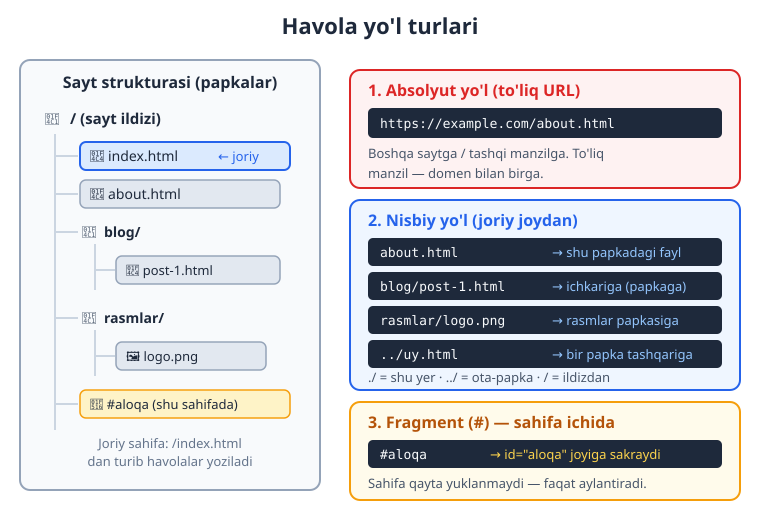
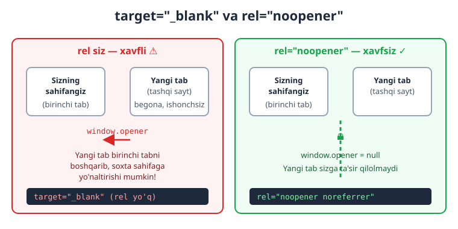
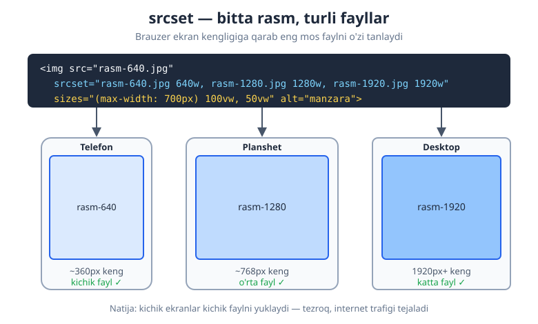
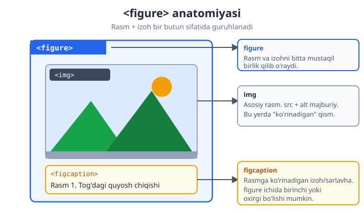

# 03 — Havolalar va media

[⬅️ Oldingi: 02 — Matn elementlari](./02-matn-elementlari.md) · [🏠 README](./README.md) · [Keyingi: 04 — Jadvallar ➡️](./04-jadvallar.md)

> **Bu bobda:** havolalar (`a`) yordamida sahifalarni bog'lashni, rasmlarni (`img`) to'g'ri va tez ko'rsatishni, responsive (moslashuvchan) rasm texnikalarini, hamda audio, video, `figure` va `iframe` elementlarini noldan ekspert darajagacha o'rganamiz.

---

Oldingi boblarda biz HTML'ning matn elementlarini ko'rdik. Lekin internetni "internet" qiladigan narsa — bu **havolalar**. Aynan havolalar tufayli bir sahifadan ikkinchisiga o'tamiz, butun dunyo saytlari bir-biriga ulanadi. So'ngra esa sahifalarni jonlantiruvchi **media** keladi: rasmlar, ovoz, video.

Bu bobda biz ikki katta mavzuni yopamiz:

1. **Havolalar** — `<a>` elementi va uning barcha imkoniyatlari (`href`, `target`, `download`, xavfsizlik).
2. **Media** — `` rasmlari, responsive rasmlar, `<figure>`, `<audio>`, `<video>` va `<iframe>`.

Oddiydan boshlab, asta-sekin ekspert nozikliklariga yetamiz. Har bir narsada "**nega aynan shunday?**" degan savolga javob beramiz — chunki sababini bilsang, qoidani yodlash shart emas, o'zing chiqarib olasan.

---

## 3.1 Havola nima va nega kerak?

Tasavvur qiling, har bir veb-sahifa — bu kitobdagi alohida varaq. **Havola** (link) — bu bir varaqdan ikkinchisiga olib boruvchi "eshik". Foydalanuvchi ko'k, ostiga chizilgan matnni bosadi va boshqa sahifaga o'tadi.

HTML'da havola **anchor** (langar) elementi — `<a>` bilan yaratiladi:

```html
<a href="https://uzbekistan.uz">Bizning sayt</a>
```

Bu kod brauzerda **"Bizning sayt"** degan bosiladigan matn ko'rsatadi. Bosilganda foydalanuvchi `https://uzbekistan.uz` manziliga o'tadi.

Bu yerda eng muhim qism — `href` atributi (HTML "**h**ypertext **ref**erence" — gipermatn havolasi degani). U **qayerga** o'tishni belgilaydi. Ochilish tegi (`<a ...>`) bilan yopilish tegi (`</a>`) orasidagi matn esa foydalanuvchi **ko'radigan** va **bosadigan** qism.

```html
<a href="QAYERGA">NIMA KO'RINADI (bosiladigan matn)</a>
```

> 💡 `<a>` — bu **inline** (qatoriy) element. Ya'ni u matn ichida, gap o'rtasida ham tura oladi:
> ```html
> <p>Ko'proq ma'lumot uchun <a href="yordam.html">yordam sahifasiga</a> o'ting.</p>
> ```

⚠️ **Eng ko'p uchraydigan boshlang'ich xato:** `href` ni unutib qo'yish. `<a>Matn</a>` deb yozsangiz, matn ko'rinadi-yu, lekin u **bosilmaydigan** bo'lib qoladi — chunki "qayerga" o'tishni bermadingiz.

---

## 3.2 `href` qiymatlari: yo'l turlari

`href` ga turli xil qiymatlar bera olamiz. Eng muhim turlarini ko'rib chiqamiz. Bularni tushunish — bobning eng asosiy poydevori, shuning uchun shoshilmang.



### Absolyut yo'l (to'liq URL)

Absolyut yo'l — bu **to'liq manzil**, `https://` (yoki `http://`) va domen nomi bilan birga. Bu xuddi xatdagi to'liq pochta manzili kabi: "Toshkent shahri, Amir Temur ko'chasi, 1-uy" — bu manzilni dunyoning istalgan joyidan yozsangiz ham topiladi.

```html
<a href="https://developer.mozilla.org">MDN hujjatlari</a>
<a href="https://www.google.com/search?q=html">Google'da qidirish</a>
```

**Nega kerak?** Absolyut yo'l **boshqa saytga** (tashqi manzilga) havola berishning yagona to'g'ri yo'li. Boshqa saytda qaysi papkada turishingizni bilmaysiz, shuning uchun to'liq manzil yozasiz.

### Nisbiy yo'l (joriy joydan)

Nisbiy yo'l — bu **hozir turgan faylga nisbatan** manzil. Domen yozilmaydi. Bu xuddi "qo'shni xona" yoki "tepadagi qavat" deyishga o'xshaydi — faqat hozir qayerda turganingizni bilsa, joyni topib olasiz.

Aytaylik, hozir `index.html` faylidamiz va u bilan **bir papkada** `about.html` bor:

```html
<a href="about.html">Biz haqimizda</a>
```

Endi yo'lning "navigatsiya" belgilarini ko'ramiz — bular eng chalkashtiradigan, ammo eng muhim qism:

| Belgi | Ma'nosi | Misol |
|-------|---------|-------|
| `fayl.html` | Shu papkadagi fayl | `about.html` |
| `papka/fayl.html` | Ichkariga — papka ichiga kirish | `blog/post-1.html` |
| `./` | "Aynan shu papka" (ko'pincha tushiriladi) | `./about.html` = `about.html` |
| `../` | Bir papka **tashqariga** (ota-papkaga) chiqish | `../index.html` |
| `../../` | Ikki papka tashqariga | `../../uy.html` |
| `/` bilan boshlanishi | **Sayt ildizidan** (domen tubidan) | `/rasmlar/logo.png` |

**Misollar bilan tushunamiz.** Faraz qiling, fayl manzillari shunday:

```
/index.html
/about.html
/blog/post-1.html
/blog/rasmlar/sarlavha.jpg
```

Agar siz **`/blog/post-1.html`** ichida bo'lsangiz:

```html
<!-- Shu papkadagi rasmlar/ ichiga kirish (ichkariga) -->
<a href="rasmlar/sarlavha.jpg">Sarlavha rasmi</a>

<!-- Bir papka tashqariga chiqib, index.html ga -->
<a href="../index.html">Bosh sahifa</a>

<!-- Sayt ildizidan boshlanadi (qaysi faylda bo'lsangiz ham ishlaydi) -->
<a href="/about.html">Biz haqimizda</a>
```

> 💡 **`./` va `../` ni qanday eslab qolish kerak?** Bitta nuqta `.` = "shu yer" (joriy papka). Ikkita nuqta `..` = "bir qadam orqaga" (ota-papka). Telefon kontaktlaridagi "orqaga" tugmasiga o'xshaydi: har bir `../` sizni bir daraja yuqoriga ko'taradi.

⚠️ **Tez-tez uchraydigan xato:** havola ishlamasa, ko'pincha sabab — yo'lning noto'g'riligi. `../` ni ortiqcha yoki kam yozib qo'yish eng keng tarqalgan muammo. Brauzerning manzil qatoriga qarang: u qaysi faylni izlayotganini ko'rsatadi.

> 📌 **Absolyut yo'l (`/` dan boshlanuvchi) qachon kerak?** Katta saytlarda fayllar turli chuqurlikdagi papkalarda turadi. `/rasmlar/logo.png` deb yozsangiz, bu **har qaysi faylda** bir xil ishlaydi — chunki u har doim ildizdan hisoblaydi. Nisbiy `../../rasmlar/logo.png` esa fayl joyiga bog'liq bo'lib, ko'chirilganda buziladi.

### Fragment havolasi (`#`) — bitta sahifa ichida sakrash

`#` bilan boshlanuvchi havola **boshqa sahifaga o'tmaydi** — u **shu sahifaning** ma'lum bir joyiga "sakraydi". Bu uzun sahifalarda juda foydali (masalan, "Yuqoriga qaytish" tugmasi yoki mundarija).

Bu ikki qismdan iborat: **maqsad** (id bilan belgilangan joy) va **havola** (`#` bilan unga ishora qiluvchi):

```html
<!-- Havola: bosilganda #aloqa joyiga sakraydi -->
<a href="#aloqa">Aloqa bo'limiga o'tish</a>

<!-- ... uzun matn ... -->

<!-- Maqsad: id="aloqa" bo'lgan element -->
<section id="aloqa">
  <h2>Biz bilan bog'laning</h2>
</section>
```

**Nega ishlaydi?** Brauzer `#aloqa` ni ko'rib, sahifada `id="aloqa"` bo'lgan elementni qidiradi va o'sha joyga aylantirib (scroll qilib) boradi. Sahifa **qayta yuklanmaydi** — shuning uchun juda tez.

```html
<!-- Sahifaning eng tepasiga qaytish uchun maxsus havola -->
<a href="#">Yuqoriga</a>
```

> 💡 Fragmentni absolyut yoki nisbiy yo'l bilan ham birlashtirsa bo'ladi: `href="about.html#jamoa"` — `about.html` sahifasini ochib, darhol `id="jamoa"` joyiga sakraydi.

### Maxsus protokollar: `mailto:` va `tel:`

Havola faqat sahifalarga emas, harakatlarga ham olib borishi mumkin:

```html
<!-- Bosilganda foydalanuvchining email dasturini ochadi -->
<a href="mailto:info@example.com">Bizga yozing</a>

<!-- Telefon (asosan mobil qurilmalarda) — bosilsa qo'ng'iroq oynasi ochiladi -->
<a href="tel:+998901234567">+998 90 123 45 67</a>
```

`mailto:` ga qo'shimcha ma'lumotlar ham berish mumkin (mavzu, matn):

```html
<a href="mailto:info@example.com?subject=Savol&body=Salom, menda savol bor">
  Savol berish
</a>
```

> 📌 `tel:` raqamida bo'sh joy yoki qavs ishlatmang, faqat `+` va raqamlar: `tel:+998901234567`. Lekin **ko'rinadigan** matnda chiroyli formatlasangiz bo'ladi.

---

## 3.3 `target` va xavfsizlik: yangi tabda ochish

Odatda havola bosilganda yangi sahifa **xuddi shu tabda** ochiladi (eski sahifa o'rnini egallaydi). Agar yangi tabda ochilishini istasangiz, `target="_blank"` ishlatasiz:

```html
<a href="https://example.com" target="_blank">Yangi tabda ochish</a>
```

**Nega kerak?** Ko'pincha **tashqi** saytlarga havola berganda yangi tabda ochasiz — shunda foydalanuvchi sizning saytingizni yo'qotmaydi. Lekin shu yerda muhim **xavfsizlik** masalasi bor.

### `rel="noopener"` — nega bu muhim?

`target="_blank"` bilan ochilgan yangi tab, eski versiyalarda, JavaScript orqali **sizning sahifangizni boshqarib** olishi mumkin edi (`window.opener` deb ataluvchi bog'lanish orqali). Yomon niyatli sayt sizning tabingizni soxta "parolni kiriting" sahifasiga yo'naltirib, foydalanuvchini aldab qo'yishi mumkin edi. Bu hujum **tabnabbing** deb ataladi.



Yechim — `rel="noopener"` atributi. U yangi tabning eski tabga bo'lgan bog'lanishini **uzadi** (`window.opener = null` qiladi):

```html
<a href="https://example.com" target="_blank" rel="noopener noreferrer">
  Xavfsiz tashqi havola
</a>
```

- `noopener` — yangi tab sizning sahifangizni boshqara olmasligini ta'minlaydi (asosiy himoya).
- `noreferrer` — qo'shimcha: yangi saytga "qaysi sahifadan keldingiz" ma'lumotini ham yubormaydi.

> 📌 **Yaxshi yangilik:** zamonaviy brauzerlar `target="_blank"` ishlatilganda `noopener` ni **avtomatik** qo'shadi. Lekin baribir uni o'zingiz yozish — **yaxshi odat** (eski brauzerlar va aniqlik uchun). Ko'pchilik kod tekshiruvchi vositalar uni talab qiladi.

⚠️ Har bir havolaga `target="_blank"` qo'yaverish — yomon amaliyot. Foydalanuvchining "orqaga" tugmasi ishlamay qoladi va o'nlab tablar ochilib ketadi. Faqat **kerakli** joylarda (asosan tashqi saytlar yoki PDF/hujjat) ishlating.

---

## 3.4 Boshqa foydali atributlar: `download` va `title`

### `download` — faylni yuklab olish

Odatda brauzer ochib ko'ra oladigan fayllarni (rasm, PDF) **ochadi**. Agar uni darhol **yuklab olishga** majburlamoqchi bo'lsangiz, `download` atributini qo'ying:

```html
<!-- Bosilganda fayl ochilmaydi, balki yuklab olinadi -->
<a href="hujjat.pdf" download>Hujjatni yuklab olish</a>

<!-- Yuklanayotgan faylga boshqa nom berish -->
<a href="report-2026-final-v3.pdf" download="hisobot.pdf">Hisobotni olish</a>
```

> 📌 `download` faqat **sizning saytingizdagi** (yoki ruxsat berilgan) fayllar uchun ishlaydi — xavfsizlik sababli boshqa domendagi fayllarga ta'sir qilmasligi mumkin.

### `title` — qo'shimcha ma'lumot (tooltip)

`title` atributi sichqoncha havola ustida turganda paydo bo'ladigan kichik izoh (tooltip) beradi:

```html
<a href="hisobot.pdf" title="2026-yil yillik hisoboti, PDF, 2 MB">Hisobot</a>
```

⚠️ `title` ga **ortiqcha tayanmang**. U mobil qurilmalarda umuman ko'rinmaydi va ekran o'qiydigan dasturlar (screen reader) uni ishonchli o'qimaydi. Muhim ma'lumotni faqat `title` ga yashirib qo'ymang — uni ko'rinadigan matnga ham yozing.

---

## 3.5 Rasmlar: `` elementi

Endi mediaga o'tamiz. Sahifaga rasm qo'yish uchun `` elementi ishlatiladi. U ikki muhim narsa bilan ajralib turadi:

1. **Bo'sh element** (void) — yopilish tegi yo'q. Faqat ``.
2. **Replaced element** — uning "ichida" hech narsa yozilmaydi; brauzer o'rniga rasmni "joylashtiradi".

```html

```

Bu yerda ikki **majburiy** atribut bor: `src` va `alt`. Ularni alohida ko'rib chiqamiz.

### `src` — rasm manzili

`src` (source — manba) — bu rasm faylining yo'li. U havoladagi `href` kabi ishlaydi: absolyut yoki nisbiy bo'lishi mumkin.

```html
      <!-- nisbiy -->
 <!-- absolyut -->
```

### `alt` — muqobil matn (eng muhim atribut!)

`alt` (alternative text — muqobil matn) — bu rasmni **so'z bilan tasvirlash**. Agar rasm yuklanmasa yoki foydalanuvchi ko'ra olmasa, shu matn ishlatiladi.

**Nega `alt` shunchalik muhim? Uch sabab bor:**

1. **Accessibility (qulaylik):** ko'zi ojiz foydalanuvchilar ekran o'qiydigan dastur (screen reader) ishlatadi. Bu dastur rasmni "ko'rolmaydi" — u faqat `alt` matnini ovoz chiqarib o'qiydi. `alt` bo'lmasa, foydalanuvchi rasmda nima borligini umuman bilolmaydi.

2. **Rasm yuklanmaganda:** internet sekin bo'lsa yoki fayl topilmasa, brauzer rasm o'rniga `alt` matnini ko'rsatadi — foydalanuvchi nima bo'lishi kerakligini tushunadi.

3. **SEO (qidiruv tizimlari):** Google rasmni "ko'rmaydi", lekin `alt` matnini o'qiydi. Yaxshi `alt` — rasm qidiruvda topilishiga yordam beradi.

```html
<!-- ✓ Yaxshi: aniq, mazmunli -->


<!-- ✗ Yomon: ma'nosiz -->


```

> 💡 **`alt` qanday yoziladi?** Rasmni telefonda ko'ra olmagan do'stingizga tasvirlab beryapsiz deb tasavvur qiling. "Rasm" yoki "foto" deb yozish foydasiz — rasmda **nima** borligini ayting.

> 📌 **Bezak (dekorativ) rasmlar uchun bo'sh `alt`.** Agar rasm faqat bezak bo'lsa va hech qanday ma'no tashimasa (masalan, ajratuvchi chiziq), `alt=""` (bo'sh) yozing. Bunda screen reader uni butunlay e'tiborsiz qoldiradi. ⚠️ Lekin `alt` ni **butunlay tashlab ketmang** — bo'sh `alt=""` bilan `alt` yo'qligi har xil narsa. Yo'qligida screen reader fayl nomini o'qib, foydalanuvchini chalkashtiradi.

### `width` va `height` — nega ularni yozish kerak?

`width` (kenglik) va `height` (balandlik) atributlari rasmning o'lchamini **piksellarda** beradi:

```html

```

Ko'pchilik buni "ortiqcha" deb o'ylaydi, chunki o'lchamni CSS bilan ham berish mumkin. Lekin **nega baribir HTML'da yozish kerak?**

Sabab — **layout shift** (sahifaning sakrashi) muammosi. Tasavvur qiling: matn yuklandi, lekin rasm hali kelmadi. Brauzer rasm **qanchalik joy** egallashini bilmaydi, shuning uchun unga joy ajratmaydi. Rasm yuklanganda esa "birdan" paydo bo'lib, pastdagi matnni surib yuboradi — foydalanuvchi o'qiyotgan joyi sakrab ketadi. Bu juda bezovta qiladi (va Google ham buni "yomon tajriba" deb baholaydi).

Agar `width` va `height` ni oldindan bersangiz, brauzer rasmga **kerakli joyni oldindan ajratadi** — rasm kelguncha joy bo'sh turadi, kelganda esa hech narsa sakramaydi.

```html
<!-- Brauzer 16:9 nisbatni hisoblab, joyni oldindan band qiladi -->

```

> 💡 **Muhim nozik nuqta:** `width` va `height` ni yozsangiz ham, CSS bilan rasmni moslashuvchan qila olasiz. Ushbu CSS responsive saytlarda deyarli har doim ishlatiladi:
> ```css
> img {
>   max-width: 100%;  /* konteynerdan keng bo'lib ketmasin */
>   height: auto;     /* nisbatni saqlab, balandlik o'zi moslashsin */
> }
> ```
> Bunda HTML'dagi raqamlar **nisbatni** (aspect ratio) belgilaydi, CSS esa real ko'rinadigan o'lchamni boshqaradi. Eng zo'r kombinatsiya.

### `loading="lazy"` — kerak bo'lganda yuklash

Uzun sahifada o'nlab rasm bo'lsa, ularning hammasini birdan yuklash sahifani sekinlashtiradi. `loading="lazy"` brauzerga "bu rasmni faqat foydalanuvchi unga **yaqinlashganda** yukla" deb aytadi:

```html

```

**Nega kerak?** Foydalanuvchi sahifaning pastiga umuman tushmasligi mumkin. Unda pastdagi rasmlarni yuklash — bekorga sarflangan trafik va vaqt. `lazy` bilan faqat ko'rinadigan (yoki yaqinlashayotgan) rasmlar yuklanadi.

> ⚠️ **Diqqat:** sahifaning eng tepasidagi (birinchi ko'rinadigan) muhim rasmga `loading="lazy"` **qo'ymang** — u darhol kerak, kechiktirish faqat zarar qiladi. `lazy` — sahifaning pastidagi rasmlar uchun.

---

## 3.6 Responsive rasmlar: `srcset` va `sizes`

Bitta muammo: telefon ekrani kichik (masalan 360px keng), desktop monitori esa katta (1920px+). Agar siz hammaga bitta katta `2000px` rasm bersangiz, telefon foydalanuvchisi o'sha ulkan faylni **bekorga** yuklaydi — sekin va mobil internet trafigini behuda sarflaydi. Aksincha, kichik rasmni katta ekranda ko'rsatsangiz, u xira (pixellashgan) chiqadi.

**Yechim:** bir nechta o'lchamdagi rasm tayyorlab, brauzerga "o'zing eng mosini tanla" deyish. Buni `srcset` qiladi.



### `srcset` — variantlar ro'yxati

```html

```

Buni qism-qism ochib beramiz:

- **`src`** — "zaxira" rasm. `srcset` ni tushunmaydigan juda eski brauzerlar shuni ishlatadi.
- **`srcset`** — vergul bilan ajratilgan variantlar ro'yxati. Har biri: `fayl-nomi <kenglik>w`. Bu yerda `640w` "bu rasmning haqiqiy kengligi 640 piksel" degani (`px` emas, `w` — width descriptor).
- **`sizes`** — rasm ekranda **qancha joy** egallashini brauzerga aytadi.

### `sizes` ni qanday o'qish kerak?

`sizes="(max-width: 700px) 100vw, 50vw"` ni so'zlar bilan o'qisak:

> "Agar ekran 700px dan tor bo'lsa, rasm ekran kengligining **100%** ini (`100vw`) egallaydi. Aks holda — **50%** ini (`50vw`)."

(`vw` = "viewport width" — ekran kengligining foizi. `100vw` = to'liq ekran kengligi.)

**Brauzer qanday tanlaydi?** U ikki narsani biladi:
1. Ekran/qurilma o'lchami (va piksel zichligi).
2. `sizes` dan — rasm qancha joy egallashi.

Shulardan kelib chiqib, `srcset` dagi variantlardan **eng mosini** o'zi tanlaydi. Sizning ishingiz — variantlarni va o'lchamlarni to'g'ri berish. Qaror brauzerniki, chunki u foydalanuvchining real holatini (ekran, internet tezligi) biladi.

> 💡 **Ikki xil holat:**
> - **Faqat o'lcham farq qilsa** (turli ekranlarga turli o'lchamdagi *bir xil* rasm) — `srcset` + `sizes` yetarli, yuqoridagidek.
> - **Rasm o'zi boshqacha bo'lishi kerak bo'lsa** (masalan telefonda kesilgan, fokuslangan variant) — keyingi bo'limdagi `<picture>` kerak.

---

## 3.7 `<picture>` — art direction va format tanlash

`<picture>` elementi `srcset` dan ham kuchliroq nazorat beradi. U ikki vazifani bajaradi:

1. **Art direction** — turli ekranlarda **butunlay boshqacha** rasm ko'rsatish (faqat o'lcham emas).
2. **Format tanlash** — brauzer qo'llab-quvvatlasa, zamonaviy (kichikroq) formatni berish (`webp`, `avif`).

`<picture>` ichida bir nechta `<source>` va oxirida bitta `` bo'ladi. Brauzer `<source>` larni **yuqoridan pastga** tekshiradi va **birinchi mos kelganini** ishlatadi. Hech biri mos kelmasa — `` ga tushadi (u **majburiy**, "zaxira" sifatida).

### Art direction misoli

```html
<picture>
  <!-- Tor ekran (telefon): vertikal, yaqindan olingan rasm -->
  <source media="(max-width: 600px)" srcset="portret-mobil.jpg">

  <!-- Aks holda (desktop): keng, panoramali rasm -->
  <source media="(min-width: 601px)" srcset="panorama-desktop.jpg">

  <!-- Zaxira: barcha brauzerlar tushunadi -->
  
</picture>
```

**Nega kerak?** Keng panoramali rasm telefonning tor ekranida juda kichik va tushunarsiz bo'lib qoladi. Telefon uchun yaqindan olingan, vertikal variant berish — ancha yaxshi tajriba.

### Format tanlash (webp / avif)

`webp` va `avif` — zamonaviy rasm formatlari. Ular `jpg`/`png` ga qaraganda bir xil sifatda **ancha kichikroq** fayl beradi (tezroq yuklanadi). Lekin juda eski brauzerlar ularni tushunmasligi mumkin. `<picture>` bilan "tushunsang yangisini, tushunmasang eskisini" deya olamiz:

```html
<picture>
  <source type="image/avif" srcset="rasm.avif">
  <source type="image/webp" srcset="rasm.webp">
  
</picture>
```

Brauzer `avif` ni tushunsa — uni oladi (eng kichik). Tushunmasa, `webp` ga, u ham bo'lmasa — eski `jpg` ga tushadi. Foydalanuvchi har doim ishlaydigan variant oladi, qo'llab-quvvatlovchilar esa eng tejamkorini.

> 📌 **`srcset` vs `<picture>` — qaysi birini ishlataman?**
> - Faqat **o'lcham** uchun (bir xil rasm, turli kattalik) → ``. Soddaroq.
> - **Boshqa rasm** yoki **format tanlash** kerak bo'lsa → `<picture>`.

---

## 3.8 `<figure>` va `<figcaption>`

Ko'pincha rasmga **izoh** (caption) kerak bo'ladi — "Rasm 1. ...". Buni shunchaki `<p>` bilan yozsa bo'lardi, lekin u holda brauzer va qidiruv tizimlari rasm bilan izohning **bog'liqligini** bilmaydi.

`<figure>` elementi rasmni va uning izohini **bitta mustaqil birlik** sifatida o'raydi. Izoh esa `<figcaption>` ichida yoziladi.



```html
<figure>
  
  <figcaption>Rasm 1. 2026-yilda sotuvlar 40% ga oshdi.</figcaption>
</figure>
```

**Nega `<figure>` ishlatamiz (oddiy `` o'rniga)?**

- **Semantik bog'lanish:** brauzer va screen reader izoh aynan shu rasmga tegishli ekanini biladi.
- **Mustaqillik:** `<figure>` — "mustaqil" mazmun. Uni matn oqimidan chiqarib, yon tomonga qo'ysangiz ham, ma'no buzilmaydi (xuddi kitobdagi rasm-jadvallar kabi).
- `<figcaption>` rasmning **tepasida** yoki **pastida** bo'lishi mumkin (`<figure>` ichida birinchi yoki oxirgi element).

> 💡 `<figure>` faqat rasm uchun emas! U kod parchasi, jadval, diagramma, hatto she'r uchun ham ishlatiladi — har qanday "mustaqil, izohli mazmun" uchun.

⚠️ `alt` va `<figcaption>` **bir xil emas**. `alt` — rasmni *tasvirlaydi* (ko'rolmaganlar uchun). `figcaption` — ko'rinadigan *izoh/sarlavha* (hammaga). Ularni bir xil qilib takrorlamang; bir-birini to'ldirsin.

---

## 3.9 Video: `<video>` elementi

Sahifaga video qo'yish uchun `<video>` ishlatiladi:

```html
<video controls width="640" height="360" poster="muqova.jpg">
  <source src="dars.mp4" type="video/mp4">
  <source src="dars.webm" type="video/webm">
  <p>Brauzeringiz videoni qo'llab-quvvatlamaydi.
     <a href="dars.mp4">Videoni yuklab oling.</a></p>
</video>
```

Asosiy atributlar:

- **`controls`** — ijro tugmalarini (play, pauza, ovoz, vaqt) ko'rsatadi. ⚠️ Buni unutsangiz, foydalanuvchi videoni boshqara olmaydi!
- **`width` / `height`** — o'lchami (yana layout shift oldini oladi).
- **`poster`** — video boshlangunga qadar ko'rsatiladigan "muqova" rasmi.

Ichidagi `<source>` elementlari — `srcset`/`picture` dagi mantiqqa o'xshaydi: brauzer **birinchi qo'llab-quvvatlaydigan** formatni tanlaydi. `mp4` deyarli hamma joyda ishlaydi, `webm` esa kichikroq fayl. Eng oxiridagi matn/havola — video umuman ishlamasa ko'rinadigan "zaxira".

Boshqa foydali atributlar:

```html
<!-- Avtomatik boshlanadigan, ovozsiz, takrorlanadigan fon videosi -->
<video autoplay muted loop playsinline width="100%">
  <source src="fon.mp4" type="video/mp4">
</video>
```

- `autoplay` — sahifa ochilishi bilan o'zi boshlanadi.
- `muted` — ovozsiz. ⚠️ **Muhim:** brauzerlar **ovozli** avtoijroni bloklaydi (foydalanuvchini bezovta qilmaslik uchun). Shuning uchun `autoplay` deyarli har doim `muted` bilan birga keladi.
- `loop` — tugagach qaytadan boshlaydi.
- `playsinline` — mobil qurilmada videoni to'liq ekranga o'tkazmay, joyida ijro etadi.

> 📌 **Katta videolarni o'z saytingizda saqlamang.** Video fayllari juda og'ir va serverni sekinlashtiradi. Amalda ko'pincha YouTube/Vimeo'ga yuklab, `<iframe>` bilan joylashtiriladi (3.11-bo'limga qarang).

---

## 3.10 Audio va subtitrlar (`<track>`)

Audio (musiqa, podkast) uchun `<audio>` ishlatiladi — `<video>` ga juda o'xshash:

```html
<audio controls>
  <source src="podkast.mp3" type="audio/mpeg">
  <source src="podkast.ogg" type="audio/ogg">
  <p>Brauzeringiz audioni qo'llab-quvvatlamaydi.</p>
</audio>
```

Mantiq aynan video bilan bir xil: `controls` tugmalarni ko'rsatadi, `<source>` lar — brauzer tanlaydigan formatlar.

### `<track>` — subtitrlar va matnli izohlar

Video va audioni **hamma uchun qulay** qilish uchun matnli izohlar qo'shiladi. Buni `<track>` elementi qiladi:

```html
<video controls width="640" height="360">
  <source src="dars.mp4" type="video/mp4">

  <!-- O'zbekcha subtitr (standart yoqilgan) -->
  <track src="subtitr-uz.vtt" kind="subtitles" srclang="uz" label="O'zbekcha" default>

  <!-- Inglizcha subtitr -->
  <track src="subtitr-en.vtt" kind="subtitles" srclang="en" label="English">
</video>
```

- **`src`** — subtitr fayli (`.vtt` formatida — WebVTT).
- **`kind`** — turi: `subtitles` (subtitr), `captions` (eshitish qiyinligi bo'lganlar uchun, ovozlarni ham tasvirlaydi), `descriptions` (vizual tasvir).
- **`srclang`** — til kodi (`uz`, `en`, `ru`).
- **`label`** — foydalanuvchi menyusida ko'rinadigan nom.
- **`default`** — qaysi subtitr boshida yoqilgan bo'lishini belgilaydi.

**Nega kerak?** Subtitrlar nafaqat eshitish qiyinligi bo'lganlarga, balki ovozsiz tomosha qiluvchilarga (masalan, jamoat transportida) va boshqa tilda gaplashuvchilarga ham yordam beradi. Bu — accessibility'ning muhim qismi.

---

## 3.11 `<iframe>` — boshqa sahifani joylashtirish

`<iframe>` (inline frame) — bu sizning sahifangiz ichiga **boshqa veb-sahifani** "deraza" sifatida joylashtirish. Eng ko'p ishlatiladigan holat — YouTube videosi yoki Google xaritasini qo'yish:

```html
<iframe
  src="https://www.youtube.com/embed/VIDEO_ID"
  width="560" height="315"
  title="O'quv video darsi"
  allowfullscreen
  loading="lazy">
</iframe>
```

- **`src`** — joylashtiriladigan sahifa manzili.
- **`title`** — ⚠️ accessibility uchun **muhim**: screen reader iframe nima ekanini shu orqali tushuntiradi. Har doim yozing.
- **`allowfullscreen`** — to'liq ekranga o'tkazishga ruxsat (videolar uchun).
- **`loading="lazy"`** — iframe og'ir bo'lgani uchun, kerak bo'lganda yuklash foydali.

### Xavfsizlik: `sandbox`

⚠️ **Diqqat:** iframe ichidagi sahifa — bu **begona** kod. Agar ishonchsiz manbadan sahifa joylashtirsangiz, u sizning sahifangizga zarar yetkazishga urinishi mumkin (oynalarni ochish, yo'naltirish va h.k.).

`sandbox` atributi iframe'ni "qamoqqa oladi" — unga faqat **siz ruxsat bergan** narsalarga yo'l beradi:

```html
<!-- Bo'sh sandbox: deyarli hamma narsa bloklangan (eng xavfsiz) -->
<iframe src="https://reklama.example.com" sandbox title="Reklama"></iframe>

<!-- Faqat skript va formaga ruxsat -->
<iframe src="https://widget.example.com"
        sandbox="allow-scripts allow-forms"
        title="Vidjet"></iframe>
```

`sandbox` ni **bo'sh** yozsangiz — eng qattiq cheklov (skript ishlamaydi, forma yuborilmaydi, navigatsiya bloklanadi). Keyin kerakli ruxsatlarni bittalab qo'shasiz (`allow-scripts`, `allow-forms`, `allow-same-origin` va h.k.).

> 📌 **Asosiy qoida:** iframe'ga faqat **kerakli minimum** ruxsat bering. "Hammasiga ruxsat berib qo'ya qolay" — xavfsizlik teshigi. Ishonchsiz manbalar uchun `sandbox` har doim ishlating.

> 💡 **Maslahat:** YouTube/Google kabi ishonchli xizmatlar o'zlari "embed" (joylashtirish) kodi beradi — uni shunchaki nusxa ko'chiring. O'zingiz qo'lda yozish shart emas.

---

## Mashqlar

Quyidagi mashqlarni ketma-ket bajaring. Avval o'zingiz urinib ko'ring, keyin yechimni oching.

### Mashq 1 — Uch xil havola

Bitta `index.html` faylida quyidagi uch havolani yarating:
1. Tashqi saytga (`https://developer.mozilla.org`).
2. Bir papka tashqaridagi `uy.html` faylga.
3. Shu sahifadagi `id="aloqa"` bo'limiga.

<details markdown="1"><summary>Yechim</summary>

```html
<a href="https://developer.mozilla.org">MDN hujjatlari</a>
<a href="../uy.html">Bosh sahifa</a>
<a href="#aloqa">Aloqa bo'limi</a>

<!-- ... sahifa pastida ... -->
<section id="aloqa">
  <h2>Biz bilan bog'laning</h2>
</section>
```

</details>

### Mashq 2 — Xavfsiz tashqi havola

Tashqi saytga (`https://example.com`) **yangi tabda** ochiladigan va **xavfsiz** havola yozing.

<details markdown="1"><summary>Yechim</summary>

```html
<a href="https://example.com" target="_blank" rel="noopener noreferrer">
  Tashqi sayt
</a>
```

`target="_blank"` yangi tabda ochadi, `rel="noopener noreferrer"` esa tabnabbing hujumidan himoya qiladi.

</details>

### Mashq 3 — `alt` ni to'g'irlash

Quyidagi rasmlar `alt` matnlari yomon. Har birini to'g'rilang:

```html


```

<details markdown="1"><summary>Yechim</summary>

```html
<!-- Mazmunli rasm: tasvirlaymiz -->


<!-- Bezak (dekorativ) rasm: bo'sh alt -->

```

Birinchisi mazmun tashiydi — uni tasvirlaymiz. Ikkinchisi faqat bezak — bo'sh `alt=""` bilan screen reader uni e'tiborsiz qoldiradi.

</details>

### Mashq 4 — Layout shift'siz rasm

Internet sekin bo'lsa ham sahifa "sakramaydigan" qilib, `banner.jpg` (1600×900) rasmni joylashtiring. Rasm konteynerdan keng bo'lib ketmasin.

<details markdown="1"><summary>Yechim</summary>

```html

```

```css
img {
  max-width: 100%;
  height: auto;
}
```

HTML'dagi `width`/`height` brauzerga nisbatni (16:9) beradi — joy oldindan band qilinadi. CSS esa rasmni moslashuvchan qiladi.

</details>

### Mashq 5 — Responsive rasm

`manzara` rasmining uch o'lchami bor: `manzara-480.jpg`, `manzara-960.jpg`, `manzara-1440.jpg`. Brauzer ekran kengligiga qarab o'zi tanlaydigan `` yozing. Rasm har doim ekranning to'liq kengligini egallaydi deb faraz qiling.

<details markdown="1"><summary>Yechim</summary>

```html

```

`sizes="100vw"` — rasm har doim to'liq ekran kengligini egallaydi, shuning uchun brauzer ekranga qarab eng mos faylni tanlaydi.

</details>

### Mashq 6 — `<figure>` bilan izohli rasm

`jamoa.jpg` rasmini ko'rinadigan "Rasm 1. Bizning jamoa 2026-yilda" izohi bilan, semantik to'g'ri tarzda joylashtiring.

<details markdown="1"><summary>Yechim</summary>

```html
<figure>
  
  <figcaption>Rasm 1. Bizning jamoa 2026-yilda</figcaption>
</figure>
```

Diqqat: `alt` rasmni *tasvirlaydi* (ko'rolmaganlar uchun), `figcaption` esa ko'rinadigan *izoh* — ular bir xil emas.

</details>

### Mashq 7 — Subtitrli video

`mahsulot.mp4` videosini ijro tugmalari bilan, o'zbekcha subtitr (`uz.vtt`, standart yoqilgan) qo'shib joylashtiring. Muqova rasmi — `muqova.jpg`.

<details markdown="1"><summary>Yechim</summary>

```html
<video controls width="640" height="360" poster="muqova.jpg">
  <source src="mahsulot.mp4" type="video/mp4">
  <track src="uz.vtt" kind="subtitles" srclang="uz" label="O'zbekcha" default>
  <p>Brauzeringiz videoni qo'llab-quvvatlamaydi.</p>
</video>
```

`controls` — tugmalar, `poster` — muqova, `<track ... default>` — boshida yoqilgan o'zbekcha subtitr.

</details>

### Mashq 8 — Xavfsiz iframe

Ishonchsiz `https://reklama.example.com` sahifasini iframe bilan joylashtiring, lekin u **faqat skript** ishlata olsin, boshqa hech narsa qila olmasin. `title` ni unutmang.

<details markdown="1"><summary>Yechim</summary>

```html
<iframe
  src="https://reklama.example.com"
  title="Reklama bloki"
  sandbox="allow-scripts"
  width="300" height="250"
  loading="lazy">
</iframe>
```

`sandbox="allow-scripts"` — faqat skriptga ruxsat, qolgan hamma narsa (forma, navigatsiya, popup) bloklangan. Bo'sh `sandbox` dan ham qattiqroq nazorat — minimum kerakli ruxsat beriladi.

</details>

---

[⬅️ Oldingi: 02 — Matn elementlari](./02-matn-elementlari.md) · [🏠 README](./README.md) · [Keyingi: 04 — Jadvallar ➡️](./04-jadvallar.md)
