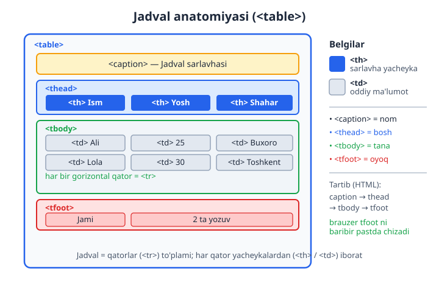
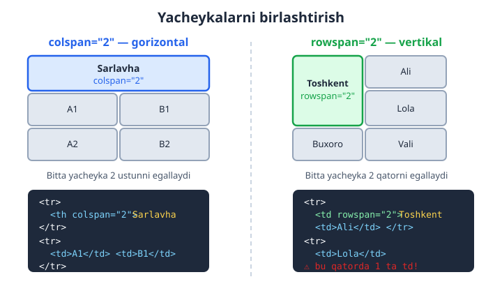
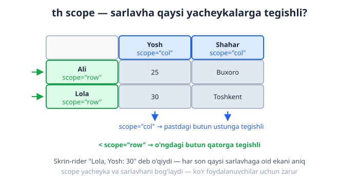

# 04 — Jadvallar

[⬅️ Oldingi: 03 — Havolalar va media](./03-havolalar-media.md) · [🏠 README](./README.md) · [Keyingi: 05 — Formalar ➡️](./05-formalar.md)

> **Bu bobda:** ma'lumot jadvallari: `table`, qator, ustun va birlashtirish.

---

Tasavvur qil: sinfdoshlaringning ismi, yoshi va shahri ro'yxatini yozyapsan. Buni daftarga qanday tushirasan? Albatta — **jadval** chizib. Yuqoriga sarlavhalarni (Ism, Yosh, Shahar), keyin har bir o'quvchiga bitta qator yozasan. Web sahifada ham xuddi shu narsa kerak bo'ladi, va HTML buni `<table>` yorlig'i bilan beradi.

Bu bobda jadvallarni eng oddiy 2x2 katakdan boshlab, birlashgan yacheykalar, sarlavha guruhlari va skrin-riderlar uchun moslashtirilgan "mukammal" jadvalgacha bosqichma-bosqich o'rganamiz. Eng muhimi — **nega** har bir element kerakligini tushunamiz, shunda yodlash emas, bilib ishlatadigan bo'lasan.

---

## 4.1 Jadval nima va u qachon kerak?

**Jadval (table)** — bu ma'lumotni **qatorlar (rows)** va **ustunlar (columns)** ko'rinishida tartibga soluvchi struktura. Ikkalasining kesishuvi **yacheyka (cell)** deyiladi.

Jadvalning bosh qoidasi bitta:

> 📌 Jadval faqat **tabular data** (ikki o'lchovli ma'lumot) uchun. Ya'ni har bir qiymat ham bir qatorga, ham bir ustunga tegishli bo'lsa.

Jadvalga **mos** keladigan misollar:
- Mahsulotlar narxi: har qatorda mahsulot, ustunlarda nom / narx / miqdor.
- Dars jadvali: qatorlar — soatlar, ustunlar — hafta kunlari.
- Moliyaviy hisobot: oylar va daromad/xarajat.

Jadvalga **mos kelmaydigan** misollar:
- Bitta ro'yxat (faqat ismlar) — bu uchun `<ul>` yoki `<ol>` to'g'riroq.
- Bitta xatboshi matn — bu `<p>`.

### "Layout uchun jadval ishlatma" — nega?

Yillar oldin (taxminan 1998–2008) dasturchilar butun sahifa **ko'rinishini** (chap menyu, o'rtada kontent, o'ngda reklama) jadvallar bilan yasashgan. Bugun bu **katta xato** hisoblanadi. Sabablarini bilib qo'y, chunki bu eng muhim "nega"lardan biri:

1. **Ma'no buziladi (semantika).** `<table>` brauzer va yordamchi texnologiyalarga "bu ikki o'lchovli ma'lumot" deb aytadi. Agar sen u bilan tugmalar va logotipni joylashtirsang, skrin-rider (ko'rlar uchun ovozli o'qigich) "5 ustunli jadval, 1-qator, 1-ustun" deb adashtiruvchi narsalarni o'qiydi. Foydalanuvchi sahifada nima borligini tushunolmaydi.

2. **Moslashuvchanlik yo'q (responsive).** Jadval qatorlari telefon ekranida bukila olmaydi. Layout jadval bilan qurilsa, kichik ekranda hammasi siqilib, o'qib bo'lmaydigan holga keladi.

3. **Tuzatish qiyin.** Layout jadvallari ichma-ich joylashgan o'nlab `<tr>`/`<td>` ga aylanadi — keyinchalik o'zgartirish azobga aylanadi.

💡 **Yodda tut:** Sahifa **ko'rinishi** (joylashuv) uchun `CSS` (Flexbox, Grid — keyingi boblarda) bor. `<table>` esa faqat **ma'lumot** uchun. Bu ikkisini aralashtirma.

⚠️ Oddiy tekshiruv: "Bu ma'lumotni Excel jadvaliga joylab, ustun sarlavhalari mantiqan to'g'ri chiqar miydi?" Agar ha — `<table>` to'g'ri tanlov. Agar yo'q — boshqa element kerak.

---

## 4.2 Eng oddiy jadval: `table`, `tr`, `td`, `th`

Jadval to'rt asosiy yorliqdan quriladi. Ularni esda saqlash uchun ingliz so'zlarini bilib qo'yamiz:

| Yorliq | Inglizcha | Vazifasi |
| --- | --- | --- |
| `<table>` | table | Butun jadvalni o'rab turadi (idish). |
| `<tr>` | **t**able **r**ow | Bitta **qator** (gorizontal chiziq). |
| `<td>` | **t**able **d**ata | Oddiy **yacheyka** (ma'lumot katagi). |
| `<th>` | **t**able **h**eader | **Sarlavha** yacheyka (ustun/qator nomi). |

Tartibni eslab qol: `<table>` ichida `<tr>` (qatorlar) bo'ladi, har bir `<tr>` ichida esa `<td>` yoki `<th>` (yacheykalar) bo'ladi. Bu **ichma-ich** (nested) tuzilma.

Mana eng oddiy jadval — 3 ustun, 3 qator:

```html
<table>
  <tr>
    <th>Ism</th>
    <th>Yosh</th>
    <th>Shahar</th>
  </tr>
  <tr>
    <td>Ali</td>
    <td>25</td>
    <td>Buxoro</td>
  </tr>
  <tr>
    <td>Lola</td>
    <td>30</td>
    <td>Toshkent</td>
  </tr>
</table>
```

**Natija:** brauzer 3 qatorli jadval chizadi. Birinchi qatordagi `<th>` matnlari odatda **qalin (bold)** va **markazlangan** ko'rinadi (bu brauzerning standart uslubi), `<td>` esa oddiy va chapga tekislangan.

📌 Diqqat: standart holatda jadvalda **chiziqlar (border) ko'rinmaydi!** Yacheykalar bir-biriga yopishib turadi. Chiziqlarni biz keyinroq (4.9) CSS bilan qo'shamiz. Hozircha strukturaga e'tibor ber.

### `<th>` va `<td>` — farqi shunchaki ko'rinishda emas

Yangi boshlovchilar ko'pincha "`<th>` shunchaki qalin `<td>`-ku, har joyda `<td>` ishlataveraman" deb o'ylaydi. Bu xato. Farq **ma'noda**:

- `<th>` brauzer va skrin-riderga "**bu sarlavha, qolgan yacheykalarni tavsiflaydi**" deb aytadi.
- `<td>` esa oddiy ma'lumot.

Skrin-rider `<td>` ni o'qiganda, unga tegishli `<th>` ni ham aytadi: masalan "Yosh: 25". Agar sarlavhalarni `<td>` qilib qo'ysang, ko'r foydalanuvchi "25" sonining nimaga tegishli ekanini bilolmaydi. Shuning uchun sarlavhalar **doim** `<th>` bo'lishi shart.

💡 `<th>` ni faqat yuqori qatordagina emas, chap ustunda ham ishlatish mumkin (masalan har qatorning "ismi" — bu qatorning sarlavhasi). Bu haqda 4.5 da gaplashamiz.

---

## 4.3 Jadval anatomiyasi: `caption`, `thead`, `tbody`, `tfoot`

Yuqoridagi oddiy jadval ishlaydi, lekin "professional" jadvalning yana to'rtta qismi bor. Ular jadvalni **mantiqiy bo'laklarga** ajratadi:



| Element | Vazifasi |
| --- | --- |
| `<caption>` | Jadvalning **nomi/sarlavhasi** (butun jadval nima haqida ekani). |
| `<thead>` | Jadval **boshi** — sarlavha qatori(lari) shu yerda. |
| `<tbody>` | Jadval **tanasi** — asosiy ma'lumot qatorlari. |
| `<tfoot>` | Jadval **oyog'i** — yakuniy qator (masalan "Jami"). |

### `<caption>` — jadvalga nom berish

`<caption>` `<table>` ning **ENG BIRINCHI** bolasi bo'lishi shart. U jadval ustida nom sifatida ko'rinadi:

```html
<table>
  <caption>2026-yil o'quvchilar ro'yxati</caption>
  <tr>
    <th>Ism</th>
    <th>Yosh</th>
  </tr>
  <tr>
    <td>Ali</td>
    <td>25</td>
  </tr>
</table>
```

**Natija:** jadval ustida "2026-yil o'quvchilar ro'yxati" matni chiqadi.

**Nega kerak?** Skrin-rider foydalanuvchisi jadvalga kirganda darhol "Bu jadval nima haqida?" deb eshitadi. Sarlavhasiz jadval — bu nomsiz papka kabi. `<caption>` ni `<h3>` bilan almashtirish mumkin emas, chunki `<caption>` jadval bilan **bog'langan** (skrin-rider buni jadval nomi deb biladi).

### `<thead>`, `<tbody>`, `<tfoot>` — qatorlarni guruhlash

Bu uchta element qatorlarni mantiqiy guruhlarga ajratadi:

```html
<table>
  <caption>Oylik byudjet</caption>
  <thead>
    <tr>
      <th>Modda</th>
      <th>Summa</th>
    </tr>
  </thead>
  <tbody>
    <tr>
      <td>Ovqat</td>
      <td>1 200 000</td>
    </tr>
    <tr>
      <td>Transport</td>
      <td>300 000</td>
    </tr>
  </tbody>
  <tfoot>
    <tr>
      <th>Jami</th>
      <td>1 500 000</td>
    </tr>
  </tfoot>
</table>
```

**Nega bu guruhlar foydali?**

1. **CSS bilan bezash oson.** "Faqat sarlavhaga kulrang fon ber" desang, `thead { ... }` deb bitta joyga yozasan — har bir `<th>` ni alohida belgilamaysan.

2. **Uzun jadvalni chop etish.** Agar jadval bir necha sahifaga cho'zilsa, brauzer `<thead>` ni har bir sahifa tepasida **takrorlaydi**, shunda ustun nomlari ko'zdan qochmaydi.

3. **Aniqlik.** Kod o'qiganga jadvalning qaysi qismi sarlavha, qaysi qismi ma'lumot ekani darhol ko'rinadi.

📌 **Qiziq nuqta — tartib:** HTML kodida tartib `caption → thead → tbody → tfoot` bo'lishi tavsiya etiladi. Agar `<tfoot>` ni `<tbody>` dan **oldin** yozsang ham, brauzer uni **baribir pastda** ko'rsatadi — chunki `tfoot` ning ma'nosi "oyoq" bo'lib, joylashuvi mazmuni bilan belgilanadi. Lekin chalkashmaslik uchun mantiqiy tartibda yoz.

💡 `<thead>`/`<tbody>`/`<tfoot>` ichida ham `<tr>` bo'ladi — bu guruhlar `<tr>` ni o'rab turuvchi qo'shimcha qatlam, xolos. `<tbody>` ichida bir nechta `<tr>` bo'lishi mumkin (odatda shunday).

---

## 4.4 Yacheykalarni birlashtirish: `colspan` va `rowspan`

Ba'zan bitta yacheyka **bir nechta** ustun yoki qatorni egallashi kerak bo'ladi. Masalan, ikkita ustunning umumiy sarlavhasi, yoki bir necha qator uchun bitta umumiy katak. Buning uchun ikkita atribut bor:

- `colspan="N"` — yacheyka **N ta ustunni** gorizontal egallaydi (column span).
- `rowspan="N"` — yacheyka **N ta qatorni** vertikal egallaydi (row span).



### `colspan` — gorizontal birlashtirish

```html
<table>
  <tr>
    <th colspan="2">Shaxsiy ma'lumot</th>
  </tr>
  <tr>
    <td>Ali</td>
    <td>25 yosh</td>
  </tr>
</table>
```

**Natija:** birinchi qatorda "Shaxsiy ma'lumot" matni ikkala ustun ustidan cho'zilib turadi. Pastda esa ikkita alohida yacheyka.

E'tibor ber: birinchi `<tr>` ichida atigi **bitta** `<th>` bor, lekin u `colspan="2"` tufayli ikkita ustun enini egallaydi. Agar adashib u yerga yana bitta yacheyka qo'shsang, jadval 3 ustun keng bo'lib ketadi.

### `rowspan` — vertikal birlashtirish

```html
<table>
  <tr>
    <td rowspan="2">Toshkent</td>
    <td>Ali</td>
  </tr>
  <tr>
    <td>Lola</td>
  </tr>
</table>
```

**Natija:** "Toshkent" yacheykasi ikkita qator balandligini egallaydi. Uning yonida birinchi qatorda "Ali", ikkinchi qatorda "Lola" bo'ladi.

⚠️ **Eng ko'p uchraydigan xato:** ikkinchi `<tr>` ga e'tibor ber — unda **faqat bitta** `<td>` bor ("Lola")! Chunki chap ustunni "Toshkent" yacheykasi `rowspan` bilan allaqachon egallab turibdi. Agar bu yerga ham ikkita `<td>` yozsang, jadval qiyshayib, ortiqcha katak paydo bo'ladi.

> 💡 **Oltin qoida:** `rowspan="N"` qo'ygan yacheykadan keyingi `N-1` ta qatorda — o'sha ustun uchun yacheyka YOZMA. Birlashgan yacheyka o'sha joyni o'zi to'ldiradi.

### Ikkalasini birga ishlatish

Murakkab jadvallarda `colspan` va `rowspan` birga kelishi mumkin. Mana misol — fan bo'yicha imtihon natijasi:

```html
<table>
  <caption>Imtihon natijalari</caption>
  <thead>
    <tr>
      <th rowspan="2">Talaba</th>
      <th colspan="2">Imtihon</th>
    </tr>
    <tr>
      <th>Yozma</th>
      <th>Og'zaki</th>
    </tr>
  </thead>
  <tbody>
    <tr>
      <td>Ali</td>
      <td>85</td>
      <td>90</td>
    </tr>
  </tbody>
</table>
```

**Natija:** "Talaba" sarlavhasi ikki qator balandlikda (`rowspan="2"`), "Imtihon" esa ikki ustun kengligida (`colspan="2"`) bo'lib, uning ostida "Yozma" va "Og'zaki" pastki sarlavhalari joylashadi. Bu — ikki darajali (ichma-ich) sarlavha tuzilmasi.

📌 Hisoblash maslahati: chalkashib ketmaslik uchun jadvalni **qog'ozda chizib ol**. Har bir katakni belgila, qaysilari birlashganini ko'rsat, keyin kodga ko'chir. Tajriba ortgach buni xayolan qila olasan.

---

## 4.5 Accessibility (kirish imkoniyati): `th scope`

Endi jadvalni nafaqat ko'rinadigan, balki **ko'rlar ham foydalana oladigan** qilamiz. Bu — "expert" darajaning birinchi bosqichi va ko'pincha unutiladigan, lekin juda muhim mavzu.

Muammo shunda: oddiy `<th>` skrin-riderga "bu sarlavha" deydi, lekin **qaysi yo'nalishdagi** sarlavha ekanini aytmaydi. Ustunning sarlavhasimi yoki qatorning? `scope` atributi aynan shuni aniqlaydi:

- `scope="col"` — bu `<th>` **ustun** sarlavhasi (pastdagi butun ustunga tegishli).
- `scope="row"` — bu `<th>` **qator** sarlavhasi (o'ngdagi butun qatorga tegishli).



```html
<table>
  <caption>O'quvchilar</caption>
  <thead>
    <tr>
      <td></td>
      <th scope="col">Yosh</th>
      <th scope="col">Shahar</th>
    </tr>
  </thead>
  <tbody>
    <tr>
      <th scope="row">Ali</th>
      <td>25</td>
      <td>Buxoro</td>
    </tr>
    <tr>
      <th scope="row">Lola</th>
      <td>30</td>
      <td>Toshkent</td>
    </tr>
  </tbody>
</table>
```

**Nega bu ajoyib?** Skrin-rider "30" yacheykasini o'qiganda, uning **ustun** sarlavhasi ("Yosh") va **qator** sarlavhasi ("Lola") ni topib, "Lola, Yosh: 30" deb o'qiydi. Foydalanuvchi har bir sonning aniq ma'nosini biladi — ko'zlari bilan jadvalni "ko'rmasa" ham.

E'tibor ber: chap yuqori burchakdagi bo'sh katak `<td></td>` qoldirildi (u na ustun, na qator sarlavhasi — shunchaki bo'sh burchak).

💡 **Soddagina qoida:** har bir oddiy jadvalda yuqori qatordagi `<th>` larga `scope="col"`, chap ustundagi `<th>` larga `scope="row"` qo'y. Bu deyarli barcha jadvallar uchun yetarli va jadvalingni to'liq accessible qiladi.

---

## 4.6 Murakkab jadvallar uchun: `headers` va `id` bog'lash

`scope` oddiy jadvallar uchun mukammal. Ammo jadval **murakkab** bo'lsa — masalan birlashgan, ikki darajali sarlavhalar bo'lsa — `scope` ba'zan yetarli aniq bog'lay olmaydi. Bunday holatlar uchun eng kuchli usul bor: har bir yacheykani uning sarlavhalari bilan **`id` orqali aniq** bog'lash.

Ishlash tartibi:
1. Har bir sarlavha `<th>` ga noyob `id` ber.
2. Har bir ma'lumot `<td>` da `headers` atributiga o'sha `id` larni (bo'shliq bilan ajratib) yoz.

```html
<table>
  <caption>Mahsulot narxlari</caption>
  <tr>
    <th id="mahsulot">Mahsulot</th>
    <th id="narx">Narx</th>
  </tr>
  <tr>
    <td headers="mahsulot">Olma</td>
    <td headers="narx">12 000</td>
  </tr>
  <tr>
    <td headers="mahsulot">Non</td>
    <td headers="narx">4 000</td>
  </tr>
</table>
```

Bir yacheyka **bir nechta** sarlavhaga bog'lansa, `headers` ichiga bir nechta `id` ni bo'shliq bilan yozasan:

```html
<td headers="imtihon yozma">85</td>
```

Bu "85 — Imtihon, Yozma" degani.

📌 **`scope` ni qachon, `headers/id` ni qachon ishlatish kerak?**

| Holat | Tavsiya |
| --- | --- |
| Oddiy jadval (bir qator/ustun sarlavha) | `scope="col"` / `scope="row"` |
| Murakkab, birlashgan, ko'p darajali sarlavhalar | `headers` + `id` |

⚠️ `headers`/`id` ko'proq yozishni talab qiladi va `id` lar **butun sahifada noyob** bo'lishi shart. Shuning uchun keraksiz joyda ishlatma — oddiy jadvalga `scope` yetarli. "Eng oddiy yetarli usulni tanla" tamoyiliga amal qil.

---

## 4.7 Ustunlarni guruhlash: `colgroup` va `col`

Hozirgacha biz **qatorlarni** (`tr`, `thead`/`tbody`) boshqardik. Lekin ba'zan butun **ustunga** xususiyat bermoqchi bo'lamiz — masalan ikkinchi ustunni och fon bilan ajratib ko'rsatish. HTML da yacheykalar qatorma-qator yoziladi, "ustun" degan to'g'ridan-to'g'ri element yo'q. Shu bois ustunlar uchun maxsus `<colgroup>` va `<col>` mavjud.

- `<colgroup>` — ustunlar guruhini e'lon qiladi (`<table>` ichida, `<caption>` dan keyin, `<thead>` dan oldin).
- `<col>` — bitta ustunni ifodalaydi (yopiluvchi yorliq kerak emas).

```html
<table>
  <caption>Narxlar jadvali</caption>
  <colgroup>
    <col>
    <col style="background-color: #f8fafc;">
    <col span="2" style="background-color: #fef3c7;">
  </colgroup>
  <thead>
    <tr>
      <th>Mahsulot</th>
      <th>Narx</th>
      <th>Soni</th>
      <th>Jami</th>
    </tr>
  </thead>
  <tbody>
    <tr>
      <td>Olma</td>
      <td>12 000</td>
      <td>3</td>
      <td>36 000</td>
    </tr>
  </tbody>
</table>
```

**Natija:** ikkinchi ustun ("Narx") och kulrang fonli, uchinchi va to'rtinchi ustunlar ("Soni", "Jami") sariq fonli bo'ladi. `<col span="2">` bitta `<col>` bilan ikki ustunni qamrab oldi.

**Nega foydali?** Butun ustunga uslub bermoqchi bo'lsang, har bir `<td>` ga alohida `class` qo'shish o'rniga bitta `<col>` yetadi — kod qisqaradi.

⚠️ **Muhim cheklov:** `<col>` ga faqat **cheklangan** CSS xususiyatlar ta'sir qiladi: `background`, `border`, `width`, `visibility`. Masalan `color` (matn rangi) yoki `font-weight` `<col>` orqali **ishlamaydi** — chunki matn yacheykaga (`<td>`) tegishli, ustunga emas. Bu narsalar uchun yacheykalarning o'ziga uslub berish kerak.

💡 `<col>` eng ko'p ishlatiladigan joyi — ustun **kengligini** (`width`) belgilash: `<col style="width: 40%;">`.

---

## 4.8 To'liq, "to'g'ri qurilgan" jadval namunasi

Endi o'rganganlarimizning hammasini bitta puxta jadvalga jamlaymiz. Bu — sen real loyihada yozishing kerak bo'lgan "etalon" jadval:

```html
<table>
  <caption>2026-yil yarim yillik savdo hisoboti</caption>

  <colgroup>
    <col>
    <col span="2">
  </colgroup>

  <thead>
    <tr>
      <th scope="col">Hudud</th>
      <th scope="col">1-chorak</th>
      <th scope="col">2-chorak</th>
    </tr>
  </thead>

  <tbody>
    <tr>
      <th scope="row">Toshkent</th>
      <td>4 500</td>
      <td>5 200</td>
    </tr>
    <tr>
      <th scope="row">Samarqand</th>
      <td>3 100</td>
      <td>3 400</td>
    </tr>
  </tbody>

  <tfoot>
    <tr>
      <th scope="row">Jami</th>
      <td>7 600</td>
      <td>8 600</td>
    </tr>
  </tfoot>
</table>
```

Bu jadval nimasi bilan yaxshi?
- `<caption>` — jadvalning aniq nomi bor.
- `<thead>`/`<tbody>`/`<tfoot>` — mantiqiy bo'laklarga ajratilgan.
- `scope="col"` va `scope="row"` — har bir son qaysi hudud va qaysi chorakka oid ekani skrin-riderga aniq.
- `<tfoot>` dagi "Jami" — yakuniy hisob alohida ajratilgan.

📌 Mana shu skelet — deyarli har qanday ma'lumot jadvali uchun ishlaydi. Yangi jadval yozayotganda shu namunadan boshla, keyin ustun/qatorlarni o'zingnikiga moslab o'zgartir.

---

## 4.9 Jadvalni CSS bilan bezashga kirish (oldindan eslatma)

Yuqorida aytib o'tdik: standart jadvalda chiziqlar ko'rinmaydi va yacheykalar bir-biriga yopishadi. Buni CSS hal qiladi. To'liq bezashni keyingi CSS boblarida o'rganamiz, lekin eng zarur ikki narsani hozir ko'rib qo'yamiz, chunki ularsiz jadval xunuk ko'rinadi.

```html
<style>
  table {
    border-collapse: collapse; /* eng muhim qator — pastga qara */
    width: 100%;
  }
  th, td {
    border: 1px solid #94a3b8; /* har yacheykaga chiziq */
    padding: 8px 12px;          /* ichki bo'shliq */
    text-align: left;
  }
  thead {
    background-color: #dbeafe;  /* sarlavhaga fon */
  }
</style>
```

### `border-collapse` — nega bu eng muhim qator?

Standart holatda har bir yacheyka **o'zining alohida** chizig'iga ega. Natijada ikki qo'shni yacheyka orasida **ikkita** chiziq paydo bo'ladi (biri u yacheykadan, biri bu yacheykadan) — qo'sh chiziqli, eski ko'rinishdagi jadval chiqadi.

`border-collapse: collapse;` brauzerga "qo'shni chiziqlarni **bitta** qilib birlashtir" deydi. Natijada toza, bir piksellik chiziqli zamonaviy jadval hosil bo'ladi.

> 💡 Amaliyotda jadval bezayotganda deyarli **har doim** `border-collapse: collapse;` dan boshlanadi. Buni "jadval CSS ining birinchi qadami" deb yodda tut.

`padding` esa yacheyka ichidagi matnni chetidan biroz uzoqlashtiradi — matn chiziqqa yopishib turmaydi, o'qish qulay bo'ladi.

⚠️ Diqqat: chiroyli ko'rinish uchun chiziqni **`<table>` ga emas, balki `<th>` va `<td>` ga** ber. Faqat `<table>` ga `border` bersang, ichki yacheykalar orasida chiziq bo'lmaydi — atrofidagina ramka chiqadi.

Qolgani — ranglar, zebra (qator-ma-qator turli fon), `:hover` effektlari va responsive jadvallar — CSS boblarida batafsil. Hozircha jadvalning **strukturasini** mukammal qurishni o'rganib oldik; ko'rinish — keyingi qadam.

---

## Xulosa

- `<table>` faqat **tabular data** (ikki o'lchovli ma'lumot) uchun; layout uchun emas (CSS Flexbox/Grid bor).
- Asosiy yorliqlar: `<table>` (idish), `<tr>` (qator), `<td>` (ma'lumot), `<th>` (sarlavha).
- Struktura: `<caption>` (nom), `<thead>`/`<tbody>`/`<tfoot>` (bosh/tana/oyoq) jadvalni mantiqiy bo'laklaydi.
- `colspan` — gorizontal, `rowspan` — vertikal birlashtirish; birlashgan qatorda ortiqcha yacheyka yozma.
- Accessibility: oddiy jadvalga `scope="col"`/`scope="row"`, murakkabga `headers`+`id`.
- `<colgroup>`/`<col>` — butun ustunga (fon, kenglik) uslub berish uchun.
- CSS bezashda `border-collapse: collapse;` dan boshla.

---

## Mashqlar

> Quyidagi mashqlarni tartib bilan bajar. Har birida avval o'zing urinib ko'r, keyin yechimni och.

### Mashq 1 — Eng oddiy jadval

3 ustunli (Ism, Yosh, Kasb) va 2 ta ma'lumot qatori bo'lgan jadval yoz. Yuqori qator `<th>` lardan iborat bo'lsin.

<details markdown="1"><summary>Yechim</summary>

```html
<table>
  <tr>
    <th>Ism</th>
    <th>Yosh</th>
    <th>Kasb</th>
  </tr>
  <tr>
    <td>Ali</td>
    <td>25</td>
    <td>Dasturchi</td>
  </tr>
  <tr>
    <td>Lola</td>
    <td>30</td>
    <td>Shifokor</td>
  </tr>
</table>
```

</details>

### Mashq 2 — `caption` qo'shish

1-mashqdagi jadvalga "Xodimlar ro'yxati" degan `<caption>` qo'sh. U `<table>` ning birinchi bolasi bo'lishini unutma.

<details markdown="1"><summary>Yechim</summary>

```html
<table>
  <caption>Xodimlar ro'yxati</caption>
  <tr>
    <th>Ism</th>
    <th>Yosh</th>
    <th>Kasb</th>
  </tr>
  <tr>
    <td>Ali</td>
    <td>25</td>
    <td>Dasturchi</td>
  </tr>
</table>
```

`<caption>` har doim `<table>` ichidagi eng birinchi element bo'lishi shart.

</details>

### Mashq 3 — `thead`/`tbody`/`tfoot` bilan struktura

Quyidagi byudjet jadvalini to'liq strukturali (caption + thead + tbody + tfoot) holda yoz:
nom "Oylik byudjet"; sarlavhalar "Modda" va "Summa"; tana qatorlari: Ovqat — 1 200 000, Transport — 300 000; oyoq qatori: Jami — 1 500 000.

<details markdown="1"><summary>Yechim</summary>

```html
<table>
  <caption>Oylik byudjet</caption>
  <thead>
    <tr>
      <th>Modda</th>
      <th>Summa</th>
    </tr>
  </thead>
  <tbody>
    <tr>
      <td>Ovqat</td>
      <td>1 200 000</td>
    </tr>
    <tr>
      <td>Transport</td>
      <td>300 000</td>
    </tr>
  </tbody>
  <tfoot>
    <tr>
      <th>Jami</th>
      <td>1 500 000</td>
    </tr>
  </tfoot>
</table>
```

</details>

### Mashq 4 — `colspan` bilan umumiy sarlavha

Ikki ustunli ("Telefon", "Email") jadval yoz, lekin ularning ustida bitta umumiy "Bog'lanish" sarlavhasi `colspan` bilan ikkala ustunni qamrasin.

<details markdown="1"><summary>Yechim</summary>

```html
<table>
  <tr>
    <th colspan="2">Bog'lanish</th>
  </tr>
  <tr>
    <th>Telefon</th>
    <th>Email</th>
  </tr>
  <tr>
    <td>+998 90 123 45 67</td>
    <td>ali@example.com</td>
  </tr>
</table>
```

Birinchi qatorda atigi bitta `<th>` borligiga e'tibor ber — `colspan="2"` uni ikki ustunga cho'zadi.

</details>

### Mashq 5 — `rowspan` bilan birlashtirish

Shahar bo'yicha guruhlangan jadval yoz: "Toshkent" yacheykasi `rowspan="2"` bilan ikki qatorni egallasin, yonida Ali va Lola bo'lsin.

<details markdown="1"><summary>Yechim</summary>

```html
<table>
  <tr>
    <th>Shahar</th>
    <th>Ism</th>
  </tr>
  <tr>
    <td rowspan="2">Toshkent</td>
    <td>Ali</td>
  </tr>
  <tr>
    <td>Lola</td>
  </tr>
</table>
```

Ikkinchi ma'lumot qatorida (Lola) faqat bitta `<td>` borligiga diqqat qil — chap ustunni "Toshkent" allaqachon egallab turibdi.

</details>

### Mashq 6 — `scope` bilan accessibility

Quyidagi jadvalni accessible qil: yuqori qator `<th>` lariga `scope="col"`, har qatorning birinchi (ism) yacheykasini `<th scope="row">` qil.

```html
<table>
  <tr><th>Ism</th><th>Yosh</th></tr>
  <tr><td>Ali</td><td>25</td></tr>
</table>
```

<details markdown="1"><summary>Yechim</summary>

```html
<table>
  <thead>
    <tr>
      <th scope="col">Ism</th>
      <th scope="col">Yosh</th>
    </tr>
  </thead>
  <tbody>
    <tr>
      <th scope="row">Ali</th>
      <td>25</td>
    </tr>
  </tbody>
</table>
```

Endi skrin-rider "25" ni "Ali, Yosh: 25" deb o'qiydi. Ism yacheykasi `<td>` dan `<th scope="row">` ga aylanganiga e'tibor ber.

</details>

### Mashq 7 — `colgroup` bilan ustunni ajratish

Uch ustunli (Mahsulot, Narx, Soni) jadval yoz va `<colgroup>`/`<col>` yordamida o'rtadagi "Narx" ustuniga sariq (`#fef3c7`) fon ber.

<details markdown="1"><summary>Yechim</summary>

```html
<table>
  <caption>Mahsulotlar</caption>
  <colgroup>
    <col>
    <col style="background-color: #fef3c7;">
    <col>
  </colgroup>
  <thead>
    <tr>
      <th scope="col">Mahsulot</th>
      <th scope="col">Narx</th>
      <th scope="col">Soni</th>
    </tr>
  </thead>
  <tbody>
    <tr>
      <td>Olma</td>
      <td>12 000</td>
      <td>3</td>
    </tr>
  </tbody>
</table>
```

`<colgroup>` ichidagi ikkinchi `<col>` o'rtadagi ustunga mos keladi va faqat unga fon beradi.

</details>

### Mashq 8 — To'liq jadval (yakuniy sinov)

Quyidagi shartlarning HAMMASIga javob beradigan bitta jadval yoz:
1. `<caption>` "Sinf natijalari".
2. `<thead>` da ikki darajali sarlavha: "Talaba" (`rowspan="2"`) va "Imtihon" (`colspan="2"`), uning ostida "Yozma" va "Og'zaki".
3. `<tbody>` da kamida bitta talaba (ism `<th scope="row">`, ikkita baho `<td>`).
4. CSS bilan `border-collapse: collapse;` va yacheykalarga chiziq qo'sh.

<details markdown="1"><summary>Yechim</summary>

```html
<style>
  table {
    border-collapse: collapse;
  }
  th, td {
    border: 1px solid #94a3b8;
    padding: 8px 12px;
    text-align: center;
  }
  thead {
    background-color: #dbeafe;
  }
</style>

<table>
  <caption>Sinf natijalari</caption>
  <thead>
    <tr>
      <th rowspan="2" scope="col">Talaba</th>
      <th colspan="2" scope="colgroup">Imtihon</th>
    </tr>
    <tr>
      <th scope="col">Yozma</th>
      <th scope="col">Og'zaki</th>
    </tr>
  </thead>
  <tbody>
    <tr>
      <th scope="row">Ali</th>
      <td>85</td>
      <td>90</td>
    </tr>
    <tr>
      <th scope="row">Lola</th>
      <td>78</td>
      <td>88</td>
    </tr>
  </tbody>
</table>
```

Bu yechim bobning deyarli barcha tushunchalarini birlashtiradi: `caption`, `thead`/`tbody`, ikki darajali sarlavha (`rowspan`+`colspan`), `scope`, va asosiy CSS (`border-collapse`). "Imtihon" sarlavhasiga `scope="colgroup"` berildi — chunki u bir nechta ustunni qamragan guruh sarlavhasi.

</details>

---

[⬅️ Oldingi: 03 — Havolalar va media](./03-havolalar-media.md) · [🏠 README](./README.md) · [Keyingi: 05 — Formalar ➡️](./05-formalar.md)
