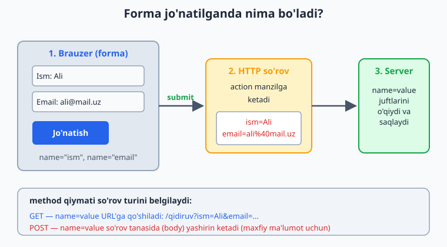
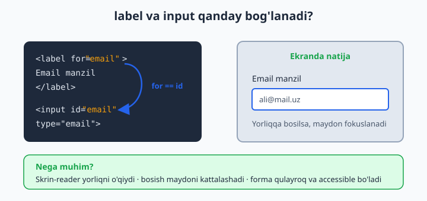
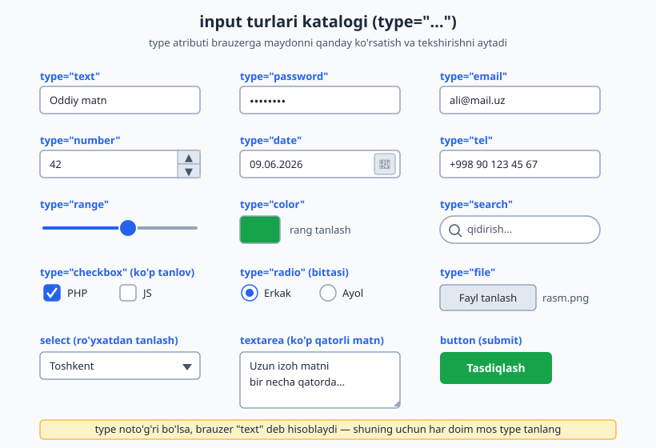

# 05 — Formalar

[⬅️ Oldingi: 04 — Jadvallar](./04-jadvallar.md) · [🏠 README](./README.md) · [Keyingi: 06 — Semantik HTML va accessibility ➡️](./06-semantik-accessibility.md)

> **Bu bobda:** foydalanuvchidan ma'lumot olishni o'rganamiz — `form` elementi, barcha `input` turlari va brauzer ichidagi validatsiya (tekshiruv).

---

Hozirgacha biz sahifaga matn, rasm, havola **chiqarib bera oldik**. Lekin internet faqat o'qish uchun emas — biz unga ma'lumot **kiritamiz** ham: login qilamiz, izoh yozamiz, qidiramiz, buyurtma beramiz. Bularning hammasi orqasida **forma (form)** turadi.

Formani oddiy hayotdagi **anketa qog'oziga** o'xshating: bir nechta katakcha (maydon), har birining yonida nima yozish kerakligini aytuvchi yozuv (yorliq), va oxirida "Topshirish" tugmasi. Foydalanuvchi to'ldiradi, tugmani bosadi — va qog'oz **birovga** (serverga) yetkaziladi. Mana shu bob aynan shu jarayonni HTML'da qanday yasashni o'rgatadi.

📌 Bu bobda biz asosan **HTML tomonini** o'rganamiz: maydonlarni qanday yasash va brauzer ularni qanday tekshiradi. Ma'lumotni serverda **qabul qilish va saqlash** (PHP, JS) keyingi qo'llanmalar mavzusi — lekin "nega" tushunarli bo'lishi uchun server tomonida nima bo'lishini ham qisqacha izohlaymiz.

---

## 5.1 `form` elementi — hamma narsaning idishi

Har qanday ma'lumot kiritish maydoni `<form>` ichida turishi kerak. `form` — bu maydonlarni **bir guruhga** birlashtiruvchi va ularni qayerga yuborishni biluvchi idish.

```html
<form action="/royxatdan-otish" method="post">
  <input type="text" name="ism">
  <button type="submit">Jo'natish</button>
</form>
```

Bu yerda ikkita eng muhim atribut bor: `action` va `method`.

### `action` — ma'lumot QAYERGA boradi

`action` — bu **manzil (URL)**: foydalanuvchi tugmani bosganda, to'ldirilgan ma'lumot aynan shu manzilga jo'natiladi.

```html
<form action="/login">        <!-- shu sayt ichidagi /login manziliga -->
<form action="https://misol.uz/saqlash">  <!-- to'liq manzil -->
<form action="">              <!-- bo'sh bo'lsa: shu sahifaning o'ziga qaytadi -->
```

💡 Hozircha bizda haqiqiy server yo'q — shuning uchun tugmani bosganingizda "sahifa topilmadi" chiqishi normal. Muhimi — **mexanizmni** tushunish.

### `method` — ma'lumot QANDAY boradi: GET vs POST

`method` so'rovning **turini** belgilaydi. Ikkita asosiy qiymat bor va ular orasidagi farq juda muhim:

| | `method="get"` | `method="post"` |
|---|---|---|
| Ma'lumot qayerda ketadi | **URL'ga** qo'shiladi: `?ism=Ali&shahar=Toshkent` | So'rov **tanasida (body)** yashirin |
| URL'da ko'rinadimi | Ha, manzil qatorida ko'rinadi | Yo'q |
| Xatcho'p qilsa bo'ladimi | Ha (qidiruv natijasi kabi) | Yo'q |
| Maxfiy ma'lumot uchun | ❌ Yaramaydi (parol URL'da ko'rinadi!) | ✅ To'g'ri |
| Qachon ishlatiladi | **O'qish/qidirish** (hech narsa o'zgartirmaydi) | **Yozish/o'zgartirish** (ma'lumot saqlash) |

**Oddiy qoida:**
- Faqat ma'lumot **olib kelyapsizmi** (qidiruv, filtrlash)? → `get`.
- Ma'lumot **saqlayapsizmi/o'zgartiryapsizmi** (ro'yxatdan o'tish, izoh qo'shish, parol)? → `post`.

```html
<!-- Qidiruv: get to'g'ri, chunki natijani xatcho'p qilsa bo'ladi -->
<form action="/qidiruv" method="get">
  <input type="search" name="q">
  <button>Qidirish</button>
</form>
<!-- Tugma bosilgach manzil: /qidiruv?q=telefon -->
```

```html
<!-- Login: post to'g'ri, chunki parol URL'da ko'rinmasligi kerak -->
<form action="/login" method="post">
  <input type="password" name="parol">
  <button>Kirish</button>
</form>
```

⚠️ **Eng katta xato:** parol yoki shaxsiy ma'lumotni `get` bilan yuborish. U holda parol manzil qatorida (`/login?parol=12345`) ochiq ko'rinadi, brauzer tarixiga yoziladi va xavfsiz emas. Maxfiy narsa uchun **doim `post`**.

📌 `method` yozilmasa, brauzer **`get`** deb hisoblaydi.

---

## 5.2 Forma jo'natilganda nima bo'ladi? (umumiy oqim)

"Jo'natish" tugmasi bosilganda quyidagilar ketma-ket yuz beradi:



1. **Brauzer** har bir maydonni `name=value` ko'rinishidagi juftlikka aylantiradi (`ism=Ali`, `email=ali@mail.uz`).
2. Brauzer (agar validatsiya o'tib bo'lsa) bu juftlarni **`action` manziliga**, **`method`** turida jo'natadi.
3. **Server** kelgan `name=value` juftlarini o'qiydi, qayta ishlaydi (saqlaydi, tekshiradi) va javob qaytaradi.

Bu yerda eng asosiy tushuncha — **`name`**. Server maydonni **nomi orqali** tanib oladi. Buni keyingi bo'limda batafsil ko'ramiz.

---

## 5.3 `name` va `value` — server ma'lumotni qanday "ko'radi"

Brauzer uchun maydon — bu ekrandagi quti. Lekin **server uchun** maydon — bu shunchaki bitta `name=value` juftligi. Ekranda nima yozilgani serverga ko'rinmaydi; serverga faqat shu juftlik boradi.

```html
<form action="/saqlash" method="post">
  <input type="text" name="ism" value="Ali">
  <input type="email" name="email">
</form>
```

- **`name`** — maydonning **kaliti (key)**. Server ma'lumotni shu nom orqali oladi. **`name` bo'lmasa, maydon umuman jo'natilmaydi!**
- **`value`** — maydonning **qiymati**. `value` atributi boshlang'ich qiymatni belgilaydi; foydalanuvchi yozsa, value uning yozgani bo'ladi.

Agar foydalanuvchi ism maydoniga `Olim` deb yozsa, serverga shu boradi:

```
ism=Olim
email=olim@mail.uz
```

💡 Serverda (masalan PHP'da) bu `$_POST['ism']` orqali olinadi — ya'ni `name` qiymati bilan. Shuning uchun `name`larni **mazmunli va ingliz/lotin harflarda, bo'shliqsiz** yozing: `name="ism"`, `name="email"`, `name="phone_number"`.

⚠️ Eng ko'p uchraydigan boshlovchi xatosi: chiroyli forma yasab, lekin `name` atributini unutib qo'yish. Tashqaridan hammasi joyida ko'rinadi, lekin serverga **hech narsa kelmaydi**, chunki nomsiz maydon yuborilmaydi.

---

## 5.4 `label` — maydonning yorlig'i (va nega u shart)

`label` — bu maydon **nima uchun ekanini** tushuntiruvchi yozuv ("Ism", "Email", "Parol"). Uni input bilan **bog'lash** kerak:



Bog'lashning ikki usuli bor:

**1-usul — `for` va `id` orqali (tavsiya etiladi):**

```html
<label for="email">Email manzilingiz</label>
<input type="email" id="email" name="email">
```

`label`ning `for` qiymati input'ning `id` qiymatiga **aynan teng** bo'lishi kerak — shunda ular bog'lanadi.

**2-usul — input'ni label ichiga o'rash:**

```html
<label>
  Email manzilingiz
  <input type="email" name="email">
</label>
```

### Nega `label` muhim? (uchta sabab)

1. **Bosish maydoni kattalashadi** — foydalanuvchi yorliq matniga bossa ham, maydon aktivlashadi (fokuslanadi). Mobil telefonda kichkina checkbox'ni topish o'rniga, uzun matnga bosish ancha qulay.
2. **Accessibility (qulaylik)** — ko'zi ojiz foydalanuvchilar **skrin-reader** (ekranni o'quvchi dastur) ishlatadi. U bog'langan `label`ni o'qib, "Email manzilingiz, matn maydoni" deb aytadi. Bog'lanmagan maydon esa "nomsiz maydon" bo'lib qoladi.
3. **Tushunarlilik** — yorliqsiz forma jumboq kabi: foydalanuvchi har bir katakka nima yozishni bilmaydi.

📌 Qoida: **har bir maydonning bog'langan `label`i bo'lsin.** Bu professional formaning birinchi belgisi.

---

## 5.5 `input` turlari — `type` atributi

`input` — formaning eng asosiy elementi. Uning ko'rinishi va xulqi **`type`** atributiga bog'liq. To'g'ri `type` tanlash — ham qulaylik, ham bepul validatsiya beradi.



### Matn kiritish turlari

```html
<label for="ism">Ism</label>
<input type="text" id="ism" name="ism">

<label for="parol">Parol</label>
<input type="password" id="parol" name="parol">

<label for="email">Email</label>
<input type="email" id="email" name="email">

<label for="sayt">Veb-sayt</label>
<input type="url" id="sayt" name="sayt">

<label for="tel">Telefon</label>
<input type="tel" id="tel" name="tel">

<label for="qidiruv">Qidirish</label>
<input type="search" id="qidiruv" name="q">
```

- **`text`** — oddiy bir qatorli matn. Eng universal tur.
- **`password`** — yozilgan belgilar **nuqtalar bilan yashiriladi** (`••••`), boshqalar yelka ortidan ko'rmasligi uchun. ⚠️ Bu faqat *ekranda* yashiradi — internetda xavfsiz uzatish uchun **HTTPS** kerak (bu boshqa mavzu).
- **`email`** — brauzer `@` belgisi borligini avtomatik tekshiradi. Mobil telefonda klaviaturada `@` tugmasi chiqadi.
- **`url`** — to'liq manzil (`https://...`) formatini tekshiradi.
- **`tel`** — telefon raqami. Brauzer formatni tekshirmaydi (chunki har davlatda har xil), lekin mobilda **raqamli klaviatura** ochiladi.
- **`search`** — qidiruv maydoni. Odatda yumaloq chetli va ichida "tozalash" (×) tugmasi bilan keladi.

💡 **Nega aniq `type`?** `type="email"` yozsangiz, mobil foydalanuvchi avtomatik `@` belgili klaviatura oladi va brauzer formatni tekshiradi — hammasi **bepul**, hech qanday kod yozmasdan. Hammasini `text` qilib qo'ysangiz, bu imkoniyatlarni yo'qotasiz.

### Raqam, sana va diapazon turlari

```html
<label for="yosh">Yoshingiz</label>
<input type="number" id="yosh" name="yosh" min="0" max="120">

<label for="tugilgan">Tug'ilgan sana</label>
<input type="date" id="tugilgan" name="tugilgan">

<label for="ovoz">Ovoz balandligi</label>
<input type="range" id="ovoz" name="ovoz" min="0" max="100" value="50">

<label for="rang">Sevimli rang</label>
<input type="color" id="rang" name="rang">
```

- **`number`** — faqat raqam. Yonida ▲▼ strelkalar chiqadi, `min`/`max` bilan chegaralanadi.
- **`date`** — sana tanlash. Brauzer **kalendar** (taqvim) ochib beradi — qo'lda yozish shart emas.
- **`range`** — surgich (slider). Aniq raqam muhim bo'lmaganda, "kam–ko'p" tanlash uchun (ovoz, yorqinlik).
- **`color`** — rang tanlovchi panel ochadi, natija `#rrggbb` ko'rinishida keladi.

📌 Yana bor: `type="datetime-local"` (sana + vaqt), `type="time"` (faqat vaqt), `type="month"`, `type="week"`. Ularning hammasi shu mantiqda ishlaydi.

### Tanlov turlari: `checkbox` va `radio`

Bu ikkalasi orasidagi farq boshlovchilarni eng ko'p chalg'itadi:

```html
<!-- checkbox: bir nechtasini belgilash mumkin -->
<p>Qaysi tillarni bilasiz?</p>
<label><input type="checkbox" name="tillar[]" value="php"> PHP</label>
<label><input type="checkbox" name="tillar[]" value="js"> JavaScript</label>
<label><input type="checkbox" name="tillar[]" value="py"> Python</label>

<!-- radio: faqat BITTASINI tanlash mumkin -->
<p>Jinsingiz:</p>
<label><input type="radio" name="jins" value="erkak"> Erkak</label>
<label><input type="radio" name="jins" value="ayol"> Ayol</label>
```

- **`checkbox`** — har biri **mustaqil**: 0 ta, 1 ta yoki hammasi belgilanishi mumkin. "Hammasidan birortasini" tanlash kabi.
- **`radio`** — bir guruhdan **faqat bittasi**. Sirning kaliti: bir guruhdagi radio'larning **`name`'i bir xil** bo'lishi shart (`name="jins"`). Brauzer bir xil `name`'li radio'larni guruh deb biladi va faqat bittasiga ruxsat beradi.

💡 Radio'da `value` **shart**. Server qaysi tanlanganini bilishi uchun har bir radio'da boshqacha `value` bo'lishi kerak (`value="erkak"`, `value="ayol"`). Tanlangan radio'ning value'si jo'natiladi.

📌 Birortasini **avval belgilangan** qilib qo'yish uchun `checked` atributini qo'shing:

```html
<label><input type="radio" name="jins" value="erkak" checked> Erkak</label>
```

### Maxsus turlar: `file` va `hidden`

```html
<!-- file: foydalanuvchi kompyuteridan fayl tanlaydi -->
<label for="rasm">Rasm yuklang</label>
<input type="file" id="rasm" name="rasm" accept="image/*">

<!-- hidden: ko'rinmaydi, lekin serverga jo'natiladi -->
<input type="hidden" name="user_id" value="42">
```

- **`file`** — rasm, hujjat va h.k. yuklash uchun. `accept="image/*"` faqat rasmlarga ruxsat beradi. ⚠️ Fayl yuklash uchun `form`ga `enctype="multipart/form-data"` qo'shish **shart** (aks holda fayl jo'natilmaydi):

```html
<form action="/yuklash" method="post" enctype="multipart/form-data">
  <input type="file" name="rasm">
  <button>Yuklash</button>
</form>
```

- **`hidden`** — foydalanuvchiga **ko'rinmaydi**, lekin u bilan birga serverga jo'natiladi. Masalan, qaysi foydalanuvchi tahrir qilayotganini bildiruvchi `user_id` kabi yashirin ma'lumotlar uchun. ⚠️ "Yashirin" so'ziga aldanmang — uni HTML'ni ko'rgan har kim o'qiy oladi, shuning uchun **parol kabi maxfiy narsani u yerga yozmang**.

---

## 5.6 `textarea` — ko'p qatorli matn

`input type="text"` bir qatorli. Uzun matn (izoh, xabar, manzil) uchun **`textarea`** ishlatiladi:

```html
<label for="izoh">Izohingiz</label>
<textarea id="izoh" name="izoh" rows="5" cols="40" placeholder="Bu yerga yozing..."></textarea>
```

- `rows` — necha qator balandlikda ko'rinishi, `cols` — kengligi.
- ⚠️ `textarea`ning **`value` atributi yo'q**! Boshlang'ich matn **ochuvchi va yopuvchi teg orasiga** yoziladi:

```html
<textarea name="izoh">Bu matn boshidan turadi.</textarea>
```

📌 `<textarea></textarea>`ni har doim **yoping**, hatto bo'sh bo'lsa ham. Yopilmasa, undan keyingi hamma narsa textarea ichiga "yutilib" ketadi.

---

## 5.7 `select` — ro'yxatdan tanlash

Ko'p variantdan bittasini (yoki bir nechtasini) tanlash uchun `select` ishlatiladi. Bu ekranda joy tejaydi:

```html
<label for="shahar">Shahringiz</label>
<select id="shahar" name="shahar">
  <option value="">— tanlang —</option>
  <option value="tosh">Toshkent</option>
  <option value="sam">Samarqand</option>
  <option value="buxoro" selected>Buxoro</option>
</select>
```

- Har bir variant — `<option>`. Serverga uning **`value`'si** jo'natiladi (ekrandagi matn emas!). Agar `value` yozilmasa, ichidagi matn jo'natiladi.
- `selected` — qaysi variant **avvaldan tanlangan** bo'lishini belgilaydi.
- Birinchi bo'sh `option` ("— tanlang —") — foydalanuvchini majburlash uchun foydali hiyla.

### `optgroup` — variantlarni guruhlash

Variantlar ko'p bo'lsa, ularni mavzu bo'yicha guruhlash mumkin:

```html
<select name="taom">
  <optgroup label="Issiq taomlar">
    <option value="osh">Osh</option>
    <option value="manti">Manti</option>
  </optgroup>
  <optgroup label="Ichimliklar">
    <option value="choy">Choy</option>
    <option value="kofe">Kofe</option>
  </optgroup>
</select>
```

`optgroup`ning `label`i — guruh sarlavhasi (tanlab bo'lmaydi, faqat ko'rsatkich).

### `datalist` — yozish + taklif

`datalist` — `input` va `select` orasidagi gibrid: foydalanuvchi **erkin yozadi**, lekin brauzer **takliflar** ham ko'rsatadi:

```html
<label for="brauzer">Sevimli brauzer</label>
<input type="text" id="brauzer" name="brauzer" list="brauzerlar">
<datalist id="brauzerlar">
  <option value="Chrome">
  <option value="Firefox">
  <option value="Safari">
</datalist>
```

`input`ning `list` atributi `datalist`ning `id`'si bilan bog'lanadi. Foydalanuvchi taklif ichidan tanlashi **yoki** o'zinikini yozishi mumkin — `select`da esa faqat berilganlardan tanlash mumkin. Mana asosiy farq.

---

## 5.8 `button` — tugmalar va `type` ning ahamiyati

Tugma ikki xil yoziladi: `<button>` yoki `<input type="...">`. `<button>` qulayroq, chunki ichiga matn, rasm, ikonka qo'yish mumkin. Eng muhimi — tugmaning **`type`** atributi:

```html
<form action="/saqlash" method="post">
  <input type="text" name="ism">

  <button type="submit">Jo'natish</button>   <!-- formani jo'natadi -->
  <button type="reset">Tozalash</button>     <!-- maydonlarni bo'shatadi -->
  <button type="button">Ko'rsatish</button>  <!-- hech narsa qilmaydi (JS uchun) -->
</form>
```

- **`type="submit"`** — formani jo'natadi. Bu **standart** qiymat: agar `type` yozilmasa, tugma `submit` bo'ladi.
- **`type="reset"`** — barcha maydonlarni boshlang'ich holatiga qaytaradi. ⚠️ Ehtiyot bo'ling: foydalanuvchi uzun formani to'ldirib, adashib bosib yuborsa, hammasi yo'qoladi. Shuning uchun zamonaviy saytlarda kam ishlatiladi.
- **`type="button"`** — o'zicha hech narsa qilmaydi. JavaScript bilan boshqariladigan tugmalar uchun (masalan "parolni ko'rsatish").

⚠️ **Juda muhim tuzoq:** `<button>`da `type` yozmasangiz, u **avtomatik `submit`** bo'ladi! Forma ichidagi har qanday oddiy tugma (masalan "+1 qo'shish") `type="button"` yozmasangiz, bosilganda butun formani jo'natib yuboradi. Forma ichidagi har bir tugmaning `type`'ini ataylab yozing.

---

## 5.9 `fieldset` va `legend` — maydonlarni guruhlash

Uzun formani mantiqiy bo'laklarga bo'lish uchun `fieldset` (guruh) va `legend` (guruh sarlavhasi) ishlatiladi:

```html
<form action="/royxat" method="post">
  <fieldset>
    <legend>Shaxsiy ma'lumotlar</legend>
    <label for="ism">Ism</label>
    <input type="text" id="ism" name="ism">
    <label for="yosh">Yosh</label>
    <input type="number" id="yosh" name="yosh">
  </fieldset>

  <fieldset>
    <legend>Aloqa</legend>
    <label for="email">Email</label>
    <input type="email" id="email" name="email">
  </fieldset>

  <button type="submit">Ro'yxatdan o'tish</button>
</form>
```

- `fieldset` maydonlar atrofiga **ramka** chizadi va ularni bitta guruh sifatida ko'rsatadi.
- `legend` — shu ramkaning sarlavhasi.
- **Nega muhim?** Skrin-reader `legend`ni har bir maydon bilan birga o'qiydi ("Aloqa — Email"). Bu radio guruhi uchun ayniqsa foydali — guruh nima haqida ekanini bildiradi.

💡 `fieldset`ga `disabled` atributini qo'ysangiz, ichidagi **barcha** maydonlar bir vaqtda o'chiriladi (faolsizlanadi). Qadamli ("wizard") formalarda qulay.

---

## 5.10 Validatsiya atributlari — brauzer ichidagi tekshiruv

Brauzer formani jo'natishdan **oldin** maydonlarni tekshira oladi — biz hech qanday kod yozmasdan. Bu **HTML5 validatsiyasi** deyiladi. Asosiy atributlar:

```html
<form action="/royxat" method="post">
  <label for="ism">Ism (majburiy)</label>
  <input type="text" id="ism" name="ism"
         required
         minlength="2" maxlength="30"
         placeholder="Ismingizni yozing">

  <label for="parol">Parol</label>
  <input type="password" id="parol" name="parol"
         required minlength="8">

  <label for="yosh">Yosh</label>
  <input type="number" id="yosh" name="yosh" min="18" max="99">

  <label for="tel">Telefon</label>
  <input type="tel" id="tel" name="tel"
         pattern="\+998[0-9]{9}"
         placeholder="+998901234567">

  <button type="submit">Yuborish</button>
</form>
```

| Atribut | Ma'nosi | Qaysi maydonlarda |
|---|---|---|
| `required` | Maydon **bo'sh qolmasligi** kerak | barchasida |
| `minlength` / `maxlength` | Matn uzunligining eng kam / eng ko'p belgisi | matn maydonlari |
| `min` / `max` | Eng kichik / eng katta **qiymat** | `number`, `range`, `date` |
| `pattern` | Matn berilgan **shablon** (regex)ga mos kelishi shart | matn maydonlari |
| `placeholder` | Maydon bo'sh paytdagi **xira namuna** matn | matn maydonlari |

Agar foydalanuvchi `required` maydonni bo'sh qoldirib jo'natmoqchi bo'lsa, brauzer **jo'natmaydi** va "Bu maydonni to'ldiring" degan xabar ko'rsatadi — bularning hammasi avtomatik.

⚠️ **`placeholder` ≠ `label`!** `placeholder` — maydon ichidagi xira namuna matn. U **yorliq o'rnini bosa olmaydi**, chunki foydalanuvchi yoza boshlashi bilan yo'qoladi va keyin maydon nima uchun ekanini eslay olmaydi. Doim **`label` + `placeholder`** birga ishlatiladi:

```html
<label for="email">Email</label>
<input type="email" id="email" name="email" placeholder="masalan: ali@mail.uz">
```

### ⚠️ Eng muhim ogohlantirish: brauzer validatsiyasi YETARLI EMAS

HTML validatsiyasi — bu faqat **qulaylik** (foydalanuvchiga tez xabar berish). U **xavfsizlik emas!** Sababi: tajribali odam brauzer vositalarida `required`ni o'chirib tashlashi yoki formani umuman chetlab o'tib serverga to'g'ridan-to'g'ri yomon ma'lumot yuborishi mumkin.

📌 **Oltin qoida:** mijoz (brauzer) tomonida tekshiruv — qulaylik uchun; **server tomonida** tekshiruv — xavfsizlik uchun. **Har doim ikkalasini ham qiling.** Serverda tekshirishni keyingi qo'llanmalarda (PHP/JS) o'rganasiz, lekin tamoyilni hozir yodda tuting.

---

## 5.11 Accessibility va `autocomplete` — formani hamma uchun qulay qilish

Yaxshi forma — hamma (jumladan ko'zi ojizlar, klaviatura bilan ishlovchilar) foydalana oladigan forma. Asosiy amaliyotlar:

**1. Har maydonda bog'langan `label`** (5.4'da ko'rdik) — bu eng muhimi.

**2. `autocomplete` — brauzer yodlab, to'ldirib beradi.** Standart nomlar berilsa, brauzer foydalanuvchining oldingi ma'lumotini avtomatik taklif qiladi:

```html
<label for="ism">To'liq ism</label>
<input type="text" id="ism" name="ism" autocomplete="name">

<label for="email">Email</label>
<input type="email" id="email" name="email" autocomplete="email">

<label for="tel">Telefon</label>
<input type="tel" id="tel" name="tel" autocomplete="tel">
```

`autocomplete="name"`, `"email"`, `"tel"`, `"street-address"`, `"postal-code"` — bular brauzer biladigan **standart** nomlar. Foydalanuvchi qayta-qayta yozmaydi — bir bosishda to'ldiriladi.

**3. `aria` atributlari — qiyin holatlar uchun.** Agar yorliq yashirin bo'lishi kerak bo'lsa (masalan dizayn uchun), `aria-label` bilan skrin-reader uchun nom berish mumkin:

```html
<input type="search" name="q" aria-label="Saytdan qidirish">
```

Xato xabarini maydon bilan bog'lash uchun `aria-describedby`:

```html
<input type="email" id="email" name="email" aria-describedby="email-hint">
<small id="email-hint">Hech kimga ko'rsatilmaydi.</small>
```

💡 **Tartib:** birinchi navbatda haqiqiy `label`, `fieldset`, to'g'ri `type` ishlating. `aria` — bu **qo'shimcha**, oddiy HTML yeta olmagan joyni "yamash" uchun. To'g'ri HTML allaqachon ko'p accessibility'ni bepul beradi.

---

## 5.12 To'liq misol — barchasini birlashtiramiz

Quyida shu bobdagi tushunchalarni jamlagan haqiqiy ro'yxatdan o'tish formasi:

```html
<form action="/royxatdan-otish" method="post">
  <fieldset>
    <legend>Hisob yaratish</legend>

    <p>
      <label for="ism">To'liq ism</label><br>
      <input type="text" id="ism" name="ism"
             required minlength="2"
             autocomplete="name"
             placeholder="Ali Valiyev">
    </p>

    <p>
      <label for="email">Email</label><br>
      <input type="email" id="email" name="email"
             required autocomplete="email"
             placeholder="ali@mail.uz">
    </p>

    <p>
      <label for="parol">Parol</label><br>
      <input type="password" id="parol" name="parol"
             required minlength="8">
    </p>

    <p>
      <label for="shahar">Shahar</label><br>
      <select id="shahar" name="shahar" required>
        <option value="">— tanlang —</option>
        <option value="tosh">Toshkent</option>
        <option value="sam">Samarqand</option>
      </select>
    </p>

    <p>Jinsingiz:</p>
    <p>
      <label><input type="radio" name="jins" value="erkak" required> Erkak</label>
      <label><input type="radio" name="jins" value="ayol"> Ayol</label>
    </p>

    <p>
      <label>
        <input type="checkbox" name="shartlar" value="ha" required>
        Shartlarga roziman
      </label>
    </p>
  </fieldset>

  <button type="submit">Ro'yxatdan o'tish</button>
</form>
```

**Natija:** ramka ichida tartibli forma; har maydonda yorliq; bo'sh qoldirilsa yoki parol 8 belgidan qisqa bo'lsa — brauzer jo'natmaydi va xabar beradi; jo'natilsa, serverga `ism=...&email=...&parol=...&shahar=tosh&jins=erkak&shartlar=ha` ko'rinishida boradi.

---

## Mashqlar

Quyidagi mashqlarni tartib bilan bajaring — har biri oldingisining ustiga quradi.

**Mashq 1.** Bitta matn maydoni (`name="ism"`) va bitta "Jo'natish" tugmasidan iborat forma yarating. `action="/test"`, `method="post"` bo'lsin. Maydonda bog'langan `label` ("Ism") bo'lsin.

<details markdown="1"><summary>Yechim</summary>

```html
<form action="/test" method="post">
  <label for="ism">Ism</label>
  <input type="text" id="ism" name="ism">
  <button type="submit">Jo'natish</button>
</form>
```

</details>

**Mashq 2.** Login formasi yarating: email maydoni (`type="email"`) va parol maydoni (`type="password"`). Ikkalasi ham `required`. Parol kamida 8 belgidan iborat bo'lsin (`minlength`). Nega bu forma `method="post"` bo'lishi kerakligini bir jumlada izohlang.

<details markdown="1"><summary>Yechim</summary>

```html
<form action="/login" method="post">
  <label for="email">Email</label>
  <input type="email" id="email" name="email" required>

  <label for="parol">Parol</label>
  <input type="password" id="parol" name="parol" required minlength="8">

  <button type="submit">Kirish</button>
</form>
```

`post` kerak, chunki parol maxfiy — `get` bo'lsa u URL manzil qatorida ochiq ko'rinib qolardi va brauzer tarixiga yozilardi.

</details>

**Mashq 3.** Bir guruh `radio` tugma yarating: "To'lov usuli" — Naqd, Karta, Pul o'tkazma. Faqat bittasini tanlash mumkin bo'lsin va "Karta" avvaldan belgilangan bo'lsin. (Maslahat: `name` bir xil, `value`'lar har xil bo'lsin.)

<details markdown="1"><summary>Yechim</summary>

```html
<fieldset>
  <legend>To'lov usuli</legend>
  <label><input type="radio" name="tolov" value="naqd"> Naqd</label>
  <label><input type="radio" name="tolov" value="karta" checked> Karta</label>
  <label><input type="radio" name="tolov" value="otkazma"> Pul o'tkazma</label>
</fieldset>
```

`name` bir xil (`tolov`) bo'lgani uchun brauzer ularni bitta guruh deb biladi va faqat bittasiga ruxsat beradi. `checked` — boshlang'ich tanlovni belgilaydi.

</details>

**Mashq 4.** `select` yarating: "Mamlakat" ro'yxati `optgroup` bilan ikki guruhga bo'lingan bo'lsin — "Markaziy Osiyo" (O'zbekiston, Qozog'iston) va "Yevropa" (Germaniya, Fransiya). Birinchi `option` "— tanlang —" bo'lsin.

<details markdown="1"><summary>Yechim</summary>

```html
<label for="mamlakat">Mamlakat</label>
<select id="mamlakat" name="mamlakat">
  <option value="">— tanlang —</option>
  <optgroup label="Markaziy Osiyo">
    <option value="uz">O'zbekiston</option>
    <option value="kz">Qozog'iston</option>
  </optgroup>
  <optgroup label="Yevropa">
    <option value="de">Germaniya</option>
    <option value="fr">Fransiya</option>
  </optgroup>
</select>
```

</details>

**Mashq 5.** Quyidagi formada **uchta xato** bor. Ularni toping va tuzating:

```html
<form>
  <label>Email</label>
  <input type="text" email>
  <button type="reset">Yuborish</button>
</form>
```

<details markdown="1"><summary>Yechim</summary>

Xatolar:
1. `input`da **`name` yo'q** — serverga hech narsa jo'natilmaydi.
2. `type="text" email` noto'g'ri — email maydoni uchun **`type="email"`** bo'lishi kerak (`email` o'zicha atribut emas).
3. "Yuborish" tugmasi `type="reset"` — bu formani **tozalaydi**, jo'natmaydi. **`type="submit"`** bo'lishi kerak.

Tuzatilgan variant:

```html
<form action="/jonatish" method="post">
  <label for="email">Email</label>
  <input type="email" id="email" name="email">
  <button type="submit">Yuborish</button>
</form>
```

(`label`ni `for`/`id` bilan bog'lash va `form`ga `action`/`method` qo'shish ham yaxshilab qo'yildi.)

</details>

**Mashq 6.** Izoh qoldirish formasi yarating: ism (`text`, majburiy), baho (`select` 1 dan 5 gacha), va ko'p qatorli izoh (`textarea`, kamida 10 belgi). Har maydonda yorliq bo'lsin.

<details markdown="1"><summary>Yechim</summary>

```html
<form action="/izoh" method="post">
  <p>
    <label for="ism">Ism</label><br>
    <input type="text" id="ism" name="ism" required>
  </p>
  <p>
    <label for="baho">Baho</label><br>
    <select id="baho" name="baho">
      <option value="5">5 — A'lo</option>
      <option value="4">4</option>
      <option value="3">3</option>
      <option value="2">2</option>
      <option value="1">1 — Yomon</option>
    </select>
  </p>
  <p>
    <label for="izoh">Izoh</label><br>
    <textarea id="izoh" name="izoh" rows="4" minlength="10"
              placeholder="Fikringizni yozing..."></textarea>
  </p>
  <button type="submit">Yuborish</button>
</form>
```

Eslatma: `textarea`ning boshlang'ich qiymati teglar **orasiga** yoziladi, `value` atributi yo'q.

</details>

**Mashq 7.** Fayl yuklash formasi yarating: faqat rasm qabul qilsin (`accept="image/*"`). `form`ga fayl jo'natish ishlashi uchun **qaysi ikkita** atribut shart? (Maslahat: biri `method`, biri `enctype`.)

<details markdown="1"><summary>Yechim</summary>

```html
<form action="/yuklash" method="post" enctype="multipart/form-data">
  <label for="rasm">Rasm tanlang</label>
  <input type="file" id="rasm" name="rasm" accept="image/*">
  <button type="submit">Yuklash</button>
</form>
```

Fayl yuklash uchun ikkita shart: `method="post"` (fayl URL'ga sig'maydi) va `enctype="multipart/form-data"` (faylni to'g'ri "qadoqlash" usuli). `enctype` bo'lmasa, server faqat fayl nomini oladi, faylning o'zini emas.

</details>

**Mashq 8.** *(Mushkulroq)* Telefon raqami maydoni yarating: `type="tel"`, `required`, va `pattern` bilan faqat `+998` bilan boshlanib, keyin to'qqizta raqam bo'lishi shart bo'lsin. `placeholder` namuna ko'rsatsin. Nega `pattern` yetarli emasligini (xavfsizlik nuqtai nazaridan) bir jumlada yozing.

<details markdown="1"><summary>Yechim</summary>

```html
<label for="tel">Telefon</label>
<input type="tel" id="tel" name="tel"
       required
       pattern="\+998[0-9]{9}"
       placeholder="+998901234567"
       autocomplete="tel">
```

`pattern` izohi: `\+998` — `+998` bilan boshlanadi, `[0-9]{9}` — keyin aniq 9 ta raqam.

Nega yetarli emas: `pattern` faqat **brauzerda** tekshiriladi va uni chetlab o'tish oson (foydalanuvchi formani o'zgartirib yoki to'g'ridan-to'g'ri serverga so'rov yuborib). Shuning uchun raqamni **serverda ham** qayta tekshirish shart — brauzer validatsiyasi qulaylik uchun, xavfsizlik server tomonida ta'minlanadi.

</details>

---

[⬅️ Oldingi: 04 — Jadvallar](./04-jadvallar.md) · [🏠 README](./README.md) · [Keyingi: 06 — Semantik HTML va accessibility ➡️](./06-semantik-accessibility.md)
