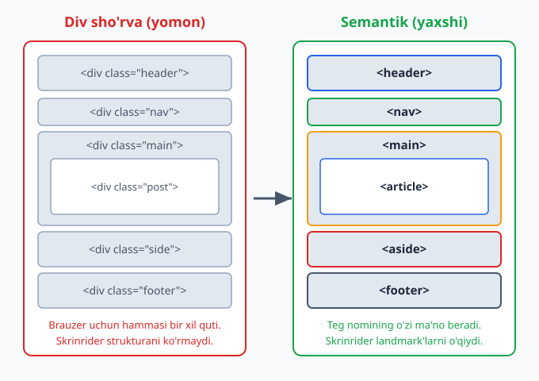
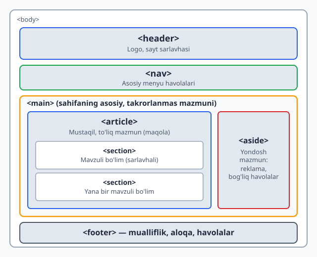
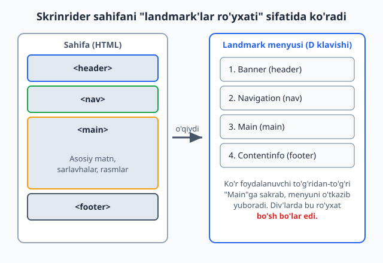

# 06 — Semantik HTML va accessibility

[⬅️ Oldingi: 05 — Formalar](./05-formalar.md) · [🏠 README](./README.md) · [Keyingi: 07 — Head, meta va SEO ➡️](./07-head-meta-seo.md)

> **Bu bobda:** ma'noli teglar (`header`/`nav`/`main`/`article`) bilan sahifa qurish va uni hamma — shu jumladan ko'zi ojiz, klaviatura bilan ishlovchi — odam uchun hammabop (a11y) qilish.

---

## 6.1 Semantik HTML nima va nega `div`'dan yaxshi

Tasavvur qil: kimdir senga qutilarga joylangan ko'chish yukini berdi, lekin har bir qutida faqat "QUTI" deb yozilgan. Oshxona buyumlari qayerda? Kitoblar qayerda? Bilmaysan — hammasini ochib ko'rishga to'g'ri keladi.

Endi boshqa holatni tasavvur qil: qutilarda "OSHXONA", "KITOBLAR", "KIYIM" deb yozilgan. Bir qarashda nima qayerda ekanini bilasan.

HTML'da ham xuddi shunday. `<div>` — bu "QUTI" deb yozilgan quti: u **hech qanday ma'no bermaydi**, shunchaki bir bo'lak. `<header>`, `<nav>`, `<article>` esa "yorlig'i bor" qutilar — teg nomining o'zi shu bo'lakning **vazifasini** aytadi.

**Semantik** so'zi "ma'noga oid" degani. Semantik HTML — bu teglarni *ko'rinishi* uchun emas, *ma'nosi* uchun tanlash.

```html
<!-- Yomon: ma'nosiz qutilar -->
<div class="header">...</div>
<div class="nav">...</div>
<div class="main-content">...</div>
<div class="footer">...</div>

<!-- Yaxshi: teg nomining o'zi ma'no beradi -->
<header>...</header>
<nav>...</nav>
<main>...</main>
<footer>...</footer>
```

Ikkalasi ham brauzerda **bir xil ko'rinadi** (chunki `<div>` ham, `<header>` ham standartda bir xil blok element). Unda nega ovora bo'lamiz? Mana **nega**:

- **Skrinrider (screen reader)** — ko'zi ojiz odam ishlatadigan dastur — `<nav>`ni ko'rib "bu navigatsiya" deydi va foydalanuvchiga uni o'tkazib yuborish imkonini beradi. `<div class="nav">`ni esa oddiy quti deb biladi.
- **Qidiruv tizimlari (SEO)** `<article>`, `<main>` orqali sahifaning asosiy mazmuni qayerdaligini tushunadi.
- **Boshqa dasturchilar** (va 6 oydan keyingi sen o'zing) kodni o'qiganda `<footer>`ni ko'rib darrov tushunadi. `class="footer"`ni esa CSS faylga qarab tekshirish kerak.
- **Brauzer** ba'zi teglarga tayyor xulq-atvor beradi (masalan `<button>` Enter/Probel bilan bosiladi).

> 💡 **Oltin qoida:** avval mazmunga to'g'ri keladigan semantik tegni tanla. Agar hech qaysi maxsus teg to'g'ri kelmasa — *o'shanda* `<div>` (blok uchun) yoki `<span>` (matn ichidagi bo'lak uchun) ishlat. `<div>` "oxirgi chora", birinchi tanlov emas.



Yuqoridagi rasmda chap tomon "div sho'rva" (div soup) deb ataladi — bu hammasi `<div>`dan iborat, ma'nosiz kod. O'ng tomonda esa har bir bo'lak o'z ma'noli tegiga ega. Ikkalasi piksel-pikselgacha bir xil ko'rinishi mumkin, lekin "ichki sifati" yer bilan osmoncha farq qiladi.

---

## 6.2 Sahifa strukturasi: asosiy semantik teglar

HTML5 bizga sahifaning katta bo'laklarini belgilash uchun bir nechta tayyor teg beradi. Mana ularning vazifasi:

| Teg | Vazifasi | Analogiya |
|-----|----------|-----------|
| `<header>` | Bo'limning yuqori qismi: logo, sarlavha, kirish | Gazetaning peshlavhasi |
| `<nav>` | Asosiy navigatsiya havolalari | Kitobning mundarijasi |
| `<main>` | Sahifaning asosiy, takrorlanmas mazmuni | Maqolaning o'zi |
| `<article>` | Mustaqil, o'zicha to'liq mazmun bo'lagi | Bitta blog posti |
| `<section>` | Mavzuli bo'lim (odatda sarlavhali) | Kitob bobi |
| `<aside>` | Asosiy mazmunga yondosh, ikkilamchi mazmun | Gazetadagi yon ustun |
| `<footer>` | Bo'limning pastki qismi: mualliflik, aloqa | Kitobning oxirgi sahifasi |

Mana ularning tipik joylashuvi:



To'liq misol:

```html
<!DOCTYPE html>
<html lang="uz">
<head>
  <meta charset="UTF-8">
  <title>Mening blogim</title>
</head>
<body>
  <header>
    <h1>Mening blogim</h1>
    <p>Web texnologiyalari haqida</p>
  </header>

  <nav>
    <a href="/">Bosh sahifa</a>
    <a href="/maqolalar">Maqolalar</a>
    <a href="/aloqa">Aloqa</a>
  </nav>

  <main>
    <article>
      <h2>Semantik HTML nima?</h2>
      <p>Semantik HTML — bu teglarni ma'nosi uchun tanlash...</p>
    </article>
  </main>

  <aside>
    <h2>Mashhur maqolalar</h2>
    <ul>
      <li><a href="#">CSS Flexbox</a></li>
      <li><a href="#">Grid asoslari</a></li>
    </ul>
  </aside>

  <footer>
    <p>&copy; 2026 Mening blogim</p>
  </footer>
</body>
</html>
```

> 📌 **`<main>` haqida muhim qoida:** bir sahifada faqat **bitta** ko'rinadigan `<main>` bo'lishi kerak. U sahifaning *o'sha sahifaga xos* mazmunini o'rab oladi — `<header>`, `<nav>`, `<footer>` esa odatda hamma sahifada bir xil bo'lgani uchun `<main>`dan **tashqarida** turadi.

> ⚠️ **Tez-tez uchraydigan xato:** `<header>`ni faqat sahifaning eng tepasidagi blok deb o'ylash. Aslida `<header>` va `<footer>` har qanday bo'lim ichida bo'lishi mumkin — masalan `<article>` ichida ham o'zining `<header>` (maqola sarlavhasi, sanasi) va `<footer>` (teglar, muallif) bo'ladi.

---

## 6.3 `<article>` va `<section>` farqi — eng ko'p chalkashtiriladigan joy

Bu ikkisi boshlovchilarni juda chalkashtiradi. Oddiy mezon bilan ajratamiz.

**`<article>`** — "Bu bo'lakni olib, butunlay boshqa joyga (masalan RSS lentaga yoki boshqa saytga) ko'chirsam, u **o'zicha mantiqan to'liq** bo'ladimi?" Agar HA bo'lsa — `<article>`.

Misollar: blog posti, yangilik maqolasi, forum xabari, mahsulot kartochkasi, foydalanuvchi sharhi (har bir sharh alohida `<article>`).

**`<section>`** — bu mavzu bo'yicha guruhlangan mazmun bo'lagi, lekin o'zicha mustaqil emas. U odatda **sarlavhaga ega** ("Bu bo'lim nima haqida?" degan savolga javob beradi).

Misollar: bitta maqola ichidagi "Kirish", "Asosiy qism", "Xulosa" bo'limlari; bosh sahifadagi "Bizning xizmatlar", "Mijozlar fikri" kabi bloklar.

```html
<article>
  <h1>HTML semantikasini o'rganish</h1>

  <section>
    <h2>Kirish</h2>
    <p>Bu maqolada semantik teglar bilan tanishamiz...</p>
  </section>

  <section>
    <h2>Asosiy teglar</h2>
    <p>header, nav, main va boshqalar...</p>
  </section>

  <section>
    <h2>Xulosa</h2>
    <p>Semantik HTML kodingni hamma uchun yaxshiroq qiladi.</p>
  </section>
</article>
```

Bu yerda butun maqola bitta `<article>` (uni butunlay ko'chirish mumkin), uning ichidagi mavzuli qismlar esa `<section>`.

> 💡 **Amaliy maslahat:** `<section>`ning deyarli har doim **sarlavhasi** (`<h2>`, `<h3>` ...) bo'lishi kerak. Agar bir blokga sarlavha qo'yolmaysan va u shunchaki "ko'rinish uchun o'ralgan" bo'lsa — bu `<section>` emas, oddiy `<div>` bo'lishi kerak.

⚠️ **`<article>` ichida `<article>` bo'lishi mumkin.** Masalan blog posti — `<article>`, uning ostidagi har bir izoh (comment) ham alohida `<article>` (chunki izohni alohida ko'chirib, "bu kimdir aytgan to'liq fikr" deb tushunsa bo'ladi).

---

## 6.4 Hujjat outline (struktura) g'oyasi va sarlavhalar ierarxiyasi

Har qanday HTML hujjat **sarlavhalardan** (`<h1>`–`<h6>`) tashkil topgan ko'rinmas "mundarija"ga ega. Buni **document outline** (hujjat strukturasi) deyiladi.

Sarlavhalar — bu shunchaki "katta qalin matn" emas. Ular hujjatning **ierarxik tuzilishi**ni bildiradi, xuddi kitobdagi boblar va bo'limlar kabi:

```
h1  Saytim haqida              (eng yuqori daraja — sahifaning bosh sarlavhasi)
├─ h2  Bizning tarix
├─ h2  Xizmatlar
│  ├─ h3  Veb-dizayn
│  └─ h3  Dasturlash
└─ h2  Aloqa
```

**Asosiy qoidalar (nega muhimligi bilan):**

1. **Sahifada bir `<h1>`** — sahifaning bosh mavzusi. (Skrinrider foydalanuvchisi "bu sahifa nima haqida?" degani — javobi `<h1>`.)
2. **Darajalarni o'tkazib yuborma.** `<h2>`dan keyin to'g'ridan-to'g'ri `<h4>`ga sakrama. Bu xuddi kitobning 1.2-bo'limidan keyin 1.2.1 emas, 1.2.0.5 kabi bo'limga o'tishdek g'alati. Skrinrider foydalanuvchisi "bir daraja yo'qoldimi?" deb adashadi.
3. **Sarlavhani o'lcham uchun tanlama.** Agar matn kichikroq ko'rinishini xohlasang — CSS bilan `font-size` o'zgartir, `<h4>` o'rniga `<h2>` ishlatma.

```html
<!-- Yomon: daraja o'tkazib yuborilgan, faqat ko'rinish uchun tanlangan -->
<h1>Maqola</h1>
<h4>Kichikroq ko'rinsin deb h4 oldim</h4>

<!-- Yaxshi: ketma-ket ierarxiya -->
<h1>Maqola</h1>
<h2>Birinchi bo'lim</h2>
<h3>Kichik bo'limcha</h3>
```

> 💡 Ko'zi ojiz foydalanuvchilar ko'pincha sarlavhalar bo'yicha sakrab yuradi (skrinrider'da `H` klavishi). To'g'ri ierarxiya ularning sahifani tez "ko'zdan kechirishi"ga yordam beradi — xuddi ko'rar odam ko'z bilan sahifaga shoshilib qaragandek.

---

## 6.5 Accessibility (a11y) nima va nega muhim

**Accessibility** (qisqacha **a11y** — chunki "accessibility" so'zida `a` va `y` orasida 11 ta harf bor) — bu web saytni **hamma** odam, jumladan turli imkoniyatga ega bo'lganlar ham ishlata olishini ta'minlash.

Kim haqida gap ketyapti?

- **Ko'rmaydigan yoki kam ko'radigan** odamlar — skrinrider yoki ekranni kattalashtiruvchi dastur ishlatadi.
- **Qo'l harakati cheklangan** odamlar — sichqonchani ishlata olmaydi, faqat klaviatura yoki maxsus qurilma bilan ishlaydi.
- **Eshitmaydigan** odamlar — videodagi subtitr/transkriptga muhtoj.
- **Kognitiv qiyinchiliklari** bor odamlar — sodda, izchil interfeys kerak.
- **Vaqtinchalik cheklov** — qo'li singan, yorug' quyoshda ekran ko'rinmayotgan, yoki bir qo'lida chaqaloq ko'targan oddiy foydalanuvchi ham.

**Nega bu sening ishing?**

1. **Insoniy sabab:** internet — bu zamonaviy hayotning bir qismi (bank, davlat xizmatlari, ta'lim). Uni hammaga ochiq qilish — adolat masalasi.
2. **Qonuniy sabab:** ko'p mamlakatlarda a11y qonun bilan talab qilinadi; nomuvofiqlik uchun sudga berishadi.
3. **Amaliy sabab:** a11y'ni yaxshilaydigan narsalar (to'g'ri struktura, aniq matn) **hamma** uchun saytni yaxshilaydi — SEO ham, ko'rar foydalanuvchi tajribasi ham.

> 📌 **Eng yaxshi xabar:** bu bobning birinchi yarmidagi semantik HTML — a11y'ning **eng katta** qismi. To'g'ri teglar ishlatishning o'zi saytingni allaqachon ko'p odamga ochiq qiladi. A11y "qo'shimcha og'ir ish" emas — to'g'ri HTML yozishning tabiiy natijasi.

---

## 6.6 Skrinrider sahifani qanday "o'qiydi"

Buni tushunsang, a11y'ning ko'p qoidalari mantiqan ravshan bo'ladi.

**Skrinrider** — bu ekrandagi narsalarni **ovoz bilan o'qib beradigan** dastur (masalan NVDA, JAWS, VoiceOver). Ko'zi ojiz foydalanuvchi ekranni ko'rmaydi — u faqat eshitadi va klaviatura bilan boshqaradi.

Muhim tushuncha: skrinrider sening **vizual dizayningni ko'rmaydi**. U HTML **strukturasini** o'qiydi. Agar struktura ma'noli bo'lsa — foydalanuvchi sahifada erkin harakat qiladi; agar "div sho'rva" bo'lsa — u adashadi.

Skrinrider foydalanuvchisi sahifada bir necha usulda harakat qiladi:

- **Ketma-ket** (yuqoridan pastga element-element).
- **Landmark'lar bo'yicha** — `<nav>`, `<main>`, `<footer>` kabi katta bo'laklar orasida sakrash.
- **Sarlavhalar bo'yicha** — `<h1>`–`<h6>` orasida sakrash (yuqorida ko'rdik).
- **Havolalar/tugmalar ro'yxati bilan** — barcha bosiladigan elementlarni bir ro'yxatga yig'ib.



Rasmda ko'rinib turibdiki, semantik teglar skrinrider uchun avtomatik "tezkor sayohat menyusi" yaratadi. Foydalanuvchi bir tugma bosib to'g'ridan-to'g'ri "Main"ga o'tib, takrorlanadigan navigatsiyani har sahifada qaytadan eshitmaydi.

**Tajriba uchun maslahat:** Windows'da NVDA (bepul), Mac'da VoiceOver (`Cmd+F5`) o'rnatilgan. Bir marta ko'zingni yumib, sahifangni faqat ovoz bilan boshqarib ko'r — bu seni a11y'ni "his qilishga" o'rgatadi.

---

## 6.7 `alt` matn va `lang` atributi — eng oddiy, eng katta ta'sir

A11y'da eng arzon, lekin eng katta foyda beradigan ikki narsa.

### Rasmlar uchun `alt`

``ning `alt` atributi — rasm ko'rinmaganda (skrinrider o'qiydi, yoki rasm yuklanmaydi) uning **o'rnini bosadigan matn**.

```html
<!-- Yaxshi: rasm nimani ko'rsatishini tasvirlaydi -->


<!-- alt yo'q — skrinrider fayl nomini o'qiydi: "mushuk nuqta jpg" — foydasiz -->

```

**`alt` qanday yoziladi:**
- Rasm *nimani bildirishini* yoz, "rasm", "surat" so'zini qo'shma (skrinrider o'zi "rasm" deydi).
- Agar rasm sof **bezak** bo'lsa (ma'no bermaydi) — `alt=""` (bo'sh) qoldir. Bu skrinrider'ga "buni o'tkazib yubor" deydi. ⚠️ `alt`ni butunlay tashlab ketma — bo'sh `alt=""` va `alt`siz `` farq qiladi.

```html
<!-- Bezak rasm: bo'sh alt — skrinrider e'tibor bermaydi -->

```

### Til uchun `lang`

`<html lang="uz">` — sahifa qaysi tilda ekanini bildiradi. Skrinrider buni o'qib, **to'g'ri talaffuz** mexanizmini tanlaydi. `lang`siz inglizcha skrinrider o'zbekcha matnni ingliz aksenti bilan o'qishga urinadi — natija tushunarsiz bo'ladi.

```html
<html lang="uz">
  ...
  <!-- Sahifa ichidagi boshqa tildagi bo'lakni belgilash -->
  <p>Bu inglizcha ibora: <span lang="en">Hello world</span></p>
</html>
```

> 💡 `lang="uz"` qo'yish — bir soniyalik ish, lekin o'zbekcha sayt uchun katta farq qiladi. Har doim `<html>` tegiga `lang` qo'y.

---

## 6.8 Klaviatura navigatsiyasi, `tabindex` va focus tartibi

Ko'p odamlar saytni **sichqonchasiz**, faqat klaviatura bilan ishlatadi (qo'l harakati cheklanganlar, kuchli foydalanuvchilar, skrinrider foydalanuvchilari). Sayting klaviatura bilan to'liq ishlashi shart.

**Asosiy klavishlar:**
- `Tab` — keyingi interaktiv elementga o'tish (havola, tugma, input).
- `Shift + Tab` — orqaga.
- `Enter` / `Probel` — bosish (aktivlashtirish).

**Focus** — bu hozir klaviatura "qaysi elementda turganini" bildiradi. Brauzer fokuslangan elementga ko'rinadigan **chegara (focus ring)** chizadi.

⚠️ **Eng katta a11y xatosi:** dizayn "chiroyli" ko'rinsin deb focus ringni o'chirib qo'yish:

```css
/* Hech qachon bunday qilma! Klaviatura foydalanuvchisi qayerdaligini bilmay qoladi */
:focus { outline: none; }
```

Agar standart ringni almashtirmoqchi bo'lsang — uni **boshqa** ko'rinadigan belgi bilan **almashtir**, butunlay o'chirma:

```css
/* Yaxshi: standart ringni o'z uslubing bilan almashtir */
:focus-visible {
  outline: 3px solid #2563eb;
  outline-offset: 2px;
}
```

> 📌 `:focus-visible` — bu zamonaviy, aqlli variant: faqat klaviatura bilan kelganda ring ko'rsatadi, sichqoncha bilan bosganda yo'q (ko'pchilik sichqoncha foydalanuvchisini bezovta qiladigan ring kerak emas).

### `tabindex`

`tabindex` elementning klaviatura tartibidagi o'rnini boshqaradi:

| Qiymat | Ma'nosi | Qachon |
|--------|---------|--------|
| `tabindex="0"` | Tabindex tartibiga **qo'sh** (tabiiy joyida) | Maxsus interaktiv element (kamdan-kam) |
| `tabindex="-1"` | Tab bilan **o'tib bo'lmaydi**, lekin JS bilan fokus berish mumkin | Modal/xabarga programma orqali fokus |
| `tabindex="1"` va katta | Tartibni **majburan** o'zgartirish | ⚠️ Deyarli hech qachon — ishlatma! |

⚠️ **`tabindex` musbat son (1, 2, 3...) ishlatma.** U tabiiy tartibni buzadi va boshqarish dahshatli bo'lib ketadi. Tabiiy DOM tartibi deyarli har doim to'g'ri tartib — elementlarni HTML'da **mantiqiy ketma-ketlikda** yozsang, focus tartibi o'zidan to'g'ri bo'ladi.

> 💡 **Nega "to'g'ri teg" muhim:** `<button>`, `<a href>`, `<input>` kabi tabiiy interaktiv teglar **o'zidan** klaviaturaga fokuslanadi va Enter/Probel bilan ishlaydi. Agar `<div onclick="...">` bilan "tugma" yasasang — u klaviatura uchun ko'rinmas bo'ladi, `tabindex`, `role`, klavish-ishlovchi — hammasini qo'lda qo'shishingga to'g'ri keladi. Shuning uchun **bosiladigan narsa uchun `<button>` ishlat**, `<div>` emas.

---

## 6.9 ARIA asoslari — qachon kerak, qachon kerak emas

**ARIA** (Accessible Rich Internet Applications) — bu HTML'ga qo'shiladigan maxsus atributlar to'plami. Ular yordamchi texnologiyalarga (skrinrider) elementning **roli**, **holati** va **xususiyatlari** haqida qo'shimcha ma'lumot beradi.

Lekin ARIA haqida gapirishdan **oldin** eng muhim qoidani aytamiz:

> 📌 **Birinchi ARIA qoidasi:** *"Hech qanday ARIA — yomon ARIA'dan yaxshiroq"* (No ARIA is better than bad ARIA). Agar maqsadga **tabiiy semantik HTML** bilan yetsang — ARIA **ishlatma**. ARIA hech qanday ko'rinadigan xulq qo'shmaydi, faqat yordamchi texnologiyaga "va'da" beradi — agar bu va'da noto'g'ri bo'lsa, foydalanuvchini chalg'itadi.

Bu nega shunchalik muhim? Chunki ko'p ARIA "tashqaridan o'rganilgan" sahifalarda noto'g'ri ishlatiladi va **mavjud, ishlaydigan** semantikani **buzadi**:

```html
<!-- Yomon: keraksiz role — h1 allaqachon "heading" -->
<h1 role="heading">Sarlavha</h1>

<!-- Yomon: button allaqachon "button" rolida, takror -->
<button role="button">Bosing</button>

<!-- Yaxshi: hech narsa qo'shilmaydi, teg o'zi yetarli -->
<h1>Sarlavha</h1>
<button>Bosing</button>
```

### Unda ARIA qachon kerak?

ARIA **HTML'da tabiiy teg yo'q** bo'lganda kerak — masalan, JavaScript bilan yasalgan murakkab vidjet (tab paneli, drag-and-drop, maxsus dropdown). Boshlovchi sifatida senga eng ko'p kerak bo'ladigan uchtasi:

**1. `aria-label`** — ko'rinadigan matni bo'lmagan elementga skrinrider uchun nom beradi:

```html
<!-- Faqat ikonkali tugma — skrinrider o'qiy oladigan matn yo'q -->
<button aria-label="Qidiruvni yopish">&times;</button>

<!-- nav'lar ajratish uchun -->
<nav aria-label="Asosiy menyu">...</nav>
<nav aria-label="Pastki menyu">...</nav>
```

**2. `aria-hidden="true"`** — elementni skrinrider'dan **yashiradi** (lekin ekranda ko'rinadi). Sof bezak ikonkalar uchun:

```html
<!-- Ikonka bezak; yonidagi matn ma'noni beradi -->
<button>
  <span aria-hidden="true">🔍</span>
  Qidirish
</button>
```

**3. `role`** — elementning rolini bildiradi. Faqat tabiiy teg yo'q bo'lganda:

```html
<!-- Ogohlantirish: muhim, darhol o'qilishi kerak bo'lgan xabar -->
<div role="alert">Parol noto'g'ri!</div>
```

> ⚠️ `aria-label`ni `<div>` yoki `<span>` kabi *ma'nosi yo'q* teglarga qo'yma — u e'tiborga olinmasligi mumkin. U interaktiv elementlarga (`<button>`, `<a>`, `<input>`) yoki landmark'larga (`<nav>`) ishlaydi.

**Xulosa:** semantik HTML'ni birinchi tanla. ARIA — tabiiy HTML yetmagan kamdan-kam holatlar uchun "yamoq". Kuchli HTML poydevori bo'lsa, senga ARIA juda kam kerak bo'ladi.

---

## 6.10 Landmark'lar — sahifaning "yo'l belgilari"

**Landmark** (mo'ljal, yo'l belgisi) — bu skrinrider foydalanuvchisi to'g'ridan-to'g'ri sakrab o'tishi mumkin bo'lgan sahifaning katta bo'laklari. Ajoyib tomoni: **semantik teglar o'zi avtomatik landmark yaratadi** — qo'shimcha hech narsa qilish shart emas.

| Semantik teg | Avtomatik landmark roli |
|--------------|--------------------------|
| `<header>` (sahifa darajasida) | `banner` |
| `<nav>` | `navigation` |
| `<main>` | `main` |
| `<aside>` | `complementary` |
| `<footer>` (sahifa darajasida) | `contentinfo` |
| `<form>` (nomli) | `form` |
| `<section>` (nomli) | `region` |

Mana **nega** bu kuchli: skrinrider foydalanuvchisi bitta klavish bilan butun navigatsiyani o'tkazib, to'g'ridan-to'g'ri `<main>`ga o'tadi. `<div>`larda bunday "tezkor sayohat" mumkin emas.

**Bir nechta bir xil landmark bo'lsa — ularni nomla.** Masalan sahifada ikkita `<nav>` bo'lsa (yuqori menyu va pastki menyu), skrinrider ularni "navigation, navigation" deb o'qiydi — qaysi biri qaysi? `aria-label` bilan ajratamiz:

```html
<nav aria-label="Asosiy navigatsiya">
  <a href="/">Bosh sahifa</a>
  <a href="/maqolalar">Maqolalar</a>
</nav>

<main>...</main>

<nav aria-label="Footer havolalari">
  <a href="/maxfiylik">Maxfiylik</a>
  <a href="/shartlar">Shartlar</a>
</nav>
```

Endi skrinrider "Asosiy navigatsiya" va "Footer havolalari" deb aniq aytadi.

### "Skip link" — kuchli a11y nayrang

Klaviatura/skrinrider foydalanuvchisi har sahifada birinchi navbatda navigatsiya menyusiga duch keladi — har safar o'nlab havolani o'tib, asosiy mazmunga yetib borishi zerikarli. **Skip link** ("o'tkazib yuborish havolasi") buni hal qiladi:

```html
<body>
  <a href="#main-content" class="skip-link">Asosiy mazmunga o'tish</a>

  <header>...</header>
  <nav>...</nav>

  <main id="main-content">
    ...
  </main>
</body>
```

```css
/* Odatda yashirin; faqat klaviatura bilan fokuslanganda ko'rinadi */
.skip-link {
  position: absolute;
  left: -9999px;
}
.skip-link:focus {
  left: 8px;
  top: 8px;
  background: #2563eb;
  color: #fff;
  padding: 8px 12px;
}
```

`Tab` bosgan birinchi foydalanuvchi shu havolani ko'radi; Enter bosib to'g'ridan-to'g'ri `<main>`ga sakraydi. Ko'rar sichqoncha foydalanuvchisi uni umuman sezmaydi. Bu — a11y'ning "hammaga to'sqinlik qilmasdan, muhtojlarga yordam berish" falsafasining ajoyib namunasi.

---

## 6.11 Hammasini birlashtirish — to'liq hammabop sahifa

Bu bobda o'rganganlarimizning hammasini bitta misolda ko'ramiz:

```html
<!DOCTYPE html>
<html lang="uz">
<head>
  <meta charset="UTF-8">
  <meta name="viewport" content="width=device-width, initial-scale=1.0">
  <title>Blog — Semantik HTML</title>
</head>
<body>
  <!-- Skip link: klaviatura uchun tezkor o'tish -->
  <a href="#asosiy" class="skip-link">Asosiy mazmunga o'tish</a>

  <header>
    <h1>Web Dasturchi Blogi</h1>
  </header>

  <nav aria-label="Asosiy navigatsiya">
    <a href="/">Bosh sahifa</a>
    <a href="/maqolalar">Maqolalar</a>
    <a href="/aloqa">Aloqa</a>
  </nav>

  <main id="asosiy">
    <article>
      <header>
        <h2>Semantik HTML nima uchun muhim?</h2>
        <p>Nashr sanasi: <time datetime="2026-06-09">9-iyun, 2026</time></p>
      </header>

      <section>
        <h3>Kirish</h3>
        <p>Semantik teglar kodingni hammaga ochiq qiladi...</p>
        
      </section>

      <section>
        <h3>Xulosa</h3>
        <p>To'g'ri HTML — a11y'ning poydevori.</p>
      </section>

      <footer>
        <p>Muallif: Ali Valiyev</p>
      </footer>
    </article>
  </main>

  <aside aria-label="Bog'liq maqolalar">
    <h2>O'qish tavsiya etiladi</h2>
    <ul>
      <li><a href="#">CSS Flexbox asoslari</a></li>
      <li><a href="#">Responsive dizayn</a></li>
    </ul>
  </aside>

  <footer>
    <p>&copy; 2026 Web Dasturchi Blogi. Barcha huquqlar himoyalangan.</p>
  </footer>
</body>
</html>
```

Diqqat qil: bu sahifa **bironta ham `role` ishlatmaydi** — semantik teglarning o'zi hamma landmark'ni beradi. `aria-label` faqat takrorlanadigan `<nav>`/`<aside>`ni ajratish uchun ishlatilgan. `<time datetime="...">` — sanaga mashinaga tushunarli format beradi. Bu — "no ARIA is better than bad ARIA" falsafasining amaliy ko'rinishi.

> 💡 **Tekshiruvchi vositalar:** brauzer DevTools'da **Lighthouse** (Accessibility hisoboti) va **axe DevTools** kengaytmasi sahifangdagi a11y muammolarini avtomatik topadi. Boshlash uchun ajoyib — lekin ular hamma narsani topa olmaydi (masalan, `alt` matni *mazmunan* to'g'rimi yo'qmi — buni faqat odam tekshiradi).

---

## Mashqlar

Quyidagi mashqlarni ketma-ket bajar. Har birida o'zing kod yozib, keyin yechimni och.

### Mashq 1 — Div sho'rvani semantikaga aylantir

Quyidagi "div sho'rva"ni to'g'ri semantik teglar bilan qayta yoz:

```html
<div class="top">
  <div class="title">Mening Saytim</div>
</div>
<div class="menu">
  <a href="/">Uy</a>
  <a href="/blog">Blog</a>
</div>
<div class="content">
  <div class="post">
    <h2>Birinchi post</h2>
    <p>Salom dunyo!</p>
  </div>
</div>
<div class="bottom">© 2026</div>
```

<details markdown="1"><summary>Yechim</summary>

```html
<header>
  <h1>Mening Saytim</h1>
</header>
<nav>
  <a href="/">Uy</a>
  <a href="/blog">Blog</a>
</nav>
<main>
  <article>
    <h2>Birinchi post</h2>
    <p>Salom dunyo!</p>
  </article>
</main>
<footer>© 2026</footer>
```

`class="title"` ichidagi sarlavha matn `<h1>` bo'ldi (sahifa bosh sarlavhasi). `<main>` faqat o'sha sahifaga xos mazmun (post)ni o'rab oldi.

</details>

---

### Mashq 2 — `article` yoki `section`?

Quyidagi har bir holat uchun qaysi teg to'g'ri kelishini ayt va **nega**ligini izohla:

1. Yangiliklar saytidagi bitta yangilik xabari.
2. Bitta uzun maqola ichidagi "Tarix" deb nomlangan bo'lim.
3. Onlayn do'kondagi bitta mahsulot kartochkasi.
4. Bosh sahifadagi "Tez-tez so'raladigan savollar" bloki.

<details markdown="1"><summary>Yechim</summary>

1. **`<article>`** — yangilik o'zicha mustaqil, uni RSS lentaga yoki boshqa joyga ko'chirsa ham mantiqan to'liq.
2. **`<section>`** — maqolaning bir qismi, o'zicha mustaqil emas, sarlavhasi bor ("Tarix").
3. **`<article>`** — mahsulot kartochkasini olib boshqa joyga (masalan tavsiyalar ro'yxatiga) ko'chirsa ham to'liq.
4. **`<section>`** — bosh sahifaning sarlavhali mavzuli bo'lagi.

</details>

---

### Mashq 3 — Sarlavhalar ierarxiyasini tuzat

Bu kodda ierarxiya buzilgan. Xatoni top va tuzat:

```html
<h1>Pishiriqlar retsepti</h1>
<h3>Kerakli mahsulotlar</h3>
<h4>Xamir uchun</h4>
<h2>Tayyorlash bosqichlari</h2>
```

<details markdown="1"><summary>Yechim</summary>

```html
<h1>Pishiriqlar retsepti</h1>
<h2>Kerakli mahsulotlar</h2>
<h3>Xamir uchun</h3>
<h2>Tayyorlash bosqichlari</h2>
```

Xato: `<h1>`dan keyin to'g'ridan-to'g'ri `<h3>`ga sakrash (darajani o'tkazib yuborish). "Kerakli mahsulotlar" — bosh mavzuning to'g'ridan-to'g'ri bo'limi, demak `<h2>`. "Xamir uchun" esa uning ichidagi kichik bo'limcha, demak `<h3>`. Sarlavhani **ko'rinish** uchun emas, **ierarxiya** uchun tanlaymiz.

</details>

---

### Mashq 4 — `alt` matnini yoz

Quyidagi rasmlar uchun mos `alt` matnini yoz:

1. Maqola ichidagi grafik: 2025-yil sotuvlarining o'sish diagrammasi.
2. Saytni chiroyli qilish uchun qo'yilgan to'lqinsimon ajratuvchi chiziq (sof bezak).
3. "Yuklab olish" tugmasi ichidagi pastga qaragan strelka ikonkasi (yonida "Yuklab olish" matni bor).

<details markdown="1"><summary>Yechim</summary>

```html
<!-- 1: ma'noli rasm — nima ko'rsatilayotganini yoz -->


<!-- 2: sof bezak — bo'sh alt, skrinrider o'tkazib yuboradi -->


<!-- 3: yonida matn bor — ikonka takror ma'no bermaydi, bo'sh alt -->
<button>
  
  Yuklab olish
</button>
```

3-holatda "Yuklab olish" so'zi allaqachon bor, shuning uchun ikonkaning `alt`ini bo'sh qoldiramiz — aks holda skrinrider "Yuklab olish Yuklab olish" deb takrorlaydi.

</details>

---

### Mashq 5 — Focus ringni to'g'rilash

Bir dasturchi dizayn "tozaroq" ko'rinsin deb shunday yozgan. Muammo nimada va qanday tuzatasan?

```css
button:focus,
a:focus {
  outline: none;
}
```

<details markdown="1"><summary>Yechim</summary>

**Muammo:** focus ring butunlay o'chirilgan. Klaviatura foydalanuvchisi `Tab` bosganda qaysi elementda turganini **ko'rmaydi** — sayt ular uchun ishlab bo'lmaydigan holatga keladi.

**Yechim:** ringni o'chirma — uni o'z uslubing bilan **almashtir** (va imkon bo'lsa `:focus-visible` ishlat):

```css
button:focus-visible,
a:focus-visible {
  outline: 3px solid #2563eb;
  outline-offset: 2px;
}
```

</details>

---

### Mashq 6 — ARIA: kerakmi yoki keraksizmi?

Quyidagi har bir qator uchun ARIA to'g'ri ishlatilganmi yoki keraksizmi (yoki noto'g'rimi) ayt:

```html
<a href="/about" role="link">Biz haqimizda</a>
<button aria-label="Menyuni yopish">&times;</button>
<nav role="navigation">...</nav>
<div role="button" onclick="...">Bosing</div>
```

<details markdown="1"><summary>Yechim</summary>

1. `<a role="link">` — **keraksiz.** `<a href>` allaqachon "link" rolida. ARIA olib tashlanadi.
2. `<button aria-label="Menyuni yopish">&times;</button>` — **to'g'ri.** Tugmada faqat `×` belgisi bor, o'qiladigan matn yo'q; `aria-label` skrinrider'ga ma'no beradi.
3. `<nav role="navigation">` — **keraksiz.** `<nav>` o'zi "navigation" landmark'ini yaratadi. ARIA olib tashlanadi.
4. `<div role="button">` — **ishlaydi, lekin yomon yondashuv.** Bu yerda `<button>` ishlatish kerak edi — u tabiiy fokuslanadi va Enter/Probel bilan ishlaydi. `<div>` bilan bularni qo'lda qo'shishga to'g'ri keladi. *Tabiiy teg yo'q bo'lgandagina* `role` ishlat.

</details>

---

### Mashq 7 — Skip link qo'sh

Quyidagi sahifaga klaviatura foydalanuvchisi navigatsiyani o'tkazib, to'g'ridan-to'g'ri asosiy mazmunga sakrashi uchun "skip link" qo'sh (HTML va CSS):

```html
<body>
  <nav>...</nav>
  <main>...</main>
</body>
```

<details markdown="1"><summary>Yechim</summary>

```html
<body>
  <a href="#main" class="skip-link">Asosiy mazmunga o'tish</a>
  <nav>...</nav>
  <main id="main">...</main>
</body>
```

```css
.skip-link {
  position: absolute;
  left: -9999px;        /* odatda ekrandan tashqarida — yashirin */
}
.skip-link:focus {
  left: 8px;            /* faqat fokuslanganda ko'rinadi */
  top: 8px;
  background: #2563eb;
  color: #fff;
  padding: 8px 12px;
}
```

`<main>`ga `id="main"` qo'shildi, havola `href="#main"` orqali unga ishora qiladi.

</details>

---

### Mashq 8 — To'liq semantik sahifa qur

Noldan boshlab quyidagini o'z ichiga olgan to'liq, hammabop HTML sahifa yoz: `lang` atributi, skip link, `<header>`+`<h1>`, nomlangan `<nav>`, ichida `<article>` bo'lgan `<main>`, `<aside>`, `<footer>`. Maqolada kamida bitta `alt` matnli rasm bo'lsin.

<details markdown="1"><summary>Yechim namunasi</summary>

```html
<!DOCTYPE html>
<html lang="uz">
<head>
  <meta charset="UTF-8">
  <meta name="viewport" content="width=device-width, initial-scale=1.0">
  <title>Sayohat blogi</title>
</head>
<body>
  <a href="#asosiy" class="skip-link">Asosiy mazmunga o'tish</a>

  <header>
    <h1>Sayohat Blogi</h1>
  </header>

  <nav aria-label="Asosiy navigatsiya">
    <a href="/">Bosh sahifa</a>
    <a href="/yozuvlar">Yozuvlar</a>
  </nav>

  <main id="asosiy">
    <article>
      <h2>Samarqandga sayohat</h2>
      
      <p>Bu safarda men Registonni ziyorat qildim...</p>
    </article>
  </main>

  <aside aria-label="Bog'liq yozuvlar">
    <h2>Yana o'qing</h2>
    <ul>
      <li><a href="#">Buxoroga sayohat</a></li>
    </ul>
  </aside>

  <footer>
    <p>&copy; 2026 Sayohat Blogi</p>
  </footer>
</body>
</html>
```

Hech qanday `role` ishlatilmadi — semantik teglar yetarli. `aria-label` faqat takrorlanadigan landmark'larni ajratish uchun ishlatildi.

</details>

---

[⬅️ Oldingi: 05 — Formalar](./05-formalar.md) · [🏠 README](./README.md) · [Keyingi: 07 — Head, meta va SEO ➡️](./07-head-meta-seo.md)
