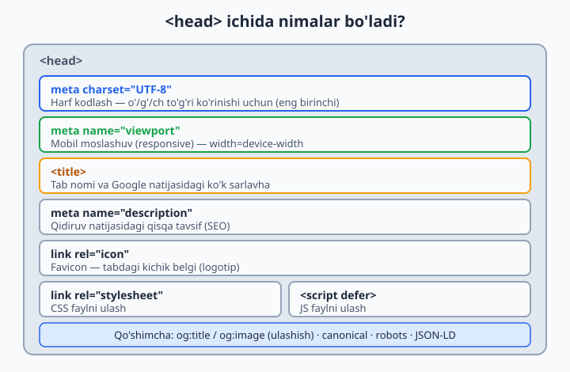
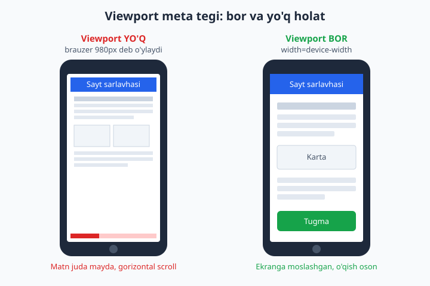
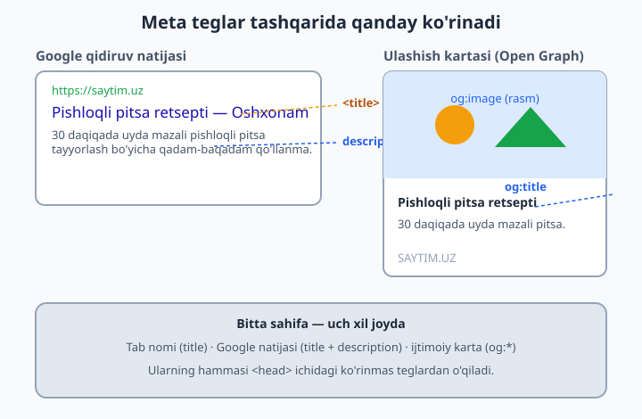

# 07 — Head, meta va SEO

[⬅️ Oldingi: 06 — Semantik HTML va accessibility](./06-semantik-accessibility.md) · [🏠 README](./README.md) · [Keyingi: 08 — CSS asoslari ➡️](./08-css-asoslari.md)

> **Bu bobda:** sahifaning ko'rinmas qismi — `<head>` ichidagi meta teglar, viewport, favicon, CSS/JS ulash, hamda saytni Google va ijtimoiy tarmoqlar uchun tayyorlaydigan SEO va ulashish sozlamalari.

---

Oldingi boblarda biz sahifaning **ko'rinadigan** qismini — `<body>` ichidagi matn, rasm, ro'yxat va havolalarni o'rgandik. Endi sahifaning **ko'rinmas** qismiga — `<head>` ga o'tamiz.

Tasavvur qiling: kitobning muqovasi va ichidagi pasport ma'lumotlari (kim yozgan, qaysi tilda, qaysi yilda) bor. O'quvchi asosan ichki matnni o'qiydi, lekin kutubxonachi kitobni javonga to'g'ri qo'yish, kataloglashtirish va izlash uchun aynan o'sha pasport ma'lumotlariga qaraydi. `<head>` — bu sahifaning pasporti. Uni odam ko'rmaydi, lekin **brauzer, Google va ijtimoiy tarmoqlar** o'qiydi.

Bu bob ko'rinishidan kichik, lekin amalda u **professional sayt** bilan **havaskor sahifa** o'rtasidagi farqni belgilaydi. Boshladik.

---

## 7.1 `<head>` nima va u qayerda turadi

Har bir HTML hujjat ikki qismdan iborat: `<head>` (bosh) va `<body>` (tana). Ikkalasi `<html>` ichida yashaydi:

```html
<!DOCTYPE html>
<html lang="uz">
  <head>
    <!-- Bu yer KO'RINMAYDI: meta ma'lumotlar -->
    <meta charset="UTF-8">
    <title>Mening saytim</title>
  </head>
  <body>
    <!-- Bu yer KO'RINADI: sahifaning haqiqiy mazmuni -->
    <h1>Salom, dunyo!</h1>
  </body>
</html>
```

**Nega ular ajratilgan?** Chunki ularning vazifasi boshqacha:

- `<body>` — odamga ko'rsatiladigan mazmun (matn, rasm, tugma).
- `<head>` — mashinalar uchun ma'lumot: "Bu sahifa qaysi tilda? Nomi nima? Qaysi CSS faylni ulash kerak? Google'da qanday tasvirlanadi?"

`<head>` ichiga yozilgan deyarli hech narsa ekranga chiqmaydi (yagona istisno — `<title>`, u tab nomida ko'rinadi). Shuning uchun yangi boshlovchilar ko'pincha uni e'tiborsiz qoldiradi. Bu xato — `<head>` to'g'ri to'ldirilmagan sayt Google'da topilmaydi va telefonda buzilib ko'rinadi.

Quyidagi diagramma `<head>` ichida odatda nimalar turishini ko'rsatadi:



📌 `<head>` ichidagi teglarning **ko'pchiligi yopilmaydi** (`<meta>`, `<link>` — yakka teg). Faqat `<title>` ochilib-yopiladi.

---

## 7.2 `<title>` — tab nomi va Google sarlavhasi

`<title>` — `<head>` ichidagi eng muhim teglardan biri. U **ikki joyda** ko'rinadi:

1. Brauzer **tab** (yorliq) ustida — siz qaysi sahifada ekaningizni shu yerdan bilasiz.
2. Google qidiruv natijasida **ko'k katta sarlavha** sifatida — odamlar shuni bosadi.

```html
<head>
  <meta charset="UTF-8">
  <title>Pishloqli pitsa retsepti — Oshxonam</title>
</head>
```

Natija: tabda "Pishloqli pitsa retsepti — Oshxonam" yoziladi; Google'da ham xuddi shu matn ko'k havola bo'lib chiqadi.

**Nega title shunchalik muhim?** Chunki odam Google'da 10 ta natijani ko'radi va aynan **title**ga qarab qaysi birini bosishni hal qiladi. Yomon title = kam tashrif.

Yaxshi `<title>` qoidalari:

- **Aniq va mazmunli** bo'lsin: "Bosh sahifa" emas, "Toshkentda pitsa yetkazib berish — Oshxonam".
- **Qisqa**: Google taxminan 55–60 belgini ko'rsatadi, qolgani `...` bo'lib kesiladi.
- **Har sahifada noyob** bo'lsin: ikki sahifa bir xil title'ga ega bo'lmasin.
- Odatda formati: `Sahifa nomi — Brend nomi`.

⚠️ Eng keng tarqalgan xato — `<title>` ni umuman yozmaslik. Unda tabda xunuk fayl yo'li (`index.html`) chiqadi, Google esa o'zicha biror matn tanlaydi — odatda yomon tanlaydi.

💡 `<title>` `<body>` ichidagi `<h1>` dan farq qiladi: `<title>` brauzer/Google uchun, `<h1>` esa sahifa ichidagi ko'rinadigan bosh sarlavha. Ikkalasi o'xshash bo'lishi mumkin, lekin bir xil bo'lishi shart emas.

---

## 7.3 `<meta charset="UTF-8">` — harflar to'g'ri ko'rinishi uchun

Kompyuter aslida faqat raqamlarni biladi. Har bir harf — bu raqam. "Qaysi raqam qaysi harf" degan jadval **kodlash** (encoding) deyiladi. `charset` — sahifa qaysi kodlashda yozilganini brauzerga aytadi.

```html
<head>
  <meta charset="UTF-8">
  <title>Salom dunyo</title>
</head>
```

**Nega aynan UTF-8?** Chunki UTF-8 — dunyodagi deyarli barcha harflarni (o'zbek `o'`, `g'`, `sh`, `ch`, emoji, xitoy ieroglifi) qamrab oladigan yagona standart. Boshqa eski kodlashlar faqat ingliz alifbosini biladi.

**Agar charset bo'lmasa nima bo'ladi?** Brauzer kodlashni o'zicha taxmin qiladi va ko'pincha adashadi. Natijada `o'zbekcha` o'rniga ekranda `òçé` kabi tushunarsiz belgilar (ularni "krakozyabra" yoki "mojibake" deyishadi) chiqadi.

Ikki muhim qoida:

1. `charset` `<head>` ning **eng birinchi qatori** bo'lishi kerak (`<title>` dan ham oldin). Sababi: brauzer harflarni to'g'ri o'qishni boshlashi uchun kodlashni *darrov* bilishi shart.
2. Doimo **`UTF-8`** ishlating. Boshqasini tanlashga sabab yo'q.

📌 Hozirgi barcha matn muharrirlari (VS Code) faylni avtomatik UTF-8 da saqlaydi, shuning uchun bu teg bilan fayl kodlashi mos keladi — siz faqat tegni yozishni unutmang.

---

## 7.4 `<meta name="viewport">` — telefonda to'g'ri ko'rinish

Bu eng muhim meta teglardan biri va boshlovchilar uni eng ko'p unutadi. U **mobil moslashuv** (responsive design) uchun shart.

```html
<meta name="viewport" content="width=device-width, initial-scale=1.0">
```

**Muammoni tushunamiz.** Telefonlar paydo bo'lganda, ko'p saytlar faqat katta kompyuter ekrani uchun yozilgan edi. Telefon brauzerlari shu saytlarni buzmaslik uchun bir hiyla o'ylab topdi: ular o'zini **980px enli keng ekran** kabi tutadi, keyin butun sahifani kichraytirib telefon ekraniga sig'diradi.

Natija: matn juda mayda bo'lib, o'qish uchun barmoq bilan kattalashtirish (zoom) va chapga-o'ngga surish kerak bo'ladi.

`viewport` tegi brauzerga aytadi: **"Yo'q, soxta 980px kerak emas. Sahifa enini haqiqiy qurilma eniga (`device-width`) teng qil."** Shunda CSS sizning telefon ekraningizni haqiqiy o'lchamda ko'radi va mazmun ekranga moslashadi.

`content` ichidagi ikki qism:

- `width=device-width` — sahifa eni = qurilmaning haqiqiy eni. **Eng muhim qism.**
- `initial-scale=1.0` — sahifa ochilganda zoom darajasi 1 ga teng (kattalashtirilmagan, kichraytirilmagan).

Quyidagi taqqos bu farqni yaqqol ko'rsatadi:



⚠️ Agar `viewport` tegi bo'lmasa, hatto eng zo'r responsive CSS ham telefonda ishlamaydi — chunki brauzer hali ham o'zini 980px deb o'ylaydi. Bu teg responsive dizaynning **kalit**i.

💡 Mobil moslashuvning o'zini (media query, flexbox bilan) keyingi boblarda chuqur o'rganamiz. Hozircha eslab qoling: har bir sahifaga bu bitta qatorni qo'shing, u bepul va majburiy.

---

## 7.5 `<meta name="description">` — Google'dagi qisqa tavsif

`description` — sahifa haqida bir-ikki jumlali tavsif. U **ekranda ko'rinmaydi**, lekin Google qidiruv natijasida title ostidagi **kulrang matn** sifatida ishlatilishi mumkin.

```html
<meta name="description" content="30 daqiqada uyda mazali pishloqli pitsa tayyorlash bo'yicha qadam-baqadam qo'llanma.">
```

**Nega kerak?** Odam Google'da natijani ko'rganda, title'dan keyin shu tavsifni o'qiydi va "bu menga keraklimi?" deb hal qiladi. Yaxshi tavsif ko'proq bosish (klik) keltiradi.

Quyidagi diagramma title va description Google natijasida qanday joylashishini ko'rsatadi (chap tomon):



Yaxshi description qoidalari:

- Uzunligi taxminan **150–160 belgi** (Google shuncha ko'rsatadi).
- Sahifaning haqiqiy mazmunini tavsiflasin, aldamasin.
- Har sahifada noyob bo'lsin.
- Foydaga e'tibor bersin: "nima o'rganasiz / nima topasiz".

📌 Muhim nuans: `description` **reyting** (Google'da yuqori chiqish) ga to'g'ridan-to'g'ri ta'sir qilmaydi. Lekin u **bosish foizi**ga (CTR — click-through rate) ta'sir qiladi: ko'proq odam bossa, sayt foydaliroq deb baholanadi. Shuning uchun yozishga arziydi.

---

## 7.6 Favicon — tabdagi kichik belgi

Favicon (favorite icon) — brauzer tabida, sahifa nomi yonida ko'rinadigan **kichkina belgi/logo**. Masalan, YouTube tabidagi qizil tugma yoki GitHub tabidagi mushukcha.

```html
<link rel="icon" href="/favicon.ico">
```

Yoki zamonaviy PNG/SVG bilan:

```html
<link rel="icon" type="image/png" href="/favicon.png">
```

**Nega kerak?** Favicon — saytingizning **brendi**. Odam 20 ta tab ochib o'tirganda, aynan kichik belgiga qarab sizning saytingizni tez topadi. Faviconsiz sayt esa bo'sh, tugallanmagandek ko'rinadi.

`<link>` tegining qismlari:

- `rel="icon"` — bu havolaning vazifasi: "bu fayl — sahifa belgisi (icon)".
- `href="..."` — belgi faylining manzili.
- `type="..."` — fayl turi (ixtiyoriy, lekin foydali).

💡 Eng oson yo'l: 32x32 yoki 48x48 px kvadrat rasm tayyorlab, uni `favicon.png` deb saytning bosh papkasiga qo'ying. Onlayn "favicon generator" saytlari bitta rasmdan barcha kerakli o'lchamlarni yasab beradi.

📌 Brauzerlar standart bo'yicha `/favicon.ico` faylini avtomatik izlaydi. Lekin `<link rel="icon">` ni aniq yozish — ishonchli va to'g'ri yo'l.

---

## 7.7 CSS va JS ni ulash: `<link>` va `<script>`

`<head>` ning yana bir asosiy vazifasi — sahifaga **tashqi fayllar**ni (CSS uslublari va JavaScript kodi) ulash.

### CSS ulash — `<link rel="stylesheet">`

```html
<head>
  <meta charset="UTF-8">
  <meta name="viewport" content="width=device-width, initial-scale=1.0">
  <title>Mening saytim</title>
  <link rel="stylesheet" href="style.css">
</head>
```

Bu yer brauzerga aytadi: "`style.css` faylini yukla va uning uslublarini shu sahifaga qo'lla." `rel="stylesheet"` — havolaning turi (uslublar jadvali), `href` — CSS faylning manzili.

📌 CSS ni doimo `<head>` ichiga qo'ying. Sababi: brauzer mazmunni chizishdan **oldin** uslublarni bilishi kerak, aks holda sahifa avval bezaksiz, keyin to'satdan bezakli "sakrab" ko'rinadi (buni FOUC — Flash of Unstyled Content deyishadi).

### JavaScript ulash — `<script>`

JavaScript faylni ulashning uchta usuli bor va ular tezlik uchun juda muhim:

```html
<!-- 1) Oddiy (eskicha) -->
<script src="app.js"></script>

<!-- 2) defer -->
<script src="app.js" defer></script>

<!-- 3) async -->
<script src="app.js" async></script>
```

Farqni tushunish uchun brauzer sahifani **yuqoridan pastga** o'qishini eslang. U `<script>` ga yetganda, oddiy holatda **to'xtaydi**, JS faylni yuklab, ishga tushiradi, keyingina davom etadi.

| Usul | Brauzer xulqi | Qachon ishlatish |
|------|---------------|------------------|
| Oddiy `<script>` | HTML o'qishni TO'XTATIB, JS ni yuklab-ishlatadi | Imkon qadar qochish kerak |
| `defer` | JS fonda yuklanadi, lekin butun HTML o'qib bo'lingach ishga tushadi | **Eng yaxshi tanlov** (deyarli har doim) |
| `async` | JS fonda yuklanadi va tayyor bo'lishi bilan darrov ishlaydi (tartibsiz) | Mustaqil skriptlar (masalan, analitika) |

**Nega `defer` eng yaxshi?**

1. JS fayl HTML bilan **parallel** yuklanadi — sahifa tez ochiladi.
2. JS faqat HTML to'liq tayyor bo'lgach ishlaydi — demak, kodingiz sahifadagi elementlarni topa oladi (ular allaqachon mavjud).
3. Bir nechta `defer` skript yozilgan tartibida ishga tushadi — bashorat qilish oson.

```html
<head>
  <meta charset="UTF-8">
  <meta name="viewport" content="width=device-width, initial-scale=1.0">
  <title>Mening saytim</title>
  <link rel="stylesheet" href="style.css">
  <script src="app.js" defer></script>
</head>
```

⚠️ Klassik maslahat "skriptni `</body>` dan oldin qo'ying" eski va hali ham ishlaydi, lekin `<head>` da `defer` bilan yozish — zamonaviyroq va tozaroq usul. Ikkalasi ham JS ni sahifa tayyor bo'lgach ishga tushiradi.

💡 JavaScript'ning o'zini bu qo'llanmada o'rganmaymiz (u alohida til), lekin uni HTML ga **qanday ulashni** bilish muhim, chunki interaktiv saytlar shu bilan ishlaydi.

---

## 7.8 Open Graph — ijtimoiy tarmoqlarda chiroyli ulashish

Telegram, Facebook yoki WhatsApp'da biror sayt havolasini yuborganingizni eslang — ba'zan u shunchaki ko'k matn bo'lib qoladi, ba'zan esa **chiroyli karta**: rasm, sarlavha va qisqa tavsif bilan. Bu farqni **Open Graph** (qisqacha OG) teglari belgilaydi.

Open Graph — bu Facebook o'ylab topgan, hozir hamma ishlatadigan standart. U ijtimoiy tarmoqqa aytadi: "Bu sahifa ulashilganda mana shu rasm, shu sarlavha va shu tavsifni ko'rsat."

```html
<head>
  <meta charset="UTF-8">
  <title>Pishloqli pitsa retsepti — Oshxonam</title>

  <!-- Open Graph teglari -->
  <meta property="og:title" content="Pishloqli pitsa retsepti">
  <meta property="og:description" content="30 daqiqada uyda mazali pitsa tayyorlash.">
  <meta property="og:image" content="https://saytim.uz/rasmlar/pitsa.jpg">
  <meta property="og:url" content="https://saytim.uz/pitsa">
  <meta property="og:type" content="website">
</head>
```

Asosiy to'rtta OG tegi:

- `og:title` — kartadagi sarlavha (title'dan farqli, qisqaroq bo'lishi mumkin).
- `og:description` — kartadagi qisqa tavsif.
- `og:image` — kartadagi **rasm** (eng ko'p e'tibor tortadigan qism). Manzili **to'liq** (`https://...` bilan) bo'lishi shart.
- `og:url` — sahifaning rasmiy manzili.

**Diqqat: `property`, `name` emas.** Oddiy meta teglarda `name="..."` ishlatamiz, lekin OG teglarida `property="og:..."` ishlatiladi. Bu OG standartining talabi.

Quyidagi diagrammaning o'ng tomoni ulashish kartasi qanday ko'rinishini ko'rsatadi:


💡 `og:image` uchun tavsiya etilgan o'lcham — **1200x630 px**. Kichik yoki noto'g'ri nisbatdagi rasm karta ichida xunuk kesiladi.

📌 OG teglari saytingizni Google'da yuqori ko'tarmaydi, lekin odamlar havolani ulashganda ko'proq bosishadi — bu bepul reklama. Jiddiy har bir sayt OG teglarini yozadi.

---

## 7.9 Twitter Cards — qisqacha

Twitter/X o'zining qo'shimcha meta teglariga ega, lekin yaxshi xabar: agar Open Graph teglaringiz bo'lsa, Twitter ham ko'p hollarda ulardan foydalanadi. Faqat karta turini aniqlash uchun bir-ikki qator qo'shsangiz kifoya:

```html
<meta name="twitter:card" content="summary_large_image">
<meta name="twitter:title" content="Pishloqli pitsa retsepti">
<meta name="twitter:image" content="https://saytim.uz/rasmlar/pitsa.jpg">
```

- `twitter:card` — karta turi. `summary_large_image` katta rasmli chiroyli karta beradi.
- Qolgan `twitter:*` teglari ixtiyoriy — yozmasangiz, Twitter `og:*` dan oladi.

📌 Diqqat: bu yerda yana `name="..."` ishlatiladi (OG'dagi `property` emas). Twitter standarti shunaqa.

💡 Boshlovchi uchun amaliy yondashuv: avval to'liq **Open Graph** yozing, keyin bitta `twitter:card` qatorini qo'shing — bu Twitter, Facebook va Telegram'ning hammasini qoplaydi.

---

## 7.10 SEO asoslari — Google sizni qanday topadi

**SEO** (Search Engine Optimization — qidiruv tizimi uchun moslash) — bu saytni Google'da yuqoriroq chiqishi uchun qiladigan ishlaringiz. SEO katta mavzu, lekin uning poydevori — **toza, ma'noli HTML**. Eng muhim asoslar:

**1. Semantik HTML ishlating.** Google `<div>` lar to'plamini emas, **ma'noli teglar**ni yaxshi tushunadi: `<header>`, `<nav>`, `<main>`, `<article>`, `<footer>`. Ular sahifaning tuzilishini robotga aytadi. (Bu teglarni keyingi bobda chuqur o'rganamiz.)

**2. Sarlavhalarni to'g'ri ishlating.** Har sahifada **bitta `<h1>`** bo'lsin (asosiy mavzu), keyin `<h2>`, `<h3>` ierarxiya bilan kichraysin. Sarlavha darajalarini bezak uchun emas, **ma'no** uchun tanlang.

```html
<h1>Pishloqli pitsa retsepti</h1>
  <h2>Kerakli masalliqlar</h2>
  <h2>Tayyorlash bosqichlari</h2>
    <h3>1-bosqich: xamir</h3>
    <h3>2-bosqich: sous</h3>
```

**3. Rasmlarga `alt` yozing.** Har bir `` ga tavsifiy `alt` matni qo'shing. U ko'r odamlar (skrin-rider) uchun ham, Google rasm qidiruvi uchun ham muhim.

```html

```

**4. Sayt tez ochilsin.** Sekin sayt ham foydalanuvchini, ham Google'ni bezdiradi. Tezlikka ta'sir qiladigan oddiy narsalar: rasmlarni siqish, `defer` ishlatish, ortiqcha fayllarni kamaytirish.

**5. Mobil moslashuv (`viewport`).** Google **birinchi navbatda telefon** versiyasini baholaydi ("mobile-first"). Demak, 7.4-bo'limdagi `viewport` tegi — to'g'ridan-to'g'ri SEO masalasi.

📌 Yodda tuting: SEO uchun birinchi va eng kuchli qadam — **odamlar uchun foydali, toza yozilgan sahifa**. Mashina o'qiydigan teglar (title, description) bu poydevorga qo'shimcha, uning o'rnini bosmaydi.

---

## 7.11 `lang` atributi — sahifaning tili

Bu kichik, lekin SEO va qulaylik (accessibility) uchun muhim atribut. U `<head>` ichida emas, balki `<html>` tegida turadi:

```html
<html lang="uz">
```

`lang="uz"` brauzerga va Google'ga aytadi: "Bu sahifa **o'zbek tilida**." Bu nega kerak:

- **Skrin-rider** (ko'r odamlar uchun ekran o'qigich) matnni to'g'ri talaffuz qiladi — o'zbekcha matnni inglizcha urg'u bilan o'qimaydi.
- Brauzer to'g'ri **tarjima** taklif qiladi.
- Google sahifani to'g'ri tilga ajratadi.

💡 Boshqa tillar uchun: ingliz — `lang="en"`, rus — `lang="ru"`. Sahifa qaysi tilda yozilgan bo'lsa, shuni yozing.

---

## 7.12 `canonical` va `robots` — qaysi sahifani indekslash

Bular biroz ilg'or, lekin professional saytlarda doim uchraydi.

### `canonical` — "asosiy" manzilni belgilash

Ba'zan bir xil sahifa bir nechta turli manzilda ochilishi mumkin (masalan `saytim.uz/pitsa` va `saytim.uz/pitsa?ref=telegram`). Google buni **takror mazmun** deb o'ylab, chalkashishi mumkin. `canonical` tegi aytadi: "Aslida asosiy manzil mana bu, shuni hisobga ol."

```html
<link rel="canonical" href="https://saytim.uz/pitsa">
```

**Nega muhim?** Takror sahifalar SEO "kuchi"ni bo'lib yuboradi. Canonical hamma kuchni bitta asosiy manzilga jamlaydi.

### `robots` — indekslashni boshqarish

`robots` tegi qidiruv robotiga sahifa bilan nima qilishni aytadi:

```html
<!-- Indeksla va havolalarga ergash (standart, odatda yozish shart emas) -->
<meta name="robots" content="index, follow">

<!-- Bu sahifani Google'ga qo'shma -->
<meta name="robots" content="noindex">
```

- `index` / `noindex` — sahifani qidiruvga qo'shish / qo'shmaslik.
- `follow` / `nofollow` — sahifadagi havolalarga ergashish / ergashmaslik.

**Qachon `noindex` kerak?** Masalan, "rahmat" sahifasi, admin paneli yoki test sahifasi — ularning Google natijasida chiqishi shart emas.

⚠️ Ehtiyot bo'ling: butun saytga adashib `noindex` qo'ysangiz, sayt Google'dan butunlay yo'qoladi. Bu juda keng tarqalgan va og'ir xato.

---

## 7.13 JSON-LD — struktura ma'lumotlari (qisqacha)

Bu — boshlovchi uchun ilg'or, lekin **nima ekanini bilib qo'yish** kerak bo'lgan mavzu.

**Struktura ma'lumotlari** (structured data) — Google'ga sahifa mazmunini **aniq, mashina tushunadigan** shaklda aytib berish usuli. Masalan: "Bu sahifa — retsept; nomi 'Pitsa'; tayyorlash vaqti 30 daqiqa; reyting 4.8".

Eng tavsiya etiladigan format — **JSON-LD** — `<script>` ichiga yoziladigan maxsus ma'lumot bloki:

```html
<script type="application/ld+json">
{
  "@context": "https://schema.org",
  "@type": "Recipe",
  "name": "Pishloqli pitsa",
  "cookTime": "PT30M",
  "recipeIngredient": ["Xamir", "Pomidor sousi", "Pishloq"]
}
</script>
```

**Nega buni qilish kerak?** Chunki Google bu ma'lumotni o'qib, qidiruv natijasida **boyitilgan ko'rinish** (rich result) ko'rsatadi: yulduzli reyting, tayyorlash vaqti, rasm va h.k. Bunday natija oddiy ko'k havoladan ko'ra ko'proq e'tibor tortadi.

`@type` qiymatlari ko'p: `Recipe` (retsept), `Article` (maqola), `Product` (mahsulot), `Organization` (tashkilot) va boshqalar. To'liq ro'yxat **schema.org** saytida bor.

💡 Boshlovchi sifatida buni yodlash shart emas. Faqat shuni bilib qo'ying: "agar Google'da yulduzcha/narx/vaqt bilan chiroyli natija chiqarmoqchi bo'lsam, JSON-LD struktura ma'lumotlarini qo'shaman."

---

## 7.14 To'liq, professional `<head>` namunasi

Endi o'rgangan hamma narsani **bitta to'g'ri tartibli** `<head>` ga jamlaymiz. Buni shablon sifatida ishlatishingiz mumkin:

```html
<!DOCTYPE html>
<html lang="uz">
<head>
  <!-- 1) Kodlash (eng birinchi) -->
  <meta charset="UTF-8">

  <!-- 2) Mobil moslashuv -->
  <meta name="viewport" content="width=device-width, initial-scale=1.0">

  <!-- 3) Sahifa nomi va tavsifi -->
  <title>Pishloqli pitsa retsepti — Oshxonam</title>
  <meta name="description" content="30 daqiqada uyda mazali pishloqli pitsa tayyorlash bo'yicha qadam-baqadam qo'llanma.">

  <!-- 4) Favicon -->
  <link rel="icon" type="image/png" href="/favicon.png">

  <!-- 5) Ulashish (Open Graph) -->
  <meta property="og:title" content="Pishloqli pitsa retsepti">
  <meta property="og:description" content="30 daqiqada uyda mazali pitsa.">
  <meta property="og:image" content="https://saytim.uz/rasmlar/pitsa.jpg">
  <meta property="og:url" content="https://saytim.uz/pitsa">
  <meta property="og:type" content="website">
  <meta name="twitter:card" content="summary_large_image">

  <!-- 6) SEO yordamchilari -->
  <link rel="canonical" href="https://saytim.uz/pitsa">

  <!-- 7) CSS va JS -->
  <link rel="stylesheet" href="style.css">
  <script src="app.js" defer></script>
</head>
<body>
  <h1>Pishloqli pitsa retsepti</h1>
  <!-- ... -->
</body>
</html>
```

Bu tartib mantiqiy: avval brauzer ishlashi uchun zarur narsalar (`charset`, `viewport`), keyin sahifa ma'lumotlari (`title`, `description`), so'ng tashqi xizmatlar uchun (OG, canonical), oxirida resurslar (CSS, JS).

📌 Har bir teg bu yerda nima uchun turibdi — endi siz bilasiz. Bu shablonni yodlamang; tushunib, har sahifaga moslab to'ldiring.

---

## Mashqlar

Quyidagi mashqlarni VS Code'da yangi `.html` fayl yaratib bajaring. Brauzerda ochib tekshiring.

**1-mashq.** Yangi `index.html` yarating va minimal, lekin to'g'ri `<head>` yozing: `charset`, `viewport` va mazmunli `<title>`. Faylni brauzerda oching va tab nomida title'ni ko'ring.

<details markdown="1"><summary>Yechim</summary>

```html
<!DOCTYPE html>
<html lang="uz">
<head>
  <meta charset="UTF-8">
  <meta name="viewport" content="width=device-width, initial-scale=1.0">
  <title>Mening birinchi saytim</title>
</head>
<body>
  <h1>Salom!</h1>
</body>
</html>
```

</details>

**2-mashq.** Avvalgi sahifaga `<meta name="description">` qo'shing. Tavsif 150 belgi atrofida, sahifa mazmunini aldamasdan tasvirlasin.

<details markdown="1"><summary>Yechim</summary>

```html
<meta name="description" content="Bu mening HTML o'rganish jarayonidagi birinchi sahifam. Bu yerda men head, meta teglar va SEO asoslarini mashq qilyapman.">
```

</details>

**3-mashq.** `viewport` tegini sahifadan **vaqtincha o'chiring**, telefon rejimida (brauzer DevTools'da F12 → qurilma rejimi) qanday ko'rinishini ko'ring, keyin qaytarib qo'ying. Farqni o'z so'zlaringiz bilan tushuntiring.

<details markdown="1"><summary>Yechim / maslahat</summary>

Viewport o'chirilganda sahifa telefonda kichraytirilgan, mayda matnli va gorizontal aylantirishli ko'rinadi (brauzer o'zini ~980px deb tutadi). Qaytarsangiz, mazmun ekranga moslashadi va matn o'qilarli bo'ladi. Demak, `width=device-width` responsive uchun shart.

</details>

**4-mashq.** Sahifaga favicon ulang. 32x32 px kichik PNG rasm tayyorlang (yoki onlayn generator ishlating), uni fayl yoniga qo'ying va `<link rel="icon">` bilan ulang. Tabda belgi ko'rinishini tekshiring.

<details markdown="1"><summary>Yechim</summary>

```html
<link rel="icon" type="image/png" href="favicon.png">
```

Rasm fayli (`favicon.png`) HTML fayl bilan bir papkada bo'lsin. Brauzerni yangilang (ba'zan Ctrl+Shift+R kerak bo'ladi).

</details>

**5-mashq.** Tashqi `style.css` faylni `<link>` bilan, `app.js` faylni esa `defer` bilan `<script>` orqali `<head>` ga ulang. Nega `defer` ishlatilganini izohlang.

<details markdown="1"><summary>Yechim</summary>

```html
<link rel="stylesheet" href="style.css">
<script src="app.js" defer></script>
```

`defer` JS faylni HTML bilan parallel yuklaydi, lekin HTML to'liq o'qib bo'lingach ishga tushiradi — sahifa tez ochiladi va JS sahifadagi elementlarni topa oladi.

</details>

**6-mashq.** Sahifaga to'liq Open Graph teglarini qo'shing: `og:title`, `og:description`, `og:image` (to'liq `https://` manzil bilan), `og:url`, `og:type`. Keyin bitta `twitter:card` qatorini ham qo'shing.

<details markdown="1"><summary>Yechim</summary>

```html
<meta property="og:title" content="Mening saytim">
<meta property="og:description" content="HTML o'rganish bo'yicha shaxsiy sahifam.">
<meta property="og:image" content="https://saytim.uz/rasmlar/cover.jpg">
<meta property="og:url" content="https://saytim.uz">
<meta property="og:type" content="website">
<meta name="twitter:card" content="summary_large_image">
```

Diqqat: OG'da `property=`, Twitter'da esa `name=` ishlatiladi.

</details>

**7-mashq.** Quyidagi `<head>` da **uchta xato** bor. Ularni toping va tuzating.

```html
<head>
  <title>Sayt</title>
  <meta charset="UTF-8">
  <meta name="viewport" content="initial-scale=1.0">
  <meta name="og:title" content="Mening saytim">
</head>
```

<details markdown="1"><summary>Yechim</summary>

1. `<meta charset="UTF-8">` `<title>` dan **oldin**, eng birinchi bo'lishi kerak.
2. `viewport` da eng muhim qism — `width=device-width` — yetishmaydi.
3. Open Graph tegi `name=` emas, `property=` bilan yoziladi.

To'g'ri varianti:

```html
<head>
  <meta charset="UTF-8">
  <meta name="viewport" content="width=device-width, initial-scale=1.0">
  <title>Sayt</title>
  <meta property="og:title" content="Mening saytim">
</head>
```

</details>

**8-mashq.** Bir "rahmat sahifasi" (`rahmat.html`) tasavvur qiling — uning Google natijasida chiqishi shart emas. Bu sahifani indeksdan chiqaradigan meta tegni yozing.

<details markdown="1"><summary>Yechim</summary>

```html
<meta name="robots" content="noindex">
```

Bu Google'ga aytadi: bu sahifani qidiruv natijalariga qo'shma. (Ehtiyot bo'ling — buni faqat kerakli sahifaga qo'ying, butun saytga emas.)

</details>

---

[⬅️ Oldingi: 06 — Semantik HTML va accessibility](./06-semantik-accessibility.md) · [🏠 README](./README.md) · [Keyingi: 08 — CSS asoslari ➡️](./08-css-asoslari.md)
