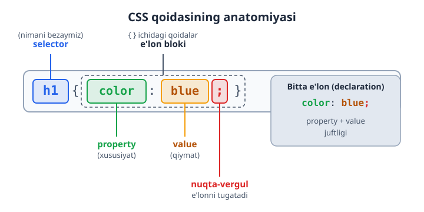
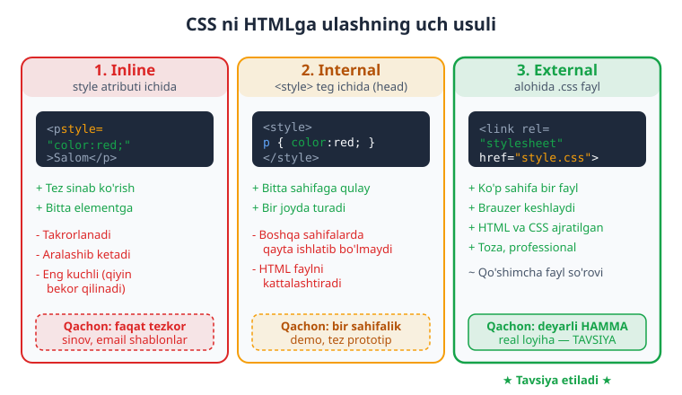
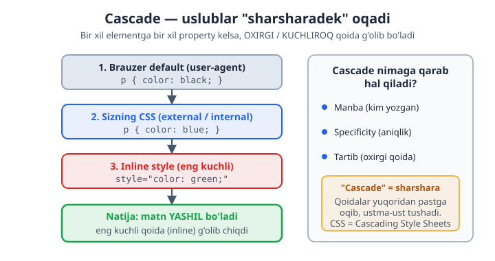

# 08 — CSS asoslari

[⬅️ Oldingi: 07 — Head, meta va SEO](./07-head-meta-seo.md) · [🏠 README](./README.md) · [Keyingi: 09 — Selektorlar ➡️](./09-selektorlar.md)

> **Bu bobda:** CSS nima ekanini, uning sintaksisi (selector, e'lon, property, value) hamda CSS ni HTMLga ulashning uch usulini (inline, internal, external) o'rganib, birinchi sahifangizni o'z qo'lingiz bilan bezaysiz.

---

## 8.1 CSS nima va nega kerak?

Shu paytgacha HTML bilan ishladingiz. HTML sahifangizning **skeleti** edi: sarlavhalar, paragraflar, ro'yxatlar, rasmlar, havolalar. Lekin faqat HTML bilan yozilgan sahifa juda **xunuk** ko'rinadi — qora matn, ko'k havolalar, oq fon. Hech qanday rang, masofa, shrift yoki tartib yo'q.

**CSS** (Cascading Style Sheets — "kaskadli uslublar jadvallari") aynan shu yerda kuchga kiradi. CSS — bu HTML elementlari **qanday ko'rinishini** belgilaydigan til: rang, o'lcham, shrift, masofa, joylashuv, fon va boshqalar.

Buni shunday tasavvur qiling:

- **HTML** — uyning **g'isht va devorlari** (struktura: nima qayerda).
- **CSS** — uyning **bo'yog'i, mebeli, dizayni** (ko'rinish: qanday ko'rinadi).
- **JavaScript** (keyingi boblarda) — uyning **elektr va mexanikasi** (xatti-harakat: nima ish qiladi).

### Nega strukturani ko'rinishdan ajratamiz?

Bu eng muhim "nega" savoli. Texnik atama bilan bu **separation of concerns** (vazifalarni ajratish) deyiladi. Ajratishning sabablari:

- **Tartib.** HTML faqat mazmun bilan, CSS faqat dizayn bilan shug'ullanadi. Kodni o'qish va tushunish osonlashadi.
- **Qayta ishlatish.** Bitta CSS faylni 100 ta HTML sahifaga ulash mumkin. Dizaynni bir joyda o'zgartirsangiz — 100 sahifada bir vaqtda o'zgaradi.
- **Hamkorlik.** Bir dasturchi HTML, ikkinchisi CSS ustida ishlashi mumkin, bir-biriga xalaqit bermay.
- **Tezlik.** Brauzer CSS faylni bir marta yuklab, keshlab (xotirada saqlab) qoladi. Keyingi sahifalar tezroq ochiladi.

> 💡 **Analogiya:** Word hujjatini tasavvur qiling. Matn — bu HTML. "Sarlavha 1" uslubi (font, rang, o'lcham) — bu CSS. Agar uslubni o'zgartirsangiz, shu uslubdagi BARCHA sarlavhalar bir vaqtda o'zgaradi. Aynan shu printsip CSS da ishlaydi.

---

## 8.2 CSS sintaksisi: qoidaning anatomiyasi

CSS ni o'rganish uchun avval uning **sintaksisini** (yozilish qoidasini) tushunish kerak. Yaxshi xabar: CSS sintaksisi juda **oddiy va izchil**. Bir marta tushunsangiz, butun CSS shu naqshga asoslanadi.

CSS ning eng kichik birligi — **qoida (rule)**. Mana bitta qoida:

```css
h1 {
  color: blue;
}
```

Bu qoida shuni anglatadi: "Barcha `<h1>` elementlarining matn rangini ko'k (blue) qil". Keling, bu qoidani qismlarga ajratamiz:



Har bir qismni alohida ko'rib chiqaylik:

| Qism | Inglizcha | Bu nima | Misol |
|------|-----------|---------|-------|
| **Selector** | selector | Qaysi element(lar)ni bezashni belgilaydi | `h1` |
| **E'lon bloki** | declaration block | `{ }` qavslar ichidagi barcha qoidalar | `{ color: blue; }` |
| **Property** | property | Qaysi xususiyatni o'zgartirish (rang, o'lcham...) | `color` |
| **Value** | value | Xususiyatga beriladigan qiymat | `blue` |
| **E'lon** | declaration | Bitta `property: value;` juftligi | `color: blue;` |

### Sintaksis qoidalari (eslab qoling)

1. **Selector**dan keyin **ochuvchi qavs** `{` keladi.
2. Har bir **e'lon** ichida property va value **ikki nuqta** `:` bilan ajratiladi.
3. Har bir e'lon **nuqta-vergul** `;` bilan tugaydi.
4. Hammasi **yopuvchi qavs** `}` bilan yakunlanadi.

Bitta selectorga bir nechta e'lon berish mumkin — har birini alohida qatorga yozish odat:

```css
h1 {
  color: blue;
  font-size: 32px;
  text-align: center;
}
```

Bu qoida `<h1>` larni: ko'k rangga bo'yaydi, 32 piksel kattalikda qiladi va markazga tekislaydi.

> ⚠️ **Eng ko'p uchraydigan xato — nuqta-vergulni unutish.** `color: blue` dan keyin `;` qo'ymasangiz, brauzer keyingi e'lonni shu bilan birga o'qishga urinadi va ikkalasi ham ishlamay qoladi. Har bir e'londan keyin `;` qo'yishni odat qiling — hatto blokdagi oxirgi e'londan keyin ham (keyinroq qo'shganda xato bo'lmaydi).

> 💡 **"Nega bunday sintaksis?"** Bu format mashinaga ham, odamga ham qulay. Brauzer `{`, `}`, `:`, `;` belgilariga qarab kodni aniq bo'laklarga ajrata oladi; siz esa har qaysi qoida qayerda boshlanib, qayerda tugashini bir qarashda ko'rasiz.

---

## 8.3 CSS izohlari (comments)

HTML dagi `<!-- -->` kabi, CSS da ham **izoh** (comment) yozish mumkin. Izoh — bu brauzer **e'tiborsiz qoldiradigan**, faqat odam o'qishi uchun yozilgan matn.

CSS da izoh `/*` bilan boshlanib, `*/` bilan tugaydi:

```css
/* Bu izoh — brauzer buni o'qimaydi */

h1 {
  color: blue; /* sarlavha rangi */
  /* font-size: 50px;  <- bu qator vaqtincha o'chirilgan */
}
```

Izohlar nega kerak?

- **O'zingizga eslatma.** "Bu rang nega tanlandi?", "bu blok nimaga javob beradi?".
- **Vaqtincha o'chirish.** Bir e'lonni o'chirib tashlamasdan, izohga aylantirib (`/* ... */`) sinab ko'rish mumkin.
- **Bo'limlarga ajratish.** Katta CSS faylda izoh bilan bo'limlarga (masalan "Header uslublari", "Footer uslublari") sarlavha qo'yish.

> 📌 HTML izohi `<!-- -->`, CSS izohi `/* */`. Ularni adashtirmang — CSS faylda HTML izohi ishlamaydi va aksincha.

---

## 8.4 CSS ni HTMLga ulashning uch usuli

CSS yozdingiz — endi uni HTML bilan **bog'lash** kerak, aks holda brauzer uni ko'rmaydi. Buning **uch usuli** bor. Har birining o'rni bor, lekin amalda bittasi eng ko'p ishlatiladi.



### 1-usul: Inline (style atributi)

CSS to'g'ridan-to'g'ri elementning `style` atributi ichiga yoziladi. Bu yerda selector va qavslar **kerak emas** — chunki uslub allaqachon shu elementga tegishli:

```html
<p style="color: red; font-size: 18px;">Bu paragraf qizil va kattaroq.</p>
```

- ✅ **Afzalligi:** tez sinab ko'rish; faqat bitta aniq elementni o'zgartirish.
- ❌ **Kamchiligi:** har bir elementga qaytadan yozish kerak (takrorlanish); HTML va dizayn aralashib ketadi; o'qish qiyinlashadi; keyinchalik o'zgartirish azob.

> ⚠️ Inline uslubdan **iloji boricha qochasiz**. U "eng kuchli" hisoblanadi (8.6 ga qarang), shuning uchun uni boshqa qoida bilan bekor qilish qiyin. Asosan tezkor sinov yoki email shablonlarida ishlatiladi.

### 2-usul: Internal (sahifa ichidagi `<style>`)

CSS HTML faylning `<head>` qismidagi `<style>` tegi ichiga yoziladi. Bu yerda **to'liq sintaksis** (selector, qavslar) ishlatiladi:

```html
<!DOCTYPE html>
<html lang="uz">
<head>
  <meta charset="UTF-8">
  <title>Internal CSS</title>
  <style>
    p {
      color: red;
      font-size: 18px;
    }
  </style>
</head>
<body>
  <p>Bu paragraf qizil — internal CSS orqali.</p>
  <p>Bu ham qizil, chunki selector "p" barcha paragraflarga tegishli.</p>
</body>
</html>
```

- ✅ **Afzalligi:** bitta sahifa uchun barcha uslublar bir joyda; takrorlash yo'q (selector bir marta yoziladi, hamma `<p>` ga ta'sir qiladi).
- ❌ **Kamchiligi:** uslublar faqat **shu bitta** HTML faylga tegishli — boshqa sahifalarda qayta ishlatib bo'lmaydi; HTML fayl kattalashadi.

> 📌 `<style>` tegi har doim `<head>` ichida turishi kerak, `<body>` da emas.

### 3-usul: External (alohida `.css` fayl) — TAVSIYA ETILADI

CSS butunlay alohida faylga (masalan `style.css`) yoziladi, HTML esa unga `<link>` tegi orqali ulanadi. Bu eng professional va eng ko'p ishlatiladigan usul.

Avval **`style.css`** faylini yarating (faqat CSS, HTML yo'q):

```css
/* style.css fayli */
p {
  color: red;
  font-size: 18px;
}
```

Keyin **`index.html`** faylida `<head>` ichida unga ulaning:

```html
<!DOCTYPE html>
<html lang="uz">
<head>
  <meta charset="UTF-8">
  <title>External CSS</title>
  <link rel="stylesheet" href="style.css">
</head>
<body>
  <p>Bu paragraf alohida CSS fayldan bezatildi.</p>
</body>
</html>
```

`<link>` tegidagi atributlarni tushunaylik:

- `rel="stylesheet"` — "bu bog'langan fayl turi: uslublar jadvali" (relationship = aloqa turi).
- `href="style.css"` — CSS faylning manzili (HTML fayl bilan bir papkada bo'lsa, shunchaki nomi yetadi).

Afzalliklari (nega aynan shu usul afzal):

- ✅ **Bir fayl — ko'p sahifa.** Bitta `style.css` ni o'nlab HTML sahifaga ulash mumkin. Saytning ko'rinishini bir joydan boshqaring.
- ✅ **Kesh.** Brauzer CSS faylni bir marta yuklab, xotirada saqlaydi. Foydalanuvchi keyingi sahifaga o'tganda CSS qaytadan yuklanmaydi — sayt tezroq ishlaydi.
- ✅ **Toza ajratish.** HTML faqat struktura, CSS faqat dizayn. Bu 8.1 da gaplashgan "separation of concerns".
- ⚠️ Yagona kichik "narx": brauzer qo'shimcha bitta fayl so'rovi yuboradi — lekin kesh tufayli bu bir martalik va arzimas.

> 💡 **Qaysi usulni qachon ishlataman?**
> - **External** — deyarli har doim, har qanday real loyihada. Standart tanlov.
> - **Internal** — bir sahifalik tez demo yoki prototip uchun, alohida fayl ortiqcha bo'lsa.
> - **Inline** — faqat tezkor sinov yoki email kabi maxsus holatlarda. Doimiy kodda qochish kerak.

---

## 8.5 Brauzer default uslublari (user-agent stylesheet)

Hech qanday CSS yozmasangiz ham, sahifangiz **butunlay uslubsiz** emas. Sinab ko'ring: bo'sh HTML faylga `<h1>Salom</h1>` va `<p>Matn</p>` yozing — sarlavha **katta va qalin**, paragraf esa kichikroq chiqadi. Ro'yxatlarda esa nuqtalar (`•`) paydo bo'ladi.

Bu uslublar qayerdan keladi? Ularni **brauzerning o'zi** beradi. Har bir brauzer (Chrome, Firefox, Safari) ichida **default CSS** mavjud — bu **user-agent stylesheet** ("foydalanuvchi-agenti uslublar jadvali") deb ataladi. "User agent" — bu brauzerning texnik nomi.

User-agent uslublari nima qiladi:

- `<h1>` ni katta va qalin qiladi, `<h2>` ni undan kichikroq va hokazo.
- Paragraflar orasiga avtomatik bo'sh joy (margin) qo'yadi.
- Havolalarni ko'k va tagiga chizilgan qiladi.
- `<ul>` ro'yxatlariga nuqta, `<ol>` ga raqam qo'shadi.

> 📌 **Nega buni bilish muhim?** Chunki siz ba'zan "men hech narsa yozmadim-ku, bu masofa qayerdan keldi?" deb hayron bo'lasiz. Javob: ko'pincha user-agent uslublaridan. Sizning CSS qoidalaringiz aslida brauzer default'ining **ustiga** yoziladi yoki uni bekor qiladi.

> 💡 Ko'p dasturchilar loyiha boshida brauzerlar orasidagi farqni tenglashtirish uchun "CSS reset" yoki "normalize.css" deb nomlangan kichik CSS qo'shadi. Buni hozircha bilib qo'ying — keyingi boblarda batafsil ko'ramiz.

---

## 8.6 "Cascade" so'zining ma'nosi

CSS ning to'liq nomi — **Cascading Style Sheets**. Bu yerdagi **"cascade"** (kaskad, sharshara) so'zi tasodifiy emas — u CSS ning eng muhim tushunchalaridan birini bildiradi.

Tasavvur qiling: bitta `<p>` elementiga **bir nechta joydan** rang berildi:

- Brauzer default'i — qora.
- Sizning external CSS — ko'k.
- Inline style — yashil.

Endi savol: paragraf **qaysi rangda** chiqadi? Bir vaqtda uchta rang bo'lishi mumkin emas-ku!

Aynan shu yerda **cascade** ishga tushadi. Cascade — bu CSS ning bir element uchun **ziddiyatli qoidalardan qaysi birini tanlash** mexanizmi. So'z "sharshara" ma'nosini beradi: qoidalar yuqoridan pastga oqib, ustma-ust tushadi va eng **kuchli** yoki **oxirgi** qoida g'olib chiqadi.



Yuqoridagi misolda paragraf **yashil** bo'ladi, chunki inline style eng kuchli. Agar inline bo'lmasa — **ko'k** (sizning CSS) g'olib bo'lardi, brauzer default'i (qora) emas.

Cascade qaror qabul qilishda taxminan shu uch narsaga qaraydi:

1. **Manba va muhimlik** — qoidani kim yozgan (brauzer default'imi yoki sizmi).
2. **Specificity (aniqlik)** — qoida qanchalik "aniq" element ko'rsatgan (bu haqda alohida bobda batafsil).
3. **Tartib** — bir xil kuchdagi ikki qoidadan **oxirgisi** g'olib bo'ladi.

> 📌 Hozircha ikkita oddiy qoidani eslab qoling:
> - Inline > internal/external > brauzer default (kuchi bo'yicha).
> - Bir xil kuchdagi ikki qoida bo'lsa — **keyingisi** (faylda pastroq turgan) g'olib chiqadi.

> 💡 Cascade — CSS ning "yuragi". Hozir uni chuqur tushunish shart emas; faqat **g'oyani** — "qoidalar to'qnashganda CSS qaysidir tartibda g'olibni tanlaydi" degan tushunchani — qabul qilib qo'ying. Keyingi boblarda specificity bilan birga batafsil qaytamiz.

---

## 8.7 Amaliy misol: birinchi sahifangizni bezash

Nazariyani amalda sinab ko'raylik. Quyida **external CSS** usuli bilan bezatilgan to'liq, ishlaydigan sahifa keltirilgan. Ikki fayl yarating.

**1-fayl: `index.html`**

```html
<!DOCTYPE html>
<html lang="uz">
<head>
  <meta charset="UTF-8">
  <meta name="viewport" content="width=device-width, initial-scale=1.0">
  <title>Mening birinchi bezatilgan sahifam</title>
  <link rel="stylesheet" href="style.css">
</head>
<body>
  <h1>Salom, dunyo!</h1>
  <p>Bu mening CSS bilan bezatgan birinchi sahifam.</p>
  <p class="muhim">Bu paragraf alohida ajratilgan.</p>
  <ul>
    <li>Birinchi punkt</li>
    <li>Ikkinchi punkt</li>
    <li>Uchinchi punkt</li>
  </ul>
</body>
</html>
```

**2-fayl: `style.css`** (xuddi shu papkada)

```css
/* ===== Umumiy sahifa uslublari ===== */
body {
  font-family: "Segoe UI", system-ui, sans-serif;
  background-color: #f8fafc;  /* och kulrang fon */
  color: #1e293b;             /* matn rangi (deyarli qora) */
  margin: 40px;
}

/* ===== Sarlavha ===== */
h1 {
  color: #2563eb;     /* ko'k */
  text-align: center;
}

/* ===== Paragraflar ===== */
p {
  font-size: 18px;
  line-height: 1.6;   /* qatorlar orasi kengligi (o'qish uchun qulay) */
}

/* "muhim" class li paragraf — alohida fon va chetdan masofa */
.muhim {
  background-color: #fef3c7;  /* och sariq */
  padding: 12px;
  border-radius: 8px;
}

/* ===== Ro'yxat ===== */
li {
  color: #16a34a;     /* yashil */
}
```

**Natija:** Sahifa och kulrang fonli, markazlashgan ko'k sarlavhali bo'ladi. Paragraflar kattaroq va o'qishga qulay; "muhim" klassli paragraf och sariq fon va yumaloq burchaklarga ega bo'ladi; ro'yxat punktlari yashil rangda chiqadi.

E'tibor bering: HTML da `class="muhim"` deb yozdik, CSS da esa unga `.muhim` (nuqta bilan) selector orqali murojaat qildik. `class` va selectorlar (`.class`, `#id`, element nomi) — keyingi bobning asosiy mavzusi. Hozircha asosiy g'oya: **HTML ga `class` qo'yib, CSS dan unga uslub berish mumkin.**

> 💡 **Sinab ko'ring:** `style.css` dagi `h1` rangini boshqa rangga (masalan `#dc2626` — qizil) o'zgartiring va faylni saqlab, brauzerni yangilang. Faqat CSS faylni o'zgartirib, butun sahifa ko'rinishini boshqarayotganingizni his qiling — bu external CSS ning kuchi.

> ⚠️ Ikki fayl **bir papkada** bo'lishi va `<link>` dagi `href="style.css"` nomi fayl nomiga **aynan mos** kelishi shart (katta-kichik harf ham muhim). Aks holda CSS ulanmaydi va sahifa bezaksiz ko'rinadi.

---

## Mashqlar

> Quyidagi mashqlarni bajarib, CSS asoslarini mustahkamlang. Har biri uchun yangi `.html` (va kerak bo'lsa `.css`) fayl yarating, brauzerda oching va natijani ko'ring.

### Mashq 1 — Qoida qismlarini nomlang

Quyidagi CSS qoidasida selector, property, value va e'lonni aniqlang:

```css
h2 {
  color: green;
  font-size: 24px;
}
```

<details markdown="1"><summary>Yechim</summary>

- **Selector:** `h2`
- **E'lon bloki:** `{ color: green; font-size: 24px; }`
- Bu blokda **ikkita e'lon** bor:
  - 1-e'lon: `color: green;` → property = `color`, value = `green`
  - 2-e'lon: `font-size: 24px;` → property = `font-size`, value = `24px`

</details>

### Mashq 2 — Uchta usulni sinab ko'ring

Bitta paragrafni **uchala usul** bilan qizil rangga bo'yang: bittada inline, bittada internal, bittada external. Har birini alohida HTML faylda yarating va natija bir xilligiga ishonch hosil qiling.

<details markdown="1"><summary>Yechim</summary>

**Inline** (`inline.html`):

```html
<p style="color: red;">Inline orqali qizil.</p>
```

**Internal** (`internal.html`):

```html
<head>
  <style>
    p { color: red; }
  </style>
</head>
<body>
  <p>Internal orqali qizil.</p>
</body>
```

**External** (`external.html` + `style.css`):

```html
<!-- external.html -->
<head>
  <link rel="stylesheet" href="style.css">
</head>
<body>
  <p>External orqali qizil.</p>
</body>
```

```css
/* style.css */
p { color: red; }
```

</details>

### Mashq 3 — Nuqta-vergul xatosini toping

Quyidagi CSS da xato bor. Uni toping va tuzating:

```css
h1 {
  color: blue
  font-size: 30px;
}
```

<details markdown="1"><summary>Yechim</summary>

`color: blue` dan keyin **nuqta-vergul** `;` yo'q. Shu sababli brauzer `blue font-size: 30px` ni bitta noto'g'ri qiymat deb o'qiydi va **ikkala** e'lon ham ishlamaydi. To'g'risi:

```css
h1 {
  color: blue;
  font-size: 30px;
}
```

</details>

### Mashq 4 — Izoh bilan vaqtincha o'chirish

Quyidagi CSS dagi `font-size` e'lonini **o'chirib tashlamasdan**, izoh yordamida vaqtincha ishlamas qilib qo'ying:

```css
p {
  color: navy;
  font-size: 20px;
}
```

<details markdown="1"><summary>Yechim</summary>

```css
p {
  color: navy;
  /* font-size: 20px; */
}
```

Endi `font-size` e'loni izoh ichida — brauzer uni e'tiborsiz qoldiradi, lekin kod o'chmagan. `/* */` ni olib tashlasangiz, qaytadan ishlaydi.

</details>

### Mashq 5 — External CSS bilan sahifa bezang

`index.html` va `style.css` yarating. Sahifada bitta `<h1>`, bitta `<p>` va uch elementli `<ul>` bo'lsin. External CSS orqali: sarlavhani markazga tekislang va ko'k qiling; paragraf o'lchamini 18px qiling; ro'yxat punktlarini yashil rangga bo'yang.

<details markdown="1"><summary>Yechim</summary>

```html
<!-- index.html -->
<!DOCTYPE html>
<html lang="uz">
<head>
  <meta charset="UTF-8">
  <title>Mashq 5</title>
  <link rel="stylesheet" href="style.css">
</head>
<body>
  <h1>Mening sahifam</h1>
  <p>Bu external CSS bilan bezatilgan paragraf.</p>
  <ul>
    <li>Olma</li>
    <li>Banan</li>
    <li>Uzum</li>
  </ul>
</body>
</html>
```

```css
/* style.css */
h1 {
  color: blue;
  text-align: center;
}
p {
  font-size: 18px;
}
li {
  color: green;
}
```

</details>

### Mashq 6 — Cascade: qaysi rang g'olib?

Quyidagi kodda paragraf **qaysi rangda** chiqadi? Nega?

```html
<head>
  <style>
    p { color: blue; }
  </style>
</head>
<body>
  <p style="color: green;">Qaysi rang?</p>
</body>
```

<details markdown="1"><summary>Yechim</summary>

Paragraf **yashil** (green) chiqadi. Sababi cascade: **inline style** (`style="color: green;"`) internal CSS dan (`p { color: blue; }`) **kuchliroq**, shuning uchun u g'olib bo'ladi.

</details>

### Mashq 7 — Tartib qoidasi

Quyidagi CSS da paragraf qaysi rangda chiqadi? Nega?

```css
p { color: red; }
p { color: green; }
```

<details markdown="1"><summary>Yechim</summary>

Paragraf **yashil** (green) chiqadi. Ikkala qoidaning **kuchi (specificity) bir xil** — ikkalasi ham oddiy `p` selectori. Bunday holatda cascade'ning **tartib** qoidasi ishlaydi: faylda **oxirgi** kelgan qoida g'olib bo'ladi. `color: green;` keyin kelgani uchun u qizilni bekor qiladi.

</details>

### Mashq 8 — Mini "biznes kartochka" sahifasi

External CSS yordamida o'zingiz haqingizdagi kichik "biznes kartochka" sahifasini yarating. Talablar: ismingiz `<h1>` da va markazlashgan; bitta kasb/qiziqish paragrafi; uchta sevimli narsangiz `<ul>` ro'yxatida; sahifaga och fon rang; matn rangi to'q kulrang. Iloji bo'lsa, paragrafga `class` berib, unga fon rang va `padding` qo'shing.

<details markdown="1"><summary>Yechim (namuna)</summary>

```html
<!-- index.html -->
<!DOCTYPE html>
<html lang="uz">
<head>
  <meta charset="UTF-8">
  <title>Biznes kartochka</title>
  <link rel="stylesheet" href="style.css">
</head>
<body>
  <h1>Ali Valiyev</h1>
  <p class="kasb">Boshlovchi veb-dasturchi va HTML/CSS ixlosmandi.</p>
  <ul>
    <li>Kodlash</li>
    <li>Kitob o'qish</li>
    <li>Sayohat</li>
  </ul>
</body>
</html>
```

```css
/* style.css */
body {
  font-family: "Segoe UI", system-ui, sans-serif;
  background-color: #f8fafc;
  color: #1e293b;
  margin: 40px;
}
h1 {
  text-align: center;
  color: #2563eb;
}
.kasb {
  background-color: #e2e8f0;
  padding: 12px;
  border-radius: 8px;
  text-align: center;
}
li {
  font-size: 18px;
}
```

Bu yechim shunchaki namuna — ranglar, matn va ro'yxatni o'zingizga moslab o'zgartiring. Asosiysi: external CSS, markazlashgan sarlavha, `class` bilan bezatilgan paragraf.

</details>

---

[⬅️ Oldingi: 07 — Head, meta va SEO](./07-head-meta-seo.md) · [🏠 README](./README.md) · [Keyingi: 09 — Selektorlar ➡️](./09-selektorlar.md)
