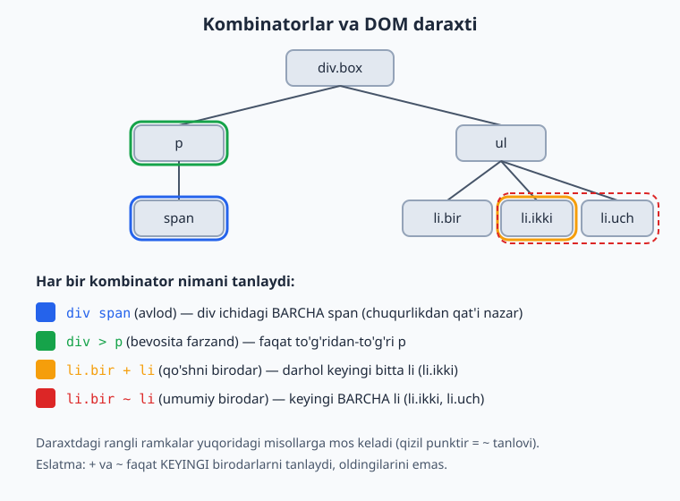
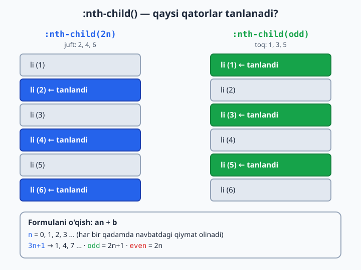
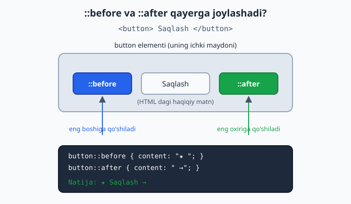
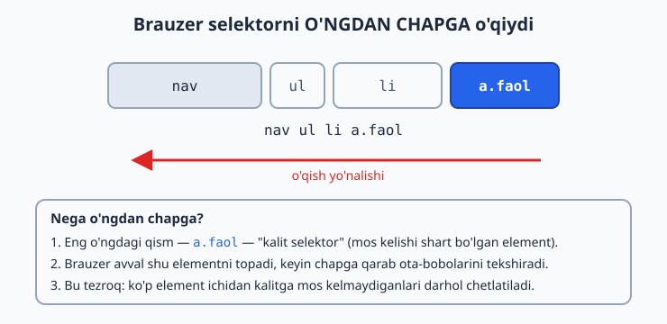

# 09 — Selektorlar

[⬅️ Oldingi: 08 — CSS asoslari](./08-css-asoslari.md) · [🏠 README](./README.md) · [Keyingi: 10 — Cascade, specificity va inheritance ➡️](./10-cascade-specificity-inheritance.md)

> **Bu bobda:** elementlarni aniq tanlash: tur, klass, id, kombinatorlar va psevdolar.

---

CSS yozishning yarmi — qoidalarni yozish (`color: red`), ikkinchi yarmi esa **qaysi elementga** shu qoidani qo'llashni aytish. Mana shu "qaysi elementga" degan savolga javob beradigan vosita **selektor** (selector — tanlovchi) deb ataladi.

Tasavvur qil: sen sinfdagi o'qituvchisan. "Birinchi qatordagilar turing", "ko'ylagi qizil bo'lganlar qo'l ko'taring", "Aliyevning yonidagi o'tirgan o'quvchi" — bularning har biri bir guruh odamni **aniqlab beradi**. Selektor ham xuddi shunday: sahifadagi minglab elementdan kerakligini ajratib oladi. Bu bob seni eng sodda selektordan (`p`) to expert darajadagi murakkab tanlovlargacha (`li:not(:last-child)::after`) bosqichma-bosqich olib boradi.

💡 Selektorni yaxshi bilish — CSS'da eng kuchli ko'nikma. Ko'p odam CSS "ishlamayapti" deb shikoyat qiladi, aslida muammo qoidada emas, **selektor noto'g'ri element**ni tanlayotganida bo'ladi.

---

## 9.1 Selektor nima va u qanday ishlaydi

Har bir CSS qoidasi ikki qismdan iborat: **selektor** va **deklaratsiya bloki**.

```css
p {              /* p — selektor */
  color: blue;   /* { ... } — deklaratsiya bloki */
}
```

Bu qoida shunday o'qiladi: "Sahifadagi **har bir** `<p>` elementini top va matn rangini ko'k qil."

Brauzer HTML'ni o'qiyotganda sahifani **daraxt** (DOM — Document Object Model) ko'rinishida tuzadi: `<html>` ildiz, ichida `<body>`, uning ichida boshqa elementlar va hokazo. Selektor — shu daraxtdan kerakli "shoxlar"ni terib oladigan filtr.

📌 Bitta element bir nechta selektorga mos kelishi mumkin (masalan, `<p class="muhim">` ham `p`, ham `.muhim`, ham `*` selektoriga tushadi). Qaysi qoida g'olib chiqishi **spesifiklik** (specificity) qoidalariga bog'liq — buni keyingi bobda ko'ramiz. Hozircha selektorlarning o'zini puxta o'rganamiz.

---

## 9.2 Asosiy selektorlar: tur, klass, id

Bu uchtasi — CSS'ning kundalik noni. 95% holatda shulardan foydalanasan.

### Tur selektori (element/type selector)

Element nomini shundoq yozasan — hech qanday belgi qo'ymasdan.

```css
p      { line-height: 1.6; }   /* barcha <p> */
h1     { font-size: 32px; }    /* barcha <h1> */
button { cursor: pointer; }    /* barcha <button> */
```

**Nega kerak?** Sahifadagi bir TURDAGI barcha elementga umumiy ko'rinish berish uchun. Masalan, barcha paragraflarning satrlar orasini kengaytirish.

⚠️ Tur selektori **juda keng**. `p { color: red }` desang, sahifadagi tagidagi eng kichik paragrafga ham ta'sir qiladi. Aniqroq nishon kerak bo'lsa — klassdan foydalan.

### Klass selektori (class selector)

HTML'da elementga `class="..."` atributini berasan, CSS'da esa **nuqta** `.` bilan murojaat qilasan.

```html
<p class="ogohlantirish">Diqqat!</p>
<span class="ogohlantirish">Bu ham diqqat.</span>
```

```css
.ogohlantirish {
  color: #dc2626;
  font-weight: bold;
}
```

**Nega klass eng ko'p ishlatiladi?**
- Bitta klassni **istalgancha ko'p** elementga berish mumkin (yuqorida `<p>` ham, `<span>` ham).
- Bitta elementga **bir nechta** klass berish mumkin: `<div class="karta katta faol">`.
- Element turidan mustaqil — bugun `<p>`, ertaga `<div>` bo'lsa ham klass o'sha-o'sha ishlaydi.

💡 Amaliyotda CSS'ning aksariyati klasslar ustiga quriladi. Bu element turiga bog'lanib qolmaslik va qayta foydalanish imkonini beradi.

### Id selektori (id selector)

`id="..."` atributiga **panjara** `#` bilan murojaat qilasan.

```html
<header id="bosh-qism">...</header>
```

```css
#bosh-qism {
  background: #f8fafc;
}
```

**Muhim qoida:** bitta `id` sahifada **faqat bir marta** ishlatilishi kerak — u noyob identifikator. `class` esa qayta-qayta ishlatiladi.

⚠️ Id selektorni stil berish uchun ishlatish **tavsiya etilmaydi**. Sababi: id juda "kuchli" (yuqori spesifiklik), keyinroq uni klass bilan qayta yozish qiyin bo'ladi. Id'lar ko'proq JavaScript va sahifa ichi havolalari (`<a href="#bosh-qism">`) uchun ishlatiladi. Stil uchun — klass.

### Qiyoslash jadvali

| Selektor | Yozilishi | Necha marta | Asosiy maqsad |
|---|---|---|---|
| Tur | `p` | cheksiz | bir turdagi barcha element |
| Klass | `.box` | cheksiz | qayta ishlatiluvchi stil |
| Id | `#main` | bir marta | noyob element, JS, havola |

---

## 9.3 Universal va guruhlash selektorlari

### Universal selektor `*`

Yulduzcha **hamma narsani** tanlaydi — istisnosiz.

```css
* {
  margin: 0;
  padding: 0;
  box-sizing: border-box;
}
```

**Nega kerak?** Eng ko'p ishlatiladigan joyi — yuqoridagi kabi "reset": brauzer har bir elementga beradigan standart bo'shliqlarni nolga tushirish va `box-sizing` ni hamma joyda bir xil qilish.

⚠️ `*` ni keng qo'llashdan ehtiyot bo'l. U **har bir** elementga tegadi, shuning uchun unga og'ir qoidalar (masalan `transition: all`) yozsang, sahifa sekinlashishi mumkin. Reset uchun yaxshi, qolgan hollarda aniqroq selektor afzal.

### Guruhlash (vergul bilan)

Bir nechta selektorga **bir xil** qoida berish kerak bo'lsa, ularni **vergul** bilan sanaysan.

```css
h1, h2, h3 {
  font-family: "Segoe UI", sans-serif;
  color: #1e293b;
}
```

Bu — quyidagining qisqa shakli:

```css
h1 { font-family: "Segoe UI", sans-serif; color: #1e293b; }
h2 { font-family: "Segoe UI", sans-serif; color: #1e293b; }
h3 { font-family: "Segoe UI", sans-serif; color: #1e293b; }
```

**Nega vergul muhim?** Vergulni unutsang, ma'no butunlay o'zgaradi:

```css
h1 h2 { ... }   /* h1 ICHIDAGI h2 (kombinator!) — odatda mavjud emas */
h1, h2 { ... }  /* h1 VA h2 (guruhlash) */
```

⚠️ Bu juda tez-tez uchraydigan xato: vergulni tushirib qoldirsang, brauzer xato bermaydi — shunchaki butunlay boshqa narsani tanlaydi va sen nima uchun "stil ishlamayapti" deb hayron bo'lasan.

💡 Bitta umumiy maslahat: agar vergulli ro'yxatdagi **bironta** selektor noto'g'ri (brauzer tushunmaydigan) bo'lsa, eski brauzerlarda butun qoida e'tiborsiz qoldirilishi mumkin. Yangi xususiyatlarni alohida yozish xavfsizroq.

---

## 9.4 Kombinatorlar: elementlarni munosabati bo'yicha tanlash

Hozirgacha alohida elementlarni tanladik. **Kombinatorlar** esa elementlarni **bir-biriga nisbatan joylashuvi** bo'yicha tanlash imkonini beradi: "shu element ICHIDAGI", "to'g'ridan-to'g'ri farzandi", "darhol keyingisi" va hokazo.

Quyidagi diagramma to'rt kombinatorni bitta DOM daraxtida ko'rsatadi — har biri qaysi elementni tanlashini rang bilan ajratdik.



Endi har birini alohida ko'ramiz. Misollar uchun shu HTML'dan foydalanamiz:

```html
<div class="box">
  <p>Birinchi <span>matn</span></p>
  <ul>
    <li class="bir">Bir</li>
    <li class="ikki">Ikki</li>
    <li class="uch">Uch</li>
  </ul>
</div>
```

### Avlod kombinatori — bo'shliq `a b`

Ikki selektor orasiga **bo'shliq** qo'ysang, bu "birinchisi ICHIDAGI ikkinchisi" degani — qanchalik chuqurda bo'lishidan qat'i nazar.

```css
.box span { color: blue; }   /* .box ichidagi BARCHA span */
```

`<span>` `<p>` ning ichida, `<p>` esa `.box` ning ichida. Span to'g'ridan-to'g'ri `.box` ning farzandi bo'lmasa ham — baribir tanlanadi, chunki u `.box` ning **avlodi** (nabira, evara — farqi yo'q).

### Bevosita farzand kombinatori — `>`

`>` belgisi faqat **to'g'ridan-to'g'ri farzand**ni tanlaydi (bir pog'ona pastda).

```css
.box > p { font-weight: bold; }   /* faqat .box ning bevosita farzandi p */
```

`<p>` to'g'ridan-to'g'ri `.box` ichida — tanlanadi. Ammo `.box > span` **hech narsani tanlamaydi**, chunki `<span>` `.box` ning bevosita farzandi emas (u `<p>` ichida).

**Nega ikkalasi kerak?** Bo'shliq — "chuqurligi muhim emas, ichida bo'lsa bas". `>` — "aniq bitta pog'ona pastda". Murakkab tuzilmalarda `>` xatolardan saqlaydi: masalan, faqat yuqori darajadagi menyu bandlarini tanlab, ichki ostmenyularga tegmaslik uchun.

### Qo'shni birodar kombinatori — `+`

`+` belgisi **darhol keyingi bitta birodar**ni tanlaydi (bir ota-ona ostida, ketma-ket turgan).

```css
li.bir + li { color: green; }   /* li.bir dan KEYINGI bitta li */
```

Bu `li.ikki` ni tanlaydi (chunki u `li.bir` dan darhol keyin keladi). `li.uch` tanlanmaydi — u keyingi emas, undan keyingisi.

### Umumiy birodar kombinatori — `~`

`~` belgisi **keyingi BARCHA birodar**larni tanlaydi (faqat darhol keyingisini emas).

```css
li.bir ~ li { color: red; }   /* li.bir dan keyingi BARCHA li */
```

Bu `li.ikki` **va** `li.uch` ni tanlaydi.

⚠️ Ham `+`, ham `~` **faqat keyinga** qaraydi. Oldinga (yuqoriga) qaragan kombinator yo'q: `li.uch + li` yoki `li.uch ~ li` hech narsani tanlamaydi, chunki `li.uch` dan keyin birodar yo'q. CSS daraxtni yuqoridan pastga o'qiydi.

### Qisqa jadval

| Kombinator | O'qilishi | Misol | Tanlaydi |
|---|---|---|---|
| (bo'shliq) | ichidagi (avlod) | `div p` | `div` ichidagi barcha `p` |
| `>` | bevosita farzand | `div > p` | faqat to'g'ridan-to'g'ri `p` |
| `+` | qo'shni birodar | `h2 + p` | `h2` dan keyingi bitta `p` |
| `~` | umumiy birodar | `h2 ~ p` | `h2` dan keyingi barcha `p` |

---

## 9.5 Atribut selektorlari

Elementlarni ularning **atributi** yoki uning **qiymati** bo'yicha tanlash mumkin. Bu kvadrat qavslar `[ ]` orqali yoziladi.

### Atribut mavjudligi bo'yicha

```css
[disabled]      { opacity: 0.5; }   /* disabled atributi BOR har qanday element */
[required]      { border-color: orange; }
input[type]     { ... }             /* type atributi bor input */
```

### Aniq qiymat bo'yicha `[atr=qiymat]`

```css
input[type="text"]     { border: 1px solid #94a3b8; }
input[type="password"] { letter-spacing: 2px; }
a[target="_blank"]     { color: #2563eb; }
```

Bu — formalar bilan ishlashda juda qadrli, chunki barcha `<input>` bir xil teg, lekin `type` ularni farqlaydi.

### Qism bo'yicha moslash (kuchli operatorlar)

Mana bu yerda atribut selektorlari haqiqatan kuchli bo'ladi. Qiymatning **bir qismini** ham qidirish mumkin:

| Operator | Ma'nosi | Misol | Mos keladi |
|---|---|---|---|
| `^=` | bilan **boshlanadi** | `[href^="https"]` | `https://...` |
| `$=` | bilan **tugaydi** | `[href$=".pdf"]` | `hujjat.pdf` |
| `*=` | ichida **bor** | `[class*="btn"]` | `btn-katta`, `mening-btn` |
| `~=` | bo'sh joy bilan ajralgan **so'z** | `[class~="faol"]` | `karta faol katta` |
| `\|=` | qiymat yoki `qiymat-...` | `[lang\|="uz"]` | `uz`, `uz-UZ` |

Amaliy misollar:

```css
/* Tashqi havolalarni ajratish */
a[href^="https://"] { color: #2563eb; }

/* Fayl turini ikonka bilan belgilash */
a[href$=".pdf"]::after { content: " (PDF)"; }

/* Nomida "btn" bo'lgan har qanday klass */
[class*="btn"] { cursor: pointer; }

/* Elektron pochta havolalari */
a[href^="mailto:"] { color: #16a34a; }
```

💡 `^=` (boshi) va `$=` (oxiri) ni eslab qolish uchun: regular expression (matn shabloni) sintaksisida ham `^` "boshi", `$` "oxiri" degani. Bir xil mantiq.

⚠️ Atribut qiymatlarini **qo'shtirnoq** ichiga olish odat tusiga aylansin: `[type="text"]`. Oddiy so'zlar uchun tirnoqsiz ham ishlaydi, lekin qiymatda nuqta, bo'sh joy yoki maxsus belgi bo'lsa, tirnoqsiz buziladi. Doim tirnoq qo'yish — xavfsiz odat.

📌 Katta-kichik harf: atribut selektorlari odatda qiymatga sezgir (`[type="Text"]` ishlamasligi mumkin). HTML atributlari uchun katta-kichikni e'tiborsiz qoldirishni istasang, yopuvchi qavsdan oldin `i` qo'shasan: `[type="text" i]`.

---

## 9.6 Psevdo-klasslar: holatga qarab tanlash

**Psevdo-klass** (pseudo-class) — elementning HTML'da ko'rinmaydigan **holati** yoki **o'rni** bo'yicha tanlash. Bitta **ikki nuqta** `:` bilan yoziladi. "Psevdo" — "go'yo, soxta" degani: bu HTML'da yozilmagan, lekin go'yoki mavjud klass.

### Foydalanuvchi harakati holatlari

Bular foydalanuvchining sichqoncha/klaviatura bilan qilayotgan ishiga javob beradi:

```css
a:hover   { color: #2563eb; }              /* sichqoncha ustida */
a:focus   { outline: 2px solid #2563eb; }  /* fokusda (Tab bilan) */
a:active  { color: #dc2626; }              /* bosilayotgan paytda */
```

**Nega `:focus` muhim?** Klaviatura bilan saytda yuradigan odamlar (sichqonchasiz, yoki maxsus imkoniyatli foydalanuvchilar) qaerda turganini ko'rishi shart. `:focus` stilini olib tashlama — bu qulaylik (accessibility) masalasi.

📌 Tartib muhim: havolalar uchun an'anaviy ketma-ketlik `:link`, `:visited`, `:hover`, `:active` (inglizcha "LoVe HAte" deb eslanadi). Aks holda `:hover` `:active` ni "bosib qo'yishi" mumkin.

### Tuzilma (o'rin) bo'yicha psevdo-klasslar

Bular elementning ota-onasi ichidagi **o'rni** bo'yicha tanlaydi:

```css
li:first-child { font-weight: bold; }   /* ro'yxatdagi BIRINCHI li */
li:last-child  { border: none; }        /* OXIRGI li */
li:nth-child(2) { color: red; }         /* aniq 2-li */
```

`:nth-child()` — eng kuchlisi. Ichiga **formula** yoki kalit so'z yozasan:

```css
li:nth-child(odd)   { background: #f8fafc; }  /* toq: 1,3,5 */
li:nth-child(even)  { background: #e2e8f0; }  /* juft: 2,4,6 */
li:nth-child(2n)    { ... }                   /* even bilan bir xil */
li:nth-child(3n)    { ... }                   /* har 3-: 3,6,9 */
li:nth-child(3n+1)  { ... }                   /* 1,4,7,10 */
```

Quyidagi diagramma formulani vizual tushuntiradi:



**Formulani qanday o'qish kerak?** `an+b` da `n` ketma-ket 0, 1, 2, 3... qiymat oladi:
- `2n` → 2·0=0 (yo'q), 2·1=2, 2·2=4, 2·3=6 → **2, 4, 6**
- `3n+1` → 3·0+1=1, 3·1+1=4, 3·2+1=7 → **1, 4, 7**

💡 Eng mashhur amaliy ishi — jadval qatorlarini almashlab bo'yash ("zebra"): `tr:nth-child(even) { background: #f1f5f9; }`. Ko'z toliqmaydi, qatorlar adashmaydi.

### `:first-of-type` va o'rin psevdolari farqi

`:first-child` "ota-ona ichidagi birinchi farzand bo'lsa" deydi — **agar u o'sha turdagi bo'lsa**. `:first-of-type` esa "o'z TURI bo'yicha birinchi" deydi.

```html
<div>
  <h2>Sarlavha</h2>
  <p>Birinchi paragraf</p>
  <p>Ikkinchi paragraf</p>
</div>
```

```css
p:first-child   { ... }  /* HECH NARSA — birinchi farzand h2, p emas */
p:first-of-type { ... }  /* "Birinchi paragraf" — p'lar orasida birinchi */
```

⚠️ Bu eng ko'p chalkashtiriladigan joy. `p:first-child` "birinchi farzand HAM p bo'lishi shart" demakdir. Agar birinchi farzand boshqa element bo'lsa — hech nima tanlanmaydi. Aralash bolalarda ko'pincha senga `:first-of-type` kerak bo'ladi.

### Inkor: `:not()`

`:not()` — "shunday BO'LMAGAN" elementlarni tanlaydi. Ichiga selektor yozasan.

```css
li:not(.faol)          { opacity: 0.6; }    /* .faol BO'LMAGAN li */
input:not([type="submit"]) { width: 100%; } /* submit BO'LMAGAN input */
button:not(:last-child)    { margin-right: 8px; }
```

**Nega kerak?** "Oxirgisidan tashqari hammasiga" kabi qoidalarni juda ixcham yozadi. Yuqoridagi oxirgi misol: oxirgi tugmadan boshqa hamma tugmaga o'ng tomondan bo'shliq beradi — natijada tugmalar orasida bo'shliq bo'lib, oxirida ortiqcha bo'shliq qolmaydi.

### Forma holatlari

```css
input:checked   { ... }   /* belgilangan checkbox/radio */
input:disabled  { background: #e2e8f0; }   /* o'chirilgan */
input:enabled   { ... }   /* yoqilgan */
input:required  { ... }   /* majburiy */
input:valid     { border-color: #16a34a; } /* to'g'ri to'ldirilgan */
input:invalid   { border-color: #dc2626; } /* xato to'ldirilgan */
```

💡 `:checked` JavaScript'siz juda ko'p narsa qilishga imkon beradi: ochiladigan menyular, tab'lar, akkordeonlar — barchasi yashirin checkbox + `:checked` + birodar kombinatori bilan quriladi.

---

## 9.7 Psevdo-elementlar: yangi "soxta" elementlar yaratish

Psevdo-**klass** mavjud elementni tanlardi. Psevdo-**element** esa elementning bir QISMINI tanlaydi yoki **butunlay yangi** (HTML'da yo'q) mazmun qo'shadi. U **ikkita ikki nuqta** `::` bilan yoziladi — shu bilan psevdo-klassdan farqlanadi.

📌 Tarixiy sabab: eski CSS'da bitta `:` ishlatilardi (`:before`). Hozir ikkitasi (`::before`) standart. Brauzerlar ikkalasini ham tushunadi, lekin yangi kodda doim `::` yoz.

### `::before` va `::after` — kontent qo'shish

Bular element ichiga, mazmunining **boshiga** (`::before`) yoki **oxiriga** (`::after`) yangi mazmun qo'shadi. Ular ishlashi uchun **`content`** xususiyati shart (bo'sh bo'lsa ham: `content: ""`).

```css
.tashqi-havola::after {
  content: " ↗";
  color: #2563eb;
}

.muhim::before {
  content: "★ ";
  color: #f59e0b;
}
```

Quyidagi diagramma `::before` va `::after` element ichida aniq qayerga qo'shilishini ko'rsatadi:



**Nega `content` shart?** `::before`/`::after` aslida "bo'sh joy" — sen unga nima qo'yishni `content` orqali aytasan. `content` yo'q bo'lsa, psevdo-element umuman paydo bo'lmaydi.

Amaliy qo'llanishlar:
- Ikonkalar va belgilar qo'shish (yulduzcha, o'q, tirnoq belgilari).
- Dekorativ chiziqlar va shakllar (`content: ""` + `width`/`height`/`background`).
- Majburiy maydonlarga `*` qo'shish: `label.majburiy::after { content: " *"; color: #dc2626; }`.

⚠️ Muhim qoida: `::before`/`::after` ga qo'shilgan mazmun **dekorativ**. Ekran o'quvchilari (screen reader) uni har doim ham o'qimaydi va u nusxalashda olinmasligi mumkin. Shuning uchun **muhim ma'lumotni** (masalan, asosiy matnni yoki tugma yorlig'ini) bu yerga yozma — faqat bezak uchun ishlat.

### Matn qismlarini tanlash: `::first-line`, `::first-letter`

```css
p::first-letter {       /* birinchi HARF */
  font-size: 3em;
  float: left;
  color: #2563eb;
}

p::first-line {         /* birinchi SATR */
  font-weight: bold;
}
```

`::first-letter` — gazeta/kitoblardagi katta bosh harf (drop cap) effekti uchun klassik. `::first-line` esa birinchi satrni ajratadi — diqqat: "satr" oyna kengligiga qarab o'zgaradi, shuning uchun bu **dinamik**.

### `::selection` — belgilangan matn

Foydalanuvchi sichqoncha bilan ajratib (tanlab) olgan matn ko'rinishini o'zgartiradi:

```css
::selection {
  background: #2563eb;
  color: #ffffff;
}
```

💡 Brend ranglaringizga mos tanlov rangi — sayt pishiqligini ko'rsatadigan kichik, lekin yoqimli detal.

### `::placeholder` — input ichidagi ko'rsatma matn

```css
input::placeholder {
  color: #94a3b8;
  font-style: italic;
}
```

`<input placeholder="Ismingiz">` ichidagi xira ko'rsatma matnning ko'rinishini boshqaradi.

⚠️ Placeholder rangini juda xira qilma — o'qib bo'lmaydigan ko'rsatma yo'q bo'lgani bilan barobar. Va placeholder yorliq (label) o'rnini bosa olmaydi: har bir maydonga haqiqiy `<label>` ber.

### Bir nuqta yoki ikki nuqta?

| Tur | Belgi | Misol | Nimani |
|---|---|---|---|
| Psevdo-klass | `:` (bitta) | `:hover`, `:nth-child()` | mavjud elementni holat/o'rin bo'yicha |
| Psevdo-element | `::` (ikki) | `::before`, `::first-letter` | element qismi yoki yangi mazmun |

---

## 9.8 Murakkab selektorlarni zanjirlash

Haqiqiy loyihalarda selektorlarni **birlashtirib** ishlatasan. Birlashtirishning ikki turi bor: **biriktirish** (bo'shliqsiz) va **kombinator** (bo'shliq yoki belgi bilan).

### Bo'shliqsiz biriktirish — "VA" mantiqi

Selektorlarni bo'shliqsiz yozsang, ularning **hammasi** bir elementga tegishi shart:

```css
p.muhim          { ... }   /* p VA klassi muhim */
input[type="text"]:focus { ... }  /* input VA type=text VA fokusda */
button.asosiy:hover      { ... }  /* button VA klassi asosiy VA hover */
li.faol:first-child      { ... }  /* li VA faol VA birinchi farzand */
```

`p.muhim` — bu `<p class="muhim">` ni tanlaydi, lekin `<div class="muhim">` ni emas (u `p` emas).

⚠️ Bo'shliq bor-yo'qligi MA'NONI butunlay o'zgartiradi:
- `p.muhim` (bo'shliqsiz) = "muhim klassli p".
- `p .muhim` (bo'shliq bilan) = "p ichidagi muhim klassli element". Bu butunlay boshqa narsa!

Bu farqni tushunish — boshlovchilarning eng katta sakrashlaridan biri.

### Kombinator bilan birlashtirish

```css
nav ul li a              { ... }   /* nav>ul>li ichidagi a */
.menyu > li:hover        { ... }   /* .menyu bevosita farzandi li, hover holatda */
form input:not(:disabled){ ... }   /* form ichidagi, o'chirilmagan input */
.karta:hover .tugma      { ... }   /* karta hover bo'lganda ICHIDAGI tugma */
```

Oxirgisi juda kuchli usul: `.karta:hover .tugma` — kartaga sichqoncha kelganda uning ichidagi tugma ko'rinishini o'zgartiradi. Hover bir elementda, ta'sir esa boshqasida.

---

## 9.9 Selektorni o'qish strategiyasi: o'ngdan chapga

Endi expert sirini ochamiz. **Brauzer selektorni o'ngdan chapga o'qiydi** — sen yozgan tartibda emas, teskari.



`nav ul li a.faol` selektorini olaylik. Sen uni chapdan o'ngga "nav, ichida ul, ichida li, ichida faol a" deb o'qiysan. Brauzer esa teskari ishlaydi:

1. **Eng o'ngdagi qismdan boshlaydi** — `a.faol`. Bu "kalit selektor" (key selector). Brauzer avval sahifadagi barcha `.faol` klassli `<a>` ni topadi.
2. Keyin har biri uchun **chapga qarab** tekshiradi: "ota-onasi `li` mi? Uning ota-onasi `ul` mi? Uningniki `nav` mi?"
3. Agar zanjir uzilsa — o'sha element rad etiladi.

**Nega bu seni qiziqtirishi kerak?** Ikki sabab:

**1) O'qish va tuzatish (debugging) oson bo'ladi.** Murakkab selektorni ko'rganda, avval eng o'ngdagi qismga qara — asosan **shu** element stillanadi, qolgani esa shartlar. `div.sidebar ul.menu li a` → "bu a ga tegadi, qolgan hammasi — a qayerda turishi kerakligining sharti".

**2) Unumdorlik (performance).** Kalit selektor qanchalik aniq bo'lsa, brauzer shuncha kam elementni tekshiradi. `* + *` kabi keng kalit yomon; `.faol` kabi aniq kalit yaxshi. Kichik saytlarda farqi sezilmaydi, ammo katta sahifalarda muhim.

💡 Amaliy maslahat: selektorni iloji boricha **qisqa va aniq** tut. `body div.wrapper main section.content article p` o'rniga ko'pincha `.content p` yoki shunchaki bitta klass yetarli. Uzun zanjir nafaqat sekin, balki **mo'rt** — HTML tuzilishi biroz o'zgarsa, darhol buziladi.

---

## 9.10 Tez-tez uchraydigan xatolar va maslahatlar

📌 Bobni yakunlashdan oldin, eng ko'p uchraydigan tuzoqlarni bir joyga to'playmiz:

- ⚠️ **Bo'shliqni unutish/qo'shib yuborish.** `.a.b` (ikkala klass bir elementda) va `.a .b` (b, a ichida) — butunlay boshqa. Bu eng ko'p uchraydigan xato.
- ⚠️ **Vergulni tushirib qoldirish.** `h1 h2` (h1 ichidagi h2) va `h1, h2` (ikkalasi). Vergulsiz qoida "ishlamaydi" deb ko'rinadi.
- ⚠️ **`:first-child` va `:first-of-type` ni aralashtirish.** Aralash bolalar orasida ko'pincha `-of-type` kerak.
- ⚠️ **`content` ni unutish.** `::before`/`::after` `content` siz umuman ko'rinmaydi.
- ⚠️ **Id'ga stil berish.** Ishlaydi, lekin spesifiklik baland bo'lib, keyin uni qayta yozish azobga aylanadi. Stil uchun klass ishlat.
- 💡 **`:focus` ni o'chirmagin.** Klaviatura foydalanuvchilari uchun zarur. Standart `outline` xunuk ko'rinsa, uni o'chirma — chiroyliroq qilib qayta chiz.
- 💡 **Selektorni qisqa tut.** Uzun zanjir sekin va mo'rt. Ko'p hollarda bitta yaxshi nomlangan klass yetarli.
- 💡 **Atribut qiymatlarini tirnoqqa ol.** `[type="text"]` — har doim xavfsiz odat.

---

## Mashqlar

Quyidagi mashqlarni daftarda yoki brauzerda sinab ko'r. Har biri bobning bir bo'limini mustahkamlaydi. Avval o'zing yozib ko'r, keyin yechimni och.

**1-mashq.** Quyidagi HTML uchun: barcha `<p>` matnini kulrang qil, lekin `class="muhim"` bo'lganlarini qora va qalin qil.

```html
<p>Oddiy paragraf.</p>
<p class="muhim">Muhim paragraf.</p>
```

<details markdown="1"><summary>Yechim</summary>

```css
p          { color: #94a3b8; }
p.muhim    { color: #1e293b; font-weight: bold; }
```

`p.muhim` — bo'shliqsiz, ya'ni "p VA muhim klassli". `.muhim` qoidasi `p` dan keyin kelgani uchun (va aniqroq bo'lgani uchun) g'olib chiqadi.

</details>

**2-mashq.** Bir `<ul>` ichidagi `<li>` larni "zebra" qilib bo'yang: toq qatorlar oq, juft qatorlar och-kulrang (`#f1f5f9`).

<details markdown="1"><summary>Yechim</summary>

```css
li:nth-child(even) {
  background: #f1f5f9;
}
```

`even` (yoki `2n`) — 2, 4, 6-qatorlarni tanlaydi. Toq qatorlarga tegmaganimiz uchun ular standart (oq) fonda qoladi.

</details>

**3-mashq.** Faqat `https://` bilan boshlanadigan havolalardan keyin " ↗" belgisini chiqaring.

<details markdown="1"><summary>Yechim</summary>

```css
a[href^="https://"]::after {
  content: " ↗";
  color: #2563eb;
}
```

`[href^="https://"]` — qiymati `https://` bilan **boshlanadigan** href. `::after` + `content` — havoladan keyin belgi qo'shadi.

</details>

**4-mashq.** Tugmalar qatorida har bir tugmaga o'ngdan 8px bo'shliq bering, **lekin** oxirgi tugmaga bermang (oxirida ortiqcha bo'shliq qolmasin).

```html
<div class="panel">
  <button>Bir</button>
  <button>Ikki</button>
  <button>Uch</button>
</div>
```

<details markdown="1"><summary>Yechim</summary>

```css
.panel button:not(:last-child) {
  margin-right: 8px;
}
```

`:not(:last-child)` — oxirgisidan boshqa barcha tugma. Shu bilan oxirgisida margin qolmaydi. (Zamonaviy yechim — ota-onaga `gap` berish, lekin `:not()` mashqi sifatida bu ajoyib.)

</details>

**5-mashq.** Quyidagi tuzilmada faqat `.menyu` ning **bevosita** farzandi bo'lgan `<li>` larga qalin shrift bering; ichki ostmenyu `<li>` lariga tegmang.

```html
<ul class="menyu">
  <li>Bosh sahifa</li>
  <li>Mahsulotlar
    <ul>
      <li>Telefonlar</li>
      <li>Noutbuklar</li>
    </ul>
  </li>
</ul>
```

<details markdown="1"><summary>Yechim</summary>

```css
.menyu > li {
  font-weight: bold;
}
```

`>` bevosita farzandni tanlaydi. Ichki `<ul>` dagi `<li>` lar `.menyu` ning bevosita farzandi emas (ular ichki `ul` ning farzandi), shuning uchun tegilmaydi. Agar bo'shliq (`.menyu li`) ishlatilsa, ularga ham qalin shrift tushardi.

</details>

**6-mashq.** Barcha matnli input maydonlariga fokus tushganda ko'k chegara bering, lekin o'chirilgan (`disabled`) maydonlarga tegmang.

<details markdown="1"><summary>Yechim</summary>

```css
input[type="text"]:focus:not(:disabled) {
  border: 2px solid #2563eb;
  outline: none;
}
```

Uchta shart zanjirlangan: `input[type="text"]` (matn maydoni) VA `:focus` (fokusda) VA `:not(:disabled)` (o'chirilmagan). Eslatma: `:disabled` element odatda fokus ham ololmaydi, shuning uchun `:not(:disabled)` ko'pincha ortiqcha — lekin niyatni aniq ko'rsatgani uchun foydali mashq.

</details>

**7-mashq (qiyinroq).** Maqola ichidagi birinchi paragrafning birinchi harfini katta "drop cap" qilib bering (3em, ko'k, chapga oqsin). Faqat birinchi paragrafga ta'sir qilsin.

```html
<article>
  <h2>Sarlavha</h2>
  <p>Birinchi paragraf shu yerdan boshlanadi...</p>
  <p>Ikkinchi paragraf.</p>
</article>
```

<details markdown="1"><summary>Yechim</summary>

```css
article p:first-of-type::first-letter {
  font-size: 3em;
  float: left;
  color: #2563eb;
  margin-right: 4px;
}
```

`p:first-of-type` — `<article>` ichidagi p'lar orasidan **birinchisi** (bu yerda `:first-child` ishlamasdi, chunki birinchi farzand `<h2>`). `::first-letter` — uning birinchi harfi. Ikki tushuncha bir zanjirda.

</details>

**8-mashq (debugging).** Quyidagi CSS mo'ljallangandek ishlamayapti. Maqsad: `.karta` ichidagi `.sarlavha` klassli elementni ko'k qilish. Xatoni top va tuzat.

```css
.karta.sarlavha {
  color: #2563eb;
}
```

<details markdown="1"><summary>Yechim</summary>

Xato — bo'shliqning yo'qligi. `.karta.sarlavha` (bo'shliqsiz) = "ham `karta`, ham `sarlavha` klassiga ega BITTA element". Bizga esa "`.karta` ICHIDAGI `.sarlavha`" kerak edi:

```css
.karta .sarlavha {
  color: #2563eb;
}
```

Yagona bo'shliq butun ma'noni o'zgartiradi — bu bobning eng muhim saboqlaridan biri.

</details>

---

[⬅️ Oldingi: 08 — CSS asoslari](./08-css-asoslari.md) · [🏠 README](./README.md) · [Keyingi: 10 — Cascade, specificity va inheritance ➡️](./10-cascade-specificity-inheritance.md)
