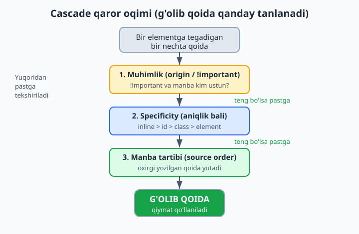
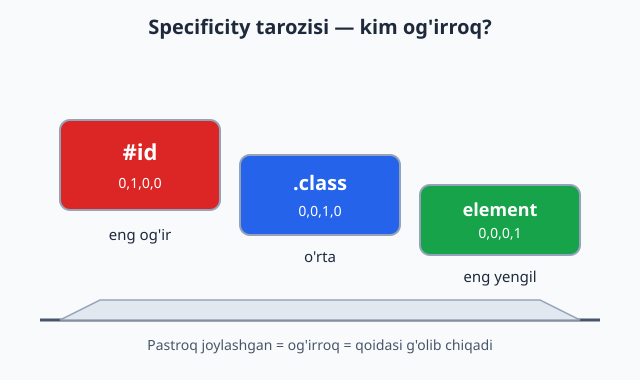
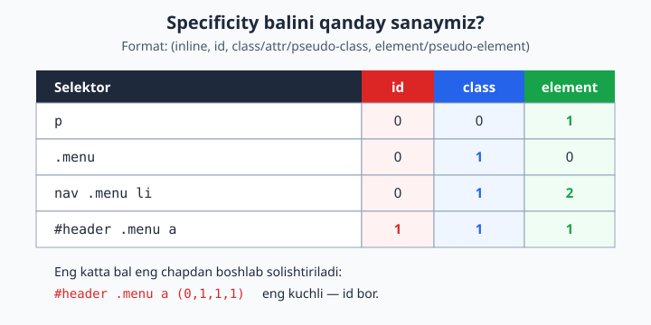
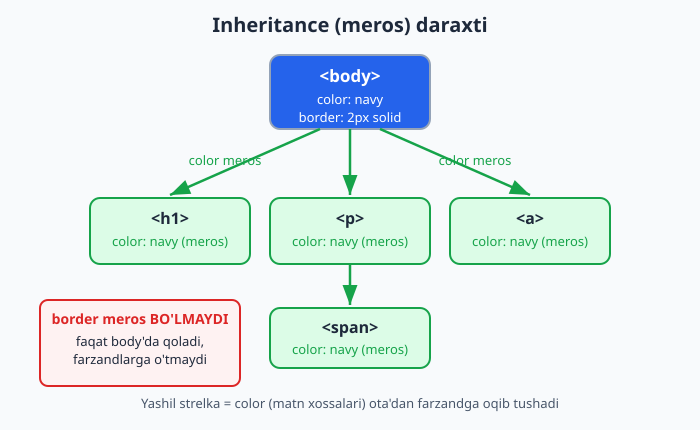

# 10 — Cascade, specificity va inheritance

[⬅️ Oldingi: 09 — Selektorlar](./09-selektorlar.md) · [🏠 README](./README.md) · [Keyingi: 11 — Box model ➡️](./11-box-model.md)

> **Bu bobda:** bir nechta CSS qoidasi bitta elementga teginganda qaysi qoida g'olib chiqishini hal qiladigan uchta mexanizm — kaskad (cascade), aniqlik (specificity) va meros (inheritance) — to'liq o'rganamiz.

---

## 10.1 Nega bu bob "CSS sirlarini" ochadi?

Tasavvur qil: sen `<p>` matniga `color: blue` berding, lekin matn baribir qizil chiqyapti. Yoki bir joyda yozgan stilingiz boshqa joyda "ishlamayapti". Boshlovchilar CSS'ni "injiq" deb o'ylaydi — aslida CSS juda **mantiqiy**. U faqat aniq qoidalar bo'yicha qaysi stil g'olib chiqishini hisoblaydi.

Bu bobning kaliti — bitta savol:

> **Bir elementga bir nechta qoida teginsa, kim yutadi?**

Javob uchta omilga bog'liq: **kaskad** (cascade), **aniqlik** (specificity) va **meros** (inheritance). Bularni tushunsang, CSS endi sehr emas, balki tushunarli tizim bo'lib qoladi. Aynan shu bilim seni boshlovchidan professionalga ajratadi.

📌 **Atamalar tarjimasi:**
- **cascade** — kaskad, ya'ni "sharshara"/"pog'onali oqim". CSS nomi ham shundan: *Cascading* Style Sheets.
- **specificity** — aniqlik, ya'ni selektorning "og'irligi".
- **inheritance** — meros, ya'ni ota elementdan farzandga xossa o'tishi.

---

## 10.2 Cascade nima?

**Cascade** (kaskad) — bu bitta elementga tegadigan barcha qoidalarni ko'rib chiqib, ulardan **g'olibini tanlaydigan** algoritm. "Cascading" so'zi "pog'onali tushish" degani: qoidalar bir nechta bosqichdan o'tadi va har bosqichda saralanadi.

Oddiy misol bilan boshlaylik. Bir xil elementga ikkita rang berdik:

```css
p {
  color: blue;
}
p {
  color: red;
}
```

```html
<p>Bu matn qaysi rangda bo'ladi?</p>
```

**Natija:** matn **qizil** bo'ladi. Nega? Chunki ikkala qoida ham bir xil "og'irlikda" (ikkalasi ham oddiy `p` selektori), shuning uchun cascade **oxirgi yozilganini** tanlaydi. Bu "manba tartibi" (source order) qoidasi — pastda batafsil ko'ramiz.

💡 **Hayotiy analogiya:** navbatda turgan odamlar — agar ikki kishi bir xil maqomda bo'lsa, oxirgi kelgan emas, balki *kuchliroq dalili borgi* o'tadi. Cascade ham xuddi shunday: avval "kim kuchliroq", agar kuch teng bo'lsa "kim oxirgi" deb hal qiladi.

Cascade uchta omilni **shu tartibda** tekshiradi:

1. **Muhimlik** (origin va `!important`) — qoida qayerdan keldi va `!important` bormi?
2. **Specificity** (aniqlik bali) — selektor qanchalik aniq?
3. **Manba tartibi** (source order) — qoida faylda qayerda yozilgan?

Avval birinchi omil hal qiladi. Agar tenglik bo'lsa, keyingisiga o'tadi. Quyidagi diagramma butun oqimni ko'rsatadi:



Endi har bir omilni alohida ochamiz.

---

## 10.3 Birinchi omil: muhimlik (origin va `!important`)

Cascade eng avval qoidaning **muhimligini** (importance) tekshiradi. Muhimlik ikki narsadan iborat: qoida **qayerdan** keldi (origin) va unda `!important` **bormi**.

### Origin — qoida qayerdan keladi?

Brauzer stillarni uch manbadan oladi:

| Manba (origin) | Bu nima | Misol |
|---|---|---|
| **User-agent** | Brauzerning o'z standart stillari | `<h1>` katta va qalin, link ko'k va tagchiziqli |
| **User** | Foydalanuvchining shaxsiy sozlamalari | Foydalanuvchi "katta shrift" rejimini yoqgani |
| **Author** | Sen yozgan CSS (sayt muallifi) | `style.css` faylingdagi qoidalar |

Oddiy holatda ustunlik tartibi (kuchsizdan kuchliga): **user-agent < user < author**. Ya'ni sen yozgan CSS brauzerning standart stilini bemalol bosib o'tadi — shuning uchun `a { color: green }` desang, linklar ko'k emas, yashil bo'ladi.

📌 Ko'pincha sen faqat **author** stillari bilan ishlaysiz, shuning uchun amalda origin haqida kam o'ylaysiz. Lekin u cascade'ning eng birinchi bosqichi ekanini bilib qo'y.

### `!important` — qoidani "majburan g'olib" qilish

Qoida oxiriga `!important` qo'shsang, u **muhimlik bosqichida** boshqalardan ustun chiqadi:

```css
p {
  color: blue !important;
}
p {
  color: red;
}
```

**Natija:** matn **ko'k** bo'ladi — garchi `red` keyin yozilgan bo'lsa ham. `!important` muhimlik bosqichida g'olib bo'lgani uchun, cascade specificity va tartibgacha yetib ham bormaydi.

⚠️ **`!important` bilan bir nozik gap:** u origin tartibini **teskari aylantiradi**. Ya'ni `!important` qo'shilganlar orasida ustunlik: **author `!important` < user `!important`**. Bu foydalanuvchining ehtiyojlarini himoya qilish uchun (masalan, ko'rish qobiliyati cheklangan foydalanuvchi shriftni majburan kattalashtira olishi uchun). Boshlovchi sifatida buni shunchaki "`!important` kuchli" deb eslab qo'ysang bas.

### Nega `!important` dan qochish kerak?

`!important` — bu "atom bomba" tugmasi. U ishlaydi, lekin keyinroq katta muammo tug'diradi:

```css
/* Birovning kodida: */
.tugma {
  background: gray !important;
}

/* Sen yangi rang bermoqchisan: */
.tugma.faol {
  background: green;  /* ISHLAMAYDI! */
}
```

**Natija:** `.tugma.faol` aniqroq selektor bo'lsa ham, ishlamaydi — chunki `!important` muhimlik bosqichida g'olib bo'ladi va specificity bosqichigacha yetib bormaydi. Endi sen ham `!important` qo'shishga majbur bo'lasan, keyin yana kimdir... Bu **"!important urushi"** — kod tobora chigallashadi.

💡 **Maslahat:** `!important` o'rniga **aniqroq selektor** ishlat yoki qoidani to'g'ri tartibda yoz. `!important` ni faqat boshqa iloji bo'lmaganda (masalan, o'zgartira olmaydigan tashqi kutubxona stilini majburan bosishda) ishlat.

---

## 10.4 Ikkinchi omil: specificity (aniqlik bali)

Agar ikki qoida **muhimlik bo'yicha teng** bo'lsa (ikkalasida ham `!important` yo'q, ikkalasi ham author stili), cascade ikkinchi omilga — **specificity** ga o'tadi.

**Specificity** — bu selektorning "og'irligi" yoki "aniqlik bali". Selektor qanchalik aniq nishonni ko'rsatsa, shunchalik kuchli. Mantiq sodda: `#asosiy-sarlavha` aniq bitta elementni ko'rsatadi, `p` esa barcha paragraflarni — shuning uchun aniqroq selektor g'olib bo'lishi adolatli.



### Specificity qanday hisoblanadi?

Specificity **to'rt xonali ball** sifatida tasavvur qilinadi: `(a, b, c, d)`. Har bir tur o'z ustuniga ball qo'shadi:

| Ustun | Nima sanaladi | Misol | Ball |
|---|---|---|---|
| **a** (inline) | `style="..."` atributi | `<p style="color:red">` | `1,0,0,0` |
| **b** (id) | `#id` selektorlari | `#header` | `0,1,0,0` |
| **c** (class/attr/pseudo-class) | `.class`, `[attr]`, `:hover` | `.menu`, `[type="text"]`, `:hover` | `0,0,1,0` |
| **d** (element/pseudo-element) | tag nomi, `::before` | `p`, `div`, `::before` | `0,0,0,1` |

📌 **Muhim nuqtalar:**
- **Universal selektor `*`**, va `:where()` ichidagilar specificity'ga **0** qo'shadi.
- **`:not()`, `:is()`, `:has()`** — ulardan eng kuchli argumenti hisoblanadi (qavslari emas).
- **Inline stil** har qanday selektor-qoidadan kuchli (ustun `a`).

### Ballarni qanday solishtiramiz?

Ballar **eng chap ustundan boshlab** solishtiriladi. Avval `a` (inline), keyin `b` (id), keyin `c` (class), oxirida `d` (element). Birinchi farq qayerda topilsa, o'sha hal qiladi — qolgan ustunlarga qaramaymiz.

Bu **xona-raqamlar** kabi, lekin har ustun mustaqil. Masalan `(0,1,0,0)` har doim `(0,0,9,9)` dan kuchli, chunki id ustunida `1 > 0` — class va element soni nechta bo'lishidan qat'i nazar.

⚠️ **Tez-tez uchraydigan tushunmovchilik:** "11 ta class id'dan kuchlimi?" — YO'Q. `(0,0,11,0)` baribir `(0,1,0,0)` dan **kuchsiz**, chunki id ustunidagi `0 < 1`. Ustunlar bir-biriga "qo'shilib ketmaydi".

### Ball sanash amaliyoti

Quyidagi jadval to'rtta selektorning balini ko'rsatadi:



Endi qo'lda sanab ko'raylik. Quyidagi selektorlarning balini topamiz:

```css
p                  /* element: 1 ta  →  (0,0,0,1) */
.menu              /* class:   1 ta  →  (0,0,1,0) */
nav .menu li       /* element: 2 (nav,li) + class: 1 (.menu)  →  (0,0,1,2) */
#header .menu a    /* id: 1 + class: 1 + element: 1  →  (0,1,1,1) */
```

Bu to'rttasidan **`#header .menu a`** eng kuchli, chunki uning id ustunida `1` bor, boshqalarda `0`.

### Amaliy misol: kim yutadi?

```css
.matn {
  color: blue;      /* (0,0,1,0) */
}
p {
  color: green;     /* (0,0,0,1) */
}
```

```html
<p class="matn">Qaysi rang?</p>
```

**Natija:** matn **ko'k** (`blue`). Nega? `.matn` ning bali `(0,0,1,0)`, `p` ning bali `(0,0,0,1)`. Class ustunida `1 > 0`, shuning uchun `.matn` g'olib — `p` keyin yozilgan bo'lsa ham, ahamiyati yo'q, chunki specificity bosqichida masala hal bo'ldi.

💡 **Asosiy xulosa:** specificity tartibdan **muhimroq**. Manba tartibi faqat specificity teng bo'lgandagina ahamiyatga ega bo'ladi.

---

## 10.5 Uchinchi omil: manba tartibi (source order)

Agar ikki qoida **ham muhimlik, ham specificity bo'yicha teng** bo'lsa, cascade oxirgi omilga keladi: **manba tartibi** (source order). Bu eng sodda qoida:

> **Faylda oxirgi yozilgan qoida g'olib bo'ladi.**

```css
.tugma {
  background: blue;
}
.tugma {
  background: green;   /* g'olib — chunki keyin yozilgan */
}
```

**Natija:** fon **yashil**. Ikkala selektor ham `(0,0,1,0)` — bir xil specificity, hech qaysisida `!important` yo'q. Shuning uchun oxirgisi yutadi.

📌 **"Faylda oxirgi" nimani anglatadi?**
- Bir fayl ichida — pastroqda yozilgani.
- Bir nechta CSS faylda — HTML'da `<link>` keyin ulangan fayl kuchliroq.
- `<style>` blok va tashqi fayl aralashganda — hujjatdagi kelish tartibi bo'yicha.

💡 **Nega bu foydali?** Ko'pchilik CSS kutubxonalari (masalan Bootstrap) shu tamoyilga tayanadi: avval kutubxona stilini ulaysan, keyin o'z `custom.css` faylingni — natijada sening stiling kutubxonanikidan ustun bo'ladi (teng specificity'da). Shuning uchun **o'z faylingni har doim oxirida ula**.

---

## 10.6 Hammasini birlashtirish: to'liq qaror tartibi

Endi cascade'ning to'liq mantig'ini bir joyda jamlaymiz. Bir elementga tegadigan ikki qoida orasidan g'olibni topish uchun cascade **shu tartibda** savol beradi:

1. **Muhimlik teng emasmi?** `!important` borisi yoki kuchliroq origin yutadi. → Hal bo'ldi.
2. **Teng bo'lsa: specificity teng emasmi?** Aniqroq (kattaroq ballik) selektor yutadi. → Hal bo'ldi.
3. **U ham teng bo'lsa: manba tartibi.** Oxirgi yozilgan yutadi.

Bitta to'liq misolda ko'raylik:

```css
p {
  color: green;                 /* (0,0,0,1) */
}
.maqola p {
  color: blue;                  /* (0,0,1,1) */
}
#asosiy .maqola p {
  color: orange;                /* (0,1,1,1) */
}
```

```html
<div id="asosiy">
  <div class="maqola">
    <p>Bu matn qaysi rangda?</p>
  </div>
</div>
```

**Natija:** matn **to'q sariq** (`orange`). Uchala qoidaning hech birida `!important` yo'q (muhimlik teng), shuning uchun specificity solishtiriladi: `(0,1,1,1) > (0,0,1,1) > (0,0,0,1)`. Eng kattasi — `#asosiy .maqola p` — yutadi.

⚠️ **E'tibor ber:** agar qaysidir qoidaga `!important` qo'shsang, bu tartib buziladi. Masalan birinchi `p { color: green !important }` desak, natija **yashil** bo'lardi — chunki `!important` muhimlik bosqichida hammasini bosib o'tadi.

---

## 10.7 Inheritance (meros) nima?

Endi butunlay boshqa mexanizmga o'tamiz. Cascade "bir nechta qoida orasidan g'olibni tanlash" haqida edi. **Inheritance** (meros) esa boshqa savol: agar elementga *hech qanday* qoida tegmasa, u xossani qayerdan oladi?

**Inheritance** — bu ba'zi xossalarning **ota elementdan farzand elementga avtomatik o'tishi**. Ya'ni `<body>` ga `color: navy` bersang, ichidagi barcha matnlar (`<p>`, `<h1>`, `<span>` ...) avtomatik ko'k-qoramtir bo'ladi — sen ularning har biriga alohida rang bermasang ham.

```css
body {
  color: navy;
  font-family: Georgia, serif;
}
```

```html
<body>
  <h1>Sarlavha ham navy</h1>
  <p>Paragraf ham navy, shrifti ham Georgia.</p>
</body>
```

**Natija:** `<h1>` va `<p>` ga umuman tegmadik, lekin ikkalasi ham `navy` rangda va Georgia shriftida chiqadi — `color` va `font-family` **meros bo'ladigan** xossalardir.



💡 **Hayotiy analogiya:** meros — oilaviy familya kabi. Agar bola o'ziga boshqa familya tanlamasa, otasinikini oladi. CSS'da ham: farzand element xossani o'zi belgilamasa, otasinikini "meros" qiladi.

### Nega meros umuman bor?

Meros — qulaylik uchun. Tasavvur qil, har bir `<p>`, `<span>`, `<li>` ga alohida shrift va rang yozishing kerak bo'lsa edi — bu dahshat bo'lardi. Meros tufayli sen `body` ga bir marta yozsang, butun sahifa shu shriftni oladi. **Matn bilan bog'liq xossalar** aynan shuning uchun meros qilinadi.

---

## 10.8 Qaysi xossalar meros bo'ladi, qaysilar yo'q?

Hamma xossalar ham meros bo'lavermaydi. Umumiy qoida sodda va mantiqiy:

> **Matn/tipografiya xossalari meros bo'ladi. Tartib/o'lcham (box) xossalari meros bo'lmaydi.**

| Meros BO'LADI (matn) | Meros BO'LMAYDI (box/tartib) |
|---|---|
| `color` | `margin` |
| `font-family`, `font-size`, `font-weight` | `padding` |
| `line-height`, `letter-spacing` | `border` |
| `text-align` | `width`, `height` |
| `visibility` | `background` |
| `list-style` | `display`, `position` |
| `cursor` | `box-shadow` |

**Nega bunday bo'lingan?** O'ylab ko'r: agar `border` meros bo'lganida, `body` ga ramka qo'ysang, ichidagi *har bir* element ham ramkaga o'ralib qolardi — vahima! Yoki `margin` meros bo'lsa, har bir farzand otasining bo'shlig'ini takrorlab, sahifa buzilib ketardi. Shuning uchun **vizual tartib xossalari ataylab meros qilinmaydi** — har element o'z o'lchamini o'zi nazorat qiladi.

Matn xossalari esa aksincha: ular farzandga "oqib tushgani" tabiiy va foydali.

📌 **Eslatma:** `background` meros bo'lmaydi, lekin ko'p hollarda fon **ko'rinadigandek** tuyuladi — chunki farzand elementlarning foni odatda **shaffof** (`transparent`), shuning uchun otasining foni *o'tib ko'rinadi*. Bu meros emas — shunchaki shaffoflik. Nozik, lekin muhim farq.

---

## 10.9 Meros kalit so'zlari: `inherit`, `initial`, `unset`, `revert`

CSS senga merosni **qo'lda boshqarish** uchun maxsus kalit so'zlar beradi. Bularni har qanday xossaga qiymat sifatida berish mumkin.

### `inherit` — majburan otadan ol

Xossani **majburan** ota elementnikiga tenglashtiradi — meros bo'lmaydigan xossalar uchun ham ishlaydi.

```css
.quticha {
  border: 2px solid;
}
.quticha .ichki {
  border: inherit;   /* normalda border meros bo'lmasdi, lekin majburan oldik */
}
```

**Natija:** `.ichki` element otasining `border` ini oladi — `inherit` buni majburan amalga oshirdi.

### `initial` — standart qiymatga qaytar

Xossani CSS spetsifikatsiyasidagi **boshlang'ich (default) qiymatiga** qaytaradi — ota nima berganidan qat'i nazar.

```css
body { color: navy; }
.maxsus {
  color: initial;   /* navy'ni emas, color'ning standart qiymatini (qora) oladi */
}
```

**Natija:** `.maxsus` matni qora bo'ladi (`color` ning initial qiymati — `canvastext`, amalda qora), garchi otasi `navy` bersa ham.

### `unset` — "aqlli" tiklash

Bu eng aqlli kalit so'z: xossa turiga qarab o'zini tutadi:
- Agar xossa **meros bo'ladigan** bo'lsa (masalan `color`) → `inherit` kabi ishlaydi.
- Agar xossa **meros bo'lmaydigan** bo'lsa (masalan `margin`) → `initial` kabi ishlaydi.

```css
.element {
  color: unset;    /* color meros bo'ladi → otadan oladi (inherit kabi) */
  margin: unset;   /* margin meros bo'lmaydi → standart 0 ga qaytadi (initial kabi) */
}
```

### `revert` — brauzer standartiga qaytar

Sening (author) stilingni olib tashlab, **brauzerning (user-agent) standart stiliga** qaytaradi. `initial` dan farqi: `initial` CSS spetsifikatsiya qiymatiga, `revert` esa brauzer qiymatiga qaytaradi.

```css
h1 { font-size: 12px; }   /* h1 ni kichraytirdik */
.asl {
  font-size: revert;      /* brauzerning katta h1 standartiga qaytadi */
}
```

**Natija:** `<h1 class="asl">` brauzerning odatdagi katta sarlavha o'lchamini tiklaydi.

💡 **Qisqacha farqi:**

| Kalit so'z | Nimaga qaytaradi |
|---|---|
| `inherit` | Otaning qiymatiga |
| `initial` | CSS spetsifikatsiya standartiga (ko'pincha "bo'sh"/0/qora) |
| `unset` | Meros bo'lsa otaga, bo'lmasa initial'ga |
| `revert` | Brauzerning (user-agent) standartiga |

---

## 10.10 Amaliyot: specificity urushlaridan qanday qochish kerak?

Endi nazariyani amaliy hikmatga aylantiraylik. "Specificity urushi" — bu kodda selektorlar tobora kuchliroq bo'lib boravergan holat: kimdir `.tugma` yozadi, keyin uni bosish uchun boshqa kimdir `.panel .tugma` yozadi, keyin `#sahifa .panel .tugma`... oxir-oqibat hech kim hech narsani o'zgartira olmay qoladi. Mana qanday qochish kerak:

**1. Past va tekis specificity ishlat.** Imkon qadar **bitta class** bilan ishla. `.karta__sarlavha` kabi class `header .karta h2` kabi uzun zanjirdan ancha yaxshi — chunki uni keyinroq oson bosib o'tasan.

```css
/* Yomon — yuqori, qattiq specificity (0,1,2,1) */
#sahifa .panel .tugma span { color: white; }

/* Yaxshi — past, tekis specificity (0,0,1,0) */
.tugma__matn { color: white; }
```

**2. `id` ni stil uchun ishlatma.** `#id` ning specificity'si juda yuqori `(0,1,0,0)` va uni faqat boshqa id yoki `!important` bosa oladi. ID'ni JavaScript va anchor (`#bo'lim`) uchun qoldir, stilni class bilan ber.

**3. `!important` dan qoch.** 10.3 da ko'rganimizdek, u keyin "important urushi" ga olib keladi. Faqat tashqi kutubxonani majburan o'zgartirishda, oxirgi chora sifatida ishlat.

**4. Manba tartibidan foydalan.** Teng specificity'da oxirgi qoida yutadi. Shuning uchun o'z stillaringni to'g'ri tartibda yozsang, specificity'ni oshirmasdan ham g'olib chiqasan. **O'z faylingni har doim oxirida ula.**

**5. `:where()` bilan specificity'ni nolga tushir.** Agar qayta yozish oson bo'lishini istasang, `:where()` ichidagi hamma narsa specificity'ga `0` qo'shadi:

```css
:where(.menu) a { color: blue; }   /* bali (0,0,0,0) — keyin osongina bosiladi */
```

💡 **Oltin qoida:** "selektorni mumkin qadar past va tekis tut". Specificity qanchalik past bo'lsa, kodingni boshqarish shunchalik oson — kelajakdagi o'zing senga rahmat aytadi.

---

## Mashqlar

Quyidagi mashqlarni qog'ozda yoki brauzerda (Chrome DevTools'da) sinab ko'r. Avval o'zing javob ber, keyin yechimni och.

### Mashq 1 — Ball sanash

Quyidagi selektorlarning specificity balini `(a,b,c,d)` ko'rinishida yoz:

```css
ul li a
.nav .active
#footer p
input[type="text"]:focus
```

<details markdown="1"><summary>Yechim</summary>

```
ul li a            →  (0,0,0,3)   /* 3 ta element */
.nav .active       →  (0,0,2,0)   /* 2 ta class */
#footer p          →  (0,1,0,1)   /* 1 id + 1 element */
input[type="text"]:focus  →  (0,0,2,1)  /* 1 element + 1 attr + 1 pseudo-class */
```

</details>

### Mashq 2 — Kim yutadi?

Quyidagi kodda matn qaysi rangda bo'ladi? Nega?

```css
p { color: red; }
.matn { color: blue; }
```
```html
<p class="matn">Salom</p>
```

<details markdown="1"><summary>Yechim</summary>

Matn **ko'k** (`blue`) bo'ladi. `.matn` ning bali `(0,0,1,0)`, `p` ning bali `(0,0,0,1)`. Class ustunida `1 > 0`, shuning uchun `.matn` g'olib chiqadi. Manba tartibi (kim oldin yozilgani) bu yerda ahamiyatga ega emas, chunki specificity allaqachon farqni hal qildi.

</details>

### Mashq 3 — `!important` tuzog'i

Bu kodda fon qaysi rangda bo'ladi?

```css
.tugma { background: green !important; }
.tugma { background: red; }
```

<details markdown="1"><summary>Yechim</summary>

Fon **yashil** (`green`) bo'ladi. `red` keyin yozilgan bo'lsa ham, `green` da `!important` bor — u muhimlik bosqichida g'olib chiqadi va cascade specificity yoki tartibgacha yetib ham bormaydi.

⚠️ Bu — `!important` ning xavfini ko'rsatadigan misol: keyinroq fonni o'zgartirmoqchi bo'lsang, yana `!important` qo'shishga majbur bo'lasan.

</details>

### Mashq 4 — Meros bo'ladimi?

Quyidagilardan qaysilari `<body>` dan farzand elementlarga meros bo'ladi: `color`, `margin`, `font-size`, `border`, `text-align`, `width`?

<details markdown="1"><summary>Yechim</summary>

**Meros bo'ladi:** `color`, `font-size`, `text-align` (matn/tipografiya xossalari).

**Meros bo'lmaydi:** `margin`, `border`, `width` (box/tartib xossalari).

Qoida: matn bilan bog'liq xossalar meros bo'ladi, vizual o'lcham va tartib xossalari yo'q — chunki har element o'z o'lchamini o'zi nazorat qilishi kerak.

</details>

### Mashq 5 — To'liq cascade

Bu kodda matn qaysi rangda bo'ladi? Qadamma-qadam tushuntir.

```css
p { color: green; }
.maqola p { color: blue; }
.maqola p { color: purple; }
```
```html
<div class="maqola"><p>Test</p></div>
```

<details markdown="1"><summary>Yechim</summary>

Matn **binafsha** (`purple`) bo'ladi.

1. **Muhimlik:** hech birida `!important` yo'q, hammasi author — teng.
2. **Specificity:** `p` = `(0,0,0,1)`, `.maqola p` = `(0,0,1,1)`. So'nggi ikkalasi tengroq va kuchliroq, `green` tushib qoladi.
3. **Manba tartibi:** ikkita `.maqola p` teng `(0,0,1,1)` — shuning uchun oxirgi yozilgan, ya'ni `purple` yutadi.

</details>

### Mashq 6 — `inherit` bilan tuzatish

`.quticha` ning ichidagi `.ichki` element otasining `border` ini olishini xohlaysan, lekin `border` normalda meros bo'lmaydi. Qanday qilib majburlaysan?

<details markdown="1"><summary>Yechim</summary>

`inherit` kalit so'zi bilan:

```css
.quticha { border: 2px solid navy; }
.quticha .ichki {
  border: inherit;   /* majburan otadan border'ni oladi */
}
```

`inherit` har qanday xossani — meros bo'lmaydiganini ham — otadan majburan oldiradi.

</details>

### Mashq 7 — Specificity urushini tuzatish

Quyidagi selektor juda yuqori specificity'ga ega va keyinroq boshqarish qiyin. Uni **past va tekis** qilib qayta yoz:

```css
#sahifa .panel ul li a.havola { color: teal; }
```

<details markdown="1"><summary>Yechim</summary>

Bitta mazmunli class bilan almashtir (BEM uslubida):

```css
.panel__havola { color: teal; }   /* bali (0,0,1,0) — past va oson bosiladi */
```

Eski bali `(0,1,2,3)` edi — endi `(0,0,1,0)`. Endi bu qoidani keyinroq boshqa bir class bilan osongina bosib o'tish mumkin, `!important` ga ehtiyoj yo'q.

</details>

### Mashq 8 — `unset` xulq-atvori

`.x` elementga `color: unset` va `margin: unset` berildi. Har biri qanday natija beradi? (Ota element `color: navy`, `margin: 20px` bergan.)

<details markdown="1"><summary>Yechim</summary>

- `color: unset` → `color` **meros bo'ladigan** xossa, shuning uchun `inherit` kabi ishlaydi → otadan `navy` ni oladi.
- `margin: unset` → `margin` **meros bo'lmaydigan** xossa, shuning uchun `initial` kabi ishlaydi → standart `0` ga qaytadi (otaning `20px` ini olmaydi).

`unset` "aqlli": xossa turiga qarab `inherit` yoki `initial` kabi yo'l tutadi.

</details>

---

[⬅️ Oldingi: 09 — Selektorlar](./09-selektorlar.md) · [🏠 README](./README.md) · [Keyingi: 11 — Box model ➡️](./11-box-model.md)
