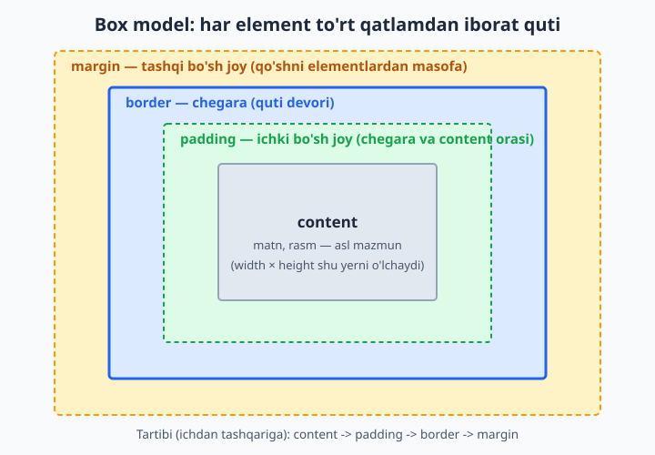
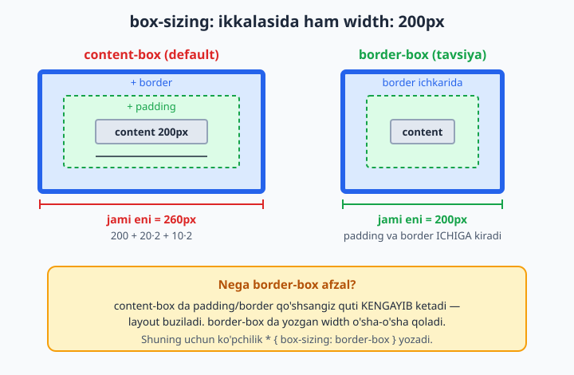
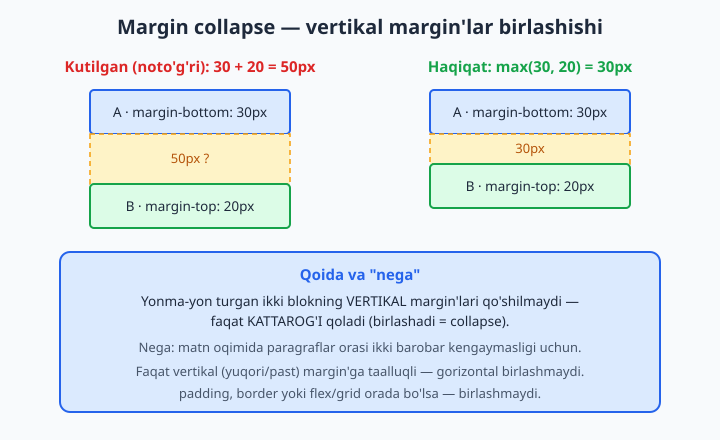
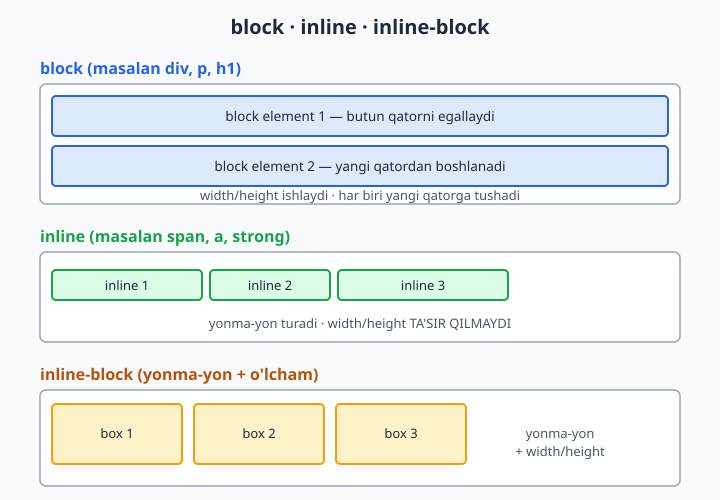

# 11 — Box model

[⬅️ Oldingi: 10 — Cascade, specificity va inheritance](./10-cascade-specificity-inheritance.md) · [🏠 README](./README.md) · [Keyingi: 12 — O'lchovlar, tipografiya va ranglar ➡️](./12-oolchovlar-tipografiya-ranglar.md)

> **Bu bobda:** har bir HTML element aslida to'rt qatlamli quti ekanini (content, padding, border, margin) o'rganib, ularning o'lchami qanday hisoblanishini (`box-sizing`), `margin`/`padding`/`border` qisqa yozuvlarini, margin'lar birlashishini (margin collapse), `display` turlarini (block/inline/inline-block) va `overflow` ni to'liq tushunib olasiz.

---

## 11.1 Asosiy g'oya: har element bir quti

CSS dunyosida eng muhim tushunchalardan biri shu: **brauzer sahifadagi har bir elementni to'rtburchak quti deb ko'radi**. Sarlavha ham, paragraf ham, rasm ham, hatto bitta so'z ham — hammasi quti. Sahifani joylashtirish (layout) — bu shu qutilarni bir-biriga nisbatan tartibga solishdir.

Har bir quti to'rtta qatlamdan iborat. Ichdan tashqariga qarab:

1. **content** (mazmun) — eng ichkaridagi qatlam: matn, rasm yoki boshqa mazmunning o'zi.
2. **padding** (ichki masofa) — content bilan chegara orasidagi bo'sh joy.
3. **border** (chegara) — qutining "devori", ko'rinadigan chiziq.
4. **margin** (tashqi masofa) — quti bilan qo'shni qutilar orasidagi bo'sh joy.



> 💡 **Analogiya:** Devorga osilgan rasmni tasavvur qiling. **content** — rasmning o'zi (surat). **padding** — surat bilan ramka orasidagi oq passe-partout (ichki hoshiya). **border** — yog'och ramka. **margin** — bu rasm bilan yonidagi boshqa rasm orasidagi devordagi bo'sh joy. Aynan shu to'rt qatlam har bir HTML elementda mavjud.

Nega buni avval o'rganamiz? Chunki CSS da masofa, o'lcham va joylashuv bilan bog'liq deyarli har bir muammoning ildizi shu to'rt qatlamda. "Nega bu element kattaroq chiqdi?", "Nega oralarida bo'sh joy bor?", "Nega tugma joyiga sig'maydi?" — bularning javobi har doim box model.

> 📌 Brauzerda istalgan elementni o'ng tugma bilan bosib "Inspect" (tekshirish) ni tanlasangiz, DevTools'ning pastki qismida aynan shu to'rt qatlamli rangli diagrammani ko'rasiz. Bu — sizning eng yaxshi do'stingiz.

---

## 11.2 content: mazmunning o'zi

**content** — qutining yuragi. Bu yerda elementning haqiqiy mazmuni yashaydi: paragrafdagi matn, `` dagi rasm, tugmadagi yozuv.

Content sohasining o'lchamini ikkita asosiy property boshqaradi:

- `width` — content kengligi (eni).
- `height` — content balandligi (bo'yi).

```css
.quti {
  width: 300px;
  height: 150px;
}
```

Bu yerda muhim "nega" bor: **standart holatda `width` va `height` faqat content qatlamini o'lchaydi**, padding va border'ni emas. Ya'ni yuqoridagi quti content jihatidan 300px, ammo unga padding va border qo'shsangiz, ekrandagi *haqiqiy* o'lchami kattaroq bo'ladi. Bu ko'p boshlovchini chalg'itadi — buni `11.6` (box-sizing) bo'limida batafsil hal qilamiz.

> 📌 Aksariyat block elementlarda `width` ni yozmasangiz, u avtomatik ravishda ota-element (parent) eniga **to'liq cho'ziladi**. `height` ni yozmasangiz esa, u mazmunga qarab o'sadi (content qancha bo'lsa, shuncha baland). Shuning uchun ko'pincha `height` ni qo'lda yozmaslik xavfsizroq — matn ko'paysa, quti o'zi o'sadi.

---

## 11.3 padding: ichki bo'sh joy

**padding** — content bilan border orasidagi ichki bo'sh joy. U content'ni chegaradan "itarib" turadi, mazmunga "nafas olish" maydoni beradi.

Padding'ning eng muhim xususiyati: u **elementning fon rangini (background) oladi**. Ya'ni padding qo'shsangiz, fon ham kengayadi. Bu uni margin'dan ajratib turadigan asosiy farq (margin har doim shaffof).

Padding'ni har tomondan alohida boshqarish mumkin:

```css
.karta {
  padding-top: 10px;
  padding-right: 20px;
  padding-bottom: 10px;
  padding-left: 20px;
}
```

Lekin har doim to'rt qatorni yozish zerikarli. Shuning uchun **qisqa yozuv (shorthand)** mavjud — bitta `padding` property orqali. Qiymatlar soniga qarab ma'nosi o'zgaradi:

```css
.a { padding: 20px; }               /* 4 ta tomon ham 20px */
.b { padding: 10px 20px; }          /* yuqori/past 10px, chap/o'ng 20px */
.c { padding: 10px 20px 30px; }     /* yuqori 10, chap/o'ng 20, past 30 */
.d { padding: 10px 20px 30px 40px; }/* yuqori, o'ng, past, chap */
```

Tomonlar tartibini eslab qolishning oson yo'li: **soat strelkasi bo'yicha**, yuqoridan boshlab — yuqori, o'ng, past, chap (ingliz tilida "TRouBLe" — Top, Right, Bottom, Left).

> 💡 **Ikki qiymatli yozuvni eslab qolish:** `padding: 10px 20px` da birinchi son — *vertikal* (yuqori va past), ikkinchi son — *gorizontal* (chap va o'ng). Bu eng ko'p ishlatiladigan ko'rinish: tugmalarda odatda yon padding tepa-pastdagidan kattaroq bo'ladi.

```css
button {
  padding: 8px 16px;   /* tugmaga klassik ko'rinish beradi */
}
```

---

## 11.4 border: chegara (quti devori)

**border** — content va padding atrofidagi ko'rinadigan chiziq, qutining "devori". Border'ning uchta asosiy xususiyati bor va ularning **uchalasi ham yozilishi kerak** (ayniqsa `style`siz border ko'rinmaydi):

- `border-width` — chiziq qalinligi (masalan `2px`).
- `border-style` — chiziq turi (`solid`, `dashed`, `dotted` va h.k.).
- `border-color` — chiziq rangi.

To'liq yozuv:

```css
.quti {
  border-width: 2px;
  border-style: solid;
  border-color: #2563eb;
}
```

Bu juda uzun. Shuning uchun deyarli har doim **qisqa yozuv** ishlatiladi — uchala qiymatni bitta qatorda berasiz:

```css
.quti {
  border: 2px solid #2563eb;   /* qalinlik · turi · rang */
}
```

> ⚠️ **Eng ko'p uchraydigan xato:** `border: 2px #2563eb;` deb `style`ni tushirib qoldirish. `border-style` ning standart qiymati `none` — ya'ni `style` bo'lmasa, **border umuman ko'rinmaydi**, qalinligi va rangi qancha bo'lsa ham. Eng muhim qism — `solid` kabi style.

Eng ko'p ishlatiladigan border style'lar:

| Qiymat | Ko'rinishi |
|--------|-----------|
| `solid` | to'liq, uzluksiz chiziq (eng keng tarqalgan) |
| `dashed` | tirelar (chiziqchalar) |
| `dotted` | nuqtalar |
| `double` | ikki parallel chiziq |
| `none` | border yo'q (standart) |

Faqat bitta tomonga border qo'yish ham mumkin:

```css
.ajratuvchi {
  border-bottom: 1px solid #94a3b8;   /* faqat pastki chiziq */
}
```

Va burchaklarni yumaloqlash uchun `border-radius`:

```css
.karta {
  border: 1px solid #94a3b8;
  border-radius: 8px;    /* yumshoq, zamonaviy burchaklar */
}
```

> 💡 `border-radius: 50%` ni kvadrat (eni = bo'yi) elementga bersangiz — to'liq **doira** chiqadi. Bu avatarka (profil rasmi) ni doira qilishning klassik usuli.

---

## 11.5 margin: tashqi bo'sh joy va markazlash

**margin** — qutining tashqi qatlami: bu quti bilan **qo'shni qutilar** orasidagi bo'sh joy. U elementlarni bir-biridan uzoqlashtiradi.

Margin'ning padding'dan asosiy farqi: **margin har doim shaffof** — uning foni yo'q. U shunchaki "bo'shliq" yaratadi.

Sintaksis padding bilan **bir xil** — qisqa yozuv ham aynan o'sha qoidalarga bo'ysunadi:

```css
.a { margin: 20px; }                /* 4 tomon ham 20px */
.b { margin: 10px 20px; }           /* vertikal 10px, gorizontal 20px */
.c { margin: 10px 20px 30px 40px; } /* yuqori, o'ng, past, chap */
```

Alohida tomonlar: `margin-top`, `margin-right`, `margin-bottom`, `margin-left`.

### margin: auto bilan markazlash

Margin'ning eng foydali hiylasi — **blok elementni gorizontal markazlash**. Buning uchun elementga aniq `width` berib, chap va o'ng margin'ni `auto` qilasiz:

```css
.markaz {
  width: 600px;
  margin: 0 auto;    /* vertikal 0, gorizontal auto */
}
```

**Nega bu ishlaydi?** `auto` brauzerga "qolgan bo'sh joyni teng taqsimla" deydi. Element 600px, ota-element undan keng bo'lsa, ortgan joy chap va o'ngga teng bo'linadi — natijada element o'rtada turadi.

> ⚠️ `margin: 0 auto` markazlash **faqat `width` berilgan block element**da ishlaydi. Agar `width` bermasangiz, element allaqachon to'liq enni egallaydi — markazlash uchun "ortiqcha joy" qolmaydi. Shuningdek, bu hiyla vertikal markazlashda ishlamaydi (vertikal markazlash uchun keyingi boblarda flexbox'ni ko'ramiz).

> 💡 Manfiy margin ham mumkin (`margin-top: -10px`) — u elementni qo'shni element ustiga "tortadi". Bu kuchli, lekin chalkash usul; boshda undan qochgan ma'qul.

---

## 11.6 box-sizing: content-box va border-box

Endi `11.2` da aytilgan muammoga qaytamiz. Savol: agar elementga `width: 200px` bersam, ekranda u **aynan 200px** bo'ladimi?

Standart holatda — **yo'q**. Buning sababi `box-sizing` degan property bo'lib, uning standart qiymati `content-box`.



### content-box (standart)

`box-sizing: content-box` da `width` va `height` faqat **content** qatlamini o'lchaydi. Padding va border esa shunga **qo'shiladi**:

```css
.quti {
  box-sizing: content-box;   /* standart */
  width: 200px;
  padding: 20px;
  border: 10px solid #2563eb;
}
```

Ekrandagi **haqiqiy eni:**

```
200px (content) + 20px·2 (padding) + 10px·2 (border) = 260px
```

Ya'ni `200px` so'radingiz, lekin `260px` oldingiz! Bu layout'ni kutilmaganda buzadi.

### border-box (tavsiya etiladi)

`box-sizing: border-box` da `width` **butun qutini** o'lchaydi — padding va border shu o'lcham **ichiga kiradi**:

```css
.quti {
  box-sizing: border-box;
  width: 200px;
  padding: 20px;
  border: 10px solid #2563eb;
}
```

Ekrandagi **haqiqiy eni:**

```
200px — aynan o'zi. Content avtomatik kichrayadi: 200 - 20·2 - 10·2 = 140px
```

**Nega border-box afzal?** Chunki u tabiiyroq: yozgan `width` ekrandagi o'lcham bilan teng bo'ladi. Padding yoki border qo'shganda quti kengayib ketmaydi, layout buzilmaydi. Hisob-kitob soddalashadi.

Aynan shu sababdan deyarli har bir zamonaviy loyiha CSS faylining boshida shu qoidani yozadi:

```css
*, *::before, *::after {
  box-sizing: border-box;
}
```

`*` (universal selector) "barcha elementlar" degani. Bu bir qatorda butun saytni `border-box` ga o'tkazadi.

> 💡 Buni "bir marta yozib qo'yiladigan va keyin unutiladigan" sozlama deb biling. Tajribali dasturchilarning aksariyati har yangi loyihada shu uch qatorni avtomatik yozadi.

---

## 11.7 Margin collapse: vertikal margin'lar birlashishi

Bu — boshlovchilarni eng ko'p hayron qoldiradigan mavzulardan biri. Diqqat bilan ko'ring.

Tasavvur qiling: ikkita paragraf bir-birining ostida turibdi. Birinchisida `margin-bottom: 30px`, ikkinchisida `margin-top: 20px`. Mantiqan ular orasidagi masofa `30 + 20 = 50px` bo'lishi kerakdek. Lekin **aslida 30px** chiqadi!



Bu hodisa **margin collapse** (margin'lar birlashishi) deb ataladi: yonma-yon turgan ikki block elementning **vertikal** (yuqori va past) margin'lari qo'shilmaydi — ularning faqat **kattarog'i** qoladi.

```html
<p class="birinchi">Birinchi paragraf</p>
<p class="ikkinchi">Ikkinchi paragraf</p>
```

```css
.birinchi { margin-bottom: 30px; }
.ikkinchi { margin-top: 20px; }
/* Ular orasidagi masofa: max(30, 20) = 30px, 50px EMAS */
```

**Nega CSS bunday qiladi?** Tarixiy sabab matn hujjatlaridan keladi. Agar har bir paragraf tepa va pastdan margin bersa va ular qo'shilib ketsa, paragraflar orasidagi masofa ikki barobar ortib ketardi va matn siyrak ko'rinardi. Birlashish (collapse) bu masofani bir tekis va kutilgan holda saqlaydi.

### Muhim cheklovlar

Margin collapse **faqat** quyidagi shartlarda yuz beradi:

- Faqat **vertikal** margin'larda (yuqori/past). Gorizontal (chap/o'ng) margin'lar **hech qachon birlashmaydi** — har doim qo'shiladi.
- Faqat normal oqimdagi (normal flow) block elementlarda.

Birlashishni **to'xtatadigan** narsalar (orada to'siq bo'lsa, margin'lar birlashmaydi):

- Ikki margin orasida **border** yoki **padding** bo'lsa.
- Ota-element `display: flex` yoki `display: grid` bo'lsa (flex/grid bolalarida margin collapse yo'q).
- `overflow` qiymati `visible` dan boshqa bo'lsa.

> ⚠️ Bola element margin'i ota-element margin'i bilan ham birlashishi mumkin (masalan, birinchi bolaning `margin-top` i ota'ning `margin-top` i bilan "qochib chiqadi"). Agar ota-elementga `padding-top` yoki `border-top` qo'shsangiz, bu hodisa to'xtaydi. Bu — "nega blok ichidagi margin tashqariga oqib ketdi?" degan jumboqning yechimi.

---

## 11.8 display: block, inline va inline-block

Elementlar qutidek joylashadi, dedik — lekin **qanday** joylashadi? Buni `display` property boshqaradi. Eng asosiy uch qiymatni ko'rib chiqamiz.



### block

**block** elementlar to'liq bitta qatorni egallaydi va har biri **yangi qatordan** boshlanadi (xuddi matndagi yangi xatboshi kabi). Standart block elementlar: `<div>`, `<p>`, `<h1>`–`<h6>`, `<ul>`, `<li>`, `<section>`.

- `width` va `height` ishlaydi (qo'lda berish mumkin).
- `width` bermasangiz — to'liq enni egallaydi.
- Yuqori/pastki margin ham, padding ham to'liq ishlaydi.

### inline

**inline** elementlar matn oqimi ichida **yonma-yon** turadi, yangi qator boshlamaydi. Standart inline elementlar: `<span>`, `<a>`, `<strong>`, `<em>`.

> 📌 **Istisno — replaced elementlar:** ``, `<video>`, `<input>` ham inline joylashadi, lekin ular *replaced* (almashtirilgan) element — ularda quyidagidan farqli ravishda `width`/`height` **ishlaydi**. Pastdagi qoidalar oddiy (matnli) inline elementlarga tegishli.

- `width` va `height` **ta'sir qilmaydi** — element mazmuni qanchaga sig'sa, shuncha joy oladi.
- Yuqori/pastki margin va padding **layout'ga to'liq ta'sir qilmaydi** (vizual padding ko'rinishi mumkin, lekin qo'shni qatorlarni surmaydi).
- Faqat chap/o'ng (gorizontal) margin va padding qatorni suradi.

```html
<p>Bu matnda <strong>qalin so'z</strong> va <a href="#">havola</a> yonma-yon.</p>
```

> 📌 `<strong>` ga `width: 200px` bersangiz — hech narsa o'zgarmaydi, chunki u inline. Bu boshlovchilarni ko'p chalg'itadi: "nega width ishlamayapti?" Javob: element inline.

### inline-block

**inline-block** — ikkalasining "eng yaxshi" tomonini birlashtiradi:

- inline kabi **yonma-yon** turadi (yangi qator boshlamaydi).
- block kabi `width`, `height`, vertikal margin va padding'ni **qabul qiladi**.

Bu navbar tugmalari, "karta" (card) qatorlari kabi yonma-yon turishi kerak bo'lgan, ammo o'lchami nazorat qilinadigan elementlar uchun klassik yechim:

```css
.tugma {
  display: inline-block;
  width: 120px;
  padding: 10px;
  margin: 5px;
}
```

| Xususiyat | `block` | `inline` | `inline-block` |
|-----------|:-------:|:--------:|:--------------:|
| Yangi qatordan boshlanadi | Ha | Yo'q | Yo'q |
| `width` / `height` ishlaydi | Ha | Yo'q | Ha |
| Vertikal margin/padding qatorga ta'sir qiladi | Ha | Yo'q | Ha |

> 💡 Bugungi kunda ko'plab yonma-yon joylashuvlar uchun `inline-block` o'rniga **flexbox** yoki **grid** ishlatiladi (keyingi boblarda). Lekin `inline-block` hamon foydali va `display` turlari farqini tushunish layout asoslarining poydevori.

---

## 11.9 overflow: mazmun sig'masa nima bo'ladi?

Ba'zan content qutiga **sig'maydi** — masalan, `height` ni belgilab qo'ydingiz, ammo matn undan ko'p. Bunda nima bo'lishini `overflow` property hal qiladi.

```css
.quti {
  width: 200px;
  height: 100px;
  overflow: auto;
}
```

To'rtta asosiy qiymat:

| Qiymat | Xatti-harakat |
|--------|--------------|
| `visible` | **Standart.** Ortiqcha mazmun qutidan **tashqariga toshib** ko'rinaveradi. |
| `hidden` | Ortiqcha mazmun **kesib tashlanadi** (ko'rinmaydi), scroll yo'q. |
| `scroll` | **Har doim** scrollbar chiqadi (mazmun sig'sa ham). |
| `auto` | Scrollbar **faqat kerak bo'lganda** (mazmun sig'masada) chiqadi. |

**Nega `visible` standart?** Chunki CSS mazmunni hech qachon "yo'qotmaslik" tarafdori — sukut bo'yicha hammasini ko'rsatadi, hatto bu qutidan tashib chiqsa ham. Mazmunni yashirish — bu sizning ataylab qiladigan tanlovingiz.

> 💡 **`auto` vs `scroll`:** Amalda deyarli har doim `auto` afzal — chunki `scroll` mazmun kam bo'lsa ham bo'sh, xunuk scrollbar ko'rsatadi. `auto` esa faqat zarur bo'lganda chiqaradi.

Gorizontal va vertikalni alohida boshqarish ham mumkin: `overflow-x` (gorizontal) va `overflow-y` (vertikal).

> ⚠️ `overflow: hidden` mazmunni jimgina kesib tashlaydi — foydalanuvchi uni ko'ra olmaydi va scroll ham qila olmaydi. Agar matn tasodifan kesilib qolsa, sababini shu yerdan qidiring.

---

## 11.10 width nazorati: min-width va max-width

Oddiy `width` aniq, qat'iy o'lcham beradi. Lekin zamonaviy, ekranga moslashadigan (responsive) saytlarda ko'pincha **chegaralangan** o'lcham kerak bo'ladi. Buning uchun uchta property bor:

- `width` — afzal ko'rilgan (maqsadli) eni.
- `min-width` — **eng kichik** ruxsat etilgan eni (bundan kichrayolmaydi).
- `max-width` — **eng katta** ruxsat etilgan eni (bundan kattalashmaydi).

Eng ko'p ishlatiladigan naqsh:

```css
.kontent {
  width: 100%;        /* iloji boricha to'liq enni egalla */
  max-width: 800px;   /* lekin 800px dan oshma */
  margin: 0 auto;     /* va markazda tur */
}
```

**Nega bu juda foydali?** Bu element kichik ekranlarda (telefon) butun enni egallaydi, katta ekranlarda (monitor) esa 800px da to'xtaydi va markazda turadi. Natijada matn juda keng, o'qishga noqulay qatorlar bo'lib ketmaydi. Bu — responsive dizaynning eng asosiy hiylalaridan biri.

`min-width` esa elementni juda kichrayib, mazmun siqilib qolishidan saqlaydi:

```css
.yon-panel {
  min-width: 250px;   /* hech qachon 250px dan ingichka bo'lmasin */
}
```

> 📌 `height` uchun ham `min-height` va `max-height` bor va xuddi shunday ishlaydi. Amalda `min-height` ko'proq ishlatiladi (masalan `min-height: 100vh` — sahifa butun ekran balandligida bo'lsin).

> 💡 **Ustuvorlik:** agar `width` va `max-width` zid bo'lsa, `max-width` g'olib chiqadi. Tartib: `min-width` har narsadan kuchli (oxirgi so'z uniki), keyin `max-width`, keyin `width`. Ya'ni element hech qachon `min-width` dan kichik bo'lmaydi, hatto `max-width` past bo'lsa ham.

---

## Mashqlar

> Quyidagi mashqlarni bajarib, box model'ni qo'lingiz bilan his qiling. Har biri uchun yangi `.html` fayl yarating, brauzerda oching va DevTools'dagi box diagrammasi bilan solishtiring.

### Mashq 1 — Haqiqiy o'lchamni hisoblang

Quyidagi quti `content-box` (standart) rejimida. Uning ekrandagi **haqiqiy eni** necha piksel?

```css
.quti {
  width: 300px;
  padding: 25px;
  border: 5px solid black;
}
```

<details markdown="1"><summary>Yechim</summary>

`content-box` da `width` faqat content. Padding va border qo'shiladi:

```
300 (content) + 25·2 (padding) + 5·2 (border) = 360px
```

Haqiqiy eni — **360px**. Agar `box-sizing: border-box` bo'lganida, haqiqiy eni aynan **300px** bo'lar, content esa 240px ga kichrayar edi.

</details>

### Mashq 2 — border-box ga o'tkazing

Bir loyiha boshlayapsiz. Har bir elementga `box-sizing: border-box` ni qo'llaydigan bitta CSS qoidasini yozing.

<details markdown="1"><summary>Yechim</summary>

```css
*, *::before, *::after {
  box-sizing: border-box;
}
```

`*` — barcha elementlar. `::before` va `::after` — psevdo-elementlar (keyingi boblarda batafsil), ularni ham qamrab olamiz. Bu qatorni har yangi loyiha boshida yozish odat.

</details>

### Mashq 3 — Qisqa yozuvni o'qing

Quyidagi har bir e'lon to'rt tomonga qaysi qiymatni beradi? (yuqori / o'ng / past / chap)

```css
.a { padding: 15px; }
.b { padding: 10px 30px; }
.c { padding: 5px 10px 15px 20px; }
```

<details markdown="1"><summary>Yechim</summary>

- `.a` — yuqori **15**, o'ng **15**, past **15**, chap **15** (bitta qiymat = 4 tomon).
- `.b` — yuqori **10**, o'ng **30**, past **10**, chap **30** (vertikal / gorizontal).
- `.c` — yuqori **5**, o'ng **10**, past **15**, chap **20** (soat strelkasi bo'yicha).

</details>

### Mashq 4 — Blokni markazlang

Eni 500px bo'lgan `<div class="karta">` ni sahifa o'rtasiga (gorizontal markaz) joylashtiring.

<details markdown="1"><summary>Yechim</summary>

```css
.karta {
  width: 500px;
  margin: 0 auto;
}
```

`width` berilishi shart — aks holda div to'liq enni egallaydi va markazlash uchun bo'sh joy qolmaydi. `margin: 0 auto` da vertikal margin 0, gorizontal `auto` (qolgan joyni teng bo'ladi).

</details>

### Mashq 5 — Margin collapse jumbog'i

Quyidagi ikki paragraf orasidagi masofa necha piksel?

```css
.p1 { margin-bottom: 40px; }
.p2 { margin-top: 25px; }
```

<details markdown="1"><summary>Yechim</summary>

**40px.** Vertikal margin'lar birlashadi (collapse): qo'shilmaydi (`40 + 25 = 65` EMAS), faqat kattarog'i — `max(40, 25) = 40px` — qoladi. Agar orada border yoki padding bo'lganida, ular birlashmasdi va masofa 65px bo'lardi.

</details>

### Mashq 6 — Border nima uchun ko'rinmayapti?

Dasturchi border qo'ydi, lekin u ko'rinmayapti. Xatoni toping va tuzating.

```css
.quti {
  border: 3px #2563eb;
}
```

<details markdown="1"><summary>Yechim</summary>

`border-style` tushib qolgan. `style` ning standart qiymati `none` — shuning uchun border ko'rinmaydi. To'g'risi:

```css
.quti {
  border: 3px solid #2563eb;
}
```

`solid` (yoki `dashed`, `dotted` va h.k.) — border'ning eng muhim qismi. Qalinlik va rang yetarli emas.

</details>

### Mashq 7 — display turini tanlang

Uchta tugmani **yonma-yon** joylashtirmoqchisiz, lekin har biriga aniq `width: 100px` va `padding` ham bermoqchisiz. Bu tugmalar `<span>` (inline) elementlari. Qaysi `display` qiymatini ishlatasiz va nega?

<details markdown="1"><summary>Yechim</summary>

`display: inline-block` ni ishlatasiz.

```css
.tugma {
  display: inline-block;
  width: 100px;
  padding: 10px;
}
```

**Nega:** oddiy `inline` (span'ning standarti) `width` va vertikal padding'ni qabul qilmaydi. `block` esa har birini yangi qatorga tushiradi — yonma-yon turmaydi. `inline-block` ikkala talabni ham bajaradi: yonma-yon turadi va o'lcham/padding'ni qabul qiladi.

</details>

### Mashq 8 — Responsive kontent konteyneri

Matn juda keng monitorlarda o'qishga noqulay bo'lib ketmasligi uchun, kontentni: kichik ekranda to'liq enga, katta ekranda eng ko'pi 700px ga cheklab, doim markazda turadigan qilib yozing.

<details markdown="1"><summary>Yechim</summary>

```css
.kontent {
  width: 100%;
  max-width: 700px;
  margin: 0 auto;
  padding: 0 16px;   /* chetlarga ozgina nafas — ekran tor bo'lsa matn devorga yopishmaydi */
}
```

`width: 100%` telefonda to'liq enni egallaydi; `max-width: 700px` katta ekranda 700px da to'xtaydi; `margin: 0 auto` markazlaydi. Bu — eng ko'p ishlatiladigan responsive layout naqshlaridan biri.

</details>

### Mashq 9 — overflow bilan scroll soha

Balandligi 150px bo'lgan, ichida ko'p matn turadigan "izohlar" qutisini yarating. Matn sig'masa, **faqat kerak bo'lganda** vertikal scroll chiqsin.

<details markdown="1"><summary>Yechim</summary>

```css
.izohlar {
  height: 150px;
  overflow-y: auto;     /* faqat kerak bo'lsa vertikal scroll */
  border: 1px solid #94a3b8;
  padding: 12px;
}
```

`auto` ni tanladik (`scroll` emas), chunki matn kam bo'lsa, bo'sh scrollbar chiqmaydi — faqat haqiqatan toshganda paydo bo'ladi. `overflow-y` faqat vertikalni boshqaradi.

</details>

---

[⬅️ Oldingi: 10 — Cascade, specificity va inheritance](./10-cascade-specificity-inheritance.md) · [🏠 README](./README.md) · [Keyingi: 12 — O'lchovlar, tipografiya va ranglar ➡️](./12-oolchovlar-tipografiya-ranglar.md)
