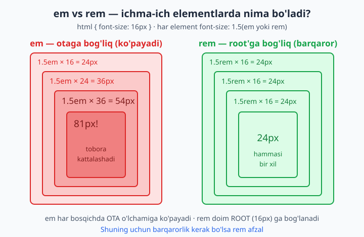
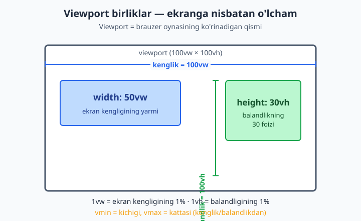
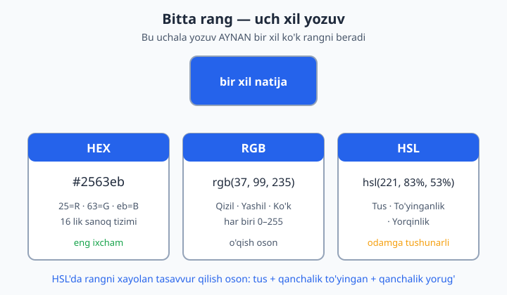
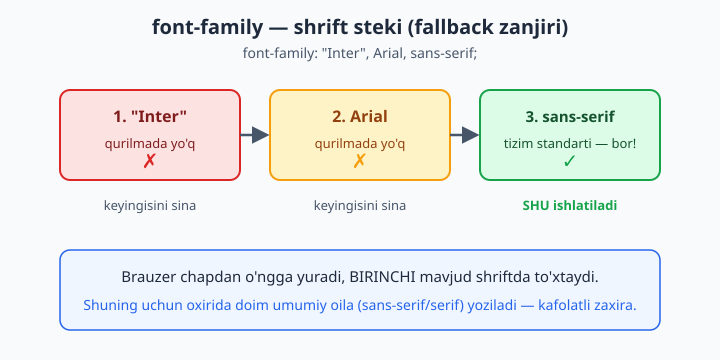
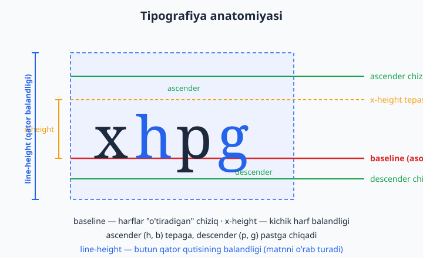

# 12 — O'lchovlar, tipografiya va ranglar

[⬅️ Oldingi: 11 — Box model](./11-box-model.md) · [🏠 README](./README.md) · [Keyingi: 13 — Fon, chegara va soyalar ➡️](./13-fon-chegara-soyalar.md)

> **Bu bobda:** CSS o'lchov birliklari (px, em, rem, %, vw/vh va boshqalar), rang modellari (nomli, hex, rgb, hsl, oklch) va matnni boshqaradigan tipografiya xossalari hamda web shriftlarni to'liq, "nega"si bilan o'rganamiz.

---

## 12.1 Nega aynan bu uchta mavzu birga?

Bu uch narsa — **o'lcham**, **rang** va **shrift** — har bir web sahifaning "ko'rinishini" tashkil qiladi. Element qanchalik katta? Qaysi rangda? Matn qanday shriftda va qancha kattalikda? Boshqa hamma narsa (joylashuv, animatsiya, responsiv dizayn) shu uch poydevorga quriladi.

Boshlovchilar ko'pincha shoshib `px` (piksel) bilan hamma narsani yozadi, ranglarni faqat `red`/`blue` deb beradi va `font-family` ni umuman tegmaydi. Natijada sayt har xil ekranda buziladi, ranglar palitrasi tartibsiz bo'ladi, matn esa "import qilingan" emas, "tashlangandek" ko'rinadi. Bu bob seni shu xatolardan qutqaradi va **professional tanlovlar** qilishni o'rgatadi.

📌 **Atamalar tarjimasi:**
- **unit** — birlik (o'lchov birligi), masalan `px`, `em`.
- **viewport** — ko'rinish maydoni, ya'ni brauzer oynasining ko'rinadigan qismi.
- **typography** — tipografiya, ya'ni matnni bezash va joylashtirish san'ati.
- **font** — shrift (harflar uslubi).

Keling, eng asosidan — o'lchov birliklaridan boshlaymiz.

---

## 12.2 Mutlaq vs nisbiy birliklar

CSS'da o'lchov beradigan har bir joyda (kenglik, balandlik, shrift o'lchami, masofa va h.k.) son yoniga **birlik** yozasan: `16px`, `2em`, `50%`. Birliklar ikki katta turga bo'linadi:

- **Mutlaq (absolute) birliklar** — qiymati har doim bir xil, hech narsaga bog'liq emas. Asosiysi: `px`.
- **Nisbiy (relative) birliklar** — qiymati **boshqa narsaga** nisbatan hisoblanadi (ota element shrifti, root shrifti, ekran o'lchami va h.k.). Masalan: `em`, `rem`, `%`, `vw`.

💡 **Hayotiy analogiya:** "10 metr" — mutlaq, qayerda aytsang ham bir xil. "Bo'yimning yarmi" — nisbiy, kimning bo'yi ekaniga bog'liq. CSS'da mutlaq birlik aniq va oldindan ma'lum, nisbiy birlik esa moslashuvchan.

**Nega nisbiy birliklar muhim?** Chunki ular **moslashuvchanlik** (flexibility) beradi. Foydalanuvchi brauzerda shrift o'lchamini kattalashtirsa yoki sayt katta/kichik ekranda ochilsa, nisbiy birliklar avtomatik moslashadi. Mutlaq `px` esa qotib qoladi. Shuning uchun zamonaviy CSS'da nisbiy birliklar afzal — buni bob davomida bir necha bor ko'ramiz.

---

## 12.3 px — mutlaq piksel

`px` (piksel) — eng mashhur va eng tushunarli birlik. U ekrandagi bitta nuqtaga (taxminan) teng.

```css
.quti {
  width: 200px;
  height: 100px;
  font-size: 16px;
  border: 1px solid black;
}
```

**Natija:** quti aniq 200×100 piksel, matn 16 pikselli, chegara 1 pikselli.

`px` ning **kuchi** — to'liq nazorat va bashorat qilinishi. "1px chegara" har joyda 1px bo'ladi. Shu sababli ingichka chegaralar, kichik soyalar va aniq joylashuv kerak bo'lganda `px` ajoyib.

`px` ning **kamchiligi** — u moslashmaydi. Agar `font-size: 16px` desang va foydalanuvchi brauzer sozlamalarida "katta shrift" tanlagan bo'lsa (masalan ko'zi xira odam), sening matning **baribir 16px** qoladi. Bu — qulaylik (accessibility) muammosi.

⚠️ **Tez-tez xato:** matn o'lchamlarini hamma joyda `px` bilan berish. Bu foydalanuvchining shrift kattalashtirish imkonini buzadi. Matn uchun `rem` ishlat (pastda ko'ramiz).

📌 **Eslatma:** CSS `px` — bu "CSS pikseli", jismoniy ekran pikseli emas. Yuqori zichlikdagi (Retina) ekranlarda bitta CSS px bir nechta jismoniy pikseldan iborat bo'lishi mumkin — brauzer buni o'zi hal qiladi, sen tashvishlanma.

---

## 12.4 em — ota elementning font-size'iga nisbatan

`em` — bu **nisbiy** birlik. `1em` = element o'zining (yoki ko'p hollarda otasining) `font-size` qiymatiga teng.

Asosiy qoida:
- `font-size` xossasida `em` ishlatilsa → u **ota element**ning `font-size`'iga nisbatan hisoblanadi.
- Boshqa xossalarda (masalan `padding`, `margin`, `width`) `em` ishlatilsa → u **shu elementning** `font-size`'iga nisbatan hisoblanadi.

```css
.ota {
  font-size: 20px;
}
.farzand {
  font-size: 1.5em;   /* 1.5 × 20px = 30px */
  padding: 1em;       /* 1 × 30px = 30px (o'zining font-size'i) */
}
```

**Natija:** `.farzand` matni 30px, ichki bo'shliq (padding) ham 30px.

`em` ning kuchi — komponent ichida hamma narsa shrift o'lchamiga **mutanosib** o'sadi. Tugmaning `font-size`'ini o'zgartirsang, uning `padding`'i ham `em`da berilgan bo'lsa, avtomatik moslashadi. Bu tugmalar, beyjlar (badge) kabi "ichki nisbat saqlanishi kerak" bo'lgan komponentlar uchun zo'r.

### em ning xavfi: ko'payib ketish (kompaundlanish)

`em` ning eng katta tuzog'i — **ichma-ich (nested) elementlarda** u qatlam-qatlam ko'payib ketadi. Har bir farzand otasining (allaqachon kattalashgan) o'lchamiga nisbatan hisoblaganligi uchun, qiymat tobora o'sib boradi:

```html
<div class="daraja">24px (16×1.5)
  <div class="daraja">36px (24×1.5)
    <div class="daraja">54px (36×1.5)
      <div class="daraja">81px! (54×1.5)</div>
    </div>
  </div>
</div>
```

```css
html { font-size: 16px; }
.daraja { font-size: 1.5em; }
```

**Natija:** har daraja oldingisidan 1.5 baravar katta — 24 → 36 → 54 → 81px. Bu deyarli har doim **xato** — sen barcha `.daraja`larni bir xil kattalikda kutgan eding. Quyidagi diagramma buni `rem` bilan solishtirib ko'rsatadi:



---

## 12.5 rem — root font-size'iga nisbatan (va nega afzal)

`rem` = "**r**oot **em**". U doim **bitta** narsaga — hujjatning ildiz elementi `<html>` ning `font-size`'iga nisbatan hisoblanadi. Ota element nima bo'lishidan **qat'i nazar**.

Brauzerda `<html>` ning standart `font-size`'i odatda **16px**. Demak:

```css
html { font-size: 16px; }   /* root: 16px (standart) */

h1   { font-size: 2rem;  }  /* 2  × 16 = 32px  */
p    { font-size: 1rem;  }  /* 1  × 16 = 16px  */
small{ font-size: 0.875rem; } /* 0.875 × 16 = 14px */
```

**Natija:** bu qiymatlar elementlar qancha chuqur ichma-ich joylashganidan **mutlaqo bog'liq emas** — har doim root'ga nisbatan barqaror. Diagrammada ko'rinib turibdiki, `rem` da uchala daraja ham bir xil 24px qoladi, `em`da esa 81px'gacha ko'payib ketadi.

**Nega `rem` shrift uchun afzal:**

1. **Bashoratlilik.** Hech qachon "ko'payib ketish" yo'q. `1.5rem` har joyda bir xil — kodni o'qish va boshqarish oson.
2. **Qulaylik (accessibility).** Foydalanuvchi brauzerda standart shrift o'lchamini kattalashtirsa, root o'zgaradi va butun sayt **mutanosib** kattalashadi. `px` da bu ishlamaydi.
3. **Bitta joydan boshqarish.** `html { font-size }` ni o'zgartirib, butun saytning miqyosini birato'la o'zgartira olasan.

💡 **Amaliy maslahat — "62.5% hiyla":** ba'zilar `html { font-size: 62.5%; }` yozadi. Buning sababi: `62.5% × 16px = 10px`. Endi `1rem = 10px` bo'ladi va hisob-kitob osonlashadi — `1.6rem = 16px`, `2.4rem = 24px`. Bu mashhur, lekin majburiy emas; faqat hisobni soddalashtirish uchun.

📌 **Qachon `em`, qachon `rem`?**
- **`rem`** — global, barqaror narsalar uchun: shrift o'lchamlari, bo'limlar orasidagi masofa, layout o'lchamlari.
- **`em`** — komponent ichida shriftga mutanosib o'sishi kerak bo'lgan narsalar uchun: tugma `padding`'i, ikonka o'lchami.

---

## 12.6 % — ota elementga nisbatan foiz

Foiz (`%`) ham nisbiy, lekin u **ota element**ning mos xossasiga nisbatan hisoblanadi. "Mos xossa" qaysi xossani berayotganingga bog'liq:

- `width: 50%` → ota elementning **kengligi**ning yarmi.
- `height: 50%` → ota elementning **balandligi**ning yarmi (lekin otaning aniq balandligi bo'lishi kerak).
- `font-size: 150%` → ota elementning **font-size**'ining 1.5 baravari (`em` kabi).

```css
.ota {
  width: 400px;
}
.farzand {
  width: 50%;    /* 50% × 400px = 200px */
}
```

**Natija:** `.farzand` kengligi 200px. Agar `.ota` keyinroq 600px bo'lsa, `.farzand` avtomatik 300px bo'ladi — bu `%` ning moslashuvchanligi.

⚠️ **Tez-tez xato:** `height: 100%` ishlamasligi. Foizli balandlik faqat ota elementning **aniq balandligi** bo'lganda ishlaydi. Aks holda brauzer "100% — nimaning 100%i?" deb hisoblay olmaydi va e'tiborsiz qoldiradi.

`%` asosan **layout** (joylashuv) — kenglik, ustun nisbatlari — uchun ishlatiladi. Shrift uchun `rem` aniqroq.

---

## 12.7 Viewport birliklar: vw, vh, vmin, vmax

Bu birliklar to'g'ridan-to'g'ri **viewport**'ga (brauzer oynasining ko'rinadigan qismiga) nisbatan hisoblanadi — ota elementga emas:

| Birlik | Ma'nosi |
|---|---|
| `1vw` | viewport **kengligi**ning 1% |
| `1vh` | viewport **balandligi**ning 1% |
| `1vmin` | kenglik va balandlikdan **kichigi**ning 1% |
| `1vmax` | kenglik va balandlikdan **kattasi**ning 1% |

Masalan, ekran 1000px keng bo'lsa, `50vw = 500px`. Agar ekran 800px baland bo'lsa, `100vh = 800px`.

```css
.qahramon-bolim {
  width: 100vw;     /* butun ekran kengligi */
  height: 100vh;    /* butun ekran balandligi — "to'liq ekran" bo'lim */
}
.katta-sarlavha {
  font-size: 5vw;   /* ekran kengaysa sarlavha ham kattalashadi */
}
```

**Natija:** `.qahramon-bolim` har qanday ekranda to'liq ekranni egallaydi; sarlavha o'lchami ekran kengligiga qarab o'zgaradi. Quyidagi diagramma `vw` va `vh`ning ekranga nisbatini ko'rsatadi:



💡 **`vmin`/`vmax` qachon kerak?** Agar element ekran **aylantirilganda** (portret ↔ landshaft) ham mutanosib qolishini istasang. Masalan kvadrat element: `width: 50vmin; height: 50vmin;` — qaysi tomon kichik bo'lsa, shunga moslashadi va hech qachon ekrandan tashqariga chiqmaydi.

⚠️ **Mobil eslatma:** mobil brauzerlarda manzil paneli paydo bo'lib-yo'qolgani sababli `100vh` ba'zan "sakraydi". Zamonaviy yechim — `100dvh` (dynamic viewport height) — bu nozik mavzu; hozircha `vh` borligini bilib qo'y.

---

## 12.8 ch va ex — shriftga bog'liq birliklar

Yana ikkita kam ishlatiladigan, lekin foydali nisbiy birlik bor — ular **joriy shriftning** o'lchamiga bog'liq:

- **`ch`** — joriy shriftdagi `0` (nol) raqamining kengligi. Asosan **matn ustuni kengligini** belgilashda ajoyib: `max-width: 60ch` taxminan 60 belgilik qator demak — bu o'qish uchun ideal kenglik.
- **`ex`** — joriy shriftning x-height'i (kichik `x` harfi balandligi). Juda kam ishlatiladi.

```css
article {
  max-width: 65ch;   /* o'qish uchun qulay qator uzunligi (~65 belgi) */
}
```

**Natija:** maqola juda keng ekranda ham bir qatorga ~65 belgidan ko'p sig'maydi — bu ko'zga eng qulay o'qish kengligi (tipografiya qoidasi: 45–75 belgi).

💡 **Nega `ch` zo'r?** Chunki o'lchov **belgi sonida** beriladi, shrift o'lchami o'zgarsa ham o'qish qulayligi saqlanadi. Bu — `px` bera olmaydigan narsa.

---

## 12.9 Ranglar: nomli ranglar

Eng oddiy usul — rangni **nomi** bilan yozish. CSS'da 140 dan ortiq nomli rang bor:

```css
.quti {
  color: white;
  background-color: steelblue;
  border-color: tomato;
}
```

**Natija:** matn oq, fon po'lat-ko'k, chegara pomidor-qizil.

Mashhur nomlar: `black`, `white`, `red`, `green`, `blue`, `gray`, `orange`, `purple`, `tomato`, `steelblue`, `gold`. Maxsus qiymat — `transparent` (to'liq shaffof).

Nomli ranglar **o'rganish** va tez prototip qilish uchun qulay, lekin amaliy loyihalarda kamroq ishlatiladi — chunki ular cheklangan va aniq brend ranglarini bermaydi. Professional kod hex yoki hsl ishlatadi.

📌 **Eslatma:** `currentColor` — alohida foydali kalit so'z. U "joriy `color` qiymati" degani. Masalan `border: 1px solid currentColor;` chegarani matn rangiga moslab beradi — matn rangi o'zgarsa, chegara ham o'zgaradi.

---

## 12.10 hex (o'n oltilik) ranglar

**Hex** (hexadecimal, o'n oltilik) — eng keng tarqalgan rang yozuvi. U `#` belgisi va 6 ta belgidan iborat: `#rrggbb`, bunda har juftlik qizil (R), yashil (G) va ko'k (B) miqdorini bildiradi.

Har juftlik `00` dan `ff` gacha (o'nlik tizimda 0–255):

```css
.quti {
  color: #ffffff;        /* oq: R=255, G=255, B=255 */
  background: #2563eb;   /* ko'k: R=37,  G=99,  B=235 */
  border-color: #000000; /* qora */
}
```

**Natija:** oq matn, ko'k fon, qora chegara.

### Qisqa #rgb yozuvi

Agar har juftlikning ikki belgisi bir xil bo'lsa, hex'ni uch belgiga qisqartirish mumkin — har belgi ikki marta takrorlangandek o'qiladi:

```css
.q { color: #f00; }    /* = #ff0000 (sof qizil) */
.w { color: #fff; }    /* = #ffffff (oq) */
.g { color: #36c; }    /* = #3366cc */
```

**Natija:** `#f00` to'liq `#ff0000` bilan bir xil — shunchaki qisqaroq yozuv.

💡 **O'n oltilik nega?** Kompyuterlar ranglarni 0–255 oralig'ida saqlaydi va `255` o'n oltilik tizimda aniq `ff` (ikki belgi). Shuning uchun har kanal aniq ikki belgiga sig'adi — ixcham va aniq. Hex dizayn dasturlaridan (Figma, Photoshop) nusxa olish uchun ham qulay.

⚠️ **Tez-tez xato:** `#` ni unutish (`color: 2563eb;` ishlamaydi) yoki noto'g'ri belgi soni (5 yoki 7 belgi). Faqat 3, 6 (yoki alfa bilan 4, 8) belgi to'g'ri.

---

## 12.11 rgb() va rgba()

`rgb()` rangni uch son bilan beradi — qizil, yashil, ko'k miqdori (har biri 0–255). Bu hex bilan **aynan bir xil** model, faqat o'qish osonroq:

```css
.quti {
  color: rgb(255, 255, 255);   /* oq */
  background: rgb(37, 99, 235); /* #2563eb bilan bir xil ko'k */
}
```

### Alfa kanal — shaffoflik

`rgba()` to'rtinchi qiymat — **alfa** (shaffoflik) qo'shadi. Alfa `0` (to'liq shaffof) dan `1` (to'liq qiyuq — noshaffof) gacha:

```css
.yarim-shaffof {
  background: rgba(0, 0, 0, 0.5);   /* 50% shaffof qora */
}
.deyarli-korinmas {
  background: rgba(37, 99, 235, 0.1); /* 10% — ozgina ko'k tus */
}
```

**Natija:** birinchi fon orqali ortidagi narsa yarim ko'rinadi; ikkinchisi juda yengil ko'k pardadek.

📌 **Zamonaviy sintaksis:** yangi brauzerlarda vergulsiz va birlashgan yozuv ham ishlaydi: `rgb(37 99 235 / 50%)`. Bunda alfa `/` dan keyin foiz yoki son bilan beriladi. `rgb()` va `rgba()` endi bir xil ishlaydi — `rgb()` ga ham alfa berish mumkin.

💡 **Alfa nega kerak?** Soyalar, qoplama (overlay), hover effektlari uchun. Masalan rasm ustiga `rgba(0,0,0,0.4)` qo'ysang, matn rasm fonida ham o'qiladigan bo'ladi.

---

## 12.12 hsl() va hsla() — eng inson-do'st model

`hsl()` rangni mutlaqo boshqacha tasvirlaydi — kompyuter emas, **odam** o'ylaydigandek:

- **H — Hue (tus):** rang g'ildiragidagi burchak, `0`–`360` daraja. `0`/`360` = qizil, `120` = yashil, `240` = ko'k.
- **S — Saturation (to'yinganlik):** rang qanchalik jonli, `0%` (kulrang) dan `100%` (to'liq jonli) gacha.
- **L — Lightness (yorqinlik):** `0%` (qora) dan `100%` (oq) gacha; `50%` — sof rang.

```css
.q { color: hsl(221, 83%, 53%); }   /* #2563eb bilan bir xil ko'k */
.qizil  { color: hsl(0,   100%, 50%); }
.yashil { color: hsl(120, 100%, 50%); }
.kulrang{ color: hsl(0,   0%,   60%); }  /* to'yinganlik 0 → kulrang */
```

**Natija:** birinchi qiymat aynan oldingi hex/rgb ko'k bilan bir xil. Quyidagi diagramma bir rangning uchala yozuvda bir xil ekanini ko'rsatadi:



### Nega HSL afzal?

HSL'ning ustunligi — uni **qo'lda o'zgartirish** intuitiv:

- Rangni **to'qroq** qilmoqchimisan? Faqat `L` ni kamaytir: `hsl(221, 83%, 40%)`.
- **Och** variant kerakmi (masalan hover yoki fon)? `L` ni oshir: `hsl(221, 83%, 90%)`.
- Bir tonli **palitra** quryapsanmi? `H` ni saqlab, faqat `S` va `L` ni o'zgartir.

Hex'da `#2563eb` ni "10% to'qroq" qilish uchun matematika kerak. HSL'da esa bitta sonni o'zgartirasan. Shuning uchun dizayn tizimlari ko'pincha HSL'da quriladi.

`hsla()` ham `rgba()` kabi alfa qo'shadi: `hsla(221, 83%, 53%, 0.5)`. Zamonaviy yozuvda: `hsl(221 83% 53% / 50%)`.

---

## 12.13 Zamonaviy ranglar: oklch (qisqacha)

So'nggi yillarda yangi, kuchliroq rang modeli paydo bo'ldi — **`oklch()`**. U inson ko'zining rangni qanday idrok etishiga yaqinroq tuzilgan:

```css
.q { color: oklch(0.6 0.2 250); }
```

- Birinchi son — **yorqinlik** (L), `0`–`1`.
- Ikkinchi — **chroma** (rang to'qligi).
- Uchinchi — **hue** (tus), daraja.

**Nega muhim?** HSL'da `L`ni o'zgartirsang, ranglar idrok darajasida notekis yorishadi (sariq ko'kdan ko'ra yorqinroq ko'rinadi). OKLCH bu muammoni hal qiladi — `L` ni teng o'zgartirsang, **idrokda ham teng** yorishadi. Bu mukammal palitralar qurish uchun zo'r.

📌 **Hozircha:** `oklch()` zamonaviy brauzerlarda ishlaydi, lekin yangi. Boshlovchi sifatida `hsl` ni o'zlashtir; `oklch` borligini bilib qo'y va kerak bo'lganda o'rganasan.

💡 **Qaysi modelni tanlash?** Amaliy maslahat: kundalik ish uchun **hex** (nusxa-ulash oson) yoki **hsl** (qo'lda sozlash oson). Shaffoflik kerak bo'lsa alfa bilan `rgb`/`hsl`. Kelajak uchun — `oklch`.

---

## 12.14 Tipografiya: font-family va shrift steki

Endi matnga o'tamiz. `font-family` matn qaysi **shrift** bilan ko'rsatilishini belgilaydi. Lekin sen bir emas, **ro'yxat** berasan — buni "shrift steki" (font stack) deyiladi:

```css
body {
  font-family: "Inter", Arial, sans-serif;
}
```

Brauzer ro'yxatni **chapdan o'ngga** sinaydi va birinchi **mavjud** shriftni ishlatadi. "Inter" o'rnatilmagan bo'lsa, `Arial`ga o'tadi; u ham yo'q bo'lsa, tizimning umumiy `sans-serif` shriftiga. Quyidagi diagramma bu zanjirni ko'rsatadi:



**Qoidalar:**
- Nomida bo'sh joy bo'lgan shrift **qo'shtirnoq**da: `"Times New Roman"`.
- Ro'yxat oxirida **doim** umumiy oila (generic family) yoz — bu kafolatli zaxira.

**Umumiy oilalar (generic families):**

| Oila | Tavsifi | Misol |
|---|---|---|
| `serif` | Harf uchlarida "oyoqchalar" bor | Times, Georgia |
| `sans-serif` | Oyoqchasiz, toza | Arial, Helvetica |
| `monospace` | Har harf bir xil kenglikda | Courier, kod uchun |
| `cursive` | Yozma uslub | — |
| `system-ui` | Foydalanuvchi tizimining standart shrifti | — |

⚠️ **Tez-tez xato:** umumiy oilani tashlab ketish (`font-family: "Inter";`). Agar shu shrift bo'lmasa, brauzer o'zining standartiga qaytadi — bu sening dizayningga to'g'ri kelmasligi mumkin. Har doim `sans-serif` yoki `serif` bilan tugat.

💡 **"System font stack":** ko'p saytlar hech qanday shriftni yuklamasdan, har qurilmaning o'z chiroyli shriftidan foydalanadi: `font-family: system-ui, -apple-system, "Segoe UI", Roboto, sans-serif;`. Bu tez (yuklash yo'q) va har platformada tabiiy ko'rinadi.

---

## 12.15 font-size, font-weight, font-style

Bu uchta xossa shriftning asosiy ko'rinishini boshqaradi.

### font-size — o'lcham

```css
h1 { font-size: 2rem;   }   /* 32px (root 16px bo'lsa) */
p  { font-size: 1rem;   }   /* 16px */
small { font-size: 0.875rem; } /* 14px */
```

**Natija:** sarlavha katta, oddiy matn standart, mayda matn kichik. (12.5'da nega `rem` afzalligini ko'rgan eding.)

### font-weight — qalinlik

Harf qalinligini belgilaydi. Kalit so'z yoki son (100–900) bilan:

```css
.yengil  { font-weight: 300; }
.oddiy   { font-weight: 400; }   /* = normal */
.yarim   { font-weight: 500; }
.qalin   { font-weight: 700; }   /* = bold */
```

**Natija:** son qancha katta bo'lsa, harflar shuncha qalin. `normal` = 400, `bold` = 700.

⚠️ **Eslatma:** shrift faqat o'zida **bor** qalinliklarni ko'rsata oladi. Agar shrift faqat 400 va 700'ga ega bo'lsa, `font-weight: 500` so'rasang, brauzer eng yaqinini (yoki sun'iy qalinligini) ishlatadi — natija kutilganidek bo'lmasligi mumkin.

### font-style — uslub

```css
.qiya  { font-style: italic; }   /* qiya (kursiv) */
.tik   { font-style: normal; }   /* tik (standart) */
```

**Natija:** `italic` matnni qiyalashtiradi — ta'kid yoki sitatalarda ishlatiladi.

---

## 12.16 line-height — qator balandligi (va nega unitsiz)

`line-height` matn qatorlari orasidagi vertikal masofani — har qatorning **balandligini** — belgilaydi. To'g'ri `line-height` matnni o'qishni osonlashtiradigan eng muhim xossalardan biri.

```css
p {
  font-size: 16px;
  line-height: 1.5;   /* 1.5 × 16 = 24px qator balandligi */
}
```

**Natija:** har qator 24px balandlikda — qatorlar orasida nafas oladigan bo'shliq paydo bo'ladi, matn zich (siqiq) emas.

### Nega unitsiz (sonli) qiymat afzal?

`line-height` ni uch xil berish mumkin: `1.5` (unitsiz), `24px`, yoki `150%`. **Unitsiz** afzal — mana nega:

- **Unitsiz `1.5`** — bu "joriy element `font-size`'ining 1.5 baravari" degani va u **har farzandga to'g'ri tarzda** meros bo'ladi: har farzand o'z `font-size`'iga ko'paytiradi.
- **`150%` yoki `24px`** — *hisoblangan* qiymat meros bo'ladi. Ya'ni ota 16px bo'lsa, `150%` → 24px hisoblanadi va aynan **24px** farzandga o'tadi — farzand 30px bo'lsa ham, qatori baribir 24px qoladi va matn ustma-ust tushib qolishi mumkin.

```css
/* Yaxshi — har farzand o'z o'lchamiga moslab hisoblaydi */
body { line-height: 1.5; }

/* Xavfli — hisoblangan 24px hamma farzandga qotib o'tadi */
body { line-height: 24px; }
```

💡 **Oltin qoida:** asosiy matn uchun `line-height: 1.5` atrofida tut (1.4–1.6 oralig'i ideal). Sarlavhalar uchun kichikroq (1.1–1.3), chunki ular kam qatorli.

`line-height` tipografiya anatomiyasining bir qismi — quyidagi diagramma `line-height`ni `baseline`, `x-height` va boshqa chiziqlar bilan ko'rsatadi:



---

## 12.17 letter-spacing, text-align, text-decoration

Bu xossalar matnning nozik ko'rinishini sozlaydi.

### letter-spacing — harflar orasidagi masofa

```css
.kichik-sarlavha {
  text-transform: uppercase;
  letter-spacing: 0.1em;   /* harflar orasini ozgina kengaytir */
}
```

**Natija:** harflar orasida qo'shimcha bo'shliq — KATTA HARFLI sarlavhalarni ko'proq "nafas oladigan" qiladi. `em`da berish afzal (shriftga mutanosib).

### text-align — gorizontal tekislash

```css
.chap   { text-align: left;    }   /* standart (chapdan-o'ngga tillarda) */
.markaz { text-align: center;  }
.ong    { text-align: right;   }
.tekis  { text-align: justify; }   /* ikkala chetni tekislaydi */
```

**Natija:** matn mos ravishda chapga, markazga, o'ngga yoki ikki tomonga tekislanadi.

⚠️ **Eslatma:** `justify` ni uzun matnda ehtiyot ishlatish kerak — u so'zlar orasida notekis bo'shliq ("daryo"lar) hosil qilishi va o'qishni qiyinlashtirishi mumkin.

### text-decoration — chiziqlar

```css
a { text-decoration: none; }                    /* havoladagi tag chizig'ini olib tashlash */
.muhim { text-decoration: underline; }           /* tagiga chizish */
.eski  { text-decoration: line-through; }         /* ustidan chizish (o'chirilgan narx) */
.boy   { text-decoration: underline wavy #dc2626; } /* to'lqinli, rangli tag chizig'i */
```

**Natija:** havoladan chiziq olib tashlanadi; boshqa matnlar tagidan/ustidan chiziladi. To'liq yozuvda chiziq turi, uslubi va rangini belgilash mumkin.

---

## 12.18 text-transform va white-space

### text-transform — harf registri

Matnni **HTML'ni o'zgartirmasdan**, faqat ko'rinishda katta/kichik harfga aylantiradi:

```css
.katta  { text-transform: uppercase;   }  /* HAMMASI KATTA */
.kichik { text-transform: lowercase;   }  /* hammasi kichik */
.bosh   { text-transform: capitalize;  }  /* Har So'z Bosh Harf */
```

**Natija:** matn ko'rinishi o'zgaradi, lekin HTML'dagi haqiqiy matn (va nusxa olganingda olinadigan matn) o'zgarmaydi.

💡 **Nega vizual?** Agar sarlavhani HTML'da KATTA HARFLI yozsang, skrinrider (screen reader) uni harf-harf o'qishi yoki "qichqirayotgandek" talqin qilishi mumkin. `text-transform: uppercase` esa faqat ko'rinishni o'zgartiradi — HTML toza qoladi, qulaylik saqlanadi.

### white-space — bo'sh joy va qator uzilishi

`white-space` matndagi probel va qator uzilishlarining qanday ishlanishini boshqaradi:

| Qiymat | Bo'sh joylar | Qator uzilishi |
|---|---|---|
| `normal` | Birlashtiradi | Avtomatik o'raydi |
| `nowrap` | Birlashtiradi | O'ramaydi (bir qatorda) |
| `pre` | Saqlaydi | Faqat sen yozgan joyda |
| `pre-wrap` | Saqlaydi | Saqlaydi + avtomatik o'raydi |

```css
.bir-qatorda {
  white-space: nowrap;   /* matn o'ralmaydi, bir qatorda qoladi */
  overflow: hidden;
  text-overflow: ellipsis;  /* sig'magani "..." bo'lib ko'rsatiladi */
}
```

**Natija:** uzun matn o'ralmasdan bir qatorda qoladi va sig'magan qismi `...` bilan kesiladi — kartochkalardagi sarlavhalar uchun mashhur usul.

📌 **`pre`** kod ko'rsatishda foydali — u sening probel va qatorlaringni aynan saqlaydi (`<pre>` tegi ham shuni qiladi).

---

## 12.19 Web shriftlar: @font-face, Google Fonts, font-display

Tizim shriftlari cheklangan. Brendga mos **maxsus shrift** kerak bo'lsa, uni saytga yuklash mumkin — buni "web font" deyiladi.

### @font-face — shriftni qo'lda ulash

`@font-face` qoidasi brauzerga shrift faylini qayerdan olishni va qanday nomlashni aytadi:

```css
@font-face {
  font-family: "MeningShriftim";
  src: url("/shriftlar/mening-shrift.woff2") format("woff2");
  font-weight: 400;
  font-display: swap;
}

body {
  font-family: "MeningShriftim", sans-serif;
}
```

**Natija:** brauzer shriftni yuklaydi va `body` matnini shu shrift bilan ko'rsatadi. `.woff2` — eng zamonaviy, eng kichik hajmli format (afzal).

### Google Fonts — eng oson yo'l

O'zing fayl bilan ovora bo'lmasdan, tayyor bepul shriftlardan foydalanish mumkin. `<head>` ga bitta `<link>` qo'shasan:

```html
<head>
  <link rel="preconnect" href="https://fonts.googleapis.com">
  <link href="https://fonts.googleapis.com/css2?family=Inter:wght@400;700&display=swap" rel="stylesheet">
</head>
```

```css
body {
  font-family: "Inter", sans-serif;
}
```

**Natija:** "Inter" shrifti Google serveridan yuklanadi va ishlatiladi. URL'dagi `display=swap` — bu keyingi muhim mavzu.

### font-display — yuklanayotganda nima ko'rsatiladi?

Shrift yuklanguncha bir necha yuz millisekund o'tishi mumkin. `font-display` shu paytda nima bo'lishini hal qiladi:

| Qiymat | Yuklangunicha | Nega |
|---|---|---|
| `swap` | Zaxira shriftni ko'rsat, tayyor bo'lgach almashtir | Matn **darhol o'qiladi** — eng ko'p tavsiya etiladigan |
| `block` | Qisqa vaqt **bo'sh** (matn ko'rinmaydi), keyin ko'rsat | Matn kechikadi — qochish kerak |
| `fallback` | Qisqa block, keyin swap | Aralash |
| `optional` | Tez bo'lsa ishlat, bo'lmasa zaxirada qol | Sekin internet uchun |

💡 **Amaliy tavsiya:** deyarli har doim `font-display: swap` ishlat. Bu "ko'rinmas matn" (FOIT — Flash of Invisible Text) muammosini oldini oladi: foydalanuvchi matnni darhol o'qiy boshlaydi, shrift esa fonda yuklanib, tayyor bo'lgach almashadi.

⚠️ **Ishlash (performance) eslatmasi:** har bir web shrift — qo'shimcha yuklab olinadigan fayl. Faqat **kerakli qalinliklarni** yukla (masalan 400 va 700, hammasini emas) va `.woff2` formatidan foydalan — sayt tez ochiladi.

---

## 12.20 Hammasini birga: amaliy misol

Mana shu bobning bilimlarini birlashtirgan kichik, real komponent:

```css
:root {
  /* Ranglar HSL'da — sozlash oson */
  --asosiy: hsl(221, 83%, 53%);
  --asosiy-toq: hsl(221, 83%, 43%);
  --matn: hsl(222, 47%, 11%);
}

html { font-size: 16px; }   /* root — rem shu yerga bog'lanadi */

.karta {
  max-width: 60ch;            /* o'qish uchun qulay kenglik */
  padding: 1.5rem;            /* barqaror bo'shliq */
  color: var(--matn);
  font-family: system-ui, "Segoe UI", sans-serif;
  line-height: 1.6;           /* unitsiz — to'g'ri meros bo'ladi */
}
.karta h2 {
  font-size: 1.5rem;
  font-weight: 700;
  line-height: 1.2;
  letter-spacing: -0.01em;
}
.karta .tugma {
  padding: 0.6em 1.2em;       /* em — tugma shriftiga mutanosib */
  background: var(--asosiy);
  color: #fff;
  border: none;
  border-radius: 0.5rem;
}
.karta .tugma:hover {
  background: var(--asosiy-toq);  /* faqat L kamaydi → to'qroq */
}
```

```html
<article class="karta">
  <h2>O'lchov va ranglar amalda</h2>
  <p>Bu kartochka rem, em, ch, hsl va to'g'ri line-height'ni birlashtiradi.</p>
  <button class="tugma">Bosing</button>
</article>
```

**Natija:** moslashuvchan, o'qishga qulay va oson sozlanadigan kartochka — har bir o'lchov va rang tanlovi ortida sabab bor. Ranglar HSL o'zgaruvchilarida, shriftlar `rem`da, tugma `padding`'i `em`da, qator uzunligi `ch`da — bu professional CSS'ning poydevori.

---

## Mashqlar

Quyidagi mashqlarni brauzerda (yoki Chrome DevTools'da) sinab ko'r. Avval o'zing javob ber, keyin yechimni och.

### Mashq 1 — em hisobi

`html { font-size: 16px }` bo'lsa va quyidagi struktura berilsa, eng ichki `<span>` matni necha piksel bo'ladi?

```css
.a { font-size: 1.25em; }
.b { font-size: 1.25em; }
```
```html
<div class="a"><div class="b"><span>matn</span></div></div>
```

<details markdown="1"><summary>Yechim</summary>

**25px.**

- `.a` = `1.25 × 16 = 20px`
- `.b` = `1.25 × 20 = 25px` (otasi `.a` ning 20px'iga nisbatan)
- `<span>` o'zining `font-size`'i yo'q, shuning uchun otasi `.b`'dan **25px** meros oladi.

Bu — `em`ning ko'payib ketishi. Agar `.a` va `.b` da `rem` ishlatilganida, ikkalasi ham `1.25 × 16 = 20px` bo'lar edi.

</details>

### Mashq 2 — Bir rangni uch xil yozish

`rgb(255, 165, 0)` (orange) rangini hex yozuvida yoz. Keyin tushuntir: nega HSL'da uni to'qroq qilish osonroq?

<details markdown="1"><summary>Yechim</summary>

Hex: **`#ffa500`** (255 = `ff`, 165 = `a5`, 0 = `00`).

HSL'da bu rang taxminan `hsl(39, 100%, 50%)`. Uni to'qroq qilish uchun faqat **yorqinlikni** kamaytirasan: `hsl(39, 100%, 35%)`. Hex yoki rgb'da esa uchala kanalni qayta hisoblash kerak bo'lardi — shuning uchun HSL sozlash uchun qulay.

</details>

### Mashq 3 — line-height tuzog'i

Nega quyidagi kod muammoli? Tuzat.

```css
body {
  font-size: 16px;
  line-height: 20px;
}
h1 { font-size: 40px; }
```

<details markdown="1"><summary>Yechim</summary>

Muammo: `line-height: 20px` **hisoblangan 20px** sifatida `<h1>`'ga meros bo'ladi. Lekin `<h1>` 40px shriftda — 40px harf 20px balandlikdagi qatorga sig'maydi, qatorlar ustma-ust tushadi.

Tuzatish — **unitsiz** qiymat ishlat:

```css
body {
  font-size: 16px;
  line-height: 1.5;   /* har element o'z font-size'iga ko'paytiradi */
}
h1 { font-size: 40px; }   /* qatori avtomatik 60px bo'ladi */
```

</details>

### Mashq 4 — To'g'ri shrift steki

Quyidagi `font-family`'da ikkita xato bor. Toping va tuzating.

```css
body {
  font-family: Times New Roman, Inter;
}
```

<details markdown="1"><summary>Yechim</summary>

Ikki xato:
1. `Times New Roman` bo'sh joyli nom — **qo'shtirnoq**da bo'lishi kerak.
2. Oxirida **umumiy oila** (generic family) yo'q — zaxira kafolati yo'q.

Tuzatilgan (mantiqan Inter birinchi bo'lishi kerak, keyin zaxiralar):

```css
body {
  font-family: "Inter", "Times New Roman", serif;
}
```

</details>

### Mashq 5 — Viewport birliklar

"Qahramon bo'lim" (hero) yarataylik: u har qanday ekranda to'liq ekran balandligini egallasin va kengligi viewport'ning to'liq enini olsin. CSS yoz.

<details markdown="1"><summary>Yechim</summary>

```css
.qahramon {
  width: 100vw;     /* viewport kengligi 100% */
  height: 100vh;    /* viewport balandligi 100% */
  display: flex;
  align-items: center;
  justify-content: center;
}
```

`100vh` ekran balandligiga, `100vw` kengligiga bog'lanadi — ekran o'lchami qanday bo'lishidan qat'i nazar to'liq ekranni egallaydi.

</details>

### Mashq 6 — currentColor

`.tugma` ning matn rangi `hsl(221, 83%, 53%)` bo'lsin va chegarasi **aynan shu** rangda bo'lsin — lekin rangni faqat **bir marta** yoz. Qanday qilasan?

<details markdown="1"><summary>Yechim</summary>

```css
.tugma {
  color: hsl(221, 83%, 53%);
  border: 2px solid currentColor;   /* "joriy color qiymati" */
  background: transparent;
}
```

`currentColor` joriy `color` qiymatini oladi. Endi `color` ni o'zgartirsang, chegara ham avtomatik o'zgaradi — takror yozish shart emas.

</details>

### Mashq 7 — rem bilan miqyoslash

`html { font-size: 16px }` va barcha matnlar `rem`da. Butun saytdagi matnni 12.5% kattalashtirish uchun **bitta qator** o'zgartirish yoz.

<details markdown="1"><summary>Yechim</summary>

```css
html { font-size: 18px; }   /* 16 × 1.125 = 18px */
```

Hamma `rem` qiymatlar root'ga bog'langani uchun, faqat root'ni o'zgartirish butun saytni mutanosib kattalashtiradi. Aynan shu — `rem`ning eng katta afzalligi (12.5'da ko'rgan eding). `px`da har bir o'lchamni alohida o'zgartirishga to'g'ri kelar edi.

</details>

### Mashq 8 — Matn kesish

Kartochka sarlavhasi uzun bo'lsa, bir qatorda qolib, sig'magani `...` bilan kesilsin. CSS yoz.

<details markdown="1"><summary>Yechim</summary>

```css
.karta__sarlavha {
  white-space: nowrap;        /* o'ramaslik — bir qatorda */
  overflow: hidden;           /* sig'magan qism yashiriladi */
  text-overflow: ellipsis;    /* yashiringan qism "..." bo'ladi */
}
```

Uchala xossa birga ishlaydi: `nowrap` matnni bir qatorga majburlaydi, `overflow: hidden` ortiqchasini kesadi, `text-overflow: ellipsis` esa kesilgan joyni `...` bilan belgilaydi.

</details>

---

[⬅️ Oldingi: 11 — Box model](./11-box-model.md) · [🏠 README](./README.md) · [Keyingi: 13 — Fon, chegara va soyalar ➡️](./13-fon-chegara-soyalar.md)
