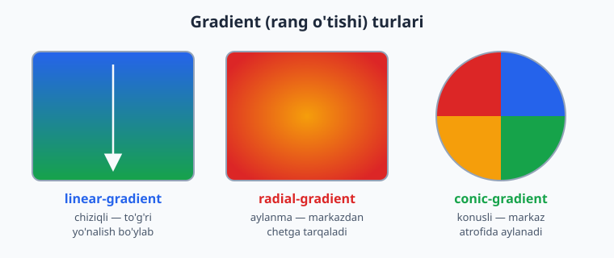
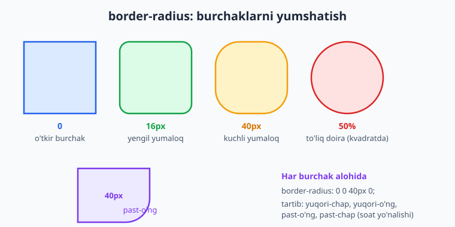
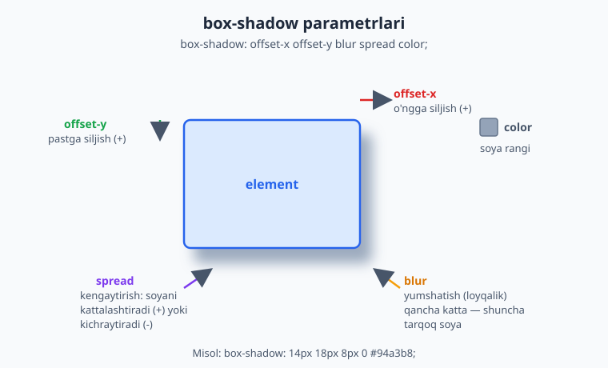
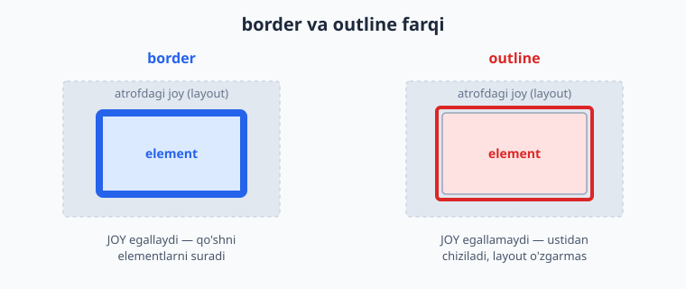

# 13 — Fon, chegara va soyalar

[⬅️ Oldingi: 12 — O'lchovlar, tipografiya va ranglar](./12-oolchovlar-tipografiya-ranglar.md) · [🏠 README](./README.md) · [Keyingi: 14 — Positioning va z-index ➡️](./14-positioning.md)

> **Bu bobda:** elementlarni jonlantiramiz — `background` (fon rangi, rasm, gradient), `border` va `border-radius` (chegara va yumaloq burchaklar), `box-shadow` (chuqurlik beruvchi soyalar), `outline` hamda `filter` bilan vizual effektlar yaratamiz.

---

## 13.1 Nega bu bob dizaynni "tirik" qiladi?

Box model (11-bob) elementga shakl berdi, displey va joylashuv (kelgusi boblar) ularni sarlashtiradi. Lekin sahifa hali ham **tekis va jonsiz** ko'rinadi: oq fon, qora chiziq, o'tkir burchak. Aynan shu bobda o'rganadigan xossalar — fon, gradient, yumaloq burchak va soya — sahifaga **chuqurlik, rang va shaxsiyat** beradi.

O'ylab ko'r: zamonaviy tugmalar nega "bosiladigandek" tuyuladi? Kartochkalar nega qog'oz bo'lagidek qalqib turadi? Buning sirligi yo'q — bu yumaloq burchak (`border-radius`) va yumshoq soya (`box-shadow`) ning birgalikdagi ishi. Ushbu bobni tugatganingda, sen oddiy `<div>` ni chiroyli kartochkaga aylantira olasan.

📌 **Atamalar tarjimasi:**
- **background** — fon (orqa qatlam).
- **gradient** — gradient, ya'ni ranglarning silliq o'tishi.
- **border** — chegara (quti devori).
- **border-radius** — burchak radiusi (yumaloqlik).
- **box-shadow** — quti soyasi.
- **outline** — kontur (chegaradan tashqaridagi chiziq).
- **filter** — filtr (vizual effekt).

---

## 13.2 background-color — eng oddiy fon

Eng sodda fon — bitta rang. `background-color` elementning butun fon maydonini (content + padding, odatda border ostini ham) bo'yaydi.

```css
.karta {
  background-color: #e0f2fe;   /* och ko'k fon */
}
```

```html
<div class="karta">Men och ko'k fonli quti man.</div>
```

**Natija:** quti orqasi och ko'k rangga bo'yaladi. Rang har qanday formatda bo'lishi mumkin: nom (`tomato`), HEX (`#e0f2fe`), `rgb()`, `hsl()` yoki shaffoflik bilan `rgba()` / `hsl(... / 0.5)`.

💡 **Maslahat:** fonni shaffof qoldirish uchun `background-color: transparent` ishlat (bu standart qiymat). Yarim shaffof fon uchun `rgba(0, 0, 0, 0.5)` kabi — bu ostidagi narsani biroz ko'rsatadi, modal oynalar oynasi (overlay) uchun juda foydali.

⚠️ **Tez-tez xato:** `color` va `background-color` ni adashtirish. `color` — **matn** rangi, `background-color` — **fon** rangi. Ikkalasini birga ishlatganda kontrastni unutma — och fonda och matn o'qilmaydi.

---

## 13.3 background-image — fon sifatida rasm

Fon faqat rang emas — rasm ham bo'la oladi. `background-image` ga `url()` orqali rasm manzilini beramiz.

```css
.banner {
  background-image: url("rasmlar/manzara.jpg");
  height: 300px;
  color: white;
}
```

📌 **Diqqat:** `url()` ichidagi yo'l CSS fayli joylashgan joyga nisbatan hisoblanadi (HTML faylga emas!). Bu boshlovchilarni tez-tez chalg'itadi.

💡 Bir element bir vaqtning o'zida ham `background-color`, ham `background-image` ga ega bo'lishi mumkin. Rasm tepada turadi; agar rasm yuklanmasa yoki shaffof joylari bo'lsa, rang ostidan ko'rinadi. Shu sabab fon rasmlari uchun **doim yedak rang** berish yaxshi odat:

```css
.banner {
  background-color: #1e293b;              /* rasm yuklanmasa — shu rang */
  background-image: url("rasmlar/tog.jpg");
}
```

`background-image` ga rasmdan tashqari **gradient** ham berish mumkin (chunki gradient ham texnik jihatdan "rasm"). Buni 13.8 da ko'ramiz.

---

## 13.4 background-repeat — rasm takrorlanishi

Standart holatda fon rasmi elementni to'ldirish uchun **ikkala o'q bo'ylab takrorlanadi** (mozaikadek). Buni `background-repeat` boshqaradi:

```css
.uslub1 { background-repeat: repeat;    }  /* standart: x va y bo'ylab takror */
.uslub2 { background-repeat: no-repeat; }  /* takrorlanmaydi — bitta nusxa   */
.uslub3 { background-repeat: repeat-x;  }  /* faqat gorizontal takror        */
.uslub4 { background-repeat: repeat-y;  }  /* faqat vertikal takror          */
.uslub5 { background-repeat: space;     }  /* takror + orasida teng bo'sh joy */
.uslub6 { background-repeat: round;     }  /* takror + cho'zib teng joylash   */
```

**Nega kerak?** Kichik naqsh (pattern, masalan nuqtalar to'ri) bilan butun fonni qoplamoqchi bo'lsang, `repeat` zo'r. Lekin bitta katta surat (banner) qo'ymoqchi bo'lsang, `no-repeat` shart — aks holda surat takrorlanib, xunuk ko'rinadi.

⚠️ **Eng keng tarqalgan xato:** banner rasmiga `no-repeat` qo'yishni unutish. Rasm element kattaligidan kichik bo'lsa, u takrorlanib ketadi.

---

## 13.5 background-position — rasmni joylashtirish

`background-position` rasmning element ichida **qayerga qo'yilishini** belgilaydi. Kalit so'zlar yoki aniq qiymatlar bilan:

```css
.a { background-position: center;        }  /* o'rtaga */
.b { background-position: top right;     }  /* yuqori-o'ngga */
.c { background-position: 20px 50px;     }  /* chapdan 20px, tepadan 50px */
.d { background-position: 50% 25%;       }  /* foiz bilan */
```

Ikki qiymat: **birinchisi gorizontal** (chap-o'ng), **ikkinchisi vertikal** (tepa-past).

💡 **Eng foydali kombinatsiya** — banner uchun "rasm doim markazda, takrorlanmaydi, qutini to'ldiradi":

```css
.banner {
  background-image: url("rasmlar/tog.jpg");
  background-repeat: no-repeat;
  background-position: center;
  background-size: cover;   /* keyingi bo'limda */
}
```

📌 Foiz bilan joylashtirish o'ziga xos: `50% 50%` rasmning **markazini** elementning **markaziga** to'g'rilaydi (oddiy "o'lchamning 50%" emas). Shuning uchun `center` deyarli har doim foizdan tushunarliroq.

---

## 13.6 background-size — cover va contain

`background-size` fon rasmining **o'lchamini** boshqaradi. Eng muhim ikki kalit so'z:

```css
.cover {
  background-size: cover;    /* rasmni cho'zib qutini TO'LIQ qoplaydi */
}
.contain {
  background-size: contain;  /* rasm TO'LIQ ko'rinadi, qutiga sig'adi */
}
```

Farqini tushunish juda muhim:

- **`cover`** — rasm nisbatini saqlab, qutini **butunlay** to'ldiradi. Rasm qutidan kattaroq bo'lsa, ortiqcha qismi **kesiladi**. Banner va hero bo'limlar uchun ideal — bo'sh joy qolmaydi.
- **`contain`** — rasm nisbatini saqlab, **butun rasm ko'rinadigan** qilib joylashtiriladi. Natijada qutida bo'sh joy (bo'shliq) qolishi mumkin. Logotip yoki butun rasmni ko'rsatish kerak bo'lganda ishlat.

Aniq o'lcham ham berish mumkin:

```css
.aniq { background-size: 200px 100px; }  /* eni 200px, bo'yi 100px */
.eni  { background-size: 100% auto;   }  /* eni to'liq, bo'yi nisbatan */
```

💡 **Nega "cover" eng mashhur?** Chunki turli ekran o'lchamlarida (telefon, kompyuter) banner doim to'liq to'ladi, bo'sh oq joy qolmaydi. Bu zamonaviy "hero" bo'limlarning asosi.

---

## 13.7 background-attachment — fon "yopishishi"

`background-attachment` fon rasmi sahifa bilan birga **siljishini** yoki **joyida qotib turishini** belgilaydi:

```css
.scroll { background-attachment: scroll; }  /* standart: kontent bilan siljiydi */
.fixed  { background-attachment: fixed;  }  /* joyida qotadi (parallaks effekti) */
```

`fixed` da fon ekranga "yopishadi": sahifani aylantirganingda matn siljiydi, lekin fon qimirlamaydi. Bu mashhur **parallaks** (parallax) ta'sirini beradi.

⚠️ Mobil brauzerlarda `fixed` har doim ham silliq ishlamaydi va batareyani ko'proq yeydi. Asosiy dizayningni unga bog'lab qo'yma — bu "bezak", zaruriy emas.

---

## 13.8 Gradientlar — ranglarning silliq o'tishi

**Gradient** — bu bir rangdan ikkinchisiga **silliq o'tish**. CSS gradientni bir tur "rasm" deb hisoblaydi, shuning uchun u `background-image` (yoki qisqa `background`) ichida yoziladi — `url()` o'rniga.

Uch asosiy tur bor:



### linear-gradient — chiziqli

Ranglar **to'g'ri chiziq** bo'ylab o'tadi. Birinchi argument — **yo'nalish**:

```css
.a { background-image: linear-gradient(to right, #2563eb, #16a34a); }  /* chapdan o'ngga */
.b { background-image: linear-gradient(to bottom, #2563eb, #16a34a); } /* tepadan pastga (standart) */
.c { background-image: linear-gradient(45deg, #2563eb, #16a34a); }     /* 45 graduslik burchak */
```

Yo'nalishni **so'z** (`to right`, `to bottom right`) yoki **gradus** (`90deg`) bilan berish mumkin. `0deg` — pastdan yuqoriga, `90deg` — chapdan o'ngga.

**Rang to'xtashlari** (color stops) — har rang qayerda boshlanishini aniq belgilash:

```css
.uchrang {
  background-image: linear-gradient(
    to right,
    #dc2626 0%,     /* qizil — boshida */
    #f59e0b 50%,    /* amber — o'rtada */
    #16a34a 100%    /* yashil — oxirida */
  );
}
```

💡 **Keskin chegara** yasash: ikki to'xtashni bir nuqtaga qo'ysang, gradient "o'tish" emas, **chiziq** bo'ladi (bayroq chizish uchun foydali):

```css
.bayroq {
  background-image: linear-gradient(to right, #dc2626 50%, #2563eb 50%);
  /* chap yarmi qizil, o'ng yarmi ko'k — silliq o'tishsiz */
}
```

### radial-gradient — aylanma

Ranglar **markazdan chetga** doira/ellips bo'ylab tarqaladi:

```css
.a { background-image: radial-gradient(#f59e0b, #dc2626); }            /* markaz amber -> chet qizil */
.b { background-image: radial-gradient(circle, #f59e0b, #dc2626); }    /* aniq doira shaklida */
.c { background-image: radial-gradient(circle at top left, #f59e0b, #dc2626); } /* markaz yuqori-chapda */
```

Bu "yorug'lik manbai" yoki "porlash" effekti uchun zo'r — markaz yorqin, chetlari qorong'i.

### conic-gradient — konusli

Ranglar markaz **atrofida aylanadi** (soatdek). Diagrammalar (pie chart), rang g'ildiragi yoki yuklanish indikatorlari uchun ishlatiladi:

```css
.pirog {
  background-image: conic-gradient(
    #2563eb 0deg 90deg,     /* ko'k chorak */
    #16a34a 90deg 180deg,   /* yashil chorak */
    #f59e0b 180deg 270deg,  /* amber chorak */
    #dc2626 270deg 360deg   /* qizil chorak */
  );
  border-radius: 50%;       /* doira qilish uchun */
}
```

📌 **Takrorlanuvchi gradient:** `repeating-linear-gradient` va `repeating-radial-gradient` bilan naqsh (chiziqlar, halqalar) yasash mumkin:

```css
.chiziqli {
  background-image: repeating-linear-gradient(
    45deg, #e2e8f0 0 10px, #cbd5e1 10px 20px
  );  /* takroriy diagonal chiziqlar */
}
```

---

## 13.9 Bir nechta fon va qisqa background yozuvi

### Bir nechta fon (multiple backgrounds)

Bitta elementga **bir nechta fon qatlamini** vergul bilan qo'yish mumkin. **Birinchi yozilgan — eng tepada** turadi:

```css
.qatlam {
  background-image:
    url("rasmlar/naqsh.png"),                              /* 1: eng tepada */
    linear-gradient(to bottom, #2563eb, #1e3a8a);          /* 2: pastda */
}
```

Bu juda kuchli: masalan tepaga shaffof naqsh, ostiga gradient qo'yish bilan boy fonlar yasaladi.

### Qisqa `background` yozuvi (shorthand)

Yuqoridagi barcha xossalarni bitta `background` qatorida birlashtirish mumkin:

```css
.toliq {
  background: #1e293b url("rasmlar/tog.jpg") no-repeat center / cover fixed;
  /*          rang     rasm                  repeat   position / size attachment */
}
```

📌 **Tartibni eslab qolish shart emas**, lekin bitta nozik qoida bor: `background-size` doim `background-position` dan keyin, **`/` belgisi bilan** ajratilib yoziladi (`center / cover`). Buni unutsang, brauzer qiymatni o'qiy olmaydi.

⚠️ **Diqqat:** qisqa `background` yozuvi ko'rsatilmagan barcha sub-xossalarni **standart qiymatga qaytaradi**. Ya'ni avval `background-color: red` yozib, keyin `background: url(...)` yozsang — qizil rang **o'chadi**. Tartib muhim.

---

## 13.10 border — chegara va uning turlari

`border` — elementni o'rab turuvchi chiziq. Uch komponentdan iborat: **qalinlik**, **uslub** va **rang**.

```css
.quti {
  border-width: 2px;       /* qalinligi */
  border-style: solid;     /* uslubi (MAJBURIY — bo'lmasa chegara ko'rinmaydi!) */
  border-color: #2563eb;   /* rangi */
}
```

Odatda qisqa yozuv ishlatiladi:

```css
.quti { border: 2px solid #2563eb; }   /* qalinlik uslub rang */
```

⚠️ **Eng ko'p uchraydigan xato:** `border-style` ni unutish. `border: 2px #2563eb` (uslubsiz) — **hech narsa ko'rsatmaydi**, chunki `border-style` ning standart qiymati `none`. Chegara ko'rinishi uchun uslub **shart**.

### border-style turlari

```css
.s1 { border: 3px solid  #475569; }  /* to'liq chiziq (eng keng tarqalgan) */
.s2 { border: 3px dashed  #475569; }  /* tirelar (---) */
.s3 { border: 3px dotted  #475569; }  /* nuqtalar (...) */
.s4 { border: 3px double  #475569; }  /* ikki parallel chiziq */
.s5 { border: 4px groove  #475569; }  /* "o'yilgan" 3D effekt */
.s6 { border: 4px ridge   #475569; }  /* "bo'rtgan" 3D effekt */
.s7 { border: 4px inset   #475569; }  /* "ichkariga botgan" */
.s8 { border: 4px outset  #475569; }  /* "tashqariga chiqqan" */
.s9 { border: 3px none    #475569; }  /* yo'q (ko'rinmaydi) */
```

💡 Amalda 90% holatda `solid` ishlatiladi; `dashed` va `dotted` ham foydali. `groove/ridge/inset/outset` eski uslubdagi 3D effektlar — hozir kam ishlatiladi.

### Har tomonni alohida boshqarish

Faqat bitta tomonga chegara berish mumkin:

```css
.faqat-tag {
  border-bottom: 2px solid #e2e8f0;   /* faqat pastki chegara — ajratuvchi chiziq sifatida */
}
.har-xil {
  border-top: 1px solid #94a3b8;
  border-left: 4px solid #2563eb;     /* chap tomonda qalin urg'u chizig'i */
}
```

`border-bottom` bilan ajratuvchi chiziq (divider) yasash — ro'yxatlar va menyularda juda keng tarqalgan amaliyot.

---

## 13.11 border-radius — yumaloq burchaklar

`border-radius` burchaklarni **yumaloq** qiladi. Bu zamonaviy dizaynning eng muhim detallaridan biri.



```css
.yengil { border-radius: 8px;   }   /* yumshoq burchak — tugma, karta uchun */
.kuchli { border-radius: 24px;  }   /* kuchli yumaloqlik */
.doira  { border-radius: 50%;   }   /* kvadratni doira qiladi! */
```

💡 **Kvadratdan doira yasash:** kvadrat (eni = bo'yi) elementga `border-radius: 50%` bersang, mukammal **doira** chiqadi. Avatar (profil rasmi) yumaloqlash uchun klassik usul:

```css
.avatar {
  width: 80px;
  height: 80px;
  border-radius: 50%;
  object-fit: cover;   /* rasm cho'zilmasligi uchun */
}
```

### Har burchakni alohida

To'rt qiymat berilsa, ular **soat yo'nalishida** o'qiladi: yuqori-chap, yuqori-o'ng, past-o'ng, past-chap.

```css
.bilet {
  border-radius: 0 0 16px 0;   /* faqat past-o'ng burchak yumaloq */
}
.qabarcha {
  border-radius: 18px 18px 18px 4px;  /* chat xabari "qulog'i" effekti */
}
```

### Ellips burchaklar

Har burchakda gorizontal va vertikal radiusni alohida berish mumkin (`/` bilan), bu **elliptik** burchak yasaydi:

```css
.ellips {
  border-radius: 50px / 20px;  /* gorizontal 50px, vertikal 20px — cho'zilgan burchak */
}
```

📌 `border-radius` rasm, gradient va `background-color` ni ham kesadi — fon yumaloq burchak ichida qoladi. Bu juda qulay: bitta xossa hamma narsani yumaloqlaydi.

---

## 13.12 box-shadow — chuqurlik beruvchi soya

`box-shadow` elementga **soya** qo'shadi va shu bilan unga "qalqib turish" yoki "chuqurlik" hissini beradi. Bu zamonaviy interfeyslarning asosiy quroli.

To'liq sintaksis besh qismdan iborat:



```css
.karta {
  box-shadow: 0 4px 12px 0 rgba(0, 0, 0, 0.15);
  /*          ↑  ↑    ↑   ↑  ↑
              |  |    |   |  └─ color: soya rangi
              |  |    |   └──── spread: kengayish (0 = o'zgarishsiz)
              |  |    └──────── blur: yumshatish (12px loyqalik)
              |  └───────────── offset-y: pastga 4px
              └──────────────── offset-x: gorizontal 0 (siljimaydi) */
}
```

Har parametr nima qiladi:

- **offset-x** — soyani **gorizontal** suradi. Musbat (+) o'ngga, manfiy (-) chapga.
- **offset-y** — soyani **vertikal** suradi. Musbat (+) pastga, manfiy (-) tepaga.
- **blur** — soyaning **chetini yumshatadi**. `0` = keskin (qattiq) soya; katta qiymat = tarqoq, yumshoq soya. Manfiy bo'lolmaydi.
- **spread** — soyani **kattalashtiradi** (+) yoki **kichraytiradi** (-). Ko'pincha `0`. (Ixtiyoriy — tushirib qoldirsa bo'ladi.)
- **color** — soya **rangi**. Tabiiy ko'rinish uchun ko'pincha yarim shaffof qora (`rgba(0,0,0,0.1)`) ishlatiladi.

💡 **Tabiiy soyaning siri:** real hayotda yorug'lik tepadan tushadi, shuning uchun soya **pastda** bo'ladi. Demak `offset-y` musbat (pastga), `offset-x` ko'pincha `0`. Yengil blur va past shaffoflik — eng tabiiy natija:

```css
.tugma {
  box-shadow: 0 2px 6px rgba(0, 0, 0, 0.12);   /* nozik, ishonchli soya */
}
```

### inset — ichki soya

`inset` kalit so'zi soyani **ichkariga** soladi — element "botgan" yoki "o'yilgan" ko'rinadi (bosilgan tugma, kiritish maydoni):

```css
.bosilgan {
  box-shadow: inset 0 2px 5px rgba(0, 0, 0, 0.2);  /* ichkariga botgan effekt */
}
```

### Bir nechta soya

Vergul bilan **bir nechta soya** berish mumkin — har biri alohida qatlam. Bu chuqurroq, real soyalar yasaydi:

```css
.qalqigan {
  box-shadow:
    0 1px 2px rgba(0, 0, 0, 0.08),    /* yaqin, keskin soya */
    0 8px 24px rgba(0, 0, 0, 0.12);   /* uzoq, yumshoq soya */
}
```

💡 Professional dizaynlarda bitta katta soya o'rniga **2-3 ta nozik soya** qatlami ishlatiladi — bu tabiiyroq ko'rinadi.

⚠️ `box-shadow` element o'lchamiga **ta'sir qilmaydi** va boshqa elementlarni surmaydi (box model'dan tashqarida chiziladi). Shuning uchun soyalar bilan layout buzilmaydi — bemalol ishlat.

---

## 13.13 outline — kontur va undan border farqi

`outline` ham chegaraga o'xshash chiziq, lekin ikki muhim farqi bor. Bu farq tasodifiy emas — har birining o'z vazifasi bor.



```css
.kontur {
  outline: 2px solid #2563eb;   /* border kabi: qalinlik uslub rang */
}
```

`border` dan ikki asosiy farqi:

1. **Joy egallamaydi.** `border` box model'ning bir qismi — element o'lchamiga qo'shiladi va qo'shni elementlarni suradi. `outline` esa **layout'dan tashqarida** chiziladi — qo'shsa ham element kattalashmaydi, sahifa "sakramaydi".
2. **Yumaloqlanmaydi (eski xulq).** An'anaviy ravishda `outline` `border-radius` ni hisobga olmaydi (yangi brauzerlarda bu yaxshilangan, lekin tarixan to'rtburchak qolardi).

**Nega `outline` muhim?** Chunki u **klaviatura bilan fokus** (`:focus`) ni ko'rsatishning standart usuli. Tab tugmasi bilan harakatlanayotgan foydalanuvchi qaysi elementdaligini aynan outline orqali ko'radi.

⚠️ **HECH QACHON shunday qilma:**

```css
*:focus { outline: none; }   /* ⚠️ FALOKAT — accessibility'ni buzadi! */
```

Bu klaviatura foydalanuvchilarini "ko'r" qilib qo'yadi — ular qayerdaligini bilmaydi. Agar standart outline xunuk ko'rinsa, uni o'chirma — **chiroyliroq qil**:

```css
.tugma:focus-visible {
  outline: 3px solid #2563eb;
  outline-offset: 2px;   /* outline'ni elementdan biroz uzoqlashtiradi */
}
```

### outline-offset

`outline-offset` konturni elementdan **uzoqlashtiradi** (musbat) yoki ichiga **kirgizadi** (manfiy):

```css
.a { outline: 2px solid #16a34a; outline-offset: 4px;  }   /* 4px tashqarida — "nafas oladi" */
.b { outline: 2px solid #16a34a; outline-offset: -6px; }   /* ichkarida */
```

💡 `border` joyni surishi mumkin bo'lgani uchun fokus ko'rsatkichi sifatida yomon (sahifa sakraydi). `outline` aynan shu muammoni hal qiladi — fokus uchun **doim** outline ishlat.

---

## 13.14 filter — vizual effektlar (qisqacha)

`filter` xossasi elementga (rasm, fon, butun blok) grafik effektlar qo'llaydi — xuddi rasm tahrirlovchisidagi filtrlar kabi. Eng foydali ikkitasi:

```css
.loyqa     { filter: blur(4px);        }   /* loyqalashtirish */
.yorqin    { filter: brightness(1.3);  }   /* yorqinlik: >1 yorqinroq, <1 qorong'i */
.qoraoq    { filter: grayscale(100%);  }   /* qora-oq qiladi */
.kontrast  { filter: contrast(1.5);    }   /* kontrastni oshiradi */
```

Bir nechta filtrni bo'sh joy bilan birlashtirish mumkin:

```css
.rasm:hover {
  filter: brightness(1.1) contrast(1.05);   /* sichqoncha tushganda jonlanadi */
}
```

💡 **Amaliy misol:** rasmni standart holatda qora-oq qilib, sichqoncha tushganda ranglantirish — galereyalarda mashhur effekt:

```css
.galereya img {
  filter: grayscale(100%);
  transition: filter 0.3s;   /* silliq o'tish (kelgusi bobda) */
}
.galereya img:hover {
  filter: grayscale(0%);     /* asl ranglariga qaytadi */
}
```

📌 `blur()` ning argumenti `px` da, qolganlari (`brightness`, `contrast`, `grayscale`) raqam yoki foiz bilan: `1` yoki `100%` = "o'zgarishsiz" asos.

⚠️ Katta `blur()` qiymatlari yoki katta maydonlarga filtr qo'llash ishlashni (performance) sekinlashtirishi mumkin — me'yorida ishlat.

---

## 13.15 Hammasini birlashtirish — chiroyli kartochka

Endi bilimlarni bir joyga yig'amiz. Quyida zamonaviy "karta" komponenti — fon, yumaloq burchak va ko'p qatlamli soya birgalikda:

```css
.karta {
  background: linear-gradient(135deg, #ffffff, #f1f5f9);  /* nozik gradient fon */
  border: 1px solid #e2e8f0;                               /* yengil chegara */
  border-radius: 16px;                                     /* yumaloq burchak */
  padding: 24px;
  box-shadow:                                              /* ikki qatlamli soya */
    0 1px 2px rgba(0, 0, 0, 0.06),
    0 10px 30px rgba(0, 0, 0, 0.10);
}
.karta:hover {
  box-shadow:                                              /* ko'tarilgandek effekt */
    0 2px 4px rgba(0, 0, 0, 0.08),
    0 16px 40px rgba(0, 0, 0, 0.16);
}
```

```html
<div class="karta">
  <h3>Mahsulot nomi</h3>
  <p>Ushbu kartochka fon, chegara, yumaloq burchak va soya birgalikda qanday ishlashini ko'rsatadi.</p>
</div>
```

**Natija:** oq qog'oz varag'idek qalqib turgan, yumshoq soyali, yumaloq burchakli karta. Sichqoncha tushganda u biroz "ko'tariladi". Bu — fon, chegara va soyaning kuchi.

---

## Mashqlar

### Mashq 1 — Och fonli ogohlantirish qutisi

`.eslatma` klassiga och sariq fon (`#fef3c7`), chap tomonda 4px qalin amber chegara (`#f59e0b`) va 12px ichki padding bering.

<details markdown="1"><summary>Yechim</summary>

```css
.eslatma {
  background-color: #fef3c7;
  border-left: 4px solid #f59e0b;
  padding: 12px;
}
```

Chap tomonda qalin urg'u chizig'i — eslatma/ogohlantirish qutilarining klassik dizayni.

</details>

### Mashq 2 — Banner foni

`.banner` elementiga "rasmlar/tog.jpg" rasmini fon qiling: takrorlanmasin, markazda tursin va qutini to'liq qoplasin. Yedak rang `#1e293b` bersin.

<details markdown="1"><summary>Yechim</summary>

```css
.banner {
  background-color: #1e293b;
  background-image: url("rasmlar/tog.jpg");
  background-repeat: no-repeat;
  background-position: center;
  background-size: cover;
}
```

Yoki qisqa yozuvda:

```css
.banner {
  background: #1e293b url("rasmlar/tog.jpg") no-repeat center / cover;
}
```

</details>

### Mashq 3 — Uch rangli gradient

`.spektr` elementiga chapdan o'ngga uch rangli linear gradient bering: qizil (`#dc2626`), amber (`#f59e0b`), yashil (`#16a34a`) — teng taqsimlangan.

<details markdown="1"><summary>Yechim</summary>

```css
.spektr {
  background-image: linear-gradient(
    to right,
    #dc2626,
    #f59e0b,
    #16a34a
  );
}
```

Uch rang bo'lsa, brauzer ularni avtomatik teng (0%, 50%, 100%) taqsimlaydi — to'xtashlarni yozish shart emas.

</details>

### Mashq 4 — Doira avatar

80x80px o'lchamdagi `.avatar` rasmni mukammal doira qiling. Rasm cho'zilmasligi kerak.

<details markdown="1"><summary>Yechim</summary>

```css
.avatar {
  width: 80px;
  height: 80px;
  border-radius: 50%;
  object-fit: cover;
}
```

Kvadrat (eni = bo'yi) elementga `border-radius: 50%` — mukammal doira beradi. `object-fit: cover` rasmni cho'zmasdan kesib joylaydi.

</details>

### Mashq 5 — Qalqib turgan tugma

`.tugma` ga ko'k fon (`#2563eb`), oq matn, 8px yumaloq burchak va tabiiy soya (gorizontal 0, pastga 3px, blur 8px, yarim shaffof qora) bering.

<details markdown="1"><summary>Yechim</summary>

```css
.tugma {
  background-color: #2563eb;
  color: white;
  border: none;
  border-radius: 8px;
  padding: 10px 20px;
  box-shadow: 0 3px 8px rgba(0, 0, 0, 0.2);
}
```

`offset-x: 0`, `offset-y: 3px` — yorug'lik tepadan kelganidek, soya pastda. Tabiiy ko'rinish shu.

</details>

### Mashq 6 — Bosilgan (botgan) maydon

`.input` ga ichki soya (`inset`) qo'shing, shunda u "ichkariga botgan" ko'rinsin.

<details markdown="1"><summary>Yechim</summary>

```css
.input {
  border: 1px solid #cbd5e1;
  border-radius: 6px;
  padding: 8px;
  box-shadow: inset 0 2px 4px rgba(0, 0, 0, 0.08);
}
```

`inset` kalit so'zi soyani element **ichiga** soladi — kiritish maydonlari uchun chuqurlik hissi beradi.

</details>

### Mashq 7 — Fokusni xavfsiz ko'rsatish

Quyidagi kod accessibility'ni buzadi. Nima xato va qanday tuzatasan?

```css
.havola:focus { outline: none; }
```

<details markdown="1"><summary>Yechim</summary>

`outline: none` klaviatura foydalanuvchisi qaysi elementdaligini ko'rsatmaydi — bu **falokat**. Outline'ni o'chirish o'rniga uni chiroyliroq qilish kerak:

```css
.havola:focus-visible {
  outline: 3px solid #2563eb;
  outline-offset: 2px;
}
```

`outline` joy egallamagani uchun (border'dan farqli) fokus ko'rsatkichi sifatida ideal — sahifa "sakramaydi". `outline-offset` esa konturga "nafas olish" joyi beradi.

</details>

### Mashq 8 — Ko'p qatlamli karta foni

`.banner` elementiga ikki qatlamli fon bering: tepada shaffof naqsh ("rasmlar/naqsh.png"), ostida tepadan pastga ko'k gradient (`#2563eb` dan `#1e3a8a` gacha).

<details markdown="1"><summary>Yechim</summary>

```css
.banner {
  background-image:
    url("rasmlar/naqsh.png"),
    linear-gradient(to bottom, #2563eb, #1e3a8a);
}
```

Birinchi yozilgan qatlam (naqsh) **tepada**, ikkinchisi (gradient) ostida turadi. Shaffof joylaridan gradient ko'rinadi.

</details>

### Mashq 9 (qiyin) — Pirog diagramma

`.pirog` elementini `conic-gradient` bilan teng to'rt bo'lakka bo'ling: ko'k, yashil, amber, qizil. Uni doira shaklida ko'rsating.

<details markdown="1"><summary>Yechim</summary>

```css
.pirog {
  width: 150px;
  height: 150px;
  border-radius: 50%;
  background-image: conic-gradient(
    #2563eb 0deg 90deg,
    #16a34a 90deg 180deg,
    #f59e0b 180deg 270deg,
    #dc2626 270deg 360deg
  );
}
```

`conic-gradient` markaz atrofida aylangani uchun `border-radius: 50%` bilan birga mukammal pirog (pie chart) yasaydi. Har rangga ikki gradus bergani uchun chegaralar keskin chiqadi.

</details>

---

[⬅️ Oldingi: 12 — O'lchovlar, tipografiya va ranglar](./12-oolchovlar-tipografiya-ranglar.md) · [🏠 README](./README.md) · [Keyingi: 14 — Positioning va z-index ➡️](./14-positioning.md)
