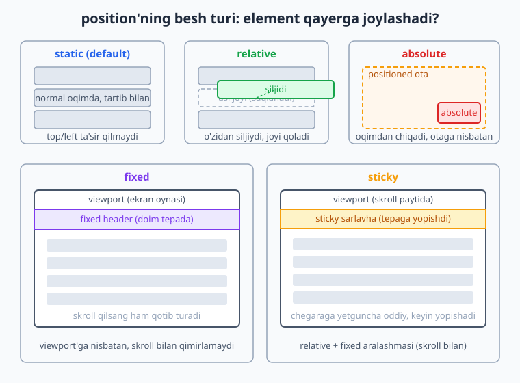
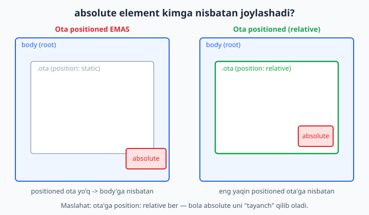
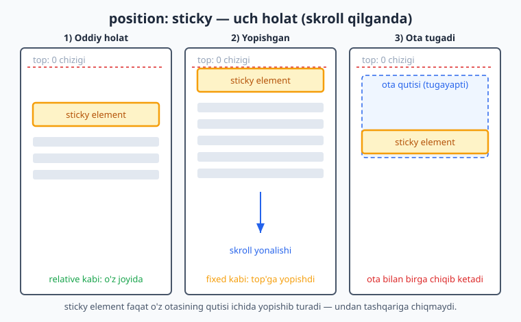
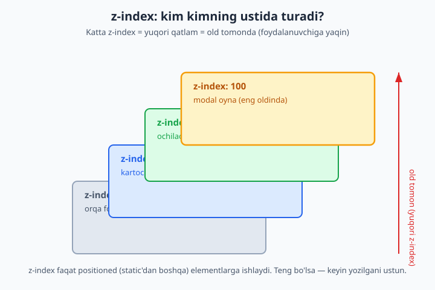

# 14 — Positioning va z-index

[⬅️ Oldingi: 13 — Fon, chegara va soyalar](./13-fon-chegara-soyalar.md) · [🏠 README](./README.md) · [Keyingi: 15 — Flexbox ➡️](./15-flexbox.md)

> **Bu bobda:** elementlarni joylashtirish — `static`, `relative`, `absolute`, `fixed`, `sticky` — hamda qatlamlarni boshqaruvchi `z-index` va stacking context.

---

Shu paytgacha biz elementlar sahifada **o'z navbati bilan**, yuqoridan pastga tartib bilan joylashishini ko'rib keldik. Lekin haqiqiy saytlarda bizga ko'pincha bundan ko'prog'i kerak bo'ladi: tugma ustiga "yangi" yorlig'ini yopishtirish, skroll qilganda tepada qotib turadigan menyu, ekran o'rtasida paydo bo'ladigan modal oyna, sichqonchani olib borganda chiqadigan tooltip...

Bularning hammasi **positioning** (joylashtirish) bilan qilinadi. `position` xossasi elementni normal oqimdan "olib chiqib", uni sen xohlagan joyga qo'yish imkonini beradi. Bu bob seni eng sodda `position: static` dan to expert darajadagi stacking context nozikliklarigacha bosqichma-bosqich olib boradi.

💡 Positioning — bu CSS layout (joylashuv) vositalaridan biri. Asosiy layoutni Flexbox va Grid (keyingi boblarda) bilan quramiz; positioning esa alohida elementlarni "aniq nuqtaga" qo'yish yoki bir-biri ustiga qo'yish uchun kerak.

---

## 14.1 Avval: normal oqim (normal flow) nima?

`position` ni tushunish uchun avval brauzer elementlarni **standart** holatda qanday joylashtirishini eslab olaylik. Buni **normal oqim** (normal flow) deyiladi.

Normal oqimda:

- **Block elementlar** (`<div>`, `<p>`, `<h1>`, `<section>` ...) bir-birining **ostiga**, yuqoridan pastga tartib bilan tushadi. Har biri butun kenglikni egallaydi.
- **Inline elementlar** (`<span>`, `<a>`, `<strong>` ...) bir-birining **yoniga**, matn kabi chapdan o'ngga joylashadi.

```html
<div>Birinchi blok</div>
<div>Ikkinchi blok</div>
<div>Uchinchi blok</div>
```

**Natija:** uchta blok bir-birining ostida, yuqoridan pastga ketma-ket turadi. Hech kim hech kim bilan ustma-ust tushmaydi — har biriga sahifada o'z joyi ajratiladi.

📌 Normal oqim — bu CSS'ning "asosiy holati". `position` xossasi aslida **shu oqimdan qanday chetga chiqishni** boshqaradi. Shuning uchun "element oqimda turibdimi yoki oqimdan chiqdimi?" degan savol bu bobning eng muhim savoli bo'ladi.

---

## 14.2 position xossasi va uning besh qiymati

`position` xossasi elementning qanday joylashishini belgilaydi. Beshta asosiy qiymati bor:

| Qiymat | Oqimda qoladimi? | Nimaga nisbatan siljiydi? |
|---|---|---|
| `static` | Ha (default) | Hech nimaga — `top/left` ishlamaydi |
| `relative` | Ha (joyi saqlanadi) | O'zining asl o'rniga |
| `absolute` | **Yo'q** (oqimdan chiqadi) | Eng yaqin positioned ota'ga |
| `fixed` | **Yo'q** (oqimdan chiqadi) | Viewport'ga (ekran oynasiga) |
| `sticky` | Ha, keyin yopishadi | Skroll konteyneriga (chegaraga) |

Quyidagi diagramma beshtasi sahifada qanday joylashishini ko'rsatadi:



Bu qiymatlarning to'rttasi (`relative`, `absolute`, `fixed`, `sticky`) `top`, `right`, `bottom`, `left` xossalari bilan birga ishlaydi. Endi har birini alohida, sodda misollar bilan ochamiz.

---

## 14.3 static — standart holat

`static` — bu **har bir elementning standart** (default) qiymati. Sen `position` ni umuman yozmasang, element `static` bo'ladi.

```css
.quti {
  position: static;   /* aslida yozishning hojati yo'q — bu allaqachon default */
}
```

Static element **normal oqimda** turadi va eng muhimi:

⚠️ Static elementda `top`, `right`, `bottom`, `left` va `z-index` xossalari **umuman ishlamaydi**. Ularni yozsang ham brauzer e'tiborsiz qoldiradi.

**Nega bilish kerak?** Ko'p boshlovchi `top: 20px` yozadi-yu, "element qimirlamayapti" deb hayron bo'ladi. Sababi oddiy: element hali `static` holatida — uni avval boshqa `position` qiymatiga o'tkazish kerak.

💡 Qoidani shunday eslang: **siljish xossalari (`top/left/...`) faqat element `static` bo'lmaganda ishlaydi.**

---

## 14.4 relative — o'zidan siljish

`position: relative` element uchun ikki narsani anglatadi:

1. Element **hali ham normal oqimda** — uning asl joyi saqlanib qoladi (boshqa elementlar uning bo'sh joyiga kirmaydi).
2. Endi `top/right/bottom/left` bilan elementni **o'zining asl o'rnidan** siljitish mumkin.

```css
.belgi {
  position: relative;
  top: 15px;    /* yuqoridan 15px pastga suriladi */
  left: 30px;   /* chapdan 30px o'ngga suriladi */
}
```

**Natija:** element o'z joyidan pastga va o'ngga "ko'chadi", lekin u qoldirgan **bo'sh joy o'sha yerda turadi** — boshqa elementlar siljimaydi.

📌 Diqqat qil: `top: 15px` "element yuqorisi 15px bo'lsin" degani EMAS. U "elementni o'z joyidan 15px pastga sur" degani. Ya'ni `top` — bu **yuqoridan beriladigan turtki**. Shuning uchun musbat `top` elementni pastga, musbat `left` o'ngga suradi.

`relative` ning ikki asosiy ishlatilishi bor:

- **Kichik siljitish** — elementni biroz "to'g'rilash" uchun (yuqoridagi misoldek).
- **Tayanch (anchor) bo'lish** — bu eng muhim ishlatilishi! Ichidagi `absolute` bola element shu `relative` ota'ga nisbatan joylashadi. Buni keyingi bo'limda ko'ramiz.

💡 Amalda `relative` ni eng ko'p ikkinchi maqsadda — "ichimdagi absolute element men ichimda qolsin" deb ishlatasan, hatto uni o'zini siljitmasang ham.

---

## 14.5 absolute — oqimdan chiqib, ota'ga nisbatan

`position: absolute` eng kuchli va eng ko'p chalkashlik tug'diradigan qiymat. Uni tushunsang, positioning'ning yarmini bilding.

`absolute` element:

1. **Normal oqimdan butunlay chiqadi** — u qoldirgan joy yo'qoladi, boshqa elementlar go'yo u yo'qdek joylashadi.
2. **Eng yaqin "positioned" ota'ga nisbatan** joylashadi (bu tushunchani pastda ochamiz).
3. `top/right/bottom/left` bilan o'sha ota'ning ichida aniq joyga qo'yiladi.

```html
<div class="ota">
  <span class="nishon">YANGI</span>
  Mahsulot kartochkasi
</div>
```

```css
.ota {
  position: relative;   /* MUHIM: tayanch bo'lish uchun */
  width: 300px;
  height: 200px;
}
.nishon {
  position: absolute;
  top: 10px;            /* ota'ning tepasidan 10px */
  right: 10px;          /* ota'ning o'ngidan 10px */
  background: #dc2626;
  color: white;
  padding: 4px 8px;
}
```

**Natija:** "YANGI" yorlig'i kartochkaning o'ng yuqori burchagiga aniq yopishadi. Kartochka hajmi o'zgarsa ham, yorliq doim o'ng yuqorida qoladi.

### "Positioned ancestor" (positioned ota) nima?

Bu — `absolute` ni tushunishdagi eng muhim tushuncha. `absolute` element joylashish uchun "tayanch" izlaydi: u yuqoriga, ota-bobolari (ancestors) tomon qarab, **`position` qiymati `static` bo'lmagan** birinchi ota'ni topadi. Mana shu ota **positioned ancestor** deyiladi.

- Agar bunday ota topilsa — `absolute` element **o'shanga** nisbatan joylashadi.
- Agar **hech qaysi** ota positioned bo'lmasa — element **`<body>`ga** (aniqrog'i, dastlabki konteynerga / viewport'ga) nisbatan joylashadi.



⚠️ Eng ko'p uchraydigan xato: ota'ga `position: relative` berishni unutish. Natijada `absolute` bola butun sahifa burchagiga "qochib" ketadi. Yodda tut: **`absolute` bola istasang, ota'ga `position: relative` ber.**

💡 "Positioned" so'zi nimani anglatadi? — `position` qiymati `relative`, `absolute`, `fixed` yoki `sticky` bo'lgan har qanday element. Faqat `static` "positioned emas". Amalda tayanch sifatida deyarli doim `relative` ishlatiladi, chunki u ota'ning o'z joyini o'zgartirmaydi.

---

## 14.6 fixed — viewport'ga yopishish

`position: fixed` `absolute` ga juda o'xshaydi — u ham oqimdan chiqadi. Farqi: u **har doim viewport'ga** (brauzer oynasining ko'rinadigan qismiga) nisbatan joylashadi va **skroll qilganda qimirlamaydi**.

```css
.tepa-menyu {
  position: fixed;
  top: 0;
  left: 0;
  width: 100%;
  background: #2563eb;
  color: white;
}
```

**Natija:** menyu sahifaning eng tepasiga "qotib" qoladi. Foydalanuvchi pastga skroll qilsa ham, menyu doim ekran tepasida ko'rinib turadi.

`fixed` ning tipik ishlatilishlari:

- Doim ko'rinib turadigan tepa menyu (navbar).
- Pastki burchakda "tepaga qaytish" tugmasi.
- Cookie bildirishnomasi yoki chat tugmasi.

⚠️ `fixed` element oqimdan chiqadi, shuning uchun u o'z ortidagi mazmunni **berkitib qo'yishi** mumkin. Masalan, balandligi 60px bo'lgan `fixed` menyu sahifa boshidagi matnni yopadi. Yechim: `<body>` ga shuncha bo'shliq berish, masalan `body { padding-top: 60px; }`.

📌 Nozik nuqta: agar ota elementga `transform`, `filter` yoki `perspective` xossasi berilgan bo'lsa, `fixed` element viewport'ga emas, **o'sha ota'ga** nisbatan joylashib qoladi. Bu kutilmagan xatolarning tez-tez uchraydigan sababi.

---

## 14.7 sticky — skroll bilan yopishadigan element

`position: sticky` — eng "aqlli" qiymat. U `relative` va `fixed` ning aralashmasi kabi ishlaydi:

- Element odatda **normal oqimda**, o'z joyida turadi (`relative` kabi).
- Skroll qilganda u belgilangan **chegaraga** (masalan `top: 0`) yetganda — o'sha yerga **yopishib** qoladi va keyin `fixed` kabi qotib turadi.
- Otasining qutisi tugaganda — element ota bilan birga skroll bo'lib chiqib ketadi.

```css
.bolim-sarlavhasi {
  position: sticky;
  top: 0;             /* tepaga yetganda yopishadi */
  background: #f59e0b;
}
```

**Natija:** bo'lim sarlavhasi skroll bilan birga yuqoriga ko'tariladi, ekran tepasiga yetganda yopishadi va keyingi bo'lim kelguncha o'sha yerda turadi.



⚠️ `sticky` ishlashi uchun **`top`, `bottom`, `left` yoki `right` dan kamida bittasi** berilishi **shart**. `top: 0` bermasdan faqat `position: sticky` yozsang, hech narsa yopishmaydi.

⚠️ Yana bir tuzoq: agar `sticky` elementning **otasida** `overflow: hidden`, `overflow: auto` yoki `overflow: scroll` bo'lsa, yopishish ko'pincha **ishlamaydi**. Bu boshlovchilarni ko'p qiynaydigan xato — sticky "nega ishlamayapti" desang, avval ota elementlarning `overflow` ini tekshir.

💡 Tipik ishlatilishlari: alifbo bo'yicha ro'yxatdagi harf sarlavhalari, jadval ustun sarlavhasi (`<thead>`), uzun sahifadagi bo'lim sarlavhalari, yon menyu.

---

## 14.8 z-index va qatlamlanish (stacking)

`position` elementlarni bir-birining ustiga qo'yishi mumkin. Unda **qaysi biri oldinda** ko'rinadi? Buni `z-index` boshqaradi.

Ekranni 3D deb tasavvur qil: `x` o'qi — chap/o'ng, `y` o'qi — yuqori/past, `z` o'qi esa **senga tomon** — ya'ni "chuqurlik". `z-index` qancha katta bo'lsa, element shuncha **oldinda** (senga yaqin) turadi.

```css
.orqa {
  position: absolute;
  z-index: 1;        /* pastki qatlam */
}
.old {
  position: absolute;
  z-index: 10;       /* yuqori qatlam — .orqa ustiga tushadi */
}
```



`z-index` haqida bilish shart bo'lgan qoidalar:

- `z-index` **faqat positioned elementlarga** ishlaydi (`static` dan boshqa — `relative/absolute/fixed/sticky`). Static elementda u e'tiborsiz qoladi.
- Qiymat — butun son: musbat (`10`), `0`, yoki manfiy (`-1`) bo'lishi mumkin. Katta son = oldinda.
- Agar `z-index` berilmasa yoki teng bo'lsa — **HTML'da keyin yozilgan** element ustun bo'ladi (manba tartibi).

📌 Maslahat: `z-index: 9999999` kabi ulkan sonlar yozma. Loyihada izchil tizim tut: masalan `1` (content) → `10` (dropdown) → `100` (sticky header) → `1000` (modal). Bu keyinroq "qatlam urushi" muammosidan saqlaydi.

---

## 14.9 Stacking context — z-index'ning "yashirin qoidasi"

Bu bobning eng expert qismi. Ko'p tajribali dasturchi ham bu yerda qoqiladi.

**Muammo:** ba'zan elementga `z-index: 9999` berasan, lekin u baribir boshqa `z-index: 1` element ostida qoladi. Nega?! Javob — **stacking context** (qatlamlanish konteksti) tushunchasida.

**Stacking context** — bu elementlarning alohida, mustaqil "qatlamlar guruhi". Har bir kontekst o'z ichida alohida saralanadi. Eng muhimi:

> Bola elementning `z-index` i faqat **o'z stacking context'i ichida** taqqoslanadi. U tashqaridagi elementlar bilan to'g'ridan-to'g'ri raqobatlasholmaydi.

Hayotiy analogiya: ikkita bino bor. Birinchi binoning 50-qavatidagi odam, ikkinchi binoning 2-qavatidagi odamdan **balandroq emas**, agar birinchi bino umuman pastroq tepalikda joylashgan bo'lsa. "Qavat raqami" (z-index) faqat **o'z binosi** (stacking context) ichida ma'noga ega. Binolarning o'zaro tartibi esa boshqacha hal qilinadi.

### Yangi stacking context qachon ochiladi?

Element quyidagilardan birortasiga ega bo'lsa, u **yangi stacking context** yaratadi (ro'yxat to'liq emas, eng muhimlari):

- `position: relative/absolute` + `z-index` qiymati (`auto` dan boshqa).
- `position: fixed` yoki `position: sticky` (z-index'siz ham).
- `opacity` 1 dan kichik (masalan `opacity: 0.9`).
- `transform`, `filter`, `perspective`, `clip-path` (qiymati `none` dan boshqa).
- `will-change` ba'zi qiymatlar bilan.
- Flex yoki grid bolasida `z-index` berilgan bo'lsa.

```css
.ota {
  opacity: 0.99;      /* bu YANGI stacking context ochadi! */
}
.ota .bola {
  position: absolute;
  z-index: 9999;      /* lekin bu faqat .ota ichida ma'noga ega */
}
```

⚠️ Yuqoridagi misolda `.bola` ning `z-index: 9999` i `.ota` dan tashqaridagi elementlardan ustun bo'la **olmaydi** — chunki `.ota` o'zining `opacity` tufayli alohida stacking context yaratdi va `.bola` shu "qutiga qamalib" qoldi.

💡 Shuning uchun "z-index'im ishlamayapti" muammosida birinchi tekshiriladigan narsa: **ota elementlardan birortasi stacking context yaratmadimi** (ayniqsa `opacity`, `transform`, yoki `filter` tufayli)? Brauzer DevTools (F12) buni tekshirishga yordam beradi.

---

## 14.10 float va clear (legacy — eski layout usuli)

Tarixiy bilim sifatida `float` ni ham qisqacha ko'rib o'tamiz. `float` dastlab gazetadagidek **matnni rasm atrofiga oqizish** uchun yaratilgan edi.

```css
img {
  float: left;          /* rasm chapga suriladi, matn uning o'ngidan oqadi */
  margin-right: 15px;
}
```

**Natija:** rasm chapga "suzadi", undan keyingi matn rasmning o'ng yonidan va ostidan o'rab oqadi — xuddi jurnaldagidek.

`float: left` yoki `float: right` element atrofidan matn oqishiga ruxsat beradi. `clear` esa buning teskarisi — "men float elementlar yonidan emas, ularning **ostidan** boshlanay" deydi:

```css
.toza {
  clear: both;          /* chap va o'ng float'larning ostiga tushadi */
}
```

### Nega bu "legacy" (eski)?

Flexbox va Grid paydo bo'lishidan **oldin** (2017 yilgacha) dasturchilar butun sahifa layoutini — ustunlar, panellar, gazeta tartibi — `float` bilan qurishga majbur edi. Bu juda noqulay edi:

- Float qilingan elementlar otasini "balandligini yo'qotishga" majbur qilardi (collapse muammosi), buni hal qilish uchun `clearfix` degan hiyla ishlatilardi.
- Vertikal markazlash, teng balandlikdagi ustunlar — bularning hammasi azob edi.

⚠️ Bugun **layout uchun `float` ishlatma**. Ustunlar va umumiy joylashuv uchun **Flexbox yoki Grid** to'g'ri vosita (keyingi boblar). `float` ni faqat asl maqsadida — matn ichida rasmni oqizish uchun — qoldir.

📌 Bu bo'limni o'qib qo'ydingmi — yetarli. Eski kodlarda `float` layoutini uchratsang, "bu Flexbox'gacha bo'lgan usul ekan" deb tanib olasan, xolos.

---

## 14.11 Amaliy misol 1: yopishqoq header (sticky navbar)

Skroll qilganda tepada qotib turadigan menyu — eng ko'p kerak bo'ladigan naqsh. Buni ikki usulda qilish mumkin: `fixed` yoki `sticky`. Hozir `sticky` ni ko'ramiz — u ko'pincha qulayroq, chunki bo'shliq muammosini o'zi hal qiladi.

```html
<header class="navbar">Mening saytim</header>
<main>
  <p>Juda uzun matn... (skroll qilish uchun)</p>
  <!-- ... ko'p matn ... -->
</main>
```

```css
.navbar {
  position: sticky;
  top: 0;                 /* tepaga yetganda yopishadi */
  z-index: 100;           /* boshqa mazmun ustida turadi */
  background: #2563eb;
  color: white;
  padding: 16px;
}
```

**Natija:** menyu avval sahifaning eng tepasida turadi; pastga skroll qilganda ekran tepasiga yopishib, doim ko'rinib turadi. `z-index: 100` esa skroll qilinadigan mazmun menyu ustiga "chiqib ketmasligini" ta'minlaydi.

💡 Nega `sticky` `fixed` dan qulay? — `sticky` element o'z joyini oqimda saqlaydi, shuning uchun ostidagi mazmun ostiga "kirib ketmaydi" — `fixed` dagidek qo'shimcha `padding-top` berish shart emas.

---

## 14.12 Amaliy misol 2: tooltip (sichqoncha izohi)

Tooltip — element ustiga sichqoncha kelganda chiqadigan kichik izoh. Bu `relative` ota + `absolute` bola naqshining klassik namunasi.

```html
<span class="tip">
  Narx
  <span class="tip-matn">Soliq bilan birga hisoblangan</span>
</span>
```

```css
.tip {
  position: relative;         /* tayanch: absolute bola shu yerga nisbatan */
  cursor: help;
}
.tip-matn {
  position: absolute;
  bottom: 130%;               /* matnning tepasida chiqadi */
  left: 50%;
  transform: translateX(-50%);/* gorizontal markazga to'g'rilaydi */
  background: #1e293b;
  color: white;
  padding: 6px 10px;
  border-radius: 6px;
  white-space: nowrap;
  visibility: hidden;         /* odatda yashirin */
  z-index: 10;
}
.tip:hover .tip-matn {
  visibility: visible;        /* sichqoncha kelganda ko'rinadi */
}
```

**Natija:** "Narx" so'zi ustiga sichqonchani olib borsang, ustida qora fonli izoh chiqadi. Izoh "Narx" so'ziga nisbatan markazlashtirilgan, chunki ota `relative`, bola `absolute`.

📌 `transform: translateX(-50%)` hiylasi: `left: 50%` elementning **chap chetini** markazga qo'yadi; `translateX(-50%)` esa uni o'z kengligining yarmiga chapga suradi — natijada element **markazi** to'g'ri keladi. Bu markazlashtirishning juda ko'p ishlatiladigan usuli.

---

## 14.13 Amaliy misol 3: modal oyna (overlay bilan)

Modal — ekran o'rtasida paydo bo'lib, ortidagi mazmunni qoramtir parda (overlay) bilan to'sadigan oyna. Bu `fixed` va `z-index` ning eng yaxshi namunasi.

```html
<div class="overlay">
  <div class="modal">
    <h2>Tasdiqlaysizmi?</h2>
    <p>Bu amalni bekor qilib bo'lmaydi.</p>
    <button>Ha</button>
  </div>
</div>
```

```css
.overlay {
  position: fixed;            /* butun viewport'ni qoplaydi */
  top: 0;
  left: 0;
  width: 100%;
  height: 100%;
  background: rgba(0, 0, 0, 0.5);  /* yarim shaffof qora parda */
  display: flex;
  align-items: center;        /* modalni vertikal markazga */
  justify-content: center;    /* gorizontal markazga */
  z-index: 1000;              /* hamma narsadan tepada */
}
.modal {
  background: white;
  padding: 24px;
  border-radius: 12px;
  max-width: 400px;
}
```

**Natija:** butun ekranni qoplagan yarim shaffof parda, uning o'rtasida oq modal oyna. `z-index: 1000` modalni sahifadagi har qanday elementdan tepada turishini kafolatlaydi.

💡 Bu yerda ikki texnika birlashdi: `position: fixed` + `width/height: 100%` butun ekranni qoplaydi, Flexbox (`align-items` + `justify-content: center`) esa modalni aniq markazga qo'yadi. `z-index` esa qatlam tartibini boshqaradi.

⚠️ Yodda tut (14.9 bo'limini esla): modal `<body>` ga to'g'ridan-to'g'ri yaqin joyda turishi yaxshi. Agar uni `transform` yoki `opacity` ishlatilgan ota ichiga qo'ysang, yangi stacking context tufayli `z-index: 1000` baribir ishlamay qolishi mumkin.

---

## 14.14 Tez-tez uchraydigan xatolar (xulosa)

Bu boblardagi eng ko'p uchraydigan tuzoqlarni bir joyga to'pladik — saqlab qo'y:

| Xato | Sabab | Yechim |
|---|---|---|
| `top: 20px` ishlamayapti | Element hali `static` | `position` ni `relative/absolute/...` qil |
| `absolute` bola sahifa burchagiga qochib ketdi | Ota positioned emas | Ota'ga `position: relative` ber |
| `sticky` yopishmayapti | `top` berilmagan | `top: 0` (yoki boshqa chegara) qo'sh |
| `sticky` baribir ishlamayapti | Ota'da `overflow: hidden/auto` | Ota'dagi `overflow` ni olib tashla |
| `z-index: 9999` baribir ostda | Ota yangi stacking context yaratgan | Ota'dagi `opacity/transform/filter` ni tekshir |
| `fixed` element noto'g'ri joyda | Ota'da `transform` bor | Ota'dan `transform` ni olib tashla yoki boshqa joyga ko'chir |
| `fixed` menyu mazmunni yopib qo'ydi | Oqimdan chiqdi | `<body>` ga shuncha `padding-top` ber |

---

## Mashqlar

Quyidagi mashqlarni o'zing yozib, brauzerda sinab ko'r. Har birida "nega shunday bo'ldi?" deb o'ylab ko'rishni unutma.

### Mashq 1 — static tuzoq

Quyidagi kod nima uchun elementni siljitmaydi? Tuzat.

```css
.quti {
  top: 40px;
  left: 40px;
}
```

<details markdown="1"><summary>Yechim</summary>

Element `static` holatida (default), shuning uchun `top/left` ishlamaydi. `position` qiymatini qo'shish kerak:

```css
.quti {
  position: relative;   /* endi top/left ishlaydi */
  top: 40px;
  left: 40px;
}
```

`relative` da element o'z joyidan siljiydi, lekin asl bo'sh joyi saqlanadi.

</details>

### Mashq 2 — Burchakka nishon yopishtirish

Bir `<div class="kartochka">` ning **o'ng yuqori burchagiga** "−20%" chegirma yorlig'ini joylashtir. Kartochka hajmi o'zgarsa ham yorliq o'ng yuqorida qolsin.

<details markdown="1"><summary>Yechim</summary>

```html
<div class="kartochka">
  <span class="chegirma">-20%</span>
  Mahsulot nomi
</div>
```

```css
.kartochka {
  position: relative;   /* tayanch */
  width: 250px;
  padding: 20px;
  border: 1px solid #94a3b8;
}
.chegirma {
  position: absolute;
  top: 8px;
  right: 8px;
  background: #dc2626;
  color: white;
  padding: 2px 8px;
  border-radius: 4px;
}
```

Kalit: ota'ga `position: relative`, bola'ga `position: absolute` + `top/right`.

</details>

### Mashq 3 — fixed "tepaga qaytish" tugmasi

Sahifaning **pastki o'ng burchagida** doim ko'rinib turadigan "↑" tugmasini yarat. Skroll qilganda u joyida qolsin.

<details markdown="1"><summary>Yechim</summary>

```css
.tepaga {
  position: fixed;
  bottom: 20px;
  right: 20px;
  width: 48px;
  height: 48px;
  border-radius: 50%;
  background: #2563eb;
  color: white;
  z-index: 100;
}
```

`fixed` + `bottom/right` tugmani viewport burchagiga "qotirib" qo'yadi. `z-index` uni boshqa mazmun ustida ushlab turadi.

</details>

### Mashq 4 — sticky bo'lim sarlavhasi

Uzun ro'yxatda har bo'lim sarlavhasi skroll qilganda tepaga yopishsin (alifbo ro'yxatidagidek). Kerakli CSS ni yoz.

<details markdown="1"><summary>Yechim</summary>

```css
.bolim-sarlavha {
  position: sticky;
  top: 0;
  background: #f8fafc;
  padding: 8px 12px;
  z-index: 5;
}
```

⚠️ `top: 0` shart — busiz yopishmaydi. Va sarlavhaning hech bir ota'sida `overflow: hidden/auto` bo'lmasligiga ishonch hosil qil, aks holda ishlamaydi.

</details>

### Mashq 5 — z-index tartibini to'g'rilash

Quyidagi kodda `.menyu` `.banner` ostida qolib ketgan. `.menyu` ni ustiga chiqar.

```css
.banner { position: relative; z-index: 5; }
.menyu  { position: absolute; }
```

<details markdown="1"><summary>Yechim</summary>

`.menyu` da `z-index` yo'q, shuning uchun u manba tartibiga bog'liq. Uni `.banner` dan katta qilamiz:

```css
.banner { position: relative; z-index: 5; }
.menyu  { position: absolute; z-index: 10; }   /* endi ustida */
```

`z-index` faqat positioned elementga ishlaganini esla — `.menyu` `absolute` bo'lgani uchun bu ishlaydi.

</details>

### Mashq 6 — Stacking context jumbog'i

`.bola` ga `z-index: 9999` berilgan, lekin u baribir `.boshqa` (z-index: 2) ostida qolyapti. Quyidagi koddan sababini top:

```css
.ota    { position: relative; opacity: 0.9; }
.bola   { position: absolute; z-index: 9999; }
.boshqa { position: absolute; z-index: 2; }
```

<details markdown="1"><summary>Yechim</summary>

`.ota` da `opacity: 0.9` bor — bu **yangi stacking context** yaratadi. Shuning uchun `.bola` ning `z-index: 9999` i faqat `.ota` ichida ma'noga ega; `.ota` dan tashqaridagi `.boshqa` bilan to'g'ridan-to'g'ri raqobatlasholmaydi. Agar `.ota` ning butun konteksti `.boshqa` dan past bo'lsa, `.bola` qancha katta z-index olmasin, ostda qoladi.

**Yechim:** `.ota` dan `opacity` ni olib tashlash (yoki `.ota` ning o'ziga to'g'ri z-index berish):

```css
.ota { position: relative; }   /* opacity olib tashlandi -> alohida kontekst yo'q */
```

</details>

### Mashq 7 — relative bilan kichik to'g'rilash

Matn ichidagi yulduzcha belgisini (`*`) boshqa belgilarni qimirlatmasdan 4px yuqoriga ko'tar.

<details markdown="1"><summary>Yechim</summary>

```css
.yulduzcha {
  position: relative;
  top: -4px;          /* manfiy top -> yuqoriga */
}
```

`relative` element o'z joyini oqimda saqlaydi, shuning uchun atrofidagi matn siljimaydi — faqat yulduzchaning o'zi 4px yuqoriga ko'chadi.

</details>

### Mashq 8 — Markazlashtirilgan modal

`fixed` va `transform` yordamida (Flexbox'siz) modal oynani ekran **aniq markaziga** qo'y.

<details markdown="1"><summary>Yechim</summary>

```css
.modal {
  position: fixed;
  top: 50%;
  left: 50%;
  transform: translate(-50%, -50%);   /* o'z o'lchamining yarmiga orqaga */
  background: white;
  padding: 24px;
  z-index: 1000;
}
```

`top/left: 50%` modalning **chap-yuqori burchagini** ekran markaziga qo'yadi; `translate(-50%, -50%)` esa uni o'z eni va bo'yining yarmiga orqaga suradi — natijada modal **markazi** ekran markaziga to'g'ri keladi. Bu Flexbox'siz markazlashtirishning klassik usuli.

</details>

---

[⬅️ Oldingi: 13 — Fon, chegara va soyalar](./13-fon-chegara-soyalar.md) · [🏠 README](./README.md) · [Keyingi: 15 — Flexbox ➡️](./15-flexbox.md)
