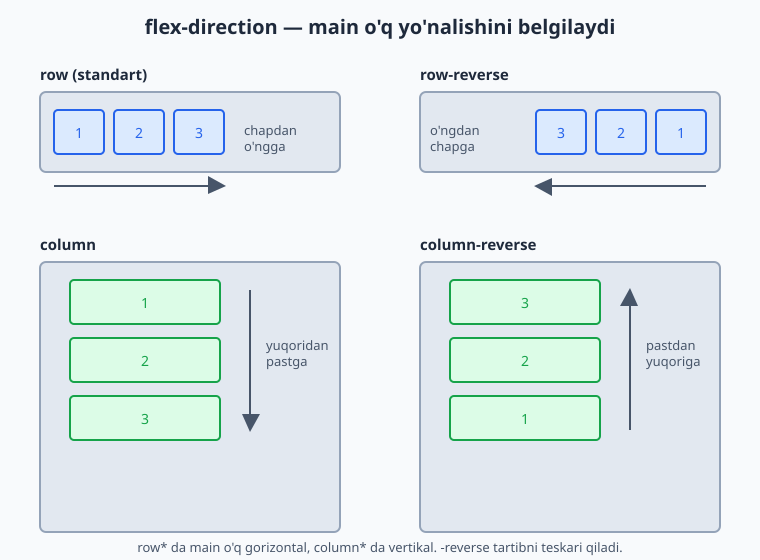
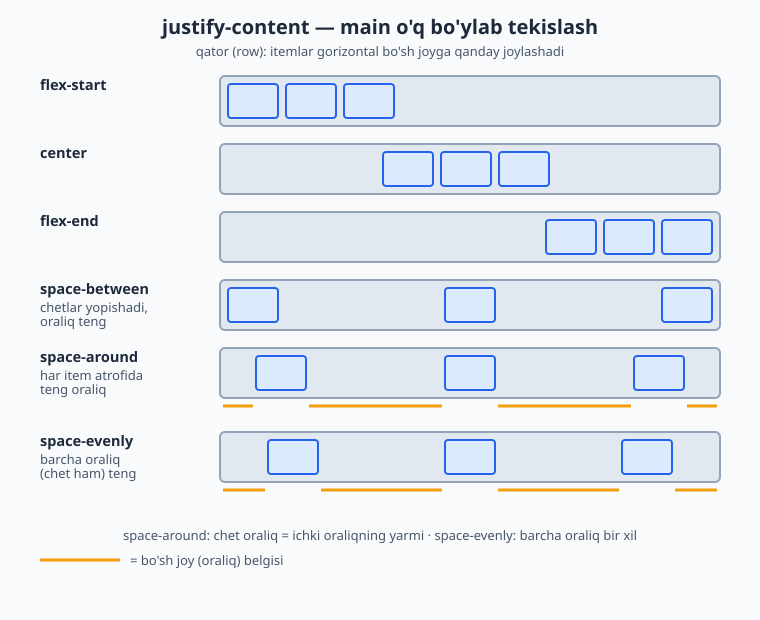
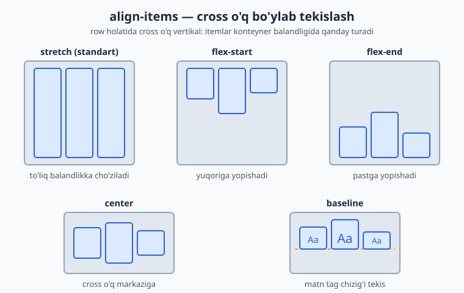
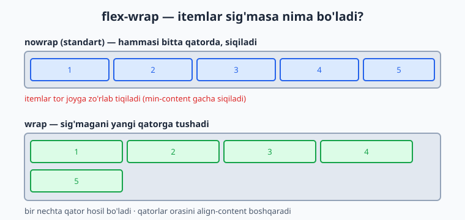
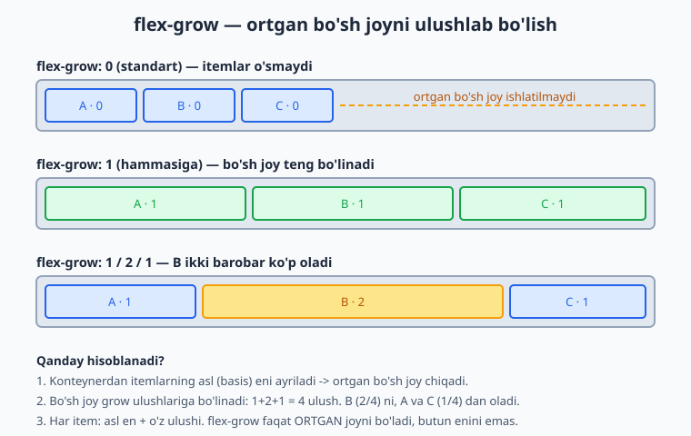

# 15 — Flexbox

[⬅️ Oldingi: 14 — Positioning va z-index](./14-positioning.md) · [🏠 README](./README.md) · [Keyingi: 16 — CSS Grid ➡️](./16-grid.md)

> **Bu bobda:** bir o'lchovli layout vositasi Flexbox bilan tanishamiz — flex konteyner, ikki o'q (main va cross) va elementlarni shu o'qlar bo'ylab tekislash hamda taqsimlashni 0 dan o'rganamiz.

---

## 15.1 Flexbox nima va u qanday muammoni yechadi?

Tasavvur qil: sahifaning yuqorisida navbar (navigation bar) yasamoqchisan — chap tomonda logotip, o'ng tomonda menyu havolalari. Yoki bitta tugmani ekranning aynan o'rtasiga — ham gorizontal, ham vertikal — joylashtirmoqchisan. Eski CSS'da bularning hammasi azob edi: `float`, `display: inline-block`, sehrli `margin` hiylalari... Ayniqsa **vertikal markazlash** boshlovchilar uchun haqiqiy bosh og'rig'i bo'lgan.

**Flexbox** (to'liq nomi *Flexible Box Layout*) — aynan shu muammolarni hal qilish uchun yaratilgan zamonaviy CSS layout tizimi. Uning bitta vazifasi bor: **elementlar guruhini bitta o'q (yo'nalish) bo'ylab tartibga solish** — ularni tekislash, oralarini bo'lish va bo'sh joyni aqlli taqsimlash.

📌 **Atama:** *flex* inglizcha "egiluvchan, moslashuvchan" degani. Nomi shundan: flex elementlari mavjud joyga qarab "egiladi" — kerak bo'lsa cho'ziladi, kerak bo'lsa siqiladi.

💡 **Hayotiy analogiya:** flexbox'ni javondagi kitoblar deb tasavvur qil. Sen "kitoblarni chapga tort", "teng oraliq bilan yoy" yoki "hammasini cho'zib javonni to'ldir" deb buyruq berasan — flexbox aynan shuni qiladi. Sen har bir kitobning aniq joyini hisoblab o'tirmaysan; faqat *qoidani* aytasan, joylashtirishni flexbox o'zi bajaradi.

### "Bir o'lchovli" nimani anglatadi?

Bu eng muhim tushuncha. Flexbox **bir o'lchovli** (one-dimensional) tizim: u elementlarni **bir vaqtning o'zida faqat bitta yo'nalishda** — yo **qator** (gorizontal), yo **ustun** (vertikal) — tartibga soladi.

- Navbar, tugmalar qatori, teglar ro'yxati — bir qator -> **flexbox**.
- Butun sahifa maketi (grid: ustunlar VA qatorlar bir vaqtda) — ikki o'lcham -> bu keyingi bobdagi **CSS Grid** ishi.

⚠️ Ko'p boshlovchi xato qiladi: butun murakkab sahifa tarmog'ini faqat flexbox bilan qurmoqchi bo'lib, qiynaladi. Eslab qol: **flexbox = bir qator yoki bir ustun**. Ikki o'lchovli to'r kerak bo'lsa, Grid ishlatasan.

---

## 15.2 Birinchi flex konteyner: `display: flex`

Flexbox'ni yoqish uchun atigi bitta qator kerak — ota elementga `display: flex` berasan. Shu zahoti uning **bevosita farzandlari** flex itemlarga aylanadi.

```html
<div class="qator">
  <div class="quti">A</div>
  <div class="quti">B</div>
  <div class="quti">C</div>
</div>
```

```css
.qator {
  display: flex;
}
.quti {
  background: #dbeafe;
  padding: 20px;
  border: 2px solid #2563eb;
}
```

**Natija:** A, B, C qutilar endi tepada-tepada (ustma-ust) emas, balki **yonma-yon** — bitta qatorda joylashadi.

Nega? Chunki `<div>` odatda **block** element — har biri butun qatorni egallab, keyingisini pastga suradi. `display: flex` esa ota'ni flex konteynerga aylantiradi va uning farzandlarini standart holatda **gorizontal qatorga** teradi.

📌 **Eng muhim atamalar — yodda tut:**

| Atama | Bu nima |
|---|---|
| **Flex konteyner** (container) | `display: flex` berilgan **ota** element. |
| **Flex item** | Konteynerning **bevosita farzandi** (har bir bola). |

⚠️ Faqat **bevosita** farzandlar flex item bo'ladi. Agar `.quti` ichida yana element bo'lsa, u **nabira** — flexga bo'ysunmaydi (toki u ham flex konteyner bo'lmaguncha).

💡 `display: inline-flex` ham bor: u konteynerni inline element kabi tutadi (atrofidagi matn bilan bir qatorda turadi), lekin ichida o'sha flex qoidalari ishlaydi. Ko'pincha `flex` ishlatasan; `inline-flex` kamroq kerak bo'ladi.

---

## 15.3 Ikki o'q: main o'q va cross o'q

Flexbox'ning butun mantig'i **ikki o'q** (axis) tushunchasiga asoslanadi. Buni tushunsang, qolgan hamma narsa joyiga tushadi.

- **Main o'q** (main axis, asosiy o'q) — itemlar **shu yo'nalish bo'ylab** teriladi. Standart holatda gorizontal (chapdan o'ngga).
- **Cross o'q** (cross axis, ko'ndalang o'q) — main o'qqa **perpendikulyar** (ko'ndalang) o'q. Standartda vertikal.


Nega bu shunchalik muhim? Chunki flexbox'dagi deyarli har bir xossa shu ikki o'qdan biriga "ulangan":

- **`justify-content`** — itemlarni **main o'q** bo'ylab joylashtiradi (taqsimlaydi).
- **`align-items`** — itemlarni **cross o'q** bo'ylab tekislaydi.

💡 **Eslab qolish hiylasi:** "justify" so'zidagi **j** = "joylashtirish" (main bo'ylab oqim), "align" = "tekislash" (cross bo'ylab). Adashganingda diagrammaga qaytib qara.

⚠️ Eng nozik joy: o'qlar **doimo gorizontal/vertikal emas!** Agar `flex-direction` ni o'zgartirsang (keyingi bo'lim), main o'q vertikal bo'lib qoladi va cross o'q gorizontal bo'ladi — shu bilan birga `justify-content` va `align-items` ning "yo'nalishi" ham aylanadi. Shuning uchun "chap/o'ng" emas, "main/cross" deb o'ylash kerak.

---

## 15.4 `flex-direction` — main o'qni burish

`flex-direction` xossasi main o'q **qaysi yo'nalishda** ketishini belgilaydi. To'rt qiymati bor:

| Qiymat | Main o'q | Itemlar tartibi |
|---|---|---|
| `row` (standart) | gorizontal | chapdan o'ngga |
| `row-reverse` | gorizontal | o'ngdan chapga |
| `column` | vertikal | yuqoridan pastga |
| `column-reverse` | vertikal | pastdan yuqoriga |



```css
.qator {
  display: flex;
  flex-direction: column;   /* endi itemlar ustun bo'lib teriladi */
}
```

**Natija:** A, B, C qutilar endi yonma-yon emas, **ustma-ust** (vertikal) joylashadi.

Nega bu muhim? Chunki `flex-direction: column` qilishingiz bilanoq **main o'q vertikal** bo'lib qoladi. Demak endi `justify-content` itemlarni **yuqori-past** bo'ylab boshqaradi, `align-items` esa **chap-o'ng** bo'ylab. Ko'p boshlovchi shu yerda chalkashadi:

⚠️ `flex-direction: column` da matnni vertikal markazlash uchun `align-items: center` emas, `justify-content: center` kerak bo'ladi — chunki o'qlar almashdi!

💡 **`-reverse` haqida:** u faqat **vizual** tartibni teskari qiladi, HTML'dagi haqiqiy tartibni emas. Bu skrinrider (screen reader) va Tab tartibiga ta'sir qilmaydi — shuning uchun `-reverse` ni faqat dizayn uchun ishlat, mazmun mantig'i uchun emas.

---

## 15.5 `justify-content` — main o'q bo'ylab taqsimlash

Endi eng ko'p ishlatiladigan xossaga keldik. `justify-content` itemlarni **main o'q bo'ylab** qanday taqsimlashni boshqaradi — ayniqsa konteynerda ortiqcha bo'sh joy bo'lsa.



| Qiymat | Nima qiladi |
|---|---|
| `flex-start` (standart) | itemlar main o'q **boshiga** yopishadi (row'da: chapga) |
| `center` | itemlar **markazga** to'planadi |
| `flex-end` | itemlar main o'q **oxiriga** yopishadi (row'da: o'ngga) |
| `space-between` | birinchi va oxirgi item **chetga** yopishadi, qolgan bo'sh joy ular orasiga **teng** bo'linadi |
| `space-around` | har item **atrofida** teng bo'sh joy (chetdagi oraliq ichkisining yarmicha) |
| `space-evenly` | **barcha** oraliq (chetlar ham) bir xil bo'ladi |

```css
.navbar {
  display: flex;
  justify-content: space-between;   /* logo chapda, menyu o'ngda */
}
```

**Natija:** birinchi element eng chapga, oxirgisi eng o'ngga yopishadi, oradagi bo'sh joy ular orasida qoladi — bu navbar uchun klassik tartib.

📌 **`space-*` uchligi farqi (ko'p so'raladigan savol):**
- `space-between`: chetlarda **bo'sh joy YO'Q**, faqat itemlar orasida.
- `space-around`: har item ikki yonida teng joy oladi — natijada chetdagi bo'sh joy ichki oraliqning **yarmiga** teng ko'rinadi.
- `space-evenly`: hamma joy, shu jumladan chetlar ham, **bir xil**.

💡 Agar item'lar konteynerni to'liq egallab tursa (ortiqcha joy yo'q), `justify-content` hech narsa qilmaydi — chunki taqsimlanadigan bo'sh joy yo'q. U faqat **ortgan bo'sh joyni** boshqaradi.

---

## 15.6 `align-items` — cross o'q bo'ylab tekislash

`align-items` itemlarni **cross o'q bo'ylab** (row'da: vertikal) tekislaydi. Bu — har bir item konteyner balandligida qayerda turishini hal qiladi.



| Qiymat | Nima qiladi |
|---|---|
| `stretch` (standart) | itemlar cross o'q bo'ylab **to'liq cho'ziladi** (agar balandlik berilmagan bo'lsa) |
| `flex-start` | itemlar cross o'q **boshiga** (row'da: yuqoriga) yopishadi |
| `flex-end` | itemlar cross o'q **oxiriga** (row'da: pastga) yopishadi |
| `center` | itemlar cross o'q **markaziga** keladi |
| `baseline` | itemlar matn **tag chizig'i** (baseline) bo'ylab tekislanadi |

```css
.qator {
  display: flex;
  align-items: center;   /* har xil balandlikdagi qutilar vertikal markazda */
}
```

**Natija:** turli balandlikdagi kartalar/qutilar endi yuqoridan emas, **markazdan** tekislanadi.

📌 **`stretch` haqida nega:** standart `stretch` bo'lgani uchun, balandlik bermagan flex itemlar avtomatik konteyner balandligiga cho'ziladi — shuning uchun yonma-yon turgan kartalar ko'pincha o'z-o'zidan teng balandlikda chiqadi. Bu juda foydali xulq.

💡 **`baseline` qachon kerak:** har xil shrift o'lchamidagi matnlarni bir qatorda tekislaganda — masalan katta sarlavha yonida kichik yorliq — `baseline` ularning matn pastki chizig'ini bir tekisda saqlaydi.

---

## 15.7 Sehrli markazlash: `justify-content` + `align-items`

Eski CSS'da eng qiyin masala — bir narsani ekran o'rtasiga to'liq joylashtirish — flexbox'da bor-yo'g'i uch qator:

```css
.markaz {
  display: flex;
  justify-content: center;   /* main bo'ylab markaz (gorizontal) */
  align-items: center;       /* cross bo'ylab markaz (vertikal)  */
  height: 100vh;             /* konteyner butun ekran balandligida */
}
```

```html
<div class="markaz">
  <button>Bosing</button>
</div>
```

**Natija:** tugma ekranning aynan markazida — ham gorizontal, ham vertikal — turadi.

💡 Bu — flexbox'ning "vizit kartochkasi". Yillar davomida dasturchilar izlagan "vertikal markazlash" yechimi shu. `justify-content: center` + `align-items: center` ni yodlab ol — har kuni kerak bo'ladi.

---

## 15.8 `flex-wrap` va `align-content` — ko'p qatorli flex

Standart holatda flex itemlar **bitta qatorga** tiqiladi — joy yetmasa siqiladi, lekin pastga tushmaydi. `flex-wrap` shuni o'zgartiradi.



| Qiymat | Nima qiladi |
|---|---|
| `nowrap` (standart) | hamma item bitta qatorda; joy yetmasa **siqiladi** |
| `wrap` | sig'magan itemlar **yangi qatorga** tushadi |
| `wrap-reverse` | xuddi `wrap`, lekin yangi qatorlar yuqoriga qarab qo'shiladi |

```css
.kartalar {
  display: flex;
  flex-wrap: wrap;   /* tor ekranda kartalar pastga ko'chadi */
}
```

**Natija:** ekran torayganda kartalar gorizontal siqilib xunuklashmaydi — ortig'i yangi qatorga tushadi. Bu responsiv (responsive) dizaynning oddiy va kuchli usuli.

### `align-content` — qatorlar orasini boshqarish

`flex-wrap: wrap` tufayli **bir nechta qator** hosil bo'lganda, `align-content` shu **qatorlar guruhini** cross o'q bo'ylab taqsimlaydi. Qiymatlari `justify-content` nikiga o'xshash: `flex-start`, `center`, `flex-end`, `space-between`, `space-around`, `space-evenly`, `stretch`.

⚠️ **Muhim farq — adashtirmang:**
- `align-items` — har bir **item'ni o'z qatori ichida** tekislaydi.
- `align-content` — faqat **bir nechta qator bo'lganda** ishlaydi va **qatorlar orasini** boshqaradi. Bitta qatorda u hech narsa qilmaydi.

---

## 15.9 `gap` — itemlar orasiga oson joy

Ilgari flex itemlar orasiga masofa qo'yish uchun har biriga `margin` berib, keyin chetdagi ortiqcha margin'ni o'chirish kerak edi — noqulay. Hozir buning **toza** yechimi bor: `gap`.

```css
.qator {
  display: flex;
  gap: 16px;          /* har item orasida 16px */
}
```

**Natija:** itemlar orasida bir tekis 16px masofa paydo bo'ladi — chetlarda ortiqcha bo'sh joy qoldirmasdan.

```css
.qator {
  gap: 20px 12px;   /* qatorlar orasi 20px, ustunlar orasi 12px (wrap bilan) */
}
```

💡 `gap` faqat **itemlar orasiga** joy qo'yadi, konteynerning ichki chetiga emas — aynan kerakli xulq. `justify-content: space-*` bilan emas, **aniq, bashorat qilinadigan** masofa kerak bo'lganda `gap` ishlat. Ikkalasini birga ham ishlatsa bo'ladi.

📌 `gap` Flexbox uchun barcha zamonaviy brauzerlarda ishlaydi — endi `margin` hiylalariga ehtiyoj yo'q.

---

## 15.10 Item xossalari: `flex-grow`, `flex-shrink`, `flex-basis`

Hozirgacha biz **konteynerga** beriladigan xossalarni ko'rdik. Endi **alohida item'larga** beriladigan xossalarga o'tamiz — ular item'ning o'lchamini main o'q bo'ylab boshqaradi.

### `flex-basis` — boshlang'ich o'lcham

`flex-basis` — item'ning **asl (boshlang'ich) o'lchami** main o'q bo'ylab, o'sish/qisqarish hisobga olinishidan oldin. U `width` o'rnini bosadi (row'da). Standart qiymati `auto` — ya'ni mazmun yoki `width` qancha bo'lsa, shuncha.

### `flex-grow` — bo'sh joyni ulushlab olish

`flex-grow` — konteynerda **ortgan bo'sh joy** bo'lsa, item undan **qancha ulush** olishini belgilaydi. Qiymati son (standart `0` — o'smaydi).



```css
.item {
  flex-grow: 1;   /* hamma item teng o'sib, butun joyni to'ldiradi */
}
```

Agar itemlarga `1`, `2`, `1` bersang — ortgan bo'sh joy `1+2+1 = 4` ulushga bo'linadi: o'rtadagi item ikki barobar ko'p oladi.

⚠️ **Eng ko'p uchraydigan tushunmovchilik:** `flex-grow: 2` item'ni "ikki barobar katta" qilmaydi! U faqat **ortgan bo'sh joyning** ikki barobar ulushini oladi. Yakuniy o'lcham = asl (basis) o'lcham + olingan ulush. Diagrammadagi hisob-kitobga e'tibor ber.

### `flex-shrink` — joy yetmaganda qisqarish

`flex-shrink` — joy **yetmaganda** item qanchalik **qisqarishini** belgilaydi (standart `1` — qisqaradi). `0` bersang, item **qisqarmaydi** (asl o'lchamini saqlaydi, kerak bo'lsa toshib chiqadi).

```css
.logo {
  flex-shrink: 0;   /* logo hech qachon siqilmasin */
}
```

💡 `flex-shrink: 0` — logotip, ikonka kabi qisqarib xunuklashmasligi kerak elementlar uchun juda foydali.

---

## 15.11 Qisqa `flex` yozuvi va `flex: 1`

Yuqoridagi uchta xossani alohida yozish o'rniga, ularni bitta `flex` qisqa (shorthand) xossasida birlashtirish mumkin — tartibi: `flex: <grow> <shrink> <basis>`.

```css
.item {
  flex: 1 1 0;   /* grow:1, shrink:1, basis:0 */
}
```

Eng ko'p ishlatiladigan yozuv — oddiygina **`flex: 1`**:

```css
.item {
  flex: 1;   /* = flex: 1 1 0% */
}
```

`flex: 1` ni hamma item'ga bersang, ular **butun konteynerni teng bo'lib** egallaydi — chunki `basis: 0` dan boshlanib, butun joyni teng o'zlashtiradi. Bu teng ustunlar yasashning eng oson usuli.

📌 **Foydali tayyor qiymatlar:**

| Yozuv | Ma'nosi |
|---|---|
| `flex: 1` | `1 1 0` — teng o'sadi, bo'sh joyni egallaydi |
| `flex: auto` | `1 1 auto` — mazmunga qarab o'sadi |
| `flex: none` | `0 0 auto` — qotib qoladi (o'smaydi, qisqarmaydi) |
| `flex: 0 0 200px` | aniq 200px, o'zgarmaydi |

💡 Amalda 99% holatda `flex: 1` yoki `flex: 0 0 <o'lcham>` yetadi. `flex` qisqa yozuvini afzal ko'r — u `flex-basis` ni ham aqlli standartga qo'yadi (alohida `flex-grow: 1` yozsang, `basis` `auto` bo'lib qolib, kutilmagan natija berishi mumkin).

---

## 15.12 `order` va `align-self` — alohida itemlarni boshqarish

### `order` — vizual tartibni o'zgartirish

`order` xossasi item'ning **ko'rsatilish tartibini** o'zgartiradi (standart `0`). Kichikroq `order` oldinroq, kattaroq keyinroq turadi.

```css
.muhim {
  order: -1;   /* HTML'da qayerda bo'lishidan qat'i nazar, birinchi ko'rinadi */
}
```

⚠️ `order` faqat **vizual** tartibni o'zgartiradi — HTML manba tartibi, Tab navigatsiyasi va skrinrider tartibi o'zgarmaydi. Shuning uchun mazmun mantig'i uchun emas, faqat vizual moslash uchun ishlat. Aks holda klaviatura foydalanuvchisi "sakrab" yuradigan, chalkash sahifa hosil bo'ladi.

### `align-self` — bitta item'ni alohida tekislash

`align-self` — `align-items` ni **bitta item uchun** bekor qiladi. Konteyner hamma item'ni bir xil tekislagan bo'lsa-da, bittasini boshqacha joylashtirishing mumkin.

```css
.qator {
  display: flex;
  align-items: flex-start;   /* hammasi yuqorida */
}
.alohida {
  align-self: flex-end;      /* faqat shu item pastda */
}
```

💡 `align-self` faqat **cross o'q** bo'ylab ishlaydi (align-items kabi). Main o'q bo'ylab bitta item'ni surish uchun `margin: auto` hiylasi bor (keyingi bo'lim).

📌 **Bonus — `margin: auto` hiylasi:** flex item'ga `margin-left: auto` bersang, u chap tomondagi butun bo'sh joyni "yutadi" va item'ni o'ngga itaradi. Navbarda bitta tugmani o'ng chetga surish uchun ajoyib usul: `.tugma { margin-left: auto; }`.

---

## 15.13 Amaliyot: navbar, markazlash va kartalar qatori

Endi o'rganganlarimizni uchta real misolda birlashtiramiz.

### 1) Responsiv navbar

```html
<nav class="navbar">
  <div class="logo">MySayt</div>
  <ul class="menu">
    <li><a href="#">Bosh</a></li>
    <li><a href="#">Xizmatlar</a></li>
    <li><a href="#">Aloqa</a></li>
  </ul>
</nav>
```

```css
.navbar {
  display: flex;
  align-items: center;            /* logo va menyu vertikal markazda */
  justify-content: space-between; /* logo chapda, menyu o'ngda */
  padding: 16px 24px;
  background: #f8fafc;
}
.menu {
  display: flex;     /* menyu ham flex — havolalar yonma-yon */
  gap: 24px;
  list-style: none;  /* nuqtalarni olib tashlash */
  margin: 0;
  padding: 0;
}
```

**Natija:** chap tomonda logotip, o'ng tomonda yonma-yon, oraliq 24px havolalar — klassik navbar. E'tibor ber: `<nav>` ham, `.menu` ham flex konteyner — ichma-ich flexbox keng tarqalgan amaliyot.

### 2) To'liq markaz

```css
.qahramon {
  display: flex;
  justify-content: center;
  align-items: center;
  height: 100vh;
  text-align: center;
}
```

**Natija:** ichidagi mazmun (sarlavha, tugma) ekran o'rtasida — qahramon (hero) bo'limlar uchun ideal.

### 3) Teng kenglikdagi kartalar qatori

```html
<div class="kartalar">
  <div class="karta">Karta 1</div>
  <div class="karta">Karta 2</div>
  <div class="karta">Karta 3</div>
</div>
```

```css
.kartalar {
  display: flex;
  gap: 20px;
  flex-wrap: wrap;   /* tor ekranda pastga ko'chsin */
}
.karta {
  flex: 1 1 200px;   /* asl 200px, lekin o'sib bo'sh joyni teng to'ldiradi */
  padding: 24px;
  border: 2px solid #94a3b8;
  border-radius: 8px;
}
```

**Natija:** keng ekranda uchta karta yonma-yon teng kenglikda, tor ekranda esa `flex-wrap` tufayli pastga ko'chadi. `flex: 1 1 200px` — har karta kamida 200px bo'lishini istaydi, lekin ortgan joyni teng bo'lib oladi. Bu — eng ko'p ishlatiladigan responsiv naqsh (pattern).

💡 Mana shu uch naqsh (navbar, markaz, kartalar) kundalik frontend ishining katta qismini qoplaydi. Ularni yodlab, o'zgartirib mashq qil — flexbox shu bilan "qo'lingga o'tiradi".

---

## Mashqlar

### Mashq 1 — Birinchi qator

Uchta `<div>` ni yonma-yon joylashtir. Hozir ular ustma-ust turibdi. Bitta CSS qatori bilan tuzat.

<details markdown="1"><summary>Yechim</summary>

```css
.konteyner {
  display: flex;
}
```

`display: flex` ota'ni flex konteynerga aylantiradi va bevosita farzandlarni standart `row` (gorizontal qator) bo'ylab teradi.

</details>

### Mashq 2 — To'liq markazlash

Bitta tugmani ekranning aynan o'rtasiga (ham gorizontal, ham vertikal) joylashtir.

<details markdown="1"><summary>Yechim</summary>

```css
.konteyner {
  display: flex;
  justify-content: center;  /* main (gorizontal) markaz */
  align-items: center;      /* cross (vertikal) markaz   */
  height: 100vh;            /* butun ekran balandligi    */
}
```

`justify-content` main o'q bo'ylab, `align-items` cross o'q bo'ylab markazlaydi. `height` bo'lmasa, konteyner faqat tugma balandligida bo'lib, vertikal markazlash ko'rinmaydi.

</details>

### Mashq 3 — Navbar tartibi

Navbarda logo chap chetda, menyu havolalari o'ng chetda bo'lsin. Qaysi `justify-content` qiymatini ishlatasan?

<details markdown="1"><summary>Yechim</summary>

```css
.navbar {
  display: flex;
  justify-content: space-between;
  align-items: center;
}
```

`space-between` birinchi item'ni (logo) eng chapga, oxirgisini (menyu) eng o'ngga yopishtiradi, oradagi bo'sh joyni esa ular orasiga qo'yadi.

</details>

### Mashq 4 — Teng ustunlar

Uchta item butun konteyner kengligini **teng** bo'lib egallasin. Eng qisqa yo'li qaysi?

<details markdown="1"><summary>Yechim</summary>

```css
.item {
  flex: 1;
}
```

`flex: 1` = `flex: 1 1 0`. `basis: 0` dan boshlanib, hamma item butun bo'sh joyni teng ulush bilan oladi — natijada uchala ustun bir xil kenglikda chiqadi.

</details>

### Mashq 5 — flex-grow hisobi

Konteyner kengligi 600px. Uchta item: har birining `flex-basis: 100px`, va `flex-grow` mos ravishda `1`, `2`, `3`. Har item yakuniy kengligi qancha bo'ladi?

<details markdown="1"><summary>Yechim</summary>

1. Asl egallangan joy: `100 + 100 + 100 = 300px`.
2. Ortgan bo'sh joy: `600 - 300 = 300px`.
3. Grow ulushlari: `1 + 2 + 3 = 6` ulush. Har ulush = `300 / 6 = 50px`.
4. Yakuniy:
   - Item 1: `100 + 1×50 = 150px`
   - Item 2: `100 + 2×50 = 200px`
   - Item 3: `100 + 3×50 = 250px`

Tekshirish: `150 + 200 + 250 = 600px`. To'g'ri. `flex-grow` faqat **ortgan** joyni bo'ladi, butun kenglikni emas.

</details>

### Mashq 6 — Vertikal ustun

Itemlarni yuqoridan pastga (ustun) tartibida joylashtir va ularni gorizontal markazga keltir.

<details markdown="1"><summary>Yechim</summary>

```css
.konteyner {
  display: flex;
  flex-direction: column;   /* main o'q endi vertikal */
  align-items: center;      /* cross o'q (gorizontal) bo'ylab markaz */
}
```

⚠️ `column` da o'qlar almashdi: cross o'q endi gorizontal, shuning uchun gorizontal markazlash uchun `align-items: center` to'g'ri. Agar vertikal taqsimlash kerak bo'lsa, `justify-content` ishlatasan.

</details>

### Mashq 7 — Qisqarmaydigan logo

Navbarda logo hech qachon siqilmasin, lekin yonidagi qidiruv maydoni qolgan bo'sh joyni egallasin.

<details markdown="1"><summary>Yechim</summary>

```css
.logo {
  flex: 0 0 auto;   /* o'smaydi, qisqarmaydi — asl o'lchamini saqlaydi */
}
.qidiruv {
  flex: 1;          /* qolgan butun joyni egallaydi */
}
```

`flex: 0 0 auto` (ya'ni `flex: none`) logoni qotirib qo'yadi: `grow:0` o'smaydi, `shrink:0` qisqarmaydi. `flex: 1` esa qidiruvni butun ortgan joyga cho'zadi.

</details>

### Mashq 8 — Bitta item'ni o'ngga itarish

Navbarda 4 ta tugma bor. Faqat oxirgi tugma ("Chiqish") o'ng chetga yopishsin, qolgan uchtasi chapda qator tursin. `margin` bilan yech.

<details markdown="1"><summary>Yechim</summary>

```css
.navbar {
  display: flex;
  gap: 12px;
}
.chiqish {
  margin-left: auto;   /* chapdagi butun bo'sh joyni yutadi -> o'ngga itaradi */
}
```

Flex item'ga `margin-left: auto` berilsa, u chap tomondagi mavjud bo'sh joyni to'liq egallaydi va item'ni o'ng chetga suradi. `justify-content` butun guruhga ta'sir qiladi; bitta item'ni surish uchun aynan shu `margin: auto` hiylasi ishlatiladi.

</details>

---

[⬅️ Oldingi: 14 — Positioning va z-index](./14-positioning.md) · [🏠 README](./README.md) · [Keyingi: 16 — CSS Grid ➡️](./16-grid.md)
