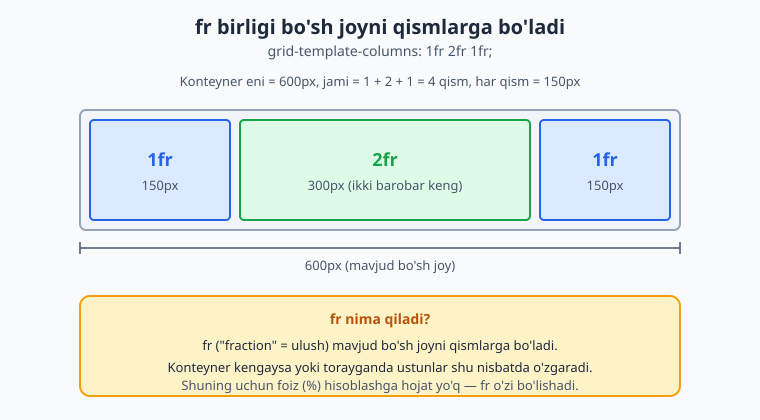
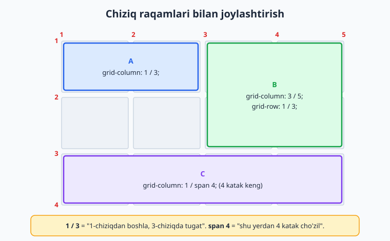
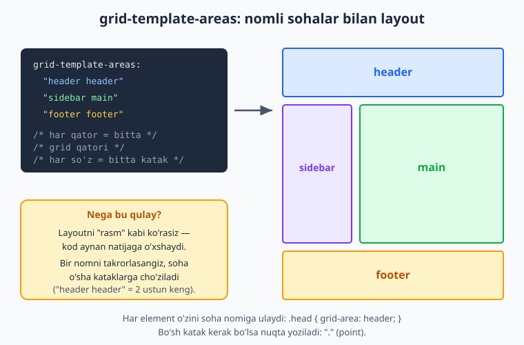
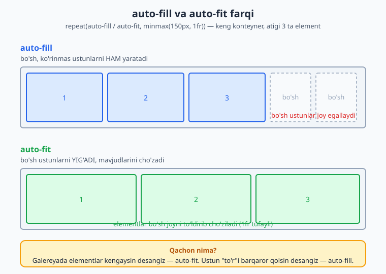

# 16 — CSS Grid

[⬅️ Oldingi: 15 — Flexbox](./15-flexbox.md) · [🏠 README](./README.md) · [Keyingi: 17 — Responsive dizayn ➡️](./17-responsive.md)

> **Bu bobda:** sahifani ikki o'lchovda — ustun va qator panjarasi sifatida — qurishni o'rganamiz: `grid-template-columns/rows`, `fr` birligi, `repeat()`, `gap`, chiziqlarga joylashtirish, nomli sohalar (`grid-template-areas`), tekislash va `auto-fill`/`auto-fit` bilan moslashuvchan layout.

---

## 16.1 Grid nima va nega kerak?

Avvalgi bobda Flexbox bilan tanishding. Flexbox ajoyib — lekin u **bir o'lchovli**: elementlarni yo bitta qatorga, yo bitta ustunga tizadi. Navbar, tugmalar qatori, kartochkalar zanjiri uchun bu yetadi.

Ammo butun sahifani tasavvur qil: yuqorida sarlavha (header), chapda menyu (sidebar), o'rtada asosiy mazmun (main), pastda footer. Bu **ikki o'lchovli** tuzilma — bir vaqtning o'zida ham ustunlar, ham qatorlar bor. Flexbox bilan buni qilish mumkin, lekin ko'p `div` ichiga `div` o'rab, ko'p qatlamli "ichma-ich" tuzilma yasashga to'g'ri keladi.

**CSS Grid** aynan shu muammoni hal qiladi. Grid — bu shaxmat taxtasi yoki Excel jadvali kabi **panjara**: sen ustunlar va qatorlarni e'lon qilasiz, keyin elementlarni shu panjaraning kerakli kataklariga joylashtirasiz.

📌 **Asosiy farq (Flexbox vs Grid):**

| | Flexbox | Grid |
|---|---|---|
| O'lcham | Bir o'lchovli (qator YOKI ustun) | Ikki o'lchovli (qator VA ustun) |
| Boshqaruv markazi | **Mazmun** boshqaradi (content-first) | **Layout** boshqaradi (layout-first) |
| Eng mos | Navbar, tugmalar, ro'yxat | Sahifa skeleti, galereya, dashboard |

💡 **Hayotiy analogiya:** Flexbox — bu bir tokchaga kitoblarni tizish (faqat eni bo'yicha). Grid — bu butun kitob javoni: ham gorizontal tokchalar, ham vertikal bo'limlar bir vaqtda.

⚠️ Grid Flexbox'ning "raqibi" emas — ular **birga** ishlaydi. Odatda sahifa skeletini Grid bilan, ichidagi mayda elementlarni Flexbox bilan qilamiz. Ikkalasini ham bilish kerak.

---

## 16.2 Grid atamalari: chiziq, yo'lak, katak, soha

Grid'ni o'rganishdan oldin uning "tili"ni bilib olaylik. Quyidagi diagrammada barcha asosiy atamalar yorliqlangan:


- **Grid container** (panjara konteyneri) — `display: grid` berilgan ota element. U panjarani belgilaydi.
- **Grid item** (panjara elementi) — konteynerning **bevosita farzandlari**. Faqat shular panjaraga bo'ysunadi.
- **Grid line** (chiziq) — ustun va qatorlarni ajratuvchi ko'rinmas chiziqlar. Ular **1 dan** boshlab raqamlanadi. 3 ta ustun bo'lsa, 4 ta vertikal chiziq bo'ladi (har ustunning ikki tomonida).
- **Grid track** (yo'lakcha) — ikki qo'shni chiziq orasidagi bo'shliq, ya'ni bitta ustun yoki bitta qator.
- **Grid cell** (katak) — bitta ustun va bitta qator kesishgan joy, panjaraning eng kichik birligi (jadvaldagi bitta yacheyka kabi).
- **Grid area** (soha) — bir nechta katakdan iborat to'rtburchak hudud.
- **Gap** (bo'shliq) — yo'laklar orasidagi masofa.

📌 Bu atamalarni hozir yodlash shart emas — quyida har birini amalda ko'rasiz. Lekin chiziqlar **1 dan boshlab raqamlanishini** eslab qol, chunki keyin elementlarni joylashtirishda aynan shu raqamlardan foydalanamiz.

---

## 16.3 Birinchi grid: `display: grid` va `grid-template-columns`

Grid'ni yoqish uchun ota elementga `display: grid` beramiz. Bu o'zi hech narsani o'zgartirmaydi — farzandlar baribir ustma-ust (bir ustunda) joylashadi. Sehr `grid-template-columns` bilan boshlanadi: u **nechta ustun** va **har biri qanchaligini** belgilaydi.

```html
<div class="panjara">
  <div class="katak">1</div>
  <div class="katak">2</div>
  <div class="katak">3</div>
  <div class="katak">4</div>
  <div class="katak">5</div>
  <div class="katak">6</div>
</div>
```

```css
.panjara {
  display: grid;
  grid-template-columns: 100px 100px 100px;
}
.katak {
  background: #dbeafe;
  padding: 20px;
  text-align: center;
}
```

**Natija:** 6 ta katak **3 ta ustunga** bo'linadi. Birinchi 3 tasi yuqori qatorga, keyingi 3 tasi pastki qatorga tushadi.

Nega bunday bo'ldi? `grid-template-columns: 100px 100px 100px` — "uchta ustun, har biri 100px keng" degani. Grid elementlarni **chapdan o'ngga** ustunlarga joylaydi; ustunlar tugagach, o'zi yangi qator ochib davom etadi. Qatorlar haqida bir og'iz aytmadik — Grid ularni avtomatik yaratdi (bu "implicit grid", 16.12'da ko'ramiz).

💡 Bir xil qiymatni qo'lda uch marta yozish zerikarli. Buni qisqartirish uchun `repeat()` bor (16.5).

---

## 16.4 `fr` birligi — bo'sh joyni ulashish

`px` bilan ustun belgilash qattiq (q'attiq) o'lcham beradi: ekran katta bo'lsa, o'ng tomonda bo'sh joy qoladi; kichik bo'lsa, ustunlar sig'maydi. Responsive layout uchun bizga **moslashuvchan** birlik kerak — bu `fr`.

`fr` — "fraction" (ulush) so'zining qisqartmasi. U **mavjud bo'sh joyni** qismlarga bo'ladi.

```css
.panjara {
  display: grid;
  grid-template-columns: 1fr 2fr 1fr;
}
```

Bu yerda jami `1 + 2 + 1 = 4` ulush bor. Grid bo'sh joyni 4 ga bo'ladi: birinchi ustun 1 ulush, ikkinchisi 2 ulush (ikki barobar keng), uchinchisi yana 1 ulush oladi.



`fr` ning eng kuchli tomoni — konteyner kengaysa yoki torayganda, ustunlar **shu nisbatda** birga o'zgaradi. Foiz (`%`) hisoblashga hojat yo'q.

📌 `fr` ni boshqa birliklar bilan **aralashtirish** mumkin:

```css
.panjara {
  display: grid;
  grid-template-columns: 200px 1fr 100px;
}
```

**Natija:** chap ustun aniq 200px, o'ng ustun aniq 100px, o'rtadagi `1fr` esa **qolgan hamma bo'sh joyni** egallaydi. Bu juda keng tarqalgan naqsh: chetlarda qat'iy o'lchamli paneller, o'rtada cho'ziluvchi mazmun.

⚠️ `fr` "umumiy enining ulushi" emas, balki **qolgan bo'sh joyning** ulushi. Agar `grid-template-columns: 200px 1fr 1fr` desangiz, avval 200px ajratiladi, keyin **qolgani** ikki `fr` orasida teng bo'linadi.

---

## 16.5 `repeat()` — takrorni qisqartirish

12 ta bir xil ustun yozish — `1fr 1fr 1fr ...` 12 marta — kulgili. `repeat()` funksiyasi buni qisqartiradi:

```css
.panjara {
  display: grid;
  grid-template-columns: repeat(3, 1fr);
}
```

`repeat(3, 1fr)` aynan `1fr 1fr 1fr` degani: "1fr ni 3 marta takrorla". Birinchi argument — necha marta, ikkinchisi — nimani.

`repeat()` ichida bir nechta qiymat ham bo'lishi mumkin, va uni boshqa qiymatlar bilan aralashtirsa ham bo'ladi:

```css
/* 6 ta ustun: 200px va 1fr navbatma-navbat takrorlanadi */
grid-template-columns: repeat(3, 200px 1fr);

/* boshida sidebar, keyin 4 ta teng ustun */
grid-template-columns: 250px repeat(4, 1fr);
```

💡 `repeat()` ayniqsa "12 ustunli grid tizimi" (Bootstrap kabi) yoki bir xil kartochkalar galereyasi uchun ajralmas. Uni `auto-fill`/`auto-fit` bilan birlashtirsa, haqiqiy responsive grid chiqadi (16.11).

`grid-template-rows` ham xuddi shunday ishlaydi — qatorlar balandligini belgilaydi:

```css
.panjara {
  display: grid;
  grid-template-columns: repeat(3, 1fr);
  grid-template-rows: 100px 200px; /* 1-qator 100px, 2-qator 200px */
}
```

---

## 16.6 `gap` — kataklar orasidagi bo'shliq

Kataklarni bir-biriga yopishtirib qo'yish chiroyli emas. Ularni ajratish uchun `gap` ishlatamiz:

```css
.panjara {
  display: grid;
  grid-template-columns: repeat(3, 1fr);
  gap: 16px;
}
```

**Natija:** har ustun va qator orasida 16px bo'shliq paydo bo'ladi.

📌 `gap` faqat **ichki** bo'shliqlarni qo'shadi — panjaraning tashqi chetlarida bo'shliq yaratmaydi. Bu `margin` dan qulayroq: `margin` bilan "oxirgi elementning ortiqcha bo'shlig'i" muammosi yo'q.

Bo'shliqni alohida boshqarish kerak bo'lsa:

```css
.panjara {
  row-gap: 24px;    /* qatorlar orasida */
  column-gap: 12px; /* ustunlar orasida */
}
```

`gap: 24px 12px` ham bir xil natija beradi (birinchisi — row-gap, ikkinchisi — column-gap).

💡 **Tarixiy eslatma:** ilgari bu xossa `grid-gap` deb atalgan edi. Hozir oddiy `gap` standart bo'lib, u Flexbox'da ham ishlaydi. Eski `grid-gap` ni yangi kodga yozmang.

---

## 16.7 Elementni joylashtirish: `grid-column` va `grid-row`

Hozirgacha elementlar avtomatik joylashdi. Lekin Grid'ning kuchi shundaki, **istalgan elementni istalgan katakka** qo'yish mumkin. Buning uchun chiziq raqamlaridan foydalanamiz.

Eslab qol: chiziqlar 1 dan boshlanadi. Element qaysi chiziqdan **boshlanishi** va qaysi chiziqda **tugashini** ko'rsatamiz:

```css
.element {
  grid-column: 1 / 3; /* 1-chiziqdan 3-chiziqgacha = 2 ta ustun keng */
  grid-row: 1 / 2;    /* 1-chiziqdan 2-chiziqgacha = 1 ta qator baland */
}
```

`grid-column: 1 / 3` ni "1-ustun chizig'idan boshla, 3-ustun chizig'ida tugat" deb o'qing. Oraliqda 1 va 2 ustunlar qoladi — demak element 2 ta ustunni egallaydi.



### `span` — "shuncha katak cho'z"

Ba'zan element qayerda tugashini emas, **nechta katak egallashini** bilamiz. Shunda `span` qulayroq:

```css
.element {
  grid-column: span 2; /* shu yerdan 2 ta ustun cho'zil */
  grid-row: span 3;    /* shu yerdan 3 ta qator cho'zil */
}
```

`grid-column: 2 / span 3` — "2-chiziqdan boshla va 3 ustun cho'zil" degani. Bu, ayniqsa, element qayerdan boshlanishi muhim, lekin kengligi nisbiy bo'lsa qulay.

### `-1` — oxirgi chiziq

Manfiy raqamlar **oxiridan** sanaydi: `-1` — eng oxirgi chiziq. Demak butun qatorni egallash uchun:

```css
.header {
  grid-column: 1 / -1; /* birinchi chiziqdan oxirgisigacha = butun en */
}
```

💡 `1 / -1` — eng ko'p ishlatiladigan naqshlardan biri: sarlavha yoki footer'ni butun panjara eni bo'ylab cho'zish uchun. Ustunlar soni o'zgarsa ham ishlayveradi.

---

## 16.8 `grid-template-areas` — nomli sohalar bilan layout

Chiziq raqamlari kuchli, lekin `grid-column: 2 / 4` ni o'qiganda nima bo'layotgani darrov ko'rinmaydi. CSS Grid'ning eng chiroyli imkoniyatlaridan biri — **kataklarga nom berib**, layoutni xuddi rasm chizgandek tasvirlash.

Avval konteynerda har qatorni "so'zlar xaritasi" sifatida chizamiz:

```css
.sahifa {
  display: grid;
  grid-template-columns: 200px 1fr;
  grid-template-rows: auto 1fr auto;
  grid-template-areas:
    "header  header"
    "sidebar main"
    "footer  footer";
  min-height: 100vh;
  gap: 12px;
}
```

Keyin har bir elementni `grid-area` orqali nomga ulaymiz:

```css
.head    { grid-area: header; }
.side    { grid-area: sidebar; }
.content { grid-area: main; }
.foot    { grid-area: footer; }
```

```html
<div class="sahifa">
  <header class="head">Header</header>
  <aside class="side">Sidebar</aside>
  <main class="content">Asosiy mazmun</main>
  <footer class="foot">Footer</footer>
</div>
```



E'tibor ber: `grid-template-areas` ichidagi matn **aynan natijaga o'xshaydi**. Kodga qarab layoutni "ko'rasiz". Bu — Grid'ning eng o'qiluvchan usuli.

📌 **Qoidalar:**
- Har bir tirnoq ichidagi satr — **bitta qator**. Bu yerda 3 ta satr bor, demak 3 ta qator.
- Har satrdagi so'zlar soni **ustunlar soniga** teng bo'lishi shart (bu yerda 2 ta).
- Bir nomni **takrorlasangiz**, soha o'sha kataklarga cho'ziladi: `"header header"` — header ikki ustunni egallaydi. Takrorlanuvchi kataklar **to'rtburchak** hosil qilishi shart (L-shaklida bo'lmaydi).
- **Bo'sh katak** kerak bo'lsa, bir yoki bir nechta **nuqta** (`.`) yoziladi: `"main ."`.

⚠️ Har satrni alohida tirnoqqa olishni unutmang. `"header header" "sidebar main"` bitta qatorda yozilsa ham ishlaydi, lekin yuqoridagidek alohida satrlarga yozish ancha o'qiluvchanroq.

💡 Eng zo'r tomoni: media query ichida faqat `grid-template-areas` ni qayta yozib, butun layoutni mobil ko'rinishga o'zgartirishingiz mumkin — elementlarning HTML tartibiga tegmasdan (16.13'da ko'ramiz).

---

## 16.9 Tekislash: elementlarni katak ichida joylash

Hozirgacha elementlar o'z kataklarini **to'ldirib** turardi (default `stretch`). Grid'da tekislashni boshqaradigan to'rtta asosiy xossa bor. Ularni ikki guruhga ajratish oson:

- **`justify-*`** — **gorizontal** o'q (ustun yo'nalishi, chap-o'ng).
- **`align-*`** — **vertikal** o'q (qator yo'nalishi, yuqori-past).

### Elementlarni kataklar ichida (`*-items`)

Konteynerga qo'yiladi, **barcha** elementlarga ta'sir qiladi:

```css
.panjara {
  display: grid;
  grid-template-columns: repeat(3, 1fr);
  grid-template-rows: repeat(2, 100px);
  justify-items: center; /* har element o'z katagida gorizontal markazda */
  align-items: center;   /* va vertikal markazda */
}
```

Qiymatlar: `start`, `end`, `center`, `stretch` (default).

📌 Bitta elementni alohida boshqarish kerak bo'lsa, o'sha elementga `justify-self` / `align-self` beriladi. Ular `*-items` ni shu element uchun bekor qiladi:

```css
.alohida {
  justify-self: end;  /* faqat bu element o'ng tomonda */
  align-self: start;  /* faqat bu element yuqorida */
}
```

### Butun panjarani konteyner ichida (`*-content`)

Agar panjaraning umumiy o'lchami konteynerdan **kichik** bo'lsa (masalan, ustunlar `px` bilan belgilangan va joy ortib qolsa), butun panjarani konteyner ichida joylash kerak bo'ladi:

```css
.panjara {
  justify-content: center; /* butun panjara gorizontal markazda */
  align-content: center;   /* butun panjara vertikal markazda */
}
```

Qiymatlar: `start`, `end`, `center`, `space-between`, `space-around`, `space-evenly`, `stretch`.

💡 **Farqni eslab qolish:** `*-items` / `*-self` — **elementlarni kataklar ichida** joylaydi. `*-content` — **butun panjarani konteyner ichida** joylaydi. `fr` ishlatsangiz panjara konteynerni to'la egallaydi, shuning uchun `*-content` ko'pincha faqat `px`/`auto` ustunlarda seziladi.

---

## 16.10 `minmax()` — eng kichik va eng katta o'lcham

Ko'pincha ustun "juda kichik bo'lmasin, lekin imkon bo'lsa kengaysin" deyiladi. `minmax(min, max)` aynan shuni beradi: ustunning eng kichik va eng katta o'lchamini belgilaydi.

```css
.panjara {
  display: grid;
  grid-template-columns: 200px minmax(300px, 1fr);
}
```

**Natija:** o'ng ustun **kamida** 300px bo'ladi, lekin joy bo'lsa `1fr` bo'lib cho'ziladi. Ekran torayganda ham 300px dan past tushmaydi.

📌 `minmax(0, 1fr)` — muhim hiyla. Default holda `fr` ustunlari ichidagi mazmun (uzun matn, katta rasm) ularni minimal o'lchamdan kengaytirib yuborishi mumkin, bu esa layoutni "portlatadi". `minmax(0, 1fr)` minimumni `0` ga tushirib, ustunlarning haqiqatan teng bo'lishini ta'minlaydi.

```css
/* matn juda uzun bo'lsa ham ustunlar teng qoladi */
grid-template-columns: repeat(3, minmax(0, 1fr));
```

`minmax()` ning eng kuchli qo'llanishi keyingi bo'limda — responsive galereya.

---

## 16.11 `auto-fill` va `auto-fit` — chinakam responsive grid

Mana CSS Grid'ning eng sehrli qismi. Tasavvur qil: kartochkalar galereyasi kerak, har kartochka kamida 200px, lekin ekran qanchalik keng bo'lsa, shuncha ko'p kartochka bir qatorga sig'sin — **media query'siz**.

`repeat()` ichida son o'rniga `auto-fill` yoki `auto-fit` yozamiz:

```css
.galereya {
  display: grid;
  grid-template-columns: repeat(auto-fit, minmax(200px, 1fr));
  gap: 16px;
}
```

Buni shunday o'qing: "har biri kamida 200px bo'lgan, joy bo'lsa cho'ziluvchi (`1fr`) ustunlarni **iloji boricha ko'p** yarat". Ekran kengaysa — yangi ustun qo'shiladi; torayganda — ustunlar pastga tushadi. Sehrli responsive grid bitta qatorda!

### `auto-fill` va `auto-fit` farqi

Ular elementlar **konteynerni to'ldirmaganda** farq qiladi:

- **`auto-fill`** — joy yetganicha ustun "uyasi" yaratadi, hatto **bo'sh** bo'lsa ham. Elementlar tugagach, qolgan joyda ko'rinmas bo'sh ustunlar turadi.
- **`auto-fit`** — bo'sh ustunlarni **yig'ib tashlaydi (collapse)**, mavjud elementlarni `1fr` bilan butun joyga cho'zadi.



📌 **Qaysi birini tanlash?**
- Elementlar bo'sh joyni **to'ldirib cho'zilsin** desangiz — `auto-fit`.
- Ustun "to'r"i **barqaror** qolsin, elementlar belgilangan kenglikda turaversin desangiz — `auto-fill`.

Ko'p hollarda galereya uchun `auto-fit` tabiiyroq ko'rinadi.

💡 Bu naqsh — "RAM (Repeat, Auto, Minmax)" deb ataladi va zamonaviy CSS'da eng mashhur responsive texnikalardan biri. Bir qatorda butun moslashuvchan galereya tayyor.

---

## 16.12 Implicit va explicit grid, `grid-auto-rows`

`grid-template-columns` va `grid-template-rows` bilan e'lon qilingan panjara — **explicit grid** (aniq belgilangan panjara). Lekin elementlar belgilangandan ko'p bo'lsa-chi?

```css
.panjara {
  display: grid;
  grid-template-columns: repeat(3, 1fr);
  grid-template-rows: 100px; /* faqat 1 qator e'lon qildik */
}
```

Agar bu panjaraga 7 ta element joylasak — birinchi 3 tasi e'lon qilingan 100px qatorga tushadi, qolganlari uchun Grid **avtomatik yangi qatorlar** yaratadi. Bu yangi qatorlar — **implicit grid** (yashirin panjara).

Muammo: avtomatik qatorlar default `auto` balandlikda bo'ladi (ya'ni mazmunga qarab). Ularni bir xil qilish uchun `grid-auto-rows`:

```css
.panjara {
  grid-template-columns: repeat(3, 1fr);
  grid-auto-rows: 100px; /* avtomatik yaratiladigan har qator 100px */
}
```

**Natija:** nechta element bo'lishidan qat'i nazar, hamma qatorlar 100px bo'ladi. Bu — element soni oldindan noma'lum (masalan, ma'lumotlar bazasidan keluvchi ro'yxat) bo'lganda juda foydali.

📌 Xuddi shunday `grid-auto-columns` ham bor — u elementlar gorizontal yo'nalishda oqsa (`grid-auto-flow: column`) ishlaydi.

`grid-auto-flow` esa elementlar bo'sh kataklarni qanday to'ldirishini boshqaradi:
- `row` (default) — qatorma-qator (chapdan o'ngga, keyin pastga).
- `column` — ustunma-ustun (yuqoridan pastga, keyin o'ngga).
- `dense` — Grid bo'sh qolgan kataklarni "orqaga qaytib" to'ldirishga harakat qiladi (galereyada teshiklarni yopish uchun).

```css
.panjara {
  grid-auto-flow: dense; /* bo'sh joylarni keyingi sig'adigan element bilan to'ldir */
}
```

⚠️ `dense` chiroyli ko'rinsa-da, u elementlarning **vizual tartibini** o'zgartiradi (HTML tartibidan farqli). Bu klaviatura/skrinrider foydalanuvchilari uchun chalkashlik tug'dirishi mumkin, shuning uchun ehtiyot bo'l.

---

## 16.13 Amaliy: to'liq sahifa layout

Endi o'rganganlarimizni birlashtirib, klassik "holy grail" sahifa skeletini quramiz: header, sidebar, main, footer — va u mobilda bitta ustunga aylansin.

```html
<div class="sahifa">
  <header class="head">Logotip va menyu</header>
  <aside class="side">Yon panel</aside>
  <main class="content">Asosiy mazmun</main>
  <footer class="foot">Footer ma'lumotlari</footer>
</div>
```

```css
* { box-sizing: border-box; }

.sahifa {
  display: grid;
  grid-template-columns: 220px 1fr;
  grid-template-rows: auto 1fr auto;
  grid-template-areas:
    "header  header"
    "sidebar main"
    "footer  footer";
  gap: 16px;
  min-height: 100vh;
  padding: 16px;
}

.head    { grid-area: header;  background: #dbeafe; padding: 16px; }
.side    { grid-area: sidebar; background: #ede9fe; padding: 16px; }
.content { grid-area: main;    background: #dcfce7; padding: 16px; }
.foot    { grid-area: footer;  background: #fef3c7; padding: 16px; }

/* Mobil: 700px dan tor ekranda bitta ustun */
@media (max-width: 700px) {
  .sahifa {
    grid-template-columns: 1fr;
    grid-template-areas:
      "header"
      "main"
      "sidebar"
      "footer";
  }
}
```

Diqqat: mobil versiyada biz faqat `grid-template-columns` va `grid-template-areas` ni qayta yozdik. HTML'ga **umuman tegmadik**. Hatto `sidebar` ni `main` dan **keyinga** qo'ydik — vizual tartib o'zgardi, lekin HTML tartibi o'sha-o'sha qoldi. Bu — Grid'ning eng kuchli ustunliklaridan biri.

💡 `grid-template-rows: auto 1fr auto` naqshini eslab qol: header va footer mazmuniga qarab (`auto`), o'rtadagi main esa qolgan **butun balandlikni** (`1fr`) egallaydi. `min-height: 100vh` bilan birga footer hamisha ekran tubida (yoki pastida) turadi — "sticky footer".

---

## 16.14 Amaliy: galereya va dashboard

### Responsive rasm galereyasi

Media query'siz, o'z-o'zidan moslashuvchi galereya:

```css
.galereya {
  display: grid;
  grid-template-columns: repeat(auto-fit, minmax(180px, 1fr));
  grid-auto-rows: 180px;
  gap: 12px;
}
.galereya img {
  width: 100%;
  height: 100%;
  object-fit: cover; /* rasm katakni to'ldirsin, nisbati buzilmasin */
  border-radius: 8px;
}
```

Bitta rasmni **kattaroq** qilib ajratib ko'rsatish (masonry kabi effekt):

```css
.galereya .katta {
  grid-column: span 2; /* ikki ustun keng */
  grid-row: span 2;    /* ikki qator baland */
}
```

### Dashboard (boshqaruv paneli)

Dashboard — turli o'lchamdagi "kartochkalar" (widgetlar) panjarasi. Grid bu yerda yorqin ko'rinadi:

```css
.dashboard {
  display: grid;
  grid-template-columns: repeat(4, 1fr);
  grid-auto-rows: 160px;
  gap: 20px;
}

/* katta statistika kartasi — 2x2 */
.karta--katta { grid-column: span 2; grid-row: span 2; }

/* keng grafik — butun en bo'ylab */
.karta--grafik { grid-column: 1 / -1; }

/* oddiy kartalar bitta katakni egallaydi (alohida qoida shart emas) */
```

```html
<div class="dashboard">
  <div class="karta karta--katta">Asosiy KPI</div>
  <div class="karta">Foydalanuvchilar</div>
  <div class="karta">Daromad</div>
  <div class="karta">Buyurtmalar</div>
  <div class="karta karta--grafik">Oylik grafik</div>
</div>
```

**Natija:** turli o'lchamdagi kartalar 4 ustunli panjarada tartibli joylashadi. `span` va `1 / -1` orqali ba'zilari kengroq/balandroq bo'ladi, qolganlari bo'sh kataklarni to'ldiradi.

📌 Diqqat qil: bu yerda Grid sahifa skeletini, har kartaning **ichidagi** mazmun (sarlavha + raqam + ikonka) esa odatda Flexbox bilan tekislanadi. Ikkalasi birga — zamonaviy layoutning poydevori.

---

## 16.15 Tez-tez uchraydigan xatolar va maslahatlar

⚠️ **`gap` o'rniga `margin` ishlatish.** Kataklar orasini `margin` bilan ajratish chetlarda ortiqcha bo'shliq qoldiradi va hisoblashni murakkablashtiradi. `gap` ishlatish — ancha toza yechim.

⚠️ **Bevosita bo'lmagan farzandlar.** Faqat konteynerning **to'g'ridan-to'g'ri** farzandlari grid item bo'ladi. Agar `.katak` ni yana bir `div` ichiga o'rasangiz, u panjaraga bo'ysunmaydi.

⚠️ **`fr` ustunlarining "portlashi".** Uzun matn yoki katta element `1fr` ustunni minimal o'lchamdan kengaytirib yuborishi mumkin. Yechim: `minmax(0, 1fr)`.

💡 **DevTools Grid inspektorini ishlat.** Chrome/Firefox DevTools'da `display: grid` elementi yonida kichik "grid" yorlig'i chiqadi. Uni bosing — brauzer chiziq raqamlari, yo'laklar va sohalarni ekranda chizib beradi. Grid'ni o'rganishda bundan foydali narsa yo'q.

💡 **Grid'mi yoki Flexbox'mi?** Agar element **bir yo'nalishda** tizilsa (navbar, tugmalar) — Flexbox. Agar **ham ustun, ham qatorni** bir vaqtda boshqarish kerak bo'lsa (sahifa skeleti, galereya, jadval kabi tuzilma) — Grid. Ikkilanmang: ko'pincha ikkalasini birga ishlatasiz.

📌 **Brauzer qo'llab-quvvatlashi.** CSS Grid 2017-yildan beri barcha zamonaviy brauzerlarda to'liq ishlaydi. Bugun uni xavfsiz ishlatish mumkin — `-prefix` larga ehtiyoj yo'q.

---

## Mashqlar

Quyidagi mashqlarni brauzerda (yoki Chrome DevTools Grid inspektorida) sinab ko'r. Avval o'zing javob ber, keyin yechimni och.

### Mashq 1 — Uchta teng ustun

`display: grid` ishlatib, 6 ta kartochkani 3 ta **teng kenglikdagi** ustunga joylashtir, kataklar orasida 16px bo'shliq bo'lsin.

<details markdown="1"><summary>Yechim</summary>

```css
.panjara {
  display: grid;
  grid-template-columns: repeat(3, 1fr);
  gap: 16px;
}
```

`repeat(3, 1fr)` uchta teng ustun beradi, `gap: 16px` esa bo'shliqni. `1fr` (foiz emas) tanlangani uchun ustunlar har qanday ekranda teng qoladi.

</details>

### Mashq 2 — Sidebar + cho'ziluvchi mazmun

Chap tomonda aniq **250px** sidebar, o'ng tomonda **qolgan butun joyni** egallaydigan mazmun ustuni yaratuvchi `grid-template-columns` ni yoz.

<details markdown="1"><summary>Yechim</summary>

```css
.layout {
  display: grid;
  grid-template-columns: 250px 1fr;
}
```

Sidebar qat'iy `250px`, `1fr` esa qolgan bo'sh joyni to'liq egallaydi. Ekran kengaysa, faqat o'ng ustun cho'ziladi.

</details>

### Mashq 3 — Butun qatorni egallash

4 ustunli panjarada bitta sarlavha elementini **butun en** bo'ylab cho'zmoqchisiz. Ustunlar soni keyin o'zgarsa ham ishlaydigan ikki xil yo'lini yoz.

<details markdown="1"><summary>Yechim</summary>

```css
/* 1-usul: oxirgi chiziqqa cho'z (ustunlar soniga bog'liq emas) */
.sarlavha { grid-column: 1 / -1; }

/* 2-usul: span bilan (faqat shu holatda, 4 ustun uchun) */
.sarlavha { grid-column: span 4; }
```

`1 / -1` afzalroq, chunki ustunlar soni o'zgarganda ham avtomatik moslashadi.

</details>

### Mashq 4 — Nomli sohalar bilan layout

`grid-template-areas` ishlatib quyidagi layoutni yarat: yuqorida butun en bo'ylab `nav`, ostida chapda `sidebar`, o'ngda `main`, eng pastda butun en bo'ylab `footer`.

<details markdown="1"><summary>Yechim</summary>

```css
.sahifa {
  display: grid;
  grid-template-columns: 200px 1fr;
  grid-template-areas:
    "nav     nav"
    "sidebar main"
    "footer  footer";
  gap: 12px;
}
.sahifa nav     { grid-area: nav; }
.sahifa aside   { grid-area: sidebar; }
.sahifa main    { grid-area: main; }
.sahifa footer  { grid-area: footer; }
```

`nav` va `footer` ikki ustunni qamragani uchun nom ikki marta takrorlandi.

</details>

### Mashq 5 — Responsive galereya

Media query **ishlatmasdan**, har biri kamida 220px bo'lgan, ekran kengaytganda avtomatik ko'payadigan va bo'sh joyni to'ldirib cho'ziladigan kartochkalar galereyasini yoz.

<details markdown="1"><summary>Yechim</summary>

```css
.galereya {
  display: grid;
  grid-template-columns: repeat(auto-fit, minmax(220px, 1fr));
  gap: 16px;
}
```

`auto-fit` bo'sh ustunlarni yig'ib, mavjud kartochkalarni `1fr` bilan cho'zadi. `minmax(220px, 1fr)` — "kamida 220px, joy bo'lsa kengay". Bu — "RAM" naqshi.

</details>

### Mashq 6 — Markazga joylash

Panjara ichidagi **barcha** elementlarni o'z kataklarining ham gorizontal, ham vertikal markaziga joylashtir.

<details markdown="1"><summary>Yechim</summary>

```css
.panjara {
  display: grid;
  grid-template-columns: repeat(3, 1fr);
  grid-template-rows: repeat(2, 120px);
  justify-items: center; /* gorizontal markaz */
  align-items: center;   /* vertikal markaz */
}
```

`justify-items` gorizontal (ustun) o'qni, `align-items` vertikal (qator) o'qni boshqaradi. Faqat bitta element uchun bo'lsa `justify-self`/`align-self` ishlatilardi.

</details>

### Mashq 7 — Element joylashtirish (chiziq raqamlari)

5 ustunli panjarada bitta elementni **2-ustundan boshlab 3 ustun keng** va **1-qatordan 2 qator baland** qilib joylashtir.

<details markdown="1"><summary>Yechim</summary>

```css
.element {
  grid-column: 2 / span 3; /* 2-chiziqdan boshla, 3 ustun cho'zil (2..5) */
  grid-row: 1 / span 2;    /* 1-chiziqdan boshla, 2 qator cho'zil (1..3) */
}
```

`grid-column: 2 / 5` ham aynan shu natijani beradi (2-chiziqdan 5-chiziqgacha = 3 ustun).

</details>

### Mashq 8 — Implicit grid balandligi

Element soni oldindan noma'lum bo'lgan ro'yxat bor. 3 ustunli panjarada nechta element bo'lishidan qat'i nazar, **har qator aniq 140px** bo'lishini ta'minla.

<details markdown="1"><summary>Yechim</summary>

```css
.royxat {
  display: grid;
  grid-template-columns: repeat(3, 1fr);
  grid-auto-rows: 140px; /* avtomatik yaratiladigan qatorlar 140px */
  gap: 12px;
}
```

`grid-template-rows` emas, balki `grid-auto-rows` ishlatildi, chunki qatorlar (element soniga qarab) avtomatik — ya'ni implicit grid'da yaratiladi.

</details>

---

[⬅️ Oldingi: 15 — Flexbox](./15-flexbox.md) · [🏠 README](./README.md) · [Keyingi: 17 — Responsive dizayn ➡️](./17-responsive.md)
