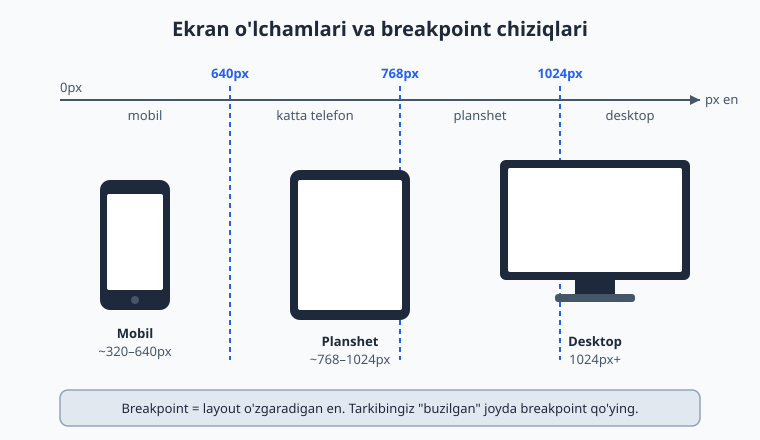
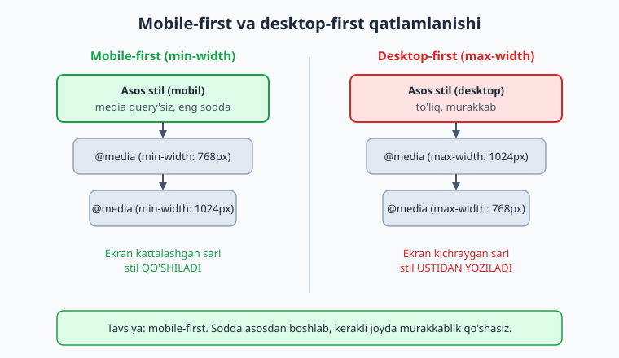
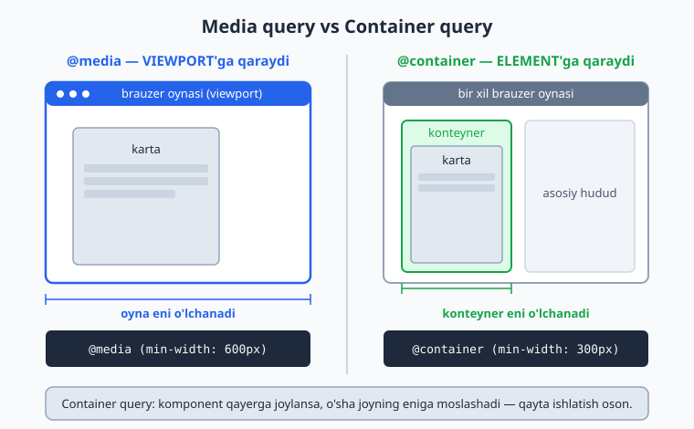

# 17 — Responsive dizayn

[⬅️ Oldingi: 16 — CSS Grid](./16-grid.md) · [🏠 README](./README.md) · [Keyingi: 18 — Transitions, transforms va animatsiyalar ➡️](./18-transitions-transforms-animations.md)

> **Bu bobda:** bitta sahifani har qanday ekranga — telefon, planshet, desktop — moslashtirishni o'rganamiz: media query, mobile-first yondashuv, fluid layout va `clamp()` bilan moslashuvchan tipografiya.

---

## 17.1 Responsive nima va nega kerak?

Tasavvur qil: sen chiroyli sahifa yasading va u 27 dyumli monitoringda ajoyib ko'rinadi. Keyin do'sting uni telefonida ochadi — matn mayda, tugmalar bir-biriga yopishgan, sahifani o'qish uchun ikki barmoq bilan kattalashtirish kerak. Tanish holat, to'g'rimi?

**Responsive dizayn** (responsive design — "javob beradigan dizayn") — bu bitta sahifaning **o'zi ekran o'lchamiga qarab o'zgarishi**. Telefonda bir ustun, planshetda ikki ustun, desktopda uch ustun — lekin HTML bitta, sahifa ham bitta.

Nega bu shunchalik muhim?

- **Foydalanuvchilarning yarmidan ko'pi telefon orqali kiradi.** Agar saytingiz telefonda noqulay bo'lsa, ular ketadi.
- **Bitta kod — barcha qurilmalar.** "Mobil versiya" va "desktop versiya" deb ikki alohida sayt qilish — eskirgan, qimmat va xatolarga to'la usul.
- **Google mobil-do'stlikni reyting omili sifatida ko'radi.** Yomon moslashgan sayt qidiruvda pastroq turadi.

📌 **Atamalar:** **viewport** — brauzer oynasining sahifa ko'rinadigan qismi (ko'rinish maydoni). **breakpoint** — layout o'zgaradigan ekran eni (sindirish nuqtasi). **fluid** — qattiq piksel o'rniga foiz/nisbat bilan "oqadigan" o'lcham.

Quyidagi diagramma uchta asosiy qurilma sinfini va tipik breakpoint chiziqlarini ko'rsatadi:



---

## 17.2 Viewport meta tegi — birinchi qadam (eslatma)

7-bobda viewport meta tegini ko'rgan eding. Bu — responsive dizaynning **poydevori**, shuning uchun qisqacha eslatib o'tamiz: usiz hech qanday media query ishlamaydi.

```html
<meta name="viewport" content="width=device-width, initial-scale=1.0">
```

Bu nima qiladi? Telefon brauzerlari tarixiy sabablarga ko'ra sahifani **980px keng** deb hisoblab, keyin uni kichraytirib ko'rsatadi (shuning uchun moslashmagan saytlar telefonda kichkina ko'rinadi). `width=device-width` brauzerga: "sahifa eni qurilmaning **haqiqiy** eni bilan teng bo'lsin" deb aytadi. `initial-scale=1.0` esa boshlang'ich kattalashtirishni 1:1 qilib qo'yadi.

⚠️ **Eng keng tarqalgan xato:** responsive CSS yozasiz, lekin viewport tegini `<head>` ga qo'shishni unutasiz. Natijada media query'lar telefonda **umuman ishlamaydi**, chunki brauzer eni hali ham 980px deb o'ylaydi. Yangi sahifa boshlaganda bu teg birinchi yoziladigan narsalardan bo'lsin.

---

## 17.3 Media query — sintaksis

**Media query** (media so'rovi) — bu CSS'ga "agar ekran shu shartga mos kelsa, mana bu stillarni qo'lla" deyish usuli. Sintaksis `@media` bilan boshlanadi:

```css
/* Asosiy stil — barcha ekranlarga */
.menu {
  display: block;
}

/* Faqat eni 768px va undan KATTA ekranlarda */
@media (min-width: 768px) {
  .menu {
    display: flex;
  }
}
```

Ichidagi qoidalar **faqat shart bajarilganda** kuchga kiradi. Yuqorida: `.menu` odatda `block` (har element alohida qatorda), lekin ekran 768px dan keng bo'lsa — `flex` (yonma-yon).

### Asosiy shartlar

| Shart | Ma'nosi |
|---|---|
| `(min-width: 768px)` | eni **768px va undan katta** bo'lsa |
| `(max-width: 767px)` | eni **767px va undan kichik** bo'lsa |
| `screen` | media turi: ekran (chop etish emas) |

### `and`, `or` va vergul

Shartlarni birlashtirish mumkin:

```css
/* HAM min, HAM max — ya'ni 768px dan 1023px gacha bo'lgan oraliq */
@media (min-width: 768px) and (max-width: 1023px) {
  .karta { background: #f8fafc; }
}

/* YOKI — vergul "or" vazifasini bajaradi */
@media (max-width: 600px), (orientation: portrait) {
  .panel { display: none; }
}
```

- `and` — ikkala shart ham bajarilishi kerak.
- Vergul (`,`) — **or** (yoki): shartlardan **bittasi** bajarilsa kifoya.
- `screen and (min-width: 768px)` — media turini ham qo'shsangiz bo'ladi, lekin amalda `screen` ni ko'pincha tushirib qoldiramiz, chunki standart shart shunday ham yetarli.

💡 **Eslatma:** zamonaviy CSS yangi sintaksisni ham qo'llab-quvvatlaydi: `@media (width >= 768px)`. Bu `(min-width: 768px)` bilan bir xil, faqat o'qish osonroq. Brauzer qo'llab-quvvatlashini tekshirib, bemalol foydalansangiz bo'ladi.

---

## 17.4 Mobile-first yondashuv — nega aynan shunday?

Endi muhim falsafiy savol: media query'larni qaysi tomondan yozish kerak — kichikdan kattagami yoki kattadan kichikkami? Ikki yo'l bor.

**Desktop-first** (kattadan kichikka): asosiy stilni desktop uchun yozasiz, keyin `max-width` bilan kichik ekranlar uchun ustidan o'zgartirasiz.

**Mobile-first** (kichikdan kattaga): asosiy stilni eng sodda — mobil — holatga yozasiz, keyin `min-width` bilan kattaroq ekranlarga murakkablik **qo'shasiz**.

Zamonaviy amaliyot — **mobile-first**. Nega?

1. **Sodda asos.** Mobil layout odatda eng oddiy (bir ustun, vertikal). Murakkab narsani qo'shish, murakkabni soddalashtirishdan oson.
2. **Tezlik.** Eski/zaif telefonlar `max-width` ichidagi murakkab desktop qoidalarini baribir o'qib, keyin bekor qiladi. Mobile-first'da telefon faqat o'ziga kerakli sodda qoidalarni oladi.
3. **Mantiqiy o'sish.** "Ekran kattalashdi — endi nima qo'shaman?" deb fikrlash, "ekran kichrayd — nimani olib tashlayman?" dan tabiiyroq.



Mobile-first ko'rinishi:

```css
/* ASOS: mobil (media query'siz) */
.grid {
  display: grid;
  grid-template-columns: 1fr;   /* bitta ustun */
  gap: 16px;
}

/* Planshet va undan katta: ikki ustun */
@media (min-width: 768px) {
  .grid {
    grid-template-columns: 1fr 1fr;
  }
}

/* Desktop: uch ustun */
@media (min-width: 1024px) {
  .grid {
    grid-template-columns: 1fr 1fr 1fr;
  }
}
```

**Natija:** telefonda kartalar tik bir ustun bo'lib chiqadi, planshetda ikkitadan, desktopda uchtadan. Diqqat qil — asos qoidasi **eng sodda**, har breakpoint faqat o'zgargan narsani qo'shadi.

---

## 17.5 Tipik breakpoint'lar

Qaysi enlarda breakpoint qo'yish kerak? **Sehrli raqamlar yo'q**, lekin amaliyotda quyidagilar keng tarqalgan (ko'p framework'lar shularga yaqin):

| Breakpoint | Tipik qurilma |
|---|---|
| `480px` | katta telefon |
| `640px` | telefon / kichik planshet chegarasi |
| `768px` | planshet (portret) |
| `1024px` | planshet (landshaft) / kichik laptop |
| `1280px` | desktop |

💡 **Eng yaxshi maslahat — tarkibga qarab breakpoint qo'ying, qurilmaga emas.** Brauzer oynasini asta torting: layout qayerda **xunuklashadi** (matn juda cho'zilib ketdi, kartalar siqildi), o'sha joyda breakpoint qo'ying. Aniq telefon modeliga moslashishga urinish behuda — har yili yangi o'lchamlar chiqadi.

⚠️ **Xato:** o'nlab breakpoint qo'yib, har biriga alohida stil yozish. Bu kodni boshqarib bo'lmas holga keltiradi. Odatda 2–3 ta yaxshi tanlangan breakpoint yetarli. Eng yaxshi responsive layout — **breakpoint kam talab qiladigan** layout (keyingi bo'limlarda buni qanday qilishni ko'ramiz).

---

## 17.6 Fluid layout — "oqadigan" tartib

Media query — bu **sakrash**: 767px da bir ko'rinish, 768px da boshqasi. Lekin orada-chi? Bu yerda **fluid layout** yordamga keladi: qattiq piksel o'rniga **nisbiy** o'lchamlar ishlatamiz, shunda tartib har enga **silliq** moslashadi.

### Foiz (`%`) bilan

```css
.container {
  width: 90%;        /* ota elementning 90% i — har enda mos */
  max-width: 1200px; /* lekin 1200px dan oshmasin */
  margin: 0 auto;    /* markazga */
}
```

`width: 90%` — eni har doim ota elementning 90% i bo'ladi, ya'ni ekran bilan birga oqadi. `max-width: 1200px` esa juda keng monitorlarda matn cheksiz cho'zilib ketishining oldini oladi.

📌 Bu naqsh — `width: 90%` + `max-width` + `margin: 0 auto` — eng ko'p ishlatiladigan "konteyner" retsepti. Yodlab oling.

### Flexbox va Grid bilan (eng kuchli usul)

15- va 16-boblarda o'rgangan flexbox/grid o'zi tabiatan fluid. `fr` birligi va `flex` xossasi joyni nisbatda taqsimlaydi:

```css
/* Grid: ustunlar joyga avtomatik moslashadi, media query'siz! */
.galereya {
  display: grid;
  grid-template-columns: repeat(auto-fill, minmax(200px, 1fr));
  gap: 16px;
}
```

Bu sehrli qatorni ochib beraylik:

- `minmax(200px, 1fr)` — har ustun **kamida 200px**, joy bo'lsa **1fr** gacha cho'ziladi.
- `auto-fill` — joyga **qancha** ustun sig'sa, shunchasini yaratadi.

**Natija:** ekran kengaysa, ustunlar soni o'zi ko'payadi; torayganda — kamayadi. Bitta ham `@media` yozmadik! Aynan shu — modern responsive'ning go'zalligi: **layoutni o'zi moslashuvchan qil, breakpoint'larga kamroq tayan.**

---

## 17.7 Fluid tipografiya: `clamp()`, `min()`, `max()`

Tartib oqadi — yaxshi. Ammo shrift o'lchami-chi? Telefonda 32px sarlavha juda katta, desktopda 18px sarlavha juda kichik. Eski yechim: har breakpointda `font-size` ni qo'lda o'zgartirish. Zamonaviy yechim — **`clamp()`**.

`clamp()` uchta qiymat oladi:

```css
font-size: clamp(MIN, AFZAL, MAX);
```

- **MIN** — eng kichik ruxsat etilgan qiymat (pol).
- **AFZAL** — odatda ekranga bog'liq qiymat (masalan `2.5vw`), u o'sib boradi.
- **MAX** — eng katta ruxsat etilgan qiymat (shift).

Brauzer AFZAL qiymatni hisoblaydi, lekin uni MIN dan past, MAX dan baland chiqishiga yo'l qo'ymaydi.

```css
h1 {
  font-size: clamp(1.5rem, 5vw, 3rem);
}
```

**Natija:** kichik telefonda sarlavha 1.5rem (24px), ekran kengaygan sari `5vw` bilan silliq o'sadi, katta ekranda 3rem (48px) da to'xtaydi. **Bitta ham media query yo'q.**


📌 **`vw` nima?** `vw` (viewport width) — viewport enining 1% i. `5vw` = ekran enining 5% i. Shuning uchun u ekran bilan birga o'sadi.

### `min()` va `max()` — yakka tartibda ham foydali

`clamp()` ning yarim aka-ukalari:

```css
/* Kenglik: 90% YOKI 600px — qaysi KICHIK bo'lsa */
.matn { width: min(90%, 600px); }

/* Padding: 16px YOKI 3vw — qaysi KATTA bo'lsa */
.qism { padding: max(16px, 3vw); }
```

- `min(a, b)` — ikkisidan **kichigini** tanlaydi (shift vazifasi: "bundan kattalashmasin").
- `max(a, b)` — ikkisidan **kattasini** tanlaydi (pol vazifasi: "bundan kichiklashmasin").

💡 Aslida `clamp(A, B, C)` aynan `max(A, min(B, C))` bilan teng — `clamp()` shunchaki uni qisqaroq yozish usuli.

⚠️ **Xato:** `font-size`'da faqat `vw` ishlatish (`font-size: 5vw`). Juda kichik ekranda matn o'qib bo'lmas darajada mayda, juda katta ekranda esa ulkan bo'ladi. **Doim `clamp()` bilan chegaralang.**

---

## 17.8 Responsive rasmlar — qisqacha eslatma

3-bobda batafsil ko'rgan edik, shuning uchun bu yerda faqat eslatib o'tamiz: responsive sahifada rasmlar ham ekranga moslashishi kerak.

**Eng asosiy qadam** — har rasm konteyneridan oshib ketmasin:

```css
img {
  max-width: 100%;
  height: auto;
}
```

`max-width: 100%` — rasm hech qachon ota elementidan keng bo'lmaydi. `height: auto` — nisbat saqlanadi (rasm cho'zilmaydi).

Tezlik uchun esa har qurilmaga **mos o'lchamdagi** faylni yuborish kerak — bu `srcset` va `<picture>` bilan qilinadi (3-bobni eslang):

```html

```

Brauzer ekran eni va `sizes` ga qarab `srcset` dan eng mos faylni tanlaydi — telefonga kichik fayl, desktopga katta fayl. Bu trafikni tejaydi va sahifani tezlashtiradi.

---

## 17.9 Container queries — element o'lchamiga qarash

Mana, responsive'ning eng yangi va kuchli quroli. Media query'ning bitta cheklovi bor: u doim **butun viewport** o'lchamiga qaraydi. Lekin ko'pincha bizga kerakli narsa — **komponentning o'zi joylashgan joyning** o'lchami.

Misol: bir "mahsulot kartasi" komponenti bor. U keng asosiy hududda turganda — gorizontal (rasm chapda, matn o'ngda). Tor yon ustunda turganda — vertikal (rasm tepada). Media query bu yerda ojiz: viewport bir xil bo'lsa-da, **kartaning eni** ikki joyda har xil!

**Container query** aynan shu muammoni hal qiladi: u stilni viewport'ga emas, **ota konteyner o'lchamiga** qarab qo'llaydi.



Ikki qadamda ishlaydi. Avval ota elementni "konteyner" deb e'lon qilamiz:

```css
.karta-joyi {
  container-type: inline-size;   /* eni kuzatiladigan konteyner */
}
```

Keyin `@container` bilan farzandni konteyner eniga qarab o'zgartiramiz:

```css
/* Asos: vertikal (rasm tepada) */
.karta {
  display: grid;
  grid-template-columns: 1fr;
}

/* Konteyner eni 400px dan oshsa: gorizontal */
@container (min-width: 400px) {
  .karta {
    grid-template-columns: 150px 1fr;  /* rasm | matn */
  }
}
```

**Natija:** bitta `.karta` komponenti keng joyda gorizontal, tor joyda vertikal ko'rinadi — viewport emas, **o'z konteyneri** qancha keng ekaniga qarab. Endi shu kartani saytning istalgan joyiga qo'ysangiz, u o'zini to'g'ri tutadi.

💡 **Nega bu o'yinni o'zgartiradi?** Komponentlar endi **chinakam mustaqil** bo'ladi. Avval har komponent "men sahifaning qayerida turibman?" deb bosh qotirardi; endi u faqat "menga qancha joy berildi?" deb so'raydi. Bu — qayta ishlatiladigan komponentlar uchun ideal.

📌 Container query'lar 2023 yildan barcha yirik brauzerlarda qo'llab-quvvatlanadi. Eski brauzerlarni qo'llab-quvvatlash zarur bo'lsa, media query'ni zaxira sifatida qoldiring.

---

## 17.10 Foydalanuvchi afzalliklari: `prefers-color-scheme` va `prefers-reduced-motion`

Media query faqat ekran o'lchamini emas, foydalanuvchining **tizim sozlamalarini** ham o'qiy oladi. Ikkitasi ayniqsa muhim.

### `prefers-color-scheme` — qorong'i/yorug' rejim

Foydalanuvchi telefonini "tungi rejim"ga qo'ygan bo'lsa, saytingiz ham unga moslashishi mumkin:

```css
/* Asos: yorug' rejim */
body {
  background: #ffffff;
  color: #1e293b;
}

/* Foydalanuvchi qorong'i rejimni tanlagan bo'lsa */
@media (prefers-color-scheme: dark) {
  body {
    background: #1e293b;
    color: #f8fafc;
  }
}
```

**Natija:** tizimi qorong'i rejimda bo'lgan foydalanuvchi saytni ham qorong'i ko'radi — ko'zga qulay, batareyani tejaydi.

### `prefers-reduced-motion` — kamroq harakat

Ba'zi odamlar uchun ekrandagi animatsiyalar bosh aylanishi yoki ko'ngil aynishiga sabab bo'ladi (vestibulyar buzilish). Ular tizimida "harakatni kamaytir" ni yoqishadi. Bunga hurmat ko'rsatamiz:

```css
/* Asos: silliq animatsiya */
.tugma {
  transition: transform 0.3s;
}

/* Foydalanuvchi kamroq harakat so'ragan bo'lsa: animatsiyani o'chir */
@media (prefers-reduced-motion: reduce) {
  .tugma {
    transition: none;
  }
}
```

💡 Bu — **accessibility** (qulaylik) masalasi. Responsive dizayn faqat ekran o'lchami emas — bu **har bir foydalanuvchiga** uning ehtiyojiga ko'ra moslashishdir.

---

## 17.11 Amaliy: bitta layoutni mobil va desktopga moslash

Endi o'rgangan hamma narsani birlashtirib, to'liq, ishlaydigan responsive sahifa quramiz. Maqsad: mobil-first, fluid, `clamp()` bilan tipografiya.

```html
<!DOCTYPE html>
<html lang="uz">
<head>
  <meta charset="UTF-8">
  <meta name="viewport" content="width=device-width, initial-scale=1.0">
  <title>Responsive sahifa</title>
</head>
<body>
  <header class="sayt-bosh">
    <div class="logo">Mening Saytim</div>
    <nav class="menu">
      <a href="#">Bosh</a>
      <a href="#">Mahsulotlar</a>
      <a href="#">Aloqa</a>
    </nav>
  </header>

  <main class="grid">
    <article class="karta">Karta 1</article>
    <article class="karta">Karta 2</article>
    <article class="karta">Karta 3</article>
  </main>
</body>
</html>
```

```css
/* ===== ASOS: mobil (media query'siz) ===== */
* { box-sizing: border-box; margin: 0; }

body {
  font-family: system-ui, sans-serif;
  color: #1e293b;
}

/* Sarlavha tipografiyasi — fluid, clamp bilan */
.logo {
  font-size: clamp(1.25rem, 4vw, 2rem);
  font-weight: bold;
}

/* Header: mobilda tik (logo tepada, menyu pastda) */
.sayt-bosh {
  display: flex;
  flex-direction: column;
  gap: 8px;
  padding: max(16px, 3vw);
  background: #f8fafc;
}

.menu {
  display: flex;
  flex-direction: column;
  gap: 8px;
}

/* Konteyner: fluid, lekin chegaralangan */
.grid {
  width: min(92%, 1100px);
  margin: 24px auto;
  display: grid;
  grid-template-columns: 1fr;   /* mobilda 1 ustun */
  gap: 16px;
}

.karta {
  padding: 24px;
  background: #e2e8f0;
  border-radius: 8px;
}

/* ===== PLANSHET: 768px+ ===== */
@media (min-width: 768px) {
  .sayt-bosh {
    flex-direction: row;             /* logo va menyu yonma-yon */
    justify-content: space-between;
    align-items: center;
  }
  .menu { flex-direction: row; }     /* menyu gorizontal */
  .grid { grid-template-columns: 1fr 1fr; }  /* 2 ustun */
}

/* ===== DESKTOP: 1024px+ ===== */
@media (min-width: 1024px) {
  .grid { grid-template-columns: 1fr 1fr 1fr; }  /* 3 ustun */
}
```

**Natija va tahlil:**

- **Telefonda:** logo va menyu tik joylashadi, kartalar bir ustun bo'lib chiqadi. Sarlavha `clamp()` tufayli mos o'lchamda.
- **Planshetda (768px+):** header gorizontal bo'ladi (`flex-direction: row`), menyu yonma-yon, kartalar ikki ustun.
- **Desktopda (1024px+):** kartalar uch ustun.
- **Hamma yerda:** konteyner `min(92%, 1100px)` bilan oqadi, lekin 1100px dan oshmaydi.

Diqqat qil — asos stil **butunlay mobil** uchun yozilgan va media query'siz ham mukammal ishlaydi. Har breakpoint faqat **kerakli o'zgarishni qo'shadi**. Aynan shu — mobile-first'ning amaliy ko'rinishi.

💡 **Sinab ko'rish:** bu kodni faylga saqlang, brauzerda oching va oyna chetidan **asta torting**. Layoutning har breakpointda o'zgarishini o'z ko'zingiz bilan ko'rasiz. DevTools'dagi "qurilma rejimi" (device mode) ham buning uchun ajoyib vosita.

---

## Mashqlar

**1-mashq.** Quyidagi sahifa telefonda buzilib ko'rinadi — matn mayda, gorizontal scroll chiqadi. `<head>` ga bitta qator qo'shib tuzating.

```html
<head>
  <meta charset="UTF-8">
  <title>Mening saytim</title>
</head>
```

<details markdown="1"><summary>Yechim</summary>

Viewport meta tegi yetishmayapti. Usiz brauzer sahifani 980px deb hisoblaydi:

```html
<head>
  <meta charset="UTF-8">
  <meta name="viewport" content="width=device-width, initial-scale=1.0">
  <title>Mening saytim</title>
</head>
```

Bu — responsive dizaynning birinchi va eng muhim qadami. Usiz hech qanday media query ishlamaydi.

</details>

**2-mashq.** `.qator` klassiga shunday CSS yozing: ekran **600px dan keng** bo'lsa, `display: flex` bo'lsin; aks holda (sukut bo'yicha) `display: block` qolsin. Mobile-first usulda yozing.

<details markdown="1"><summary>Yechim</summary>

```css
/* Asos (mobil): block */
.qator {
  display: block;
}

/* 600px+ : flex */
@media (min-width: 600px) {
  .qator {
    display: flex;
  }
}
```

Asos qoidasi sodda holatga, media query esa kattaroq ekranga murakkablik qo'shadi — bu mobile-first naqshining mohiyati.

</details>

**3-mashq.** `h1` sarlavhasiga fluid tipografiya bering: hech qachon **20px** (1.25rem) dan kichik va **40px** (2.5rem) dan katta bo'lmasin, orada `6vw` bo'yicha o'ssin.

<details markdown="1"><summary>Yechim</summary>

```css
h1 {
  font-size: clamp(1.25rem, 6vw, 2.5rem);
}
```

Tartib: `clamp(MIN, AFZAL, MAX)`. MIN — pol, MAX — shift, o'rtadagi `6vw` — silliq o'sib boruvchi afzal qiymat. Bironta ham media query kerak emas.

</details>

**4-mashq.** Grid galereya yarating: ustunlar **kamida 220px**, joy bo'lsa avtomatik ko'paysin, oralig'i 20px. **Bitta ham media query ishlatmang.**

<details markdown="1"><summary>Yechim</summary>

```css
.galereya {
  display: grid;
  grid-template-columns: repeat(auto-fill, minmax(220px, 1fr));
  gap: 20px;
}
```

`auto-fill` + `minmax(220px, 1fr)` kombinatsiyasi joyga qarab ustunlar sonini o'zi hisoblaydi — bu media query'siz responsive layoutning klassik usuli.

</details>

**5-mashq.** Konteyner shunday bo'lsin: eni ota elementning **90%** i, lekin hech qachon **800px** dan oshmasin, gorizontal markazda tursin. Avval ikki xossa bilan, keyin `min()` bilan bitta qatorda yozing.

<details markdown="1"><summary>Yechim</summary>

An'anaviy usul:

```css
.container {
  width: 90%;
  max-width: 800px;
  margin: 0 auto;
}
```

`min()` bilan en bitta qatorda:

```css
.container {
  width: min(90%, 800px);
  margin: 0 auto;
}
```

`min(90%, 800px)` — ikkisidan kichigini tanlaydi: tor ekranda 90% (kichik), keng ekranda 800px (kichik). Natija `width` + `max-width` bilan bir xil.

</details>

**6-mashq.** Foydalanuvchi tizimida **qorong'i rejim**ni tanlagan bo'lsa, `body` foni `#1e293b`, matn rangi `#f8fafc` bo'lsin. Yorug' rejim asos bo'lib qolsin.

<details markdown="1"><summary>Yechim</summary>

```css
/* Asos: yorug' rejim */
body {
  background: #ffffff;
  color: #1e293b;
}

/* Qorong'i rejim */
@media (prefers-color-scheme: dark) {
  body {
    background: #1e293b;
    color: #f8fafc;
  }
}
```

`prefers-color-scheme` foydalanuvchining tizim sozlamasini o'qiydi — ekran o'lchamiga aloqasi yo'q, lekin u ham media query orqali ishlaydi.

</details>

**7-mashq (qiyinroq).** `.karta-joyi` ni eni kuzatiladigan konteynerga aylantiring, so'ng ichidagi `.karta` shu **konteyner eni 350px dan oshganda** ikki ustunli grid (`120px 1fr`) bo'lsin. Boshqa hollarda bir ustunli qolsin.

<details markdown="1"><summary>Yechim</summary>

```css
/* 1) Otani konteyner deb e'lon qilamiz */
.karta-joyi {
  container-type: inline-size;
}

/* 2) Asos: bir ustun */
.karta {
  display: grid;
  grid-template-columns: 1fr;
}

/* 3) Konteyner 350px dan oshsa: ikki ustun */
@container (min-width: 350px) {
  .karta {
    grid-template-columns: 120px 1fr;
  }
}
```

E'tibor bering: `@container` viewport'ga emas, `.karta-joyi` ning **eniga** qaraydi. Shuning uchun bu kartani saytning keng yoki tor istalgan joyiga qo'ysangiz, u o'zini o'sha joyga moslab tutadi.

</details>

**8-mashq (debugging).** Quyidagi media query telefonda **umuman ishlamayapti**, garchi CSS sintaksisi to'g'ri bo'lsa ham. HTML faylda nima yetishmayotganini toping.

```html
<!DOCTYPE html>
<html>
<head>
  <title>Test</title>
  <link rel="stylesheet" href="style.css">
</head>
...
```

```css
@media (max-width: 600px) {
  body { font-size: 14px; }
}
```

<details markdown="1"><summary>Yechim</summary>

CSS to'g'ri — muammo HTML'da: **viewport meta tegi yo'q**. Usiz telefon brauzeri sahifa enini 980px deb hisoblaydi, shuning uchun `max-width: 600px` sharti **hech qachon** bajarilmaydi (980 > 600).

Tuzatish — `<head>` ga qo'shish:

```html
<meta name="viewport" content="width=device-width, initial-scale=1.0">
```

Bu eng tez-tez uchraydigan responsive xato: CSS to'g'ri yozilgan, lekin viewport tegi unutilgan. Media query "ishlamayotgani"da birinchi shuni tekshiring.

</details>

---

[⬅️ Oldingi: 16 — CSS Grid](./16-grid.md) · [🏠 README](./README.md) · [Keyingi: 18 — Transitions, transforms va animatsiyalar ➡️](./18-transitions-transforms-animations.md)
