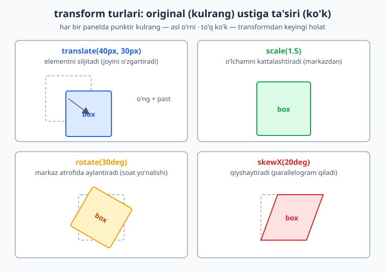
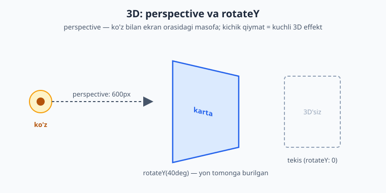
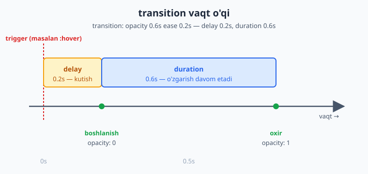
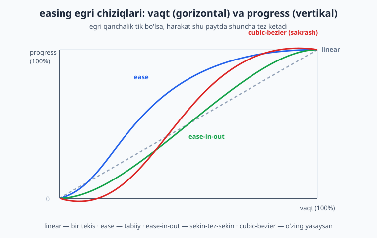

# 18 — Transitions, transforms va animatsiyalar

[⬅️ Oldingi: 17 — Responsive dizayn](./17-responsive.md) · [🏠 README](./README.md) · [Keyingi: 19 — Zamonaviy CSS ➡️](./19-zamonaviy-css.md)

> **Bu bobda:** harakat va o'zgarishlar — `transform` bilan elementni siljitish/aylantirish/kattalashtirish, `transition` bilan o'zgarishlarni silliq qilish va `@keyframes` bilan to'liq animatsiyalar yaratishni 0 dan o'rganamiz.

---

## 18.1 Nega harakat kerak? (va nega ehtiyot bo'lish kerak)

Hozirgacha sen yaratgan sahifalar **statik** edi: tugmaning rangi bir zumda o'zgarardi, modal oyna birdan paydo bo'lardi. Bu ishlaydi, lekin "qo'pol" tuyuladi. Haqiqiy saytlarda tugma ustiga sichqonchani olib borsang, rang **silliq** o'zgaradi; menyu **sirpanib** ochiladi; yuklanish belgisi **aylanadi**.

Bu uchta texnologiya bilan amalga oshadi:

- **`transform`** — elementning *ko'rinishini* o'zgartiradi: siljitish, aylantirish, kattalashtirish, qiyshaytirish. (Bu o'zi harakat emas — bu shunchaki "yangi holat".)
- **`transition`** — ikki holat orasini *silliq* o'tkazadi. (Holatdan holatga ko'prik.)
- **`@keyframes` + `animation`** — ko'p bosqichli, o'zi-o'zidan aylanadigan to'liq animatsiya.

💡 **Hayotiy analogiya:** `transform` — bu rasmning *yangi kadri* (qo'l yuqorida). `transition` — eski kadrdan yangisiga *silliq o'tish*. `@keyframes` — bu *butun multfilm* (ko'p kadrlar ketma-ket).

⚠️ **Eng muhim ogohlantirish (oldindan):** harakat foydalanuvchini *xursand* qilishi ham, *bezdirishi* yoki hatto *kasal qilishi* ham mumkin. Ba'zi odamlar uchun ko'p harakat bosh og'rig'i yoki ko'ngil aynishiga sabab bo'ladi (vestibulyar buzilish). Shuning uchun bu bobning oxirida `prefers-reduced-motion` ni o'rganamiz — bu majburiy, "yaxshi bo'lsa qo'shamiz" emas. Animatsiya — bezak, asosiy funksiya emas: sayt animatsiyasiz ham to'liq ishlashi shart.

---

## 18.2 `transform`: translate (siljitish)

`transform` xossasi elementni **vizual jihatdan** o'zgartiradi, lekin uning sahifadagi **haqiqiy o'rnini** (layout'dagi joyini) o'zgartirmaydi. Bu juda muhim nuqta — keyin tushuntiramiz.

Eng sodda transform — `translate` (ko'chirish):

```css
.box {
  transform: translate(40px, 30px);
}
```

Bu elementni o'ng tomonga `40px`, pastga `30px` siljitadi. Faqat bitta o'qni xohlasang:

```css
.a { transform: translateX(40px); }   /* faqat gorizontal */
.b { transform: translateY(-20px); }  /* faqat vertikal (yuqoriga) */
```

📌 **Foiz qiymatlar elementning o'z o'lchamiga nisbatan.** `translateX(100%)` elementni *o'z eni qadar* o'ngga siljitadi. Bu markazlashtirish hiylasida juda foydali (`translate(-50%, -50%)`).

💡 **`top/left` (position) dan farqi:** 14-bobdagi `position` bilan `top`/`left` ham elementni siljitadi. Lekin `transform: translate` **ancha tezroq** ishlaydi (nega — 18.6 da) va boshqa elementlarni "turtmaydi". Animatsiya uchun deyarli har doim `translate` ni tanla.



---

## 18.3 `transform`: scale, rotate, skew

### scale — kattalashtirish/kichraytirish

```css
.kichik  { transform: scale(0.5); }      /* ikki barobar kichik */
.katta   { transform: scale(1.5); }      /* 1.5 barobar katta */
.faqatX  { transform: scaleX(2); }       /* faqat enini cho'zadi */
.cho'zilgan { transform: scale(1.5, 0.8); } /* en 1.5x, bo'y 0.8x */
```

`scale(1)` — o'zgarishsiz. `scale(0)` — element ko'rinmas (nuqtaga siqiladi). Element **markazidan** kattalashadi (buni `transform-origin` bilan o'zgartiramiz, 18.5).

⚠️ **Diqqat:** `scale` element atrofidagi bo'shliqni (layout'ni) o'zgartirmaydi. Kattalashgan element qo'shnilari ustiga **chiqib ketishi** mumkin — bu odatda istalgan natija (masalan hover'da karta "ko'tariladi"), lekin bilib qo'ygan ma'qul.

### rotate — aylantirish

```css
.ozgina  { transform: rotate(15deg); }    /* 15 daraja, soat yo'nalishida */
.teskari { transform: rotate(-90deg); }   /* manfiy = soatga teskari */
.tola    { transform: rotate(360deg); }   /* to'liq aylanish */
```

Burchak `deg` (daraja), `turn` (1turn = 360deg) yoki `rad` (radian) bilan beriladi. Musbat qiymat — soat yo'nalishi bo'yicha.

### skew — qiyshaytirish

```css
.qiya  { transform: skewX(20deg); }   /* gorizontal qiyshaytirish */
.qiyaY { transform: skewY(10deg); }   /* vertikal */
```

`skew` to'rtburchakni parallelogramga aylantiradi. Amalda kam ishlatiladi (ko'pincha dekorativ "qiya panel" effektlari uchun), lekin transform oilasining bir a'zosi.

📌 **Daraja birligi (`deg`) ni unutma!** `rotate(45)` ISHLAMAYDI — `rotate(45deg)` bo'lishi kerak.

---

## 18.4 Bir nechta transform va tartibning ahamiyati

Bitta `transform` ga bir nechta amalni **bo'sh joy bilan** ketma-ket yozish mumkin:

```css
.box {
  transform: translateX(100px) rotate(45deg) scale(1.2);
}
```

⚠️ **Tartib MUHIM!** Transformlar **o'ngdan chapga emas, chapdan o'ngga** qo'llanadi, lekin har biri elementning *yangi koordinata tizimini* o'zgartiradi. Misol bilan ko'raylik:

```css
/* A: avval siljitadi, keyin aylantiradi */
.a { transform: translateX(100px) rotate(45deg); }

/* B: avval aylantiradi, keyin siljitadi */
.b { transform: rotate(45deg) translateX(100px); }
```

**Natija:** `.a` da element 100px o'ngga ketadi, *keyin* o'sha joyda 45° buriladi. `.b` da element *avval* buriladi — endi uning "o'ng tomoni" qiya bo'lib qoladi — keyin shu **qiya yo'nalishda** 100px siljiydi. Ikkalasi butunlay boshqa joyga tushadi!

💡 **Eslab qolish uchun:** har bir transform "elementning o'z dunyosini" o'zgartiradi. `rotate` dan keyingi `translate` aylangan o'qlar bo'ylab harakatlanadi. Shubha bo'lsa, har doim oddiy holatdan boshlab, qadam-baqadam tekshir.

---

## 18.5 `transform-origin`: aylanish/o'lchamning markazi

Standart holatda `rotate` va `scale` element **markazidan** (`50% 50%`) amalga oshadi. `transform-origin` bu nuqtani o'zgartiradi:

```css
.soat-strelka {
  transform-origin: bottom center;  /* pastki o'rtadan aylanadi */
  transform: rotate(90deg);
}
```

```css
.a { transform-origin: top left; }    /* yuqori chap burchakdan */
.b { transform-origin: 0 0; }         /* xuddi shu — chap yuqori */
.c { transform-origin: 100% 100%; }   /* o'ng pastki burchak */
```

**Nega kerak?** Soat strelkasi *markazidan* emas, *pastki uchidan* aylanishi kerak. Yoki eshikni tasavvur qil — u markazdan emas, *menteshasi*dan aylanadi. `transform-origin` aynan shu "mentesha"ni belgilaydi.

💡 Birinchi qiymat — gorizontal (left/center/right yoki px/%), ikkinchisi — vertikal (top/center/bottom).

---

## 18.6 Nega `transform` "performant" (tez)?

Bu — professionallarni boshlovchidan ajratadigan bilim. Brauzer sahifani chizishda bir necha bosqichdan o'tadi:

1. **Layout (reflow)** — har bir elementning joyi va o'lchamini hisoblaydi. (Eng qimmat bosqich.)
2. **Paint** — piksellarni bo'yaydi (rang, soya, chegara).
3. **Composite** — bo'yalgan qatlamlarni birlashtiradi.

`width`, `height`, `top`, `margin` kabi xossalarni o'zgartirsang, brauzer **Layout**dan boshlab hammasini qayta hisoblaydi — bu sekin, ayniqsa har kadrda (sekundiga 60 marta) takrorlansa.

Lekin `transform` va `opacity` faqat **Composite** bosqichiga ta'sir qiladi — Layout va Paint qayta hisoblanmaydi. Brauzer bu ikkitasini ko'pincha **GPU**ga (grafik protsessor) topshiradi, natijada animatsiya **silliq** (60fps) ketadi.

> **Oltin qoida:** animatsiya uchun imkon qadar faqat `transform` va `opacity` ni o'zgartir. Bu ikkisi "arzon", qolganlari "qimmat".

⚠️ Masalan menyuni `left: -300px` dan `left: 0` ga animatsiya qilish o'rniga, `transform: translateX(-300px)` dan `translateX(0)` ga animatsiya qil — natija bir xil ko'rinadi, lekin ikkinchisi ancha silliq.

---

## 18.7 3D transformlar (qisqacha)

2D yetarli bo'lsa-da, transform 3D fazoda ham ishlaydi. Buning uchun ikki narsa kerak:

```css
.sahna {
  perspective: 600px;   /* "chuqurlik" hissi — ota elementga beriladi */
}
.karta {
  transform: rotateY(40deg);   /* Y o'qi atrofida burilish (vertikal o'q) */
}
```

- **`rotateX(deg)`** — gorizontal o'q atrofida buriladi (oldinga/orqaga egiladi).
- **`rotateY(deg)`** — vertikal o'q atrofida buriladi (chapga/o'ngga, eshik kabi).
- **`rotateZ(deg)`** — ekran tekisligida buriladi (oddiy 2D `rotate` bilan bir xil).
- **`translateZ(px)`** — elementni ko'zga yaqin/uzoq qiladi.

**`perspective`** eng muhim tushuncha: u kuzatuvchi (ko'z) bilan ekran orasidagi *masofani* belgilaydi. **Kichik qiymat** (masalan `300px`) = kuchli, "dramatik" 3D effekt; **katta qiymat** (`2000px`) = yumshoq, deyarli tekis. `perspective` aylanadigan elementning **otasiga** beriladi.



💡 Amaliy qo'llanilishi: kartani aylantirib orqa tomonini ko'rsatish ("flip card"), 3D karusel, kub. Boshlovchi sifatida 3D borligini bilib qo'ysang yetarli — keng qo'llanilishi ilg'or mavzu.

---

## 18.8 `transition`: o'zgarishni silliq qilish

`transform` element holatini *bir zumda* o'zgartiradi. `transition` esa o'sha o'zgarishni **vaqt davomida silliq** qiladi.

Eng oddiy misol — hover'da rang o'zgarishi:

```css
.tugma {
  background: #2563eb;
  transition: background 0.3s;   /* background 0.3 sekundda o'zgarsin */
}
.tugma:hover {
  background: #1e40af;
}
```

**Natija:** sichqonchani tugma ustiga olib borsang, rang bir zumda emas, `0.3` sekund davomida **silliq** o'zgaradi. Sichqonchani olib ketsang — yana silliq qaytadi.

📌 **Eng muhim tushuncha:** `transition` **asosiy (oddiy) holatga** yoziladi, `:hover` ga emas. Chunki u "ikki tomonga" ishlashi kerak — kirishda ham, chiqishda ham. Agar `:hover` ga yozsang, faqat kirishda silliq, chiqishda esa keskin bo'ladi.

### transition'ning to'rt qismi

`transition` to'rtta qiymatdan iborat:

```css
.box {
  transition-property: transform;        /* qaysi xossa */
  transition-duration: 0.4s;             /* qancha vaqt */
  transition-timing-function: ease-in-out; /* qanday tezlik egri */
  transition-delay: 0.1s;                /* qancha kutib boshlasin */
}
```



### Qisqa yozuv (shorthand)

Hammasini bitta qatorda:

```css
/* tartib: property duration timing-function delay */
.box {
  transition: transform 0.4s ease-in-out 0.1s;
}
```

⚠️ **Vaqt qiymatlarining tartibi:** qisqa yozuvda **birinchi** vaqt qiymati `duration`, **ikkinchisi** `delay`. Ya'ni `transition: opacity 0.5s 0.2s` — duration `0.5s`, delay `0.2s`.

### Bir nechta xossani animatsiya qilish

Vergul bilan ajratib, har biriga alohida sozlama berasan:

```css
.karta {
  transition: transform 0.3s ease, box-shadow 0.3s ease, background 0.5s;
}
```

📌 `transition: all 0.3s` — *barcha* o'zgaradigan xossalarni animatsiya qiladi. Qulay, lekin **ehtiyot bo'l**: u kutilmagan xossalarni ham (masalan `width`, `height`) animatsiya qilib, sekinlikka olib kelishi mumkin. Aniq xossa nomini yozish — yaxshiroq odat.

---

## 18.9 Qaysi xossalarni animatsiya qilish mumkin?

Hamma xossa ham `transition` qila olmaydi. Asosiy qoida: **uzluksiz (oraliq qiymatlari bor) xossalar** animatsiya bo'ladi.

| Animatsiya BO'LADI | Animatsiya BO'LMAYDI |
|---|---|
| `opacity` (0 → 1 oraliq bor) | `display` (block/none — oraliq yo'q) |
| `transform` (silliq o'zgaradi) | `position` (static/absolute) |
| `color`, `background-color` | `font-family` |
| `width`, `height`, `margin`, `padding` | `visibility` (faqat maxsus holatda) |
| `box-shadow`, `border-color` | |

**Nega `display: none` animatsiya bo'lmaydi?** Chunki `block` bilan `none` orasida "yarim ko'rinadigan" holat yo'q — u "ha/yo'q" xossa. Shuning uchun elementni silliq yo'qotmoqchi bo'lsang, `display` emas, `opacity` (va kerak bo'lsa `visibility`) ni animatsiya qil.

💡 **Boshlovchi tuzog'i:** `transition: display 0.3s` yozib, "nega ishlamayapti?" deb hayron bo'lish — juda keng tarqalgan. Yodda tut: `display` animatsiya bo'lmaydi.

---

## 18.10 Timing funksiyalar (easing)

`transition-timing-function` — o'zgarishning **tezlik egri chizig'i**. Ya'ni harakat boshida tez, oxirida sekinmi? Bir tekismi? Bu animatsiyaning "tabiiyligini" belgilaydi.



Tayyor kalit so'zlar:

```css
.a { transition-timing-function: linear; }       /* bir tekis tezlik */
.b { transition-timing-function: ease; }          /* default: tez boshlanib sekin tugaydi */
.c { transition-timing-function: ease-in; }       /* sekin boshlanadi */
.d { transition-timing-function: ease-out; }      /* sekin tugaydi */
.e { transition-timing-function: ease-in-out; }   /* sekin-tez-sekin (eng tabiiy) */
```

💡 **Qaysi birini tanlash?** Real hayotda hech narsa "linear" harakatlanmaydi — mashina ham tezlanib, sekinlashib to'xtaydi. Shuning uchun `ease-out` (kirish menyusi uchun) yoki `ease-in-out` (umumiy) ko'pincha eng tabiiy ko'rinadi. `linear` esa faqat aylanadigan loader kabi *uzluksiz* harakatlar uchun mos.

### `cubic-bezier` — o'zingning egri chizig'ing

Tayyor funksiyalar yetmasa, o'zing yasaysan:

```css
.maxsus {
  transition-timing-function: cubic-bezier(0.68, -0.55, 0.27, 1.55);
}
```

To'rtta son ikkita "tortuvchi nuqta"ni belgilaydi (P1x, P1y, P2x, P2y). Ikkinchi/to'rtinchi son `0`–`1` dan tashqariga chiqsa, harakat "sakraydi" (overshoot) — masalan oxirida biroz oshib qaytadi. Aslida hamma kalit so'z (`ease` va h.k.) ichida shu `cubic-bezier` yashiringan.

📌 Egri chizig'ingni vizual yasash uchun brauzer DevTools'idagi bezier tahrirlagichi yoki `cubic-bezier.com` saytidan foydalan.

### `steps()` — pog'onali harakat

`steps()` harakatni silliq emas, **bo'lak-bo'lak** (sakrash bilan) qiladi:

```css
.taymer {
  transition-timing-function: steps(4);
}
```

Bu sprite-animatsiya (rasmlar ketma-ketligi), pog'onali sanagich yoki "yozilayotgan matn" effekti uchun ishlatiladi. Silliq emas, "qadam-qadam".

---

## 18.11 `@keyframes` va `animation`: to'liq animatsiya

`transition` faqat **ikki holat** orasini bog'laydi va biror **trigger** (hover, class qo'shilishi) talab qiladi. Lekin sahifa ochilishi bilan o'z-o'zidan boshlanadigan, **ko'p bosqichli, takrorlanadigan** animatsiya kerak bo'lsa-chi? Buning uchun `@keyframes` bor.

### Avval — keyframes'ni e'lon qilish

`@keyframes` animatsiyaning bosqichlarini (foiz bilan) belgilaydi:

```css
@keyframes paydoBol {
  0% {
    opacity: 0;
    transform: translateY(20px);
  }
  100% {
    opacity: 1;
    transform: translateY(0);
  }
}
```

`from` va `to` — `0%` va `100%` ning sinonimlari. Oraliq bosqichlar ham qo'shish mumkin:

```css
@keyframes sakra {
  0%   { transform: translateY(0); }
  50%  { transform: translateY(-30px); }   /* o'rtada yuqoriga */
  100% { transform: translateY(0); }
}
```



### Keyin — elementga qo'llash

```css
.element {
  animation: paydoBol 0.8s ease-out;
}
```

Brauzer `0%` va `100%` (va oraliq) qiymatlar orasini avtomatik to'ldiradi.

---

## 18.12 `animation` ning to'liq xossalari

`animation` qisqa yozuvi ichida bir nechta sozlama yashiringan:

```css
.element {
  animation-name: aylan;              /* qaysi @keyframes */
  animation-duration: 2s;             /* bir tsikl davomiyligi */
  animation-timing-function: linear;  /* easing (18.10 dagi kabi) */
  animation-delay: 0.5s;              /* boshlashdan oldin kutish */
  animation-iteration-count: infinite;/* necha marta (yoki cheksiz) */
  animation-direction: alternate;     /* yo'nalish */
  animation-fill-mode: forwards;      /* tugagach qaysi holatda qolsin */
  animation-play-state: running;      /* running / paused */
}
```

Keling, eng ko'p chalkashtiradigan uchtasini chuqurroq ochamiz.

### `animation-iteration-count`

Necha marta takrorlanadi: son (`3`) yoki `infinite` (cheksiz). Loader uchun deyarli har doim `infinite`.

### `animation-direction`

- `normal` — har safar 0% → 100% (keyin "sakrab" boshiga qaytadi).
- `reverse` — har safar 100% → 0%.
- `alternate` — oldinga, keyin orqaga, keyin yana oldinga... (silliq "nafas olish" effekti).
- `alternate-reverse` — orqadan boshlab almashinadi.

💡 `alternate` — "pulse"/"nafas" effektlari uchun eng foydali: animatsiya oxirida keskin sakramaydi, balki silliq qaytadi.

### `animation-fill-mode` (eng ko'p chalkashtiradigan!)

Animatsiya **boshlanishidan oldin** va **tugagandan keyin** element qaysi holatda bo'ladi?

- `none` (default) — animatsiyadan oldin va keyin element o'zining **asl CSS holatiga** qaytadi. (Tugagach "sakrab" orqaga ketadi — ko'pincha istalmagan.)
- `forwards` — tugagach **oxirgi kadr** (`100%`) holatida qoladi. (Eng ko'p kerak bo'ladigani.)
- `backwards` — delay vaqtida ham **birinchi kadr** (`0%`) holatini ko'rsatadi.
- `both` — `forwards` + `backwards`.

⚠️ **Juda keng tarqalgan muammo:** "fade-in animatsiyam tugadi, lekin element yana g'oyib bo'ldi!" — sababi `fill-mode` berilmagan (default `none`). Yechim: `animation-fill-mode: forwards` qo'sh.

### `animation-play-state`

`running` yoki `paused`. Buni JavaScript yoki `:hover` bilan o'zgartirib, animatsiyani to'xtatib/davom ettirish mumkin:

```css
.karusel:hover {
  animation-play-state: paused;   /* sichqoncha ustida — to'xtaydi */
}
```

### Qisqa yozuv

```css
/* name duration timing-function delay iteration-count direction fill-mode */
.element {
  animation: aylan 2s linear 0s infinite alternate forwards;
}
```

📌 Tartib moslashuvchan, lekin **birinchi vaqt** = duration, **ikkinchi vaqt** = delay (xuddi `transition` dagi kabi).

---

## 18.13 `will-change`: brauzerga oldindan ogohlantirish

`will-change` brauzerga "bu element tez orada o'zgaradi, tayyorlanib tur" deb aytadi. Brauzer elementni alohida qatlamga ajratib, animatsiyani silliqroq qiladi.

```css
.tez-animatsiya {
  will-change: transform;
}
```

⚠️ **Juda ehtiyotkorlik bilan ishlat!** `will-change` xotira (RAM/GPU) sarflaydi. Uni *hamma narsaga* qo'ysang, brauzerni sekinlashtirasiz — foydasi o'rniga zarari tegadi. Qoidalar:

- Faqat **haqiqatan tez-tez animatsiya bo'ladigan** elementlarga qo'y.
- Imkon bo'lsa, animatsiya boshlanishidan *sal oldin* (masalan JavaScript bilan) qo'shib, tugagach olib tashla.
- "Ko'r-ko'rona optimizatsiya" qilma — avval muammo borligini (lag) sezgin, keyin qo'sh.

💡 Aslida ko'p hollarda `transform`/`opacity` animatsiyasi `will-change` siz ham silliq ishlaydi. Buni faqat aniq sezilarli sekinlik bo'lganda "oxirgi chora" sifatida ishlat.

---

## 18.14 Amaliy: hover effektlari

Endi bilimni amalga aylantiramiz. Klassik "ko'tariladigan karta" effekti:

```css
.karta {
  background: #fff;
  border-radius: 12px;
  box-shadow: 0 2px 6px rgba(0,0,0,0.1);
  transition: transform 0.25s ease, box-shadow 0.25s ease;
}
.karta:hover {
  transform: translateY(-6px) scale(1.02);
  box-shadow: 0 12px 24px rgba(0,0,0,0.18);
}
```

**Natija:** sichqoncha ustiga kelganda karta biroz **ko'tariladi** va soyasi **chuqurlashadi** — go'yo qog'oz stoldan ko'tarilgandek. Faqat `transform` va `box-shadow` o'zgargani uchun silliq ishlaydi.

💡 `transition` ni `.karta` ga (asosiy holatga) yozganimizga e'tibor ber — shuning uchun sichqoncha ketganda ham silliq qaytadi.

---

## 18.15 Amaliy: aylanadigan loader

`@keyframes` ning eng mashhur qo'llanilishi — yuklanish belgisi (spinner):

```css
.loader {
  width: 40px;
  height: 40px;
  border: 4px solid #e2e8f0;       /* och kulrang halqa */
  border-top-color: #2563eb;        /* faqat yuqori qism ko'k */
  border-radius: 50%;               /* doira */
  animation: aylanish 0.8s linear infinite;
}

@keyframes aylanish {
  to { transform: rotate(360deg); }
}
```

```html
<div class="loader" role="status" aria-label="Yuklanmoqda"></div>
```

**Natija:** ko'k qismi bo'lgan halqa cheksiz aylanadi — klassik spinner. `linear` ishlatdik, chunki aylanish **bir tekis** bo'lishi kerak (`ease` bo'lsa "sakraydigandek" tuyulardi). `to` — `100%` ning qisqasi.

📌 `role="status"` va `aria-label` skrinriderlar uchun: animatsiya ko'rinmaydi, lekin "yuklanmoqda" deb e'lon qilinadi.

---

## 18.16 Amaliy: fade-in (paydo bo'lish)

Sahifa ochilganda element silliq paydo bo'lishi:

```css
.kirish {
  animation: fadeIn 0.6s ease-out forwards;
}

@keyframes fadeIn {
  from {
    opacity: 0;
    transform: translateY(16px);
  }
  to {
    opacity: 1;
    transform: translateY(0);
  }
}
```

**Natija:** element pastdan biroz suzib chiqib, shaffofdan to'liq ko'rinadigan holga keladi. `forwards` muhim — usiz element tugagach yana g'oyib bo'lardi (18.12 dagi tuzoq).

💡 Bir nechta elementni ketma-ket (birin-ketin) paydo qilmoqchi bo'lsang, har biriga turli `animation-delay` ber:

```css
.kirish:nth-child(1) { animation-delay: 0.0s; }
.kirish:nth-child(2) { animation-delay: 0.1s; }
.kirish:nth-child(3) { animation-delay: 0.2s; }
```

Bu "shashka" (stagger) effekti — ro'yxat elementlari to'lqin kabi paydo bo'ladi.

---

## 18.17 `prefers-reduced-motion`: harakatni hurmat qilish

Bu — bobning **eng muhim** bo'limi, "ixtiyoriy bezak" emas. Ba'zi foydalanuvchilar ko'p harakatdan **jismonan azob chekadi**: bosh aylanishi, ko'ngil aynishi, bosh og'rig'i (vestibulyar buzilish, migren). Ular operatsion tizim sozlamalarida "harakatni kamaytir" rejimini yoqishadi. Sen buni `prefers-reduced-motion` media so'rovi bilan **hurmat qilishing shart**.

```css
/* Asosiy animatsiya — hamma uchun */
.karta {
  transition: transform 0.3s ease;
}
.karta:hover {
  transform: translateY(-6px);
}

/* Harakatni kamaytirishni xohlaganlar uchun — o'chiramiz */
@media (prefers-reduced-motion: reduce) {
  .karta {
    transition: none;
  }
  .karta:hover {
    transform: none;
  }
}
```

Ko'p saytlar butun loyihaga "xavfsizlik to'ri" qo'yadi:

```css
@media (prefers-reduced-motion: reduce) {
  *,
  *::before,
  *::after {
    animation-duration: 0.01ms !important;
    animation-iteration-count: 1 !important;
    transition-duration: 0.01ms !important;
    scroll-behavior: auto !important;
  }
}
```

💡 **Falsafa:** asosiy holatni "harakat bor" deb yozib, keyin reduce rejimida o'chir. Yoki teskari: animatsiyani faqat `prefers-reduced-motion: no-preference` ichida yoq. Ikkala yondashuv ham to'g'ri — muhimi, foydalanuvchining tanlovini **hurmat qilish**.

⚠️ Bu kichik kod bo'lakcha, lekin u sening saytingni ba'zi foydalanuvchilar uchun "boshim og'riydi" dan "qulay" ga aylantiradi. Har bir jiddiy loyihada bo'lishi shart.

---

## 18.18 Umumiy xulosa va keng tarqalgan xatolar

Bu uchtasini ajratib eslab qol:

| Texnologiya | Nima qiladi | Qachon |
|---|---|---|
| **`transform`** | Element ko'rinishini o'zgartiradi (joyi/o'lchami/burchagi) | Bir martalik holat o'zgarishi |
| **`transition`** | Ikki holat orasini silliq qiladi | Trigger bor (hover, class) |
| **`@keyframes` + `animation`** | Ko'p bosqichli, o'zi ketadigan animatsiya | Loader, takroriy, avtomatik |

⚠️ **Eng ko'p uchraydigan xatolar:**

1. `rotate(45)` — `deg` unutilgan → `rotate(45deg)`.
2. `transition` ni `:hover` ga yozish → asosiy holatga yoz.
3. `transition: display 0.3s` → `display` animatsiya bo'lmaydi, `opacity` ishlat.
4. Animatsiya tugagach element "sakraydi" → `animation-fill-mode: forwards` qo'sh.
5. `width`/`height`/`top` ni animatsiya qilib sekinlik → `transform` ishlat.
6. `prefers-reduced-motion` ni unutish → har doim qo'sh.

---

## Mashqlar

Quyidagilarni brauzerda sinab ko'r. Avval o'zing yoz, keyin yechimni och.

### Mashq 1 — Transform ta'sirini aniqlash

`transform: scale(1.5)` berilgan `100px × 100px` kvadrat ekranda qancha o'lchamda ko'rinadi? Uning **layout'dagi** (sahifa oqimidagi) joyi o'zgaradimi?

<details markdown="1"><summary>Yechim</summary>

Ekranda `150px × 150px` bo'lib ko'rinadi (markazdan kattalashadi). Lekin **layout'dagi joyi o'zgarmaydi** — sahifa hali ham uni `100px × 100px` deb hisoblaydi, shuning uchun u qo'shnilari ustiga chiqib ketadi. Bu `transform` ning asosiy xususiyati: vizual o'zgartiradi, layout'ni emas.

</details>

### Mashq 2 — Transition shorthand'ni o'qish

Bu kod nimani anglatadi? Har bir qiymatni nomla:

```css
transition: opacity 0.5s ease-in 0.2s;
```

<details markdown="1"><summary>Yechim</summary>

- `opacity` — `transition-property` (qaysi xossa animatsiya bo'ladi)
- `0.5s` — `transition-duration` (birinchi vaqt = davomiylik)
- `ease-in` — `transition-timing-function` (sekin boshlanadi)
- `0.2s` — `transition-delay` (ikkinchi vaqt = kutish)

Ya'ni: opacity 0.2s kutib, keyin 0.5s davomida sekin boshlanib o'zgaradi.

</details>

### Mashq 3 — Tugma hover effekti

Tugma ustiga sichqoncha kelganda biroz kattalashib (`scale 1.05`) va fon rangi to'qlashishi kerak — ikkalasi ham `0.2s` da silliq. Yoz.

<details markdown="1"><summary>Yechim</summary>

```css
.tugma {
  background: #2563eb;
  color: #fff;
  padding: 10px 20px;
  border: none;
  border-radius: 8px;
  transition: transform 0.2s ease, background 0.2s ease;
}
.tugma:hover {
  transform: scale(1.05);
  background: #1e40af;
}
```

`transition` asosiy `.tugma` da — shuning uchun sichqoncha ketganda ham silliq qaytadi.

</details>

### Mashq 4 — fill-mode tuzog'i

Bu fade-in animatsiyasi ishlaydi, lekin tugagach element yana g'oyib bo'ladi. Nega? Tuzat.

```css
.element {
  opacity: 0;
  animation: paydo 1s ease;
}
@keyframes paydo {
  to { opacity: 1; }
}
```

<details markdown="1"><summary>Yechim</summary>

Sababi: `animation-fill-mode` default `none`, shuning uchun animatsiya tugagach element o'zining asl `opacity: 0` holatiga **qaytadi**. Yechim — `forwards` qo'shish:

```css
.element {
  opacity: 0;
  animation: paydo 1s ease forwards;   /* oxirgi kadrda qoladi */
}
@keyframes paydo {
  to { opacity: 1; }
}
```

</details>

### Mashq 5 — Transform tartibi

Bu ikki qoida bir xil natija beradimi? Nega?

```css
.a { transform: rotate(45deg) translateX(50px); }
.b { transform: translateX(50px) rotate(45deg); }
```

<details markdown="1"><summary>Yechim</summary>

**Yo'q, har xil natija.** Transformlar elementning *o'z koordinata tizimini* navbatma-navbat o'zgartiradi:

- `.a` — avval 45° buriladi, keyin **aylangan** o'q bo'ylab 50px siljiydi (qiya yo'nalishda).
- `.b` — avval gorizontal 50px o'ngga siljiydi, keyin o'sha joyda 45° buriladi.

Tartib har doim muhim — har bir transform keyingisining "dunyosini" o'zgartiradi.

</details>

### Mashq 6 — "Nafas oladigan" (pulse) animatsiya

Element silliq kattalashib-kichrayib (`scale 1` ↔ `scale 1.1`) cheksiz takrorlanishi kerak. Oxirida "sakramasin". Yoz.

<details markdown="1"><summary>Yechim</summary>

```css
.pulse {
  animation: nafas 1.5s ease-in-out infinite alternate;
}
@keyframes nafas {
  from { transform: scale(1); }
  to   { transform: scale(1.1); }
}
```

Sir — `alternate`: animatsiya 1→1.1 ga borib, keyin teskari 1.1→1 ga qaytadi (sakramaydi). `infinite` — to'xtamaydi. `ease-in-out` — tabiiy "nafas" hissi.

</details>

### Mashq 7 — Performant menyu

Yon menyu chapdan sirpanib chiqishi kerak. Boshlovchi `left: -300px` → `left: 0` ishlatibdi, lekin sekin. Tezroq (performant) qil.

<details markdown="1"><summary>Yechim</summary>

`left` o'rniga `transform: translateX` ishlatish kerak — u Layout'ni qayta hisoblamaydi, GPU'da silliq ishlaydi:

```css
.menyu {
  position: fixed;
  top: 0;
  left: 0;
  width: 300px;
  transform: translateX(-100%);     /* boshida ekrandan tashqarida */
  transition: transform 0.3s ease-out;
}
.menyu.ochiq {
  transform: translateX(0);          /* ochilganda joyiga keladi */
}
```

`translateX(-100%)` — menyuni o'z eni qadar chapga (ekrandan tashqariga) suradi. JavaScript bilan `.ochiq` class qo'shilganda silliq chiqadi.

</details>

### Mashq 8 — Reduced motion himoyasi

Sening saytingda ko'p animatsiya bor. Vestibulyar buzilishi bor foydalanuvchilarni himoya qiladigan global "xavfsizlik to'ri" qo'sh.

<details markdown="1"><summary>Yechim</summary>

```css
@media (prefers-reduced-motion: reduce) {
  *,
  *::before,
  *::after {
    animation-duration: 0.01ms !important;
    animation-iteration-count: 1 !important;
    transition-duration: 0.01ms !important;
    scroll-behavior: auto !important;
  }
}
```

Bu foydalanuvchi OS'da "harakatni kamaytir" ni yoqsa, barcha animatsiya/transition'larni deyarli bir zumda (0.01ms) qiladi — ya'ni amalda o'chiradi, lekin funksiya buzilmaydi. Bu — har bir jiddiy loyihaning majburiy qismi.

</details>

---

[⬅️ Oldingi: 17 — Responsive dizayn](./17-responsive.md) · [🏠 README](./README.md) · [Keyingi: 19 — Zamonaviy CSS ➡️](./19-zamonaviy-css.md)
