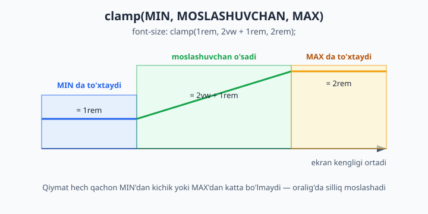
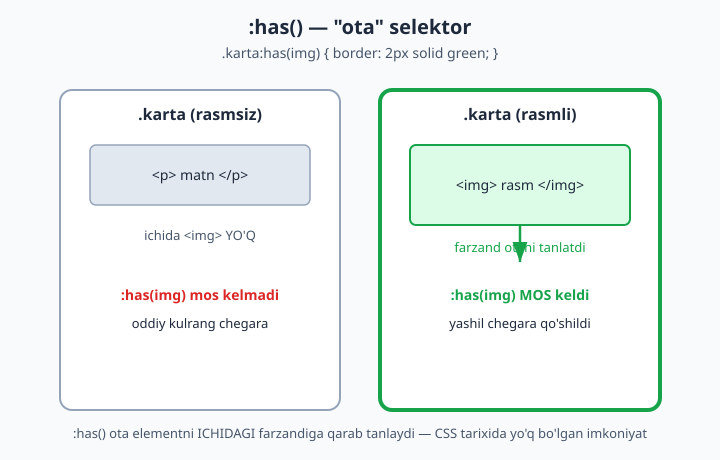
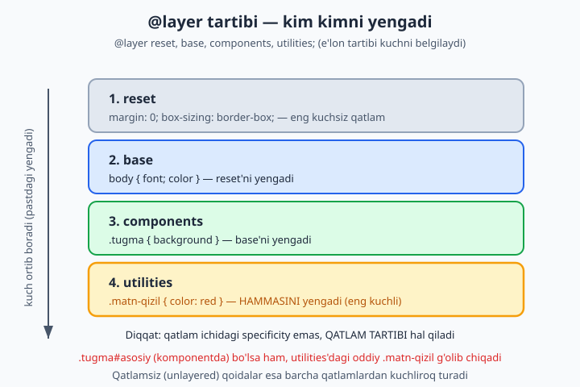

# 19 — Zamonaviy CSS

[⬅️ Oldingi: 18 — Transitions, transforms va animatsiyalar](./18-transitions-transforms-animations.md) · [🏠 README](./README.md) · [Keyingi: 20 — CSS arxitekturasi va uslublar ➡️](./20-arxitektura-uslublar.md)

> **Bu bobda:** custom properties (CSS o'zgaruvchilar), `calc()`/`clamp()`, CSS nesting, `:has()` "ota" selektor, `@layer` kaskad qatlamlari va logical properties kabi zamonaviy CSS imkoniyatlarini 0 dan o'rganib, kodimizni qisqa, moslashuvchan va boshqarsa oson qilamiz.

---

## 19.1 Nega "zamonaviy CSS" alohida bob?

Avvalgi boblarda CSS'ning poydevorini qo'ydik: selektorlar, box model, flexbox, grid, ranglar. Bularning ko'pi 10-15 yildan beri mavjud va ular hamon zarur. Lekin so'nggi yillarda CSS'ga shu darajada kuchli imkoniyatlar qo'shildiki, ular ilgari faqat JavaScript yoki maxsus vositalar (Sass kabi preprocessorlar) bilan hal qilinadigan masalalarni endi **toza CSS bilan** yechib beradi.

Bu bob aynan o'sha yangiliklar haqida. Nega ular muhim?

- **Custom properties** — bitta qiymatni (masalan, asosiy rangni) bir joyda saqlab, butun saytda ishlatish va bir lahzada o'zgartirish imkonini beradi. Bu "theming" (mavzu/tema almashtirish — kunduzgi/tungi rejim) ning poydevori.
- **`calc()`, `clamp()`** — o'lchamlarni qattiq raqam bilan emas, **hisoblanadigan** va **moslashuvchan** qilib yozadi. Responsiv dizaynni ancha soddalashtiradi.
- **Nesting** — CSS'ni HTML tuzilishiga o'xshatib ichma-ich yozish, takrorni kamaytirish.
- **`:has()`** — CSS tarixida birinchi marta **"ota" elementni farzandiga qarab** tanlash imkonini berdi.
- **`@layer`** — katta loyihalarda kaskad ustidan **aniq nazorat** o'rnatadi: `!important` urushlarini tugatadi.
- **Logical properties** — saytni boshqa til yo'nalishlariga (masalan, o'ngdan chapga yoziladigan arab tiliga) avtomatik moslashtiradi.

📌 Bu boblarning aksariyati 2022-2024 yillarda barcha asosiy brauzerlarda (Chrome, Firefox, Safari, Edge) qo'llab-quvvatlana boshladi. Ya'ni bugun ularni bemalol ishlatishingiz mumkin.

💡 **Maslahat:** har bir yangi xususiyatni o'rganganda "bu menga qaysi muammoni yechadi?" deb so'rang. Zamonaviy CSS — bu nafaqat yangi sintaksis, balki **kamroq kod yozib, ko'proq ish bajarish** falsafasi.

---

## 19.2 Custom properties — CSS o'zgaruvchilar

### Muammo: takrorlanuvchi qiymatlar

Tasavvur qiling, saytingizning brendi ko'k rangda (`#2563eb`). Bu rang tugmalarda, havolalarda, sarlavhalarda, chegaralarda — o'nlab joyda ishlatiladi:

```css
.tugma { background: #2563eb; }
a { color: #2563eb; }
h1 { border-bottom: 2px solid #2563eb; }
.belgi { color: #2563eb; }
```

Endi brend rangini o'zgartirmoqchi bo'lsangiz, har bir joyni qo'lda topib almashtirishingiz kerak. Bitta joyni unutsangiz — sayt buziladi. Bu xavfli va zerikarli.

### Yechim: bir joyda e'lon qiling

**Custom property** (CSS o'zgaruvchi, "maxsus xossa") — bu o'zingiz nomlagan qiymatni bir joyda saqlab, kerakli joyda chaqirib ishlatish usuli. Ular ikki harf bilan boshlanadi: `--`.

```css
:root {
  --asosiy-rang: #2563eb;
}

.tugma { background: var(--asosiy-rang); }
a { color: var(--asosiy-rang); }
h1 { border-bottom: 2px solid var(--asosiy-rang); }
.belgi { color: var(--asosiy-rang); }
```

Endi rangni o'zgartirish uchun faqat **bir qator** — `--asosiy-rang` ning qiymatini almashtirsangiz kifoya. Hamma joy avtomatik yangilanadi.

📌 **Ikki qism:**
- **E'lon (declaration):** `--ism: qiymat;` — o'zgaruvchini yaratadi. Ism `--` bilan boshlanadi va katta-kichik harfga sezgir (`--Rang` ≠ `--rang`).
- **Foydalanish:** `var(--ism)` — o'zgaruvchining qiymatini joylaydi.

### Nega `:root`?

`:root` — bu butun hujjatning eng tepa elementi, ya'ni `<html>` ga teng (lekin specificity'si bir oz balandroq). O'zgaruvchini `:root` da e'lon qilsak, u **butun sahifaga** tarqaladi.

💡 Custom property nomi `--` bilan boshlangani uchun ular oddiy CSS xossalari bilan adashmaydi. `--margin` deb yozsangiz, brauzer buni o'z `margin` xossasi deb o'ylamaydi — bu sizning shaxsiy o'zgaruvchingiz.

⚠️ **Eng keng tarqalgan xato:** `var()` ni unutib qo'yish. `color: --asosiy-rang;` ishlamaydi! To'g'risi: `color: var(--asosiy-rang);`. O'zgaruvchini *o'qish* uchun har doim `var()` kerak.

---

## 19.3 Scope va inheritance — o'zgaruvchilar qayerda yashaydi

Custom property'lar oddiy CSS xossalari kabi **meros (inheritance)** orqali pastga tarqaladi. Ya'ni o'zgaruvchini bir elementda e'lon qilsangiz, u o'sha element **va uning barcha farzandlarida** mavjud bo'ladi.

```css
:root {
  --rang: blue;
}

.ogohlantirish {
  --rang: red;   /* faqat shu shox uchun qayta e'lon */
}

.karta { color: var(--rang); }            /* blue */
.ogohlantirish .belgi { color: var(--rang); }  /* red */
```

```html
<div class="karta">Bu matn ko'k</div>
<div class="ogohlantirish">
  <span class="belgi">Bu matn qizil</span>
</div>
```

`--rang` `:root` da `blue` deb e'lon qilingan, shuning uchun butun sahifada `blue` mavjud. Lekin `.ogohlantirish` ichida uni `red` ga **override** qildik — bu yangi qiymat faqat `.ogohlantirish` va uning ichidagi elementlarga ta'sir qiladi, boshqa joyga emas.



**Nega bu kuchli?** Bitta o'zgaruvchini turli joyda turli qiymatga sozlash mumkin. Masalan, "kartochka" komponenti `--bo'shliq` o'zgaruvchisini ishlatadi, lekin har xil kartochkalar uni o'zicha sozlaydi — komponentni qayta yozmasdan.

```css
.karta {
  --bo'shliq: 16px;
  padding: var(--bo'shliq);
}
.karta.zich { --bo'shliq: 8px; }   /* zichroq kartochka */
.karta.keng { --bo'shliq: 32px; }  /* kengroq kartochka */
```

📌 **Farq:** oddiy preprocessor o'zgaruvchilari (Sass `$rang`) kompilyatsiya paytida "qotib qoladi". CSS custom property'lar esa **brauzerda jonli yashaydi** — meros bo'ladi, real vaqtda o'zgaradi, JavaScript bilan boshqariladi.

---

## 19.4 Fallback — zaxira qiymat

`var()` ikkinchi argument qabul qiladi — agar o'zgaruvchi mavjud bo'lmasa ishlatiladigan **zaxira (fallback) qiymat**:

```css
.element {
  color: var(--rang, black);        /* --rang yo'q bo'lsa, black */
  padding: var(--bo'shliq, 16px);   /* --bo'shliq yo'q bo'lsa, 16px */
}
```

Agar `--rang` hech qayerda e'lon qilinmagan bo'lsa, `color` `black` bo'ladi. Bu komponentni mustahkam qiladi: o'zgaruvchi sozlanmasa ham, oqilona standart qiymat ishlaydi.

Fallback ichida yana `var()` ham bo'lishi mumkin (zanjir):

```css
.element {
  /* --asosiy yo'q bo'lsa --zaxira, u ham yo'q bo'lsa gray */
  color: var(--asosiy, var(--zaxira, gray));
}
```

💡 Komponent kutubxonasi yozayotganda fallback'lar juda foydali: foydalanuvchi o'zgaruvchini bermasa ham komponent buzilmaydi.

---

## 19.5 JavaScript bilan o'qish va yozish

Custom property'lar brauzerda jonli yashagani uchun ularni **JavaScript bilan o'qish va o'zgartirish** mumkin. Bu — preprocessor o'zgaruvchilarida mutlaqo imkonsiz.

```js
const root = document.documentElement; // <html>

// O'qish:
const rang = getComputedStyle(root).getPropertyValue('--asosiy-rang');
console.log(rang.trim()); // "#2563eb"

// Yozish (o'zgartirish):
root.style.setProperty('--asosiy-rang', '#dc2626');
// Endi --asosiy-rang ishlatadigan HAMMA element qizilga aylanadi
```

Bir qator JavaScript butun saytning rangini o'zgartirdi! Bu — tema almashtirgich (kunduzgi/tungi rejim), foydalanuvchi sozlamalari, real vaqtli dizayn boshqaruvi uchun asos.

**Amaliy misol — interaktiv slayder:**

```html
<input type="range" min="8" max="40" value="16" id="bo'shliq">
<div class="quti">Mening ichki bo'shlig'im o'zgaradi</div>
```

```css
.quti { padding: var(--p, 16px); background: #e2e8f0; }
```

```js
const slayder = document.getElementById("bo'shliq");
slayder.addEventListener('input', (e) => {
  document.documentElement.style.setProperty('--p', e.target.value + 'px');
});
```

Foydalanuvchi slayderni surganda `.quti` ning ichki bo'shlig'i jonli o'zgaradi — hech qanday murakkab kod yozmasdan.

---

## 19.6 Theming — tema almashtirish

Custom property'larning eng kuchli qo'llanishi — **theming** (kunduzgi/tungi rejim kabi tema almashtirish). Mantiq oddiy: barcha ranglarni o'zgaruvchilarga chiqaramiz, keyin bitta klass bilan ularning qiymatlarini almashtiramiz.

```css
:root {
  --fon: #ffffff;
  --matn: #1e293b;
  --karta-fon: #f8fafc;
}

:root.tungi {
  --fon: #0f172a;
  --matn: #e2e8f0;
  --karta-fon: #1e293b;
}

body { background: var(--fon); color: var(--matn); }
.karta { background: var(--karta-fon); }
```

```js
// Tugma bosilganda temani almashtirish
document.querySelector('.tema-tugma').addEventListener('click', () => {
  document.documentElement.classList.toggle('tungi');
});
```

`<html>` ga `tungi` klassi qo'shilsa, barcha o'zgaruvchilar yangi qiymat oladi va butun sahifa bir lahzada tungi rejimga o'tadi. Har bir elementni alohida o'zgartirish shart emas — bu custom property'larning kuchi.

💡 **Nega bu yondashuv professional?** Yangi rang sxemasi qo'shmoqchi bo'lsangiz (masalan, "sepiya" rejim), faqat yana bir `:root.sepiya { ... }` bloki yozasiz. Komponentlarning hech biriga tegmaysiz.

---

## 19.7 `calc()` — CSS ichida hisoblash

`calc()` brauzerga matematik amalni **bajartiradi** — qo'shish (`+`), ayirish (`-`), ko'paytirish (`*`), bo'lish (`/`). Eng muhimi: u **turli birliklarni aralashtira oladi**, bu boshqa hech qayerda mumkin emas.

```css
.element {
  width: calc(100% - 80px);   /* foiz va piksel aralash! */
  height: calc(100vh - 60px); /* butun ekran balandligidan header'ni ayirish */
  padding: calc(1rem + 2px);
}
```

`width: calc(100% - 80px)` ni qo'lda hisoblab bo'lmaydi, chunki `100%` ekran o'lchamiga bog'liq, lekin `80px` qat'iy. Faqat brauzer real vaqtda buni hisoblay oladi.

⚠️ **Eng keng tarqalgan xato:** operator atrofida bo'sh joy qo'yishni unutish. `calc(100%-80px)` **ishlamaydi**! `+` va `-` atrofida albatta probel kerak: `calc(100% - 80px)`. (`*` va `/` uchun shart emas, lekin baribir qo'ying.)

`calc()` custom property'lar bilan ajoyib birikadi:

```css
:root { --asos: 8px; }
.kichik { padding: calc(var(--asos) * 1); }  /* 8px */
.o'rta  { padding: calc(var(--asos) * 2); }  /* 16px */
.katta  { padding: calc(var(--asos) * 3); }  /* 24px */
```

Bu — "8px tarmoq tizimi" (spacing scale): hamma bo'shliqlar bitta asosning ko'paytmasi. Dizaynni izchil qiladi.

💡 `calc()` ichida `calc()` qo'yish ham mumkin, lekin odatda kerak emas — bitta ifoda ichida bir nechta amal yozasiz: `calc((100% - 40px) / 3)`.

---

## 19.8 `clamp()`, `min()`, `max()` — moslashuvchan o'lchamlar

Bu uchta funksiya o'lchamni **diapazon ichida** boshqaradi. Ular responsiv dizaynni media query'larsiz ham yechib beradi.

### `min()` — eng kichigini tanlaydi

```css
.quti { width: min(600px, 100%); }
```

`min()` berilgan qiymatlardan **eng kichigini** oladi. Bu yerda: agar ekran 600px'dan keng bo'lsa, `100%` `600px`'dan katta — demak `600px` tanlanadi (quti 600px'da to'xtaydi). Tor ekranda `100%` kichikroq — quti ekranga to'la sig'adi. Ya'ni "maksimal 600px, lekin ekrandan oshmasin".

### `max()` — eng kattasini tanlaydi

```css
.matn { font-size: max(16px, 1vw); }
```

`max()` **eng kattasini** oladi. Bu yerda shrift hech qachon `16px`'dan kichik bo'lmaydi — kichik ekranda o'qilishi kafolatlanadi.

### `clamp()` — min va max orasida ushlab turish

`clamp(MIN, MOSLASHUVCHAN, MAX)` — eng foydalisi. Qiymatni pastdan `MIN`, yuqoridan `MAX` bilan cheklab, oralig'da `MOSLASHUVCHAN` qiymatni ishlatadi:

```css
h1 {
  font-size: clamp(1.5rem, 4vw, 3rem);
}
```

Bu qanday ishlaydi:
- Kichik ekranda `4vw` `1.5rem`'dan kichik bo'ladi → `1.5rem` ishlatiladi (juda kichrayib ketmaydi).
- Katta ekranda `4vw` `3rem`'dan katta bo'ladi → `3rem` ishlatiladi (cheksiz kattalashmaydi).
- Oralig'da `4vw` silliq o'sadi → shrift ekranga moslashib o'sib boradi.



💡 **Nega bu inqilob?** Ilgari "responsiv shrift" uchun bir nechta `@media` query yozish kerak edi. Endi bitta `clamp()` qatori barchasini hal qiladi va o'tish silliq (sakrashsiz) bo'ladi.

`clamp()` ko'pincha `calc()` bilan birga ishlatiladi:

```css
h1 { font-size: clamp(1.5rem, 1rem + 2vw, 3rem); }
```

`1rem + 2vw` — bu "asos + ekranga bog'liq qo'shimcha" formulasi, professional fluid tipografiyaning standartidir.

---

## 19.9 CSS nesting — ichma-ich yozish

Ilgari ichma-ich (nested) CSS faqat Sass kabi preprocessorlarda bor edi. Endi u **toza CSS** ga kirdi. Nesting — selektorlarni HTML tuzilishiga o'xshatib biri ichiga ikkinchisini yozish.

**Nesting'siz (eski uslub):**

```css
.karta { padding: 16px; }
.karta h2 { color: #2563eb; }
.karta p { color: #475569; }
.karta:hover { box-shadow: 0 4px 12px rgba(0,0,0,0.1); }
```

`.karta` to'rt marta takrorlandi. **Nesting bilan:**

```css
.karta {
  padding: 16px;

  h2 { color: #2563eb; }
  p { color: #475569; }

  &:hover {
    box-shadow: 0 4px 12px rgba(0,0,0,0.1);
  }
}
```

Endi `.karta` faqat bir marta yozildi, qolgani uning ichiga " uyalandi". Kod HTML tuzilishini aks ettiradi va o'qilishi osonroq.

### `&` belgisi — "joriy selektor"

`&` — bu "shu yerda joriy (ota) selektor turibdi" degani. U asosan ikki holatda kerak:

```css
.tugma {
  background: #2563eb;

  &:hover { background: #1d4ed8; }   /* .tugma:hover */
  &.faol  { background: #16a34a; }   /* .tugma.faol (bo'shliqsiz!) */
}
```

`&:hover` → `.tugma:hover`. Bu yerda `&` shart, chunki `:hover` selektorga **bo'shliqsiz** yopishishi kerak. Agar shunchaki `:hover` yozsangiz, ba'zi holatlarda bu `.tugma *:hover` (farzand) deb talqin qilinishi mumkin.

📌 **Qoida:** oddiy farzand element uchun (`h2`, `p`) `&` shart emas. Lekin joriy element'ning o'ziga teginadigan holat (`:hover`, `.faol`, `[disabled]`) uchun `&` kerak.

⚠️ Nesting'ni juda chuqurlashtirib yubormang. 3 darajadan oshsa, kod o'qilishi qiyinlashadi va specificity beixtiyor oshib ketadi. Tekis tuzilma — ko'pincha yaxshiroq.

---

## 19.10 `:has()` — "ota" selektor

CSS tarixida eng katta yetishmovchiliklardan biri shu edi: **ota elementni farzandiga qarab tanlab bo'lmasdi**. Selektorlar har doim pastga (farzandga) qarab ishlardi, hech qachon yuqoriga emas. `:has()` aynan shu muammoni yechdi.

`:has()` — ota element **ichida** ma'lum bir narsa bor-yo'qligini tekshiradi va shunga qarab ota'ni tanlaydi:

```css
/* Ichida  bor kartochkalarni tanla */
.karta:has(img) {
  border: 2px solid #16a34a;
}
```

Bu "ichida `` bo'lgan har qanday `.karta`'ni tanla" degani. Rasmsiz kartochkalar o'zgarishsiz qoladi.



Yana foydali misollar:

```css
/* Ichida tasdiqlangan checkbox bor label'ni belgila */
label:has(input:checked) {
  font-weight: bold;
  color: #16a34a;
}

/* Forma ichida xato bo'lsa, butun formaga qizil ramka */
form:has(input:invalid) {
  border: 2px solid #dc2626;
}

/* h2 dan keyin darhol p kelsa, h2 ning pastki bo'shlig'ini olib tashla */
h2:has(+ p) {
  margin-bottom: 0;
}
```

💡 **Nega bu shunchalik muhim?** Ilgari bunday holatlarni faqat JavaScript bilan hal qilardik (element'ga klass qo'shib). Endi toza CSS yetadi — tezroq, soddaroq, ishonchliroq.

📌 `:has()` ichida bir nechta shart vergul bilan ham yoziladi: `.karta:has(img, video)` — ichida `img` **yoki** `video` bo'lsa.

---

## 19.11 `:is()` va `:where()` — selektorlarni guruhlash

Bu ikki funksiya uzun, takrorlanuvchi selektorlarni qisqartiradi.

**Takrorlanuvchi kod:**

```css
header a:hover,
nav a:hover,
footer a:hover {
  color: #2563eb;
}
```

`:is()` bilan:

```css
:is(header, nav, footer) a:hover {
  color: #2563eb;
}
```

`:is(A, B, C)` — "A yoki B yoki C" degani. Kod ancha qisqardi.

### `:is()` va `:where()` farqi — specificity

Ular bir xil tanlashadi, lekin **specificity** (aniqlik bali, 10-bobni eslang) jihatidan tubdan farq qiladi:

- **`:is()`** — o'z ichidagi **eng kuchli** selektorning specificity'sini oladi. Masalan, `:is(#asosiy, p)` — `#asosiy` (id) borligi uchun butun selektor id-darajada kuchli bo'ladi.
- **`:where()`** — har doim **nol (0)** specificity beradi. Ichida nima bo'lishidan qat'i nazar, `:where()` "og'irligi" yo'q.

```css
:is(#asosiy, .menyu) a { color: red; }   /* specificity: id darajasida (kuchli) */
:where(#asosiy, .menyu) a { color: red; } /* specificity: 0 (juda zaif) */
```

**Nega `:where()` foydali?** U "yengib o'tilishi oson" standart stillar yozish uchun ideal. Komponent kutubxonasi `:where()` bilan asosiy stil bersa, foydalanuvchi uni hatto oddiy klass bilan ham bemalol o'zgartira oladi — specificity urushiga kirmasdan.

💡 **Qisqacha:** ko'p tanlash kerak va specificity muhim bo'lsa → `:is()`. Yengilishi oson "yumshoq" standart kerak bo'lsa → `:where()`.

---

## 19.12 `@layer` — kaskad qatlamlari

Katta loyihalarda eng katta og'riq — **specificity urushlari**. Kim qaysi qoidani yengayotganini nazorat qilish qiyinlashadi, oxiri hamma `!important` yozishni boshlaydi. `@layer` (cascade layers — kaskad qatlamlari) bu muammoni tubdan yechadi.

`@layer` CSS'ni nomlangan **qatlamlarga** ajratadi va qatlamlarning **tartibini** belgilaydi. Eng muhimi:

> **Qatlamlar tartibi specificity'dan ustun turadi.** Keyingi qatlamdagi qoida, avvalgi qatlamdagidan har doim kuchliroq — selektor qanchalik aniq bo'lishidan qat'i nazar.

```css
/* Qatlam tartibini e'lon qilamiz (eng muhim qator!) */
@layer reset, base, components, utilities;

@layer reset {
  * { margin: 0; box-sizing: border-box; }
}

@layer base {
  body { font-family: system-ui; color: #1e293b; }
}

@layer components {
  .tugma#asosiy { background: #2563eb; }  /* id ishlatilgan! */
}

@layer utilities {
  .matn-qizil { color: red; }  /* oddiy klass */
}
```



Diqqat: `components` qatlamida `.tugma#asosiy` (id'li, juda yuqori specificity) bo'lsa ham, `utilities` qatlamidagi oddiy `.matn-qizil` (juda past specificity) **g'olib chiqadi** — chunki `utilities` keyinroq e'lon qilingan qatlamda. Qatlam tartibi specificity'ni "ko'tarib o'tadi".

**Nega bu inqilob?** Endi siz aniq bilasiz:
- `reset` eng kuchsiz (uni hamma yengadi),
- `utilities` eng kuchli (u hammani yengadi).

`!important` deyarli kerak emas — tartibni qatlamlar hal qiladi.

📌 **Qatlamsiz qoidalar.** Hech qaysi `@layer` ichiga kirmagan oddiy qoidalar **barcha qatlamlardan kuchliroq** turadi. Shuning uchun muhim qoidalarni qatlamga solmasangiz, ular ustun bo'ladi.

💡 **Tartibni e'lon qilish.** `@layer reset, base, ...;` qatori qatlamlar tartibini **birinchi uchrashida** belgilaydi. Shuning uchun uni faylning eng boshiga yozish odat. Keyin qatlamlarni istalgan tartibda to'ldirsangiz ham, kuch tartibi o'sha e'londa qolaveradi.

---

## 19.13 Logical properties — til yo'nalishiga moslashish

`margin-left`, `padding-top`, `text-align: left` — bularning hammasi **jismoniy yo'nalishlar** (chap, o'ng, yuqori, past) ga bog'langan. Ammo dunyoning hamma tili chapdan o'ngga yozmaydi: arab va ibroniy tillari **o'ngdan chapga** (RTL), ba'zi yozuvlar yuqoridan pastga ketadi.

**Logical properties** (mantiqiy xossalar) jismoniy yo'nalish o'rniga **mantiqiy yo'nalishni** ishlatadi:

| Jismoniy (eski) | Mantiqiy (yangi) | Ma'nosi |
|---|---|---|
| `margin-left` / `margin-right` | `margin-inline-start` / `margin-inline-end` | matn oqimi bo'ylab boshi/oxiri |
| `margin-left` + `margin-right` | `margin-inline` | ikkala yon (qisqartma) |
| `margin-top` + `margin-bottom` | `margin-block` | yuqori + past (qisqartma) |
| `padding-left` | `padding-inline-start` | ichki bo'shliq, oqim boshi |
| `width` | `inline-size` | oqim yo'nalishidagi o'lcham |
| `height` | `block-size` | bloklar yo'nalishidagi o'lcham |
| `text-align: left` | `text-align: start` | matn boshiga tekislash |

```css
.maqola {
  /* eski: faqat chapdan o'ngga to'g'ri ishlaydi */
  margin-left: 20px;
  padding-left: 16px;

  /* yangi: har qanday til yo'nalishida to'g'ri ishlaydi */
  margin-inline-start: 20px;
  padding-inline-start: 16px;
}
```

**Nega bu muhim?** `margin-inline-start` ingliz tilida (LTR) chapni, arab tilida (RTL) o'ngni anglatadi — avtomatik. Saytni `dir="rtl"` ga o'zgartirsangiz, butun layout to'g'ri "aks etadi", siz birorta qoidani qo'lda o'zgartirmaysiz.

`margin-inline` va `margin-block` qisqartmalari ham juda qulay:

```css
.element {
  margin-inline: auto;   /* chap va o'ng margin: auto (markazlash) */
  margin-block: 24px;    /* yuqori va past margin: 24px */
  padding-inline: 16px;  /* chap va o'ng ichki bo'shliq */
}
```

💡 **Maslahat:** yangi loyihada imkon qadar logical properties ishlating. Hatto faqat ingliz/o'zbek tilida ishlasangiz ham, ular kodingizni "kelajakka tayyor" qiladi va `margin-inline: auto` kabi qisqartmalar baribir qulay.

---

## 19.14 `aspect-ratio` — tomonlar nisbati

`aspect-ratio` element'ning eni va bo'yi nisbatini saqlaydi. Ilgari bu uchun "padding-hack" degan murakkab nayrang ishlatilardi, endi bitta qator yetadi:

```css
.video {
  width: 100%;
  aspect-ratio: 16 / 9;  /* en : bo'y = 16 : 9 */
}

.avatar {
  width: 80px;
  aspect-ratio: 1;       /* kvadrat (1:1) */
}
```

`aspect-ratio: 16 / 9` — element eni qancha bo'lishidan qat'i nazar, bo'yi avtomatik `eni × 9/16` bo'ladi. Video va rasm konteynerlari uchun ideal: ekran kichraysa ham nisbat buzilmaydi.

💡 **Nega foydali?** Responsiv video joylashtirganda balandlikni qo'lda hisoblash shart emas. `width: 100%` + `aspect-ratio: 16/9` — tamom, video har doim to'g'ri proporsiyada.

---

## 19.15 `gap` — hamma joyda bo'shliq

Avvalroq `gap` ni faqat flexbox va grid kontekstida ko'rgan bo'lishingiz mumkin (15- va 16-boblar). U element'lar **orasiga** bo'shliq qo'yadi, lekin chetlarga emas — bu uni `margin`'dan ustun qiladi:

```css
.menyu {
  display: flex;
  gap: 16px;          /* har element orasida 16px */
}

.grid {
  display: grid;
  grid-template-columns: repeat(3, 1fr);
  gap: 24px 16px;     /* qatorlar orasi 24px, ustunlar orasi 16px */
}
```

**Nega `gap` > `margin`?** `margin` bilan bo'shliq qo'ysangiz, oxirgi element'da ham ortiqcha margin qoladi (yoki `:last-child { margin: 0 }` deb tuzatishga to'g'ri keladi). `gap` faqat **orada** bo'shliq qo'yadi — chetlar toza qoladi. Kod soddaroq, xato kamroq.

📌 Bugun `gap` flexbox'da ham, grid'da ham barcha zamonaviy brauzerlarda ishlaydi. Element orasidagi bo'shliq uchun birinchi tanlovingiz `gap` bo'lsin.

---

## 19.16 Zamonaviy ranglar — `oklch()` va `color-mix()`

12-bobda `rgb()` va `hsl()` ranglarini ko'rgansiz. Zamonaviy CSS yana ikki kuchli vositani qo'shdi.

### `oklch()` — bir tekis yorqinlik

`oklch(yorqinlik chroma rang-burchagi)` — inson ko'ziga **bir tekis** ko'rinadigan rang modeli:

```css
.element {
  color: oklch(0.7 0.15 250);   /* yorqinlik 70%, to'yinganlik, ko'k burchak */
}
```

- Birinchi son — **yorqinlik** (0 = qora, 1 = oq).
- Ikkinchi — **chroma** (rangning to'yinganligi/quyuqligi).
- Uchinchi — **rang burchagi** (0-360, hsl'dagi kabi).

**Nega `oklch`?** `hsl()` da yorqinlikni o'zgartirsangiz, turli ranglar turlicha "yorqin" ko'rinadi (sariq och, ko'k quyuq). `oklch` da esa `0.7` yorqinlik — har qanday rang uchun bir xil idrok etiladigan yorqinlik beradi. Bu izchil palitra (rang to'plami) yaratishni osonlashtiradi.

### `color-mix()` — ikki rangni aralashtirish

`color-mix()` ikki rangni berilgan nisbatda aralashtiradi:

```css
.element {
  /* 80% ko'k + 20% oq = ochroq ko'k */
  background: color-mix(in oklch, #2563eb 80%, white);

  /* asosiy rangni 30% qora bilan to'qlashtirish */
  border-color: color-mix(in oklch, var(--asosiy-rang), black 30%);
}
```

**Nega kuchli?** Custom property bilan birga ishlatilsa, bitta asosiy rangdan butun palitra (ochroq, to'qroq variantlar) avtomatik hosil qilinadi. Tugmaning `:hover` rangini qo'lda tanlash o'rniga `color-mix(in oklch, var(--rang), black 15%)` deysiz — har doim mos to'q variant chiqadi.

```css
.tugma {
  --rang: #2563eb;
  background: var(--rang);
}
.tugma:hover {
  background: color-mix(in oklch, var(--rang), black 15%);
}
```

💡 Bu boblar (oklch, color-mix) hozir barcha zamonaviy brauzerlarda ishlaydi. Eski brauzerlarni qo'llab-quvvatlash kerak bo'lsa, fallback rang bering: avval oddiy `background: #2563eb;`, keyin zamonaviy qatorni yozing — eski brauzer tushunmaganini "tashlab ketadi".

---

## 19.17 Hammasini birlashtirgan misol

Quyida shu bobdagi imkoniyatlar birga ishlagan kichik komponent. Har bir qatorni o'qib, qaysi xususiyat ekanini taniy olasizmi?

```css
@layer components {
  .karta {
    /* custom properties */
    --bo'shliq: clamp(12px, 2vw, 24px);
    --rang: #2563eb;

    /* logical properties + gap */
    padding-block: var(--bo'shliq);
    padding-inline: calc(var(--bo'shliq) * 1.5);
    display: flex;
    flex-direction: column;
    gap: var(--bo'shliq);

    /* nesting */
    h2 { color: var(--rang); }

    /* :has() */
    &:has(img) {
      border-inline-start: 4px solid var(--rang);
    }

    /* nesting + color-mix */
    &:hover {
      background: color-mix(in oklch, var(--rang), white 90%);
    }
  }
}
```

Bu komponent: moslashuvchan bo'shliqli (clamp), rangni o'zgaruvchidan oladigan (custom property), til yo'nalishiga moslashadigan (logical), rasm bo'lsa chap chegara qo'shadigan (`:has()`), va hover'da silliq to'qlashadigan (color-mix) — barchasi 20 qatorda, toza CSS bilan.

---

## Mashqlar

Quyidagi mashqlarni qog'ozda yoki brauzerda (Chrome DevTools'da) sinab ko'ring. Avval o'zingiz javob bering, keyin yechimni oching.

### Mashq 1 — Custom property e'lon qilish

`:root` da `--asosiy-rang` ni `#16a34a` (yashil) qilib e'lon qiling va uni `.tugma` ning fon rangiga, `a` ning matn rangiga bering.

<details markdown="1"><summary>Yechim</summary>

```css
:root {
  --asosiy-rang: #16a34a;
}

.tugma { background: var(--asosiy-rang); }
a { color: var(--asosiy-rang); }
```

`var()` ni unutmang — o'zgaruvchini o'qish uchun u shart.

</details>

### Mashq 2 — Fallback qiymat

Quyidagi kodda `--bo'shliq` hech qayerda e'lon qilinmagan. `.quti` ning `padding` qiymati qancha bo'ladi?

```css
.quti { padding: var(--bo'shliq, 20px); }
```

<details markdown="1"><summary>Yechim</summary>

`padding` **20px** bo'ladi. `--bo'shliq` mavjud emasligi uchun `var()` ning ikkinchi argumenti (fallback) — `20px` ishlatiladi. Fallback aynan shu holat uchun: o'zgaruvchi sozlanmasa ham komponent buzilmaydi.

</details>

### Mashq 3 — `clamp()` ni tushunish

`font-size: clamp(1rem, 5vw, 2rem)` berilgan. Quyidagi uch holatda shrift qancha bo'ladi (taxminan)?
- Juda tor ekran (5vw = 0.6rem ga teng)
- O'rta ekran (5vw = 1.5rem ga teng)
- Juda keng ekran (5vw = 3rem ga teng)

<details markdown="1"><summary>Yechim</summary>

- Tor ekran: `5vw` (0.6rem) `1rem`'dan kichik → **`1rem`** (MIN bilan cheklandi).
- O'rta ekran: `5vw` (1.5rem) oraliqda → **`1.5rem`** (moslashuvchan qiymat ishlatildi).
- Keng ekran: `5vw` (3rem) `2rem`'dan katta → **`2rem`** (MAX bilan cheklandi).

`clamp()` hech qachon MIN'dan past yoki MAX'dan baland chiqmaydi.

</details>

### Mashq 4 — Nesting va `&`

Quyidagi nesting'siz kodni nesting bilan, `&` dan to'g'ri foydalanib qayta yozing:

```css
.menyu { display: flex; }
.menyu a { color: #1e293b; }
.menyu a:hover { color: #2563eb; }
```

<details markdown="1"><summary>Yechim</summary>

```css
.menyu {
  display: flex;

  a {
    color: #1e293b;

    &:hover { color: #2563eb; }
  }
}
```

`a` farzand element bo'lgani uchun `&` shart emas, lekin `:hover` joriy element'ga (`a`) yopishishi kerak — shuning uchun `&:hover`.

</details>

### Mashq 5 — `:has()` ni qo'llash

Ichida `<input:invalid>` (xato to'ldirilgan maydon) bor `form` ga `2px solid #dc2626` qizil chegara beradigan qoidani yozing.

<details markdown="1"><summary>Yechim</summary>

```css
form:has(input:invalid) {
  border: 2px solid #dc2626;
}
```

`:has()` ota element (`form`) ni ichidagi farzandiga (`input:invalid`) qarab tanlaydi. Ilgari buni faqat JavaScript bilan qilish mumkin edi.

</details>

### Mashq 6 — `:is()` va `:where()` specificity

Quyidagi ikki qoidadan qaysi biri kuchliroq (yuqori specificity'ga ega)? Nega?

```css
:is(#header, .nav) a { color: red; }
:where(#header, .nav) a { color: blue; }
```

`<a>` element `#header` ichida. Qaysi rang g'olib chiqadi?

<details markdown="1"><summary>Yechim</summary>

Matn **qizil** (`red`) bo'ladi.

- `:is(#header, .nav)` — ichidagi eng kuchli selektor `#header` (id) bo'lgani uchun id-darajadagi specificity oladi (kuchli).
- `:where(#header, .nav)` — har doim **0** specificity beradi (juda zaif).

Kuchli `:is()` qoidasi zaif `:where()` qoidasini yengadi, manba tartibidan qat'i nazar.

</details>

### Mashq 7 — `@layer` tartibi

```css
@layer base, utilities;

@layer utilities {
  .matn-kichik { font-size: 12px; }
}

@layer base {
  p#muhim { font-size: 24px; }
}
```

`<p id="muhim" class="matn-kichik">` element shrifti qancha bo'ladi?

<details markdown="1"><summary>Yechim</summary>

Shrift **12px** bo'ladi.

`base` qatlamidagi `p#muhim` juda yuqori specificity'ga ega (id bor), lekin `@layer base, utilities;` e'loniga ko'ra `utilities` qatlami **keyin** keladi — demak u kuchliroq. Qatlam tartibi specificity'dan ustun: `utilities`'dagi oddiy `.matn-kichik` g'olib chiqadi.

Bu — `@layer` ning asosiy g'oyasi: kuchni qatlam tartibi hal qiladi, selektor og'irligi emas.

</details>

### Mashq 8 — Logical properties

`.maqola` ga: chap va o'ng tomonidan `auto` margin (markazlash), yuqori va pastdan `32px` margin, har ikki yon ichki bo'shlik (`padding`) `16px` bering — faqat **logical properties** ishlatib.

<details markdown="1"><summary>Yechim</summary>

```css
.maqola {
  margin-inline: auto;   /* chap + o'ng margin: auto */
  margin-block: 32px;    /* yuqori + past margin: 32px */
  padding-inline: 16px;  /* chap + o'ng padding: 16px */
}
```

`inline` o'qi — matn oqimi bo'ylab (LTR'da chap-o'ng), `block` o'qi — bloklar yo'nalishi (yuqori-past). Bu kod arab tili (RTL) sahifasida ham to'g'ri ishlaydi.

</details>

### Mashq 9 — Theming (qiyinroq)

Custom property'lardan foydalanib, `<html>` ga `tungi` klassi qo'shilganda `body` foni qora (`#0f172a`), matni och (`#e2e8f0`) bo'ladigan tema tizimini yozing. Klassi yo'q holatda fon oq, matn to'q bo'lsin.

<details markdown="1"><summary>Yechim</summary>

```css
:root {
  --fon: #ffffff;
  --matn: #1e293b;
}

:root.tungi {
  --fon: #0f172a;
  --matn: #e2e8f0;
}

body {
  background: var(--fon);
  color: var(--matn);
}
```

```js
document.documentElement.classList.toggle('tungi');
```

`<html>` ga `tungi` klassi qo'shilsa, o'zgaruvchilar yangi qiymat oladi va `body` avtomatik tungi rejimga o'tadi — `body` qoidasiga umuman tegmasdan. Bu custom property theming'ning kuchi.

</details>

---

[⬅️ Oldingi: 18 — Transitions, transforms va animatsiyalar](./18-transitions-transforms-animations.md) · [🏠 README](./README.md) · [Keyingi: 20 — CSS arxitekturasi va uslublar ➡️](./20-arxitektura-uslublar.md)
