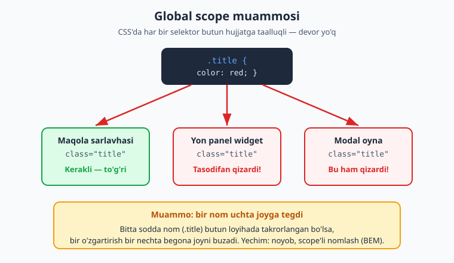
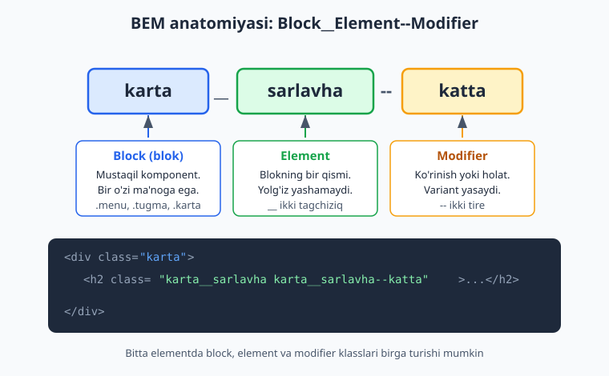
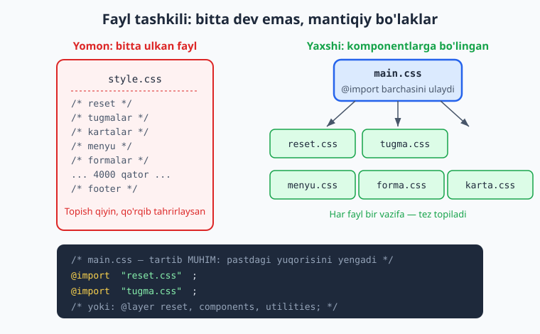
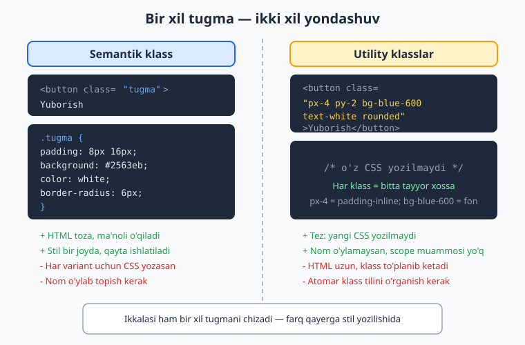

# 20 — CSS arxitekturasi va uslublar

[⬅️ Oldingi: 19 — Zamonaviy CSS](./19-zamonaviy-css.md) · [🏠 README](./README.md) · [Keyingi: 21 — Formalar, UI holatlari va kirish imkoniyati ➡️](./21-amaliy-forma-ui-states.md)

> **Bu bobda:** katta loyihada CSS'ni tartibli, boshqarib bo'ladigan qilib yozish — global scope va specificity muammolari nega kelib chiqishi, BEM kabi nomlash konventsiyalari, reset va normalize, fayllarni komponentlarga bo'lish, DRY, design tokens hamda utility-first (Tailwind) yondashuvini semantik usul bilan taqqoslash.

---

## 20.1 Nega bu bob — "katta loyiha" haqida?

Shu paytgacha sen CSS'ning *qurollarini* o'rgandingiz: selektorlar, box model, flexbox, grid, animatsiyalar. Bitta tugma yoki bitta sahifa uchun bu yetarli. Lekin yuzlab komponentdan, o'nlab sahifadan iborat **katta loyiha** boshlaganingda butunlay yangi muammo paydo bo'ladi: kodning o'zi tartibsizlanib ketadi.

Tasavvur qil: loyihada 5000 qator CSS bor. Sen bitta tugmaning rangini o'zgartirasan — va kutilmaganda boshqa sahifadagi forma buziladi. Yoki yangi a'zo jamoaga qo'shiladi, kodga qaraydi va hech narsa tushunmaydi: bu klass nimaga kerak, uni o'chirsam nima buziladi?

> **Bu bobning savoli:** CSS'ni shunday yozish kerakki, u **o'sib borganda ham boshqarib bo'ladigan** bo'lsin.

Buni hal qiladigan qoidalar, naqshlar va konventsiyalar majmuasi **CSS arxitekturasi** deyiladi. Bu — sintaksis emas, balki *intizom*. Aynan shu intizom havaskorni professionaldan ajratadi.

📌 **Atamalar:**
- **architecture** (arxitektura) — kodni qanday tashkil qilish, nomlash va bo'lish bo'yicha umumiy reja.
- **methodology** (metodologiya) — shu rejaning aniq qoidalar to'plami (masalan BEM).
- **convention** (konventsiya) — jamoa kelishib olgan yozish uslubi (masalan klass nomlarini qanday yozish).

---

## 20.2 CSS nega tartibsizlanadi? Ikki tub sabab

CSS o'ziga xos tarzda "qiyin" til — sintaksisi oson bo'lsa-da, kattalashganda chigallashishga **moyil**. Buning ikkita tub sababi bor. Ularni tushunmasdan turib hech qanday metodologiya yordam bermaydi.

### Sabab 1 — global scope (umumiy ko'rinish maydoni)

JavaScript yoki boshqa tillarda funksiya ichidagi o'zgaruvchi faqat o'sha funksiya ichida yashaydi — bu **scope** (ko'rinish maydoni). CSS'da esa bunday devor **yo'q**: har qanday selektor butun hujjatga taalluqli.

Sen `.title { color: red }` deb yozsang, bu qoida sahifadagi **barcha** `class="title"` elementlarga tegadi — maqola sarlavhasiga ham, yon paneldagi widgetga ham, modal oynaga ham. Ularning birortasini ko'zda tutmagan bo'lsang ham.



```css
/* "title" oddiy va keng tarqalgan nom */
.title {
  color: red;
}
```

```html
<h1 class="title">Maqola</h1>          <!-- buni ko'zladik -->
<div class="widget">
  <span class="title">Ob-havo</span>   <!-- bu ham qizardi! -->
</div>
```

**Natija:** ikkala matn ham qizil. Birinchisi kerakli edi, ikkinchisi — tasodif. Loyiha o'sgan sari bunday tasodifiy to'qnashuvlar ko'payadi. Bu — **global scope** ning to'g'ridan-to'g'ri oqibati.

💡 **Hayotiy analogiya:** global scope — bu butun shahar uchun bitta umumiy ism ro'yxati. Agar ikki oila bolasiga "Ali" deb nom qo'ysa, "Ali!" deb chaqirganingda ikkalasi ham keladi. Yechim — familya qo'shish (ya'ni nomni noyob qilish). BEM aynan shuni qiladi.

### Sabab 2 — specificity urushlari

10-bobda **specificity** (aniqlik bali) ni o'rgandik: aniqroq selektor g'olib chiqadi. Bu kichik loyihada foydali, lekin kattasida **qurollanish poygasi** ga aylanadi.

Kimdir bir stilni bosib o'tish uchun selektorni biroz aniqroq qiladi. Keyin boshqasi uni bosish uchun yana aniqroq qiladi. Oxir-oqibat hamma `!important` qo'shishga o'tadi:

```css
.tugma { background: blue; }
.panel .tugma { background: green; }          /* avvalgisini bosish uchun */
#sahifa .panel .tugma { background: orange; } /* yana bosish uchun */
#sahifa .panel .tugma { background: red !important; } /* taslim bo'ldik */
```

Endi bu tugmaning rangini o'zgartirish uchun yangi kelgan kishi **yana** `!important` qo'shishi kerak. Kod tobora qattiqlashadi — har bir o'zgartirish kurashga aylanadi.

⚠️ **Asosiy g'oya:** CSS arxitekturasining katta qismi — **specificity'ni past va tekis tutish**. Agar barcha selektorlar bir xil og'irlikda (masalan bitta class) bo'lsa, urush boshlanmaydi: oxirgi yozilgan oddiygina g'olib bo'ladi.

---

## 20.3 Yechim: nomlash konventsiyasi — BEM

Yuqoridagi ikkala muammoning ham ildizi bitta: **nomlar**. Agar nomlar noyob va bashorat qilinadigan bo'lsa, to'qnashuv bo'lmaydi; agar selektorlar tekis (bitta class) bo'lsa, specificity urushi bo'lmaydi.

**BEM** — eng mashhur nomlash metodologiyasi. Nomi uchta so'zdan: **B**lock, **E**lement, **M**odifier. U klass nomini aniq tuzilishga soladi:

```
blok__element--modifier
```



### Uch qism — anatomiya

**1. Block (blok)** — mustaqil, qayta ishlatiladigan komponent. U bir o'zi ma'noga ega va boshqa joyga ko'chirsa ham ishlaydi.

```css
.karta { }      /* karta komponenti */
.menyu { }      /* menyu komponenti */
.tugma { }      /* tugma komponenti */
```

**2. Element** — blokning bir bo'lagi. U yolg'iz yashay olmaydi — faqat o'z bloki ichida ma'no kasb etadi. Blok nomidan keyin **ikkita tagchiziq** (`__`) bilan yoziladi:

```css
.karta__rasm { }       /* kartaning rasmi */
.karta__sarlavha { }   /* kartaning sarlavhasi */
.karta__matn { }       /* kartaning matni */
```

**3. Modifier** — blok yoki elementning **varianti** yoki **holati**. Ko'rinishni yoki holatni o'zgartiradi. **Ikkita tire** (`--`) bilan yoziladi:

```css
.tugma--katta { }      /* katta o'lchamli variant */
.tugma--ochiq { }      /* och rangli variant */
.karta--tanlangan { }  /* tanlangan holat */
```

### To'liq misol

```html
<article class="karta karta--tanlangan">
  
  <h2 class="karta__sarlavha">Mahsulot nomi</h2>
  <p class="karta__matn">Tavsif...</p>
  <button class="tugma tugma--katta">Sotib olish</button>
</article>
```

```css
.karta { border: 1px solid #ccc; padding: 16px; }
.karta--tanlangan { border-color: #2563eb; }

.karta__sarlavha { font-size: 20px; margin: 8px 0; }
.karta__matn { color: #475569; }

.tugma { padding: 8px 16px; background: #2563eb; color: white; }
.tugma--katta { padding: 12px 24px; font-size: 18px; }
```

### BEM nega ikkala muammoni ham hal qiladi?

- **Global scope:** `.karta__sarlavha` nomi noyob — uni boshqa joyda tasodifan ishlatib qo'yish ehtimoli deyarli yo'q. Nom o'zining qaysi blokka tegishli ekanini aytib turadi.
- **Specificity urushi:** har bir BEM klass — bitta class selektori, ya'ni bali `(0,0,1,0)`. Hamma tekis bo'lgani uchun urush boshlanmaydi. Hech qachon `.karta .karta__sarlavha` deb ichma-ich yozma — shunchaki `.karta__sarlavha`.

⚠️ **Tez-tez xato:** modifierni yolg'iz ishlatish. `tugma--katta` o'zi to'liq tugma emas — u faqat **qo'shimcha**. HTML'da har doim asosiy blok bilan birga yoz: `class="tugma tugma--katta"`, yolg'iz `class="tugma--katta"` emas.

💡 **Eslatma:** element ichida element bo'lsa ham, nomni cho'zma. `.karta__rasm__belgi` emas — `.karta__belgi` deb yoz. BEM faqat **bir** daraja `__` ni tavsiya qiladi; chuqurlik HTML tuzilishida bo'ladi, klass nomida emas.

---

## 20.4 Boshqa metodologiyalar: OOCSS va SMACSS

BEM yagona yo'l emas. U paydo bo'lishidan oldin ham g'oyalar bor edi — ularni bilib qo'ygan foydali, chunki ko'p loyihalarda izlarini uchratasan.

### OOCSS — Object-Oriented CSS

**OOCSS** (ob'ektga yo'naltirilgan CSS) ikkita asosiy tamoyilga tayanadi:

**1. Tuzilma va ko'rinishni ajratish.** "Qanday joylashgan" (o'lcham, padding) bilan "qanday ko'rinadi" (rang, soya) ni alohida klasslarga bo'l:

```css
/* tuzilma — qayta ishlatiladi */
.tugma { padding: 8px 16px; border-radius: 6px; }

/* ko'rinish — alohida */
.kok { background: #2563eb; color: white; }
.yashil { background: #16a34a; color: white; }
```

```html
<button class="tugma kok">Saqlash</button>
<button class="tugma yashil">Tasdiqlash</button>
```

**2. Konteyner va tarkibni ajratish.** Element o'zi qayerda turishidan **qat'i nazar** bir xil ko'rinishi kerak. Ya'ni `.sarlavha` har joyda bir xil bo'lsin, `.yonpanel .sarlavha` deb joyga bog'lab qo'yma.

📌 OOCSS'ning eng muhim merosi — **takrorlanadigan, kontekstdan mustaqil** komponentlar g'oyasi. Tailwind kabi utility yondashuvlar ham aslida shu ildizdan o'sgan.

### SMACSS — Scalable and Modular Architecture for CSS

**SMACSS** qoidalarni **beshta toifaga** ajratadi va ularni alohida fayllarda saqlashni tavsiya qiladi:

| Toifa | Nima | Misol |
|---|---|---|
| **Base** | Teglarning asosiy stillari | `body`, `a`, `h1` |
| **Layout** | Sahifaning katta bo'laklari | `.header`, `.sidebar`, `.grid` |
| **Module** | Qayta ishlatiladigan komponentlar | `.karta`, `.tugma`, `.menyu` |
| **State** | Holatlar | `.is-active`, `.is-hidden` |
| **Theme** | Mavzu (rang sxemasi) | `.theme-dark` |

SMACSS'ning kuchi — **fayl tashkili va holat nomlashi** (`is-active` kabi prefiks). Ko'p jamoalar BEM (nomlash uchun) va SMACSS (fayl tashkili uchun) ni **birga** ishlatadi.

💡 **Xulosa:** bu metodologiyalar raqobatchi emas — bir-birini to'ldiradi. BEM senga *nomlashni* beradi, SMACSS *tashkilni*, OOCSS *qayta ishlatishni*. Aksariyat zamonaviy loyihalar uchalasidan ham bir oz oladi.

---

## 20.5 CSS reset va normalize — nega kerak?

Brauzer har bir HTML elementga **o'zining standart stilini** beradi (10-bobda buni "user-agent stillari" degan edik). Masalan `<h1>` katta va qalin, `<ul>` da nuqtalar va chap padding bor, `<body>` da kichik margin bor.

Muammo: bu standartlar **brauzerdan brauzerga biroz farq qiladi**. Chrome va Safari'da bir xil `<button>` boshqacha ko'rinishi mumkin. Natijada sening saying turli brauzerda har xil ko'rinadi.

Yechim ikki xil falsafada keladi:

### Reset — hammasini nolga tushir

**CSS reset** brauzerning standart stillarini deyarli **butunlay o'chiradi**, toza varaqdan boshlash uchun:

```css
/* sodda reset namunasi */
* {
  margin: 0;
  padding: 0;
  box-sizing: border-box;
}
```

Bu yondashuvda `<h1>` ham `<p>` ham bir xil o'lchamda bo'ladi — har bir narsani **noldan o'zing** belgilaysan. To'liq nazorat, lekin ko'proq yozish.

### Normalize — farqlarni tekisla, foydalisini saqla

**Normalize.css** boshqacha: u standartlarni o'chirmaydi, balki brauzerlar **orasidagi farqlarni tekislaydi** va foydali standartlarni (masalan `<h1>` ning kattaligi) saqlab qoladi. Faqat nomuvofiqliklarni tuzatadi.

| | Reset | Normalize |
|---|---|---|
| Standart stillar | O'chiriladi | Saqlanadi |
| Falsafa | "Noldan boshla" | "Farqlarni tekisla" |
| Natija | Hamma element yalang'och | Mantiqiy standartlar qoladi |
| Qachon | To'liq nazorat kerak bo'lsa | Tez, standartlar yoqsa |

📌 **Zamonaviy o'rtacha yo'l.** Bugun ko'pchilik to'liq reset ham, to'liq normalize ham emas, balki kichik **"modern reset"** ishlatadi — eng foydali tuzatishlarni oladi:

```css
*, *::before, *::after { box-sizing: border-box; }
* { margin: 0; }
body { line-height: 1.5; -webkit-font-smoothing: antialiased; }
img, picture, video { display: block; max-width: 100%; }
input, button, textarea, select { font: inherit; }
```

**Nega bu kerak?** `box-sizing: border-box` o'lchovni bashorat qilinadigan qiladi (11-bob), `img { max-width: 100% }` rasmlar konteynerdan toshib chiqmasligini ta'minlaydi, `font: inherit` esa formalardagi shrift body shriftiga moslashishini ta'minlaydi. Bularsiz har loyihada bir xil "boshlang'ich og'riqlar" takrorlanadi.

💡 **Maslahat:** reset/normalize **eng birinchi** ulanishi kerak — barcha boshqa stillaringdan oldin. Aks holda u senikini bosib qo'yadi.

---

## 20.6 Fayl tashkili: komponentlarga bo'lish

Bitta 5000 qatorli `style.css` — kabus. Kerakli joyni topish qiyin, tahrirlash qo'rqinchli. Yechim — kodni **mantiqiy bo'laklarga**, har biri o'z faylida bo'ladigan qilib bo'lish.



```
styles/
├── reset.css        ← eng birinchi
├── tokens.css       ← rang/o'lcham o'zgaruvchilari
├── base.css         ← body, sarlavhalar, linklar
├── components/
│   ├── tugma.css
│   ├── karta.css
│   └── menyu.css
└── main.css         ← hammasini birlashtiradi
```

### Birlashtirishning ikki usuli

**1. `@import` (eski, sodda).** `main.css` boshqa fayllarni ichiga "tortib oladi". Tartib muhim — pastdagi yuqoridagini bosadi:

```css
/* main.css */
@import "reset.css";
@import "tokens.css";
@import "base.css";
@import "components/tugma.css";
@import "components/karta.css";
```

⚠️ Sof `@import` har faylni alohida yuklaydi (sekinroq). Shuning uchun amalda ko'pincha **build vositasi** (Vite, webpack, Sass) hammasini bitta faylga "qadoqlaydi". Lekin tushuncha bir xil — kodni mantiqan bo'lasan.

**2. Cascade layers — `@layer` (zamonaviy, kuchli).** 19-bobda ko'rganimizdek, `@layer` qatlamlarning *kuchini* e'lon tartibiga ko'ra belgilaydi. Bu specificity muammosini ildizidan hal qiladi:

```css
/* qatlam tartibini bir marta e'lon qilamiz */
@layer reset, base, components, utilities;

@layer reset {
  * { margin: 0; box-sizing: border-box; }
}
@layer components {
  .tugma { background: blue; }
}
@layer utilities {
  .matn-qizil { color: red; }   /* components'ni yengadi — qatlam tartibi tufayli */
}
```

**Nega bu kuchli?** Endi `.matn-qizil` `components` ichidagi murakkabroq selektordan ham g'olib bo'ladi — chunki **qatlam tartibi specificity'dan ustun turadi**. Specificity urushi tugaydi: kim qaysi qatlamda turishi hal qiladi, selektor uzunligi emas.

---

## 20.7 DRY — takrorlanishni kamaytirish

**DRY** — "Don't Repeat Yourself" (o'zingni takrorlama). Agar bir qiymat yoki naqsh kodda qayta-qayta uchrasa, uni **bir joyga** chiqarish kerak. Aks holda o'zgartirish kerak bo'lganda hamma nusxani qidirib yurasan — va bittasini albatta unutib qoldirasan.

### Takrorlanish — muammo

```css
.tugma { background: #2563eb; border-radius: 6px; }
.havola { color: #2563eb; }
.belgi { border: 2px solid #2563eb; }
.sarlavha { color: #2563eb; }
```

Bu yerda `#2563eb` to'rt marta takrorlangan. Brendning ko'k rangini o'zgartirmoqchi bo'lsang, to'rttasini ham topib o'zgartirishing kerak. Loyiha kattalashganda bu 40 ta bo'lib ketadi.

### Yechim — custom properties (design tokens)

12-bobda ko'rgan CSS custom properties (`--o'zgaruvchi`) aynan shu uchun ideal. Rangni **bir marta** e'lon qilamiz, hamma joyda `var()` bilan ishlatamiz:

```css
:root {
  --rang-asosiy: #2563eb;
  --radius: 6px;
}

.tugma { background: var(--rang-asosiy); border-radius: var(--radius); }
.havola { color: var(--rang-asosiy); }
.belgi { border: 2px solid var(--rang-asosiy); }
.sarlavha { color: var(--rang-asosiy); }
```

Endi brend rangini o'zgartirish uchun **bitta** qatorni — `--rang-asosiy` ni — tahrirlaysan, hamma joy avtomatik yangilanadi.

💡 **DRY'ni oshirib yuborma.** Ikki narsa *tasodifan* bir xil bo'lsa, ularni majburan birlashtirma. Masalan tugma va ogohlantirish hozir bir xil padding'ga ega bo'lishi mumkin, lekin ular **boshqa-boshqa narsa** — kelajakda biri o'zgarsa, ikkinchisi o'zgarmasligi kerak. DRY — bir xil *ma'no* uchun, bir xil *qiymat* uchun emas.

---

## 20.8 Design tokens — dizaynni o'zgaruvchilarga aylantirish

DRY g'oyasini bir pog'ona yuqoriga ko'tarsak — **design tokens** ga kelamiz. Design token — bu dizayn qarorining (rang, masofa, shrift o'lchami, radius) **nomlangan o'zgaruvchi** ko'rinishidagi yagona manbai.

G'oya: dizayner aniq `#2563eb` rangini emas, balki "asosiy rang" tushunchasini beradi. Sen uni bir marta tokenga aylantirib, butun tizimda shu tokenni ishlatasan. Natijada dizayn izchil bo'ladi va o'zgartirish bir nuqtadan boshqariladi.

```css
:root {
  /* ranglar */
  --rang-asosiy: #2563eb;
  --rang-matn: #1e293b;
  --rang-fon: #f8fafc;

  /* masofa shkalasi (izchil bo'shliqlar) */
  --bosh-1: 4px;
  --bosh-2: 8px;
  --bosh-3: 16px;
  --bosh-4: 24px;

  /* tipografiya */
  --shrift-asosiy: "Segoe UI", system-ui, sans-serif;
  --olcham-katta: 1.5rem;

  /* boshqalar */
  --radius: 6px;
  --soya: 0 2px 8px rgba(0,0,0,0.1);
}
```

Endi komponentlar faqat tokenlardan foydalanadi — hech qachon "xom" qiymat yozmaydi:

```css
.karta {
  padding: var(--bosh-3);
  background: var(--rang-fon);
  border-radius: var(--radius);
  box-shadow: var(--soya);
}
```

**Nega masofa shkalasi muhim?** Agar har bir komponentda `13px`, `15px`, `17px` kabi tasodifiy raqamlar yozsang, sahifa "notekis" ko'rinadi. Cheklangan shkala (`4, 8, 16, 24`) butun saytni vizual **maromli** qiladi — bu professional dizaynning maxfiy retsepti.

📌 **Tokenlar — dizayn tizimi (design system) ning poydevori.** Katta kompaniyalar (masalan tizimlar) butun mahsulot oilasini shunday tokenlar to'plamiga bog'laydi: bir token o'zgarsa, barcha ilovalar yangilanadi.

---

## 20.9 Utility-first yondashuv — Tailwind falsafasi

Endi butunlay boshqacha falsafaga o'tamiz. Hozirgacha ko'rganlarimiz — **semantik** yondashuv: sen `.karta`, `.tugma` kabi *ma'noli* klass yasaysan va unga CSS yozasan.

**Utility-first** yondashuv buni teskari qiladi: sen CSS **yozmaysan**. Buning o'rniga oldindan tayyor, har biri **bitta vazifa bajaradigan** mayda klasslardan ("utility") to'g'ridan-to'g'ri HTML'da foydalanasan.



```html
<!-- Semantik: bitta ma'noli klass, CSS alohida -->
<button class="tugma">Yuborish</button>

<!-- Utility-first: har klass = bitta xossa, CSS yozilmaydi -->
<button class="px-4 py-2 bg-blue-600 text-white rounded">Yuborish</button>
```

Bu yerda `px-4` = gorizontal padding, `py-2` = vertikal padding, `bg-blue-600` = ko'k fon, `text-white` = oq matn, `rounded` = yumaloq burchak. Hech qaysisi uchun sen CSS yozmaysan — ular **Tailwind CSS** kabi kutubxonada tayyor turadi.

### Afzalliklari

- **Tezlik.** Yangi komponent yasash uchun fayl ochib, klass nomi o'ylab, CSS yozish kerak emas — to'g'ridan HTML'da terib ketasan.
- **Nom o'ylamaysan.** "Bu klassni nima deb atasam?" degan azob yo'qoladi (dasturlashning eng qiyin ishlaridan biri — nom topish).
- **Scope muammosi yo'q.** `px-4` har doim aniq bir narsa qiladi va hech qachon o'zgarmaydi — 20.2 dagi global scope to'qnashuvi bo'lmaydi.
- **O'lik kod yo'qoladi.** Komponentni o'chirsang, uning klasslari ham HTML bilan ketadi — "qaerdadir keraksiz CSS qolib ketdi" muammosi kamayadi.

### Kamchiliklari

- **HTML uzun bo'ladi.** Bitta elementda 10-15 ta klass to'planishi — o'qish noqulay bo'lishi mumkin.
- **Yangi til.** `px-4`, `flex`, `gap-2` — bularning hammasini o'rganish kerak; bu CSS'ni *yashirmaydi*, balki uning ustiga yana bir qatlam qo'shadi.
- **Takror.** Bir xil tugma 20 joyda bo'lsa, klass ro'yxatini 20 marta nusxalaysan (buni komponent ramkalari yoki `@apply` yumshatadi).

⚠️ **Muhim tushunmovchilik:** utility-first "inline stil bilan bir xil" emas. `style="padding:16px"` haqiqiy inline stil — u takrorlanadi, javob bermaydi (responsive emas) va specificity'si yuqori. Utility klasslar esa cheklangan **design tokenlardan** keladi (`px-4` har doim aynan bir qiymat), `:hover` va breakpoint'larni qo'llaydi (`md:px-8`) va izchillikni majburlaydi. Bu — tartibsizlik emas, tizim.

---

## 20.10 Semantik vs utility — qaysi birini tanlash?

Bu — zamonaviy CSS olamidagi eng katta bahslardan biri. Haqiqat shundaki, **ikkalasi ham to'g'ri** — vaziyatga bog'liq. Ularni adolatli taqqoslaylik:

| Mezon | Semantik (.tugma) | Utility-first (px-4 py-2) |
|---|---|---|
| HTML o'qilishi | Toza, ma'noli | Klasslar bilan to'la |
| CSS hajmi | O'sib boradi | Deyarli o'zgarmaydi |
| Yangi komponent | Sekinroq (CSS yoz) | Tez (HTML'da ter) |
| Nom o'ylash | Kerak | Kerak emas |
| Qayta ishlatish | Klass orqali oson | Nusxa yoki komponent kerak |
| Izchillik | Intizomga bog'liq | Token tizimi majburlaydi |
| O'rganish | CSS yetarli | + utility tilini o'rganish |

💡 **Amaliy maslahat:**
- **Mayda yoki tez prototip** — utility-first juda qulay.
- **Murakkab, takrorlanuvchi komponentlar** (karta, modal) — semantik klass (BEM) toza qoladi.
- **Eng kuchli kombinatsiya** — ikkalasini birga: tuzilmani BEM komponenti qil, ichidagi mayda sozlashlarni utility bilan ber. Tailwind'ning `@apply` direktivi aynan shu ko'prikni quradi:

```css
/* utility'larni semantik klass ichiga "yig'ish" */
.tugma {
  @apply px-4 py-2 bg-blue-600 text-white rounded;
}
```

📌 **Asosiy xulosa:** "qaysi biri yaxshi?" degan savol noto'g'ri. To'g'ri savol — "bu loyiha, bu jamoa, bu vazifa uchun qaysi biri mos?". Professional ikkalasini ham biladi va o'rinli tanlaydi.

---

## 20.11 Maintainable CSS prinsiplari — yakuniy oltin qoidalar

Endi butun bobni amaliy tamoyillar ro'yxatiga jamlaymiz. Bular qaysi metodologiyani tanlashingdan **qat'i nazar** amal qiladi — bu CSS arxitekturasining mohiyati.

**1. Specificity'ni past va tekis tut.** Imkon qadar bitta class bilan ishla. `id` ni stil uchun ishlatma, ichma-ich selektor zanjirlaridan qoch. Bu — specificity urushining oldini oladigan eng muhim qoida.

**2. `!important` dan qoch.** U vaqtinchalik yengillik berib, keyin "important urushi" ga olib keladi. Faqat o'zgartira olmaydigan tashqi kutubxonani majburlashda oxirgi chora sifatida ishlat.

**3. Bir vazifa — bir joy (DRY).** Takrorlanadigan qiymatlarni design tokenlarga (`var()`) chiqar. Bir narsani o'zgartirish bir nuqtadan boshqarilsin.

**4. Izchil nomlash.** Bitta konventsiyani tanla (BEM tavsiya etiladi) va **butun jamoa** unga rioya qilsin. Yarmi BEM, yarmi tasodifiy nom — eng yomon holat.

**5. Komponentlarga bo'l.** Bitta ulkan fayl emas, har komponent o'z faylida. Kerakli joyni topish va xavfsiz tahrirlash oson bo'lsin.

**6. Reset/normalize bilan boshla.** Brauzer farqlarini birinchi qatorda tekisla — keyin barcha stiling bashorat qilinadigan poydevorga quriladi.

**7. Joyga emas, komponentga bog'la.** `.yonpanel .tugma` deb tugmani joyga bog'lama. Tugma har joyda bir xil bo'lsin; farqi kerak bo'lsa — `tugma--kichik` modifier ber.

**8. Kodni o'zgartirish oson bo'lsin.** Eng asosiy mezon: "olti oydan keyin yangi kishi (yoki o'zing) bu kodga qarab, qo'rqmasdan o'zgartira oladimi?". Agar javob "ha" bo'lsa — arxitektura yaxshi.

💡 **Yakuniy fikr:** CSS arxitekturasi — bu kelajakdagi o'zingga (va jamoangga) yozilgan sovg'a. Bugun biroz ko'proq intizom — ertaga soatlab azobdan xalos qiladi. Sintaksisni hamma o'rganadi; arxitekturani biladigan kishi esa **professional** deyiladi.

---

## Mashqlar

Quyidagi mashqlarni qog'ozda yoki brauzerda sinab ko'r. Avval o'zing javob ber, keyin yechimni och.

### Mashq 1 — BEM ga aylantirish

Quyidagi "loyqa" HTML va CSS'ni BEM konventsiyasiga moslab qayta yoz. Komponent — `profil` kartasi: ichida avatar, ism va "kuzatish" tugmasi (faol holati bor).

```html
<div class="card">
  
  <h3 class="name">Aziz</h3>
  <button class="btn active">Kuzatish</button>
</div>
```

<details markdown="1"><summary>Yechim</summary>

```html
<div class="profil">
  
  <h3 class="profil__ism">Aziz</h3>
  <button class="tugma tugma--faol">Kuzatish</button>
</div>
```

```css
.profil { }
.profil__avatar { }
.profil__ism { }
.tugma { }
.tugma--faol { }
```

E'tibor ber: `tugma` alohida blok (har joyda ishlatiladi), shuning uchun `profil__tugma` emas, `tugma` deb nomladik. Faol holat — modifier (`tugma--faol`), HTML'da asosiy `tugma` bilan birga turadi.

</details>

### Mashq 2 — Reset yoki normalize?

Quyidagi ikki holatda reset yoki normalize'dan qaysi birini tanlagan bo'larding va nega?

a) Brendning o'ziga xos, noldan chizilgan noyob dizaynli marketing sayti.
b) Tez yasaladigan blog — brauzerning standart sarlavha/paragraf ko'rinishlari yetarli.

<details markdown="1"><summary>Yechim</summary>

a) **Reset** — noyob dizaynda har bir element to'liq nazoratda bo'lishi kerak; brauzer standartlari faqat xalaqit beradi, shuning uchun ularni noldan o'chirib, hammasini o'zing belgilaysan.

b) **Normalize** (yoki modern reset) — brauzerning mantiqiy standartlari (sarlavha kattaligi, paragraf bo'shliqlari) ayni muddao; faqat brauzerlar orasidagi farqlarni tekislash yetarli, hammasini qaytadan yozish ortiqcha mehnat.

</details>

### Mashq 3 — Global scope to'qnashuvi

Quyidagi kodda nima xato? Sahifada ikki joyda `class="title"` bor — biri maqola, biri yon panel. Maqola sarlavhasi katta, yon panelniki esa kichik bo'lishi kerak edi, lekin ikkalasi ham katta chiqdi. Sababini va BEM yechimini ayt.

```css
.title { font-size: 32px; }
```

<details markdown="1"><summary>Yechim</summary>

**Sabab:** `.title` — global, sodda nom. U sahifadagi *barcha* `class="title"` elementlarga tegadi, shu jumladan yon paneldagisiga ham. Bu — global scope muammosi.

**BEM yechimi:** har sarlavhani o'z blokiga bog'lab, noyob nom ber:

```css
.maqola__sarlavha { font-size: 32px; }
.yonpanel__sarlavha { font-size: 16px; }
```

Endi nomlar to'qnashmaydi — har biri faqat o'z blokiga tegadi.

</details>

### Mashq 4 — DRY va design tokens

Quyidagi CSS'da takrorlanish bor. Custom properties (design tokens) bilan DRY qilib qayta yoz.

```css
.tugma { background: #16a34a; padding: 12px; }
.belgi { color: #16a34a; }
.chiziq { border-bottom: 2px solid #16a34a; }
.karta { padding: 12px; }
```

<details markdown="1"><summary>Yechim</summary>

```css
:root {
  --rang-yashil: #16a34a;
  --bosh: 12px;
}

.tugma { background: var(--rang-yashil); padding: var(--bosh); }
.belgi { color: var(--rang-yashil); }
.chiziq { border-bottom: 2px solid var(--rang-yashil); }
.karta { padding: var(--bosh); }
```

Endi yashil rangni yoki bo'shliqni o'zgartirish uchun `:root` dagi bitta qatorni tahrirlaysan — to'rt joy avtomatik yangilanadi.

</details>

### Mashq 5 — Specificity urushini tinchitish

Quyidagi kod "specificity urushi" ga tushib qolgan. Uni **past, tekis** specificity'li, BEM uslubidagi koda qayta yoz.

```css
.panel .ro'yxat li a { color: blue; }
#asosiy .panel .ro'yxat li a { color: green; }
#asosiy .panel .ro'yxat li a:hover { color: red !important; }
```

<details markdown="1"><summary>Yechim</summary>

```css
.panel__havola { color: green; }
.panel__havola:hover { color: red; }
```

Eski kodda har qoida avvalgisini bosish uchun aniqroq (va oxirida `!important`) qilingan edi. Bitta BEM klass (`(0,0,1,0)`) bilan zanjir yo'qoladi, `!important` ga ehtiyoj qolmaydi, `:hover` esa tabiiy ravishda g'olib chiqadi (bir xil specificity, keyin yozilgan).

</details>

### Mashq 6 — Semantik vs utility tanlash

Quyidagi uch vaziyatning har biri uchun semantik (BEM) yoki utility-first'dan qaysi biri ko'proq mos kelishini va nega ekanini yoz:

a) Bir kunlik tezkor prototip — mijozga g'oyani ko'rsatish uchun.
b) 30 ta sahifada qayta-qayta ishlatiladigan murakkab "mahsulot kartasi".
c) Katta jamoa, ko'p odam bir vaqtda turli komponent yozadi, izchillik juda muhim.

<details markdown="1"><summary>Yechim</summary>

a) **Utility-first** — tezlik hal qiluvchi; CSS fayl ochmasdan to'g'ridan HTML'da terib, g'oyani darhol ko'rsatasan.

b) **Semantik (BEM)** — bir komponent 30 joyda takrorlanganda, bitta `.mahsulot-karta` klassi HTML'ni toza tutadi va o'zgartirishni bir joydan boshqaradi (utility'da klass ro'yxatini 30 marta nusxalashga to'g'ri kelardi).

c) **Utility-first** (yoki token bilan cheklangan tizim) — chunki u izchillikni **majburlaydi**: hamma bir xil cheklangan tokenlardan foydalanadi, shuning uchun har xil odam yozsa ham natija bir xil maromli chiqadi. Semantik yondashuvda izchillik faqat intizomga bog'liq.

</details>

### Mashq 7 — Fayllarni tashkil qilish

Senda bitta 3000 qatorli `style.css` bor: ichida reset, sarlavha/link asoslari, tugma, karta, menyu va rang o'zgaruvchilari aralash. Buni qanday fayllarga bo'lasan va `main.css` da qaysi tartibda ulaysan? Nega tartib muhim?

<details markdown="1"><summary>Yechim</summary>

```
styles/
├── reset.css
├── tokens.css      (rang/o'lcham o'zgaruvchilari)
├── base.css        (sarlavha, link asoslari)
├── components/
│   ├── tugma.css
│   ├── karta.css
│   └── menyu.css
└── main.css
```

```css
/* main.css */
@import "reset.css";
@import "tokens.css";
@import "base.css";
@import "components/tugma.css";
@import "components/karta.css";
@import "components/menyu.css";
```

**Nega tartib muhim:** teng specificity'da oxirgi yozilgan qoida g'olib chiqadi (10-bob). Shuning uchun `reset` eng birinchi (uni hamma narsa bossin), tokenlar undan keyin (komponentlar ulardan foydalanadi), komponentlar oxirida. Tartib buzilsa, reset komponentni bosib qo'yishi mumkin.

</details>

### Mashq 8 — `@apply` ko'prigi

Loyihada utility-first ishlatyapsan, lekin "Yuborish" tugmasi 25 joyda bor va har safar `px-4 py-2 bg-blue-600 text-white rounded` ni nusxalash zerikarli. Bu takrorlanishni qanday yo'qotasan? (Tushuncha darajasida tushuntir.)

<details markdown="1"><summary>Yechim</summary>

Takrorlanadigan utility to'plamini bitta **semantik klass** ichiga `@apply` bilan yig'asan:

```css
.tugma {
  @apply px-4 py-2 bg-blue-600 text-white rounded;
}
```

```html
<button class="tugma">Yuborish</button>
```

Endi 25 joyda uzun ro'yxat o'rniga bitta `tugma` klassini ishlatasan — bu utility tezligini semantik klassning DRY afzalligi bilan birlashtiradi. Tugmani o'zgartirish kerak bo'lsa, faqat bitta `.tugma` qoidasini tahrirlaysan.

</details>

---

[⬅️ Oldingi: 19 — Zamonaviy CSS](./19-zamonaviy-css.md) · [🏠 README](./README.md) · [Keyingi: 21 — Formalar, UI holatlari va kirish imkoniyati ➡️](./21-amaliy-forma-ui-states.md)
