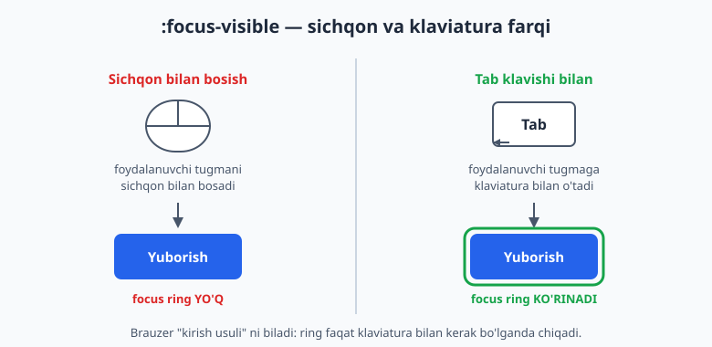
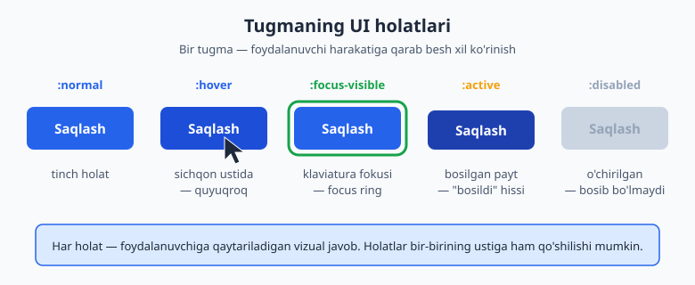
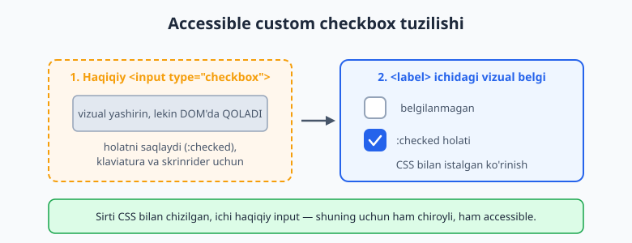
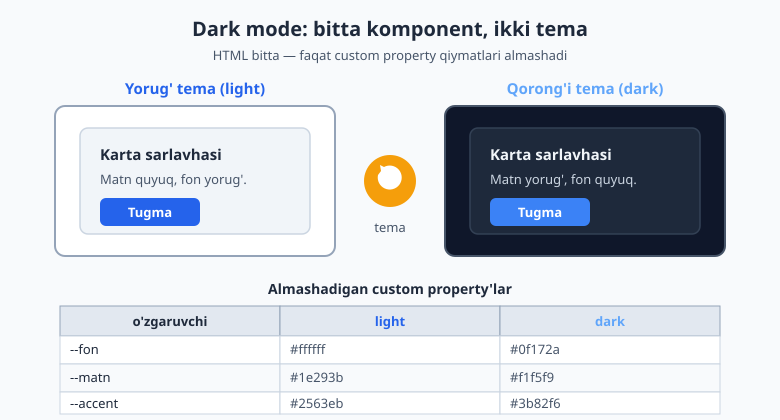

# 21 — Formalar, UI holatlari va kirish imkoniyati

[⬅️ Oldingi: 20 — CSS arxitekturasi va uslublar](./20-arxitektura-uslublar.md) · [🏠 README](./README.md) · [Keyingi: 22 — Yakuniy loyiha — responsive landing page ➡️](./22-capstone-loyiha.md)

> **Bu bobda:** formalarni chiroyli bezashni, interaktiv holatlarni (`:hover`, `:focus-visible`, `:checked` va boshqalar), dark mode'ni va kirish imkoniyatini (accessibility) o'rganamiz — sayt nafaqat ko'rkam, balki har bir foydalanuvchi uchun qulay bo'lishi uchun.

---

## 21.1 Nega aynan formalar va holatlar?

Sayt — bu shunchaki o'qiladigan matn emas. Foydalanuvchi unga **javob qaytaradi**: tugmani bosadi, maydonga yozadi, katakchani belgilaydi. Aynan shu nuqtada CSS faqat "bezak" bo'lishdan to'xtaydi va **muloqotning bir qismiga** aylanadi.

Tasavvur qil: lift tugmasini bosding, lekin u na yorishdi, na ovoz chiqardi. "Bosildimi yoki yo'qmi?" deb yana bosasan. Vizual javob bo'lmagani uchun ishonchsizlik tug'iladi. Sayt tugmalari ham xuddi shunday: foydalanuvchi sichqonni ustiga olganda rang o'zgarishi, bosilganda biroz "cho'kishi" kerak — bular **interaktiv holatlar** (interaktiv holat — element foydalanuvchi harakatiga qarab o'zgargan ko'rinishi).

Bu bobda uchta katta mavzuni bog'laymiz:

- **Forma elementlarini bezash** — input, textarea, select, checkbox, radio.
- **Holat selektorlari** — `:hover`, `:focus`, `:focus-visible`, `:active`, `:disabled`, `:checked`, `:valid`/`:invalid`.
- **Hammaga qulaylik** — dark mode, kontrast, fokus halqasi (focus ring), harakat sezgirligi (`prefers-reduced-motion`), teginish maydonlari.

📌 **Eslatma:** formalarning HTML tomonini biz 5-bobda o'rgangan edik (`<input>`, `<label>`, `<select>` va h.k.). Bu yerda esa ularning **ko'rinishi** va **xatti-harakati** bilan shug'ullanamiz. Agar HTML qismini unutgan bo'lsang, 5-bobni qayta ko'zdan kechir.

---

## 21.2 Brauzer standart ko'rinishini qaytadan boshlash

Birinchi savol: nega input'lar har brauzerda har xil ko'rinadi? Chunki brauzer ularga o'zining **standart stillari** (user-agent stylesheet) ni beradi. Chiroyli, izchil dizayn uchun avval shu standartni "nolga keltirib", keyin o'zimiznikini quramiz.

```css
/* Forma elementlari shrift va o'lchamni o'zidan MEROS qilib olmaydi — */
/* shuni majburlaymiz, aks holda ular brauzer shriftida qoladi */
input,
textarea,
select,
button {
  font: inherit;        /* atrofdagi matn shriftini olsin */
  color: inherit;
}

/* Qutida o'lcham hisobini soddalashtirish (11-bobdagi box-sizing) */
*,
*::before,
*::after {
  box-sizing: border-box;
}
```

⚠️ **Eng keng tarqalgan ajablanish:** `<input>` va `<button>` matn shriftini **avtomatik meros qilmaydi**. Brauzer ularga "Arial 13px" kabi tizimli shriftni beradi. `font: inherit` bo'lmasa, butun saytning shrifti chiroyli, lekin formalar begona ko'rinadi. Bu — birinchi yoziladigan qatorlardan biri.

💡 **Maslahat:** brauzer standartini butunlay tozalash uchun ko'pchilik [normalize.css yoki modern-normalize](https://github.com/sindresorhus/modern-normalize) deb nomlangan tayyor faylni ulaydi. Hozircha yuqoridagi bir necha qator boshlovchi loyiha uchun yetarli.

---

## 21.3 Input va textarea'ni uslublash

Endi maydonni o'zimizcha bezaymiz. Asosiy g'oya — bir nechta **umumiy stil** berib, keyin holatlarda uni o'zgartirish.

```css
.maydon {
  width: 100%;
  padding: 10px 12px;
  font: inherit;
  color: #1e293b;
  background: #ffffff;
  border: 1px solid #94a3b8;   /* tinch holatdagi chegara */
  border-radius: 8px;
  transition: border-color 0.15s, box-shadow 0.15s; /* silliq o'tish */
}

/* Placeholder (maydon ichidagi maslahat matni) rangi */
.maydon::placeholder {
  color: #94a3b8;
}
```

```html
<label for="email">Email manzilingiz</label>
<input class="maydon" type="email" id="email" placeholder="ism@misol.uz">
```

**Natija:** chetlari yumaloq, ichida bo'sh joy (padding) bor, oddiy va toza maydon. `transition` tufayli keyingi bo'limda qo'shadigan holat o'zgarishlari keskin emas, **silliq** bo'ladi.

`textarea` uchun bitta foydali qo'shimcha bor:

```css
textarea.maydon {
  min-height: 120px;
  resize: vertical;   /* foydalanuvchi faqat balandlikni cho'zsin */
}
```

📌 **Nega `resize: vertical`?** Standartda `textarea` ni har ikki tomonga cho'zish mumkin. Lekin enini cho'zish layout'ni buzadi (maydon ota-elementdan oshib ketadi). `vertical` — eng xavfsiz va eng ko'p ishlatiladigan tanlov.

---

## 21.4 `:focus` va `:focus-visible` — eng muhim holat

Foydalanuvchi maydonga yozishni boshlaganda, **qaysi maydon faolligini** ko'rsatish kerak. Bu — `:focus` holati.

```css
.maydon:focus {
  outline: none;                    /* brauzer standart konturini olib tashlaymiz */
  border-color: #2563eb;            /* chegara accent rangga o'tadi */
  box-shadow: 0 0 0 3px rgba(37, 99, 235, 0.25); /* yumshoq "halqa" */
}
```

Bu yerda muhim nozik nuqta bor. `outline: none` deb yozdik — bu **xavfli** qadam, chunki outline (kontur) klaviatura bilan ishlovchilar uchun hayotiy. Shuning uchun **darhol o'rniga** `box-shadow` bilan o'z halqamizni qo'ydik. Hech qachon hech narsa qo'ymasdan outline'ni o'chirmang.

### `:focus` va `:focus-visible` farqi

Mana eng zamonaviy va eng foydali holat. Muammo shunday: agar har **fokus**da halqa chiqarsang, sichqon bilan tugmani bosgan odam ham keraksiz halqa ko'radi (chunki bosish ham fokus beradi). Bu bezovta qiladi.

`:focus-visible` — brauzerga "halqani **faqat kerak bo'lganda**, ya'ni odam klaviatura (Tab) bilan o'tganda ko'rsat" deb aytadi. Sichqon bilan bosganda halqa chiqmaydi.



```css
/* Sichqon bosishi: halqa YO'Q. Tab bilan o'tish: halqa BOR. */
.tugma:focus-visible {
  outline: 3px solid #2563eb;
  outline-offset: 2px;
}

/* Eski brauzerlar :focus-visible ni bilmaydi — ularga oddiy :focus bilan zaxira beramiz */
.tugma:focus:not(:focus-visible) {
  outline: none;  /* yangi brauzerlarda sichqon fokusida halqani o'chiramiz */
}
```

💡 **Qisqacha qoida:** odat sifatida **`:focus-visible` ishlat**, oddiy `:focus` emas. Shunda klaviatura foydalanuvchilari halqani ko'radi, sichqon foydalanuvchilari esa bezovta bo'lmaydi — ikkala tomon ham yutadi.

⚠️ **Nega bu muhim?** Klaviatura bilan ishlovchilar (sichqon ishlatolmaydigan, yoki shunchaki tezroq harkat qiluvchi odamlar) hozir **qayerda turganini** faqat focus ring orqali biladi. Uni o'chirib yuborish — ular uchun saytni "ko'r" qilish bilan teng.

---

## 21.5 Holat selektorlarining to'liq ro'yxati

Tugma misolida barcha asosiy holatlarni bir joyga yig'aylik. Quyidagi diagramma tugmaning beshta holatini ko'rsatadi:



```css
.tugma {
  padding: 10px 20px;
  font: inherit;
  font-weight: 600;
  color: #ffffff;
  background: #2563eb;
  border: none;
  border-radius: 8px;
  cursor: pointer;
  transition: background 0.15s, transform 0.05s;
}

/* :hover — sichqon ustida (quyuqroq rang) */
.tugma:hover {
  background: #1d4ed8;
}

/* :focus-visible — klaviatura fokusi (halqa) */
.tugma:focus-visible {
  outline: 3px solid #2563eb;
  outline-offset: 2px;
}

/* :active — bosib turilgan payt ("cho'kish" hissi) */
.tugma:active {
  background: #1e40af;
  transform: translateY(1px);
}

/* :disabled — o'chirilgan (bosib bo'lmaydi) */
.tugma:disabled {
  background: #cbd5e1;
  color: #94a3b8;
  cursor: not-allowed;
}
```

Har bir holatning **ma'nosi**:

| Selektor | Qachon faollashadi | Nega kerak |
|---|---|---|
| `:hover` | sichqon element ustida | "bu narsa bosiladigan" signali |
| `:focus` | element fokusda (har qanday usulda) | qayerda turganimizni bildiradi |
| `:focus-visible` | fokus **klaviaturadan** kelganda | sichqonni bezovta qilmasdan halqa |
| `:active` | element bosib turilgan payt | "bosildi" degan tezkor javob |
| `:disabled` | element `disabled` atributiga ega | harakat hozir mumkin emas |
| `:checked` | checkbox/radio belgilangan | tanlangan holatni ko'rsatadi |

📌 **Tartib muhim:** agar bir elementga `:hover`, `:focus`, `:active` ni birga yozsang, ularni shu tartibda yozish odat (ba'zan "LVHA/HFA qoidasi" deyiladi). Sababi — specificity teng bo'lganda, keyin yozilgani g'olib chiqadi (10-bobdagi cascade). Masalan `:active` ni `:hover` dan keyin yozsak, bosilgan payt to'g'ri rang ko'rinadi.

---

## 21.6 Custom checkbox va radio (accessible)

Standart checkbox kichkina va uni CSS bilan bezash qiyin. Lekin **uni butunlay almashtirib bo'lmaydi** — chunki haqiqiy `<input>` klaviatura va skrinrider (screen reader — ekran o'quvchi) uchun zarur. Yechim: haqiqiy input'ni saqlab, **vizual qismini o'zimiz chizamiz**.



Avval HTML — input `<label>` ichida turadi, shunday qilib label'ning istalgan joyiga bosish input'ni belgilaydi:

```html
<label class="tanlov">
  <input type="checkbox" class="tanlov__input">
  <span class="tanlov__belgi" aria-hidden="true"></span>
  <span class="tanlov__matn">Shartlarga roziman</span>
</label>
```

Endi CSS. Asosiy hiyla — haqiqiy input'ni **ko'rinmas qilamiz, lekin o'chirmaymiz**:

```css
.tanlov {
  display: inline-flex;
  align-items: center;
  gap: 10px;
  cursor: pointer;
}

/* Haqiqiy input: vizual yashirin, AMMO mavjud va fokus oladi */
.tanlov__input {
  position: absolute;
  opacity: 0;            /* ko'rinmas */
  width: 0;
  height: 0;
}

/* O'zimiz chizgan vizual katakcha */
.tanlov__belgi {
  width: 22px;
  height: 22px;
  border: 2px solid #94a3b8;
  border-radius: 6px;
  background: #ffffff;
  display: inline-flex;
  align-items: center;
  justify-content: center;
  transition: background 0.15s, border-color 0.15s;
}

/* Input belgilangan (:checked) bo'lsa, YONIDAGI belgini bo'yaymiz */
.tanlov__input:checked + .tanlov__belgi {
  background: #2563eb;
  border-color: #2563eb;
}

/* Belgilanganda ichida "tasdiq" (✓) chizig'ini ko'rsatamiz */
.tanlov__input:checked + .tanlov__belgi::after {
  content: "";
  width: 6px;
  height: 11px;
  border: solid #ffffff;
  border-width: 0 2px 2px 0;
  transform: rotate(45deg);
  margin-top: -2px;
}

/* MUHIM: input klaviatura bilan fokus olganda, vizual belgida halqa ko'rsatamiz */
.tanlov__input:focus-visible + .tanlov__belgi {
  outline: 3px solid #2563eb;
  outline-offset: 2px;
}
```

Bu yerda nima sodir bo'ldi, qadam-baqadam:

1. **`opacity: 0` bilan yashirdik, `display: none` BILAN EMAS.** Bu juda muhim farq. `display: none` qilsak, input klaviaturadan fokus ololmaydi va skrinrider uni o'qiy olmaydi — accessibility buziladi. `opacity: 0` esa uni faqat **ko'zga** ko'rinmas qiladi, ammo u hamon "tirik".
2. **`+` (qo'shni qardosh) kombinatori.** `.tanlov__input:checked + .tanlov__belgi` — "belgilangan input'ning to'g'ridan-to'g'ri **keyingi** elementi" degani (9-bobdagi kombinatorlarni eslang). Shuning uchun HTML'da `<span class="tanlov__belgi">` aynan input'dan **keyin** turishi shart.
3. **`::after` bilan ✓ belgisini chizdik** — to'rtburchakning faqat ikki tomonini chegara qilib, 45 daraja burib, "tasdiq" shaklini hosil qildik.
4. **`:focus-visible` halqasini vizual belgiga ko'chirdik** — chunki haqiqiy input ko'rinmas, halqa ko'rinadigan qismga tushishi kerak.

📌 `aria-hidden="true"` — vizual `<span>` ga qo'ydik, chunki u faqat bezak; skrinrider uni o'qimasligi kerak (haqiqiy input allaqachon "checkbox" deb o'qiladi).

💡 **Radio uchun ham xuddi shu naqsh** ishlaydi — faqat `border-radius` ni `50%` qilib doira, va `::after` ichida nuqta chizasiz. `type="radio"` qilsangiz, brauzer "bittasini tanlash" mantig'ini o'zi boshqaradi.

---

## 21.7 `:valid`, `:invalid` va forma tekshiruvi

Brauzer forma maydonlarini **o'zi tekshiradi** (HTML `type`, `required`, `pattern` asosida). CSS bu natijaga `:valid` va `:invalid` orqali javob bera oladi.

```html
<label for="pochta">Email</label>
<input type="email" id="pochta" class="maydon" required>
```

```css
/* To'g'ri to'ldirilgan: yashil chegara */
.maydon:valid {
  border-color: #16a34a;
}

/* Xato: qizil chegara */
.maydon:invalid {
  border-color: #dc2626;
}
```

Bitta jiddiy muammo bor: sahifa ochilishi bilanoq bo'sh `required` maydon **darhol** qizil bo'lib qoladi — foydalanuvchi hali hech narsa qilmagan bo'lsa ham. Bu adolatsiz va bezovta qiladi.

Yechim — `:user-invalid` (zamonaviy brauzerlar) yoki `:invalid` ni `:focus` bilan birga ishlatish:

```css
/* Faqat foydalanuvchi MULOQOT QILGANDAN keyin xatoni ko'rsat */
.maydon:user-invalid {
  border-color: #dc2626;
  background: #fef2f2;
}
```

⚠️ **`:invalid` tuzog'i:** uni yolg'iz ishlatmang. `:user-invalid` (yoki ozgina JavaScript bilan "touched" sinfini qo'shish) foydalanuvchi maydonni tark etgandan keyingina xatoni ko'rsatadi — bu ancha xushmuomala tajriba. Eski brauzerlar uchun `:user-invalid` ni `:invalid` bilan birga, zaxira sifatida bering.

---

## 21.8 Karta va tugma uslublari

Endi o'rgangan holatlarni amaliy komponentlarga qo'llaymiz. **Karta** (card) — sayt dizaynidagi eng keng tarqalgan "quti".

```html
<article class="karta">
  <h3 class="karta__sarlavha">Mahsulot nomi</h3>
  <p class="karta__matn">Qisqacha tavsif shu yerda turadi.</p>
  <button class="tugma">Batafsil</button>
</article>
```

```css
.karta {
  padding: 20px;
  background: #ffffff;
  border: 1px solid #e2e8f0;
  border-radius: 12px;
  box-shadow: 0 1px 3px rgba(0, 0, 0, 0.08);
  transition: box-shadow 0.2s, transform 0.2s;
}

/* Sichqon ustida karta biroz "ko'tariladi" */
.karta:hover {
  box-shadow: 0 8px 24px rgba(0, 0, 0, 0.12);
  transform: translateY(-2px);
}
```

**Natija:** karta ustiga sichqon olib borilganda soya kattalashadi va karta yuqoriga ozgina suriladi — bu unga "yuzaga ko'tarilish" tuyg'usini beradi (13-bobdagi soyalar va 18-bobdagi transform'ni eslang).

💡 **Maslahat:** `transform: translateY(-2px)` `margin` o'zgartirishdan yaxshiroq, chunki transform layout'ni qayta hisoblashga majburlamaydi (atrofdagi elementlar joyidan siljimaydi) — natijada animatsiya silliqroq bo'ladi.

---

## 21.9 Navbar — flexbox bilan navigatsiya

Deyarli har sayt yuqorida **navbar** (navigatsiya paneli) ga ega: chap tomonda logotip, o'ng tomonda havolalar. Buni flexbox bilan qilish juda oson (15-bob).

```html
<nav class="navbar">
  <a class="navbar__logo" href="/">Mening Saytim</a>
  <ul class="navbar__menu">
    <li><a href="/">Bosh sahifa</a></li>
    <li><a href="/haqida">Biz haqimizda</a></li>
    <li><a href="/aloqa">Aloqa</a></li>
  </ul>
</nav>
```

```css
.navbar {
  display: flex;
  align-items: center;            /* vertikal markazlash */
  justify-content: space-between; /* logo chapda, menyu o'ngda */
  padding: 12px 24px;
  background: #ffffff;
  border-bottom: 1px solid #e2e8f0;
}

.navbar__logo {
  font-weight: 700;
  font-size: 1.2rem;
  color: #1e293b;
  text-decoration: none;
}

.navbar__menu {
  display: flex;
  gap: 24px;          /* havolalar orasidagi masofa */
  list-style: none;   /* nuqtalarni olib tashlaymiz */
  margin: 0;
  padding: 0;
}

.navbar__menu a {
  color: #475569;
  text-decoration: none;
  padding: 6px 4px;
  transition: color 0.15s;
}

.navbar__menu a:hover {
  color: #2563eb;
}

/* Klaviatura uchun fokus halqasi — UNUTMAYMIZ */
.navbar__menu a:focus-visible {
  outline: 2px solid #2563eb;
  outline-offset: 2px;
  border-radius: 4px;
}
```

`justify-content: space-between` ikkita bolani qutining ikki chetiga itaradi — logo chapga, menyu o'ngga. `gap` esa menyu havolalari orasiga teng masofa qo'yadi. Bu — navbar uchun klassik naqsh.

📌 **Mobil eslatma:** kichik ekranlarda menyuni "gamburger" tugmasiga yashirish kerak bo'ladi — bu odatda JavaScript talab qiladi. CSS tomondan esa `@media (max-width: 600px)` ichida `.navbar__menu` ni `display: none` qilib, JS uni ochadi. Bu kitobimiz doirasidan tashqarida, lekin tuzilma shunday.

---

## 21.10 Dark mode — `prefers-color-scheme` va custom property

Ko'p foydalanuvchilar **qorong'i tema** (dark mode) ni afzal ko'radi — ayniqsa kechqurun. Operatsion tizim bu afzallikni biladi, va CSS uni `prefers-color-scheme` orqali eshita oladi.

Eng toza usul — barcha ranglarni **custom property** (CSS o'zgaruvchilari, 19-bob) qilib e'lon qilish, keyin temaga qarab faqat **qiymatlarni** almashtirish. Komponentlar o'zgaruvchini ishlatadi, qiymatdan bexabar.



```css
/* 1. Yorug' tema — standart qiymatlar */
:root {
  --fon: #ffffff;
  --yuza: #f1f5f9;     /* karta foni */
  --matn: #1e293b;
  --matn-ikkilamchi: #475569;
  --chegara: #cbd5e1;
  --accent: #2563eb;
}

/* 2. Tizim qorong'i temani so'rasa — faqat QIYMATLARNI almashtiramiz */
@media (prefers-color-scheme: dark) {
  :root {
    --fon: #0f172a;
    --yuza: #1e293b;
    --matn: #f1f5f9;
    --matn-ikkilamchi: #cbd5e1;
    --chegara: #334155;
    --accent: #3b82f6;   /* qorong'ida ozroq yorqin ko'k */
  }
}

/* 3. Komponentlar FAQAT o'zgaruvchilarni ishlatadi */
body {
  background: var(--fon);
  color: var(--matn);
}

.karta {
  background: var(--yuza);
  color: var(--matn);
  border: 1px solid var(--chegara);
}

.tugma {
  background: var(--accent);
  color: #ffffff;
}
```

Bu yondashuvning go'zalligi: `.karta` va `.tugma` qoidalariga **umuman tegmaymiz**. Tema almashganda faqat `:root` dagi oltita qiymat o'zgaradi, butun sayt esa o'zi yangilanadi. Bu — DRY (Don't Repeat Yourself — "takrorlamaslik") tamoyilining ajoyib namunasi.

### Foydalanuvchi qo'lda almashtirsa-chi?

Ko'pincha saytda "tema almashtirish" tugmasi bo'ladi. Buning uchun temani `:root` ga emas, balki `<html>` dagi atributga bog'laymiz, va JavaScript shu atributni almashtiradi:

```css
/* Standart (yorug') */
:root {
  --fon: #ffffff;
  --matn: #1e293b;
}

/* <html data-tema="dark"> bo'lsa */
:root[data-tema="dark"] {
  --fon: #0f172a;
  --matn: #f1f5f9;
}
```

```js
// Tugma bosilganda atributni almashtiramiz
const tugma = document.querySelector('.tema-tugma');
tugma.addEventListener('click', () => {
  const html = document.documentElement;
  const hozir = html.getAttribute('data-tema');
  html.setAttribute('data-tema', hozir === 'dark' ? 'light' : 'dark');
});
```

💡 **Eng yaxshi amaliyot:** ikkalasini birlashtir — standart bo'yicha `prefers-color-scheme` ni hurmat qil (tizim afzalligi), lekin foydalanuvchi qo'lda almashtirsa, uning tanlovi ustun bo'lsin (`data-tema` atributi orqali). Bu eng xushmuomala xatti-harakat.

---

## 21.11 CSS'da kirish imkoniyati (accessibility)

Accessibility (qisqacha **a11y**) — saytni **har bir odam** ishlata olishini ta'minlash: ko'rish qobiliyati cheklangan, sichqon ishlatolmaydigan, harakatga sezgir foydalanuvchilar. CSS bu yerda muhim rol o'ynaydi.

### Qoida 1: fokus halqasini hech qachon yo'q qilma

Eng ko'p uchraydigan a11y xatosi — bu:

```css
/* JINOYAT — buni hech qachon qilma */
*:focus {
  outline: none;
}
```

Bu klaviatura foydalanuvchilarini "ko'r" qiladi: ular qayerda turganini bilmaydi. Agar standart halqa dizayningga to'g'ri kelmasa, uni **o'chirma — almashtir**:

```css
:focus-visible {
  outline: 3px solid #2563eb;
  outline-offset: 2px;
}
```

### Qoida 2: yetarli kontrast

Matn va fon orasida yetarli **kontrast** (qarama-qarshilik) bo'lishi shart, aks holda kam ko'radigan odamlar o'qiy olmaydi. WCAG standarti oddiy matn uchun kamida **4.5:1** nisbatni talab qiladi.

```css
/* YOMON: och-kulrang matn oq fonda — kontrast ~2:1, o'qib bo'lmaydi */
.yomon { color: #cbd5e1; background: #ffffff; }

/* YAXSHI: quyuq matn — kontrast ~12:1 */
.yaxshi { color: #1e293b; background: #ffffff; }
```

💡 Kontrastni tekshirish uchun brauzer DevTools (rang tanlovchida nisbat ko'rsatiladi) yoki onlayn "contrast checker" dan foydalan.

### Qoida 3: harakatga hurmat — `prefers-reduced-motion`

Ba'zi odamlarda animatsiya **bosh aylanishi yoki ko'ngil aynishi** keltirib chiqaradi (vestibulyar buzilish). Ular tizim sozlamalarida "harakatni kamaytirish" ni yoqadi. Biz buni hurmat qilamiz:

```css
/* Standart: silliq animatsiyalar */
.karta {
  transition: transform 0.2s;
}

/* Foydalanuvchi harakatni kamaytirishni so'rasa — animatsiyani o'chiramiz */
@media (prefers-reduced-motion: reduce) {
  *,
  *::before,
  *::after {
    animation-duration: 0.01ms !important;
    animation-iteration-count: 1 !important;
    transition-duration: 0.01ms !important;
    scroll-behavior: auto !important;
  }
}
```

📌 **Nega `!important`?** Bu yerda u o'rinli — bu foydalanuvchining sog'lig'iga oid afzalligi va u **har qanday** komponent stilidan ustun turishi kerak. Bu — `!important` ning kam sonli to'g'ri ishlatilish holatlaridan biri.

### Qoida 4: yetarli teginish maydoni

Telefonda barmoq sichqon kursoridan ancha katta. Agar tugma juda kichik bo'lsa, foydalanuvchi noto'g'ri joyni bosadi. Tavsiya — **kamida 44×44 piksel** teginish maydoni.

```css
.tugma,
.navbar__menu a {
  min-height: 44px;          /* barmoq uchun yetarli balandlik */
  min-width: 44px;
  display: inline-flex;
  align-items: center;
  justify-content: center;
}
```

⚠️ Vizual jihatdan kichik ikonka tugmasini ham `padding` yoki `min-height` bilan teginish maydonini kattalashtirish kerak — ko'rinish kichik, lekin bosiladigan joy katta bo'lsin.

📌 **Bonus: `:focus-within`.** Forma ichidagi **biror** maydon fokusda bo'lganda butun konteynerga stil berishingiz mumkin: `.forma:focus-within { border-color: #2563eb; }` — bu foydalanuvchiga "siz hozir shu forma bilan ishlayapsiz" degan kuchli signal beradi.

---

## 21.12 Print uslublari — `@media print` (qisqacha)

Foydalanuvchi sahifani **bosib chiqarsa** (yoki PDF qilsa) ham, u chiroyli ko'rinishi kerak. Navbar, tugmalar, fonlar qog'ozda keraksiz. `@media print` shu uchun:

```css
@media print {
  /* Qog'ozga kerak bo'lmagan narsalarni yashiramiz */
  .navbar,
  .tugma,
  .reklama,
  footer {
    display: none;
  }

  /* Qora matn, oq fon — siyohni tejaymiz */
  body {
    color: #000;
    background: #fff;
  }

  /* Havola manzilini matn yonida ko'rsatamiz (qog'ozda bosib bo'lmaydi-ku) */
  a[href]::after {
    content: " (" attr(href) ")";
    font-size: 0.85em;
    color: #555;
  }
}
```

💡 `a[href]::after { content: " (" attr(href) ")"; }` — bu chiroyli hiyla: chop etilgan qog'ozda havolaning **manzilini** matn yonida ko'rsatadi, chunki qog'ozda havolani bosib bo'lmaydi. `attr(href)` atribut qiymatini o'qiydi.

📌 Print stillarni o'zingiz ko'rish uchun: brauzerda `Ctrl+P` (chop etish oynasi) — u jonli oldindan ko'rsatma beradi.

---

## Mashqlar

> Mashqlarni bajarib ko'r, keyin yechimni och. Eng ko'p narsa o'zing urinib ko'rganingda yodda qoladi.

**1-mashq.** Bitta `<input type="text">` yarat va unga shunday stil ber: tinch holatda kulrang chegara, fokusda ko'k chegara va yumshoq ko'k "halqa" (`box-shadow`). `outline` ni o'chirsang, albatta o'rniga ko'rinadigan narsa qo'y.

<details markdown="1"><summary>Yechim</summary>

```css
.maydon {
  padding: 10px 12px;
  border: 1px solid #94a3b8;
  border-radius: 8px;
  font: inherit;
  transition: border-color 0.15s, box-shadow 0.15s;
}
.maydon:focus {
  outline: none;
  border-color: #2563eb;
  box-shadow: 0 0 0 3px rgba(37, 99, 235, 0.25);
}
```

`transition` tufayli fokusga o'tish silliq bo'ladi. `outline: none` ni qo'ydik, lekin darhol `box-shadow` bilan ko'rinadigan halqa berdik — fokus hech qachon "ko'rinmas" qolmaydi.

</details>

**2-mashq.** Tugma yarat va uning **to'rtta holatini** bezab chiq: normal (ko'k), `:hover` (quyuqroq), `:active` (yana quyuqroq + 1px pastga siljish), `:disabled` (kulrang, `cursor: not-allowed`).

<details markdown="1"><summary>Yechim</summary>

```css
.tugma {
  padding: 10px 20px;
  color: #fff;
  background: #2563eb;
  border: none;
  border-radius: 8px;
  cursor: pointer;
  transition: background 0.15s, transform 0.05s;
}
.tugma:hover { background: #1d4ed8; }
.tugma:active { background: #1e40af; transform: translateY(1px); }
.tugma:disabled {
  background: #cbd5e1;
  color: #94a3b8;
  cursor: not-allowed;
}
```

`transform: translateY(1px)` bosilgan paytda tugmaning "cho'kkani" hissini beradi.

</details>

**3-mashq.** `:focus` va `:focus-visible` farqini o'z so'zing bilan tushuntir. Qaysi birini odatda ishlatish kerak va nega?

<details markdown="1"><summary>Yechim</summary>

`:focus` element **har qanday** usulda (sichqon bosishi yoki klaviatura) fokus olganda faollashadi. `:focus-visible` esa fokus **klaviatura** orqali kelganda (yoki brauzer "halqa kerak" deb hisoblaganda) faollashadi — sichqon bosishida halqa chiqmaydi.

Odatda **`:focus-visible`** ishlatiladi: u klaviatura foydalanuvchilariga zarur halqani beradi, lekin sichqon foydalanuvchilarini keraksiz halqa bilan bezovta qilmaydi. Ikkala tomon ham yutadi.

</details>

**4-mashq.** Accessible custom checkbox yarat: haqiqiy input ko'rinmas bo'lsin (lekin o'chmasin!), yonida o'zing chizgan katakcha turadi, `:checked` da u ko'k bo'lib ichida belgi paydo bo'ladi.

<details markdown="1"><summary>Yechim</summary>

```html
<label class="tanlov">
  <input type="checkbox" class="tanlov__input">
  <span class="tanlov__belgi" aria-hidden="true"></span>
  <span>Roziman</span>
</label>
```
```css
.tanlov { display: inline-flex; align-items: center; gap: 10px; cursor: pointer; }
.tanlov__input { position: absolute; opacity: 0; width: 0; height: 0; }
.tanlov__belgi {
  width: 22px; height: 22px;
  border: 2px solid #94a3b8; border-radius: 6px;
  display: inline-flex; align-items: center; justify-content: center;
}
.tanlov__input:checked + .tanlov__belgi {
  background: #2563eb; border-color: #2563eb;
}
.tanlov__input:checked + .tanlov__belgi::after {
  content: ""; width: 6px; height: 11px;
  border: solid #fff; border-width: 0 2px 2px 0;
  transform: rotate(45deg); margin-top: -2px;
}
.tanlov__input:focus-visible + .tanlov__belgi {
  outline: 3px solid #2563eb; outline-offset: 2px;
}
```

Asosiy nuqta: `opacity: 0` (`display: none` EMAS) — shunda input klaviatura va skrinrider uchun "tirik" qoladi. `+` kombinatori belgilangan input'ning keyingi `<span>` ini bo'yaydi.

</details>

**5-mashq.** `:root` da uchta custom property e'lon qil (`--fon`, `--matn`, `--accent`) va `prefers-color-scheme: dark` ichida ularning qiymatlarini almashtir. `body` va bitta `.tugma` shu o'zgaruvchilarni ishlatsin. Sinab ko'r: tizim temasini almashtirganda sayt o'zi o'zgaradimi?

<details markdown="1"><summary>Yechim</summary>

```css
:root {
  --fon: #ffffff;
  --matn: #1e293b;
  --accent: #2563eb;
}
@media (prefers-color-scheme: dark) {
  :root {
    --fon: #0f172a;
    --matn: #f1f5f9;
    --accent: #3b82f6;
  }
}
body { background: var(--fon); color: var(--matn); }
.tugma { background: var(--accent); color: #fff; }
```

E'tibor ber: `body` va `.tugma` qoidalari **bir marta** yozildi va o'zgartirilmadi. Tema almashganda faqat `:root` dagi qiymatlar yangilanadi — bu DRY tamoyilining go'zal namunasi.

</details>

**6-mashq.** Foydalanuvchi sog'lig'i uchun: `@media (prefers-reduced-motion: reduce)` blokini yoz, u barcha `transition` va `animation` ni deyarli nolga keltirsin. Nega bu yerda `!important` ishlatish o'rinli?

<details markdown="1"><summary>Yechim</summary>

```css
@media (prefers-reduced-motion: reduce) {
  *, *::before, *::after {
    animation-duration: 0.01ms !important;
    animation-iteration-count: 1 !important;
    transition-duration: 0.01ms !important;
    scroll-behavior: auto !important;
  }
}
```

`!important` bu yerda o'rinli, chunki bu foydalanuvchining **sog'ligiga oid afzalligi** (animatsiya bosh aylanishi keltirib chiqarishi mumkin) va u har qanday komponent stilidan ustun turishi shart. Bu — `!important` ning kam sonli to'g'ri qo'llanish holatlaridan biri.

</details>

**7-mashq.** Flexbox bilan navbar yasab chiq: chap tomonda logo, o'ng tomonda uch havola. Havolalar `:hover` da rang o'zgartirsin va `:focus-visible` da ko'rinadigan halqa olsin. Teginish maydoni kamida 44px balandlikda bo'lsin.

<details markdown="1"><summary>Yechim</summary>

```css
.navbar {
  display: flex;
  align-items: center;
  justify-content: space-between;
  padding: 0 24px;
}
.navbar__menu {
  display: flex; gap: 24px;
  list-style: none; margin: 0; padding: 0;
}
.navbar__menu a {
  display: inline-flex; align-items: center;
  min-height: 44px;          /* teginish maydoni */
  color: #475569; text-decoration: none;
  transition: color 0.15s;
}
.navbar__menu a:hover { color: #2563eb; }
.navbar__menu a:focus-visible {
  outline: 2px solid #2563eb;
  outline-offset: 2px;
  border-radius: 4px;
}
```

`justify-content: space-between` logoni chapga, menyuni o'ngga itaradi; `gap` havolalar orasini ajratadi; `min-height: 44px` esa barmoq uchun yetarli teginish maydonini ta'minlaydi.

</details>

**8-mashq.** (Qiyinroq) Forma maydonida `:user-invalid` ni ishlatib, xato faqat foydalanuvchi maydon bilan **muloqot qilgandan keyin** ko'rinsin. Nega oddiy `:invalid` ni yolg'iz ishlatish yomon tajriba beradi?

<details markdown="1"><summary>Yechim</summary>

```html
<input type="email" class="maydon" required>
```
```css
.maydon:user-invalid {
  border-color: #dc2626;
  background: #fef2f2;
}
```

Oddiy `:invalid` ni yolg'iz ishlatsak, sahifa ochilishi bilanoq bo'sh `required` maydon **darhol qizil** bo'ladi — foydalanuvchi hali hech narsa yozmagan bo'lsa ham. Bu adolatsiz va bezovta qiladi. `:user-invalid` esa xatoni faqat foydalanuvchi maydonni to'ldirib, undan chiqqandan **keyin** ko'rsatadi — bu ancha xushmuomala tajriba. (Eski brauzerlar uchun `:user-invalid` ni `:invalid` bilan zaxira sifatida birga berish mumkin.)

</details>

---

[⬅️ Oldingi: 20 — CSS arxitekturasi va uslublar](./20-arxitektura-uslublar.md) · [🏠 README](./README.md) · [Keyingi: 22 — Yakuniy loyiha — responsive landing page ➡️](./22-capstone-loyiha.md)
