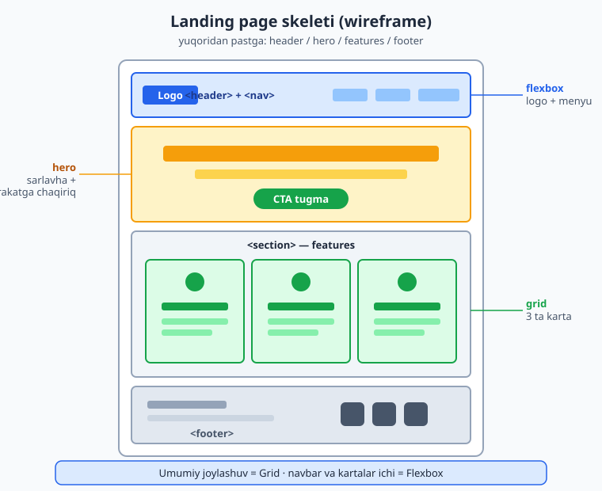
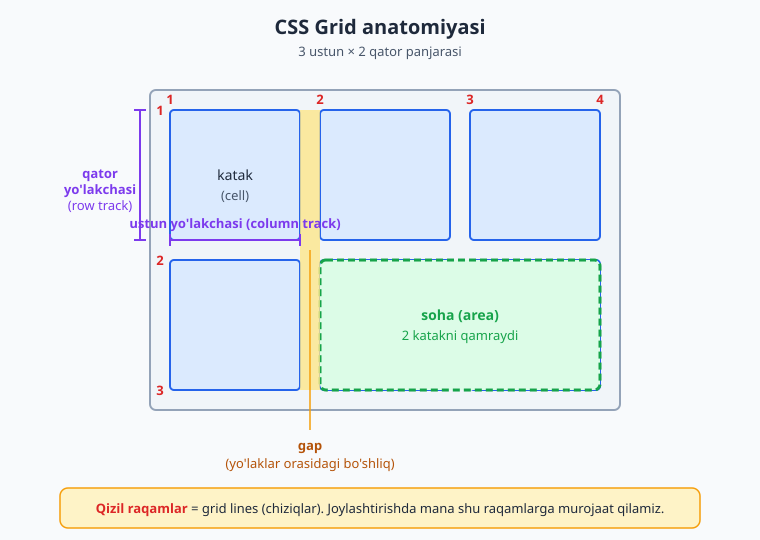
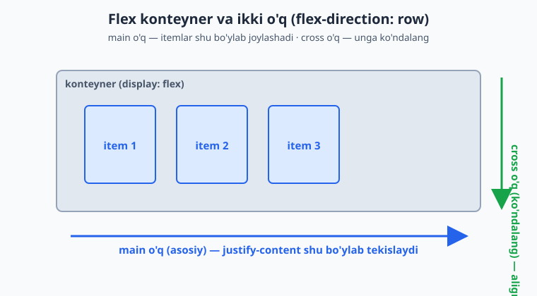
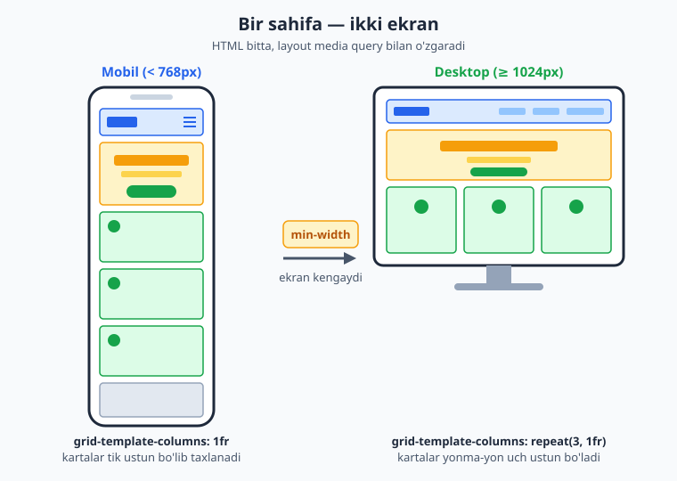
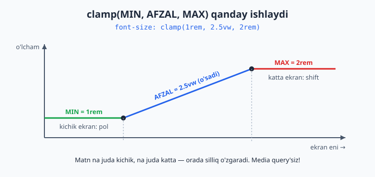

# 22 — Yakuniy loyiha — responsive landing page

[⬅️ Oldingi: 21 — Formalar, UI holatlari va kirish imkoniyati](./21-amaliy-forma-ui-states.md) · [🏠 README](./README.md)

> **Bu bobda:** shu paytgacha o'rgangan hamma narsani — semantik HTML, custom properties bilan dizayn tizimi, Grid va Flexbox, responsive, dark mode, hover/focus va animatsiya — birlashtirib, noldan to'liq ishlaydigan, ko'chirib qo'yib ishlatsa bo'ladigan responsive landing page quramiz.

---

## 22.1 Loyihaga kirish — nima quramiz va nega

Tabriklaymiz — sen bu yerga yetib kelding! Box model, Flexbox, Grid, responsive, custom properties, animatsiya... ularning har biri alohida bo'lakcha edi. Bu bobda biz ularni **bitta haqiqiy mahsulot** ichida bog'laymiz.

Quradigan narsamiz — **landing page** (qo'nish sahifasi). Bu mahsulot yoki xizmatni reklama qiladigan bitta sahifa: yuqorida diqqatni tortadigan sarlavha, ostida afzalliklar, pastida aloqa. Real hayotda startaplar, kurslar, ilovalar aynan shunaqa sahifadan boshlanadi.

Nega aynan landing page? Chunki u **kichik, lekin to'liq**: bitta sahifaga butun frontend skillni sig'dirib bo'ladi. Katta sayt yasashdan oldin bittasini mukammal qilishni o'rganish — eng to'g'ri yo'l.

Mana quradigan sahifamiz skeletining ko'rinishi (blueprint):



📌 **Bo'limlar nima vazifa bajaradi:**

| Bo'lim | Vazifasi |
|---|---|
| `header` + `nav` | logo va navigatsiya menyusi (yuqori panel) |
| `hero` | birinchi ekran: katta sarlavha + harakatga chaqiriq tugmasi |
| `features` | mahsulotning 3 ta afzalligi — kartalar tarzida |
| `footer` | mualliflik, havolalar, ijtimoiy tarmoqlar |

💡 **Ishlash tartibimiz** quyidagicha bo'ladi — har bir qadam alohida bo'limda:

1. Avval **semantik HTML skelet** (mazmun — dizaynsiz).
2. Keyin **dizayn tizimi** (custom properties — design tokens).
3. Keyin **layout** (Grid bilan umumiy, Flexbox bilan ichki).
4. Keyin **responsive** (mobile-first, media query, `clamp()`).
5. Keyin **dark mode**, **interaktivlik** va **animatsiya**.
6. Oxirida **accessibility tekshiruvi** va to'liq birlashtirilgan kod.

⚠️ **Eng keng tarqalgan boshlovchi xatosi** — darrov CSS yozishga tushish. Avval HTML to'liq tayyor bo'lsin, mazmun o'qilsin. Stilsiz ham sahifa mantiqan to'g'ri ko'rinsa — poydevor mustahkam degani.

---

## 22.2 1-qadam: Semantik HTML skelet

Boshlaymiz. Hech qanday stil yo'q — faqat **mazmun va struktura**. Maqsad: sahifani CSS'siz ochganda ham u mantiqiy, o'qiladigan hujjat bo'lsin.

```html
<!DOCTYPE html>
<html lang="uz">
<head>
  <meta charset="UTF-8">
  <meta name="viewport" content="width=device-width, initial-scale=1.0">
  <title>FokusApp — diqqatingizni boshqaring</title>
</head>
<body>
  <!-- Yuqori panel: logo + navigatsiya -->
  <header class="site-header">
    <a href="#" class="logo">FokusApp</a>
    <nav aria-label="Asosiy menyu">
      <ul class="nav-list">
        <li><a href="#features">Imkoniyatlar</a></li>
        <li><a href="#narx">Narx</a></li>
        <li><a href="#aloqa">Aloqa</a></li>
      </ul>
    </nav>
  </header>

  <main>
    <!-- Hero: birinchi ekran -->
    <section class="hero">
      <h1>Diqqatingizni qaytaring</h1>
      <p>FokusApp chalg'ituvchilarni bloklaydi va ishingizni kuzatadi —
         shunda muhim narsaga e'tibor qarata olasiz.</p>
      <a href="#" class="btn btn-primary">Bepul boshlash</a>
    </section>

    <!-- Imkoniyatlar -->
    <section id="features" class="features">
      <h2>Nega FokusApp?</h2>
      <div class="card-grid">
        <article class="card">
          <h3>Chalg'ituvchilarni bloklaydi</h3>
          <p>Ish vaqtida ijtimoiy tarmoqlar va xabarlarni avtomatik o'chiradi.</p>
        </article>
        <article class="card">
          <h3>Vaqtni kuzatadi</h3>
          <p>Qaysi vazifaga qancha vaqt ketganini aniq ko'rsatadi.</p>
        </article>
        <article class="card">
          <h3>Hisobotlar beradi</h3>
          <p>Har hafta unumdorligingiz haqida sodda hisobot yuboradi.</p>
        </article>
      </div>
    </section>
  </main>

  <!-- Pastki qism -->
  <footer class="site-footer">
    <p>&copy; 2026 FokusApp. Barcha huquqlar himoyalangan.</p>
    <nav aria-label="Footer havolalari">
      <a href="#">Maxfiylik</a>
      <a href="#">Shartlar</a>
    </nav>
  </footer>
</body>
</html>
```

**Nima uchun aynan shunday yozdik — har biri sababli:**

- `<header>`, `<main>`, `<section>`, `<footer>` — bular **semantik landmark**lar (mo'ljal nuqtalari). Skrinrider va Google sahifa tuzilishini shular orqali tushunadi. `<div>` bilan yozsak ham vizual bir xil bo'lardi, lekin **ma'nosi yo'qoladi**.
- `<nav aria-label="...">` — sahifada ikkita `nav` bor (yuqori va footer), shuning uchun har biriga nom berdik. Aks holda skrinriderdan foydalanuvchi "qaysi navigatsiya?" deb adashadi.
- `<h1>` bittagina — sahifaning bosh sarlavhasi. `<h2>` bo'lim sarlavhasi, `<h3>` karta sarlavhasi. **Ierarxiyani buzib o'tkazib yubormaslik** kerak (h1 dan to'g'ridan-to'g'ri h3 ga sakramaymiz).
- Kartalar `<article>` — har biri o'zicha mustaqil ma'noli bo'lak. `<ul>` ichida `<li>` — menyu bu ro'yxat, shuning uchun ro'yxat tegi.

⚠️ Hozir sahifa **xunuk** ko'rinadi — qora matn, oq fon, hech qanday joylashuv. Bu **normal**. Stilsiz holatda ham mazmun to'liq o'qilsa, biz to'g'ri yo'ldamiz.

---

## 22.3 2-qadam: Dizayn tizimi — custom properties (design tokens)

Endi stil. Lekin to'g'ridan-to'g'ri rang yozishni boshlamaymiz. Avval **dizayn tizimi** quramiz — bir joyda barcha ranglar, masofalar, shriftlarni e'lon qilamiz. Bularni **design token** deyiladi.

**Nega?** Tasavvur qil: sahifada ko'k rang 15 joyda ishlatilgan. Mijoz "ko'kni binafshaga o'zgartiring" desa — 15 joyni qidirib topishing kerak. Token bilan esa **bitta** qatorni o'zgartirasan, hamma joy yangilanadi.



`:root` — bu butun hujjatning ildizi (`<html>` elementi). U yerda e'lon qilingan custom property **hamma joyda** ko'rinadi:

```css
:root {
  /* === RANGLAR === */
  --rang-asosiy: #2563eb;        /* asosiy ko'k (brand color) */
  --rang-asosiy-quyuq: #1d4ed8;  /* hover holati uchun quyuqroq */
  --rang-matn: #1e293b;          /* asosiy matn */
  --rang-matn-och: #475569;      /* ikkilamchi matn (xira) */
  --rang-fon: #ffffff;           /* sahifa foni */
  --rang-fon-karta: #f8fafc;     /* karta/panel foni */
  --rang-chegara: #e2e8f0;       /* chiziq va chegaralar */

  /* === MASOFA (spacing) — 4px shkalasi === */
  --masofa-xs: 4px;
  --masofa-sm: 8px;
  --masofa-md: 16px;
  --masofa-lg: 32px;
  --masofa-xl: 64px;

  /* === TIPOGRAFIYA === */
  --shrift-asosiy: "Segoe UI", system-ui, -apple-system, sans-serif;

  /* === BOSHQA === */
  --radius: 12px;                /* burchak yumaloqligi */
  --soya: 0 4px 12px rgba(0, 0, 0, 0.08);
  --kenglik-maks: 1100px;        /* kontent maksimal eni */
}
```

**Nega aynan shunday tuzdik:**

- **Rang nomlarini vazifasi bilan atadik** (`--rang-asosiy`), tusi bilan emas (`--kok` emas). Sababi: ertaga ko'kni yashilga o'zgartirsang, `--kok: green` degan ahmoqona nom qolib ketmaydi. Nom **rolni** bildiradi, rangni emas.
- **Masofa shkalasi** `4px` ning karralaridan iborat (4, 8, 16, 32, 64). Bu — tartib. "Ba'zan 7px, ba'zan 13px, ba'zan 22px" degan tasodifiy qiymatlar layoutni notekis qiladi. Shkala bilan hamma masofa o'zaro mutanosib bo'ladi.
- **`system-ui`** — foydalanuvchi qurilmasining tabiiy shriftini ishlatadi (Windows'da Segoe UI, Mac'da San Francisco). Tashqi shrift yuklamaymiz — sahifa tezroq ochiladi.

📌 **Custom property'ni ishlatish** `var()` orqali bo'ladi: `color: var(--rang-matn);`. Agar token topilmasa, ikkinchi argument zaxira bo'ladi: `var(--rang-yoq, #fff)`.

Endi global "reset" va asosiy stillarni qo'shamiz:

```css
/* Hamma elementga box-sizing: border-box — padding eni ichida hisoblanadi */
*, *::before, *::after {
  box-sizing: border-box;
  margin: 0;
  padding: 0;
}

body {
  font-family: var(--shrift-asosiy);
  color: var(--rang-matn);
  background: var(--rang-fon);
  line-height: 1.6;        /* qatorlar orasini biroz keng — o'qish qulay */
}

img {
  max-width: 100%;         /* rasm konteyneridan toshib chiqmasin */
  display: block;
}

a {
  color: inherit;          /* havola matn rangini meros oladi */
  text-decoration: none;
}
```

💡 `box-sizing: border-box` — har responsive loyihaning birinchi qatori. Usiz `width: 100%` ga `padding` qo'shilib, element konteynerdan toshib chiqadi. `border-box` bilan padding eni **ichida** hisoblanadi.

---

## 22.4 3-qadam: Umumiy layout — Grid

Endi sahifa **joylashuvi**. Ikki xil layout vositamiz bor va ularning roli aniq bo'lsin:

- **Grid** — ikki o'lchamli (qator + ustun) umumiy joylashuv uchun. Bizda: features bo'limidagi **kartalar to'ri**.
- **Flexbox** — bir o'lchamli (bir qator yoki bir ustun) uchun. Bizda: **navbar** (logo bir chetda, menyu boshqa chetda) va karta ichidagi elementlar.

📌 **Sodda qoida:** "bir qatorga tizish" — Flexbox. "To'r/panjara qilish" — Grid.

Avval butun sahifani markazga olamiz va bo'limlarga nafas beramiz. Buning uchun takrorlanadigan `.container` klassi yaratamiz:

```css
/* Kontentni markazlab, ikki yondan padding beruvchi o'rovchi */
.container {
  max-width: var(--kenglik-maks);
  margin-inline: auto;            /* chap+o'ng margin avtomatik = markaz */
  padding-inline: var(--masofa-md);
}

/* Har bo'lim yuqori-pastdan nafas olsin */
section {
  padding-block: var(--masofa-xl);
}
```

`margin-inline: auto` — `margin-left: auto; margin-right: auto` ning qisqasi. Konteyner `max-width` dan keng ekranda o'rtaga tushadi.

Endi **features kartalarini Grid bilan to'rga** joylaymiz:

```css
.card-grid {
  display: grid;
  /* auto-fit: kartalar joyga qarab o'zi to'rga taqsimlanadi.
     minmax(260px, 1fr): har karta kamida 260px, qolgan joyni teng bo'lishadi */
  grid-template-columns: repeat(auto-fit, minmax(260px, 1fr));
  gap: var(--masofa-lg);
}
```

**Nega `auto-fit` + `minmax`?** Bu — eng kuchli responsive grid retsepti. Ekran keng bo'lsa, kartalar yonma-yon (260px sig'gancha) tiziladi; ekran torayganda — o'zi avtomatik bir ustunga tushadi. Bunga **media query ham kerak emas** — Grid o'zi hisoblaydi!

Grid'ning ichki tuzilishini eslab olaylik:



💡 `gap` — bu Grid (va Flexbox) ning kataklar orasidagi bo'shlig'i. Eski usuldagi `margin` o'yinlaridan ancha toza: chetki kataklarga ortiqcha margin qo'shilmaydi.

---

## 22.5 4-qadam: Navbar va kartalar — Flexbox

Navbar — klassik Flexbox vazifasi: **logo bir chetda, menyu boshqa chetda**.

```css
.site-header {
  display: flex;
  justify-content: space-between;  /* ikki uchini ikki chetga itaradi */
  align-items: center;             /* vertikal markazlaydi */
  padding: var(--masofa-md);
  max-width: var(--kenglik-maks);
  margin-inline: auto;
  border-bottom: 1px solid var(--rang-chegara);
}

.logo {
  font-size: 1.4rem;
  font-weight: 700;
  color: var(--rang-asosiy);
}

.nav-list {
  display: flex;
  gap: var(--masofa-lg);
  list-style: none;        /* ro'yxat nuqtalarini olib tashlash */
}
```

**`justify-content: space-between` nega kerak?** Flexbox'da bu asosiy o'q (main axis) bo'ylab elementlarni taqsimlaydi: birinchisi boshda, oxirgisi oxirda, qolgan bo'shliq orasiga tarqaladi. Bizda ikki element bor — logo va `nav` — shuning uchun ular ikki chetga itariladi.

Flexbox'ning ikki o'qini eslab olaylik:



Endi **kartaning ichini** Flexbox bilan tartiblaymiz — sarlavha, matn tik joylashsin va kartalar bir xil balandlikda turishi uchun:

```css
.card {
  display: flex;
  flex-direction: column;          /* ichidagilar tik (ustun) tartibda */
  gap: var(--masofa-sm);
  padding: var(--masofa-lg);
  background: var(--rang-fon-karta);
  border: 1px solid var(--rang-chegara);
  border-radius: var(--radius);
}

.card h3 {
  color: var(--rang-asosiy);
  font-size: 1.25rem;
}

.card p {
  color: var(--rang-matn-och);
}
```

Va hero hamda tugmalar uchun stil:

```css
.hero {
  text-align: center;
  max-width: 680px;
  margin-inline: auto;
}

.hero h1 {
  font-size: 2.5rem;
  margin-bottom: var(--masofa-md);
  line-height: 1.2;
}

.hero p {
  color: var(--rang-matn-och);
  font-size: 1.15rem;
  margin-bottom: var(--masofa-lg);
}

/* Tugma — qayta ishlatiladigan komponent */
.btn {
  display: inline-block;
  padding: var(--masofa-sm) var(--masofa-lg);
  border-radius: var(--radius);
  font-weight: 600;
  cursor: pointer;
}

.btn-primary {
  background: var(--rang-asosiy);
  color: #ffffff;
}
```

**Natija:** navbar yuqorida ikki chetga taqsimlandi, hero markazda, kartalar bir xil balandlikdagi to'r bo'lib joylashdi. Hammasi token qiymatlaridan — hech qanday "sehrli raqam" yo'q.

---

## 22.6 5-qadam: Responsive — mobile-first va `clamp()`

Hozirgi kod desktopda yaxshi ko'rinadi, lekin telefonni tekshiramiz. Asosiy muammo: hero sarlavhasi `2.5rem` — telefonda juda katta, ekrandan toshib chiqishi mumkin. Navbar ham torayganda siqilib qoladi.

Bir xil sahifa ikki ekranda qanday o'zgarishi kerakligi:



Biz **mobile-first** ishlaymiz: asosiy stil eng sodda (mobil) holatga, keyin `min-width` bilan kattaroq ekranga murakkablik **qo'shamiz**.

Birinchi muammo — navbar. Tor ekranda logo va menyuni tik (ustun) qilamiz:

```css
/* ASOS (mobil): navbar tik joylashsin */
.site-header {
  flex-direction: column;
  gap: var(--masofa-sm);
}

/* Planshet va undan keng: yana yonma-yon */
@media (min-width: 768px) {
  .site-header {
    flex-direction: row;
  }
}
```

Ikkinchi muammo — sarlavha o'lchami. Mana bu yerda `clamp()` ajoyib yechim beradi:

```css
.hero h1 {
  /* clamp(MIN, ISTALGAN, MAKS):
     - hech qachon 1.8rem dan kichik bo'lmaydi (telefonda)
     - hech qachon 3.5rem dan katta bo'lmaydi (katta monitorda)
     - oralig'da ekran eniga (5vw) qarab silliq o'sadi */
  font-size: clamp(1.8rem, 5vw, 3.5rem);
}
```

**Nega `clamp()` shunchalik kuchli?** U bitta qatorda **media query'lar zanjirini** almashtiradi. Oldin "640px dan kichikda 1.8rem, 1024px dan kattada 3.5rem..." deb bir nechta breakpoint yozardik. `clamp()` esa o'zi silliq oraliqni hisoblaydi — sakrash yo'q, raqamlar uzluksiz o'zgaradi.

`clamp()` ning ish printsipi:



📌 **`card-grid` ni eslaymiz** — uni `auto-fit` + `minmax` bilan yozganimiz uchun **u allaqachon responsive**! Telefonda kartalar o'zi bitta ustunga tushadi, kerak emas media query. Mana shuning uchun to'g'ri texnika tanlash media query'lar sonini kamaytiradi.

⚠️ **Viewport meta tegini unutma!** HTML'imizda `<meta name="viewport" ...>` bor edi. Usiz telefon sahifani 980px deb hisoblaydi va media query'lar **umuman ishlamaydi**. Bu — eng ko'p uchraydigan responsive xato.

---

## 22.7 6-qadam: Dark mode — `prefers-color-scheme`

Zamonaviy foydalanuvchilarning ko'pi qurilmasini tungi (dark) rejimga qo'yib qo'ygan. Sahifamiz buni **avtomatik** sezsa — professional taassurot qoldiradi.

Sirning kaliti shu yerda: biz hamma rangni **token** qilib yozganmiz. Demak, dark mode uchun butun sahifani qayta yozmaymiz — faqat `:root` dagi token qiymatlarini almashtiramiz!

```css
/* Foydalanuvchi tizimi tungi rejimda bo'lsa */
@media (prefers-color-scheme: dark) {
  :root {
    --rang-matn: #e2e8f0;          /* matn — och */
    --rang-matn-och: #94a3b8;
    --rang-fon: #0f172a;           /* fon — quyuq ko'k-kulrang */
    --rang-fon-karta: #1e293b;
    --rang-chegara: #334155;
    /* Asosiy ko'kni biroz yorqinroq qilamiz — quyuq fonda yaxshi ko'rinadi */
    --rang-asosiy: #3b82f6;
  }
}
```

**Bu yerda hech qanday `.card`, `.hero`, `body` qoidasini takrorlamadik** — chunki ularning hammasi `var(--rang-...)` orqali rang oladi. Token qiymati o'zgarishi bilan butun sahifa avtomatik qayta bo'yaladi. Mana bu — design token tizimining eng katta mukofoti.

💡 **Nega media query ichida `:root`?** Custom property'lar **kaskad bo'yicha qayta hisoblanadi**. `prefers-color-scheme: dark` shart bajarilganda, yangi `:root` qoidasi eskisini ustidan yozadi va `var()` ni ishlatgan har element yangi qiymatni oladi.

⚠️ **Diqqat — kontrast.** Dark mode'da matn va fon orasidagi kontrast yetarli bo'lsin. `#e2e8f0` matn `#0f172a` fonda juda yaxshi o'qiladi. Quyuq fonga quyuq matn qo'yib yubormaslik kerak — bu accessibility buzilishi.

---

## 22.8 7-qadam: Interaktivlik — hover, focus va nozik animatsiya

Sahifa tirik tuyulishi uchun interaktiv holatlar kerak: sichqoncha tekkanda tugma reaksiya bersin, klaviatura bilan yurganda fokus ko'rinsin.

```css
/* Tugma ustiga sichqoncha kelganda */
.btn-primary:hover {
  background: var(--rang-asosiy-quyuq);
  transform: translateY(-2px);     /* biroz "ko'tariladi" */
}

/* O'tishni silliq qilish — sakramasin */
.btn {
  transition: background 0.2s ease, transform 0.2s ease;
}

/* Karta ustiga kelganda — biroz ko'tarilib soya beradi */
.card {
  transition: transform 0.2s ease, box-shadow 0.2s ease;
}
.card:hover {
  transform: translateY(-4px);
  box-shadow: var(--soya);
}

/* Menyu havolalari hover'da asosiy rangga o'tadi */
.nav-list a:hover {
  color: var(--rang-asosiy);
}
```

**`transition` nega muhim?** Usiz `:hover` holati **darrov, sakrab** almashadi — bu qo'pol ko'rinadi. `transition` o'zgarishni 0.2 soniyaga cho'zib silliq qiladi. Inson ko'zi silliq harakatni "professional" deb qabul qiladi.

Endi **fokus holati** — bu accessibility uchun shart, bezak emas:

```css
/* Klaviatura (Tab) bilan yurganda fokusni aniq ko'rsat */
.btn:focus-visible,
.nav-list a:focus-visible {
  outline: 3px solid var(--rang-asosiy);
  outline-offset: 3px;
}
```

📌 **`:focus-visible` nega `:focus` emas?** `:focus-visible` faqat **klaviatura** bilan fokuslanganda outline'ni ko'rsatadi, sichqoncha bilan bosilganda ko'rsatmaydi. Shunday qilib klaviatura foydalanuvchisi yo'lini ko'radi, sichqoncha foydalanuvchisi esa keraksiz ramkadan bezovta bo'lmaydi.

⚠️ **Hech qachon `outline: none` qilib, o'rniga hech narsa qo'ymaslik kerak!** Bu klaviatura foydalanuvchisini "ko'r" qilib qo'yadi — ular qayerda turganini bilmaydi. Outline'ni o'chirsang, albatta chiroyliroq alternativa (ramka yoki soya) ber.

Nihoyat, bitta **nozik kirish animatsiyasi** — hero sahifa ochilganda yumshoq paydo bo'lsin (fade-in):

```css
/* Pastdan yuqoriga suzib chiqib paydo bo'lish */
@keyframes fadeIn {
  from {
    opacity: 0;
    transform: translateY(16px);
  }
  to {
    opacity: 1;
    transform: translateY(0);
  }
}

.hero {
  animation: fadeIn 0.6s ease-out;
}

/* Harakatni kamaytirishni so'ragan foydalanuvchiga hurmat */
@media (prefers-reduced-motion: reduce) {
  *, *::before, *::after {
    animation: none !important;
    transition: none !important;
  }
}
```

💡 **`prefers-reduced-motion` nega kerak?** Ba'zi foydalanuvchilar (vestibulyar buzilishi borlar) harakatdan boshi aylanadi yoki ko'ngli aynaydi. Ular tizimda "harakatni kamaytir" ni yoqib qo'yadi. Bu media query shuni sezadi va animatsiyalarni o'chiradi. **Professional sahifa shuni hurmat qiladi** — bu ham accessibility.

`@keyframes` ning ishlash printsipi (timeline):


---

## 22.9 8-qadam: Accessibility tekshiruvi

Sahifa chiroyli, lekin **hamma uchun foydalanish mumkinmi?** Mahsulotni topshirishdan oldin shu ro'yxatdan o'tamiz. Accessibility — qo'shimcha emas, asosiy sifat ko'rsatkichi.

**Tekshiruv ro'yxati (checklist):**

| Tekshiruv | Bizning holat |
|---|---|
| `lang` atributi bor | `<html lang="uz">` ✓ |
| Bitta `<h1>`, ierarxiya buzilmagan | h1 → h2 → h3 ✓ |
| Semantik landmarklar | header / main / footer ✓ |
| Har `nav` nomlangan | `aria-label` bor ✓ |
| Klaviatura bilan yurish mumkin | havola/tugma `<a>`/`<button>` ✓ |
| Fokus ko'rinadi | `:focus-visible` outline ✓ |
| Rang kontrasti yetarli | matn/fon WCAG AA ✓ |
| Harakatni kamaytirish | `prefers-reduced-motion` ✓ |
| Rasmlarda `alt` (bo'lsa) | har `` ga alt ✓ |

💡 **Tez sinov:** sichqonchani chetga qo'y va faqat **Tab** tugmasi bilan sahifani aylanib chiq. Har bosishda fokus qayerga tushganini ko'ra olyapsanmi? Logodan menyuga, tugmaga, footer havolalariga mantiqiy tartibda o'tyaptimi? Agar ha — klaviatura accessibility joyida.

⚠️ **Eng ko'p unutiladigan narsa — rang kontrasti.** "Xira kulrang matn och kulrang fonda" chiroyli ko'rinadi-yu, lekin ko'plar (ayniqsa quyoshda yoki ko'zi xira odamlar) uni o'qiy olmaydi. WCAG AA standarti: oddiy matn uchun kontrast nisbati kamida **4.5:1**. Brauzer DevTools'da rangni bosib, kontrast nisbatini ko'rsa bo'ladi.

📌 **`color` ni yagona ma'lumot manbai qilma.** Masalan "yashil = muvaffaqiyat, qizil = xato" deb faqat rangga tayanma — rang ko'rmaydigan foydalanuvchi farqlay olmaydi. Rang bilan birga matn yoki ikonka ham qo'sh.

---

## 22.10 Hammasini birlashtirib — to'liq kod

Mana butun loyiha bitta faylda. Buni `index.html` ga ko'chirib, brauzerda ochsang — tayyor responsive landing page ishlaydi. (Bu yerda CSS'ni `<style>` ichiga qo'ydik soddalik uchun; real loyihada alohida `styles.css` faylga ajratiladi.)

```html
<!DOCTYPE html>
<html lang="uz">
<head>
  <meta charset="UTF-8">
  <meta name="viewport" content="width=device-width, initial-scale=1.0">
  <title>FokusApp — diqqatingizni boshqaring</title>
  <style>
    /* ===== DIZAYN TOKENLARI ===== */
    :root {
      --rang-asosiy: #2563eb;
      --rang-asosiy-quyuq: #1d4ed8;
      --rang-matn: #1e293b;
      --rang-matn-och: #475569;
      --rang-fon: #ffffff;
      --rang-fon-karta: #f8fafc;
      --rang-chegara: #e2e8f0;
      --masofa-sm: 8px;
      --masofa-md: 16px;
      --masofa-lg: 32px;
      --masofa-xl: 64px;
      --shrift-asosiy: "Segoe UI", system-ui, -apple-system, sans-serif;
      --radius: 12px;
      --soya: 0 4px 12px rgba(0, 0, 0, 0.08);
      --kenglik-maks: 1100px;
    }

    /* ===== DARK MODE ===== */
    @media (prefers-color-scheme: dark) {
      :root {
        --rang-matn: #e2e8f0;
        --rang-matn-och: #94a3b8;
        --rang-fon: #0f172a;
        --rang-fon-karta: #1e293b;
        --rang-chegara: #334155;
        --rang-asosiy: #3b82f6;
      }
    }

    /* ===== RESET va ASOS ===== */
    *, *::before, *::after { box-sizing: border-box; margin: 0; padding: 0; }
    body {
      font-family: var(--shrift-asosiy);
      color: var(--rang-matn);
      background: var(--rang-fon);
      line-height: 1.6;
    }
    a { color: inherit; text-decoration: none; }

    /* ===== LAYOUT ===== */
    .container, .site-header, main, .site-footer {
      max-width: var(--kenglik-maks);
      margin-inline: auto;
    }
    section { padding-block: var(--masofa-xl); }
    main, .site-footer { padding-inline: var(--masofa-md); }

    /* ===== HEADER + NAV (Flexbox) ===== */
    .site-header {
      display: flex;
      flex-direction: column;
      gap: var(--masofa-sm);
      align-items: center;
      padding: var(--masofa-md);
      border-bottom: 1px solid var(--rang-chegara);
    }
    .logo { font-size: 1.4rem; font-weight: 700; color: var(--rang-asosiy); }
    .nav-list { display: flex; gap: var(--masofa-lg); list-style: none; }
    .nav-list a:hover { color: var(--rang-asosiy); }
    @media (min-width: 768px) {
      .site-header { flex-direction: row; justify-content: space-between; }
    }

    /* ===== HERO ===== */
    .hero {
      text-align: center;
      max-width: 680px;
      margin-inline: auto;
      animation: fadeIn 0.6s ease-out;
    }
    .hero h1 { font-size: clamp(1.8rem, 5vw, 3.5rem); margin-bottom: var(--masofa-md); line-height: 1.2; }
    .hero p { color: var(--rang-matn-och); font-size: 1.15rem; margin-bottom: var(--masofa-lg); }

    /* ===== TUGMA ===== */
    .btn {
      display: inline-block;
      padding: var(--masofa-sm) var(--masofa-lg);
      border-radius: var(--radius);
      font-weight: 600;
      cursor: pointer;
      transition: background 0.2s ease, transform 0.2s ease;
    }
    .btn-primary { background: var(--rang-asosiy); color: #ffffff; }
    .btn-primary:hover { background: var(--rang-asosiy-quyuq); transform: translateY(-2px); }

    /* ===== FEATURES (Grid) ===== */
    .features h2 { text-align: center; margin-bottom: var(--masofa-lg); }
    .card-grid {
      display: grid;
      grid-template-columns: repeat(auto-fit, minmax(260px, 1fr));
      gap: var(--masofa-lg);
    }
    .card {
      display: flex;
      flex-direction: column;
      gap: var(--masofa-sm);
      padding: var(--masofa-lg);
      background: var(--rang-fon-karta);
      border: 1px solid var(--rang-chegara);
      border-radius: var(--radius);
      transition: transform 0.2s ease, box-shadow 0.2s ease;
    }
    .card:hover { transform: translateY(-4px); box-shadow: var(--soya); }
    .card h3 { color: var(--rang-asosiy); font-size: 1.25rem; }
    .card p { color: var(--rang-matn-och); }

    /* ===== FOOTER ===== */
    .site-footer {
      display: flex;
      flex-direction: column;
      gap: var(--masofa-sm);
      align-items: center;
      padding-block: var(--masofa-lg);
      border-top: 1px solid var(--rang-chegara);
      color: var(--rang-matn-och);
      text-align: center;
    }
    .site-footer nav { display: flex; gap: var(--masofa-md); }

    /* ===== FOKUS (accessibility) ===== */
    .btn:focus-visible, a:focus-visible {
      outline: 3px solid var(--rang-asosiy);
      outline-offset: 3px;
    }

    /* ===== ANIMATSIYA ===== */
    @keyframes fadeIn {
      from { opacity: 0; transform: translateY(16px); }
      to   { opacity: 1; transform: translateY(0); }
    }
    @media (prefers-reduced-motion: reduce) {
      *, *::before, *::after { animation: none !important; transition: none !important; }
    }
  </style>
</head>
<body>
  <header class="site-header">
    <a href="#" class="logo">FokusApp</a>
    <nav aria-label="Asosiy menyu">
      <ul class="nav-list">
        <li><a href="#features">Imkoniyatlar</a></li>
        <li><a href="#narx">Narx</a></li>
        <li><a href="#aloqa">Aloqa</a></li>
      </ul>
    </nav>
  </header>

  <main>
    <section class="hero">
      <h1>Diqqatingizni qaytaring</h1>
      <p>FokusApp chalg'ituvchilarni bloklaydi va ishingizni kuzatadi —
         shunda muhim narsaga e'tibor qarata olasiz.</p>
      <a href="#" class="btn btn-primary">Bepul boshlash</a>
    </section>

    <section id="features" class="features">
      <h2>Nega FokusApp?</h2>
      <div class="card-grid">
        <article class="card">
          <h3>Chalg'ituvchilarni bloklaydi</h3>
          <p>Ish vaqtida ijtimoiy tarmoqlar va xabarlarni avtomatik o'chiradi.</p>
        </article>
        <article class="card">
          <h3>Vaqtni kuzatadi</h3>
          <p>Qaysi vazifaga qancha vaqt ketganini aniq ko'rsatadi.</p>
        </article>
        <article class="card">
          <h3>Hisobotlar beradi</h3>
          <p>Har hafta unumdorligingiz haqida sodda hisobot yuboradi.</p>
        </article>
      </div>
    </section>
  </main>

  <footer class="site-footer">
    <p>&copy; 2026 FokusApp. Barcha huquqlar himoyalangan.</p>
    <nav aria-label="Footer havolalari">
      <a href="#">Maxfiylik</a>
      <a href="#">Shartlar</a>
    </nav>
  </footer>
</body>
</html>
```

**Natija:** to'liq ishlaydigan sahifa. Telefonda — bitta ustun, tik navbar, kichikroq sarlavha. Desktopda — kartalar yonma-yon, navbar ikki chetga taqsimlangan. Tungi rejimda — avtomatik quyuq. Tugma va kartalar hover'da jonlanadi, klaviatura bilan yurish ko'rinadi, hero yumshoq paydo bo'ladi. Hammasi token qiymatlaridan boshqariladi.

---

## 22.11 Keyingi qadamlar — qayoqqa o'sish kerak

Tabriklaymiz — bu qo'llanmaning oxirgi bobini ham yakunlading! Endi sen HTML va CSS bilan to'liq, professional sahifa qura olasan. Lekin o'rganish shu yerda tugamaydi. Mana keyingi yo'nalishlar:

**1. Mashq qilish — eng muhimi.** Bilim faqat amaliyotda mustahkamlanadi.
- [Flexbox Froggy](https://flexboxfroggy.com) — Flexbox'ni o'yin orqali mashq qilish.
- [Grid Garden](https://cssgridgarden.com) — Grid uchun shunaqa o'yin.
- O'zing yoqtirgan saytni (masalan kichik blog yoki portfolio) noldan qaytadan yasab ko'r.

**2. Brauzer DevTools'ni o'rgan.** `F12` bos — bu sening eng kuchli quroling.
- **Elements** panelida HTML/CSS'ni jonli tahrirlash.
- **Device toolbar** (telefon ikonkasi) bilan responsive'ni turli ekranlarda sinash.
- **Lighthouse** bilan accessibility va tezlikni avtomatik baholash.

**3. Real loyihalar qur.** Portfolio nazariy bilimdan ko'ra ko'p narsani isbotlaydi.
- Shaxsiy portfolio sahifang.
- Do'sting yoki kichik biznes uchun bir betlik sayt.
- Bu landing page'ni kengaytir: narx jadvali, izohlar bo'limi, aloqa formasi qo'sh.

**4. Keyingi bosqich texnologiyalar** (HTML/CSS'ni mustahkamlagach):
- **JavaScript** — sahifani interaktiv qilish (forma tekshiruvi, dinamik mazmun).
- **CSS framework'lar** (Tailwind, Bootstrap) — tezroq ishlash uchun.
- **Sass/SCSS** — CSS'ni kuchaytiruvchi vositalar.
- **Git va GitHub** — kodni saqlash va loyihalarni nashr qilish (GitHub Pages bilan saytingni bepul internetga chiqar).

💡 **Eng muhim maslahat:** mukammallikni kutma. Birinchi loyihang xunuk bo'ladi — bu normal. Har loyiha bilan yaxshilanasan. Kod yoz, sindir, tuzat, yana yoz. Frontend — amaliyot san'ati.

---

## Mashqlar

Quyidagi mashqlar shu bobdagi loyiha kodi ustida ishlaydi. Har birini brauzerda sinab ko'r.

**1-mashq.** `:root` ga yangi token `--rang-aksent: #f59e0b;` (amber) qo'sh va undan footer'dagi havolalar rangida foydalan (hover'da). Token tizimining qulayligini his qil.

<details markdown="1"><summary>Yechim</summary>

```css
:root {
  /* ... mavjud tokenlar ... */
  --rang-aksent: #f59e0b;
}

.site-footer nav a:hover {
  color: var(--rang-aksent);
}
```

Faqat ikki joyga teging — token bilan boshqarish shunaqa oson.

</details>

**2-mashq.** Hero tugmasi yoniga ikkinchi, "ikkilamchi" tugma qo'sh: `<a href="#" class="btn btn-secondary">Batafsil</a>`. Unga `.btn-secondary` stil ber — shaffof fon, asosiy rangli chegara va matn.

<details markdown="1"><summary>Yechim</summary>

```css
.btn-secondary {
  background: transparent;
  color: var(--rang-asosiy);
  border: 2px solid var(--rang-asosiy);
}
.btn-secondary:hover {
  background: var(--rang-asosiy);
  color: #ffffff;
}
```

`.btn` umumiy stil (padding, radius, transition) avtomatik meros bo'ladi — faqat farqlarni yozdik.

</details>

**3-mashq.** Kartalar to'rini majburan **3 ustun** qil, lekin faqat ekran 900px dan keng bo'lganda. 900px dan tor ekranda `auto-fit` qoidasi qolsin.

<details markdown="1"><summary>Yechim</summary>

```css
@media (min-width: 900px) {
  .card-grid {
    grid-template-columns: repeat(3, 1fr);
  }
}
```

📌 Eslatma: `auto-fit` ko'pincha media query'siz yetarli. Bu mashq aniq nazorat qachon kerakligini ko'rsatish uchun.

</details>

**4-mashq.** Hero sarlavhasining `clamp()` qiymatlarini o'zgartir: minimal `2rem`, maksimal `4rem`, oraliq `6vw`. Brauzer oynasini toraytirib-kengaytirib, matn qanday silliq o'zgarishini kuzat.

<details markdown="1"><summary>Yechim</summary>

```css
.hero h1 {
  font-size: clamp(2rem, 6vw, 4rem);
}
```

Oyna enini sekin o'zgartirsang, matn sakramay, uzluksiz kattalashib-kichrayadi. Bu — `clamp()` ning sehri.

</details>

**5-mashq.** Dark mode'ni sun'iy yoqib, sinab ko'r. DevTools'da: `F12` → uch nuqta menyu → "More tools" → "Rendering" → "Emulate CSS prefers-color-scheme" ni `dark` qil. Sahifa qaysi ranglar bilan o'zgardi?

<details markdown="1"><summary>Yechim/maslahat</summary>

Hech qanday kod yozish shart emas — bu kuzatuv mashqi. Dark rejim yoqilganda `:root` dagi token qiymatlari almashadi, shuning uchun `body`, `.card`, matn ranglari avtomatik quyuqlashadi. Diqqat qil: biz hech bir komponent qoidasini takrorlamadik — token tizimi shuni mumkin qildi.

</details>

**6-mashq.** Kartaga hover'da `transform: translateY(-4px)` bilan birga `border-color: var(--rang-asosiy);` qo'sh — sichqoncha tekkanda chegara asosiy rangga o'tsin. `transition` ga `border-color` ni ham qo'shishni unutma.

<details markdown="1"><summary>Yechim</summary>

```css
.card {
  /* ... */
  transition: transform 0.2s ease, box-shadow 0.2s ease, border-color 0.2s ease;
}
.card:hover {
  transform: translateY(-4px);
  box-shadow: var(--soya);
  border-color: var(--rang-asosiy);
}
```

⚠️ `transition` ga `border-color` ni qo'shmasang, chegara rangi sakrab o'zgaradi — silliq bo'lmaydi.

</details>

**7-mashq.** Accessibility tekshiruvi: sichqonchani ishlatmay, faqat **Tab** tugmasi bilan sahifani boshidan oxirigacha aylanib chiq. Fokus har doim ko'rinadimi? Tartib mantiqiymi? Agar biror element fokusda ko'rinmasa — sababini top.

<details markdown="1"><summary>Yechim/maslahat</summary>

To'g'ri yozilgan kodda fokus tartibi: logo → menyu havolalari → hero tugmasi → footer havolalari. Har biri `:focus-visible` outline bilan ko'rinishi kerak. Agar biror havola/tugma `<div onclick>` bilan yasalgan bo'lsa — u Tab bilan fokuslanmaydi. Shuning uchun bosiladigan narsa har doim `<a>` yoki `<button>` bo'lishi kerak.

</details>

**8-mashq.** (Qiyinroq) Footer'ga uchinchi bo'lak — ijtimoiy havolalar ro'yxati qo'sh va `prefers-reduced-motion` ishlayotganini tekshir: DevTools "Rendering" da "Emulate prefers-reduced-motion" ni `reduce` qil, keyin sahifani yangila. Hero animatsiyasi va hover o'tishlari to'xtadimi?

<details markdown="1"><summary>Yechim/maslahat</summary>

```html
<footer class="site-footer">
  <p>&copy; 2026 FokusApp. Barcha huquqlar himoyalangan.</p>
  <nav aria-label="Footer havolalari">
    <a href="#">Maxfiylik</a>
    <a href="#">Shartlar</a>
  </nav>
  <nav aria-label="Ijtimoiy tarmoqlar">
    <a href="#">Telegram</a>
    <a href="#">Instagram</a>
    <a href="#">YouTube</a>
  </nav>
</footer>
```

`reduce` yoqilganda hero birdan (animatsiyasiz) ko'rinadi, tugma/karta hover'lari ham sakrab o'zgaradi. Bu — to'g'ri xulq: harakatga sezgir foydalanuvchilarni himoya qildik.

</details>

---

[⬅️ Oldingi: 21 — Formalar, UI holatlari va kirish imkoniyati](./21-amaliy-forma-ui-states.md) · [🏠 README](./README.md)
