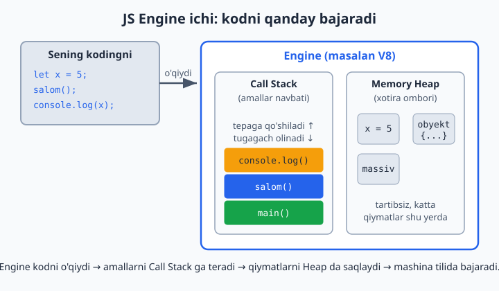
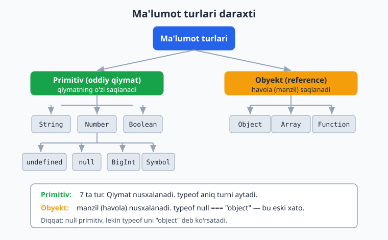
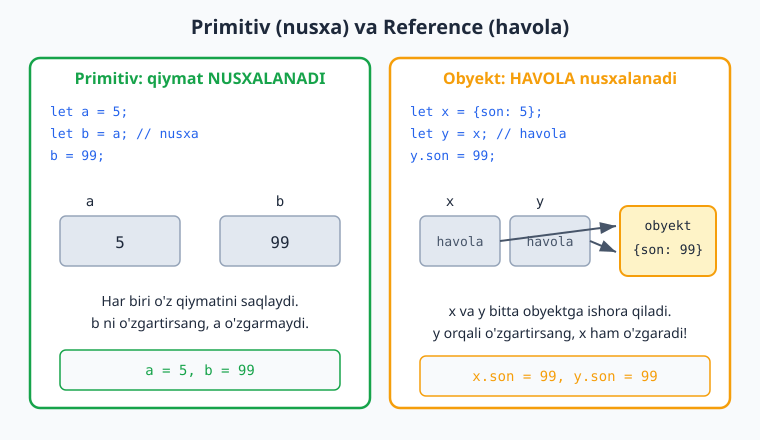
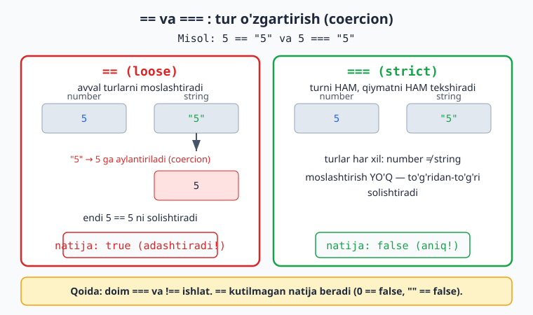

# JavaScript — 0 dan Expertgacha (O'zbek tilida)

📚 [README / Mundarija](./README.md) · [Keyingi: 2-qism — Strukturalar →](./javascript-qollanma-2-qism.md)

> **1-QISM: ASOSLAR**
> Boshlovchilar uchun to'liq qo'llanma. Har bir moduldan keyin **20 ta masala** (yechimi bilan) bor.
> Masalalarni avval **o'zingiz yechib ko'ring**, keyin yechimga qarang — yechim `► Yechim` ostida yashiringan.

---

## 📍 To'liq yo'l xaritasi (0 → Expert)

Bu qo'llanma 6 qismdan iborat. Sen hozir **1-qismni** o'qiyapsan.

**1-QISM — ASOSLAR** *(shu fayl)*
- 0-modul: Kirish — JS nima va qanday ishlaydi
- 1-modul: O'zgaruvchilar va ma'lumot turlari
- 2-modul: Operatorlar
- 3-modul: Shartli operatorlar (`if`/`else`, `switch`)
- 4-modul: Sikllar (`for`, `while`)

**2-QISM — STRUKTURALAR**
- 5-modul: Funksiyalar
- 6-modul: Massivlar (arrays) va metodlar
- 7-modul: Obyektlar (objects)
- 8-modul: String va Number metodlari

**3-QISM — BRAUZER (DOM)**
- 9-modul: DOM bilan ishlash
- 10-modul: Events (hodisalar)
- 11-modul: Forms va validation
- 12-modul: Storage (localStorage)

**4-QISM — ASINXRON JS**
- 13-modul: Callbacks va Event Loop
- 14-modul: Promises
- 15-modul: `async`/`await`
- 16-modul: Fetch API va REST

**5-QISM — CHUQUR JS**
- 17-modul: Scope, closures, hoisting
- 18-modul: `this`, `call`/`apply`/`bind`
- 19-modul: Prototypes va inheritance
- 20-modul: Classes (ES6)
- 21-modul: ES6+ (destructuring, spread, modules)
- 22-modul: Error handling
- 23-modul: Regular expressions

**6-QISM — EXPERT**
- 24-modul: Functional programming
- 25-modul: Iterators, generators, Symbols
- 26-modul: Proxy, Reflect
- 27-modul: Performance va memory
- 28-modul: Design patterns
- 29-modul: Bundlers va build tools
- 30-modul: TypeScript'ga ko'prik

---

# 0-MODUL: Kirish — JavaScript nima va qanday ishlaydi

## JavaScript nima?

JavaScript (qisqacha **JS**) — bu **dasturlash tili**. U birinchi marta 1995-yilda brauzerda veb-sahifalarni "jonlantirish" uchun yaratilgan: tugma bosilganda nimadir o'zgarsin, forma tekshirilsin, sahifa qayta yuklanmasdan yangilansin.

Bugun JS faqat brauzerda emas, **hamma joyda** ishlaydi:
- **Brauzerda** (frontend) — sayt interaktivligi.
- **Serverda** (Node.js orqali) — backend, API.
- **Mobil ilovalar**, **desktop ilovalar**, hatto IoT qurilmalarda.

> **Nega o'rganish kerak?** JS — internetning yagona "tug'ma" tili. Brauzer faqat JS'ni tushunadi. Frontend qilmoqchi bo'lsang, undan qochib qutula olmaysan.

## JS qayerda ishlaydi (Engine)

Kodingni JS kodini **engine** (dvigatel) ishga tushiradi. Eng mashhuri — Google'ning **V8** engine'i (Chrome va Node.js ichida). Engine sening yozgan matningni o'qiydi, mashina tiliga aylantiradi va bajaradi.

Engine ichida ikki muhim qism bor: **Call Stack** (bajariladigan amallar navbati) va **Memory Heap** (o'zgaruvchi va obyekt qiymatlari saqlanadigan xotira):



Sen ikki yo'l bilan JS yoza olasan:

**1. Brauzer konsoli (eng tez yo'l)**
Brauzerni och → `F12` (yoki o'ng tugma → "Inspect") → **Console** bo'limi. U yerga to'g'ridan-to'g'ri kod yozsang bo'ladi:

```js
console.log("Salom, dunyo!");
```

`console.log()` — bu ekranga (konsolga) biror narsani **chop etish** uchun ishlatiladi. Bu sening eng yaqin do'sting bo'ladi: kod nima qilayotganini tekshirish uchun doim ishlatasan.

**2. HTML fayl ichida**

```html
<!DOCTYPE html>
<html>
<head><title>Birinchi JS</title></head>
<body>
  <h1>Sahifa</h1>

  <script>
    console.log("Bu kod sahifa yuklanganda ishlaydi");
    alert("Salom!"); // brauzerda oyna chiqaradi
  </script>
</body>
</html>
```

`<script>` tegi ichidagi kod brauzer tomonidan bajariladi. Odatda `<script src="app.js"></script>` orqali alohida `.js` faylni ulaymiz — bu toza yondashuv.

## Birinchi tushunchalar

- **Statement (buyruq)** — bitta amal. Odatda `;` (nuqta-vergul) bilan tugaydi.
  ```js
  console.log("birinchi");
  console.log("ikkinchi");
  ```
- **Comment (izoh)** — engine o'qimaydigan, faqat odam uchun yozuv.
  ```js
  // bu bir qatorli izoh
  /* bu
     ko'p qatorli izoh */
  ```
- **Case-sensitive** — JS katta-kichik harfni farqlaydi. `myName` va `myname` — ikki xil narsa.

> **Why:** Izohlar kodni "tushuntirish" uchun emas, **nima uchun** shunday qilinganini tushuntirish uchun yoziladi. Yaxshi kod o'zini o'zi tushuntiradi; izoh esa sababni aytadi.

---

## 📝 0-modul masalalari (20 ta)

> Bularni brauzer konsolida (`F12` → Console) bajaring.

1. Konsolga `Men JavaScript o'rganyapman` matnini chiqaring.
2. `alert()` yordamida brauzerda "Salom" degan oyna chiqaring.
3. Bir qatorli izoh yozing va uning ostiga `console.log` qo'ying.
4. Ko'p qatorli izoh (3 qator) yozing.
5. Ketma-ket 3 ta `console.log` yozing va natijani kuzating.
6. `console.log(2 + 2)` yozing — natija nima bo'ladi?
7. `console.log("2" + "2")` yozing. 6-masaladan farqi nimada?
8. `prompt("Isming nima?")` yozing — bu nima qiladi?
9. `console.log(typeof "salom")` natijasini toping.
10. Konsolda `console.error("Xato!")` va `console.warn("Ogohlantirish")` ni sinab ko'ring.
11. HTML fayl yaratib, ichiga `<script>` qo'ying va konsolga matn chiqaring.
12. `console.log("Salom", "dunyo", 123)` — vergul bilan ajratilganda nima bo'ladi?
13. `myName` va `myname` ni ikkita `console.log` da yozsangiz JS ularni bir xil deb biladimi?
14. `console.table([1, 2, 3])` ni sinab ko'ring.
15. `console.log("Qator1\nQator2")` — `\n` nima qiladi?
16. `console.log("Narx: " + 1000 + " so'm")` yozing.
17. Konsolda `Math.random()` ni 3 marta chaqiring — har safar bir xilmi?
18. `console.log(10 / 3)` natijasini ko'ring.
19. `console.clear()` nima qiladi?
20. Brauzer konsolida `1 + 1` deb yozsangiz (console.log'siz), natija chiqadimi?

<details markdown="1">
<summary>► Yechimlar</summary>

```js
// 1
console.log("Men JavaScript o'rganyapman");

// 2
alert("Salom");

// 3
// Bu izoh
console.log("Izoh ostidagi kod");

// 4
/* Birinchi qator
   Ikkinchi qator
   Uchinchi qator */

// 5
console.log("bir"); console.log("ikki"); console.log("uch");

// 6 -> 4 (raqamlar qo'shiladi)
console.log(2 + 2);

// 7 -> "22" (matnlar yopishadi). Farqi: tirnoq ichidagi narsa son emas, matn (string).
console.log("2" + "2");

// 8 -> foydalanuvchidan matn so'raydigan oyna chiqaradi va kiritilganni qaytaradi
prompt("Isming nima?");

// 9 -> "string"
console.log(typeof "salom");

// 10 -> error qizil, warn sariq rangda chiqadi
console.error("Xato!");
console.warn("Ogohlantirish");

// 12 -> "Salom dunyo 123" (probel bilan ajratib chiqaradi)
console.log("Salom", "dunyo", 123);

// 13 -> Yo'q, JS ularni ikki xil deb biladi (case-sensitive)

// 15 -> \n yangi qatorga o'tkazadi:
// Qator1
// Qator2
console.log("Qator1\nQator2");

// 16 -> "Narx: 1000 so'm"
console.log("Narx: " + 1000 + " so'm");

// 17 -> Yo'q, har safar boshqa tasodifiy son (0 dan 1 gacha)

// 18 -> 3.3333333333333335 (JS o'nlik kasrlarni shunday ko'rsatadi)

// 19 -> konsolni tozalaydi

// 20 -> Ha, konsol oxirgi ifoda natijasini avtomatik ko'rsatadi
```
</details>

---

# 1-MODUL: O'zgaruvchilar va ma'lumot turlari

## O'zgaruvchi (Variable) nima?

O'zgaruvchi — bu **ma'lumotni saqlaydigan nomli quti**. Qutiga qiymat solib, keyin nom orqali undan foydalanasan.

```js
let ism = "Oqil";
let yosh = 25;

console.log(ism);  // Oqil
console.log(yosh); // 25
```

Bu yerda `ism` va `yosh` — o'zgaruvchi nomlari, `"Oqil"` va `25` — ularning qiymatlari.

## `let`, `const`, `var` — qaysi birini ishlatish?

JS'da o'zgaruvchi e'lon qilishning 3 usuli bor:

```js
let a = 10;    // qiymatini keyin o'zgartirish mumkin
const b = 20;  // qiymati O'ZGARMAYDI (constant)
var c = 30;    // eski usul — ishlatma
```

**Qoida (yodlab ol):**
- **Doim `const` ishlat.** Qiymat o'zgarmasligi kerak bo'lsa — `const`.
- Agar qiymat **o'zgarishi shart** bo'lsa (masalan, sanagich) — `let`.
- **`var`'ni hech qachon ishlatma.** U eski, muammoli (scope bilan bog'liq xatolar keltiradi — buni 17-modulda ko'ramiz).

```js
const PI = 3.14;
// PI = 3.15; // ❌ Xato! const'ni o'zgartirib bo'lmaydi

let hisob = 0;
hisob = hisob + 1; // ✅ let'ni o'zgartirsa bo'ladi
```

> **Why:** `const` "default" tanlov. Sababi — kod **bashorat qilinadigan** bo'ladi. Qiymat o'zgarmasligini bilsang, kodni o'qish va xatoni topish osonlashadi. `let`'ni faqat haqiqatan o'zgarish kerak bo'lganda ishlat.

## Nomlash qoidalari

```js
let userName;     // ✅ to'g'ri
let user_name;    // ✅ ishlaydi, lekin JS'da camelCase odat
let userName2;    // ✅ raqam bo'lsa bo'ladi (lekin boshida emas)

let 2user;        // ❌ raqam bilan boshlanmaydi
let user-name;    // ❌ tire bo'lmaydi
let let;          // ❌ band so'z (reserved word)
```

JS'da **camelCase** uslubi qo'llaniladi: `firstName`, `totalPrice`, `isActive`.

## Ma'lumot turlari (Data Types)

JS'da 8 ta asosiy tur bor. Hozir eng muhimlarini ko'ramiz:

```js
// 1. String (matn) — tirnoq ichida
let ism = "Oqil";
let shahar = 'Toshkent';
let salom = `Salom, ${ism}`; // template literal (orqa tirnoq)

// 2. Number (son) — butun va kasr
let yosh = 25;
let narx = 99.99;

// 3. Boolean (mantiqiy) — faqat true yoki false
let faolmi = true;
let yopiqmi = false;

// 4. Undefined — qiymat berilmagan
let x;
console.log(x); // undefined

// 5. Null — "bo'sh" qiymat (ataylab)
let natija = null;

// 6. Object (obyekt) — keyingi qismda
// 7. Array (massiv) — keyingi qismda
// 8. BigInt, Symbol — keyinroq
```

Bu turlar ikki katta guruhga bo'linadi: **primitiv** (oddiy qiymatlar) va **obyekt** (havola orqali ishlaydigan murakkab turlar):



### `typeof` — turni tekshirish

```js
console.log(typeof "salom"); // "string"
console.log(typeof 42);      // "number"
console.log(typeof true);    // "boolean"
console.log(typeof undefined); // "undefined"
console.log(typeof null);    // "object" (bu JS'ning eski xatosi, esda tut)
```

Bu farqning amaliy oqibati bor: primitiv qiymat boshqa o'zgaruvchiga berilganda uning **nusxasi** ko'chiriladi, obyekt esa **havolasi** (xotiradagi manzili) ko'chiriladi — shuning uchun bir obyektni ikki nom orqali o'zgartirish ikkalasiga ham ta'sir qiladi:



### Template literals (juda muhim)

Matn ichiga o'zgaruvchi qo'shishning eng toza yo'li — orqa tirnoq (`` ` ``) va `${...}`:

```js
let ism = "Oqil";
let yosh = 25;

// Eski usul (noqulay):
console.log("Mening ismim " + ism + ", yoshim " + yosh);

// Yangi usul (toza):
console.log(`Mening ismim ${ism}, yoshim ${yosh}`);
```

### Tur o'zgartirish (Type Conversion)

```js
// String -> Number
let matn = "123";
let son = Number(matn);     // 123 (son)
let son2 = parseInt("123px"); // 123 (oxiridagi matnni tashlaydi)
let son3 = parseFloat("3.14m"); // 3.14

// Number -> String
let raqam = 456;
let str = String(raqam);    // "456"
let str2 = raqam.toString(); // "456"

// Booleanga
let bool = Boolean(0);  // false
let bool2 = Boolean(1); // true
```

> **Why diqqat:** `"5" + 3` natijasi `"53"` (matn), lekin `"5" - 3` natijasi `2` (son). `+` matnlarni yopishtiradi, qolgan amallar sonni majburlaydi. Bu JS'ning eng ko'p adashtiruvchi joyi — shuning uchun foydalanuvchidan kelgan ma'lumotni **doim** aniq turga o'zgartir.

---

## 📝 1-modul masalalari (20 ta)

1. `ism` o'zgaruvchisiga o'z isimingni saqlang va konsolga chiqaring.
2. `const` orqali `PI = 3.14` yarating va uni o'zgartirishga urinib ko'ring — nima bo'ladi?
3. `yosh` o'zgaruvchisini `let` bilan yarating, keyin uni 1 ga oshiring.
4. Template literal yordamida `Salom, mening ismim X` matnini chiqaring (X — isiming).
5. `typeof` yordamida `"salom"`, `42`, `true`, `null` turlarini toping.
6. `"100"` matnini songa aylantirib, unga 50 qo'shing.
7. `"5" + 3` va `"5" - 3` natijalarini taqqoslang. Nega farq qiladi?
8. Son `789` ni matnga aylantiring va `typeof` bilan tekshiring.
9. `parseInt("42px")` va `parseFloat("3.99usd")` natijalarini toping.
10. Bir-biriga teng ikkita o'zgaruvchi yarating: `a = b = 10` o'rniga ikki qatorda yozing.
11. `undefined` va `null` orasidagi farqni izohli kod bilan ko'rsating.
12. Foydalanuvchidan `prompt` bilan yosh so'rang, uni songa aylantiring va `+10` qiling.
13. `Boolean(0)`, `Boolean("")`, `Boolean("salom")`, `Boolean(1)` — qaysilari `false`?
14. To'g'ri va noto'g'ri o'zgaruvchi nomlaridan 3 tadan misol yozing (izoh bilan).
15. `narx = 1500` va `valyuta = "so'm"` yarating, template literal bilan `1500 so'm` chiqaring.
16. `let x;` yozib, konsolga chiqaring — qiymati nima?
17. `10 + "5"`, `10 - "5"`, `"10" * "2"` natijalarini bashorat qiling, keyin tekshiring.
18. `isStudent` nomli boolean yarating va uni `if` siz to'g'ridan-to'g'ri chiqaring.
19. Ikki o'zgaruvchi (`a = 5`, `b = 10`) qiymatlarini **uchinchi o'zgaruvchi orqali** almashtiring.
20. `const user = "Ali"; user = "Vali";` — bu kod nega ishlamaydi? Tuzating.

<details markdown="1">
<summary>► Yechimlar</summary>

```js
// 1
const ism = "Oqil";
console.log(ism);

// 2 -> TypeError: Assignment to constant variable
const PI = 3.14;
// PI = 3.15; // ❌

// 3
let yosh = 25;
yosh = yosh + 1; // yoki yosh++
console.log(yosh); // 26

// 4
const ism4 = "Oqil";
console.log(`Salom, mening ismim ${ism4}`);

// 5
console.log(typeof "salom");   // "string"
console.log(typeof 42);        // "number"
console.log(typeof true);      // "boolean"
console.log(typeof null);      // "object" (JS bug)

// 6 -> 150
console.log(Number("100") + 50);

// 7
console.log("5" + 3); // "53"  -> + matnlarni yopishtiradi
console.log("5" - 3); // 2     -> - sonni majburlaydi

// 8
console.log(typeof String(789)); // "string"

// 9
console.log(parseInt("42px"));     // 42
console.log(parseFloat("3.99usd")); // 3.99

// 10
let a = 10;
let b = 10;

// 11
let bersam;          // undefined: hali qiymat yo'q
let boshataylab = null; // null: ataylab bo'sh qo'yildi

// 12
let kiritilgan = prompt("Yoshingiz?");
console.log(Number(kiritilgan) + 10);

// 13 -> 0 va "" false; "salom" va 1 true
console.log(Boolean(0));       // false
console.log(Boolean(""));      // false
console.log(Boolean("salom")); // true
console.log(Boolean(1));       // true

// 14
let userName;  // ✅ camelCase
let user_age;  // ✅ ishlaydi
let total2;    // ✅ raqam oxirida
// let 2total; // ❌ raqam bilan boshlanadi
// let my-var; // ❌ tire
// let const;  // ❌ band so'z

// 15
const narx = 1500;
const valyuta = "so'm";
console.log(`${narx} ${valyuta}`);

// 16 -> undefined
let x;
console.log(x);

// 17
console.log(10 + "5");  // "105"
console.log(10 - "5");  // 5
console.log("10" * "2"); // 20

// 18
const isStudent = true;
console.log(isStudent);

// 19
let p = 5, q = 10;
let temp = p;
p = q;
q = temp;
console.log(p, q); // 10 5

// 20 -> const o'zgartirib bo'lmaydi. Tuzatish: let ishlatish
let user = "Ali";
user = "Vali"; // ✅
```
</details>

---

# 2-MODUL: Operatorlar

Operator — bu qiymatlar ustida amal bajaradigan belgi (`+`, `-`, `>`, va h.k.).

## 1. Arifmetik operatorlar

```js
let a = 10, b = 3;

console.log(a + b); // 13  qo'shish
console.log(a - b); // 7   ayirish
console.log(a * b); // 30  ko'paytirish
console.log(a / b); // 3.333...  bo'lish
console.log(a % b); // 1   QOLDIQ (modulo) — 10 ni 3 ga bo'lganda qoldiq
console.log(a ** b); // 1000  daraja (10^3)
```

`%` (qoldiq) juda foydali — masalan, son juft yoki toqligini aniqlash uchun:
```js
console.log(10 % 2); // 0 -> juft
console.log(7 % 2);  // 1 -> toq
```

## 2. Tayinlash operatorlari (Assignment)

```js
let x = 5;
x += 3; // x = x + 3 -> 8
x -= 2; // x = x - 2 -> 6
x *= 4; // x = x * 4 -> 24
x /= 2; // x = x / 2 -> 12
x %= 5; // x = x % 5 -> 2
```

## 3. Inkrement / Dekrement

```js
let i = 5;
i++; // i = i + 1 -> 6
i--; // i = i - 1 -> 5

// ++ joyi muhim:
let a = 5;
console.log(a++); // 5 chiqaradi, KEYIN 6 bo'ladi (post-increment)
console.log(a);   // 6

let b = 5;
console.log(++b); // 6 (oldin oshiradi, keyin chiqaradi) (pre-increment)
```

## 4. Taqqoslash operatorlari (natijasi `true`/`false`)

```js
console.log(5 > 3);   // true
console.log(5 < 3);   // false
console.log(5 >= 5);  // true
console.log(5 <= 4);  // false

// === va == farqi (JUDA MUHIM)
console.log(5 == "5");  // true  (faqat qiymatni solishtiradi, turni e'tiborsiz qoldiradi)
console.log(5 === "5"); // false (qiymat VA turni solishtiradi)
console.log(5 != "5");  // false
console.log(5 !== "5"); // true
```

> **Why — eng muhim qoida:** **Doim `===` va `!==` ishlat**, hech qachon `==` emas. `==` ma'lumot turini avtomatik o'zgartiradi va `0 == false`, `"" == false`, `null == undefined` kabi kutilmagan natijalar beradi. `===` esa aniq: qiymat ham, tur ham bir xil bo'lishi shart. Bu bug'larning katta qismini oldini oladi.

Quyidagi diagramma `==` ning turni qanday o'zgartirishini (coercion) va `===` ning nega aniqroq ekanini ko'rsatadi:



## 5. Mantiqiy operatorlar (Logical)

```js
let yosh = 20;
let bormi = true;

// && (VA / AND) — ikkalasi ham true bo'lsa true
console.log(yosh >= 18 && bormi); // true

// || (YOKI / OR) — bittasi true bo'lsa true
console.log(yosh < 18 || bormi);  // true

// ! (EMAS / NOT) — qiymatni teskari qiladi
console.log(!bormi); // false
```

**Haqiqat jadvali:**
| A | B | A && B | A \|\| B |
|---|---|--------|---------|
| true | true | true | true |
| true | false | false | true |
| false | true | false | true |
| false | false | false | false |

## 6. Ternary operator (qisqa `if`)

```js
let yosh = 20;
let xabar = yosh >= 18 ? "Voyaga yetgan" : "Voyaga yetmagan";
console.log(xabar); // "Voyaga yetgan"

// Sintaksis: shart ? agar_true : agar_false
```

> **Why:** Ternary — qisqa, oddiy tanlovlar uchun. Lekin uni **ichma-ich** (nested) yozma — o'qib bo'lmaydigan kodga aylanadi. Murakkab shart bo'lsa, oddiy `if` ishlat.

---

## 📝 2-modul masalalari (20 ta)

1. `17 % 5` natijasini toping va nima ekanini izohlang.
2. `2 ** 10` (2 ning 10-darajasi) ni hisoblang.
3. `x = 20` yarating, `+= 5`, `*= 2`, `-= 10` qo'llang, har bosqichni chiqaring.
4. Sonning juft yoki toqligini `%` orqali tekshiring (masalan, 14).
5. `let a = 5; a++` — `a++` chiqargan qiymat va keyingi qiymatni ko'rsating.
6. `++b` va `b++` orasidagi farqni misol bilan tushuntiring.
7. `5 == "5"` va `5 === "5"` natijalarini taqqoslang.
8. `0 == false`, `"" == false`, `null == undefined` — nega `true` chiqadi?
9. Yosh 18 dan katta **va** chiptasi borligini `&&` bilan tekshiring.
10. Foydalanuvchi admin **yoki** moderator ekanligini `||` bilan tekshiring.
11. `!true`, `!false`, `!0`, `!""` natijalarini toping.
12. Ternary bilan: son musbatmi yoki manfiymi — chiqaring.
13. `10 > 5 && 5 > 3 && 3 > 1` — natija nima?
14. `15 % 2 === 0 ? "juft" : "toq"` kodini yozing va sinab ko'ring.
15. Ikki sonni taqqoslab, kattasini ternary bilan chiqaring.
16. `true && false || true` — operatorlar ketma-ketligi bo'yicha natijani toping.
17. `let savol = 5; savol **= 2` — natija nima?
18. Foydalanuvchi yoshini so'rab, `>= 18` bo'lsa "kirsa bo'ladi" deb ternary bilan chiqaring.
19. `"10" - 5`, `"10" + 5`, `"10" * 2`, `"abc" - 5` — har birini bashorat qiling.
20. Bir sondan boshqasi nechta marta kattaligini `%` va `/` bilan ko'rsating (masalan, 17 va 5).

<details markdown="1">
<summary>► Yechimlar</summary>

```js
// 1 -> 2 (17 ni 5 ga bo'lganda qoldiq 2)
console.log(17 % 5);

// 2 -> 1024
console.log(2 ** 10);

// 3
let x = 20;
x += 5; console.log(x); // 25
x *= 2; console.log(x); // 50
x -= 10; console.log(x); // 40

// 4 -> 14 % 2 === 0 -> juft
console.log(14 % 2 === 0 ? "juft" : "toq");

// 5
let a = 5;
console.log(a++); // 5
console.log(a);   // 6

// 6
let b = 5;
console.log(b++); // 5 (oldin chiqaradi)
let c = 5;
console.log(++c); // 6 (oldin oshiradi)

// 7
console.log(5 == "5");  // true
console.log(5 === "5"); // false

// 8 -> == turni o'zgartiradi: bularning hammasi "falsy" yoki bir-biriga moslashtiriladi
console.log(0 == false);        // true
console.log("" == false);       // true
console.log(null == undefined); // true

// 9
let yosh = 20, chipta = true;
console.log(yosh > 18 && chipta); // true

// 10
let rol = "moderator";
console.log(rol === "admin" || rol === "moderator"); // true

// 11
console.log(!true);  // false
console.log(!false); // true
console.log(!0);     // true (0 = falsy)
console.log(!"");    // true ("" = falsy)

// 12
let son = -5;
console.log(son >= 0 ? "musbat" : "manfiy"); // manfiy

// 13 -> true
console.log(10 > 5 && 5 > 3 && 3 > 1);

// 14 -> "toq"
console.log(15 % 2 === 0 ? "juft" : "toq");

// 15
let m = 8, n = 12;
console.log(m > n ? m : n); // 12

// 16 -> true (&& birinchi: false; keyin false || true -> true)
console.log(true && false || true);

// 17 -> 25
let savol = 5;
savol **= 2;
console.log(savol);

// 18
let y = Number(prompt("Yoshingiz?"));
console.log(y >= 18 ? "kirsa bo'ladi" : "kirsa bo'lmaydi");

// 19
console.log("10" - 5);  // 5
console.log("10" + 5);  // "105"
console.log("10" * 2);  // 20
console.log("abc" - 5); // NaN (Not a Number)

// 20
console.log(Math.floor(17 / 5)); // 3 marta
console.log(17 % 5);             // 2 qoladi
```
</details>

---

# 3-MODUL: Shartli operatorlar (`if` / `switch`)

Dasturni "qaror qabul qilishga" o'rgatish — shartlar orqali bo'ladi.

## `if` / `else if` / `else`

```js
let yosh = 20;

if (yosh >= 18) {
  console.log("Voyaga yetgan");
} else {
  console.log("Voyaga yetmagan");
}
```

Bir nechta shart:

```js
let ball = 85;

if (ball >= 90) {
  console.log("A'lo");
} else if (ball >= 70) {
  console.log("Yaxshi");
} else if (ball >= 50) {
  console.log("Qoniqarli");
} else {
  console.log("Qoniqarsiz");
}
// -> "Yaxshi"
```

**Qoidalar:**
- `if` qavs ichidagi shart `true` bo'lsa, blok bajariladi.
- `else if` — qo'shimcha shartlar (xohlagancha bo'lishi mumkin).
- `else` — hech bir shart bajarilmasa (ixtiyoriy).
- JS yuqoridan pastga tekshiradi va **birinchi true bo'lganida to'xtaydi**.

## Truthy va Falsy (juda muhim tushuncha)

`if` ichida har qanday qiymat `true` yoki `false`ga "moslashadi". **Falsy** (false sanaluvchi) qiymatlar atigi 8 ta:

```js
false, 0, "", null, undefined, NaN, 0n, -0
```

**Qolgan hamma narsa truthy** (true sanaluvchi):

```js
if ("salom") console.log("ishlaydi"); // bo'sh bo'lmagan matn -> truthy
if (0) console.log("ishlamaydi");      // 0 -> falsy
if ([]) console.log("bo'sh massiv ham truthy!"); // [] -> truthy (diqqat!)
```

> **Why:** Buni bilish — kodni qisqartiradi. `if (ism !== "" && ism !== null)` o'rniga shunchaki `if (ism)` deb yozsa bo'ladi. Lekin diqqat: `0` ham haqiqiy qiymat bo'lishi mumkin (masalan, soni 0 ta mahsulot), shuning uchun raqamlar bilan ehtiyot bo'l.

## Mantiqiy operatorlar bilan birga

```js
let yosh = 25;
let haydovchilikGuvohnomasi = true;

if (yosh >= 18 && haydovchilikGuvohnomasi) {
  console.log("Mashina haydashi mumkin");
}
```

## `switch` — ko'p variantli tanlov

Bitta qiymatni ko'p variantlar bilan solishtirganda `if/else if` o'rniga `switch` toza bo'ladi:

```js
let kun = 3;

switch (kun) {
  case 1:
    console.log("Dushanba");
    break;
  case 2:
    console.log("Seshanba");
    break;
  case 3:
    console.log("Chorshanba");
    break;
  default:
    console.log("Noma'lum kun");
}
// -> "Chorshanba"
```

**Diqqat — `break` shart!** `break` bo'lmasa, JS keyingi `case`'larga ham "oqib" o'tadi (fall-through). Buni ataylab ishlatish ham mumkin:

```js
let harf = "a";
switch (harf) {
  case "a":
  case "e":
  case "i":
  case "o":
  case "u":
    console.log("Unli harf");
    break;
  default:
    console.log("Undosh harf");
}
```

> **Why `switch` vs `if`:** `switch` faqat **aniq tenglik** (`===`) bilan ishlaydi. Diapazon kerak bo'lsa (`ball >= 90`), `if/else if` ishlat. Bitta qiymatni ko'p variant bilan solishtirsang — `switch` o'qishga qulayroq.

---

## 📝 3-modul masalalari (20 ta)

1. Yoshni tekshiring: 18 dan katta bo'lsa "Voyaga yetgan", aks holda "Yo'q" chiqaring.
2. Ballni baholang: 90+ "A", 80+ "B", 70+ "C", aks holda "F".
3. Son musbat, manfiy yoki nol ekanligini aniqlang.
4. Foydalanuvchidan son so'rang, juft yoki toqligini `if` bilan chiqaring.
5. Falsy qiymatlardan 4 tasini `if` ichida sinab ko'ring.
6. `if ("0")` va `if (0)` — qaysi biri ishlaydi? Nega?
7. Yosh 18+ **va** guvohnoma bor bo'lsa "Haydashi mumkin" chiqaring.
8. Hafta kunini (1-7) `switch` bilan nomiga aylantiring.
9. Yil faslini oy raqamiga qarab `switch` bilan aniqlang (12,1,2 = qish).
10. Ikki sonning kattasini `if/else` bilan toping.
11. Foydalanuvchi parolini tekshiring: `"1234"` bo'lsa "To'g'ri", aks holda "Xato".
12. Son 3 ga **ham**, 5 ga **ham** bo'linsa "FizzBuzz" chiqaring.
13. Harf unli yoki undoshligini `switch` (fall-through) bilan aniqlang.
14. Yoshga qarab chipta narxini belgilang: bola(<12)=0, kattalar=50000.
15. `if (ism)` — ism bo'sh bo'lganda nima bo'ladi? Sinab ko'ring.
16. Uchburchak turlarini aniqlang: 3 tomon teng = teng tomonli, 2 tasi teng = teng yonli.
17. Foydalanuvchi rolini (`admin`/`user`/`guest`) `switch` bilan tekshirib, har biriga xabar bering.
18. Yilni tekshiring: kabisa yilmi? (4 ga bo'linsa, lekin 100 ga bo'linsa 400 ga ham bo'linishi kerak).
19. Ternary va `if` bilan bir xil masalani ikki usulda yeching.
20. Switch'da `break` ni olib tashlang va natijani kuzating — nima sodir bo'ladi?

<details markdown="1">
<summary>► Yechimlar</summary>

```js
// 1
let yosh = 20;
if (yosh > 18) console.log("Voyaga yetgan");
else console.log("Yo'q");

// 2
let ball = 85;
if (ball >= 90) console.log("A");
else if (ball >= 80) console.log("B");
else if (ball >= 70) console.log("C");
else console.log("F");

// 3
let son = -3;
if (son > 0) console.log("musbat");
else if (son < 0) console.log("manfiy");
else console.log("nol");

// 4
let n = Number(prompt("Son?"));
if (n % 2 === 0) console.log("juft");
else console.log("toq");

// 5
if (0) {} else console.log("0 falsy");
if ("") {} else console.log('"" falsy');
if (null) {} else console.log("null falsy");
if (undefined) {} else console.log("undefined falsy");

// 6 -> if("0") ISHLAYDI (bo'sh bo'lmagan matn truthy). if(0) ishlamaydi.
if ("0") console.log('"0" truthy');
if (0) console.log("bu chiqmaydi");

// 7
let y = 20, guvohnoma = true;
if (y >= 18 && guvohnoma) console.log("Haydashi mumkin");

// 8
let kun = 3;
switch (kun) {
  case 1: console.log("Dushanba"); break;
  case 2: console.log("Seshanba"); break;
  case 3: console.log("Chorshanba"); break;
  case 4: console.log("Payshanba"); break;
  case 5: console.log("Juma"); break;
  case 6: console.log("Shanba"); break;
  case 7: console.log("Yakshanba"); break;
  default: console.log("Noto'g'ri");
}

// 9
let oy = 1;
switch (oy) {
  case 12: case 1: case 2: console.log("Qish"); break;
  case 3: case 4: case 5: console.log("Bahor"); break;
  case 6: case 7: case 8: console.log("Yoz"); break;
  case 9: case 10: case 11: console.log("Kuz"); break;
}

// 10
let a = 8, b = 12;
if (a > b) console.log(a); else console.log(b);

// 11
let parol = prompt("Parol?");
if (parol === "1234") console.log("To'g'ri");
else console.log("Xato");

// 12
let s = 15;
if (s % 3 === 0 && s % 5 === 0) console.log("FizzBuzz");

// 13
let harf = "e";
switch (harf) {
  case "a": case "e": case "i": case "o": case "u":
    console.log("Unli"); break;
  default: console.log("Undosh");
}

// 14
let yosh14 = 10;
if (yosh14 < 12) console.log("0 so'm");
else console.log("50000 so'm");

// 15 -> bo'sh matn falsy, shuning uchun else ishlaydi
let ism = "";
if (ism) console.log(`Salom ${ism}`);
else console.log("Ism kiritilmagan");

// 16
let t1 = 3, t2 = 3, t3 = 3;
if (t1 === t2 && t2 === t3) console.log("Teng tomonli");
else if (t1 === t2 || t2 === t3 || t1 === t3) console.log("Teng yonli");
else console.log("Turli tomonli");

// 17
let rol = "admin";
switch (rol) {
  case "admin": console.log("To'liq huquq"); break;
  case "user": console.log("Cheklangan huquq"); break;
  case "guest": console.log("Faqat ko'rish"); break;
  default: console.log("Noma'lum rol");
}

// 18
let yil = 2024;
if (yil % 400 === 0 || (yil % 4 === 0 && yil % 100 !== 0))
  console.log("Kabisa yil");
else console.log("Oddiy yil");

// 19
let z = 7;
// if usuli:
if (z > 5) console.log("katta"); else console.log("kichik");
// ternary usuli:
console.log(z > 5 ? "katta" : "kichik");

// 20 -> break bo'lmasa, mos case'dan keyingi HAMMA case bajariladi (fall-through)
```
</details>

---

# 4-MODUL: Sikllar (Loops)

Sikl — bir amalni **ko'p marta takrorlash** uchun. "1 dan 100 gacha chiqar" deb 100 ta `console.log` yozish o'rniga sikl ishlatasan.

## `for` sikli

Eng ko'p ishlatiladigan sikl:

```js
for (let i = 1; i <= 5; i++) {
  console.log(i);
}
// 1, 2, 3, 4, 5
```

`for` ning 3 qismi (`;` bilan ajratilgan):
1. **Boshlash** (`let i = 1`) — bir marta, sikl boshida ishlaydi.
2. **Shart** (`i <= 5`) — har takrordan oldin tekshiriladi. `true` bo'lsa davom etadi.
3. **Qadam** (`i++`) — har takrordan keyin ishlaydi.

```
i=1 -> shart true -> blok -> i++ -> i=2 -> shart true -> ... -> i=6 -> shart false -> STOP
```

Misol — yig'indi hisoblash:

```js
let yigindi = 0;
for (let i = 1; i <= 100; i++) {
  yigindi += i;
}
console.log(yigindi); // 5050
```

## `while` sikli

Shart `true` bo'lguncha takrorlaydi. Necha marta takrorlanishini **oldindan bilmaganingda** ishlatiladi:

```js
let i = 1;
while (i <= 5) {
  console.log(i);
  i++; // BUNI UNUTMA! aks holda cheksiz sikl
}
```

> **Diqqat — cheksiz sikl (infinite loop):** Agar shart hech qachon `false` bo'lmasa, brauzer qotadi. `while` ichida shartni o'zgartiradigan qatorni (`i++`) doim qo'sh.

## `do...while` sikli

`while`ga o'xshash, lekin **kamida bir marta** bajariladi (shart oxirida tekshiriladi):

```js
let i = 10;
do {
  console.log(i); // 10 — shart false bo'lsa ham bir marta chiqadi
  i++;
} while (i <= 5);
```

## `break` va `continue`

```js
// break — siklni TO'LIQ to'xtatadi
for (let i = 1; i <= 10; i++) {
  if (i === 5) break;
  console.log(i); // 1, 2, 3, 4
}

// continue — joriy takrorni TASHLAB, keyingisiga o'tadi
for (let i = 1; i <= 5; i++) {
  if (i === 3) continue;
  console.log(i); // 1, 2, 4, 5 (3 tashlandi)
}
```

## `for...of` — to'plam elementlari bo'ylab

Massiv yoki matn elementlarini birma-bir olish uchun (eng toza usul — buni 6-modulda chuqurroq ko'ramiz):

```js
const mevalar = ["olma", "uzum", "banan"];
for (const meva of mevalar) {
  console.log(meva);
}
// olma, uzum, banan
```

## Ichma-ich sikllar (Nested loops)

```js
for (let i = 1; i <= 3; i++) {
  for (let j = 1; j <= 3; j++) {
    console.log(`${i} x ${j} = ${i * j}`);
  }
}
```

> **Why diqqat:** Ichma-ich sikllar "qimmat" — agar tashqi sikl N marta, ichki M marta aylansa, blok N×M marta bajariladi. Katta ma'lumotlarda bu sekinlashtiradi (bu — algoritmlardagi O(n²) tushunchasi). Iloji bo'lsa ichki siklni boshqa yo'l bilan almashtir.

---

## 📝 4-modul masalalari (20 ta)

1. 1 dan 10 gacha sonlarni `for` bilan chiqaring.
2. 10 dan 1 gacha teskari sanang.
3. 1 dan 100 gacha sonlar yig'indisini hisoblang.
4. 1 dan 20 gacha faqat **juft** sonlarni chiqaring.
5. 1 dan 50 gacha faqat **toq** sonlarni chiqaring.
6. 5 ning ko'paytma jadvalini (5x1 dan 5x10 gacha) chiqaring.
7. `while` bilan 1 dan 5 gacha sanang.
8. `do...while` bilan shart noto'g'ri bo'lsa ham bir marta chiqishini ko'rsating.
9. 100 dan 0 gacha 10 lik qadam bilan sanang (100, 90, 80...).
10. Berilgan sonning faktorialini hisoblang (5! = 120).
11. `break` bilan: 1 dan 100 gacha sanab, 7 ga yetganda to'xtang.
12. `continue` bilan: 1 dan 10 gacha sanab, 5 ni tashlab keting.
13. 1 dan 100 gacha 3 ga bo'linadigan sonlarni chiqaring.
14. Matndagi harflar sonini `for...of` bilan sanang.
15. 2 dan 10 gacha har bir sonning kvadratini chiqaring.
16. Ichma-ich sikl bilan 3×3 ko'paytma jadvalini chiqaring.
17. Foydalanuvchidan son so'rab, shu songacha sanang.
18. 1 dan 50 gacha sonlar ichidan tub (prime) sonlarni toping.
19. `*` belgilaridan piramida chizing (1, 2, 3, 4, 5 qatorli).
20. Massiv `[10, 20, 30, 40]` elementlari yig'indisini sikl bilan toping.

<details markdown="1">
<summary>► Yechimlar</summary>

```js
// 1
for (let i = 1; i <= 10; i++) console.log(i);

// 2
for (let i = 10; i >= 1; i--) console.log(i);

// 3 -> 5050
let yig = 0;
for (let i = 1; i <= 100; i++) yig += i;
console.log(yig);

// 4
for (let i = 2; i <= 20; i += 2) console.log(i);

// 5
for (let i = 1; i <= 50; i += 2) console.log(i);

// 6
for (let i = 1; i <= 10; i++) console.log(`5 x ${i} = ${5 * i}`);

// 7
let i = 1;
while (i <= 5) { console.log(i); i++; }

// 8
let j = 100;
do { console.log(j); j++; } while (j <= 5); // 100 bir marta chiqadi

// 9
for (let i = 100; i >= 0; i -= 10) console.log(i);

// 10 -> 120
let n = 5, fact = 1;
for (let k = 1; k <= n; k++) fact *= k;
console.log(fact);

// 11
for (let i = 1; i <= 100; i++) {
  if (i === 7) break;
  console.log(i); // 1..6
}

// 12
for (let i = 1; i <= 10; i++) {
  if (i === 5) continue;
  console.log(i); // 5 tashlanadi
}

// 13
for (let i = 1; i <= 100; i++) {
  if (i % 3 === 0) console.log(i);
}

// 14
const matn = "JavaScript";
let count = 0;
for (const harf of matn) count++;
console.log(count); // 10

// 15
for (let i = 2; i <= 10; i++) console.log(`${i}^2 = ${i * i}`);

// 16
for (let i = 1; i <= 3; i++) {
  for (let j = 1; j <= 3; j++) {
    console.log(`${i} x ${j} = ${i * j}`);
  }
}

// 17
let limit = Number(prompt("Songacha sanay?"));
for (let i = 1; i <= limit; i++) console.log(i);

// 18 — tub sonlar
for (let son = 2; son <= 50; son++) {
  let tubmi = true;
  for (let d = 2; d < son; d++) {
    if (son % d === 0) { tubmi = false; break; }
  }
  if (tubmi) console.log(son);
}

// 19 — piramida
for (let i = 1; i <= 5; i++) {
  let qator = "";
  for (let j = 1; j <= i; j++) qator += "*";
  console.log(qator);
}
// *
// **
// ***
// ****
// *****

// 20 -> 100
const arr = [10, 20, 30, 40];
let sum = 0;
for (let i = 0; i < arr.length; i++) sum += arr[i];
console.log(sum);
```
</details>

---

## ✅ 1-qism yakuni

Tabriklayman — endi sen:
- O'zgaruvchilar va ma'lumot turlarini bilasan (`const`/`let`, string/number/boolean)
- Operatorlarni ishlata olasan (`===` ni esda tut!)
- Shartlar bilan dasturni "qaror qabul qilishga" o'rgatasan
- Sikllar bilan amallarni takrorlaysan

Bu — JS'ning poydevori. Bularsiz hech narsa qurilmaydi.

### Keyingi qadam (2-qism)
- **Funksiyalar** — kodni qayta ishlatiladigan bloklarga bo'lish
- **Massivlar** va ularning kuchli metodlari (`map`, `filter`, `reduce`)
- **Obyektlar** — real dunyo ma'lumotlarini modellashtirish

> **Maslahat:** 2-qismga o'tishdan oldin yuqoridagi 100 ta masalaning **kamida 70 tasini mustaqil** yeching. Ko'rib o'rganish — bilim emas; yozib o'rganish — bilim.

---

📚 [README / Mundarija](./README.md) · [Keyingi: 2-qism — Strukturalar →](./javascript-qollanma-2-qism.md)
