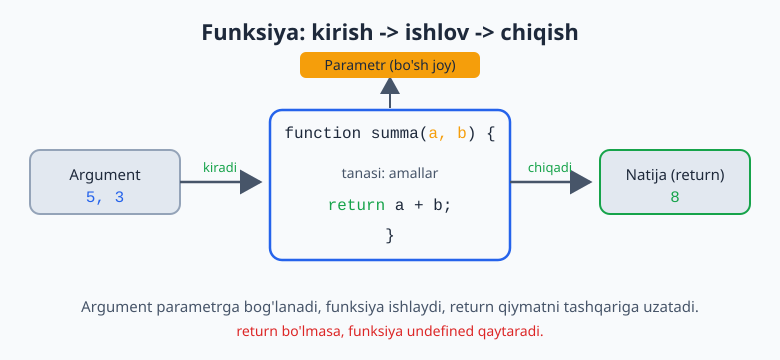
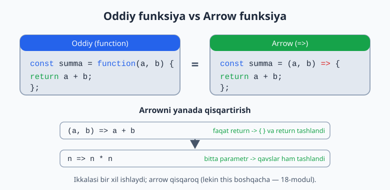
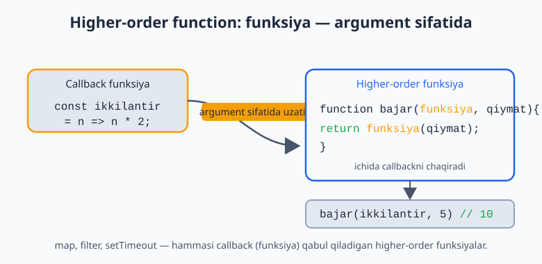
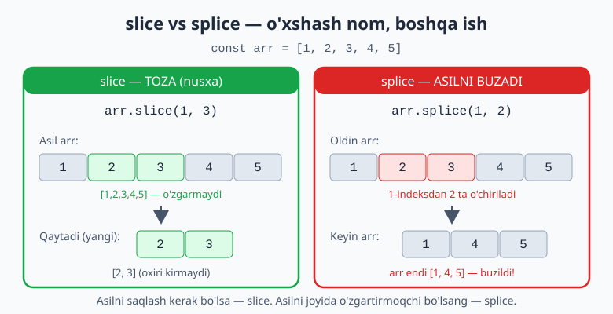
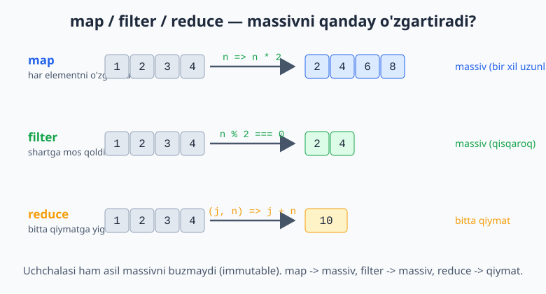

# JavaScript — 0 dan Expertgacha (O'zbek tilida)

📚 [README](./README.md) · [← 1-qism — Asoslar](./javascript-qollanma-1-qism.md) · [Keyingi: 3-qism — Brauzer (DOM) →](./javascript-qollanma-3-qism.md)

> **2-QISM: STRUKTURALAR**
> Funksiyalar, massivlar, obyektlar — real dasturlar shulardan quriladi.
> Har bir moduldan keyin **20 ta masala** (yechimi bilan). Avval o'zing yech, keyin `► Yechim`ga qara.

> 1-qismda asoslarni ko'rgan eding (o'zgaruvchilar, operatorlar, shartlar, sikllar). Endi shu asoslar ustiga **strukturalar** quramiz.

---

# 5-MODUL: Funksiyalar

## Funksiya nima va nega kerak?

Funksiya — bu **nom berilgan, qayta ishlatiladigan kod bloki**. Bir amalni bir necha joyda takrorlash o'rniga, uni bir marta funksiyaga o'rab, nom orqali chaqirasan.

Funksiyasiz kod (yomon — takrorlanadi):
```js
console.log("Salom, Ali!");
console.log("Salom, Vali!");
console.log("Salom, Hasan!");
```

Funksiya bilan (yaxshi — DRY: Don't Repeat Yourself):
```js
function salomBer(ism) {
  console.log(`Salom, ${ism}!`);
}

salomBer("Ali");
salomBer("Vali");
salomBer("Hasan");
```

> **Why:** Funksiyalar — toza kodning asosi. Bir mantiqni bir joyda saqlasang, o'zgartirish kerak bo'lganda **faqat bitta joyni** tahrirlaysan. Bu — xatoni kamaytiradi va kodni tushunarli qiladi.

## Funksiya e'lon qilish (Declaration)

```js
function summa(a, b) {  // a, b — PARAMETRLAR
  return a + b;          // return — natijani QAYTARADI
}

let natija = summa(5, 3); // 5, 3 — ARGUMENTLAR
console.log(natija);      // 8
```

**Atamalar:**
- **Parametr** — funksiya e'lonidagi "bo'sh joy" (`a`, `b`).
- **Argument** — funksiyani chaqirganda beradigan haqiqiy qiymat (`5`, `3`).



## `return` — natijani qaytarish

Bu eng muhim tushuncha. `return` funksiya natijasini **tashqariga uzatadi**. `console.log` esa shunchaki ekranga chiqaradi.

```js
function kvadrat(n) {
  return n * n; // natijani qaytaradi
}

let x = kvadrat(4); // x = 16 — natijani saqlay olamiz
console.log(x * 2); // 32 — natija bilan ishlay olamiz

// return'siz funksiya:
function kvadrat2(n) {
  console.log(n * n); // faqat chiqaradi
}
let y = kvadrat2(4); // 16 chiqaradi, lekin y = undefined!
```

> **Why diqqat:** `console.log` ≠ `return`. `console.log` — bu "ko'rsatish", `return` — bu "qaytarish". Funksiya boshqa kodga foyda berishi uchun **natijani `return` qilishi kerak**. Junior'lar eng ko'p shu yerda kalishadi.

`return` funksiyani **darhol to'xtatadi** — undan keyingi kod ishlamaydi:
```js
function tekshir(yosh) {
  if (yosh < 18) {
    return "Voyaga yetmagan"; // shu yerda to'xtaydi
  }
  return "Voyaga yetgan";
}
```

## Function Expression (funksiyani o'zgaruvchiga saqlash)

Funksiyani qiymat sifatida o'zgaruvchiga ham saqlash mumkin:

```js
const kvadrat = function(n) {
  return n * n;
};

console.log(kvadrat(5)); // 25
```

## Arrow Functions (zamonaviy, qisqa yozuv)

ES6'dan keyin funksiyani qisqaroq yozish usuli:

```js
// Oddiy:
const summa = function(a, b) {
  return a + b;
};

// Arrow:
const summa2 = (a, b) => {
  return a + b;
};

// Agar faqat return bo'lsa — qavs va return'ni tashlash mumkin (implicit return):
const summa3 = (a, b) => a + b;

// Bitta parametr bo'lsa — qavslarni ham tashlash mumkin:
const kvadrat = n => n * n;
```



Misollar:
```js
const juftmi = n => n % 2 === 0;
const salom = ism => `Salom, ${ism}`;
const yigindi = (a, b, c) => a + b + c;

console.log(juftmi(4));      // true
console.log(salom("Oqil"));  // "Salom, Oqil"
console.log(yigindi(1, 2, 3)); // 6
```

> **Why arrow:** Arrow funksiyalar qisqa va massiv metodlarida (`map`, `filter`) juda qulay — keyingi modulda ko'rasan. Lekin ularda `this` boshqacha ishlaydi (buni 18-modulda chuqur ko'ramiz). Hozircha: oddiy hisob-kitob funksiyalari uchun arrow ishlat.

## Default parametrlar

Argument berilmasa, standart qiymat ishlatiladi:

```js
function salom(ism = "mehmon") {
  return `Salom, ${ism}!`;
}

console.log(salom());        // "Salom, mehmon!"
console.log(salom("Oqil"));  // "Salom, Oqil!"
```

## Rest parametrlar (`...`)

Noma'lum sondagi argumentlarni bitta massivga yig'adi:

```js
function yigindi(...sonlar) {
  let jami = 0;
  for (const son of sonlar) jami += son;
  return jami;
}

console.log(yigindi(1, 2, 3));       // 6
console.log(yigindi(10, 20, 30, 40)); // 100
```

## Higher-Order Functions (funksiyani argument sifatida)

JS'da funksiya — bu ham qiymat. Demak, funksiyani boshqa funksiyaga **argument sifatida** uzatish mumkin. Bu — JS'ning eng kuchli xususiyatlaridan biri:

```js
function bajar(funksiya, qiymat) {
  return funksiya(qiymat);
}

const ikkilantir = n => n * 2;
console.log(bajar(ikkilantir, 5)); // 10
```

Argument sifatida uzatilgan funksiya **callback** deb ataladi. `map`, `filter`, `setTimeout` — hammasi callback qabul qiladi.



> **Why — toza arxitektura:** Iloji bo'lsa **pure function** (sof funksiya) yoz: bir xil kirishga doim bir xil chiqish beradigan, tashqi narsani o'zgartirmaydigan funksiya. Bunday funksiyalarni test qilish va qayta ishlatish oson. (Backend'da DDD/SOLID'da ham shu prinsip — funksiya bitta ishni qilsin, side-effect'siz.)

```js
// ✅ Pure: faqat kirishga bog'liq, tashqarini buzmaydi
const qoshish = (a, b) => a + b;

// ❌ Impure: tashqi o'zgaruvchini o'zgartiradi (side-effect)
let jami = 0;
const qoshishYomon = n => { jami += n; };
```

---

## 📝 5-modul masalalari (20 ta)

1. `salomBer(ism)` funksiyasini yozing — `"Salom, X!"` qaytarsin (return bilan).
2. Ikki sonni qo'shadigan funksiya yozing.
3. `console.log` va `return` farqini bitta misolda ko'rsating.
4. Yuqoridagi qo'shish funksiyasini **function expression** ko'rinishida yozing.
5. Uni **arrow function**ga aylantiring (bir qatorda).
6. `salom(ism = "mehmon")` — default parametr bilan yozing.
7. Uchburchak yuzasini hisoblovchi funksiya: `(asos * balandlik) / 2`.
8. `juftmi(n)` — son juft bo'lsa `true` qaytarsin.
9. Ikki sondan kattasini qaytaradigan funksiya yozing.
10. Rest parametr (`...`) bilan cheksiz sonlar yig'indisini hisoblang.
11. Foizni hisoblang: `foiz(son, foiz)` → `son`ning shuncha foizini qaytarsin.
12. Stringni teskari aylantiruvchi funksiya (masalan, "abc" → "cba").
13. `kvadrat = n => ...` arrow funksiyasini bir qatorda yozing.
14. Yoshga qarab chipta narxini qaytaring (<12 = 0, aks holda 50000).
15. Higher-order: funksiyani argument sifatida qabul qilib chaqiruvchi funksiya yozing.
16. `kobpaytir(a, b = 1)` — ikkinchi argument berilmasa 1 bo'lsin.
17. Massivdagi eng katta sonni qaytaruvchi funksiya yozing (sikl bilan).
18. Funksiya yozing: son bersa, uning kvadrati va kubini **massiv** qilib qaytarsin.
19. Pure va impure funksiyaga bittadan misol yozing (izoh bilan).
20. Mini-kalkulyator: `hisobla(a, b, amal)` — amal `"+", "-", "*", "/"` bo'lsin.

<details markdown="1">
<summary>► Yechimlar</summary>

```js
// 1
function salomBer(ism) { return `Salom, ${ism}!`; }
console.log(salomBer("Oqil"));

// 2
function qoshish(a, b) { return a + b; }

// 3
function f1(n) { return n * 2; }  // qaytaradi, saqlash mumkin
function f2(n) { console.log(n * 2); } // faqat chiqaradi, undefined qaytaradi
let r = f1(5); // r = 10
f2(5);         // 10 chiqadi, lekin natijani saqlay olmaymiz

// 4
const qoshish4 = function(a, b) { return a + b; };

// 5
const qoshish5 = (a, b) => a + b;

// 6
const salom6 = (ism = "mehmon") => `Salom, ${ism}!`;
console.log(salom6());       // Salom, mehmon!
console.log(salom6("Oqil")); // Salom, Oqil!

// 7
const yuza = (asos, balandlik) => (asos * balandlik) / 2;
console.log(yuza(10, 5)); // 25

// 8
const juftmi = n => n % 2 === 0;

// 9
const kattasi = (a, b) => a > b ? a : b;

// 10
const yigindi = (...sonlar) => {
  let jami = 0;
  for (const s of sonlar) jami += s;
  return jami;
};
console.log(yigindi(1, 2, 3, 4)); // 10

// 11
const foiz = (son, foizMiqdori) => (son * foizMiqdori) / 100;
console.log(foiz(200, 15)); // 30

// 12
const teskari = str => {
  let natija = "";
  for (const harf of str) natija = harf + natija;
  return natija;
};
console.log(teskari("abc")); // cba

// 13
const kvadrat = n => n * n;

// 14
const chiptaNarxi = yosh => yosh < 12 ? 0 : 50000;

// 15
const bajar = (funksiya, qiymat) => funksiya(qiymat);
console.log(bajar(n => n * 3, 4)); // 12

// 16
const kobaytir = (a, b = 1) => a * b;
console.log(kobaytir(5));    // 5
console.log(kobaytir(5, 3)); // 15

// 17
function engKatta(arr) {
  let max = arr[0];
  for (const son of arr) if (son > max) max = son;
  return max;
}
console.log(engKatta([3, 9, 2, 7])); // 9

// 18
const kvadratVaKub = n => [n * n, n * n * n];
console.log(kvadratVaKub(3)); // [9, 27]

// 19
const pure = (a, b) => a + b;         // ✅ tashqarini buzmaydi
let hisob = 0;
const impure = n => { hisob += n; };  // ❌ tashqi hisob'ni o'zgartiradi

// 20
function hisobla(a, b, amal) {
  switch (amal) {
    case "+": return a + b;
    case "-": return a - b;
    case "*": return a * b;
    case "/": return b !== 0 ? a / b : "0 ga bo'lib bo'lmaydi";
    default: return "Noma'lum amal";
  }
}
console.log(hisobla(10, 5, "*")); // 50
```
</details>

---

# 6-MODUL: Massivlar (Arrays) va metodlar

## Massiv nima?

Massiv — bu **tartiblangan ro'yxat**. Ko'p qiymatni bitta o'zgaruvchida saqlaydi.

```js
const mevalar = ["olma", "uzum", "banan"];
const sonlar = [10, 25, 7, 100];
const aralash = [1, "matn", true, null]; // turlari aralash bo'lishi mumkin
```

## Elementga kirish va indekslar

Massiv **0 dan** sanaladi (birinchi element — indeks 0):

```js
const mevalar = ["olma", "uzum", "banan"];

console.log(mevalar[0]);  // "olma"
console.log(mevalar[1]);  // "uzum"
console.log(mevalar[2]);  // "banan"
console.log(mevalar[10]); // undefined (yo'q element)

console.log(mevalar.length);            // 3 — uzunlik
console.log(mevalar[mevalar.length-1]); // "banan" — oxirgi element
```

## Element qo'shish va o'chirish

```js
const arr = [1, 2, 3];

arr.push(4);    // OXIRIGA qo'shadi -> [1,2,3,4]
arr.pop();      // OXIRGINI o'chiradi -> [1,2,3]
arr.unshift(0); // BOSHIGA qo'shadi -> [0,1,2,3]
arr.shift();    // BIRINCHINI o'chiradi -> [1,2,3]
```

> **Eslab qol:** `push`/`pop` — oxiri bilan, `shift`/`unshift` — boshi bilan ishlaydi.

## Qidirish metodlari

```js
const sonlar = [10, 20, 30, 40];

console.log(sonlar.includes(20));   // true — bormi?
console.log(sonlar.indexOf(30));    // 2 — indeksi nechada?
console.log(sonlar.indexOf(99));    // -1 — topilmasa -1
console.log(sonlar.find(n => n > 25));      // 30 — birinchi mos element
console.log(sonlar.findIndex(n => n > 25)); // 2 — uning indeksi
```

## Qism olish: `slice` va `splice`

```js
const arr = [1, 2, 3, 4, 5];

// slice(boshi, oxiri) — QISMNI NUSXALAYDI, asilni buzmaydi
console.log(arr.slice(1, 3)); // [2, 3] (oxiri kirmaydi)
console.log(arr);             // [1,2,3,4,5] — o'zgarmadi

// splice — asil massivni O'ZGARTIRADI (o'chiradi/qo'shadi)
arr.splice(1, 2);  // 1-indeksdan 2 ta o'chir -> [1, 4, 5]
```

> **Why diqqat:** `slice` — toza (nusxa qaytaradi). `splice` — asilni buzadi. Nomlar o'xshash, ish boshqa. Funksional uslubda asil ma'lumotni saqlash uchun ko'pincha `slice` afzal.



## ⭐ Eng muhim 3 metod: `map`, `filter`, `reduce`

Bu uchtasi — JS'da kundalik ishlatiladigan eng kuchli vositalar. Sikl yozish o'rniga shularni ishlat.

### `map` — har elementni o'zgartiradi (yangi massiv qaytaradi)

```js
const sonlar = [1, 2, 3, 4];

const ikkilik = sonlar.map(n => n * 2);
console.log(ikkilik); // [2, 4, 6, 8]
console.log(sonlar);  // [1,2,3,4] — asil o'zgarmaydi

const narxlar = [100, 200, 300];
const formatlangan = narxlar.map(n => `${n} so'm`);
console.log(formatlangan); // ["100 so'm", "200 so'm", "300 so'm"]
```

**`map` = "har biriga bir amal qo'llab, yangi massiv yasa".**

### `filter` — shartga mos elementlarni saralaydi

```js
const sonlar = [1, 2, 3, 4, 5, 6];

const juftlar = sonlar.filter(n => n % 2 === 0);
console.log(juftlar); // [2, 4, 6]

const kattalar = sonlar.filter(n => n > 3);
console.log(kattalar); // [4, 5, 6]
```

**`filter` = "shart `true` bo'lganlarni qoldir".**

### `reduce` — massivni bitta qiymatga "yig'adi"

Bu eng murakkabi, lekin juda kuchli. Massivni bitta natijaga aylantiradi (yig'indi, ko'paytma, eng katta, va h.k.):

```js
const sonlar = [1, 2, 3, 4];

const yigindi = sonlar.reduce((jami, son) => jami + son, 0);
console.log(yigindi); // 10
```

`reduce` qanday ishlaydi (qadam-baqadam):
```
boshlang'ich jami = 0 (ikkinchi argument)
jami=0,  son=1 -> 0+1 = 1
jami=1,  son=2 -> 1+2 = 3
jami=3,  son=3 -> 3+3 = 6
jami=6,  son=4 -> 6+4 = 10
natija = 10
```



> **1-qism bilan bog'lanish:** Eslaysanmi, 1-qismda massiv yig'indisini `for` sikli bilan topgan eding (5-6 qator). `reduce` bilan bu **bir qator**: `arr.reduce((a, b) => a + b, 0)`. Mana shu — kodni qisqartirish va o'qishni osonlashtirish.

## `forEach` — har element bo'ylab (natija qaytarmaydi)

```js
const ismlar = ["Ali", "Vali", "Hasan"];
ismlar.forEach(ism => console.log(`Salom, ${ism}`));
```

`forEach` vs `map`: `map` **yangi massiv qaytaradi**, `forEach` esa faqat amal bajaradi (qaytarmaydi). Yangi massiv kerak bo'lsa — `map`.

## `sort`, `reverse`

```js
const sonlar = [30, 5, 100, 25];

// ⚠️ Oddiy sort sonlarni MATN sifatida saralaydi (xato!):
console.log([10, 2, 30].sort()); // [10, 2, 30] -> aslida [10, 2, 30] noto'g'ri tartib

// To'g'ri usul — comparator funksiya:
sonlar.sort((a, b) => a - b); // o'sish: [5, 25, 30, 100]
sonlar.sort((a, b) => b - a); // kamayish: [100, 30, 25, 5]

const arr = [1, 2, 3];
arr.reverse(); // [3, 2, 1]
```

> **Why diqqat:** `sort()` argumentsiz sonlarni **string** sifatida saralaydi (`"10" < "2"` chunki "1" < "2"). Sonlar uchun **doim** `(a, b) => a - b` ber. Bu — ko'p uchraydigan bug.

## `join`, `split`

```js
const ismlar = ["Ali", "Vali", "Hasan"];
console.log(ismlar.join(", ")); // "Ali, Vali, Hasan" — massiv -> matn

const matn = "Ali,Vali,Hasan";
console.log(matn.split(",")); // ["Ali", "Vali", "Hasan"] — matn -> massiv
```

## `some`, `every`

```js
const sonlar = [2, 4, 6, 8];

console.log(sonlar.every(n => n % 2 === 0)); // true — HAMMASI juftmi?
console.log(sonlar.some(n => n > 5));        // true — KAMIDA BITTASI 5 dan kattami?
```

## Spread (`...`) massivlar bilan

```js
const a = [1, 2, 3];
const b = [4, 5, 6];

const birlashgan = [...a, ...b]; // [1,2,3,4,5,6]
const nusxa = [...a];            // toza nusxa (asilni buzmaydi)
const yangi = [0, ...a, 4];      // [0,1,2,3,4]
```

## Destructuring (massivdan ajratib olish)

```js
const arr = [10, 20, 30];

const [birinchi, ikkinchi] = arr;
console.log(birinchi, ikkinchi); // 10 20

const [a, , c] = arr; // ikkinchini tashlab
console.log(a, c); // 10 30
```

## Boshqa foydali metodlar (`concat`, `flat`, `flatMap`, `at`, `findLast`)

Eng muhim metodlardan tashqari, bilib qo'yish foydali bo'lganlari:

```js
// concat — ikki massivni birlashtiradi (yangi massiv qaytaradi)
console.log([1, 2].concat([3, 4]));   // [1, 2, 3, 4]
// (zamonaviy yo'l: [...[1,2], ...[3,4]] — spread)

// flat — ichma-ich massivni "yoyadi"
console.log([1, [2, 3], [4, [5]]].flat());        // [1, 2, 3, 4, [5]]  (1 daraja)
console.log([1, [2, [3, [4]]]].flat(Infinity));   // [1, 2, 3, 4]       (to'liq)

// flatMap — map + flat(1) birga (har element massiv qaytarsa, yoyadi)
console.log([1, 2, 3].flatMap(x => [x, x * 10])); // [1, 10, 2, 20, 3, 30]

// at — indeks bo'yicha element; MANFIY indeks oxiridan sanaydi
console.log([10, 20, 30].at(-1));     // 30  (oxirgi — arr[arr.length-1] o'rniga)
console.log([10, 20, 30].at(0));      // 10

// findLast — find kabi, lekin OXIRIDAN qidiradi
console.log([5, 12, 8, 130, 44].findLast(x => x > 10));  // 44
```

> **Why `at(-1)`:** oxirgi elementni olishning eng toza yo'li. Eski usul — `arr[arr.length - 1]` (uzun); yangi usul — `arr.at(-1)`. `flat`/`flatMap` esa "massiv ichida massiv" bilan ishlaganda (masalan, guruhlangan ma'lumotni yoyishda) juda qulay.

---

## 📝 6-modul masalalari (20 ta)

1. `["q", "w", "e"]` massiv yarating va 2-elementni chiqaring.
2. Massivga `push` bilan element qo'shing, `pop` bilan o'chiring.
3. Massiv uzunligi va oxirgi elementini chiqaring.
4. `includes` bilan element bor-yo'qligini tekshiring.
5. `indexOf` bilan elementning indeksini toping.
6. `forEach` bilan har bir ismni "Salom, X" qilib chiqaring.
7. `map`: `[1,2,3,4]` har sonini 3 ga ko'paytiring.
8. `filter`: `[1..10]` ichidan faqat juft sonlarni oling.
9. `reduce`: `[10,20,30]` yig'indisini toping.
10. `reduce`: massivdagi eng katta sonni toping.
11. `find`: `[3,7,12,5]` ichidan birinchi 10 dan katta sonni toping.
12. `[30, 5, 100, 25]` ni o'sish tartibida saralang (to'g'ri usulda).
13. Xuddi shu massivni kamayish tartibida saralang.
14. `["a","b","c"]` ni teskari aylantiring.
15. `["Ali","Vali"]` ni `join` bilan `"Ali & Vali"` qiling.
16. `"olma-uzum-banan"` ni `split` bilan massivga aylantiring.
17. `[1,2,3,4,5]` dan `slice` bilan o'rtadagi 3 tasini oling.
18. Ikki massivni `spread` bilan birlashtiring.
19. `some` va `every` bilan: massivdagi sonlar hammasi musbatmi? Kamida bittasi 100 dan kattami?
20. **Murakkab:** mahsulotlar massivi `[{nom:"A",narx:100},{nom:"B",narx:50},{nom:"C",narx:200}]` — narxi 100 dan oshganlarning **jami narxini** toping (filter + reduce).

<details markdown="1">
<summary>► Yechimlar</summary>

```js
// 1
const arr1 = ["q", "w", "e"];
console.log(arr1[2]); // "e"

// 2
const arr2 = [1, 2, 3];
arr2.push(4); // [1,2,3,4]
arr2.pop();   // [1,2,3]

// 3
const arr3 = [5, 10, 15];
console.log(arr3.length);              // 3
console.log(arr3[arr3.length - 1]);    // 15

// 4
console.log([10, 20, 30].includes(20)); // true

// 5
console.log([10, 20, 30].indexOf(30)); // 2

// 6
["Ali", "Vali", "Hasan"].forEach(ism => console.log(`Salom, ${ism}`));

// 7
console.log([1, 2, 3, 4].map(n => n * 3)); // [3,6,9,12]

// 8
console.log([1,2,3,4,5,6,7,8,9,10].filter(n => n % 2 === 0)); // [2,4,6,8,10]

// 9 -> 60
console.log([10, 20, 30].reduce((jami, n) => jami + n, 0));

// 10 -> 9
console.log([3, 9, 2, 7].reduce((max, n) => n > max ? n : max));

// 11 -> 12
console.log([3, 7, 12, 5].find(n => n > 10));

// 12 -> [5, 25, 30, 100]
console.log([30, 5, 100, 25].sort((a, b) => a - b));

// 13 -> [100, 30, 25, 5]
console.log([30, 5, 100, 25].sort((a, b) => b - a));

// 14 -> ["c","b","a"]
console.log(["a", "b", "c"].reverse());

// 15 -> "Ali & Vali"
console.log(["Ali", "Vali"].join(" & "));

// 16 -> ["olma","uzum","banan"]
console.log("olma-uzum-banan".split("-"));

// 17 -> [2,3,4]
console.log([1, 2, 3, 4, 5].slice(1, 4));

// 18 -> [1,2,3,4,5,6]
console.log([...[1, 2, 3], ...[4, 5, 6]]);

// 19
const nums = [2, 5, 8, 120];
console.log(nums.every(n => n > 0));   // true
console.log(nums.some(n => n > 100));  // true

// 20 -> 300
const mahsulotlar = [
  { nom: "A", narx: 100 },
  { nom: "B", narx: 50 },
  { nom: "C", narx: 200 },
];
const jami = mahsulotlar
  .filter(m => m.narx > 100)
  .reduce((sum, m) => sum + m.narx, 0);
console.log(jami); // 200... e'tibor ber: faqat narx>100, ya'ni faqat C(200). Natija 200.
// Agar narx>=100 kerak bo'lsa: filter(m => m.narx >= 100) -> A(100)+C(200)=300
```
</details>

---

# 7-MODUL: Obyektlar (Objects)

## Obyekt nima?

Massiv — tartiblangan ro'yxat (indeks bilan). Obyekt esa — **nom-qiymat juftliklari** (`key: value`). Real dunyo narsalarini modellashtirish uchun ishlatiladi.

```js
const user = {
  ism: "Oqil",
  yosh: 25,
  shahar: "Toshkent",
  faolmi: true,
};
```

Bu yerda `ism`, `yosh` — **kalitlar (keys)**, `"Oqil"`, `25` — **qiymatlar (values)**.

## Xususiyatga kirish: nuqta va kvadrat qavs

```js
const user = { ism: "Oqil", yosh: 25 };

// Nuqta (dot) — eng ko'p ishlatiladi:
console.log(user.ism);  // "Oqil"
console.log(user.yosh); // 25

// Kvadrat qavs (bracket) — kalit o'zgaruvchida bo'lsa:
console.log(user["ism"]); // "Oqil"

let kalit = "yosh";
console.log(user[kalit]); // 25 — dinamik kalit
```

> **Why bracket:** Kalit nomini **o'zgaruvchidan** olganingda yoki kalitda probel/maxsus belgi bo'lsa, kvadrat qavs kerak. Aks holda nuqta toza va qulay.

## Qo'shish, o'zgartirish, o'chirish

```js
const user = { ism: "Oqil" };

user.yosh = 25;        // qo'shish
user.ism = "Oqiljon";  // o'zgartirish
delete user.yosh;      // o'chirish

console.log(user); // { ism: "Oqiljon" }
```

## Metodlar (obyekt ichidagi funksiyalar)

Obyektga funksiya qo'shsang, u **metod** deyiladi. `this` — joriy obyektga ishora qiladi:

```js
const user = {
  ism: "Oqil",
  yosh: 25,
  salomBer() {
    return `Salom, men ${this.ism}`;
  },
};

console.log(user.salomBer()); // "Salom, men Oqil"
```

> **`this` haqida qisqacha:** `this` — "shu obyektning o'zi". `this.ism` = `user.ism`. `this` JS'da eng chalkash mavzu — uni to'liq 18-modulda ko'ramiz. Hozircha: metod ichida o'z obyektining xususiyatlariga `this.` orqali murojaat qil.

## `Object.keys`, `Object.values`, `Object.entries`

Obyekt ustida aylanish uchun:

```js
const user = { ism: "Oqil", yosh: 25, shahar: "Toshkent" };

console.log(Object.keys(user));    // ["ism", "yosh", "shahar"]
console.log(Object.values(user));  // ["Oqil", 25, "Toshkent"]
console.log(Object.entries(user)); // [["ism","Oqil"], ["yosh",25], ...]

// Obyekt bo'ylab aylanish:
for (const [kalit, qiymat] of Object.entries(user)) {
  console.log(`${kalit}: ${qiymat}`);
}
```

## Ichma-ich obyektlar (Nested)

```js
const user = {
  ism: "Oqil",
  manzil: {
    shahar: "Toshkent",
    tuman: "Yunusobod",
  },
};

console.log(user.manzil.shahar); // "Toshkent"

// Xavfsiz kirish (optional chaining) — xususiyat yo'q bo'lsa ham xato bermaydi:
console.log(user.manzil?.davlat); // undefined (xato emas)
console.log(user.ishjoy?.nom);    // undefined (ishjoy yo'q, lekin xato yo'q)
```

> **Why `?.` (optional chaining):** `user.ishjoy.nom` — agar `ishjoy` yo'q bo'lsa, JS xato (`Cannot read properties of undefined`) beradi va dastur to'xtaydi. `?.` esa — yo'q bo'lsa shunchaki `undefined` qaytaradi, xato bermaydi. API'dan kelgan ma'lumot bilan ishlaganda hayotni saqlaydi.

## Obyektlar massivi (juda muhim — real ma'lumotlar shunday)

API'dan keladigan ma'lumotlar odatda obyektlar massivi ko'rinishida bo'ladi:

```js
const users = [
  { ism: "Ali", yosh: 20 },
  { ism: "Vali", yosh: 30 },
  { ism: "Hasan", yosh: 25 },
];

// Faqat ismlarni olish:
const ismlar = users.map(u => u.ism); // ["Ali", "Vali", "Hasan"]

// 25 dan kattalarni saralash:
const kattalar = users.filter(u => u.yosh > 25); // [{Vali, 30}]

// O'rtacha yosh:
const ortacha = users.reduce((s, u) => s + u.yosh, 0) / users.length; // 25
```

## Destructuring (obyektdan ajratib olish)

```js
const user = { ism: "Oqil", yosh: 25, shahar: "Toshkent" };

const { ism, yosh } = user;
console.log(ism, yosh); // "Oqil" 25

// Yangi nom berish:
const { ism: foydalanuvchiIsmi } = user;
console.log(foydalanuvchiIsmi); // "Oqil"

// Default qiymat:
const { davlat = "O'zbekiston" } = user;
console.log(davlat); // "O'zbekiston" (yo'q edi, default ishladi)
```

Destructuring funksiya parametrlarida juda foydali:
```js
function userKorsat({ ism, yosh }) {
  return `${ism}, ${yosh} yosh`;
}
console.log(userKorsat(user)); // "Oqil, 25 yosh"
```

## Spread (`...`) obyektlar bilan

```js
const user = { ism: "Oqil", yosh: 25 };

// Nusxa olish:
const nusxa = { ...user };

// Yangi xususiyat qo'shib nusxa:
const yangilangan = { ...user, shahar: "Toshkent" };

// Birlashtirib (o'ngdagi ustun keladi):
const birlashgan = { ...user, yosh: 26 }; // yosh 26 bo'ladi
```

> **Why spread:** Obyektni **buzmasdan** yangi nusxa yasash uchun. Bu — funksional/immutable yondashuv. React, Vuex/Pinia state'ida doim shunday qilinadi: asil state'ni o'zgartirmasdan yangi nusxa qaytarasan.

## Shorthand property (qisqa yozuv)

Kalit va o'zgaruvchi nomi bir xil bo'lsa, qisqartirish mumkin:

```js
const ism = "Oqil";
const yosh = 25;

// Uzun:
const user1 = { ism: ism, yosh: yosh };

// Qisqa (shorthand):
const user2 = { ism, yosh }; // bir xil natija
```

## JSON (ma'lumot almashish formati)

JSON — obyektni **matnga** aylantirib, server bilan almashish formati. API bilan ishlaganda har kuni ko'rasan:

```js
const user = { ism: "Oqil", yosh: 25 };

// Obyekt -> JSON matn (serverga yuborish uchun):
const json = JSON.stringify(user);
console.log(json); // '{"ism":"Oqil","yosh":25}'

// JSON matn -> Obyekt (serverdan kelganni o'qish uchun):
const obyekt = JSON.parse(json);
console.log(obyekt.ism); // "Oqil"
```

---

## 📝 7-modul masalalari (20 ta)

1. `user` obyekti yarating: `ism`, `yosh`, `shahar`.
2. Uning `ism`ini nuqta bilan, `yosh`ini kvadrat qavs bilan chiqaring.
3. Obyektga yangi `email` xususiyatini qo'shing.
4. `yosh`ni o'zgartiring va `shahar`ni o'chiring (`delete`).
5. Obyektga `salomBer()` metodini qo'shing (`this.ism` bilan).
6. `Object.keys` bilan barcha kalitlarni chiqaring.
7. `Object.values` bilan barcha qiymatlarni chiqaring.
8. `Object.entries` + `for...of` bilan har bir juftlikni `"kalit: qiymat"` ko'rinishida chiqaring.
9. Ichma-ich obyekt yarating (`manzil` ichida `shahar`, `tuman`) va `shahar`ga kiring.
10. `?.` (optional chaining) bilan mavjud bo'lmagan xususiyatga xavfsiz kiring.
11. 3 ta userdan iborat obyektlar massivi yarating.
12. `map` bilan ulardan faqat ismlarni ajratib oling.
13. `filter` bilan 25 dan katta yoshdagilarni oling.
14. `reduce` bilan o'rtacha yoshni hisoblang.
15. Destructuring bilan `user`dan `ism` va `yosh`ni ajratib oling.
16. Destructuringda yangi nom bering (`ism` → `nomi`).
17. `spread` bilan obyekt nusxasini oling va bitta xususiyatni o'zgartiring.
18. Shorthand property bilan obyekt yarating (`const x=1, y=2` dan).
19. Obyektni `JSON.stringify` bilan matnga, keyin `JSON.parse` bilan qayta obyektga aylantiring.
20. **Murakkab:** talabalar massivi `[{ism, ball}]` — eng yuqori ballik talabaning **ismini** toping.

<details markdown="1">
<summary>► Yechimlar</summary>

```js
// 1
const user = { ism: "Oqil", yosh: 25, shahar: "Toshkent" };

// 2
console.log(user.ism);     // "Oqil"
console.log(user["yosh"]); // 25

// 3
user.email = "oqil@mail.uz";

// 4
user.yosh = 26;
delete user.shahar;

// 5
const u5 = {
  ism: "Oqil",
  salomBer() { return `Salom, men ${this.ism}`; },
};
console.log(u5.salomBer());

// 6
console.log(Object.keys(user)); // ["ism","yosh","email"]

// 7
console.log(Object.values(user));

// 8
for (const [k, v] of Object.entries(user)) console.log(`${k}: ${v}`);

// 9
const u9 = { ism: "Oqil", manzil: { shahar: "Toshkent", tuman: "Yunusobod" } };
console.log(u9.manzil.shahar); // "Toshkent"

// 10
console.log(u9.ishjoy?.nom); // undefined (xato yo'q)

// 11
const users = [
  { ism: "Ali", yosh: 20 },
  { ism: "Vali", yosh: 30 },
  { ism: "Hasan", yosh: 25 },
];

// 12 -> ["Ali","Vali","Hasan"]
console.log(users.map(u => u.ism));

// 13 -> [{Vali,30}]
console.log(users.filter(u => u.yosh > 25));

// 14 -> 25
console.log(users.reduce((s, u) => s + u.yosh, 0) / users.length);

// 15
const { ism, yosh } = user;
console.log(ism, yosh);

// 16
const { ism: nomi } = user;
console.log(nomi); // "Oqil"

// 17
const nusxa = { ...user, yosh: 100 };
console.log(nusxa.yosh); // 100, asil user buzilmaydi

// 18
const x = 1, y = 2;
const obj = { x, y };
console.log(obj); // {x:1, y:2}

// 19
const json = JSON.stringify(user);
const qayta = JSON.parse(json);
console.log(qayta.ism);

// 20 -> "Vali"
const talabalar = [
  { ism: "Ali", ball: 70 },
  { ism: "Vali", ball: 95 },
  { ism: "Hasan", ball: 85 },
];
const eng = talabalar.reduce((max, t) => t.ball > max.ball ? t : max);
console.log(eng.ism); // "Vali"
```
</details>

---

# 8-MODUL: String va Number metodlari

Matn (string) va son (number) bilan ishlashning tayyor vositalari. Bularni yodlash shart emas — kerak bo'lganda qaraysan. Lekin eng ko'p ishlatiladiganlarini bilish kerak.

## String metodlari

```js
const matn = "  Salom Dunyo  ";

console.log(matn.length);          // 15 — uzunlik
console.log(matn.toUpperCase());   // "  SALOM DUNYO  "
console.log(matn.toLowerCase());   // "  salom dunyo  "
console.log(matn.trim());          // "Salom Dunyo" — chetidagi probellarni oladi
```

### Qism olish va qidirish

```js
const str = "JavaScript";

console.log(str.slice(0, 4));     // "Java" (boshi, oxiri)
console.log(str.slice(-6));       // "Script" (oxiridan)
console.log(str.charAt(0));       // "J"
console.log(str[0]);              // "J" (xuddi shu)
console.log(str.indexOf("S"));    // 4 — qaysi indeksda?
console.log(str.includes("Java")); // true — bormi?
console.log(str.startsWith("Java")); // true
console.log(str.endsWith("Script")); // true
```

### Almashtirish va bo'lish

```js
const matn = "Salom Dunyo";

console.log(matn.replace("Dunyo", "JS"));  // "Salom JS"
console.log("a-b-c".replaceAll("-", "+")); // "a+b+c"
console.log("Ali,Vali,Hasan".split(","));  // ["Ali","Vali","Hasan"]
console.log("abc".repeat(3));              // "abcabcabc"
```

### To'ldirish (`padStart`, `padEnd`)

```js
console.log("5".padStart(3, "0"));   // "005" — chap tomonni to'ldiradi
console.log("5".padEnd(3, "0"));     // "500"
console.log("123".padStart(6, "0")); // "000123" — order ID kabi
```

> **Why amaliy:** `padStart` raqamlarni formatlashda (chek raqami `#000042`), vaqtni ko'rsatishda (`09:05` — `"5".padStart(2,"0")`) juda qulay.

## Number metodlari

```js
const son = 3.14159;

console.log(son.toFixed(2));   // "3.14" — 2 xonagacha (matn qaytaradi!)
console.log((1234.5).toFixed(0)); // "1235" — yaxlitlaydi

console.log(Number.isInteger(5));    // true — butun sonmi?
console.log(Number.isInteger(5.5));  // false
console.log(Number.isNaN(NaN));      // true — son emasmi?
console.log(isNaN("salom"));         // true

console.log(parseInt("42px"));    // 42 — matndan butun son
console.log(parseFloat("3.14m")); // 3.14 — matndan kasr son
```

> **Why diqqat:** `toFixed` **matn (string)** qaytaradi, son emas! `(5).toFixed(2)` → `"5.00"`. Agar keyin hisob qilmoqchi bo'lsang, qayta `Number(...)`ga o'rab ol.

## `Math` obyekti

Matematik amallar uchun tayyor funksiyalar:

```js
console.log(Math.round(4.5));  // 5 — eng yaqinga yaxlitlash
console.log(Math.floor(4.9));  // 4 — pastga (har doim kichraytiradi)
console.log(Math.ceil(4.1));   // 5 — yuqoriga (har doim kattalashtiradi)

console.log(Math.max(3, 9, 2)); // 9
console.log(Math.min(3, 9, 2)); // 2
console.log(Math.abs(-7));      // 7 — modul (musbat qiladi)
console.log(Math.pow(2, 10));   // 1024 — daraja (yoki 2 ** 10)
console.log(Math.sqrt(144));    // 12 — kvadrat ildiz
```

### Tasodifiy son (`Math.random`)

`Math.random()` — 0 dan 1 gacha (1 kirmaydi) tasodifiy son:

```js
console.log(Math.random()); // masalan 0.7234...

// 1 dan 100 gacha tasodifiy butun son:
const tasodif = Math.floor(Math.random() * 100) + 1;
console.log(tasodif);

// Umumiy formula: min dan max gacha:
function tasodifiy(min, max) {
  return Math.floor(Math.random() * (max - min + 1)) + min;
}
console.log(tasodifiy(1, 6)); // zar tashlash (1-6)
```

> **Why formula:** `Math.random() * (max - min + 1)` diapazonni kengaytiradi, `Math.floor` butun qiladi, `+ min` boshlang'ichni siljitadi. Bu formulani yodlab ol — o'yinlar, test variantlari, hamma joyda kerak.

---

## 📝 8-modul masalalari (20 ta)

1. `"javascript"` ni katta harfga aylantiring.
2. `"   salom   "` chetidagi probellarni `trim` bilan oling.
3. `"Dasturlash"` so'zining uzunligini toping.
4. `"JavaScript"` dan `slice` bilan `"Java"` ni ajratib oling.
5. `"Salom Dunyo"` da `"Dunyo"` ni `"JS"` ga almashtiring.
6. `"Ali Vali Hasan"` ni `split` bilan so'zlar massiviga aylantiring.
7. `"Programming"` da `"gram"` borligini `includes` bilan tekshiring.
8. `"index.js"` `".js"` bilan tugaydimi? (`endsWith`)
9. `"7"` ni `padStart` bilan `"007"` qiling.
10. `"=".repeat(20)` bilan 20 ta `=` chiqaring.
11. `"JavaScript"` ning 0-harfini `charAt` va `[0]` bilan oling.
12. `3.14159` ni `toFixed` bilan 2 xonagacha qoldiring.
13. `Math.round`, `Math.floor`, `Math.ceil` ni `4.5` ga qo'llang.
14. 1 dan 100 gacha tasodifiy butun son chiqaring.
15. `Math.max` va `Math.min` bilan `[15, 3, 99, 27]` dan eng katta/kichikni toping.
16. `Math.abs(-42)` natijasini toping.
17. `Math.sqrt` bilan 169 ning ildizini, `Math.pow` bilan 3 ning kubini toping.
18. `parseInt("99 dollar")` va `parseFloat("19.99$")` natijalarini toping.
19. `Number.isInteger` bilan `10` va `10.5` ni tekshiring.
20. **Murakkab:** son `1234567` ni `"1 234 567 so'm"` ko'rinishida formatlang (har 3 raqamga probel). *(Maslahat: `toLocaleString`)*

<details markdown="1">
<summary>► Yechimlar</summary>

```js
// 1 -> "JAVASCRIPT"
console.log("javascript".toUpperCase());

// 2 -> "salom"
console.log("   salom   ".trim());

// 3 -> 10
console.log("Dasturlash".length);

// 4 -> "Java"
console.log("JavaScript".slice(0, 4));

// 5 -> "Salom JS"
console.log("Salom Dunyo".replace("Dunyo", "JS"));

// 6 -> ["Ali","Vali","Hasan"]
console.log("Ali Vali Hasan".split(" "));

// 7 -> true
console.log("Programming".includes("gram"));

// 8 -> true
console.log("index.js".endsWith(".js"));

// 9 -> "007"
console.log("7".padStart(3, "0"));

// 10
console.log("=".repeat(20));

// 11 -> "J"
console.log("JavaScript".charAt(0));
console.log("JavaScript"[0]);

// 12 -> "3.14"
console.log((3.14159).toFixed(2));

// 13
console.log(Math.round(4.5)); // 5
console.log(Math.floor(4.5)); // 4
console.log(Math.ceil(4.5));  // 5

// 14
console.log(Math.floor(Math.random() * 100) + 1);

// 15
console.log(Math.max(15, 3, 99, 27)); // 99
console.log(Math.min(15, 3, 99, 27)); // 3
// Massivdan: Math.max(...[15,3,99,27])

// 16 -> 42
console.log(Math.abs(-42));

// 17
console.log(Math.sqrt(169)); // 13
console.log(Math.pow(3, 3)); // 27

// 18
console.log(parseInt("99 dollar"));  // 99
console.log(parseFloat("19.99$"));   // 19.99

// 19
console.log(Number.isInteger(10));   // true
console.log(Number.isInteger(10.5)); // false

// 20 -> "1 234 567"
const son = 1234567;
console.log(son.toLocaleString("ru-RU") + " so'm"); // "1 234 567 so'm"
// Yoki qo'lda regex bilan:
console.log(son.toString().replace(/\B(?=(\d{3})+(?!\d))/g, " ") + " so'm");
```
</details>

---

## ✅ 2-qism yakuni

Endi sen real dastur qura olasan:
- **Funksiyalar** bilan kodni bo'laklaysan (`return` ≠ `console.log`!)
- **Massivlar** va `map`/`filter`/`reduce` bilan ma'lumotni qayta ishlaysan
- **Obyektlar** bilan real dunyo ma'lumotlarini modellashtirasan
- **Obyektlar massivi** + metodlar — bu API'dan keladigan ma'lumot bilan ishlashning aynan o'zi
- String/Number/Math metodlarini ishlatasan

`map`, `filter`, `reduce`, obyekt destructuring, spread — bularni puxta o'zlashtir. Frontend'da (Vue/React) va backend'da (Node) har kuni shularni ishlatasan.

### Keyingi qadam (3-qism)
- **DOM** — HTML sahifani JS bilan o'zgartirish (matn, rang, element qo'shish)
- **Events** — tugma bosish, forma yuborish, klaviatura
- **Forms** va validation
- **localStorage** — ma'lumotni brauzerda saqlash

> **Maslahat:** 3-qismga o'tishdan oldin shu yerdagi 20-masalalarni (har modulning oxirgisi — eng murakkab) albatta yech. Ular real loyihaga eng yaqin masalalar.

---

📚 [README](./README.md) · [← 1-qism — Asoslar](./javascript-qollanma-1-qism.md) · [Keyingi: 3-qism — Brauzer (DOM) →](./javascript-qollanma-3-qism.md)
