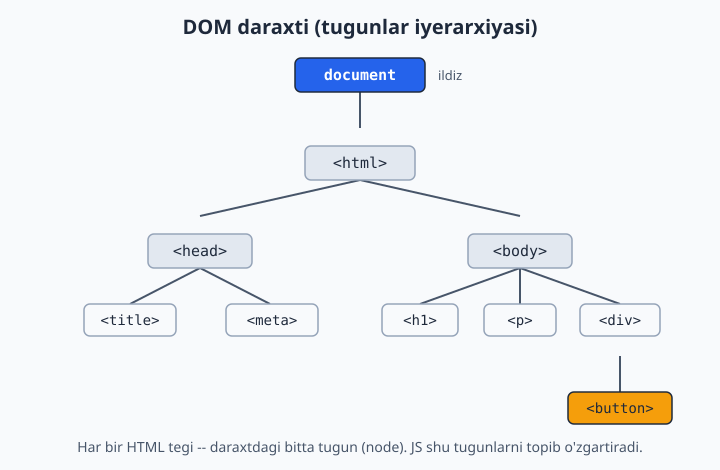
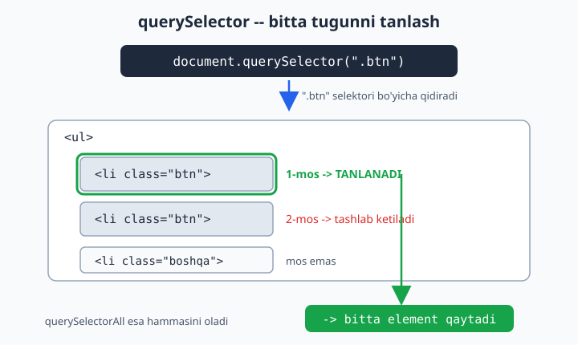
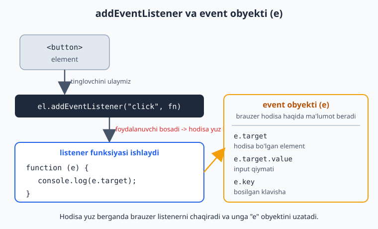
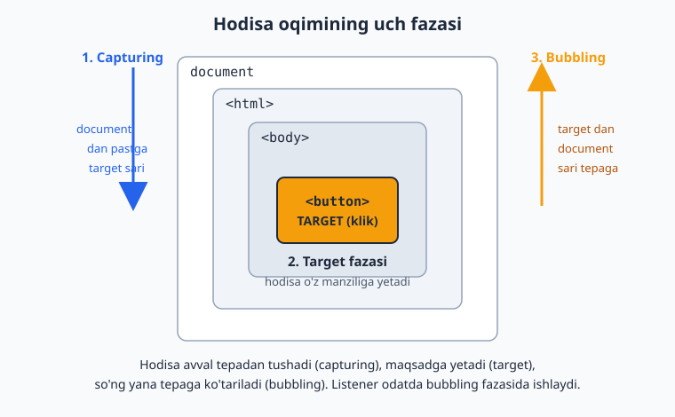

# JavaScript — 0 dan Expertgacha (O'zbek tilida)

📚 [README](./README.md) · [← 2-qism — Strukturalar](./javascript-qollanma-2-qism.md) · [Keyingi: 4-qism — Asinxron JS →](./javascript-qollanma-4-qism.md)

> **3-QISM: BRAUZER (DOM)**
> Endi JS'ni HTML sahifa bilan bog'laymiz: matn o'zgartirish, tugma bosish, forma tekshirish, ma'lumot saqlash.
> Har bir moduldan keyin **20 ta masala** (yechimi bilan). Modullar bo'ylab **Todo-app** quramiz.

> 1-2 qismda toza JS (mantiq) o'rgandik. Endi shu mantiqni **ko'rinadigan natijaga** ulaymiz.

---

# 9-MODUL: DOM bilan ishlash

## DOM nima?

**DOM** (Document Object Model) — brauzer sening HTML'ingni o'qib, uni **obyektlar daraxti** ko'rinishida xotirada saqlaydi. JS shu daraxt orqali sahifani o'qiydi va o'zgartiradi.

```
document
 └── html
      └── body
           ├── h1
           ├── p
           └── div
                └── button
```

Har bir HTML tegi — DOM'da bitta **node (tugun)**. JS shu node'larni topib, ularning matni, rangi, atributlarini o'zgartira oladi. `document` — butun sahifaning "ildizi".



## Element tanlash (Selecting)

Avval elementni "ushlab olishing" kerak, keyin u bilan ishlaysan.

```js
// ID bo'yicha (eng tez):
const sarlavha = document.getElementById("sarlavha");

// CSS selektor bo'yicha — BIRINCHI mosini (eng zamonaviy, eng moslashuvchan):
const tugma = document.querySelector(".btn");        // class
const div = document.querySelector("#asosiy");       // id
const birinchiLi = document.querySelector("ul li");  // ichma-ich

// CSS selektor bo'yicha — HAMMA mosini (NodeList qaytaradi):
const hammaLi = document.querySelectorAll("li");
```

> **Why `querySelector`:** U CSS selektorlarining hammasini tushunadi (`.class`, `#id`, `div > p`, `[data-id]`). Shuning uchun zamonaviy kodda **default tanlov** — `querySelector` / `querySelectorAll`. `getElementById` biroz tezroq, lekin farqi sezilmaydi.



## Matnni o'qish va o'zgartirish

```js
const el = document.querySelector("#xabar");

// O'qish:
console.log(el.textContent); // ichidagi matn

// Yozish:
el.textContent = "Yangi matn";      // FAQAT matn (xavfsiz)
el.innerHTML = "<b>Qalin</b> matn"; // HTML sifatida talqin qiladi
```

> **Why — XSS xavfsizligi (muhim!):** `textContent` matnni shunchaki matn deb yozadi. `innerHTML` esa ichidagi HTML teglarini **bajaradi**. Agar foydalanuvchidan kelgan ma'lumotni `innerHTML` ga qo'ysang, u `<script>` yuborib saytingni buzishi mumkin (XSS hujumi). **Qoida:** matn uchun doim `textContent`, `innerHTML`ni faqat o'zing ishonchli HTML yozganingda ishlat.

## Atributlarni o'zgartirish

```js
const rasm = document.querySelector("img");

rasm.src = "yangi.jpg";                  // to'g'ridan-to'g'ri
rasm.setAttribute("alt", "Tavsif");      // setAttribute orqali
console.log(rasm.getAttribute("src"));   // o'qish

const link = document.querySelector("a");
link.href = "https://example.com";

const input = document.querySelector("input");
console.log(input.value); // input qiymati — .value orqali (textContent emas!)
```

## Class bilan ishlash (`classList`) — eng muhim

Rang/ko'rinishni o'zgartirish uchun **inline style emas, class** ishlat (CSS'da uslub aniqlangan bo'ladi):

```js
const el = document.querySelector(".karta");

el.classList.add("faol");       // class qo'shadi
el.classList.remove("faol");    // class olib tashlaydi
el.classList.toggle("faol");    // bor bo'lsa oladi, yo'q bo'lsa qo'shadi
el.classList.contains("faol");  // bormi? -> true/false
```

> **Why class, style emas:** `el.style.color = "red"` — uslubni JS'ga aralashtiradi. `el.classList.add("xato")` — uslub CSS'da qoladi, JS faqat "qaysi holatda" ekanini boshqaradi. Bu — mas'uliyatni ajratish (separation of concerns). Toggle bilan dark mode, active tab kabi narsalar bir qatorda hal bo'ladi.

## Style'ni to'g'ridan-to'g'ri o'zgartirish (kamroq)

```js
const el = document.querySelector("#quti");
el.style.color = "white";
el.style.backgroundColor = "blue"; // CSS: background-color -> JS: backgroundColor (camelCase)
el.style.display = "none";          // yashirish
```

## Yangi element yaratish va qo'shish

Bu — ma'lumotdan ro'yxat yasashning asosi:

```js
// 1. Element yarat
const yangiLi = document.createElement("li");

// 2. Ichini to'ldir
yangiLi.textContent = "Yangi vazifa";
yangiLi.classList.add("vazifa");

// 3. Sahifaga qo'sh
const royxat = document.querySelector("ul");
royxat.appendChild(yangiLi);  // oxiriga qo'shadi
// royxat.prepend(yangiLi);   // boshiga qo'shadi
```

## Element o'chirish

```js
const el = document.querySelector(".vazifa");
el.remove(); // o'zini o'chiradi
```

## Daraxt bo'ylab harakat (Traversal)

```js
const el = document.querySelector(".farzand");

el.parentElement;          // ota element
el.children;               // bolalari (HTMLCollection)
el.nextElementSibling;     // keyingi qo'shni
el.previousElementSibling; // oldingi qo'shni
```

## Massivdan ro'yxat yasash (eng amaliy namuna)

```js
const vazifalar = ["O'qish", "Yozish", "Mashq qilish"];
const ul = document.querySelector("#vazifalar");

vazifalar.forEach(vazifa => {
  const li = document.createElement("li");
  li.textContent = vazifa;
  ul.appendChild(li);
});
```

> **Why diqqat — performance:** Sikl ichida har safar DOM'ga `appendChild` qilish — ko'p elementda sekin. Katta ro'yxatda `innerHTML`ni bir marta yig'ib qo'yish yoki `DocumentFragment` ishlatish tezroq. Hozircha kichik ro'yxatlar uchun bu yetarli — lekin bu tushunchani esda tut.

---

## 📝 9-modul masalalari (20 ta)

> Quyidagi HTML asosini ishlating (`.html` fayl yaratib, `<body>` ichiga qo'ying):
> ```html
> <h1 id="sarlavha">Salom</h1>
> <p class="matn">Bu paragraf</p>
> 
> <ul id="royxat"><li>Bir</li><li>Ikki</li></ul>
> <input id="kiritish" type="text">
> <div id="quti">Quti</div>
> <script src="app.js"></script>
> ```

1. `getElementById` bilan `#sarlavha` ni tanlab, matnini "Yangilandi" qiling.
2. `querySelector` bilan `.matn` ni tanlang va matnini o'qing.
3. `querySelectorAll` bilan barcha `<li>` larni oling va sonini chiqaring.
4. `#sarlavha` ning `textContent` ini konsolga chiqaring.
5. `#quti` ichiga `innerHTML` bilan `<b>Qalin</b>` qo'shing.
6. `textContent` va `innerHTML` farqini bitta misolda ko'rsating.
7. `#quti` ga `classList.add` bilan `"faol"` class qo'shing.
8. `#quti` da `classList.toggle("faol")` ni 2 marta chaqirib natijani kuzating.
9. `classList.contains` bilan `#quti` da `"faol"` borligini tekshiring.
10. `#quti` ning matn rangini `style.color` bilan qizil qiling.
11. `#rasm` ga `setAttribute` bilan yangi `alt` bering.
12. `#rasm` ning `src` ini "yangi.jpg" ga o'zgartiring.
13. `createElement` + `appendChild` bilan `#royxat`ga uchinchi `<li>` qo'shing.
14. `#royxat` boshiga `prepend` bilan `<li>` qo'shing.
15. Birinchi `<li>` ni `remove()` bilan o'chiring.
16. Birinchi `<li>` ning `parentElement` ini topib, uning teg nomini chiqaring.
17. `querySelectorAll("li")` + `forEach` bilan har bir `<li>` ga `"element"` class qo'shing.
18. `#kiritish` input qiymatini (`value`) konsolga chiqaring.
19. `createElement` bilan `<div>` yasab, ichiga `<h3>` va `<p>` joylang (card).
20. **Todo qadami:** `["O'qish","Yozish","Kodlash"]` massividan `#royxat` ichida `<li>` lar yasab chiqaring (render funksiyasi).

<details markdown="1">
<summary>► Yechimlar</summary>

```js
// 1
document.getElementById("sarlavha").textContent = "Yangilandi";

// 2
console.log(document.querySelector(".matn").textContent);

// 3
console.log(document.querySelectorAll("li").length); // 2

// 4
console.log(document.querySelector("#sarlavha").textContent);

// 5
document.querySelector("#quti").innerHTML = "<b>Qalin</b>";

// 6
const q = document.querySelector("#quti");
q.textContent = "<b>matn</b>"; // ekranda <b>matn</b> ko'rinadi (teg bajarilmaydi)
q.innerHTML = "<b>matn</b>";   // ekranda matn QALIN bo'lib chiqadi

// 7
document.querySelector("#quti").classList.add("faol");

// 8 -> 1-chaqiriq qo'shadi, 2-chaqiriq oladi (natija: yo'q)
const qu = document.querySelector("#quti");
qu.classList.toggle("faol"); // qo'shildi
qu.classList.toggle("faol"); // olindi

// 9
console.log(document.querySelector("#quti").classList.contains("faol"));

// 10
document.querySelector("#quti").style.color = "red";

// 11
document.querySelector("#rasm").setAttribute("alt", "Yangi tavsif");

// 12
document.querySelector("#rasm").src = "yangi.jpg";

// 13
const li13 = document.createElement("li");
li13.textContent = "Uch";
document.querySelector("#royxat").appendChild(li13);

// 14
const li14 = document.createElement("li");
li14.textContent = "Nol";
document.querySelector("#royxat").prepend(li14);

// 15
document.querySelector("#royxat li").remove();

// 16 -> "UL"
console.log(document.querySelector("#royxat li").parentElement.tagName);

// 17
document.querySelectorAll("li").forEach(li => li.classList.add("element"));

// 18
console.log(document.querySelector("#kiritish").value);

// 19
const card = document.createElement("div");
const h3 = document.createElement("h3");
h3.textContent = "Sarlavha";
const p = document.createElement("p");
p.textContent = "Tavsif matni";
card.appendChild(h3);
card.appendChild(p);
document.body.appendChild(card);

// 20 — render funksiyasi
function render(vazifalar) {
  const ul = document.querySelector("#royxat");
  ul.innerHTML = ""; // avval tozalaymiz
  vazifalar.forEach(v => {
    const li = document.createElement("li");
    li.textContent = v;
    ul.appendChild(li);
  });
}
render(["O'qish", "Yozish", "Kodlash"]);
```
</details>

---

# 10-MODUL: Events (hodisalar)

## Event nima?

Event — sahifada sodir bo'ladigan **hodisa**: tugma bosildi, matn yozildi, sichqoncha harakatlandi, forma yuborildi. JS shu hodisalarni "tinglab", javob beradi.

## `addEventListener` — hodisani tinglash

```js
const tugma = document.querySelector("#tugma");

tugma.addEventListener("click", function() {
  console.log("Tugma bosildi!");
});

// Arrow bilan (zamonaviy):
tugma.addEventListener("click", () => {
  alert("Salom!");
});
```

Sintaksis: `element.addEventListener("hodisa_nomi", funksiya)`. Bosilganda funksiya ishlaydi.

> **Why `addEventListener`, `onclick` emas:** HTML'da `<button onclick="...">` yozma. `addEventListener`ning afzalligi: bitta elementga **bir nechta** listener ulay olasan, HTML'ni JS'dan ajratasan, va `removeEventListener` bilan o'chira olasan. Bu — toza yondashuv.

## Ko'p ishlatiladigan hodisalar

```js
el.addEventListener("click", fn);     // bosish
el.addEventListener("dblclick", fn);  // ikki marta bosish
el.addEventListener("input", fn);     // matn yozilganda (har harfda)
el.addEventListener("change", fn);    // qiymat o'zgarib, fokus ketganda
el.addEventListener("submit", fn);    // forma yuborilganda
el.addEventListener("keydown", fn);   // klavisha bosilganda
el.addEventListener("keyup", fn);     // klavisha qo'yib yuborilganda
el.addEventListener("mouseover", fn); // sichqoncha ustiga kelganda
el.addEventListener("mouseout", fn);  // sichqoncha chiqib ketganda
el.addEventListener("focus", fn);     // input fokus olganda
el.addEventListener("blur", fn);      // input fokus yo'qotganda
```

## Event obyekti (`e`)

Listener funksiyasiga brauzer **hodisa haqida ma'lumot** beradi — buni odatda `e` yoki `event` deb nomlaymiz:

```js
const input = document.querySelector("#kiritish");

input.addEventListener("input", (e) => {
  console.log(e.target);       // hodisa sodir bo'lgan element
  console.log(e.target.value); // input ichidagi matn (har yozilganda)
});

document.addEventListener("keydown", (e) => {
  console.log(e.key);  // bosilgan klavisha (masalan "Enter", "a", "ArrowUp")
});
```

`e` ning eng muhim qismlari:
- **`e.target`** — hodisa sodir bo'lgan element.
- **`e.target.value`** — input/textarea/select qiymati.
- **`e.key`** — bosilgan klavisha (klaviatura hodisalarida).
- **`e.preventDefault()`** — brauzerning standart xatti-harakatini to'xtatadi.



## `preventDefault()` — standart harakatni to'xtatish

```js
const link = document.querySelector("a");
link.addEventListener("click", (e) => {
  e.preventDefault(); // link sahifaga o'tmaydi
  console.log("Bosildi, lekin o'tmadik");
});

// Eng ko'p ishlatiladigan joy — forma (sahifa qayta yuklanmasligi uchun):
form.addEventListener("submit", (e) => {
  e.preventDefault(); // sahifa yangilanmaydi
  // o'z mantiqing...
});
```

> **Why:** Forma yuborilganda brauzer odatda sahifani **qayta yuklaydi** (eski usul). SPA (Vue/React) va AJAX'da bu kerak emas — `e.preventDefault()` shu standart yuklanishni to'xtatadi, sen o'zing JS bilan ish ko'rasan.

## Hisoblagich misoli (DOM + Event birga)

```html
<p id="son">0</p>
<button id="qosh">+1</button>
<script>
  let hisob = 0;
  const sonEl = document.querySelector("#son");

  document.querySelector("#qosh").addEventListener("click", () => {
    hisob++;
    sonEl.textContent = hisob; // ekranni yangilaymiz
  });
</script>
```

## Event Delegation (muhim pattern)

Ko'p elementga alohida listener ulash o'rniga, **ota elementga bitta** listener ulab, `e.target` orqali qaysi bola bosilganini aniqlaysan:

```js
const royxat = document.querySelector("#royxat");

royxat.addEventListener("click", (e) => {
  if (e.target.tagName === "LI") {
    e.target.classList.toggle("bajarildi");
  }
});
```

> **Why delegation:** Bu — eng kuchli pattern. Sabablari: (1) keyin **dinamik qo'shilgan** elementlar ham avtomatik ishlaydi (yangi `<li>`ga alohida listener kerak emas); (2) 100 ta listener o'rniga **bitta** — tez va kam xotira. Todo-app, jadval, ro'yxat — hammasida shuni ishlat.

> Delegation aynan shu sababli ishlaydi: bola element bosilganda hodisa undan ota elementlar sari **tepaga ko'tariladi** (bubbling). Aslida har hodisa uch fazadan o'tadi — avval tepadan tushadi (capturing), maqsadga yetadi (target), so'ng yana tepaga ko'tariladi (bubbling):



## Bir nechta elementga listener (`forEach`)

```js
const tugmalar = document.querySelectorAll(".tugma");
tugmalar.forEach(tugma => {
  tugma.addEventListener("click", () => {
    console.log("Bosildi:", tugma.textContent);
  });
});
```

## `data-*` atributlari (`dataset`)

Elementga maxsus ma'lumot biriktirish uchun:

```html
<button data-id="42" data-amal="ochir">O'chirish</button>
```
```js
tugma.addEventListener("click", (e) => {
  console.log(e.target.dataset.id);   // "42"
  console.log(e.target.dataset.amal); // "ochir"
});
```

> **Why `data-*`:** Element bilan birga "qaysi yozuvga tegishli" degan ma'lumotni saqlaydi. Todo-app'da har `<li>`ga `data-id` qo'yib, o'chirishda qaysi vazifani o'chirishni bilasan.

---

## 📝 10-modul masalalari (20 ta)

> HTML asosi:
> ```html
> <h1 id="natija">Natija</h1>
> <button id="btn">Bosing</button>
> <input id="kiritish" type="text">
> <select id="tanlov"><option>Bir</option><option>Ikki</option></select>
> <input type="checkbox" id="belgi">
> <ul id="royxat"><li data-id="1">A</li><li data-id="2">B</li></ul>
> <div class="tugmalar"><button>X</button><button>Y</button></div>
> ```

1. `#btn` bosilganda konsolga "Bosildi" chiqaring.
2. `#btn` bosilganda `#natija` matnini "Tugma bosildi" qiling.
3. Hisoblagich: `#btn` har bosilganda `#natija` da son 1 ga oshsin.
4. `#kiritish` ga yozilganda (`input`) yozilgan matn `#natija` da jonli ko'rinsin.
5. `e.target.value` ni `input` hodisasida olib chiqaring.
6. `keydown`: bosilgan klavishani (`e.key`) `#natija` da ko'rsating.
7. `#kiritish` da Enter bosilganda "Yuborildi" chiqaring.
8. `#tanlov` (`change`) o'zgarganda tanlangan qiymatni chiqaring.
9. `#belgi` checkbox holatini (`checked`) bosilganda chiqaring.
10. `#btn` ga `mouseover`/`mouseout` da rangini o'zgartiring.
11. `#btn` bosilganda `#natija` ni `display:none`/`block` bilan yashiring/ko'rsating (toggle).
12. Linkka `preventDefault` qo'llab, bosilganda o'tmasligini ta'minlang.
13. `dblclick`: `#natija` ikki marta bosilganda matnini tozalang.
14. **Event delegation:** `#royxat`ga listener qo'yib, bosilgan `<li>`ga `"faol"` class qo'shing.
15. `.tugmalar` ichidagi har bir tugmaga `forEach` bilan listener qo'shing (matnini chiqarsin).
16. `#royxat` `<li>` bosilganda `e.target.dataset.id` ni chiqaring.
17. `removeEventListener` bilan listener'ni bir martadan keyin o'chiring.
18. `#kiritish` `focus`/`blur` da border rangini o'zgartiring (`classList`).
19. `keydown` bilan ArrowUp/ArrowDown bosilganda son oshsin/kamaysin.
20. **Todo qadami:** `#kiritish`ga vazifa yozib `#btn` bosilganda, vazifani massivga qo'shib `#royxat`ni qayta render qiling.

<details markdown="1">
<summary>► Yechimlar</summary>

```js
// 1
document.querySelector("#btn").addEventListener("click", () => console.log("Bosildi"));

// 2
document.querySelector("#btn").addEventListener("click", () => {
  document.querySelector("#natija").textContent = "Tugma bosildi";
});

// 3
let hisob = 0;
document.querySelector("#btn").addEventListener("click", () => {
  hisob++;
  document.querySelector("#natija").textContent = hisob;
});

// 4
document.querySelector("#kiritish").addEventListener("input", (e) => {
  document.querySelector("#natija").textContent = e.target.value;
});

// 5
document.querySelector("#kiritish").addEventListener("input", (e) => {
  console.log(e.target.value);
});

// 6
document.addEventListener("keydown", (e) => {
  document.querySelector("#natija").textContent = e.key;
});

// 7
document.querySelector("#kiritish").addEventListener("keydown", (e) => {
  if (e.key === "Enter") console.log("Yuborildi");
});

// 8
document.querySelector("#tanlov").addEventListener("change", (e) => {
  console.log(e.target.value);
});

// 9
document.querySelector("#belgi").addEventListener("change", (e) => {
  console.log(e.target.checked); // true/false
});

// 10
const btn = document.querySelector("#btn");
btn.addEventListener("mouseover", () => btn.style.backgroundColor = "blue");
btn.addEventListener("mouseout", () => btn.style.backgroundColor = "");

// 11
document.querySelector("#btn").addEventListener("click", () => {
  const n = document.querySelector("#natija");
  n.style.display = n.style.display === "none" ? "block" : "none";
});

// 12
document.querySelector("a")?.addEventListener("click", (e) => {
  e.preventDefault();
  console.log("O'tmadik");
});

// 13
document.querySelector("#natija").addEventListener("dblclick", (e) => {
  e.target.textContent = "";
});

// 14 — event delegation
document.querySelector("#royxat").addEventListener("click", (e) => {
  if (e.target.tagName === "LI") e.target.classList.toggle("faol");
});

// 15
document.querySelectorAll(".tugmalar button").forEach(b => {
  b.addEventListener("click", () => console.log(b.textContent));
});

// 16
document.querySelector("#royxat").addEventListener("click", (e) => {
  if (e.target.tagName === "LI") console.log(e.target.dataset.id);
});

// 17
function birMarta() {
  console.log("Faqat bir marta");
  document.querySelector("#btn").removeEventListener("click", birMarta);
}
document.querySelector("#btn").addEventListener("click", birMarta);
// (yoki: addEventListener("click", fn, { once: true }))

// 18
const inp = document.querySelector("#kiritish");
inp.addEventListener("focus", () => inp.classList.add("faol"));
inp.addEventListener("blur", () => inp.classList.remove("faol"));

// 19
let qiymat = 0;
document.addEventListener("keydown", (e) => {
  if (e.key === "ArrowUp") qiymat++;
  if (e.key === "ArrowDown") qiymat--;
  document.querySelector("#natija").textContent = qiymat;
});

// 20 — Todo qo'shish
const vazifalar = [];
function render() {
  const ul = document.querySelector("#royxat");
  ul.innerHTML = "";
  vazifalar.forEach(v => {
    const li = document.createElement("li");
    li.textContent = v;
    ul.appendChild(li);
  });
}
document.querySelector("#btn").addEventListener("click", () => {
  const input = document.querySelector("#kiritish");
  if (input.value.trim() !== "") {
    vazifalar.push(input.value.trim());
    input.value = "";
    render();
  }
});
```
</details>

---

# 11-MODUL: Forms va validation

Forma — foydalanuvchidan ma'lumot olishning asosiy yo'li. JS bilan uni tekshiramiz (validation) va qayta ishlaymiz.

## Forma qiymatlarini olish

```html
<form id="forma">
  <input id="ism" type="text">
  <input id="parol" type="password">
  <input id="rozilik" type="checkbox">
  <select id="shahar">
    <option value="tsh">Toshkent</option>
    <option value="smq">Samarqand</option>
  </select>
  <button type="submit">Yuborish</button>
</form>
```
```js
const ism = document.querySelector("#ism").value;        // matn
const parol = document.querySelector("#parol").value;
const rozimi = document.querySelector("#rozilik").checked; // true/false
const shahar = document.querySelector("#shahar").value;    // "tsh" yoki "smq"
```

> **Eslab qol:** Matn maydonlari uchun `.value`, checkbox/radio uchun `.checked`.

## `submit` hodisasi + `preventDefault`

```js
const forma = document.querySelector("#forma");

forma.addEventListener("submit", (e) => {
  e.preventDefault(); // sahifa qayta yuklanmaydi

  const ism = document.querySelector("#ism").value;
  console.log("Yuborildi:", ism);
});
```

> **Why submit, click emas:** Listener'ni tugmaga emas, **formaga `submit`** ga ulash kerak. Sababi: foydalanuvchi Enter bosib ham forma yuborishi mumkin — `submit` ikkalasini ham ushlaydi. `e.preventDefault()`siz sahifa yangilanib, hamma ma'lumot yo'qoladi.

## Oddiy validatsiya

```js
forma.addEventListener("submit", (e) => {
  e.preventDefault();

  const ism = document.querySelector("#ism").value.trim();
  const parol = document.querySelector("#parol").value;

  // Bo'sh tekshiruv:
  if (ism === "") {
    console.log("Ism kiritilmagan");
    return; // davom etmaymiz
  }

  // Uzunlik tekshiruvi:
  if (parol.length < 6) {
    console.log("Parol kamida 6 ta belgi bo'lsin");
    return;
  }

  console.log("Hammasi to'g'ri!");
});
```

## Email tekshiruvi

```js
const email = document.querySelector("#email").value;

// Oddiy (includes bilan):
if (!email.includes("@") || !email.includes(".")) {
  console.log("Email noto'g'ri");
}

// Aniqroq (regex bilan — 23-modulda chuqur ko'ramiz):
const pattern = /^[^\s@]+@[^\s@]+\.[^\s@]+$/;
if (!pattern.test(email)) {
  console.log("Email formati xato");
}
```

## Xato xabarini ekranda ko'rsatish

Konsol emas, foydalanuvchiga ko'rinadigan xabar:

```html
<input id="ism" type="text">
<span id="ismXato" class="xato"></span>
```
```js
const ismXato = document.querySelector("#ismXato");

if (ism === "") {
  ismXato.textContent = "Ism majburiy";
  document.querySelector("#ism").classList.add("xato-border");
} else {
  ismXato.textContent = "";
  document.querySelector("#ism").classList.remove("xato-border");
}
```

## Real-time validatsiya (`input` hodisasida)

Foydalanuvchi yozar ekan tekshirish (UX yaxshilanadi):

```js
const parol = document.querySelector("#parol");
const xabar = document.querySelector("#parolXato");

parol.addEventListener("input", () => {
  if (parol.value.length < 6) {
    xabar.textContent = "Yana " + (6 - parol.value.length) + " ta belgi kerak";
  } else {
    xabar.textContent = "✓ Yaxshi";
  }
});
```

## `FormData` (barcha qiymatlarni bir vaqtda)

Ko'p maydonli formada qulay:

```js
forma.addEventListener("submit", (e) => {
  e.preventDefault();
  const data = new FormData(forma);

  console.log(data.get("ism")); // name="ism" maydonidan
  // Obyektga aylantirish:
  const obyekt = Object.fromEntries(data);
  console.log(obyekt); // { ism: "...", parol: "..." }
});
```

> **Eslatma:** `FormData` ishlashi uchun input'larda `name` atributi bo'lishi kerak (`<input name="ism">`).

---

## 📝 11-modul masalalari (20 ta)

> HTML asosi:
> ```html
> <form id="forma">
>   <input id="ism" name="ism" type="text">
>   <input id="email" name="email" type="email">
>   <input id="parol" name="parol" type="password">
>   <input id="tasdiq" name="tasdiq" type="password">
>   <input id="yosh" name="yosh" type="number">
>   <input id="rozilik" type="checkbox">
>   <select id="shahar"><option value="tsh">Toshkent</option></select>
>   <span id="xato" class="xato"></span>
>   <button type="submit">Yuborish</button>
> </form>
> ```

1. Formaga `submit` listener qo'shib, `preventDefault` qiling.
2. `#ism` qiymatini submitda olib chiqaring.
3. `#ism` bo'sh bo'lsa "Ism majburiy" deb `#xato`da ko'rsating.
4. `#parol` 6 belgidan qisqa bo'lsa xato bering.
5. `#email` da `@` yo'q bo'lsa xato bering.
6. Email'ni regex bilan tekshiring (`test`).
7. `#rozilik` belgilanmagan bo'lsa "Shartlarga rozi bo'ling" deng.
8. `#shahar` tanlangan qiymatini chiqaring.
9. `#yosh` 0 dan kichik yoki bo'sh bo'lsa xato bering.
10. `#parol` va `#tasdiq` mos kelmasa "Parollar mos emas" deng.
11. Xato bo'lsa input'ga `"xato-border"` class qo'shing, to'g'ri bo'lsa oling.
12. Hamma to'g'ri bo'lsa "Muvaffaqiyatli!" deb ko'rsatib, formani tozalang (`reset`).
13. `FormData` bilan barcha qiymatlarni obyekt qilib oling.
14. `#parol`ga real-time (`input`) validatsiya qo'shing.
15. Submit tugmasini `#rozilik` belgilanmaguncha `disabled` qiling.
16. `#yosh` faqat son ekanini tekshiring (`isNaN`).
17. `#ism` kamida 3 ta belgi bo'lsin (trim'dan keyin).
18. Telefon `"+998"` bilan boshlanishini tekshiring (`startsWith`).
19. Barcha xatolarni **bir vaqtda** yig'ib, ro'yxat qilib ko'rsating (massiv).
20. **To'liq forma:** ism(≥3), email(regex), parol(≥6), tasdiq(mos) — hammasini tekshirib, faqat to'liq to'g'ri bo'lsa "Ro'yxatdan o'tdingiz" deng.

<details markdown="1">
<summary>► Yechimlar</summary>

```js
const forma = document.querySelector("#forma");
const xato = document.querySelector("#xato");

// 1
forma.addEventListener("submit", (e) => e.preventDefault());

// 2
forma.addEventListener("submit", (e) => {
  e.preventDefault();
  console.log(document.querySelector("#ism").value);
});

// 3
function tekshir3() {
  const ism = document.querySelector("#ism").value.trim();
  if (ism === "") { xato.textContent = "Ism majburiy"; return false; }
  return true;
}

// 4
const parol = document.querySelector("#parol");
if (parol.value.length < 6) xato.textContent = "Parol ≥ 6 belgi";

// 5
const email = document.querySelector("#email");
if (!email.value.includes("@")) xato.textContent = "Email noto'g'ri";

// 6
const pattern = /^[^\s@]+@[^\s@]+\.[^\s@]+$/;
if (!pattern.test(email.value)) xato.textContent = "Email formati xato";

// 7
if (!document.querySelector("#rozilik").checked)
  xato.textContent = "Shartlarga rozi bo'ling";

// 8
console.log(document.querySelector("#shahar").value);

// 9
const yosh = document.querySelector("#yosh").value;
if (yosh === "" || Number(yosh) <= 0) xato.textContent = "Yosh noto'g'ri";

// 10
const tasdiq = document.querySelector("#tasdiq").value;
if (parol.value !== tasdiq) xato.textContent = "Parollar mos emas";

// 11
function belgi(el, xatomi) {
  if (xatomi) el.classList.add("xato-border");
  else el.classList.remove("xato-border");
}

// 12
function muvaffaqiyat() {
  xato.textContent = "Muvaffaqiyatli!";
  forma.reset();
}

// 13
forma.addEventListener("submit", (e) => {
  e.preventDefault();
  const data = Object.fromEntries(new FormData(forma));
  console.log(data); // { ism, email, parol, tasdiq, yosh }
});

// 14
parol.addEventListener("input", () => {
  xato.textContent = parol.value.length < 6
    ? `Yana ${6 - parol.value.length} ta belgi`
    : "✓ Yaxshi";
});

// 15
const rozilik = document.querySelector("#rozilik");
const btn = forma.querySelector("button");
rozilik.addEventListener("change", () => {
  btn.disabled = !rozilik.checked;
});

// 16
if (isNaN(Number(yosh)) || yosh === "") xato.textContent = "Faqat son";

// 17
if (document.querySelector("#ism").value.trim().length < 3)
  xato.textContent = "Ism ≥ 3 belgi";

// 18 (telefon maydonini #ism deb faraz qildik)
const tel = "+998901234567";
if (!tel.startsWith("+998")) xato.textContent = "+998 bilan boshlansin";

// 19 — barcha xatolarni yig'ish
function hammaXatolar() {
  const xatolar = [];
  const ism = document.querySelector("#ism").value.trim();
  if (ism.length < 3) xatolar.push("Ism ≥ 3 belgi");
  if (!pattern.test(email.value)) xatolar.push("Email noto'g'ri");
  if (parol.value.length < 6) xatolar.push("Parol ≥ 6 belgi");
  return xatolar;
}

// 20 — to'liq forma
forma.addEventListener("submit", (e) => {
  e.preventDefault();
  const xatolar = [];
  const ism = document.querySelector("#ism").value.trim();
  const em = document.querySelector("#email").value;
  const pa = document.querySelector("#parol").value;
  const ta = document.querySelector("#tasdiq").value;

  if (ism.length < 3) xatolar.push("Ism kamida 3 ta belgi");
  if (!pattern.test(em)) xatolar.push("Email formati noto'g'ri");
  if (pa.length < 6) xatolar.push("Parol kamida 6 ta belgi");
  if (pa !== ta) xatolar.push("Parollar mos kelmadi");

  if (xatolar.length > 0) {
    xato.innerHTML = xatolar.map(x => `• ${x}`).join("<br>");
  } else {
    xato.textContent = "Ro'yxatdan o'tdingiz ✓";
    forma.reset();
  }
});
```
</details>

---

# 12-MODUL: localStorage (ma'lumot saqlash)

## Web Storage nima?

`localStorage` — brauzerda **ma'lumot saqlash** imkoniyati. Sahifa yangilangandan keyin ham, hatto brauzer yopilib qayta ochilsa ham ma'lumot saqlanib qoladi. Hisoblagich, theme tanlovi, savatcha — shu yerda saqlanadi.

```js
// Saqlash:
localStorage.setItem("ism", "Oqil");

// O'qish:
const ism = localStorage.getItem("ism"); // "Oqil"

// O'chirish:
localStorage.removeItem("ism");

// Hammasini tozalash:
localStorage.clear();
```

## `localStorage` vs `sessionStorage`

```js
localStorage.setItem("a", "1");   // brauzer yopilsa ham QOLADI
sessionStorage.setItem("b", "2"); // tab/oyna yopilsa O'CHADI
```

| | localStorage | sessionStorage |
|---|---|---|
| Yashash muddati | Doimiy (qo'lda o'chirilguncha) | Tab yopilguncha |
| Hajmi | ~5-10 MB | ~5-10 MB |
| Ishlatilishi | Theme, til, savatcha | Vaqtinchalik holat |

## ⚠️ Faqat matn saqlaydi!

`localStorage` **faqat string** saqlaydi. Son saqlasang ham, qaytib string bo'lib chiqadi:

```js
localStorage.setItem("yosh", 25);
const yosh = localStorage.getItem("yosh");
console.log(yosh);        // "25" (string!)
console.log(typeof yosh); // "string"
console.log(Number(yosh) + 1); // 26 — qayta songa aylantirish kerak
```

## Obyekt/massiv saqlash (JSON bilan)

Obyekt yoki massivni saqlash uchun avval **matnga** aylantirasan (7-modulda ko'rgan `JSON`):

```js
const user = { ism: "Oqil", yosh: 25 };

// Saqlash: obyekt -> JSON matn
localStorage.setItem("user", JSON.stringify(user));

// O'qish: JSON matn -> obyekt
const saqlangan = JSON.parse(localStorage.getItem("user"));
console.log(saqlangan.ism); // "Oqil"
```

```js
// Massiv ham xuddi shunday:
const vazifalar = ["O'qish", "Yozish"];
localStorage.setItem("vazifalar", JSON.stringify(vazifalar));
const olingan = JSON.parse(localStorage.getItem("vazifalar"));
```

> **Why diqqat:** `localStorage.setItem("user", user)` deb to'g'ridan-to'g'ri obyekt bersang, u `"[object Object]"` bo'lib saqlanadi (buzilgan). Obyekt/massiv uchun **doim** `JSON.stringify`/`JSON.parse` ishlat.

## Mavjudligini tekshirish

`getItem` topa olmasa `null` qaytaradi:

```js
const ism = localStorage.getItem("ism");
if (ism === null) {
  console.log("Hali saqlanmagan");
} else {
  console.log("Salom, " + ism);
}

// Yoki qisqa (default bilan):
const til = localStorage.getItem("til") || "uz";
```

## Amaliy: Dark mode (theme) saqlash

```html
<button id="theme">Theme almashtirish</button>
<script>
  // Sahifa yuklanganda saqlangan theme'ni qo'llash:
  const saqlangan = localStorage.getItem("theme");
  if (saqlangan === "dark") {
    document.body.classList.add("dark");
  }

  document.querySelector("#theme").addEventListener("click", () => {
    document.body.classList.toggle("dark");
    // Holatni saqlash:
    const hozir = document.body.classList.contains("dark") ? "dark" : "light";
    localStorage.setItem("theme", hozir);
  });
</script>
```

> **Why — xavfsizlik eslatmasi:** `localStorage`ga **maxfiy ma'lumot saqlama** (parol, JWT token, bank ma'lumotlari). Sababi: u oddiy matn ko'rinishida turadi va har qanday JS (jumladan XSS orqali kirgan zararli kod) uni o'qiy oladi. Faqat zararsiz, foydalanuvchi qulayligi uchun ma'lumotlarni saqla (theme, til, UI holati).

---

## 📝 12-modul masalalari (20 ta)

1. `localStorage.setItem` bilan `"ism"` ga o'z isimingni saqlang.
2. `getItem` bilan uni o'qib, konsolga chiqaring.
3. `removeItem` bilan `"ism"` ni o'chiring.
4. `clear()` bilan hammasini tozalang.
5. `"ism"` saqlanmagan bo'lsa (`null`) "Mehmon" deb chiqaring.
6. Son `100` ni saqlang, o'qing, songa aylantirib `+50` qiling.
7. `{ism:"Oqil", yosh:25}` obyektini `JSON.stringify` bilan saqlang.
8. Uni `JSON.parse` bilan qaytarib o'qing va `.ism` ni chiqaring.
9. `["a","b","c"]` massivini saqlang va o'qing.
10. Hisoblagich: tugma bosilganda son oshib, `localStorage`da saqlansin (sahifa yangilansa ham qolsin).
11. Theme toggle: dark/light holatini saqlang.
12. Sahifa yuklanganda saqlangan theme'ni `body`ga qo'llang.
13. Ism saqlang; keyingi tashrifda "Yana xush kelibsiz, X" deng.
14. Saqlangan massivga yangi element qo'shib, qayta saqlang.
15. Saqlangan massivdan element o'chirib, qayta saqlang.
16. `"til"` saqlanmagan bo'lsa default `"uz"` ni ishlating (`|| "uz"`).
17. `sessionStorage`ga ma'lumot saqlab, `localStorage`dan farqini tushuntiring.
18. Oxirgi tashrif vaqtini (`new Date().toISOString()`) saqlang va ko'rsating.
19. `localStorage`da nechta kalit borligini (`localStorage.length`) chiqaring.
20. **TO'LIQ TODO-APP:** input + tugma + ro'yxat. Vazifa qo'shish, o'chirish (delegation), va `localStorage`da saqlash (sahifa yangilansa ham qolsin).

<details markdown="1">
<summary>► Yechimlar</summary>

```js
// 1
localStorage.setItem("ism", "Oqil");

// 2
console.log(localStorage.getItem("ism")); // "Oqil"

// 3
localStorage.removeItem("ism");

// 4
localStorage.clear();

// 5
console.log(localStorage.getItem("ism") ?? "Mehmon");

// 6 -> 150
localStorage.setItem("son", 100);
console.log(Number(localStorage.getItem("son")) + 50);

// 7
localStorage.setItem("user", JSON.stringify({ ism: "Oqil", yosh: 25 }));

// 8 -> "Oqil"
console.log(JSON.parse(localStorage.getItem("user")).ism);

// 9
localStorage.setItem("harflar", JSON.stringify(["a", "b", "c"]));
console.log(JSON.parse(localStorage.getItem("harflar")));

// 10 — saqlanadigan hisoblagich
let hisob = Number(localStorage.getItem("hisob")) || 0;
document.querySelector("#btn")?.addEventListener("click", () => {
  hisob++;
  localStorage.setItem("hisob", hisob);
  document.querySelector("#natija").textContent = hisob;
});

// 11 & 12 — theme
if (localStorage.getItem("theme") === "dark") document.body.classList.add("dark");
document.querySelector("#theme")?.addEventListener("click", () => {
  document.body.classList.toggle("dark");
  localStorage.setItem("theme", document.body.classList.contains("dark") ? "dark" : "light");
});

// 13
const eski = localStorage.getItem("ism");
if (eski) console.log(`Yana xush kelibsiz, ${eski}`);
localStorage.setItem("ism", "Oqil");

// 14
const arr14 = JSON.parse(localStorage.getItem("harflar")) || [];
arr14.push("d");
localStorage.setItem("harflar", JSON.stringify(arr14));

// 15
let arr15 = JSON.parse(localStorage.getItem("harflar")) || [];
arr15 = arr15.filter(x => x !== "b"); // "b" ni o'chir
localStorage.setItem("harflar", JSON.stringify(arr15));

// 16
const til = localStorage.getItem("til") || "uz";
console.log(til);

// 17
sessionStorage.setItem("vaqtinchalik", "123");
// Farqi: tab yopilsa o'chadi; localStorage qoladi.

// 18
localStorage.setItem("oxirgiTashrif", new Date().toISOString());
console.log(localStorage.getItem("oxirgiTashrif"));

// 19
console.log(localStorage.length);

// 20 — TO'LIQ TODO-APP (alohida pastda)
```

### 20-masala: To'liq Todo-app (HTML + JS)

```html
<!DOCTYPE html>
<html lang="uz">
<head>
  <meta charset="UTF-8">
  <title>Todo App</title>
  <style>
    body { font-family: sans-serif; max-width: 400px; margin: 40px auto; }
    li { cursor: pointer; padding: 6px; list-style: none; }
    li.bajarildi { text-decoration: line-through; color: gray; }
    .ochir { color: red; margin-left: 10px; }
  </style>
</head>
<body>
  <h1>Vazifalar</h1>
  <input id="kiritish" type="text" placeholder="Yangi vazifa...">
  <button id="qosh">Qo'shish</button>
  <ul id="royxat"></ul>

  <script>
    // localStorage'dan yuklab olamiz (bo'lmasa bo'sh massiv)
    let vazifalar = JSON.parse(localStorage.getItem("vazifalar")) || [];

    const ul = document.querySelector("#royxat");
    const input = document.querySelector("#kiritish");

    // Saqlash funksiyasi
    function saqla() {
      localStorage.setItem("vazifalar", JSON.stringify(vazifalar));
    }

    // Render funksiyasi
    function render() {
      ul.innerHTML = "";
      vazifalar.forEach((v, index) => {
        const li = document.createElement("li");
        li.textContent = v.matn;
        if (v.bajarildi) li.classList.add("bajarildi");
        li.dataset.index = index;

        const ochir = document.createElement("span");
        ochir.textContent = "✕";
        ochir.className = "ochir";
        ochir.dataset.ochir = index;
        li.appendChild(ochir);

        ul.appendChild(li);
      });
    }

    // Qo'shish
    document.querySelector("#qosh").addEventListener("click", () => {
      const matn = input.value.trim();
      if (matn === "") return;
      vazifalar.push({ matn, bajarildi: false });
      input.value = "";
      saqla();
      render();
    });

    // Enter bilan ham qo'shish
    input.addEventListener("keydown", (e) => {
      if (e.key === "Enter") document.querySelector("#qosh").click();
    });

    // Event delegation: bosilganda bajarildi/o'chirish
    ul.addEventListener("click", (e) => {
      // O'chirish tugmasi bosildimi?
      if (e.target.dataset.ochir !== undefined) {
        vazifalar.splice(Number(e.target.dataset.ochir), 1);
      }
      // Vazifa matni bosildimi -> bajarildi toggle
      else if (e.target.tagName === "LI") {
        const i = Number(e.target.dataset.index);
        vazifalar[i].bajarildi = !vazifalar[i].bajarildi;
      }
      saqla();
      render();
    });

    // Boshlang'ich render
    render();
  </script>
</body>
</html>
```
</details>

---

## ✅ 3-qism yakuni

Endi sen **haqiqiy interaktiv sahifa** qura olasan:
- **DOM** bilan elementlarni tanlash, matn/atribut/class o'zgartirish, yangi element yasash
- **Events** bilan tugma, klaviatura, forma hodisalariga javob berish
- **Event delegation** — eng muhim pattern (dinamik elementlar uchun)
- **Forms** validatsiyasi va `FormData`
- **localStorage** bilan ma'lumotni saqlash (obyekt — `JSON` orqali)

Va eng muhimi — bularning hammasini birlashtirib **to'liq Todo-app** yozding. Bu — frontend'ning "Hello World"i: render → event → state o'zgarishi → qayta render → saqlash. Aynan shu sikl Vue/React'da ham ishlaydi (faqat ular buni avtomatlashtiradi).

### Keyingi qadam (4-qism) — Asinxron JS
Bu — eng muhim va eng chalkash qism. Server bilan gaplashish:
- **Callbacks** va Event Loop (JS qanday "kutadi")
- **Promises** — `.then()`, `.catch()`
- **`async`/`await`** — zamonaviy, toza usul
- **Fetch API** — backend'dan ma'lumot olish (real API'lar bilan)

> **Maslahat:** 4-qismga o'tishdan oldin Todo-app'ni o'zing noldan, qarab emas, **yoddan yozib ko'r**. Agar yoza olsang — DOM, events va state'ni tushunding degani.

---

📚 [README](./README.md) · [← 2-qism — Strukturalar](./javascript-qollanma-2-qism.md) · [Keyingi: 4-qism — Asinxron JS →](./javascript-qollanma-4-qism.md)
