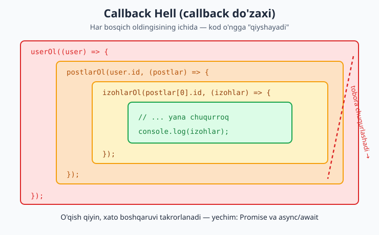
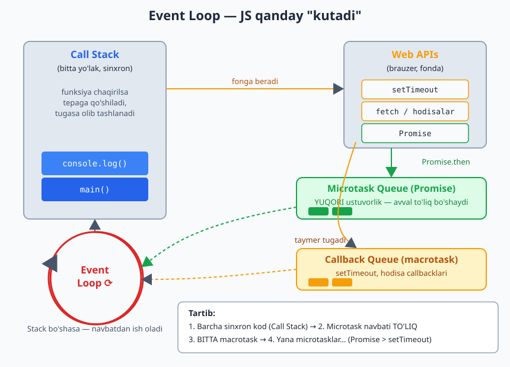
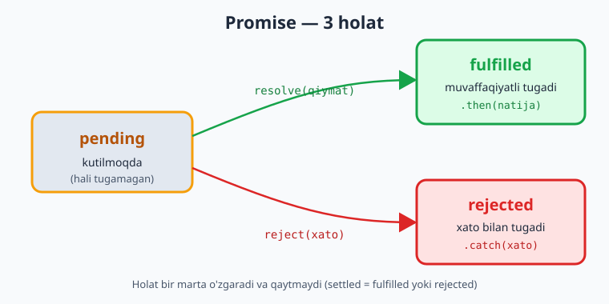
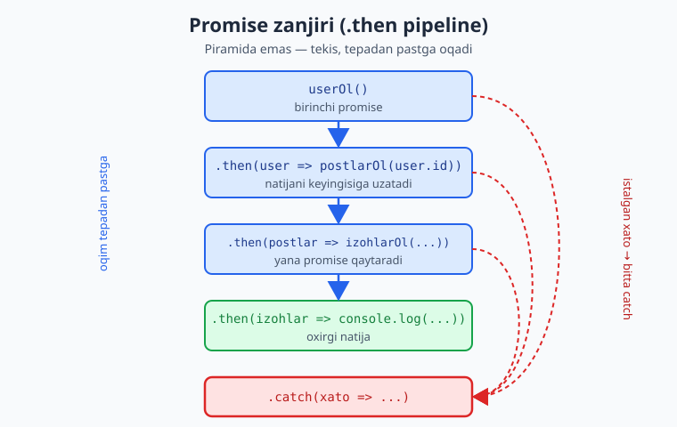
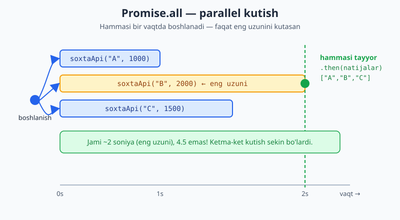

# JavaScript — 0 dan Expertgacha (O'zbek tilida)

📚 [README](./README.md) · [← 3-qism — Brauzer (DOM)](./javascript-qollanma-3-qism.md) · [Keyingi: 5-qism (1-bo'lim) — Chuqur JS →](./javascript-qollanma-5-qism-1.md)

> **4-QISM: ASINXRON JS**
> JS qanday "kutadi", server bilan qanday gaplashadi. Bu — eng muhim va eng ko'p chalkashtiradigan qism.
> Har bir moduldan keyin **20 ta masala** (yechimi bilan).

> 1-3 qismda JS darhol ishlaydigan kod yozdik. Lekin real hayotda biz **kutishimiz** kerak: serverdan javob, fayl yuklanishi, taymer. Bu — asinxron dunyosi.

---

## 🔑 Avval: JS bitta yo'lakli (single-threaded)

JS bir vaqtning o'zida **faqat bitta** ishni bajaradi. U "bitta oshpaz" kabi — bir vaqtda bir taom tayyorlaydi.

Muammo: agar serverdan ma'lumot so'rasak va u 3 soniya kutsa, JS shu 3 soniya **butun sahifani muzlatib** turishi kerakmi? Yo'q! Foydalanuvchi tugma bosa olmaydi, hech narsa ishlamaydi — bu dahshat.

Yechim: JS uzoq vaqt talab qiladigan ishni (taymer, server so'rovi) **fonga** beradi va keyingi koddan davom etadi. Ish tugagach, natijani qayta oladi. Mana shu — **asinxronlik**.

---

# 13-MODUL: Callbacks va Event Loop

## `setTimeout` — kechiktirish

Eng oddiy asinxron misol — biror amalni keyinroq bajarish:

```js
console.log("Boshlandi");

setTimeout(() => {
  console.log("2 soniyadan keyin");
}, 2000); // 2000 ms = 2 soniya

console.log("Tugadi");

// Natija:
// Boshlandi
// Tugadi          <- bu DARHOL chiqadi (kutmaydi!)
// 2 soniyadan keyin <- 2 soniyadan so'ng
```

> **Why diqqat:** `setTimeout` JS'ni **to'xtatib qo'ymaydi**. U "2 soniyadan keyin shu funksiyani ishga tushir" deb fonga beradi va keyingi qatorga o'tadi. Shuning uchun "Tugadi" "2 soniyadan keyin"dan oldin chiqadi.

## `setInterval` — takroriy bajarish

```js
let son = 0;
const id = setInterval(() => {
  son++;
  console.log(son);
  if (son === 5) clearInterval(id); // 5 da to'xtatamiz
}, 1000); // har 1 soniyada
```

`clearInterval(id)` / `clearTimeout(id)` — taymerni to'xtatadi. Shuning uchun taymerning `id`sini saqlab qol.

## Callback nima?

**Callback** — boshqa funksiyaga **argument sifatida uzatilgan** funksiya. "Ish tugagach, mana buni chaqir" degani. `setTimeout`ning birinchi argumenti — callback.

```js
function salomBer(ism, callback) {
  console.log(`Salom, ${ism}`);
  callback(); // ish tugagach chaqiramiz
}

salomBer("Oqil", () => {
  console.log("Callback ishladi");
});
```

> 5-modulda "higher-order function" ko'rgan eding — callback aynan shu. JS'da funksiya — qiymat, shuning uchun uni uzatish mumkin.

## Error-first callback (Node.js patterni)

Eski JS/Node kodida xato birinchi argument sifatida uzatiladi:

```js
function malumotOl(callback) {
  setTimeout(() => {
    const xato = null;
    const data = { ism: "Oqil" };
    callback(xato, data); // (xato, natija)
  }, 1000);
}

malumotOl((err, data) => {
  if (err) {
    console.log("Xato:", err);
    return;
  }
  console.log("Natija:", data);
});
```

## ⚠️ Callback Hell (callback do'zaxi)

Ketma-ket asinxron amallar kerak bo'lsa, callbacklar ichma-ich joylashib ketadi — o'qib bo'lmaydigan "piramida":

```js
malumotOl((err, user) => {
  postlarOl(user.id, (err, postlar) => {
    izohlarOl(postlar[0].id, (err, izohlar) => {
      // ... yana chuqurroq
      console.log(izohlar);
    });
  });
});
```

> **Why muammo:** Bu kod o'ngga "qiyshayib" ketadi, xatolarni boshqarish takrorlanadi, o'qish qiyin. Aynan shu muammoni hal qilish uchun **Promises** (14-modul) va **async/await** (15-modul) yaratilgan. Callbacklarni tushunish kerak, lekin yangi kodda Promise ishlat.



## 🧠 Event Loop — JS qanday "kutadi"

Bu — JS'ning eng muhim va eng chalkash tushunchasi. Diqqat bilan o'qi.

JS quyidagi qismlardan iborat:
1. **Call Stack** — joriy bajarilayotgan kod (sinxron). Bitta yo'lak.
2. **Web APIs** — brauzer beradigan "fon ishchilar": `setTimeout`, `fetch`, hodisalar. Ular **alohida** ishlaydi.
3. **Callback Queue** (macrotask) — `setTimeout`, hodisa callbacklari navbati.
4. **Microtask Queue** — **Promise** callbacklari navbati (yuqori ustuvorlikka ega).
5. **Event Loop** — "nazoratchi": Call Stack bo'shasa, navbatdan ish oladi.

**Qoidalar:**
- Avval **barcha sinxron kod** ishlaydi (Call Stack).
- Stack bo'shagach, Event Loop **avval Microtask navbatini to'liq** bo'shatadi (Promiselar).
- Keyin **bitta** Macrotask (`setTimeout`) oladi.
- Yana microtasklarni bo'shatadi, va hokazo.



**Klassik misol (intervyularda ko'p so'raladi):**

```js
console.log("1");

setTimeout(() => console.log("2"), 0); // macrotask

Promise.resolve().then(() => console.log("3")); // microtask

console.log("4");

// Natija: 1, 4, 3, 2
```

Nima uchun shunday:
```
1) "1" — sinxron, darhol
2) setTimeout -> Web API ga ketadi, callback navbatga qo'yiladi (macrotask)
3) Promise.then -> microtask navbatga
4) "4" — sinxron, darhol
--- sinxron kod tugadi, Call Stack bo'sh ---
5) Microtask navbati: "3" chiqadi (Promise macrotask'dan ustun!)
6) Macrotask navbati: "2" chiqadi
```

> **Why bu muhim:** Bu tushuncha "nega Promise setTimeout'dan oldin ishladi?" degan savolga javob beradi. Microtask (Promise) doim macrotask (`setTimeout`)'dan oldin bajariladi. `setTimeout(fn, 0)` ham "darhol" emas — sinxron kod va microtasklardan keyin ishlaydi.

## Klassik tuzoq: `var` sikl ichida (`let` bilan tuzatish)

```js
// ❌ var bilan — hammasi 3 chiqaradi:
for (var i = 0; i < 3; i++) {
  setTimeout(() => console.log(i), 100); // 3, 3, 3
}

// ✅ let bilan — to'g'ri:
for (let i = 0; i < 3; i++) {
  setTimeout(() => console.log(i), 100); // 0, 1, 2
}
```

> **Why:** `var` butun siklda **bitta** `i`ni ishlatadi. Taymer ishlaganda sikl allaqachon tugagan (`i=3`). `let` esa har takrorda **yangi** `i` yaratadi. Bu — `var`ni ishlatmaslikning yana bir sababi (1-modulda aytilgandek).

---

## 📝 13-modul masalalari (20 ta)

1. `setTimeout` bilan 2 soniyadan keyin "Salom" chiqaring.
2. "Boshlandi", `setTimeout("o'rtada", 0)`, "Tugadi" — qaysi tartibda chiqadi?
3. `console.log("1")`, `setTimeout(..."2"..., 1000)`, `console.log("3")` tartibini bashorat qiling.
4. `setInterval` bilan har soniyada son chiqaring.
5. `clearInterval` bilan 5 ta sanagandan keyin to'xtating.
6. `setTimeout` ni ishga tushirib, darhol `clearTimeout` bilan bekor qiling.
7. `salomBer(ism, callback)` funksiyasi yozing — salom aytib, callbackni chaqirsin.
8. `[1,2,3]` har elementi uchun callback chaqiruvchi `harBiri(arr, cb)` yozing.
9. Ketma-ket 3 ta `setTimeout` (callback ichida callback) yozing.
10. Funksiya ishini tugatib, callbackni chaqirsin (natijani uzatib).
11. **Event loop:** `1`, `setTimeout 2`, `Promise.then 3`, `4` — tartibni yozing.
12. Uchta `setTimeout` (300ms, 100ms, 200ms) — qaysi tartibda chiqadi?
13. `setTimeout` zanjiri bilan 1 dan 3 gacha har soniyada sanang.
14. Soxta fetch: `setTimeout` ichida `{ism:"Oqil"}` ni callbackka uzating.
15. Error-first callback: `cb(err, data)` patternini ishlatib, xato holatini boshqaring.
16. Sinxron va asinxron kod farqini bitta misolda ko'rsating.
17. `var` bilan sikl ichida `setTimeout` muammosini ko'rsating, keyin `let` bilan tuzating.
18. `queueMicrotask` bilan microtask qo'shing va `setTimeout`dan oldin chiqishini ko'ring.
19. **Callback hell:** 3 darajali ichma-ich callback yozing (user → postlar → izohlar).
20. **Murakkab:** 18-masaladagi callback hell'ni yozib, har bosqichni izohlang. (Keyingi modulda buni Promise bilan tozalaymiz.)

<details markdown="1">
<summary>► Yechimlar</summary>

```js
// 1
setTimeout(() => console.log("Salom"), 2000);

// 2 -> Boshlandi, Tugadi, o'rtada
console.log("Boshlandi");
setTimeout(() => console.log("o'rtada"), 0);
console.log("Tugadi");

// 3 -> 1, 3, 2
console.log("1");
setTimeout(() => console.log("2"), 1000);
console.log("3");

// 4
let s4 = 0;
const id4 = setInterval(() => console.log(++s4), 1000);
// (to'xtatish uchun: clearInterval(id4))

// 5
let s5 = 0;
const id5 = setInterval(() => {
  console.log(++s5);
  if (s5 === 5) clearInterval(id5);
}, 1000);

// 6
const t6 = setTimeout(() => console.log("ishlamaydi"), 1000);
clearTimeout(t6); // bekor qilindi

// 7
function salomBer(ism, callback) {
  console.log(`Salom, ${ism}`);
  callback();
}
salomBer("Oqil", () => console.log("tugadi"));

// 8
function harBiri(arr, cb) {
  for (const el of arr) cb(el);
}
harBiri([1, 2, 3], n => console.log(n * 10));

// 9
setTimeout(() => {
  console.log("1");
  setTimeout(() => {
    console.log("2");
    setTimeout(() => console.log("3"), 500);
  }, 500);
}, 500);

// 10
function ishBajar(callback) {
  const natija = 2 + 2;
  callback(natija);
}
ishBajar(r => console.log("Natija:", r)); // 4

// 11 -> 1, 4, 3, 2
console.log("1");
setTimeout(() => console.log("2"), 0);
Promise.resolve().then(() => console.log("3"));
console.log("4");

// 12 -> 100, 200, 300 (vaqt bo'yicha, kod tartibida emas)
setTimeout(() => console.log("300"), 300);
setTimeout(() => console.log("100"), 100);
setTimeout(() => console.log("200"), 200);

// 13
function sana(n) {
  if (n > 3) return;
  setTimeout(() => {
    console.log(n);
    sana(n + 1);
  }, 1000);
}
sana(1);

// 14
function soxtaFetch(callback) {
  setTimeout(() => callback({ ism: "Oqil" }), 1000);
}
soxtaFetch(data => console.log(data));

// 15
function malumotOl(cb) {
  setTimeout(() => {
    const xato = null; // xato bo'lsa: "Server xatosi"
    cb(xato, { ism: "Oqil" });
  }, 1000);
}
malumotOl((err, data) => {
  if (err) return console.log("Xato:", err);
  console.log("Data:", data);
});

// 16
console.log("Sinxron 1");
setTimeout(() => console.log("Asinxron"), 0);
console.log("Sinxron 2");
// Sinxron 1, Sinxron 2, Asinxron

// 17
for (var i = 0; i < 3; i++) setTimeout(() => console.log("var:", i), 10); // 3,3,3
for (let j = 0; j < 3; j++) setTimeout(() => console.log("let:", j), 10); // 0,1,2

// 18 -> microtask setTimeout'dan oldin
setTimeout(() => console.log("macrotask"), 0);
queueMicrotask(() => console.log("microtask"));
// microtask, macrotask

// 19 & 20 — callback hell
function userOl(cb) { setTimeout(() => cb({ id: 1 }), 500); }
function postlarOl(userId, cb) { setTimeout(() => cb([{ id: 10 }]), 500); }
function izohlarOl(postId, cb) { setTimeout(() => cb(["Zo'r!"]), 500); }

userOl((user) => {
  postlarOl(user.id, (postlar) => {
    izohlarOl(postlar[0].id, (izohlar) => {
      console.log(izohlar); // ["Zo'r!"]
      // Diqqat: kod o'ngga qiyshayib ketdi -> callback hell
    });
  });
});
```
</details>

---

# 14-MODUL: Promises

## Promise nima?

**Promise** ("va'da") — kelajakda **tugaydigan amal natijasini** ifodalovchi obyekt. "Hozir natija yo'q, lekin keyinroq beraman (yoki xato chiqaraman)" degan va'da.

Promise 3 holatda bo'ladi:
- **pending** — kutilmoqda (hali tugamagan)
- **fulfilled** — muvaffaqiyatli tugadi (`resolve` chaqirildi)
- **rejected** — xato bilan tugadi (`reject` chaqirildi)



## Promise yaratish

```js
const vada = new Promise((resolve, reject) => {
  // asinxron ish...
  const muvaffaqiyat = true;

  if (muvaffaqiyat) {
    resolve("Hammasi yaxshi"); // -> fulfilled
  } else {
    reject("Xato yuz berdi");  // -> rejected
  }
});
```

## `.then()`, `.catch()`, `.finally()`

Promise natijasini olish:

```js
vada
  .then(natija => {
    console.log("Muvaffaqiyat:", natija); // resolve qiymati
  })
  .catch(xato => {
    console.log("Xato:", xato); // reject qiymati
  })
  .finally(() => {
    console.log("Har holda ishlaydi"); // ikkalasida ham
  });
```

- **`.then`** — promise muvaffaqiyatli bo'lsa.
- **`.catch`** — xato bo'lsa.
- **`.finally`** — natijadan qat'i nazar (tozalash uchun, masalan loading'ni o'chirish).

## Amaliy: `kechikish` funksiyasi (bularni mashqlarda ishlatamiz)

```js
function kechikish(ms) {
  return new Promise(resolve => setTimeout(resolve, ms));
}

kechikish(2000).then(() => console.log("2 soniya o'tdi"));
```

Soxta API (tarmoqsiz mashq qilish uchun):

```js
function soxtaApi(data, ms = 1000) {
  return new Promise((resolve) => {
    setTimeout(() => resolve(data), ms);
  });
}

soxtaApi({ ism: "Oqil" }).then(user => console.log(user));
```

## Promise zanjiri (Chaining) — callback hell'ning yechimi

`.then` ichida **yana promise qaytarsang**, ular ketma-ket bajariladi — piramida emas, **tekis** zanjir:

```js
userOl()
  .then(user => postlarOl(user.id))   // user.id ni keyingisiga uzatadi
  .then(postlar => izohlarOl(postlar[0].id))
  .then(izohlar => console.log(izohlar))
  .catch(xato => console.log("Xato:", xato)); // BITTA catch hammasini ushlaydi
```

> **Why zanjir yaxshiroq:** Callback hell'dagi o'ngga qiyshayish yo'qoladi — kod tepadan pastga, o'qish oson. Eng muhimi: bitta `.catch` butun zanjirdagi har qanday xatoni ushlaydi (callbacklarda har bosqichda alohida tekshirish kerak edi).



## `.then` ichida qiymat o'zgartirish

Har `.then` qaytargan qiymat keyingisiga uzatiladi:

```js
soxtaApi(5)
  .then(x => x * 2)   // 10
  .then(x => x + 1)   // 11
  .then(x => console.log(x)); // 11
```

## `Promise.all` — bir nechtasini parallel kutish

Bir nechta promise'ni **bir vaqtda** ishga tushirib, hammasi tugashini kutish:

```js
Promise.all([
  soxtaApi("A", 1000),
  soxtaApi("B", 2000),
  soxtaApi("C", 1500),
]).then(natijalar => {
  console.log(natijalar); // ["A", "B", "C"] — massiv
});
// Jami ~2 soniya (eng uzuni), 4.5 emas! Chunki PARALLEL.
```

> **Why `Promise.all`:** Agar 3 ta mustaqil so'rov bo'lsa, ularni ketma-ket kutish (`await` birin-ketin) sekin — vaqtlar qo'shiladi. `Promise.all` hammasini **bir vaqtda** boshlaydi, faqat eng uzunini kutasan. Backend'ga bir nechta mustaqil so'rov yuborganda buni ishlat.



**Diqqat:** `Promise.all` — agar **bittasi** xato bersa, **butun** zanjir rad etiladi (fail-fast).

## `Promise.allSettled` — hammasi (xato bo'lsa ham)

Hatto ba'zilari xato bersa ham, hammasining natijasini ko'rmoqchi bo'lsang:

```js
Promise.allSettled([
  soxtaApi("A"),
  Promise.reject("Xato!"),
]).then(natijalar => {
  console.log(natijalar);
  // [{status:"fulfilled", value:"A"}, {status:"rejected", reason:"Xato!"}]
});
```

## `Promise.race` — birinchi tugagani

Qaysi promise birinchi tugasa (resolve YOKI reject), o'shani oladi:

```js
Promise.race([
  soxtaApi("Tez", 500),
  soxtaApi("Sekin", 3000),
]).then(natija => console.log(natija)); // "Tez"
```

`Promise.race`ning amaliy ishlatilishi — **timeout**: API yoki vaqt tugashi, qaysi biri oldin kelsa:

```js
function timeout(ms) {
  return new Promise((_, reject) =>
    setTimeout(() => reject("Vaqt tugadi"), ms)
  );
}

Promise.race([soxtaApi("data", 5000), timeout(2000)])
  .then(d => console.log(d))
  .catch(e => console.log(e)); // "Vaqt tugadi" (2s < 5s)
```

> **Eslatma:** `Promise.any` ham bor — birinchi **muvaffaqiyatli** tugaganini oladi (rejectlarni e'tiborsiz qoldiradi). `race` esa birinchi tugaganni (xato bo'lsa ham) oladi.

---

## 📝 14-modul masalalari (20 ta)

> Mashqlar uchun: `const kechikish = ms => new Promise(r => setTimeout(r, ms));`
> va `const soxtaApi = (data, ms=1000) => new Promise(r => setTimeout(() => r(data), ms));`

1. `resolve` bilan oddiy Promise yarating va `.then` bilan oling.
2. `reject` bilan Promise yarating va `.catch` bilan ushlang.
3. `.then`, `.catch`, `.finally` uchchalasini ham ishlating.
4. `kechikish(ms)` funksiyasini o'zingiz yozing.
5. `kechikish(1000).then(...)` bilan 1 soniyadan keyin xabar chiqaring.
6. Shartli Promise: tasodifiy `Math.random() > 0.5` bo'lsa resolve, aks holda reject.
7. `Promise.resolve(42)` ni `.then` bilan oling.
8. `soxtaApi({ism:"Oqil"})` natijasini oling.
9. `.then` zanjiri: `5` ni olib, `*2`, `+1`, keyin chiqaring.
10. `.then` ichida yangi promise qaytarib, zanjir hosil qiling.
11. `Promise.all` bilan 3 ta `soxtaApi`ni parallel oling.
12. `Promise.all`da bittasi reject bo'lsa nima bo'ladi — sinab ko'ring.
13. `Promise.race` bilan tez va sekin orasidan tezni oling.
14. `Promise.allSettled` bilan muvaffaqiyat + xatoni birga oling.
15. Zanjirning o'rtasida xato tashlab (`throw`), oxirgi `.catch`da ushlang.
16. Promise zanjirida user → postlar → natijani uzating (callback hell'siz).
17. `timeout(ms)` funksiyasi yozing (ms dan keyin reject qiladigan).
18. `Promise.race([soxtaApi(..5000..), timeout(2000)])` bilan timeout patternini quring.
19. Ketma-ket (sequential) 3 ta promise: birini kutib, keyingisini boshlang.
20. **Murakkab:** 3 ta foydalanuvchini (`soxtaApi`) **parallel** olib, ularning ismlarini bitta massivga yig'ing.

<details markdown="1">
<summary>► Yechimlar</summary>

```js
const kechikish = ms => new Promise(r => setTimeout(r, ms));
const soxtaApi = (data, ms = 1000) => new Promise(r => setTimeout(() => r(data), ms));

// 1
new Promise(resolve => resolve("OK")).then(x => console.log(x));

// 2
new Promise((_, reject) => reject("Xato")).catch(e => console.log(e));

// 3
soxtaApi("data")
  .then(d => console.log("then:", d))
  .catch(e => console.log("catch:", e))
  .finally(() => console.log("finally"));

// 4
function kechikish4(ms) {
  return new Promise(resolve => setTimeout(resolve, ms));
}

// 5
kechikish(1000).then(() => console.log("1 soniya o'tdi"));

// 6
new Promise((resolve, reject) => {
  Math.random() > 0.5 ? resolve("Omad") : reject("Omadsizlik");
}).then(x => console.log(x)).catch(e => console.log(e));

// 7 -> 42
Promise.resolve(42).then(x => console.log(x));

// 8
soxtaApi({ ism: "Oqil" }).then(u => console.log(u));

// 9 -> 11
soxtaApi(5).then(x => x * 2).then(x => x + 1).then(x => console.log(x));

// 10
soxtaApi(1)
  .then(x => soxtaApi(x + 10))
  .then(x => console.log(x)); // 11

// 11
Promise.all([soxtaApi("A"), soxtaApi("B"), soxtaApi("C")])
  .then(r => console.log(r)); // ["A","B","C"]

// 12 -> butun all reject bo'ladi
Promise.all([soxtaApi("A"), Promise.reject("Xato")])
  .then(r => console.log(r))
  .catch(e => console.log("all xato:", e)); // "all xato: Xato"

// 13 -> "Tez"
Promise.race([soxtaApi("Tez", 500), soxtaApi("Sekin", 2000)])
  .then(r => console.log(r));

// 14
Promise.allSettled([soxtaApi("A"), Promise.reject("E")])
  .then(r => console.log(r));

// 15
soxtaApi(5)
  .then(x => { if (x === 5) throw new Error("5 bo'lmasin"); return x; })
  .then(x => console.log(x))
  .catch(e => console.log("Ushlandi:", e.message));

// 16
const userOl = () => soxtaApi({ id: 1 });
const postlarOl = id => soxtaApi([`post-${id}`]);
userOl()
  .then(user => postlarOl(user.id))
  .then(postlar => console.log(postlar))
  .catch(e => console.log(e));

// 17
function timeout(ms) {
  return new Promise((_, reject) => setTimeout(() => reject("Vaqt tugadi"), ms));
}

// 18
Promise.race([soxtaApi("data", 5000), timeout(2000)])
  .then(d => console.log(d))
  .catch(e => console.log(e)); // "Vaqt tugadi"

// 19 — ketma-ket
soxtaApi("1", 500)
  .then(r => { console.log(r); return soxtaApi("2", 500); })
  .then(r => { console.log(r); return soxtaApi("3", 500); })
  .then(r => console.log(r));

// 20
Promise.all([
  soxtaApi({ ism: "Ali" }),
  soxtaApi({ ism: "Vali" }),
  soxtaApi({ ism: "Hasan" }),
]).then(users => {
  const ismlar = users.map(u => u.ism);
  console.log(ismlar); // ["Ali","Vali","Hasan"]
});
```
</details>

---

# 15-MODUL: async / await

## `async`/`await` nima?

`async`/`await` — Promise'larni ishlatishning **zamonaviy va toza** usuli. U Promise ustiga "shirin qobiq" (syntactic sugar) — asinxron kodni **sinxrondek** o'qishga imkon beradi.

```js
// Promise (.then bilan):
function ol() {
  soxtaApi("data").then(d => console.log(d));
}

// async/await bilan (xuddi shu, lekin tozaroq):
async function ol() {
  const d = await soxtaApi("data");
  console.log(d);
}
```

## `await` — natijani "kutish"

`await` Promise tugashini kutadi va **natijasini** qaytaradi. Kod xuddi pastga oqayotgandek o'qiladi:

```js
async function malumot() {
  console.log("Boshlandi");
  const user = await soxtaApi({ ism: "Oqil" }); // promise tugashini kutadi
  console.log(user.ism); // "Oqil"
  console.log("Tugadi");
}
```

**Ikki muhim qoida:**
- `await` faqat `async` funksiya **ichida** ishlaydi.
- `async` funksiya **doim Promise qaytaradi** (sen `return` qilgan qiymat avtomatik Promise'ga o'raladi).

```js
async function son() {
  return 42; // aslida Promise<42> qaytaradi
}
son().then(x => console.log(x)); // 42
```

## Xatoni `try/catch` bilan ushlash

Promise'dagi `.catch` o'rniga, `async/await`da oddiy `try/catch` ishlatasan:

```js
async function malumot() {
  try {
    const data = await soxtaApi("data");
    console.log(data);
  } catch (xato) {
    console.log("Xato yuz berdi:", xato);
  } finally {
    console.log("Tozalash");
  }
}
```

> **Why try/catch yaxshiroq:** Bu — oddiy sinxron koddagidek xato boshqaruvi. `.then().catch()` zanjiridan ko'ra tabiiyroq va bir nechta `await`ni bitta `try` blokida o'rab olasan.

## Callback hell → async/await (taqqoslash)

Eslab ko'r, 13-modulda callback hell shunday edi:
```js
userOl((user) => {
  postlarOl(user.id, (postlar) => {
    izohlarOl(postlar[0].id, (izohlar) => {
      console.log(izohlar);
    });
  });
});
```

`async/await` bilan **bir xil mantiq**, lekin tekis va o'qilishi oson:
```js
async function hammasi() {
  const user = await userOl();
  const postlar = await postlarOl(user.id);
  const izohlar = await izohlarOl(postlar[0].id);
  console.log(izohlar);
}
```

> Mana shu — async dunyodagi eng katta yutuq. Bir xil ish, lekin sinxron koddek o'qiladi.

## ⚠️ Ketma-ket vs Parallel (eng ko'p uchraydigan xato)

```js
// ❌ SEKIN — ketma-ket (jami ~3 soniya):
async function sekin() {
  const a = await soxtaApi("A", 1000);
  const b = await soxtaApi("B", 1000);
  const c = await soxtaApi("C", 1000);
  return [a, b, c];
}

// ✅ TEZ — parallel (jami ~1 soniya):
async function tez() {
  const [a, b, c] = await Promise.all([
    soxtaApi("A", 1000),
    soxtaApi("B", 1000),
    soxtaApi("C", 1000),
  ]);
  return [a, b, c];
}
```

> **Why diqqat (juda muhim):** So'rovlar **bir-biriga bog'liq bo'lmasa** (B uchun A ning natijasi kerak emas), `await`ni ketma-ket yozma — vaqt behuda ketadi. `Promise.all` bilan parallel ishlat. Faqat keyingisi avvalgisining natijasiga **bog'liq** bo'lsa, ketma-ket `await` to'g'ri.

## `async` arrow funksiya

```js
const ol = async () => {
  const d = await soxtaApi("data");
  return d;
};
```

## `for` loop ichida `await`

```js
async function ketmaKet() {
  const idlar = [1, 2, 3];
  for (const id of idlar) {
    const data = await soxtaApi(`user-${id}`);
    console.log(data); // birin-ketin
  }
}
```

## `.map` + `async` (parallel)

`.map` ichida `await` ishlatsang, massiv Promise'lar massivini qaytaradi — `Promise.all` bilan o'rab ol:

```js
async function parallel() {
  const idlar = [1, 2, 3];
  const natijalar = await Promise.all(
    idlar.map(id => soxtaApi(`user-${id}`))
  );
  console.log(natijalar); // hammasi parallel
}
```

---

## 📝 15-modul masalalari (20 ta)

> Yana: `const soxtaApi = (data, ms=1000) => new Promise(r => setTimeout(() => r(data), ms));`

1. `async` funksiya yozing, ichida `await soxtaApi(...)` natijasini chiqaring.
2. `async` funksiya `return 42` qilsa, uni `.then` bilan oling (Promise qaytarishini ko'rsating).
3. `await kechikish(1000)` bilan 1 soniya kutib, keyin xabar chiqaring.
4. `try/catch` bilan reject bo'lgan promise'ni ushlang.
5. `try/catch/finally` uchchalasini ishlating.
6. `soxtaApi({ism:"Oqil"})` natijasidan `.ism` ni `await` bilan oling.
7. Ikki `await`ni ketma-ket yozing (biri tugagach ikkinchisi).
8. Birinchi `await` natijasini ikkinchisiga uzating (bog'liq).
9. `async` arrow funksiya yozing.
10. `for...of` ichida `await` bilan 3 ta so'rovni ketma-ket bajaring.
11. `Promise.all` + `await` bilan 3 ta so'rovni parallel bajaring.
12. **Vaqt farqi:** xuddi shu 3 so'rovni ketma-ket va parallel yozib, qaysi tezroq — izohlang.
13. `throw new Error(...)` bilan xato tashlab, `catch`da `.message`ni oling.
14. `.map` + `Promise.all` bilan idlar massividan parallel natija oling.
15. Shartli `await`: agar `x > 0` bo'lsa so'rov yuboring, aks holda yo'q.
16. `async` funksiyani boshqa `async` funksiya ichida `await` qiling.
17. `catch` ichida xatoni qayta tashlang (`throw`) va tashqarida ushlang.
18. Timeout: `Promise.race([soxtaApi(..3000..), timeout(1000)])` ni `await` qiling.
19. Loading holatini boshqaring: `try`dan oldin `loading=true`, `finally`da `false`.
20. **Murakkab:** `[1,2,3]` idlar uchun foydalanuvchilarni **parallel** olib, har birining `ism`ini chiqaring, va biror xato bo'lsa butun jarayonni `try/catch`da ushlang.

<details markdown="1">
<summary>► Yechimlar</summary>

```js
const kechikish = ms => new Promise(r => setTimeout(r, ms));
const soxtaApi = (data, ms = 1000) => new Promise(r => setTimeout(() => r(data), ms));
const timeout = ms => new Promise((_, rej) => setTimeout(() => rej(new Error("Vaqt tugadi")), ms));

// 1
async function f1() {
  const d = await soxtaApi("data");
  console.log(d);
}
f1();

// 2 -> 42
async function f2() { return 42; }
f2().then(x => console.log(x));

// 3
async function f3() {
  await kechikish(1000);
  console.log("1 soniya o'tdi");
}
f3();

// 4
async function f4() {
  try {
    await Promise.reject("Xato!");
  } catch (e) {
    console.log("Ushlandi:", e);
  }
}
f4();

// 5
async function f5() {
  try { await soxtaApi("ok"); console.log("ok"); }
  catch (e) { console.log(e); }
  finally { console.log("finally"); }
}
f5();

// 6
async function f6() {
  const u = await soxtaApi({ ism: "Oqil" });
  console.log(u.ism);
}
f6();

// 7
async function f7() {
  const a = await soxtaApi("A", 500);
  const b = await soxtaApi("B", 500);
  console.log(a, b);
}
f7();

// 8
async function f8() {
  const user = await soxtaApi({ id: 5 });
  const postlar = await soxtaApi([`post-${user.id}`]);
  console.log(postlar);
}
f8();

// 9
const f9 = async () => {
  const d = await soxtaApi("arrow");
  console.log(d);
};
f9();

// 10
async function f10() {
  for (const id of [1, 2, 3]) {
    console.log(await soxtaApi(`user-${id}`, 300));
  }
}
f10();

// 11
async function f11() {
  const r = await Promise.all([soxtaApi("A"), soxtaApi("B"), soxtaApi("C")]);
  console.log(r);
}
f11();

// 12
// Ketma-ket: 3x1000 = ~3s. Parallel (Promise.all): ~1s. Parallel tezroq,
// chunki so'rovlar bir vaqtda boshlanadi.

// 13
async function f13() {
  try { throw new Error("Maxsus xato"); }
  catch (e) { console.log(e.message); } // "Maxsus xato"
}
f13();

// 14
async function f14() {
  const r = await Promise.all([1, 2, 3].map(id => soxtaApi(`u-${id}`)));
  console.log(r);
}
f14();

// 15
async function f15(x) {
  if (x > 0) {
    const d = await soxtaApi("yuborildi");
    console.log(d);
  } else {
    console.log("So'rov yuborilmadi");
  }
}
f15(5);

// 16
async function ichki() { return await soxtaApi("ichki natija"); }
async function tashqi() {
  const r = await ichki();
  console.log(r);
}
tashqi();

// 17
async function f17() {
  try {
    try { throw new Error("birinchi"); }
    catch (e) { throw new Error("qayta: " + e.message); }
  } catch (e) { console.log(e.message); } // "qayta: birinchi"
}
f17();

// 18
async function f18() {
  try {
    const d = await Promise.race([soxtaApi("data", 3000), timeout(1000)]);
    console.log(d);
  } catch (e) { console.log(e.message); } // "Vaqt tugadi"
}
f18();

// 19
async function f19() {
  let loading = true;
  console.log("loading:", loading);
  try {
    const d = await soxtaApi("data");
    console.log(d);
  } finally {
    loading = false;
    console.log("loading:", loading);
  }
}
f19();

// 20
async function f20() {
  try {
    const users = await Promise.all(
      [1, 2, 3].map(id => soxtaApi({ id, ism: `User${id}` }))
    );
    users.forEach(u => console.log(u.ism));
  } catch (e) {
    console.log("Jarayon xatosi:", e);
  }
}
f20();
```
</details>

---

# 16-MODUL: Fetch API va REST

## REST API nima (qisqacha)?

Backend bilan ma'lumot almashishning eng keng tarqalgan usuli — **REST API**. Sen serverga **so'rov (request)** yuborasan, u **javob (response)** qaytaradi. Javob odatda **JSON** formatida.

**HTTP metodlari** (CRUD):
| Metod | Maqsad | Misol |
|-------|--------|-------|
| `GET` | O'qish | foydalanuvchini olish |
| `POST` | Yaratish | yangi post qo'shish |
| `PUT`/`PATCH` | Yangilash | postni tahrirlash |
| `DELETE` | O'chirish | postni o'chirish |

**Status kodlari** (server javobining holati):
| Kod | Ma'no |
|-----|-------|
| 200 | OK (muvaffaqiyat) |
| 201 | Created (yaratildi) |
| 400 | Bad Request (so'rov xato) |
| 401 | Unauthorized (ruxsat yo'q) |
| 404 | Not Found (topilmadi) |
| 500 | Server Error (server xatosi) |

> Sen backend (Laravel) yozasan — bu kodlar tanish. Frontend tomonida `response.status` orqali shularni tekshirasan.

## `fetch` — so'rov yuborish

`fetch` Promise qaytaradi. Shuning uchun `await` yoki `.then` bilan ishlatamiz.

Mashqlar uchun bepul test API: **`https://jsonplaceholder.typicode.com`** (haqiqiy so'rovlar yuborsa bo'ladi).

### GET (`.then` bilan)

```js
fetch("https://jsonplaceholder.typicode.com/posts/1")
  .then(response => response.json()) // javobni JSON qilib o'qiymiz
  .then(data => console.log(data))
  .catch(error => console.log("Xato:", error));
```

### GET (`async/await` bilan — tavsiya etiladi)

```js
async function postOl() {
  const response = await fetch("https://jsonplaceholder.typicode.com/posts/1");
  const data = await response.json();
  console.log(data);
}
```

> **Why ikki `await`:** Birinchi `await fetch(...)` — server javobini (headerlar, status) oladi. Ikkinchi `await response.json()` — javob **tanasini** (body) o'qib, JSON'ga aylantiradi. `response.json()` ham Promise qaytaradi, shuning uchun yana `await`.

## `response.ok` va xato boshqaruvi (muhim!)

⚠️ **Tuzoq:** `fetch` 404 yoki 500 kabi xatolarda ham `.catch`ga **tushmaydi**! U faqat tarmoq uzilganda xato beradi. Server xatosini **o'zing** tekshirishing kerak:

```js
async function postOl(id) {
  try {
    const response = await fetch(`https://jsonplaceholder.typicode.com/posts/${id}`);

    if (!response.ok) {
      // 404, 500 va h.k. shu yerda ushlanadi
      throw new Error(`Server xatosi: ${response.status}`);
    }

    const data = await response.json();
    return data;
  } catch (error) {
    console.log("Xato:", error.message);
  }
}
```

> **Why bu muhim:** Bu — junior'lar 100% kalishadigan joy. `fetch` "muvaffaqiyat" deb hisoblaydi, agar server **javob bersa** — javob 404 bo'lsa ham. Shuning uchun `if (!response.ok) throw ...` shart. `response.ok` — status 200-299 bo'lsa `true`.

## POST — ma'lumot yuborish

```js
async function postYarat() {
  const response = await fetch("https://jsonplaceholder.typicode.com/posts", {
    method: "POST",
    headers: {
      "Content-Type": "application/json", // JSON yuborayotganimizni aytamiz
    },
    body: JSON.stringify({       // obyektni JSON matnga aylantiramiz
      title: "Yangi post",
      body: "Matn",
      userId: 1,
    }),
  });

  const data = await response.json();
  console.log(data); // server qaytargan yangi obyekt (id bilan)
}
```

**POST/PUT uchun 3 narsa kerak:**
1. `method: "POST"`
2. `headers` — `"Content-Type": "application/json"`
3. `body: JSON.stringify(obyekt)` — **doim** stringify qil

## PUT (yangilash) va DELETE (o'chirish)

```js
// PUT — to'liq yangilash
await fetch("https://jsonplaceholder.typicode.com/posts/1", {
  method: "PUT",
  headers: { "Content-Type": "application/json" },
  body: JSON.stringify({ id: 1, title: "Yangilangan" }),
});

// DELETE
await fetch("https://jsonplaceholder.typicode.com/posts/1", {
  method: "DELETE",
});
```

## Query parametrlari

```js
// userId=1 bo'lgan postlar:
const response = await fetch("https://jsonplaceholder.typicode.com/posts?userId=1");
const data = await response.json();
console.log(data.length);
```

## Fetch + DOM (real loyiha namunasi)

```html
<button id="yukla">Postlarni yuklash</button>
<p id="holat"></p>
<ul id="royxat"></ul>
<script>
  const holat = document.querySelector("#holat");
  const ul = document.querySelector("#royxat");

  document.querySelector("#yukla").addEventListener("click", async () => {
    holat.textContent = "Yuklanmoqda..."; // loading holati
    ul.innerHTML = "";

    try {
      const res = await fetch("https://jsonplaceholder.typicode.com/posts?_limit=5");
      if (!res.ok) throw new Error(`Xato: ${res.status}`);

      const postlar = await res.json();
      postlar.forEach(post => {
        const li = document.createElement("li");
        li.textContent = post.title;
        ul.appendChild(li);
      });
      holat.textContent = ""; // loading'ni o'chiramiz
    } catch (error) {
      holat.textContent = "Xatolik: " + error.message; // xatoni ko'rsatamiz
    }
  });
</script>
```

> Mana bu — 3-qism (DOM, events) va 4-qism (async, fetch) ning birlashmasi. Real frontend ilovasi aynan shunday ishlaydi: tugma → loading → fetch → render → (xato bo'lsa) xabar.

---

## 📝 16-modul masalalari (20 ta)

> API: `https://jsonplaceholder.typicode.com` (`/posts`, `/posts/1`, `/users`, `/comments`).

1. `fetch` (`.then`) bilan `/posts/1` ni olib, `response.json()` qilib chiqaring.
2. Xuddi shuni `async/await` bilan qayta yozing.
3. `/posts/1` javobidan faqat `title`ni chiqaring.
4. `response.ok` ni tekshirib, `false` bo'lsa `throw` qiling.
5. `response.status` ni konsolga chiqaring.
6. `/posts` (barchasi) ni olib, nechta post borligini chiqaring.
7. `.map` bilan barcha postlardan faqat `title`larni ajratib oling.
8. `try/catch` bilan fetch xatosini ushlang.
9. Mavjud bo'lmagan URL (`/postss/1`) ga so'rov yuborib, xatoni ushlang (404).
10. `POST` bilan yangi post yarating (`title`, `body`, `userId`).
11. POST'da `headers` va `JSON.stringify(body)` ni to'g'ri qo'ying.
12. `PUT` bilan `/posts/1` ni yangilang.
13. `DELETE` bilan `/posts/1` ni o'chiring va `response.status`ni tekshiring.
14. Query param bilan `?userId=1` postlarini oling.
15. `?_limit=5` bilan faqat 5 ta post oling.
16. `Promise.all` bilan `/posts/1` va `/users/1` ni **parallel** oling.
17. **DOM:** postlarni `<ul>` ichida ro'yxat qilib chiqaring.
18. **DOM:** so'rovdan oldin "Yuklanmoqda..." ko'rsatib, tugagach o'chiring.
19. **DOM:** xato bo'lsa foydalanuvchiga ko'rinadigan xabar chiqaring.
20. **Murakkab:** `/users/1` ni va o'sha userning postlarini (`/posts?userId=1`) parallel olib, `"<Ism> — N ta post"` ko'rinishida DOM'da chiqaring.

<details markdown="1">
<summary>► Yechimlar</summary>

```js
const BASE = "https://jsonplaceholder.typicode.com";

// 1
fetch(`${BASE}/posts/1`)
  .then(res => res.json())
  .then(data => console.log(data))
  .catch(e => console.log(e));

// 2
async function f2() {
  const res = await fetch(`${BASE}/posts/1`);
  const data = await res.json();
  console.log(data);
}
f2();

// 3
async function f3() {
  const res = await fetch(`${BASE}/posts/1`);
  const data = await res.json();
  console.log(data.title);
}
f3();

// 4
async function f4() {
  const res = await fetch(`${BASE}/posts/1`);
  if (!res.ok) throw new Error(`Xato: ${res.status}`);
  console.log("OK");
}
f4();

// 5
async function f5() {
  const res = await fetch(`${BASE}/posts/1`);
  console.log(res.status); // 200
}
f5();

// 6
async function f6() {
  const res = await fetch(`${BASE}/posts`);
  const data = await res.json();
  console.log(data.length); // 100
}
f6();

// 7
async function f7() {
  const res = await fetch(`${BASE}/posts`);
  const postlar = await res.json();
  console.log(postlar.map(p => p.title));
}
f7();

// 8 & 9
async function f9() {
  try {
    const res = await fetch(`${BASE}/postss/1`); // noto'g'ri URL
    if (!res.ok) throw new Error(`Topilmadi: ${res.status}`);
    console.log(await res.json());
  } catch (e) {
    console.log("Xato ushlandi:", e.message); // 404
  }
}
f9();

// 10 & 11
async function f10() {
  const res = await fetch(`${BASE}/posts`, {
    method: "POST",
    headers: { "Content-Type": "application/json" },
    body: JSON.stringify({ title: "Yangi", body: "Matn", userId: 1 }),
  });
  console.log(await res.json()); // { id: 101, ... }
}
f10();

// 12
async function f12() {
  const res = await fetch(`${BASE}/posts/1`, {
    method: "PUT",
    headers: { "Content-Type": "application/json" },
    body: JSON.stringify({ id: 1, title: "Yangilangan", body: "...", userId: 1 }),
  });
  console.log(await res.json());
}
f12();

// 13
async function f13() {
  const res = await fetch(`${BASE}/posts/1`, { method: "DELETE" });
  console.log(res.status); // 200
}
f13();

// 14
async function f14() {
  const res = await fetch(`${BASE}/posts?userId=1`);
  console.log((await res.json()).length); // 10
}
f14();

// 15
async function f15() {
  const res = await fetch(`${BASE}/posts?_limit=5`);
  console.log((await res.json()).length); // 5
}
f15();

// 16
async function f16() {
  const [postRes, userRes] = await Promise.all([
    fetch(`${BASE}/posts/1`),
    fetch(`${BASE}/users/1`),
  ]);
  const post = await postRes.json();
  const user = await userRes.json();
  console.log(post.title, user.name);
}
f16();

// 17, 18, 19 — DOM (HTML: <button id="yukla">, <p id="holat">, <ul id="royxat">)
async function f17() {
  const holat = document.querySelector("#holat");
  const ul = document.querySelector("#royxat");
  holat.textContent = "Yuklanmoqda..."; // 18
  ul.innerHTML = "";
  try {
    const res = await fetch(`${BASE}/posts?_limit=5`);
    if (!res.ok) throw new Error(`Xato: ${res.status}`);
    const postlar = await res.json();
    postlar.forEach(p => {
      const li = document.createElement("li");
      li.textContent = p.title;
      ul.appendChild(li);
    });
    holat.textContent = "";
  } catch (e) {
    holat.textContent = "Xatolik: " + e.message; // 19
  }
}
document.querySelector("#yukla")?.addEventListener("click", f17);

// 20 — Murakkab
async function f20() {
  const royxat = document.querySelector("#royxat");
  try {
    const [userRes, postRes] = await Promise.all([
      fetch(`${BASE}/users/1`),
      fetch(`${BASE}/posts?userId=1`),
    ]);
    if (!userRes.ok || !postRes.ok) throw new Error("So'rov xatosi");

    const user = await userRes.json();
    const postlar = await postRes.json();

    const li = document.createElement("li");
    li.textContent = `${user.name} — ${postlar.length} ta post`;
    royxat.appendChild(li);
  } catch (e) {
    console.log(e.message);
  }
}
f20();
```
</details>

---

## ✅ 4-qism yakuni

Endi sen asinxron JS'ni tushunasan — bu frontend va backend (Node) ishining yuragi:
- **Event Loop** — JS qanday "kutadi" (Call Stack, microtask vs macrotask)
- **Callbacks** va callback hell muammosi
- **Promises** — `.then`/`.catch`, zanjir, `Promise.all`/`race`/`allSettled`
- **`async`/`await`** — toza, sinxrondek o'qiladigan kod + `try/catch`
- **Fetch API** — real server bilan ishlash, `response.ok` tuzog'i, POST/PUT/DELETE

Eng muhim 3 ta xulosa:
1. **Promise (microtask) doim `setTimeout` (macrotask)dan oldin** ishlaydi.
2. **`fetch` xato statuslarda `.catch`ga tushmaydi** — `if (!response.ok) throw` shart.
3. **Mustaqil so'rovlarni `Promise.all` bilan parallel** qil, ketma-ket `await` qilma.

### Keyingi qadam (5-qism) — Chuqur JS
Bu yerda JS'ning "ostki qavatiga" tushamiz — buni bilgan dasturchini junior'dan ajratadi:
- **Scope, Closures, Hoisting** — `var`/`let` nega farq qiladi, closure nima
- **`this`** — JS'ning eng chalkash mavzusi, nihoyat to'liq ochiladi
- **Prototypes** va inheritance — JS qanday "meros" oladi
- **Classes** (ES6) — zamonaviy OOP
- **ES6+** — destructuring, spread, modullar, optional chaining (chuqurroq)

> **Maslahat:** 5-qismga o'tishdan oldin 16-modulning #20-masalasini noldan yoz. Fetch + Promise.all + DOM + try/catch — bularning hammasi bitta joyda. Bu — real ish.

---

📚 [README](./README.md) · [← 3-qism — Brauzer (DOM)](./javascript-qollanma-3-qism.md) · [Keyingi: 5-qism (1-bo'lim) — Chuqur JS →](./javascript-qollanma-5-qism-1.md)
